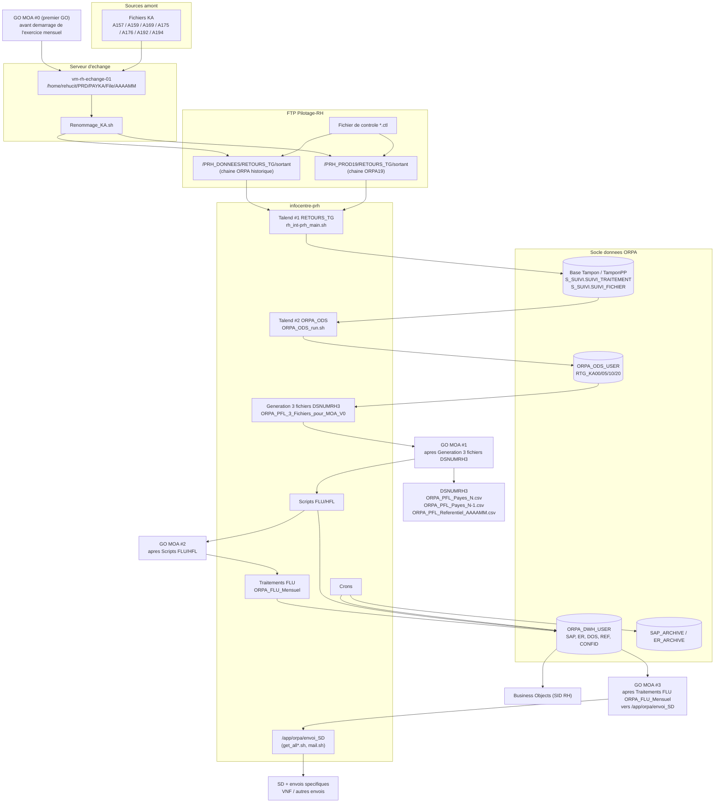

```mermaid
flowchart TB
  subgraph SRC["Sources amont"]
    KA["Fichiers KA<br/>A157 / A159 / A169 / A175 / A176 / A192 / A194"]
  end

  subgraph EXCH["Serveur d'echange"]
    RHX["vm-rh-echange-01<br/>/home/rehucit/PRD/PAYKA/File/AAAAMM"]
    RENO["Renommage_KA.sh"]
  end

  subgraph FTP["FTP Pilotage-RH"]
    FTP11["/PRH_DONNEES/RETOURS_TG/sortant<br/>(chaine ORPA historique)"]
    FTP19["/PRH_PROD19/RETOURS_TG/sortant<br/>(chaine ORPA19)"]
    CTL["Fichier de controle *.ctl"]
  end

  subgraph ORPA["infocentre-prh"]
    TAL1["Talend #1 RETOURS_TG<br/>rh_int-prh_main.sh"]
    TAL2["Talend #2 ORPA_ODS<br/>ORPA_ODS_run.sh"]
    SCRIPTS["Scripts FLU/HFL"]
    CRONS["Crons"]
    FLU["Traitements FLU<br/>ORPA_FLU_Mensuel"]
    PFL3["Generation 3 fichiers DSNUMRH3<br/>ORPA_PFL_3_Fichiers_pour_MOA_V0"]
    ENVOI["/app/orpa/envoi_SD<br/>(get_all*.sh, mail.sh)"]
  end

  subgraph DB["Socle donnees ORPA"]
    TAMPON[("Base Tampon / TamponPP<br/>S_SUIVI.SUIVI_TRAITEMENT<br/>S_SUIVI.SUIVI_FICHIER")]
    ODS[("ORPA_ODS_USER<br/>RTG_KA00/05/10/20")]
    DWH[("ORPA_DWH_USER<br/>SAP, ER, DOS, REF, CONFID")]
    ARCH[("SAP_ARCHIVE / ER_ARCHIVE")]
  end

  BO["Business Objects (SID RH)"]
  GO0["GO MOA #0 (premier GO)<br/>avant demarrage de l'exercice mensuel"]
  GO1["GO MOA #1<br/>apres Generation 3 fichiers DSNUMRH3"]
  GO2["GO MOA #2<br/>apres Scripts FLU/HFL"]
  GO3["GO MOA #3<br/>apres Traitements FLU ORPA_FLU_Mensuel<br/>vers /app/orpa/envoi_SD"]
  DS3["DSNUMRH3<br/>ORPA_PFL_Payes_N.csv<br/>ORPA_PFL_Payes_N-1.csv<br/>ORPA_PFL_Referentiel_AAAAMM.csv"]
  EXT["SD + envois specifiques<br/>VNF / autres envois"]

  GO0 --> RHX
  KA --> RHX --> RENO --> FTP11
  RENO --> FTP19
  CTL --> FTP11
  CTL --> FTP19
  FTP11 --> TAL1
  FTP19 --> TAL1
  TAL1 --> TAMPON --> TAL2 --> ODS --> PFL3 --> GO1 --> SCRIPTS --> GO2 --> FLU --> DWH
  SCRIPTS --> DWH
  CRONS --> DWH
  CRONS --> ARCH
  DWH --> BO
  GO1 --> DS3
  DWH --> GO3 --> ENVOI --> EXT
```