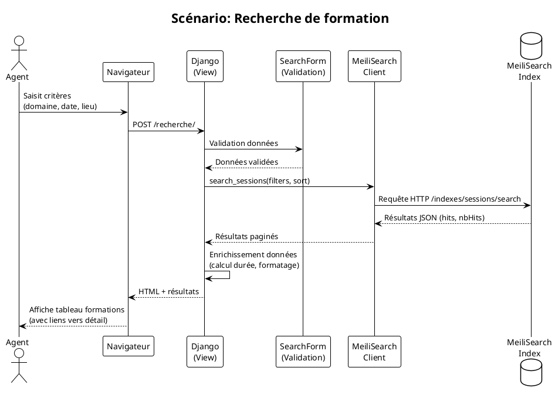
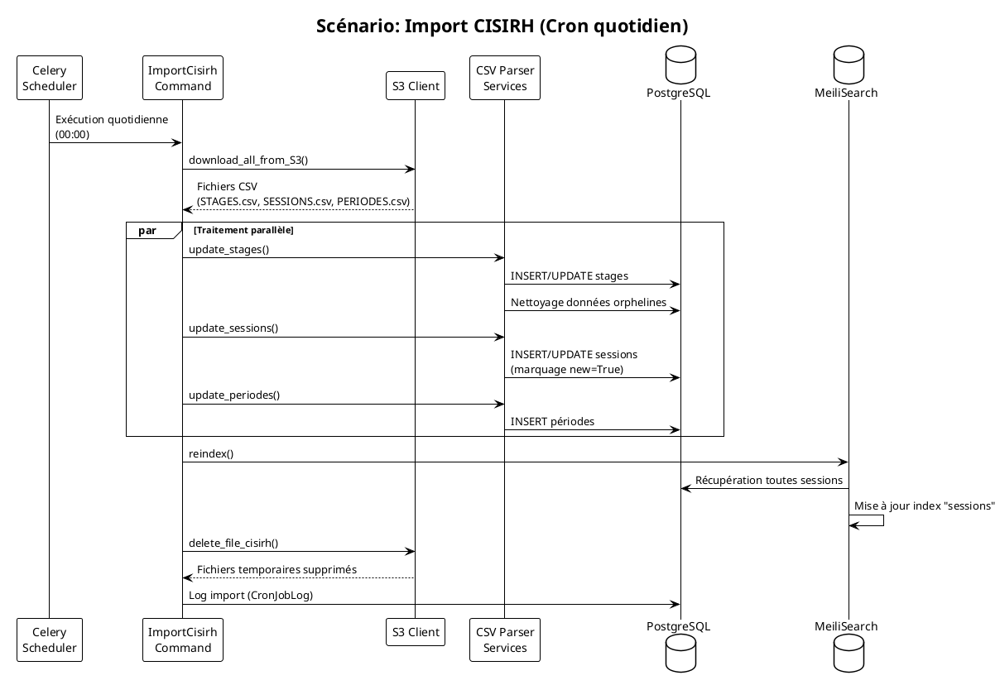
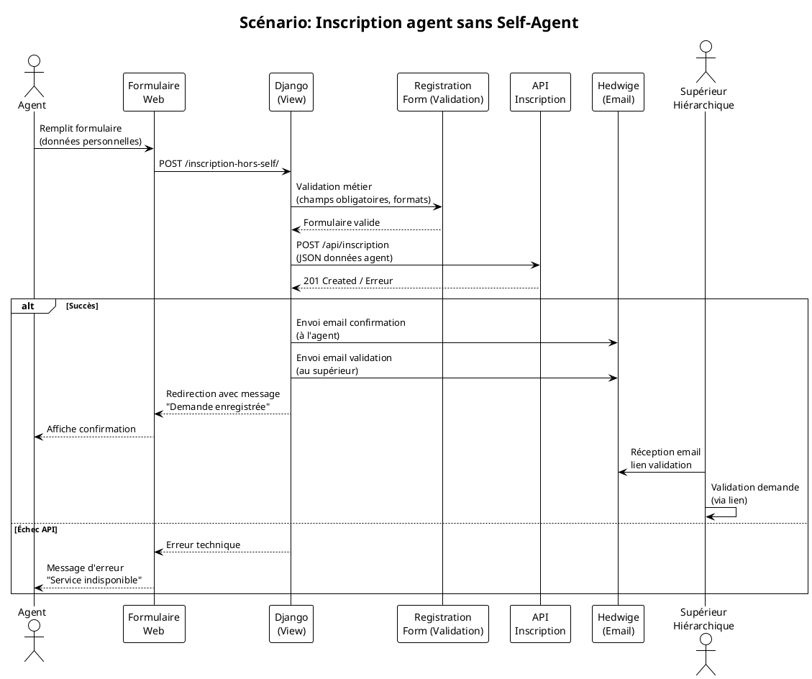

Je vais analyser le code source fourni pour générer un DAT (Dossier d'Architecture Technique) complet selon le modèle C4.

---

# Dossier d'Architecture Technique (DAT)
## Application Formation-Écologie

**[TOC]**

---

## 1. Introduction et objectifs

### Vue d'ensemble
Formation-Écologie est une application web Django permettant la gestion et la consultation de l'offre de formation professionnelle du pôle ministériel MTE (Ministère de la Transition Écologique). L'application offre un portail de recherche de formations, un système d'abonnement par email, et des outils d'administration pour la gestion des contenus.

### Objectifs de qualité orientés utilisateur
1. **Accessibilité** : Conformité RGAA 4.1.2 (82,35% des critères respectés) pour garantir l'accès à tous les agents
2. **Performance** : Temps de réponse < 2s pour les recherches via indexation MeiliSearch
3. **Maintenabilité** : Architecture modulaire Django avec séparation claire des responsabilités
4. **Sécurité** : Authentification CAS, chiffrement AES-256 des sauvegardes, conformité RGS
5. **Disponibilité** : Hébergement cloud redondant avec supervision 24/7

---

## 2. Niveau 1 — Vue Contexte (System Context)

### Diagramme C4-L1

```plantuml
@startuml
!include https://raw.githubusercontent.com/plantuml-stdlib/C4-PlantUML/master/C4_Context.puml

LAYOUT_WITH_LEGEND()

Person(agent, "Agent MTE", "Agent du ministère ou extérieur recherchant une formation")
Person(admin, "Administrateur", "Gestionnaire de contenus et formations")
Person(superieur, "Supérieur hiérarchique", "Valide les demandes d'inscription")

System_Boundary(formation_eco, "Formation-Écologie") {
    System(app, "Application Formation-Écologie", "Portail de recherche et gestion des formations")
}

System_Ext(cisirh, "CISIRH", "Système source des données formations (exports CSV)")
System_Ext(self_agent, "Self Agent", "Portail RH pour inscription des agents internes")
System_Ext(api_inscription, "API Inscription", "Service externe pour inscription hors-self")
System_Ext(hedwige, "Hedwige", "Service d'envoi d'emails transactionnels")
System_Ext(cas, "CAS", "Central Authentication Service pour authentification")
System_Ext(meilisearch, "MeiliSearch", "Moteur de recherche full-text")
System_Ext(s3, "Stockage S3", "Stockage objet pour imports et médias")

Rel(agent, app, "Recherche formations, s'abonne", "HTTPS")
Rel(admin, app, "Gère contenus, articles", "HTTPS")
Rel(superieur, app, "Valide inscriptions", "Email")
Rel(app, cisirh, "Importe données formations", "CSV/S3")
Rel(app, self_agent, "Redirection inscription", "HTTPS")
Rel(app, api_inscription, "Soumet inscriptions", "REST/JSON")
Rel(app, hedwige, "Envoie emails", "REST/JSON")
Rel(app, cas, "Authentification", "CAS Protocol")
Rel(app, meilisearch, "Indexe et recherche", "HTTP/7700")
Rel(app, s3, "Stocke fichiers", "S3 API")

@enduml
```

### Acteurs principaux

| Acteur | Objectif principal |
|--------|-------------------|
| **Agent MTE** | Trouver et s'inscrire à une formation professionnelle adaptée |
| **Agent hors ministère** | S'inscrire via formulaire spécifique (sans accès Self Agent) |
| **Administrateur** | Gérer les articles, bandeaux d'accueil et abonnements |
| **Supérieur hiérarchique** | Valider les demandes de formation de ses collaborateurs |

### Systèmes externes

| Système | Type d'interaction | Fréquence | Données échangées |
|---------|-------------------|-----------|-------------------|
| **CISIRH** | Import de données | Quotidien (cron) | CSV Stages, Sessions, Périodes |
| **Self Agent** | Redirection | À la demande | URL avec code stage |
| **API Inscription** | Soumission formulaire | À la demande | JSON inscription hors-self |
| **Hedwige** | Envoi d'emails | Quotidien (cron) + événements | HTML emails, destinataires |
| **CAS** | Authentification | À la connexion | Tickets CAS, attributs utilisateur |
| **MeiliSearch** | Recherche temps réel | Continu | Index sessions, requêtes |
| **S3 (MinIO)** | Stockage fichiers | Import quotidien + uploads | CSV, images, documents |

---

## 3. Parties prenantes

| Rôle | Attente principale |
|------|-------------------|
| **Direction des Ressources Humaines (DRH)** | Offre de formation à jour et accessible à tous les agents |
| **SG/DNUM/DPNM/PNM3** | Hébergement sécurisé, supervision et maintenance |
| **CISIRH** | Fourniture fiable des données formations |
| **Agents du ministère** | Recherche intuitive et inscription simplifiée |
| **Correspondants locaux formation** | Gestion des inscriptions des agents sans Self Agent |
| **RSSI** | Conformité sécurité, chiffrement des données sensibles |

---

## 4. Contraintes

### Contraintes techniques
- **Stack imposée** : Python 3.11+, Django 4.2 LTS, PostgreSQL 15+
- **Hébergement** : Cloud interne ECO4 (OpenStack), tenant PNM3
- **Conformité DSFR** : Design System de l'État Français obligatoire
- **RGAA 4.1.2** : Accessibilité partielle conforme (82,35%)

### Contraintes organisationnelles
- **Authentification** : CAS ministériel obligatoire pour agents internes
- **Données personnelles** : Traitement conforme RGPD, conservation limitée
- **Classification** : Données de niveau "diffusion restreinte"

### Exigences de sécurité (modèle D-I-C-T)

| Dimension | Exigence | Mesure technique |
|-----------|----------|------------------|
| **Disponibilité** | 99.5% de disponibilité | Supervision Prometheus/Grafana, alerting |
| **Intégrité** | Protection contre altération données | Hash des fichiers importés, logs d'audit |
| **Confidentialité** | Protection données personnelles | Chiffrement AES-256, accès restreints |
| **Traçabilité** | Traçabilité des actions | Logs applicatifs, historique des imports |

---

## 5. Niveau 2 — Vue Conteneurs (Containers)

### Diagramme C4-L2

```plantuml
@startuml
!include https://raw.githubusercontent.com/plantuml-stdlib/C4-PlantUML/master/C4_Container.puml

LAYOUT_WITH_LEGEND()

Person(agent, "Agent", "Utilisateur du portail")
Person(admin, "Admin", "Administrateur Django")

System_Boundary(formation_eco, "Formation-Écologie") {
    Container(web, "Application Web Django", "Python 3.11, Django 4.2", "Portail utilisateurs et API")
    Container(admin_django, "Admin Django", "Python 3.11, Django 4.2", "Interface d'administration")
    Container(celery, "Celery Workers", "Python", "Tâches asynchrones et cron")
    ContainerDb(postgres, "PostgreSQL", "PostgreSQL 15", "Données métier et sessions")
    ContainerDb(meilisearch, "MeiliSearch", "MeiliSearch 1.x", "Index de recherche full-text")
    ContainerDb(redis, "Redis", "Redis 7", "Cache et broker Celery")
    Container(file_storage, "Stockage Fichiers", "S3/MinIO", "Uploads et imports CSV")
}

System_Ext(cas, "CAS", "Authentification centralisée")
System_Ext(hedwige, "Hedwige", "Service emails")
System_Ext(cisirh_s3, "S3 CISIRH", "Source données")

Rel(agent, web, "Utilise", "HTTPS/443")
Rel(admin, admin_django, "Administre", "HTTPS/443")
Rel(web, postgres, "Lit/Écrit", "JDBC/5432")
Rel(web, meilisearch, "Recherche", "HTTP/7700")
Rel(web, redis, "Cache", "Redis/6379")
Rel(web, file_storage, "Stocke fichiers", "S3 API")
Rel(celery, postgres, "Met à jour", "JDBC/5432")
Rel(celery, meilisearch, "Réindexe", "HTTP/7700")
Rel(celery, hedwige, "Envoie emails", "REST")
Rel(celery, cisirh_s3, "Importe données", "S3 API")
Rel(web, cas, "S'authentifie", "CAS")

@enduml
```

### Description des conteneurs

| Conteneur | Technologie | Responsabilité | Port exposé |
|-----------|-------------|----------------|-------------|
| **Application Web Django** | Python 3.11, Django 4.2, Gunicorn | Portail utilisateurs, API REST, rendu templates | 8000 (interne) |
| **Admin Django** | Python 3.11, Django 4.2 | Gestion des articles, abonnements, imports | 8000 (interne) |
| **Celery Workers** | Python, Celery 5.x | Tâches planifiées : import CISIRH, envoi emails, réindexation | - |
| **PostgreSQL** | PostgreSQL 15 | Persistance des données métier (stages, sessions, abonnements) | 5432 |
| **MeiliSearch** | MeiliSearch 1.x | Indexation et recherche full-text des formations | 7700 |
| **Redis** | Redis 7 | Cache Django, broker de messages Celery | 6379 |
| **Stockage S3** | MinIO (compatible S3) | Stockage des fichiers CSV d'import, uploads d'images | 9000 |

### Décisions architecturales majeures

1. **Architecture monolithique Django** : Choix pragmatique pour une équipe réduite, avec séparation logique par modules (models, views, services)
2. **Indexation découplée (MeiliSearch)** : Recherche performante sans surcharge de la base principale, réindexation asynchrone
3. **Import asynchrone des données** : Traitement des fichiers CISIRH via Celery pour éviter blocage du serveur web
4. **Double mode authentification** : CAS pour agents internes, formulaire libre pour agents externes

### Environnement technologique

| Couche | Technologie | Version |
|--------|-------------|---------|
| **Langage** | Python | 3.11+ |
| **Framework Web** | Django | 4.2 LTS |
| **ORM** | Django ORM | 4.2 |
| **Moteur de templates** | Django Templates | 4.2 |
| **Frontend** | DSFR (Système de Design de l'État) | 1.14.2 |
| **Cartographie** | Leaflet + MarkerCluster | 1.9.4 / 1.4.1 |
| **Recherche** | MeiliSearch | 1.x |
| **Base de données** | PostgreSQL | 15 |
| **Cache/Message broker** | Redis | 7 |
| **Tâches asynchrones** | Celery | 5.x |
| **Conteneurisation** | Docker | 24.x |
| **Orchestration** | Docker Compose | 2.x |

### Forge logicielle

| Outil | Usage |
|-------|-------|
| **GitLab** | Gestion de source, CI/CD |
| **GitLab CI** | Pipeline de build et déploiement |
| **BuildKit** | Construction d'images Docker optimisées |
| **Registry interne** | Stockage des images (registry.gitlab-forge.din...) |
| **Poetry** | Gestion des dépendances Python |
| **Flake8** | Linting code Python |

---

## 6. Niveau 3 — Vue Composants (Components)

### Diagramme C4-L3 (Application Web Django)

```plantuml
@startuml
!include https://raw.githubusercontent.com/plantuml-stdlib/C4-PlantUML/master/C4_Component.puml

LAYOUT_WITH_LEGEND()

Container_Boundary(django_app, "Application Django") {
    Component(urls, "URLs Router", "Django URLs", "Routage des requêtes HTTP")
    Component(views, "Views Layer", "Django Views", "Logique de présentation et contrôleurs")
    Component(forms, "Forms Layer", "Django Forms", "Validation et traitement des formulaires")
    Component(models, "Models Layer", "Django ORM", "Entités métier et persistance")
    Component(services, "Services Layer", "Python Modules", "Logique métier et intégrations")
    Component(search, "Search Module", "MeiliSearch Client", "Indexation et recherche")
    Component(admin, "Admin Interface", "Django Admin", "Interface d'administration")
    Component(templates, "Templates", "HTML/Django Templates", "Rendu des pages web")
    Component(static, "Static Files", "CSS/JS/Images", "Assets statiques (DSFR, Leaflet)")
}

ContainerDb(postgres, "PostgreSQL", "", "Base de données")
ContainerDb(meilisearch, "MeiliSearch", "", "Moteur de recherche")

Rel(views, forms, "Utilise")
Rel(views, models, "Interroge")
Rel(views, services, "Appelle")
Rel(views, search, "Recherche")
Rel(views, templates, "Rend")
Rel(forms, models, "Valide contre")
Rel(services, models, "Manipule")
Rel(services, postgres, "Écrit/Lit")
Rel(search, meilisearch, "Indexe/Recherche")
Rel(models, postgres, "Persiste")

@enduml
```

### Composants principaux

| Composant | Package/Module | Responsabilité |
|-----------|---------------|----------------|
| **Views** | `app.views.*` | 20+ vues : recherche, détail formation, articles, abonnement |
| **Forms** | `app.forms.*` | Formulaires de recherche, inscription, abonnement avec validation métier |
| **Models** | `app.models.*` | 15 entités : Stage, Session, Periode, Article, Subscription, etc. |
| **Services** | `app.services.*` | Import CSV, parsing, réindexation, nettoyage, logs |
| **Search** | `app.search` | Wrapper MeiliSearch avec configuration des index |
| **Admin** | `app.admin` | Configuration de l'interface d'administration Django |

### Modèle de données simplifié

```
┌─────────────┐     ┌─────────────┐     ┌─────────────┐
│  Organisateur│────<│    Stage    │>────│  StageType  │
└─────────────┘     └──────┬──────┘     └─────────────┘
                           │
                    ┌──────┴──────┐
                    │   Session   │>────┐
                    │  (formation)│     │
                    └──────┬──────┘     │
                           │            │
                    ┌──────┴──────┐     │
                    │   Periode   │     │
                    └─────────────┘     │
                                        │
                           ┌────────────┴────────────┐
                           │      Subscription       │
                           │  (abonnement email)     │
                           └─────────────────────────┘
```

---

## 7. Niveau 4 — Vue Code (Code)

Ce niveau n'est pas détaillé dans ce document. Les diagrammes de classes UML et ERD complets sont disponibles sur demande auprès de l'équipe de développement.

Les principaux patterns de code utilisés :
- **MVT (Model-View-Template)** : Pattern Django standard
- **Service Layer** : Logique métier isolée dans `app/services/`
- **Repository Pattern** : Accès données via Managers Django
- **Command Pattern** : Commandes de management Django pour imports

---

## 8. Vue Exécution (Scénarios)

### Scénario 1 : Recherche de formation avec critères



### Scénario 2 : Import quotidien des données CISIRH



### Scénario 3 : Inscription hors Self-Agent



---

## 9. Vue Déploiement

### Diagramme C4-Déploiement

```plantuml
@startuml
!include https://raw.githubusercontent.com/plantuml-stdlib/C4-PlantUML/master/C4_Deployment.puml

LAYOUT_WITH_LEGEND()

title Déploiement Production - Cloud ECO4

Deployment_Node(eco4, "Cloud ECO4", "OpenStack Tenant PNM3") {
    Deployment_Node(nginx_cluster, "Nginx Cluster", "Load Balancer HA") {
        Container(nginx1, "Nginx 1", "Reverse Proxy, SSL termination")
        Container(nginx2, "Nginx 2", "Reverse Proxy, SSL termination")
    }
    
    Deployment_Node(app_servers, "Application Servers", "Docker Swarm/K8s") {
        Container(django1, "Django App 1", "Gunicorn, 4 workers")
        Container(django2, "Django App 2", "Gunicorn, 4 workers")
        Container(celery_worker, "Celery Workers", "3 replicas")
        Container(celery_beat, "Celery Beat", "Scheduler")
    }
    
    Deployment_Node(data_layer, "Data Layer", "Réseau interne") {
        ContainerDb(postgres, "PostgreSQL", "Primary + Replica")
        ContainerDb(meilisearch, "MeiliSearch", "Single node")
        ContainerDb(redis, "Redis", "Cache + Broker")
    }
    
    Deployment_Node(storage, "Stockage", "Ceph/S3") {
        Container(minio, "MinIO", "Stockage objets")
        Container(files, "Volumes", "Fichiers statiques, uploads")
    }
}

Deployment_Node(monitoring, "Supervision", "Stack GTI") {
    Container(prometheus, "Prometheus", "Métriques")
    Container(grafana, "Grafana", "Visualisation")
    Container(loki, "Loki", "Logs")
    Container(alertmanager, "AlertManager", "Alerting")
    Container(portainer, "Portainer", "Gestion conteneurs")
}

Rel(nginx_cluster, app_servers, "HTTP/8000", "Load balancing")
Rel(app_servers, data_layer, "JDBC/Redis", "Connexions persistantes")
Rel(app_servers, storage, "S3 API", "Fichiers")
Rel(monitoring, eco4, "Scrape", "Métriques et logs")

@enduml
```

### Environnements

| Environnement | Hébergement | Serveurs | Réseau | Particularités |
|---------------|-------------|----------|--------|----------------|
| Développement | Local/Docker | 1 (localhost) | Interne | SQLite possible, DEBUG=True |
| Intégration | Cloud ECO4 (tenant dev) | 2 (small) | VLAN isolé | Données de test, accès restreint |
| Recette | Cloud ECO4 (tenant rec) | 2 (medium) | VLAN restreint | Données anonymisées, tests RSSI |
| Production | Cloud ECO4 (tenant pnm3) | 4+ (medium+) | DMZ + interne | HA activé, backup automatique |

### Infrastructure

Le produit est hébergé sur le cloud interne ECO4 basé sur Openstack, dans le tenant 'pnm3' du département.  
Le reverse-proxy Nginx du schéma ci-dessous est en fait une paire de Nginx load-balancés en frontal des produits hébergés sur le tenant.

### Supervision

Le produit est supervisé via le système standard du GTI pour ce faire :
- via Portainer pour la partie purement conteneurisée,
- via la stack Prometheus/Grafana/Loki/AlertManager,
- Le produit dispose également d'une supervision PSIN.

### Sauvegardes

Les sauvegardes de la base de données sont assurées par des scripts standards du GTI permettant la création de dumps cryptés en AES-256 et déposés sur :
- le stockage objet B3 du IaaS ministériel,
- le stockage objet Outscale SecNumCloud (via la prestation qu'a le GTI sur le marché "Nuage Public"),
- le stockage objet standard de Google Cloud (via la prestation qu'a le GTI sur le marché "Nuage Public").

---

## 10. Sujets transverses

### Authentification
- **Mode CAS** : Pour agents du ministère (authentification centralisée)
- **Mode Local** : Pour développement et tests (Django auth)
- **Hors Self-Agent** : Formulaire libre avec validation email pour agents externes

### Journalisation
- Logs applicatifs structurés (JSON) dans Loki
- Historique des imports CISIRH (table `CronJobLog`)
- Logs de sécurité : tentatives d'accès, erreurs 403/404/500

### Monitoring
- Métriques métier : nombre de recherches, taux de conversion inscription
- Métriques techniques : temps de réponse, erreurs 5xx, saturation DB
- Alertes : indisponibilité, erreurs d'import, file Celery bloquée

### Gestion des erreurs
- Pages d'erreur personnalisées (403, 404, 500) avec template DSFR
- Fallback gracieux : si MeiliSearch indisponible, message utilisateur clair
- Retry Celery : 3 tentatives avec backoff exponentiel

### API et intégrations
- API REST interne pour sous-domaines et départements (JSON)
- Intégration externe : API Inscription (hors-self), Hedwige (emails)
- RSS Feeds : flux de formations filtrables

---

## 11. Exigences de qualité

| Exigence | Scénario de validation |
|----------|------------------------|
| Temps de réponse recherche < 2s | Test de charge JMeter : 100 requêtes/min, 95e percentile < 2s |
| Disponibilité 99.5% | Mesure sur 30 jours : (temps total - indisponibilité) / temps total |
| RGAA 82%+ conforme | Audit TEMESIS annuel avec rapport de conformité |
| Import quotidien réussi | Taux de succès des tâches Celery > 99% sur 30 jours |
| Récupération backup < 4h | Test semestriel de restauration complète |

---

## 12. Risques et dettes techniques

| Risque/Dette | Impact | Probabilité | Mesure d'atténuation |
|--------------|--------|-------------|----------------------|
| **Montée de version Django 4.2 → 5.x** | Moyen | Élevée | Planifier migration LTS 2025, tests de non-régression |
| **Dépendance CISIRH (source unique données)** | Élevé | Moyenne | Mise en place de cache étendu, alerte en cas d'absence d'import |
| **MeiliSearch mono-instance** | Moyen | Faible | Backup quotidien de l'index, procédure de reconstruction documentée |
| **Code legacy (fonctions longues)** | Moyen | Élevée | Refactoring progressif, couverture de tests à augmenter |
| **Secrets dans variables d'environnement** | Faible | Moyenne | Migration vers Vault ou équivalent GTI |

---

## 13. Annexes

### Glossaire

| Terme | Définition |
|-------|------------|
| **CISIRH** | Centre Interministériel de Services Informatiques relatifs aux Ressources Humaines |
| **Self Agent** | Portail RH ministériel pour la gestion des agents |
| **DSFR** | Design System de l'État Français (composants UI accessibles) |
| **MeiliSearch** | Moteur de recherche open source, alternative à Elasticsearch |
| **Celery** | Framework de traitement de tâches asynchrones pour Python |
| **CAS** | Central Authentication Service (protocole SSO) |
| **Hedwige** | Service d'envoi d'emails transactionnels du ministère |

### Décisions d'Architecture (ADR)

| ID | Date | Sujet | Décision | Statut |
|----|------|-------|----------|--------|
| ADR-001 | 2024-01 | Moteur de recherche | Adoption de MeiliSearch vs Elasticsearch | Accepté |
| ADR-002 | 2024-02 | Authentification | Double mode CAS/Local pour flexibilité | Accepté |
| ADR-003 | 2024-03 | Import données | Traitement asynchrone via Celery vs synchrone | Accepté |
| ADR-004 | 2024-06 | Frontend | DSFR obligatoire vs framework JS moderne | Accepté |

---

**[↩ Retour au sommaire](#toc)**

---
*Document généré le 28 février 2026 - Version 1.0*