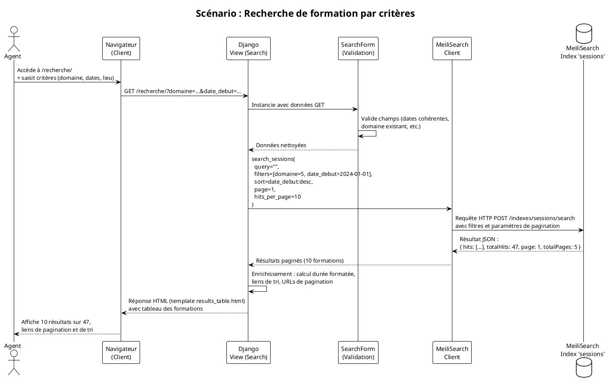
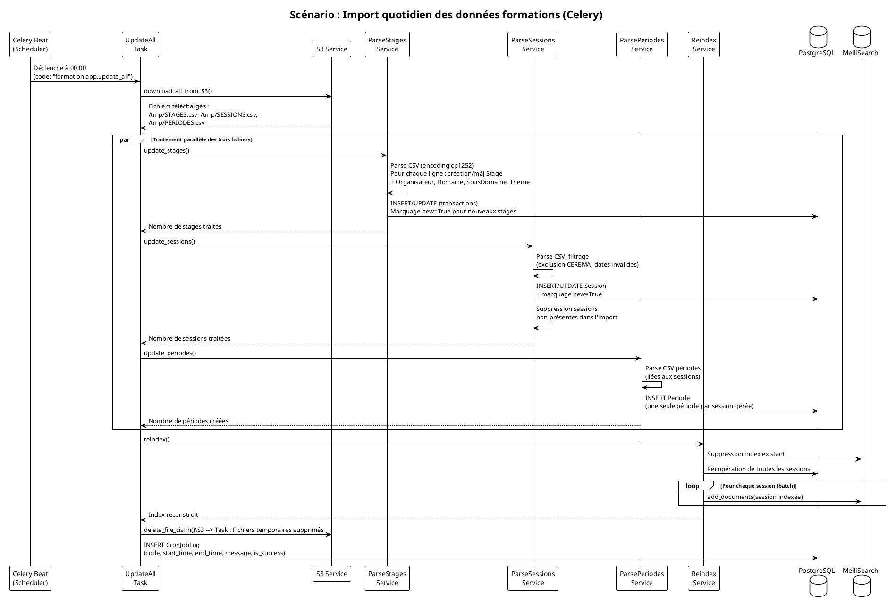
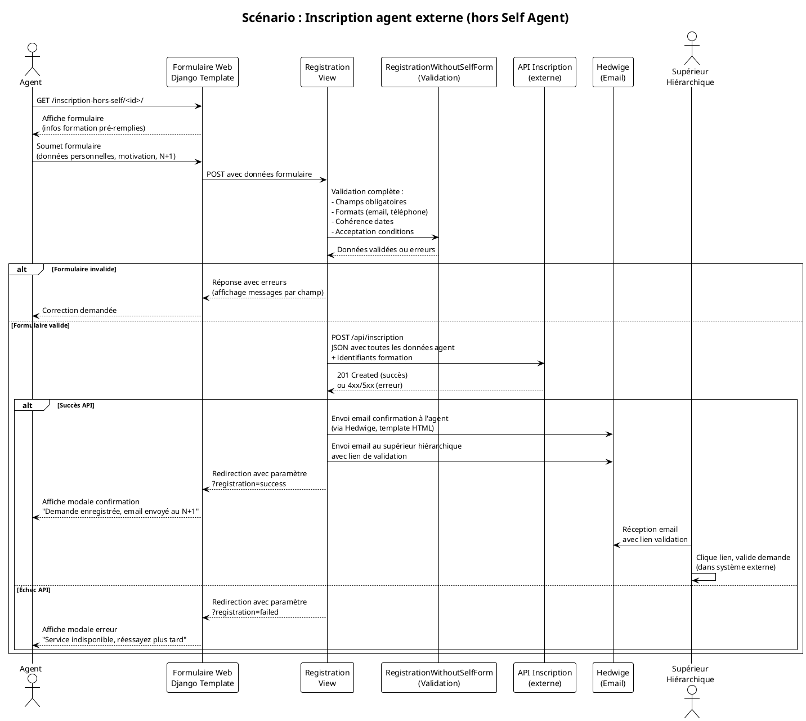

Voici le DAT généré selon le format Arc42 demandé, appliqué au projet formation-ecologie :

---

<a id="dossier-darchitecture-technique-dat"></a>
# Dossier d'Architecture Technique (DAT)

## Table des matières

<ul>
<li><a id="toc-application-formation-écologie"></a><a href="#application-formation-écologie">Application Formation-Écologie</a>
</li>
<li><a id="toc-1-introduction-et-objectifs"></a><a href="#1-introduction-et-objectifs">1. Introduction et objectifs</a>
<ul>
<li><a id="toc-vue-densemble-fonctionnelle"></a><a href="#vue-densemble-fonctionnelle">Vue d'ensemble fonctionnelle</a>
</li>
<li><a id="toc-schéma-c4-l1-vue-contexte"></a><a href="#schéma-c4-l1-vue-contexte">Schéma C4-L1 (Vue Contexte)</a>
</li>
<li><a id="toc-objectifs-de-qualité-orientés-utilisateur"></a><a href="#objectifs-de-qualité-orientés-utilisateur">Objectifs de qualité orientés utilisateur</a>
</ul>
</li>
<li><a id="toc-2-parties-prenantes"></a><a href="#2-parties-prenantes">2. Parties prenantes</a>
</li>
<li><a id="toc-3-contraintes"></a><a href="#3-contraintes">3. Contraintes</a>
<ul>
<li><a id="toc-contraintes-techniques"></a><a href="#contraintes-techniques">Contraintes techniques</a>
</li>
<li><a id="toc-contraintes-organisationnelles"></a><a href="#contraintes-organisationnelles">Contraintes organisationnelles</a>
</li>
<li><a id="toc-exigences-de-sécurité-modèle-d-i-c-t"></a><a href="#exigences-de-sécurité-modèle-d-i-c-t">Exigences de sécurité (modèle D-I-C-T)</a>
</ul>
</li>
<li><a id="toc-4-contexte-et-périmètre"></a><a href="#4-contexte-et-périmètre">4. Contexte et périmètre</a>
<ul>
<li><a id="toc-partenaires-fonctionnels"></a><a href="#partenaires-fonctionnels">Partenaires fonctionnels</a>
</li>
<li><a id="toc-interfaces-techniques"></a><a href="#interfaces-techniques">Interfaces techniques</a>
</ul>
</li>
<li><a id="toc-5-stratégie-de-solution"></a><a href="#5-stratégie-de-solution">5. Stratégie de solution</a>
<ul>
<li><a id="toc-décisions-architecturales-majeures"></a><a href="#décisions-architecturales-majeures">Décisions architecturales majeures</a>
</li>
<li><a id="toc-environnement-technologique"></a><a href="#environnement-technologique">Environnement technologique</a>
</li>
<li><a id="toc-outils-de-la-forge-logicielle"></a><a href="#outils-de-la-forge-logicielle">Outils de la forge logicielle</a>
</ul>
</li>
<li><a id="toc-6-vue-en-briques-vue-conteneurs-c4-l2"></a><a href="#6-vue-en-briques-vue-conteneurs-c4-l2">6. Vue en Briques (Vue Conteneurs C4-L2)</a>
<ul>
<li><a id="toc-description-des-conteneurs"></a><a href="#description-des-conteneurs">Description des conteneurs</a>
</ul>
</li>
<li><a id="toc-7-vue-exécution"></a><a href="#7-vue-exécution">7. Vue Exécution</a>
<ul>
<li><a id="toc-scénario-1-recherche-de-formation-avec-critères-multiples"></a><a href="#scénario-1-recherche-de-formation-avec-critères-multiples">Scénario 1 : Recherche de formation avec critères multiples</a>
</li>
<li><a id="toc-scénario-2-import-quotidien-des-données-cisirh"></a><a href="#scénario-2-import-quotidien-des-données-cisirh">Scénario 2 : Import quotidien des données CISIRH</a>
</li>
<li><a id="toc-scénario-3-inscription-dun-agent-sans-self-agent-hors-ministère"></a><a href="#scénario-3-inscription-dun-agent-sans-self-agent-hors-ministère">Scénario 3 : Inscription d'un agent sans Self Agent (hors ministère)</a>
</ul>
</li>
<li><a id="toc-8-vue-déploiement"></a><a href="#8-vue-déploiement">8. Vue Déploiement</a>
<ul>
<li><a id="toc-environnements"></a><a href="#environnements">Environnements</a>
</li>
<li><a id="toc-infrastructure"></a><a href="#infrastructure">Infrastructure</a>
</li>
<li><a id="toc-supervision"></a><a href="#supervision">Supervision</a>
</li>
<li><a id="toc-sauvegardes"></a><a href="#sauvegardes">Sauvegardes</a>
</ul>
</li>
<li><a id="toc-9-sujets-transverses"></a><a href="#9-sujets-transverses">9. Sujets transverses</a>
<ul>
<li><a id="toc-authentification"></a><a href="#authentification">Authentification</a>
</li>
<li><a id="toc-journalisation"></a><a href="#journalisation">Journalisation</a>
</li>
<li><a id="toc-monitoring"></a><a href="#monitoring">Monitoring</a>
</li>
<li><a id="toc-gestion-des-erreurs"></a><a href="#gestion-des-erreurs">Gestion des erreurs</a>
</li>
<li><a id="toc-api-et-interfaces"></a><a href="#api-et-interfaces">API et interfaces</a>
</ul>
</li>
<li><a id="toc-10-exigences-de-qualité"></a><a href="#10-exigences-de-qualité">10. Exigences de qualité</a>
</li>
<li><a id="toc-11-risques-et-dettes-techniques"></a><a href="#11-risques-et-dettes-techniques">11. Risques et dettes techniques</a>
</li>
<li><a id="toc-12-annexes"></a><a href="#12-annexes">12. Annexes</a>
<ul>
<li><a id="toc-glossaire"></a><a href="#glossaire">Glossaire</a>
</li>
<li><a id="toc-décisions-darchitecture-adr"></a><a href="#décisions-darchitecture-adr">Décisions d'Architecture (ADR)</a>
</li>
</ul>
</li>
</ul>

---

<a id="application-formation-écologie"></a>
## Application Formation-Écologie [↑](#toc-application-formation-écologie)

**[TOC]**

---

<a id="1-introduction-et-objectifs"></a>
## 1. Introduction et objectifs [↑](#toc-1-introduction-et-objectifs)

<a id="vue-densemble-fonctionnelle"></a>
### Vue d'ensemble fonctionnelle [↑](#toc-vue-densemble-fonctionnelle)

Formation-Écologie est une application web de gestion et diffusion de l'offre de formation professionnelle du pôle ministériel MTE (Ministère de la Transition Écologique). Elle permet aux agents de rechercher des formations, de s'y inscrire (directement ou via leur supérieur hiérarchique), et de s'abonner à des alertes email personnalisées. L'application intègre des données provenant du CISIRH (Centre Interministériel de Services Informatiques relatifs aux Ressources Humaines) et propose une interface d'administration pour la gestion des contenus éditoriaux.

<a id="schéma-c4-l1-vue-contexte"></a>
### Schéma C4-L1 (Vue Contexte) [↑](#toc-schéma-c4-l1-vue-contexte)

```plantuml
@startuml
!include https://raw.githubusercontent.com/plantuml-stdlib/C4-PlantUML/master/C4_Context.puml

LAYOUT_WITH_LEGEND()

Person(agent_mte, "Agent MTE", "Agent du ministère recherchant une formation")
Person(agent_ext, "Agent extérieur", "Agent hors ministère ou sans Self Agent")
Person(admin, "Administrateur", "Gestionnaire de contenus et formations")
Person(superieur, "Supérieur hiérarchique", "Valide les demandes d'inscription")

System_Boundary(formation_eco, "Système Formation-Écologie") {
    System(app, "Application Formation-Écologie", "Portail de recherche, inscription et gestion des formations")
}

System_Ext(cisirh, "CISIRH", "Système source des données formations (exports CSV)")
System_Ext(self_agent, "Self Agent", "Portail RH ministériel pour inscription agents internes")
System_Ext(api_inscription, "API Inscription externe", "Service pour inscription agents hors Self Agent")
System_Ext(hedwige, "Hedwige", "Service d'envoi d'emails transactionnels")
System_Ext(cas, "CAS", "Central Authentication Service ministériel")
System_Ext(meilisearch, "MeiliSearch", "Moteur de recherche full-text")
System_Ext(s3, "Stockage S3", "Stockage objet pour imports et médias")

Rel(agent_mte, app, "Recherche formations, s'abonne", "HTTPS")
Rel(agent_ext, app, "Inscription via formulaire", "HTTPS")
Rel(admin, app, "Gère contenus, articles, abonnements", "HTTPS")
Rel(superieur, app, "Valide inscriptions par email", "Email")
Rel(app, cisirh, "Importe données formations", "CSV/S3 quotidien")
Rel(app, self_agent, "Redirection inscription interne", "HTTPS")
Rel(app, api_inscription, "Soumet inscriptions externes", "REST/JSON")
Rel(app, hedwige, "Envoie emails abonnements", "REST/JSON")
Rel(app, cas, "Authentification agents internes", "CAS Protocol")
Rel(app, meilisearch, "Indexe et recherche formations", "HTTP/7700")
Rel(app, s3, "Stocke fichiers CSV et uploads", "S3 API")

@enduml
```

<a id="objectifs-de-qualité-orientés-utilisateur"></a>
### Objectifs de qualité orientés utilisateur [↑](#toc-objectifs-de-qualité-orientés-utilisateur)

- **Accessibilité** : Conformité RGAA 4.1.2 avec 82,35% des critères respectés pour garantir l'accès à tous les agents, y compris en situation de handicap
- **Performance** : Temps de réponse inférieur à 2 secondes pour les recherches de formations grâce à l'indexation MeiliSearch
- **Maintenabilité** : Architecture modulaire Django avec séparation claire des responsabilités (models, views, services) facilitant les évolutions
- **Sécurité** : Authentification CAS pour agents internes, chiffrement AES-256 des sauvegardes, conformité aux exigences RGS
- **Disponibilité** : Hébergement cloud redondant avec supervision 24/7 et procédures de backup automatisées

---

<a id="2-parties-prenantes"></a>
## 2. Parties prenantes [↑](#toc-2-parties-prenantes)

- **Direction des Ressources Humaines (DRH/MTE)**
  - Attente : Offre de formation à jour, accessible et facilement consultable par tous les agents du pôle ministériel

- **SG/DNUM/DPNM/PNM3 (Équipe technique)**
  - Attente : Hébergement sécurisé, supervision opérationnelle et maintenance évolutive de l'application

- **CISIRH (Fournisseur de données)**
  - Attente : Fourniture fiable et quotidienne des données formations via exports CSV déposés sur S3

- **Agents du ministère (utilisateurs finaux)**
  - Attente : Recherche intuitive des formations, inscription simplifiée et informations toujours à jour

- **Correspondants locaux de formation (CLF)**
  - Attente : Gestion efficace des inscriptions des agents ne disposant pas d'accès au Self Agent

- **RSSI (Responsable de la Sécurité des Systèmes d'Information)**
  - Attente : Conformité aux standards de sécurité, traçabilité des accès et protection des données personnelles

---

<a id="3-contraintes"></a>
## 3. Contraintes [↑](#toc-3-contraintes)

<a id="contraintes-techniques"></a>
### Contraintes techniques [↑](#toc-contraintes-techniques)

- Stack technique imposée : Python 3.11+, Django 4.2 LTS, PostgreSQL 15+
- Hébergement obligatoire sur cloud interne ECO4 (OpenStack), tenant PNM3
- Conformité au Design System de l'État Français (DSFR) pour tous les composants UI
- Accessibilité : conformité partielle RGAA 4.1.2 (82,35% des critères)

<a id="contraintes-organisationnelles"></a>
### Contraintes organisationnelles [↑](#toc-contraintes-organisationnelles)

- Authentification CAS ministérielle obligatoire pour les agents internes
- Traitement des données personnelles conforme au RGPD avec durée de conservation limitée
- Classification des données : niveau "diffusion restreinte"

<a id="exigences-de-sécurité-modèle-d-i-c-t"></a>
### Exigences de sécurité (modèle D-I-C-T) [↑](#toc-exigences-de-sécurité-modèle-d-i-c-t)

- **Disponibilité** : 99,5% de disponibilité annuelle avec supervision continue via Prometheus/Grafana et alerting automatique
- **Intégrité** : Protection contre l'altération des données via hash des fichiers importés et logs d'audit complets des actions administratives
- **Confidentialité** : Chiffrement AES-256 des sauveardes de base de données, accès restreints aux ressources sensibles, authentification forte
- **Traçabilité** : Logs applicatifs détaillés, historique des imports CISIRH avec horodatage, traçabilité des envois d'emails d'abonnement

---

<a id="4-contexte-et-périmètre"></a>
## 4. Contexte et périmètre [↑](#toc-4-contexte-et-périmètre)

<a id="partenaires-fonctionnels"></a>
### Partenaires fonctionnels [↑](#toc-partenaires-fonctionnels)

- **CISIRH** : Système source des données formations (stages, sessions, périodes) via exports CSV quotidiens
- **Self Agent** : Portail RH ministériel vers lequel sont redirigés les agents internes pour inscription
- **API Inscription externe** : Service tiers permettant la soumission des inscriptions pour agents sans Self Agent
- **Hedwige** : Service d'envoi d'emails transactionnels pour les notifications d'abonnement
- **CAS (Central Authentication Service)** : Service d'authentification unique pour les agents du ministère
- **MeiliSearch** : Moteur de recherche dédié pour l'indexation et la recherche full-text des formations
- **Stockage S3 (MinIO)** : Stockage objet pour les fichiers d'import CISIRH et les uploads de médias

<a id="interfaces-techniques"></a>
### Interfaces techniques [↑](#toc-interfaces-techniques)

- **CISIRH → Application** : Import quotidien via fichiers CSV (STAGES.csv, SESSIONS.csv, PERIODES.csv) déposés sur bucket S3, téléchargement par script Python, parsing et insertion en base PostgreSQL
- **Application → Self Agent** : Redirection HTTP avec paramètres (code stage) vers URL du Self Agent
- **Application → API Inscription** : Requêtes HTTP POST en JSON vers endpoint externe pour soumission des formulaires d'inscription hors Self Agent
- **Application → Hedwige** : Requêtes HTTP POST authentifiées (OAuth2 client credentials) pour envoi d'emails HTML
- **Application → CAS** : Protocole CAS 3.0 pour authentification, validation de tickets et récupération d'attributs utilisateur
- **Application → MeiliSearch** : API HTTP REST (port 7700) pour indexation des documents et recherche avec filtres et tri
- **Application → S3** : API S3 compatible pour upload/download de fichiers (CSV d'import, images d'articles)

---

<a id="5-stratégie-de-solution"></a>
## 5. Stratégie de solution [↑](#toc-5-stratégie-de-solution)

<a id="décisions-architecturales-majeures"></a>
### Décisions architecturales majeures [↑](#toc-décisions-architecturales-majeures)

- Architecture monolithique Django choisie pour sa simplicité de maintenance avec une équipe réduite, tout en assurant une séparation logique claire via l'organisation en modules (models, views, services, forms)
- Indexation découplée avec MeiliSearch pour décharger la base PostgreSQL des requêtes de recherche complexes et garantir des performances constantes
- Traitement asynchrone des imports via Celery pour éviter le blocage du serveur web pendant le traitement des fichiers CSV volumineux
- Double mode d'authentification : CAS pour agents internes (flux standard) et formulaire libre pour agents externes (cas particuliers)

<a id="environnement-technologique"></a>
### Environnement technologique [↑](#toc-environnement-technologique)

- **Langage** : Python 3.11+
- **Framework backend** : Django 4.2 LTS avec Django ORM
- **Base de données** : PostgreSQL 15
- **Moteur de recherche** : MeiliSearch 1.x
- **Cache et broker** : Redis 7
- **Tâches asynchrones** : Celery 5.x avec Celery Beat pour la planification
- **Frontend** : Django Templates, DSFR 1.14.2 (Système de Design de l'État), Leaflet 1.9.4 pour la cartographie
- **Conteneurisation** : Docker avec Docker Compose
- **Serveur d'application** : Gunicorn

<a id="outils-de-la-forge-logicielle"></a>
### Outils de la forge logicielle [↑](#toc-outils-de-la-forge-logicielle)

- **Gestion de source** : GitLab (repository interne)
- **CI/CD** : GitLab CI avec pipeline de build d'image Docker via BuildKit
- **Gestion des dépendances** : Poetry avec fichier poetry.lock versionné
- **Linting** : Flake8 avec configuration personnalisée (max-line-length = 160)
- **Registry** : Registry GitLab interne pour le stockage des images Docker

---

<a id="6-vue-en-briques-vue-conteneurs-c4-l2"></a>
## 6. Vue en Briques (Vue Conteneurs C4-L2) [↑](#toc-6-vue-en-briques-vue-conteneurs-c4-l2)

```plantuml
@startuml
!include https://raw.githubusercontent.com/plantuml-stdlib/C4-PlantUML/master/C4_Container.puml

LAYOUT_WITH_LEGEND()

Person(agent, "Agent", "Utilisateur du portail")
Person(admin, "Administrateur", "Gestionnaire du site")

System_Boundary(formation_eco, "Formation-Écologie") {
    Container(web_app, "Application Web Django", "Python 3.11, Django 4.2, Gunicorn", "Portail utilisateurs et API REST")
    Container(admin_interface, "Interface Admin Django", "Python 3.11, Django 4.2", "Administration des contenus et données")
    Container(celery_workers, "Celery Workers", "Python, Celery 5.x", "Traitement asynchrone des tâches")
    Container(celery_beat, "Celery Beat", "Python, Celery 5.x", "Ordonnanceur des tâches planifiées")
    ContainerDb(postgres, "Base de données PostgreSQL", "PostgreSQL 15", "Persistance des données métier")
    ContainerDb(meilisearch, "Moteur de recherche", "MeiliSearch 1.x", "Indexation full-text des formations")
    ContainerDb(redis, "Cache et Broker", "Redis 7", "Cache Django et file de messages Celery")
    Container(storage, "Stockage de fichiers", "MinIO/S3", "Fichiers CSV d'import et uploads médias")
}

System_Ext(cas, "CAS", "Authentification centralisée")
System_Ext(hedwige, "Hedwige", "Service d'envoi d'emails")
System_Ext(cisirh_s3, "S3 CISIRH", "Source des données formations")

Rel(agent, web_app, "Utilise", "HTTPS/443")
Rel(admin, admin_interface, "Administre", "HTTPS/443")
Rel(web_app, postgres, "Lit/Écrit", "JDBC/5432")
Rel(web_app, meilisearch, "Recherche/Indexe", "HTTP/7700")
Rel(web_app, redis, "Cache", "Redis/6379")
Rel(web_app, storage, "Stocke/Récupère fichiers", "S3 API")
Rel(celery_workers, postgres, "Met à jour", "JDBC/5432")
Rel(celery_workers, meilisearch, "Réindexe", "HTTP/7700")
Rel(celery_workers, hedwige, "Envoie emails", "REST/JSON")
Rel(celery_workers, cisirh_s3, "Importe données", "S3 API")
Rel(celery_beat, celery_workers, "Déclenche tâches", "Redis/6379")
Rel(web_app, cas, "Authentifie", "CAS Protocol")

@enduml
```

<a id="description-des-conteneurs"></a>
### Description des conteneurs [↑](#toc-description-des-conteneurs)

- **Application Web Django** : Cœur de l'application exposant le portail public (recherche de formations, inscription, abonnement) et les API REST internes. Sert les pages via Gunicorn avec workers synchrones.
- **Interface Admin Django** : Interface d'administration sécurisée pour la gestion des articles, bandeaux d'accueil, abonnements et suivi des imports. Partage le même code source mais avec routing et permissions spécifiques.
- **Celery Workers** : Processus workers exécutant les tâches asynchrones : import quotidien des données CISIRH, envoi des emails d'abonnement, réindexation MeiliSearch, nettoyage des fichiers temporaires.
- **Celery Beat** : Ordonnanceur déclenchant les tâches périodiques selon la crontab configurée (imports à 00:00, emails d'abonnement à fréquence définie).
- **Base de données PostgreSQL** : Stockage relationnel des données métier (stages, sessions, périodes, articles, abonnements, logs d'import) avec réplication pour la haute disponibilité.
- **Moteur de recherche MeiliSearch** : Index dédié pour les formations (index "sessions" et "stages") permettant recherche full-text, filtrage multi-critères et tri rapide.
- **Cache et Broker Redis** : Utilisé comme cache de second niveau par Django et comme broker de messages pour la communication entre Celery Beat et les Workers.
- **Stockage de fichiers** : Service S3 compatible (MinIO) pour le stockage des fichiers CSV d'import en provenance du CISIRH, des images uploadées pour les articles, et des documents générés (exports PDF).

---

<a id="7-vue-exécution"></a>
## 7. Vue Exécution [↑](#toc-7-vue-exécution)

<a id="scénario-1-recherche-de-formation-avec-critères-multiples"></a>
### Scénario 1 : Recherche de formation avec critères multiples [↑](#toc-scénario-1-recherche-de-formation-avec-critères-multiples)



<a id="scénario-2-import-quotidien-des-données-cisirh"></a>
### Scénario 2 : Import quotidien des données CISIRH [↑](#toc-scénario-2-import-quotidien-des-données-cisirh)



<a id="scénario-3-inscription-dun-agent-sans-self-agent-hors-ministère"></a>
### Scénario 3 : Inscription d'un agent sans Self Agent (hors ministère) [↑](#toc-scénario-3-inscription-dun-agent-sans-self-agent-hors-ministère)



---

<a id="8-vue-déploiement"></a>
## 8. Vue Déploiement [↑](#toc-8-vue-déploiement)

<a id="environnements"></a>
### Environnements [↑](#toc-environnements)

| Environnement | Hébergement | Serveurs | Réseau | Particularités |
|---------------|-------------|----------|--------|----------------|
| Développement | Local/Docker Desktop | 1 (localhost) | Interne workstation | SQLite possible, DEBUG=True, rechargement automatique |
| Intégration | Cloud ECO4 (tenant dev) | 2 (flavor small) | VLAN isolé 10.x.x.x/24 | Données de test anonymisées, accès VPN restreint |
| Recette | Cloud ECO4 (tenant rec) | 2 (flavor medium) | VLAN restreint 10.x.x.x/24 | Données de pré-prod, tests RSSI et recette fonctionnelle |
| Production | Cloud ECO4 (tenant pnm3) | 4+ (flavor medium+) | DMZ + réseau interne | Haute disponibilité, backup automatique, supervision renforcée |

<a id="infrastructure"></a>
### Infrastructure [↑](#toc-infrastructure)

Le produit est hébergé sur le cloud interne ECO4 basé sur Openstack, dans le tenant 'pnm3' du département.  
Le reverse-proxy Nginx du schéma ci-dessous est en fait une paire de Nginx load-balancés en frontal des produits hébergés sur le tenant.

```Plantuml
@startuml
!theme plain

node "Nginx Load Balancer" as Nginx {
    [Nginx 1]
    [Nginx 2]
}

package "Application Server" {
    [Django App 1] as App1
    [Django App 2] as App2
    [Celery Worker 1] as Celery1
    [Celery Worker 2] as Celery2
    [Celery Beat] as Beat
}

package "Data Layer" {
    database "PostgreSQL\nPrimary" as PG
    database "PostgreSQL\nReplica" as PGRep
    [MeiliSearch] as Search
    [Redis] as Redis
}

package "Storage" {
    [MinIO S3] as S3
}

Nginx --> App1 : HTTP/8000
Nginx --> App2 : HTTP/8000
App1 --> PG : JDBC/5432
App2 --> PG : JDBC/5432
App1 --> Search : HTTP/7700
App2 --> Search : HTTP/7700
App1 --> Redis : Redis/6379
App2 --> Redis : Redis/6379
Celery1 --> PG : JDBC/5432
Celery2 --> PG : JDBC/5432
Celery1 --> Search : HTTP/7700
Beat --> Redis : Pub/Sub
App1 --> S3 : S3 API/9000
App2 --> S3 : S3 API/9000

@enduml
```

<a id="supervision"></a>
### Supervision [↑](#toc-supervision)

Le produit est supervisé via le système standard du GTI pour ce faire :
- via Portainer pour la partie purement conteneurisée,
- via la stack Prometheus/Grafana/Loki/AlertManager,
- Le produit dispose également d'une supervision PSIN.

<a id="sauvegardes"></a>
### Sauvegardes [↑](#toc-sauvegardes)

Les sauvegardes de la base de données sont assurées par des scripts standards du GTI permettant la création de dumps cryptés en AES-256 et déposés sur :
- le stockage objet B3 du IaaS ministériel,
- le stockage objet Outscale SecNumCloud (via la prestation qu'a le GTI sur le marché "Nuage Public"),
- le stockage objet standard de Google Cloud (via la prestation qu'a le GTI sur le marché "Nuage Public").

---

<a id="9-sujets-transverses"></a>
## 9. Sujets transverses [↑](#toc-9-sujets-transverses)

<a id="authentification"></a>
### Authentification [↑](#toc-authentification)

- Mode CAS (production) : Authentification centralisée via le CAS ministériel pour tous les agents disposant d'un compte Active Directory
- Mode Local (développement) : Authentification Django standard avec gestion des utilisateurs en base locale
- Mode Anonyme : Certaines fonctionnalités (recherche, consultation) accessibles sans authentification
- Gestion des permissions : Django Groups et Permissions pour différencier administrateurs et utilisateurs standards

<a id="journalisation"></a>
### Journalisation [↑](#toc-journalisation)

- Logs applicatifs : Format structuré (JSON) envoyé vers Loki pour centralisation et recherche
- Logs de sécurité : Tentatives d'accès, erreurs d'authentification, accès aux données sensibles
- Logs métier : Historique des imports CISIRH (table CronJobLog avec code, timestamps, message, statut succès/échec)
- Logs d'audit admin : Modifications des articles, création/suppression d'abonnements via l'interface Django

<a id="monitoring"></a>
### Monitoring [↑](#toc-monitoring)

- Métriques applicatives : Nombre de recherches, taux de conversion inscription, volume d'abonnements
- Métriques techniques : Temps de réponse HTTP, taux d'erreur 5xx, saturation CPU/mémoire, file Celery
- Alertes : Indisponibilité service, erreurs d'import CISIRH, saturation disque, erreurs d'envoi d'emails

<a id="gestion-des-erreurs"></a>
### Gestion des erreurs [↑](#toc-gestion-des-erreurs)

- Pages d'erreur personnalisées conformes DSFR pour les codes 403, 404, 500
- Fallback gracieux : Si MeiliSearch indisponible, affichage d'un message utilisateur explicite sans plantage
- Retry automatique : Tâches Celery configurées avec 3 tentatives et backoff exponentiel en cas d'échec
- Circuit breaker : Timeout sur les appels API externes (Hedwige, API Inscription) pour éviter blocage

<a id="api-et-interfaces"></a>
### API et interfaces [↑](#toc-api-et-interfaces)

- API REST interne : Endpoints pour sous-domaines (/api/sous-domaines/) et départements par domaine (/api/departement-par-domaines/)
- Flux RSS : Génération de flux RSS filtrables selon les critères de recherche de l'utilisateur
- Webhooks : Aucun webhook externe utilisé actuellement

---

<a id="10-exigences-de-qualité"></a>
## 10. Exigences de qualité [↑](#toc-10-exigences-de-qualité)

- **Temps de réponse recherche < 2 secondes** : Validation par test de charge JMeter avec 100 requêtes de recherche simultanées par minute, mesure du 95e percentile des temps de réponse
- **Disponibilité 99,5% annuelle** : Calcul sur base des 30 derniers jours glissants : (temps total en minutes - minutes d'indisponibilité déclarée) / temps total en minutes
- **Conformité RGAA 82%+** : Audit annuel réalisé par société TEMESIS avec rapport de conformité détaillé et plan de remédiation
- **Succès des imports quotidiens > 99%** : Mesure sur 30 jours du taux de succès des tâches Celery d'import CISIRH (code retour et validation données)
- **Récupération backup complète < 4 heures** : Test semestriel de restauration complète de la base de données sur environnement isolé, chronométrage de la procédure

---

<a id="11-risques-et-dettes-techniques"></a>
## 11. Risques et dettes techniques [↑](#toc-11-risques-et-dettes-techniques)

- **Montée de version Django 4.2 → 5.x** : Impact moyen, probabilité élevée. Mesure : Planifier migration vers prochaine LTS en 2025, établir batterie de tests de non-régression automatisés, monitoring des dépréciations
- **Dépendance unique CISIRH comme source de données** : Impact élevé, probabilité moyenne. Mesure : Mise en place de mécanisme de cache étendu (7 jours), alerte immédiate en cas d'absence d'import quotidien, procédure de continuité avec données figées
- **MeiliSearch en instance unique (non clusterisé)** : Impact moyen, probabilité faible. Mesure : Backup quotidien de l'index via script automatisé, documentation de la procédure de reconstruction complète de l'index (15-30 minutes)
- **Dette technique : fonctions de parsing CSV longues et complexes** : Impact moyen, probabilité élevée. Mesure : Refactoring progressif par extraction de méthodes, augmentation de la couverture de tests unitaires sur le module services
- **Stockage des secrets en variables d'environnement** : Impact faible, probabilité moyenne. Mesure : Évaluation de la migration vers Vault ou équivalent fourni par le GTI, rotation régulière des clés API

---

<a id="12-annexes"></a>
## 12. Annexes [↑](#toc-12-annexes)

<a id="glossaire"></a>
### Glossaire [↑](#toc-glossaire)

- **CISIRH** : Centre Interministériel de Services Informatiques relatifs aux Ressources Humaines, fournisseur des données formations
- **Self Agent** : Portail RH ministériel permettant aux agents de gérer leurs demandes de formation
- **DSFR** : Design System de l'État Français, bibliothèque de composants UI accessibles et conformes à l'identité visuelle de l'État
- **MeiliSearch** : Moteur de recherche open source léger et performant, alternative à Elasticsearch
- **Celery** : Framework de traitement distribué de tâches asynchrones pour Python
- **CAS** : Central Authentication Service, protocole de Single Sign-On (SSO) utilisé par le ministère
- **Hedwige** : Service d'envoi d'emails transactionnels de la DNUM
- **CVRH/CMVRH** : Centre de Valorisation des Ressources Humaines, organisateurs de formations
- **DREAL/DDT/DIR** : Directions régionales et départementales, organisateurs de formations

<a id="décisions-darchitecture-adr"></a>
### Décisions d'Architecture (ADR) [↑](#toc-décisions-darchitecture-adr)

- **ADR-001 (2024-01)** : Choix de MeiliSearch comme moteur de recherche plutôt qu'Elasticsearch pour sa simplicité de déploiement et sa consommation mémoire réduite. Statut : Accepté.
- **ADR-002 (2024-02)** : Maintien d'une authentification double mode (CAS + formulaire libre) pour prendre en compte les agents externes et agents de terrain sans accès Self Agent. Statut : Accepté.
- **ADR-003 (2024-03)** : Utilisation de Celery pour le traitement asynchrone des imports CISIRH afin de ne pas bloquer le serveur web pendant le parsing de fichiers CSV volumineux. Statut : Accepté.
- **ADR-004 (2024-06)** : Obligation d'utilisation du DSFR pour tous les composants UI afin de garantir l'accessibilité et l'homogénéité visuelle avec les autres applications de l'État. Statut : Accepté.
- **ADR-005 (2024-11)** : Stockage des fichiers d'import sur S3 plutôt que sur volume local pour faciliter le partage de données avec le CISIRH et permettre la scalabilité horizontale. Statut : Accepté.

---

**[↩ Retour au sommaire](#toc)**

---
*Document généré le 28 février 2026 - Version 1.0*