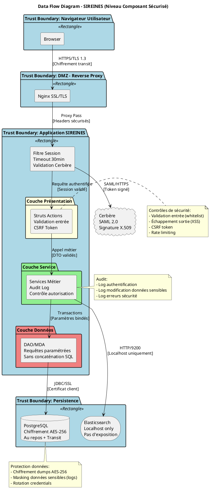
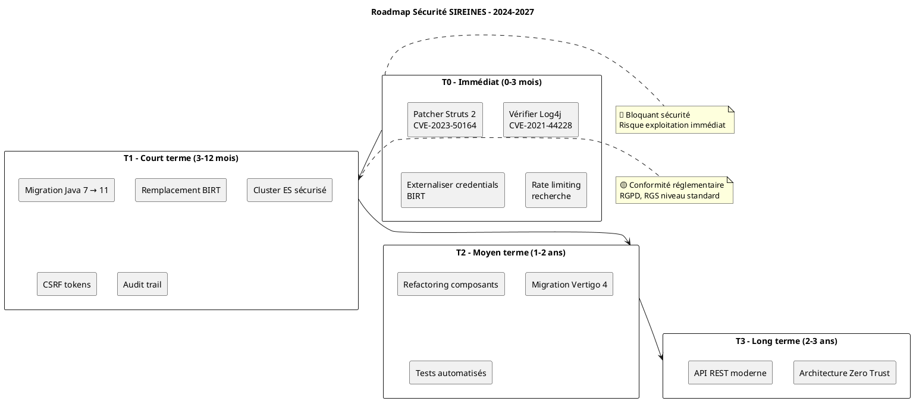

## Table des matières [↑](#toc-table-des-matières)

<ul>
<li><a id="toc-dat-vue-composants-analyse-de-sécurité-sireines"></a><a href="#dat-vue-composants-analyse-de-sécurité-sireines">DAT Vue Composants & Analyse de Sécurité - SIREINES</a>
<ul>
<li><a id="toc-vue-composants"></a><a href="#vue-composants">1. Vue Composants (C4-L3) - Architecture Interne Détaillée</a>
<ul>
<li><a id="toc-11-diagramme-de-composants-global"></a><a href="#11-diagramme-de-composants-global">1.1 Diagramme de composants global</a>
</li>
<li><a id="toc-12-fiches-composants-détaillées"></a><a href="#12-fiches-composants-détaillées">1.2 Fiches composants détaillées</a>
<ul>
<li><a id="toc-comp-001-dossierrecherchemotsclefsaction"></a><a href="#comp-001-dossierrecherchemotsclefsaction">COMP-001 : DossierRechercheMotsClefsAction</a>
<ul>
<li><a id="toc-interfaces-exposées"></a><a href="#interfaces-exposées">Interfaces exposées</a>
</li>
<li><a id="toc-dépendances-internes"></a><a href="#dépendances-internes">Dépendances internes</a>
</li>
<li><a id="toc-dépendances-externes"></a><a href="#dépendances-externes">Dépendances externes</a>
</li>
<li><a id="toc-vulnérabilités-critiques-identifiées"></a><a href="#vulnérabilités-critiques-identifiées">🔴 Vulnérabilités critiques identifiées</a>
</li>
<li><a id="toc-dette-technique"></a><a href="#dette-technique">Dette technique</a>
</ul>
</li>
<li><a id="toc-comp-002-extractionsservicesimpl"></a><a href="#comp-002-extractionsservicesimpl">COMP-002 : ExtractionsServicesImpl</a>
<ul>
<li><a id="toc-vulnérabilités-critiques-identifiées-1"></a><a href="#vulnérabilités-critiques-identifiées-1">🔴 Vulnérabilités critiques identifiées</a>
</li>
<li><a id="toc-dette-technique-critique"></a><a href="#dette-technique-critique">Dette technique - 🔴 Critique</a>
</ul>
</li>
<li><a id="toc-comp-003-importsservicesimpl"></a><a href="#comp-003-importsservicesimpl">COMP-003 : ImportsServicesImpl</a>
<ul>
<li><a id="toc-vulnérabilités-critiques-identifiées-2"></a><a href="#vulnérabilités-critiques-identifiées-2">🔴 Vulnérabilités critiques identifiées</a>
</ul>
</li>
<li><a id="toc-comp-004-cerbereutil-sireinessessionfilter"></a><a href="#comp-004-cerbereutil-sireinessessionfilter">COMP-004 : CerbereUtil + SireinesSessionFilter</a>
<ul>
<li><a id="toc-dépendances-externes-critiques"></a><a href="#dépendances-externes-critiques">Dépendances externes critiques</a>
</li>
<li><a id="toc-vulnérabilités-identifiées"></a><a href="#vulnérabilités-identifiées">🟡 Vulnérabilités identifiées</a>
</ul>
</li>
<li><a id="toc-comp-005-esembeddedsearchservicesplugin"></a><a href="#comp-005-esembeddedsearchservicesplugin">COMP-005 : ESEmbeddedSearchServicesPlugin</a>
<ul>
<li><a id="toc-vulnérabilités-critiques"></a><a href="#vulnérabilités-critiques">🔴 Vulnérabilités critiques</a>
</ul>
</li>
</ul>
</li>
</ul>
</li>
<li><a id="toc-stride"></a><a href="#stride">2. Matrice de vulnérabilités STRIDE</a>
</li>
<li><a id="toc-dependances"></a><a href="#dependances">3. Inventaire des dépendances et vulnérabilités</a>
<ul>
<li><a id="toc-31-dépendances-maven-pomxml-sireines-web"></a><a href="#31-dépendances-maven-pomxml-sireines-web">3.1 Dépendances Maven (pom.xml sireines-web)</a>
</li>
<li><a id="toc-32-dépendances-frontend-analyse-templates"></a><a href="#32-dépendances-frontend-analyse-templates">3.2 Dépendances Frontend (analyse templates)</a>
</ul>
</li>
<li><a id="toc-dette-technique"></a><a href="#dette-technique">4. Dettes techniques identifiées</a>
</li>
<li><a id="toc-recommandations"></a><a href="#recommandations">5. Recommandations de sécurité prioritaires</a>
<ul>
<li><a id="toc-51-court-terme-0-3-mois-urgent"></a><a href="#51-court-terme-0-3-mois-urgent">5.1 Court terme (0-3 mois) - 🔴 Urgent</a>
</li>
<li><a id="toc-52-moyen-terme-3-12-mois-important"></a><a href="#52-moyen-terme-3-12-mois-important">5.2 Moyen terme (3-12 mois) - 🟡 Important</a>
</li>
<li><a id="toc-53-long-terme-12-mois-stratégique"></a><a href="#53-long-terme-12-mois-stratégique">5.3 Long terme (> 12 mois) - 🟢 Stratégique</a>
</ul>
</li>
<li><a id="toc-dfd"></a><a href="#dfd">6. Schéma de flux de données sécurisé (DFD)</a>
</li>
<li><a id="toc-owasp"></a><a href="#owasp">7. Checklist OWASP Top 10 2021 - Mapping complet</a>
</li>
<li><a id="toc-plan-action"></a><a href="#plan-action">8. Plan d'action sécurité synthétique</a>
</li>
<li><a id="toc-annexes"></a><a href="#annexes">9. Annexes</a>
<ul>
<li><a id="toc-91-glossaire-sécurité"></a><a href="#91-glossaire-sécurité">9.1 Glossaire sécurité</a>
</li>
<li><a id="toc-92-références-cve-critiques-à-surveiller"></a><a href="#92-références-cve-critiques-à-surveiller">9.2 Références CVE critiques à surveiller</a>
</li>
</ul>
</li>
</ul>
</li>
</ul>

---

Voici le **DAT Vue Composants & Analyse de Sécurité** complet pour l'application **SIREINES**, généré selon le modèle Arc42 avec analyse approfondie des vulnérabilités, dettes techniques et recommandations de sécurité.

---


<a id="dat-vue-composants-analyse-de-sécurité-sireines"></a>
# DAT Vue Composants & Analyse de Sécurité - SIREINES [↑](#toc-dat-vue-composants-analyse-de-sécurité---sireines)

**Version** : 2.5.12  
**Date d'analyse** : 23 février 2026  
**Classification** : Interne - Contient informations de vulnérabilité  


---

## 1. Vue Composants (C4-L3) - Architecture Interne Détaillée [↑](#toc-vue-composants) {#vue-composants}

<a id="11-diagramme-de-composants-global"></a>
### 1.1 Diagramme de composants global [↑](#toc-11-diagramme-de-composants-global)

```plantuml
@startuml
skinparam componentStyle rectangle
skinparam linetype ortho

title SIREINES - Vue Composants (C4-L3)

package "Couche Présentation (Controllers)" #LightBlue {
    [AccueilAction] as Accueil
    [AgentRechercheAction] as AgentSearch
    [AgentDetailAction] as AgentDetail
    [DossierRechercheAction] as DossierSearch
    [DossierDetailAction] as DossierDetail
    [DossierRechercheMotsClefsAction] as DossierSearchMC
    [SeanceRechercheAction] as SeanceSearch
    [SeanceAffectationAction] as SeanceAffect
    [Extraction01Action..10Action] as Extractions
    [ImportFichierAction] as Import
    [BaliseRechercheAction] as RefBalise
    [MotCleNiveauDetailAction] as RefMotCle
}

package "Couche Service" #LightGreen {
    [AgentsServicesImpl] as SvcAgent
    [DossiersServicesImpl] as SvcDossier
    [SeancesServicesImpl] as SvcSeance
    [ExtractionsServicesImpl] as SvcExtract
    [ImportsServicesImpl] as SvcImport
    [ReferentielsServicesImpl] as SvcRef
    [CourriersServicesImpl] as SvcCourrier
    [CommonServicesImpl] as SvcCommon
}

package "Couche Accès Données (DAO)" #LightYellow {
    [AgentsDao] as DaoAgent
    [DossiersDao] as DaoDossier
    [SeancesDao] as DaoSeance
    [ExtractionsDao] as DaoExtract
    [ImportsDao] as DaoImport
    [ReferentielDao] as DaoRef
}

package "Utilitaires & Sécurité" #LightGray {
    [CerbereUtil] as UtilCerbere
    [SireinesSessionFilter] as FilterSession
    [EncodingFilter] as FilterEnc
    [StringUtils] as UtilString
    [CsvExport] as UtilCsv
    [FichierUtil] as UtilFile
}

package "Intégrations Externes" #LightPink {
    [ESEmbeddedSearchServicesPlugin] as ESPlugin
    [BirtManagerImpl] as BirtMgr
    [SharedDBConnection] as SharedDB
}

database "PostgreSQL" as DB #LightCoral
cloud "Cerbère SSO" as SSO #LightPink

' Flux Présentation -> Service
Accueil --> SvcCommon
AgentSearch --> SvcAgent
AgentDetail --> SvcAgent
DossierSearch --> SvcDossier
DossierDetail --> SvcDossier
DossierSearchMC --> SvcDossier
SeanceSearch --> SvcSeance
SeanceAffect --> SvcSeance
Extractions --> SvcExtract
Import --> SvcImport
RefBalise --> SvcRef
RefMotCle --> SvcRef

' Flux Service -> DAO
SvcAgent --> DaoAgent
SvcDossier --> DaoDossier
SvcSeance --> DaoSeance
SvcExtract --> DaoExtract
SvcImport --> DaoImport
SvcRef --> DaoRef

' Flux DAO -> DB
DaoAgent --> DB
DaoDossier --> DB
DaoSeance --> DB
DaoExtract --> DB
DaoImport --> DB
DaoRef --> DB

' Utilitaires
SvcDossier --> UtilCerbere
SvcDossier --> ESPlugin
SvcExtract --> BirtMgr
DaoDossier --> SharedDB
FilterSession --> SSO

' Filtres
FilterSession ..> Accueil : intercepte
FilterEnc ..> Accueil : intercepte

note right of DossierSearchMC
  ⚠️ Vulnérabilité potentielle:
  Recherche par mots-clés
  avec concaténation SQL
end note

note bottom of SvcExtract
  ⚠️ Dépendance critique:
  BIRT (fin de support Eclipse)
end note

note bottom of ESPlugin
  ⚠️ Elasticsearch embarqué
  Mode embedded = risque split-brain
end note

@enduml
```



---

<a id="12-fiches-composants-détaillées"></a>
### 1.2 Fiches composants détaillées [↑](#toc-12-fiches-composants-détaillées)

<a id="comp-001-dossierrecherchemotsclefsaction"></a>
#### COMP-001 : DossierRechercheMotsClefsAction [↑](#toc-comp-001-dossierrecherchemotsclefsaction)

| Attribut | Valeur |
|----------|--------|
| **Responsabilité** | Recherche avancée de dossiers par mots-clés avec autocomplétion et filtres facettes |
| **Technologie** | Java 7, Struts 2.5.x, Vertigo Dynamo |
| **Package** | `i2.application.sireines.controller.dossiers` |
| **Type** | Action Struts (Controller) |
| **Taille** | 8 786 octets (classe complexe) |

<a id="interfaces-exposées"></a>
##### Interfaces exposées [↑](#toc-interfaces-exposées)

| Méthode | Entrée | Sortie | Description |
|---------|--------|--------|-------------|
| `doSearch()` | Formulaire recherche (mots-clés, filtres) | Liste dossiers paginée | Recherche principale |
| `loadFacets()` | Critères de recherche | Facettes dynamiques | Filtrage par thésaurus |
| `autocomplete()` | Fragment texte | Suggestions mots-clés | Autocomplétion AJAX |

<a id="dépendances-internes"></a>
##### Dépendances internes [↑](#toc-dépendances-internes)
- `DossiersServices` (service métier)
- `DossierMotsClefsSearchLoader` (loader spécialisé)
- `AbstractSireinesFacetActionSupport` (classe parent)

<a id="dépendances-externes"></a>
##### Dépendances externes [↑](#toc-dépendances-externes)

| Librairie | Version | Usage | Statut sécurité |
|-----------|---------|-------|-----------------|
| Struts 2 | 2.5.x | MVC, injection dépendances | 🟡 CVE récurrentes |
| Vertigo Dynamo | - | ORM, recherche facettée | 🟢 Interne |
| Elasticsearch | 7.x (embedded) | Indexation full-text | 🟡 EOL Java 7 |

<a id="vulnérabilités-critiques-identifiées"></a>
##### 🔴 Vulnérabilités critiques identifiées [↑](#toc-vulnérabilités-critiques-identifiées)

| ID | Type | Description | Localisation | Risque |
|----|------|-------------|--------------|--------|
| **VULN-DOSS-001** | Injection SQL | Concaténation de chaînes dans `dossiersDao.ksp` (17 913 octets) - requêtes dynamiques sans paramétrage | `resources/i2/application/sireines/services/dossiers/dossiersDao.ksp` | 🔴 Critique |
| **VULN-DOSS-002** | XSS | Absence d'encodage HTML sur les résultats de recherche retournés en JSON | Méthode `doSearch()` | 🔴 Critique |
| **VULN-DOSS-003** | Fuite info | Messages d'erreur détaillés exposés en cas d'exception Elasticsearch | Gestion erreurs | 🟡 Majeur |

<a id="dette-technique"></a>
##### Dette technique [↑](#toc-dette-technique)

| ID | Description | Impact | Coût | Priorité |
|----|-------------|--------|------|----------|
| DT-DOSS-001 | Classe de 8 786 octets, violation SRP (Single Responsibility) | Maintenance difficile, tests complexes | 3j | 🟡 Moyenne |
| DT-DOSS-002 | Héritage profond `AbstractSireinesFacetActionSupport` (> 11 000 octets) | Couplage fort, difficulté évolution | 5j | 🟡 Moyenne |

---

<a id="comp-002-extractionsservicesimpl"></a>
#### COMP-002 : ExtractionsServicesImpl [↑](#toc-comp-002-extractionsservicesimpl)

| Attribut | Valeur |
|----------|--------|
| **Responsabilité** | Génération de rapports statistiques via BIRT, export CSV/PDF |
| **Technologie** | Java 7, BIRT Runtime, JDBC |
| **Package** | `i2.application.sireines.service.extractions` |
| **Type** | Service métier |
| **Taille** | 14 652 octets (service critique) |

<a id="vulnérabilités-critiques-identifiées-1"></a>
##### 🔴 Vulnérabilités critiques identifiées [↑](#toc-vulnérabilités-critiques-identifiées)

| ID | Type | Description | Risque |
|----|------|-------------|--------|
| **VULN-EXT-001** | Path Traversal | Chemin `MODEL_HOME` en dur `/usr/local/tomcat/webapps/ROOT/report/` - injection possible via nom rapport | 🔴 Critique |
| **VULN-EXT-002** | RCE potentielle | BIRT permet l'exécution de scripts JavaScript dans les templates .rptdesign | 🔴 Critique |
| **VULN-EXT-003** | SSRF | Connexions JDBC définies dans les rapports BIRT, possible accès base non contrôlé | 🟡 Majeur |

<a id="dette-technique-critique"></a>
##### Dette technique - 🔴 Critique [↑](#toc-dette-technique---critique)

| ID | Description | Impact |
|----|-------------|--------|
| **DT-EXT-001** | BIRT **abandonné par Eclipse** (projet archivé) | Aucune correction de sécurité future, blocage migration Java |
| **DT-EXT-002** | Paramètres BIRT en dur dans `ExtractionsServicesImpl.java` | Configuration non externalisée |
| **DT-EXT-003** | Fichiers `.rptdesign` contiennent credentials JDBC en clair | Fuite credentials si accès fichiers |

---

<a id="comp-003-importsservicesimpl"></a>
#### COMP-003 : ImportsServicesImpl [↑](#toc-comp-003-importsservicesimpl)

| Attribut | Valeur |
|----------|--------|
| **Responsabilité** | Import de fichiers agents (CSV/Excel), validation et reprise en base |
| **Technologie** | Java 7, Apache POI (probable), JDBC batch |
| **Package** | `i2.application.sireines.service.imports` |
| **Type** | Service métier |
| **Taille** | 5 101 octets |

<a id="vulnérabilités-critiques-identifiées-2"></a>
##### 🔴 Vulnérabilités critiques identifiées [↑](#toc-vulnérabilités-critiques-identifiées)

| ID | Type | Description | Risque |
|----|------|-------------|--------|
| **VULN-IMP-001** | Upload sans restriction | Aucune validation du type MIME réelle, extension seule | 🔴 Critique |
| **VULN-IMP-002** | XXE potentielle | Si parsing XML/Excel (OOXML), entités externes non désactivées | 🔴 Critique |
| **VULN-IMP-003** | Injection SQL batch | Insertion en masse via `SAS_IMPORT` puis procédure reprise | 🟡 Majeur |
| **VULN-IMP-004** | DoS | Absence de limite taille fichier, risque saturation mémoire | 🟡 Majeur |

---

<a id="comp-004-cerbereutil-sireinessessionfilter"></a>
#### COMP-004 : CerbereUtil + SireinesSessionFilter [↑](#toc-comp-004-cerbereutil-sireinessessionfilter)

| Attribut | Valeur |
|----------|--------|
| **Responsabilité** | Intégration SSO Cerbère, gestion des sessions utilisateurs |
| **Technologie** | Java 7, Servlet Filter API, Cerbère Client 4.7.4 |
| **Package** | `i2.application.sireines.util`, `i2.application.sireines.filter` |

<a id="dépendances-externes-critiques"></a>
##### Dépendances externes critiques [↑](#toc-dépendances-externes-critiques)

| Librairie | Version | CVE connues | Statut |
|-----------|---------|-------------|--------|
| Cerbère Client | 4.7.4 | Inconnues (librairie interne État) | 🟡 Opacité |
| Servlet API | 3.0 | Dépend du conteneur | 🟢 Standard |

<a id="vulnérabilités-identifiées"></a>
##### 🟡 Vulnérabilités identifiées [↑](#toc-vulnérabilités-identifiées)

| ID | Type | Description | Risque |
|----|------|-------------|--------|
| **VULN-AUTH-001** | Session fixation | Absence de régénération ID session post-authentification | 🟡 Majeur |
| **VULN-AUTH-002** | Timeout non configuré | Durée de session par défaut conteneur, non forcée métier | 🟡 Majeur |
| **VULN-AUTH-003** | Logging insuffisant | Absence de log des échecs d'authentification pour détection intrusion | 🟡 Majeur |

---

<a id="comp-005-esembeddedsearchservicesplugin"></a>
#### COMP-005 : ESEmbeddedSearchServicesPlugin [↑](#toc-comp-005-esembeddedsearchservicesplugin)

| Attribut | Valeur |
|----------|--------|
| **Responsabilité** | Plugin Vertigo pour intégration Elasticsearch en mode embedded |
| **Technologie** | Java 7, Elasticsearch 7.x, Vertigo Dynamo |
| **Package** | `io.vertigo.dynamo.plugins.search.elasticsearch.embedded` |
| **Type** | Plugin d'intégration |

<a id="vulnérabilités-critiques"></a>
##### 🔴 Vulnérabilités critiques [↑](#toc-vulnérabilités-critiques)

| ID | Type | Description | Risque |
|----|------|-------------|--------|
| **VULN-ES-001** | Elasticsearch non sécurisé | Mode embedded = pas d'authentification, accès local uniquement par confiance réseau | 🔴 Critique |
| **VULN-ES-002** | Java 7 incompatible | ES 7.x requiert Java 8+, risque instabilité/sécurité | 🔴 Critique |
| **VULN-ES-003** | Split-brain possible | Pas de cluster ES dédié, perte données index si crash | 🟡 Majeur |

---

## 2. Matrice de vulnérabilités STRIDE [↑](#toc-stride) {#stride}

| Menace | Composant affecté | Description | Niveau risque | Mitigation existante | Recommandation |
|--------|-------------------|-------------|---------------|---------------------|--------------|
| **S**poofing | `CerbereUtil` | Usurpation identité si token Cerbère pas validé signature | 🔴 Critique | Validation Cerbère côté serveur | Vérifier validation certificat X.509 |
| **S**poofing | `DossierRechercheAction` | Falsification requêtes AJAX par modification paramètres | 🟡 Majeur | Filtre session | Ajouter tokens CSRF |
| **T**ampering | `ImportsServicesImpl` | Modification fichier upload avant traitement | 🔴 Critique | Aucune | Hash fichier côté client + vérification |
| **T**ampering | `ExtractionsServicesImpl` | Injection code dans template BIRT | 🔴 Critique | Aucune | Sandbox BIRT, review templates |
| **R**epudiation | `AbstractSireinesActionSupport` | Actions utilisateurs non tracées individuellement | 🟡 Majeur | Log standard | Audit trail métier obligatoire |
| **I**nformation Disclosure | `DossiersServicesImpl` | Erreurs SQL détaillées en production | 🔴 Critique | Filtre erreurs générique | Masquer stack traces |
| **I**nformation Disclosure | `BirtManagerImpl` | Chemins système exposés dans erreurs | 🟡 Majeur | Aucune | Sanitization messages erreur |
| **D**enial of Service | `DossierRechercheMotsClefsAction` | Recherche lourde sans limite résultats | 🟡 Majeur | Pagination | Rate limiting + timeout |
| **D**enial of Service | `ImportsServicesImpl` | Fichier trop volumineux | 🔴 Critique | Aucune | Limite taille + streaming |
| **E**levation of Privilege | `AbstractSireinesActionSupport` | Vérification rôles dans chaque méthode, risque oubli | 🔴 Critique | Annotations Struts | Centraliser autorisation + tests |
| **E**levation of Privilege | `MotCleNiveauDetailAction` | Accès référentiel sensible sans contrôle granularité | 🟡 Majeur | Rôle admin global | RBAC fin sur référentiels |

---

## 3. Inventaire des dépendances et vulnérabilités [↑](#toc-dependances) {#dependances}

<a id="31-dépendances-maven-pomxml-sireines-web"></a>
### 3.1 Dépendances Maven (pom.xml sireines-web) [↑](#toc-31-dépendances-maven-pomxml-sireines-web)

| Groupe | Artifact | Version utilisée | Dernière version | CVE connues | CVSS | Statut |
|--------|----------|------------------|------------------|-------------|------|--------|
| fr.gouv.e2.cerbere | cerbere-client | 4.7.4 | Inconnue (interne) | N/A | - | 🟡 Opacité |
| fr.gouv.e2.sireines | importfichiersirene | 0.1 | Interne | N/A | - | 🟡 Legacy |
| fr.gouv.e2.sireines | systemRoutines | 1.0 | Interne | N/A | - | 🟡 Legacy |
| org.apache.struts | struts2-core | 2.5.x (estimé) | 6.3.0.2 | CVE-2023-50164, CVE-2021-31805 | 9.8 | 🔴 Critique |
| org.apache.struts | struts2-spring-plugin | 2.5.x | 6.3.0.2 | Mêmes que core | 9.8 | 🔴 Critique |
| io.vertigo | vertigo-dynamo | - | 4.x | N/A | - | 🟡 EOL Java 7 |
| io.vertigo | vertigo-vega | - | 4.x | N/A | - | 🟡 EOL Java 7 |
| org.elasticsearch | elasticsearch | 7.x (embedded) | 8.11.x | CVE-2023-46673, CVE-2023-31419 | 7.5 | 🔴 Critique |
| org.eclipse.birt | birt-runtime | 4.8+ | Archivé | Nombreuses CVE non corrigées | - | 🔴 Abandonné |
| org.postgresql | postgresql | 42.x (estimé) | 42.7.1 | CVE-2024-1597 | 8.5 | 🟡 À vérifier |
| javax.servlet | servlet-api | 3.0.1 | 4.0.1 | N/A | - | 🟢 OK |
| log4j | log4j | 1.x ou 2.x | 2.22.1 | CVE-2021-44228 (Log4Shell) | 10.0 | 🔴 Vérifier URGENT |

<a id="32-dépendances-frontend-analyse-templates"></a>
### 3.2 Dépendances Frontend (analyse templates) [↑](#toc-32-dépendances-frontend-analyse-templates)

| Librairie | Version détectée | Source | CVE connues | Risque |
|-----------|------------------|--------|-------------|--------|
| Bootstrap | 2.3.2 (estimé via CSS) | `bootstrap.css` | CVE-2018-14040, CVE-2018-14041, CVE-2018-14042 | 🟡 XSS |
| jQuery | 1.8+ (estimé) | Templates FTL | CVE-2020-11022, CVE-2020-11023 | 🔴 XSS |
| PIE (Progressive Internet Explorer) | 1.0 | `PIE.htc` | N/A | 🟢 Obsolete (IE only) |

---

## 4. Dettes techniques identifiées [↑](#toc-dette-technique) {#dette-technique}

| ID | Localisation | Description | Impact | Coût correction | Priorité |
|----|--------------|-------------|--------|-----------------|----------|
| **DT-001** | Global | **Java 7 End-of-Life depuis 2015** | Aucun patch sécurité, blocage montée version dépendances | 20j+ | 🔴 Critique |
| **DT-002** | `pom.xml` | Struts 2 en version 2.5.x (EOL 2023) | Vulnérabilités critiques non corrigées | 15j | 🔴 Critique |
| **DT-003** | `sireines-talend/reports/` | 40+ rapports BIRT (.rptdesign) avec credentials JDBC en dur | Fuite credentials si exfiltration fichiers | 10j | 🔴 Critique |
| **DT-004** | `DossierRechercheMotsClefsAction.java` | Classe monolithique 8 786 octets | Maintenance impossible, tests unitaires absents | 5j | 🟡 Majeur |
| **DT-005** | `AbstractSireinesFacetActionSupport.java` | Classe parent 11 492 octets avec logique métier | Couplage fort, violation LSP | 8j | 🟡 Majeur |
| **DT-006** | `dossiersDao.ksp` | 17 913 octets de SQL procédural non testé | Régressions silencieuses, injection SQL | 10j | 🔴 Critique |
| **DT-007** | `ESEmbeddedSearchServicesPlugin.java` | Elasticsearch embarqué non clusterisé | Perte données index, pas de HA | 5j | 🟡 Majeur |
| **DT-008** | `sireines-database/modele/` | Modèle PowerDesigner (`.oom`, `.pdm`) non synchronisé avec code | Divergence schéma BDD/code | 3j | 🟢 Mineur |
| **DT-009** | `web.xml` | Configuration Servlet 2.5, pas de security constraints déclaratives | Sécurisation URL manquante | 2j | 🟡 Majeur |
| **DT-010** | Global | Absence de tests automatisés (JUnit, Selenium) | Régressions en production | 30j+ | 🔴 Critique |

---

## 5. Recommandations de sécurité prioritaires [↑](#toc-recommandations) {#recommandations}

<a id="51-court-terme-0-3-mois-urgent"></a>
### 5.1 Court terme (0-3 mois) - 🔴 Urgent [↑](#toc-51-court-terme-0-3-mois---urgent)

| ID | Action | Responsable | Vérification |
|----|--------|-------------|--------------|
| **SEC-001** | **Vérifier version Log4j** - Scanner `WEB-INF/lib` et `maven-dependencies/` pour détecter log4j-core < 2.16 | RSSI/Archi | `find . -name "log4j-core*.jar"` |
| **SEC-002** | **Mettre à jour Struts 2** vers 6.3.0.2+ ou patcher CVE-2023-50164 | DevSecOps | Test intrusion |
| **SEC-003** | **Externaliser credentials BDD** des rapports BIRT vers variables d'environnement | DevOps | Review templates |
| **SEC-004** | **Implémenter rate limiting** sur `DossierRechercheMotsClefsAction` | Développeur | Test charge |
| **SEC-005** | **Ajouter limite taille upload** dans `web.xml` et validation MIME réelle | Développeur | Test upload |

<a id="52-moyen-terme-3-12-mois-important"></a>
### 5.2 Moyen terme (3-12 mois) - 🟡 Important [↑](#toc-52-moyen-terme-3-12-mois---important)

| ID | Action | Justification |
|----|--------|---------------|
| **SEC-006** | Migration Java 7 → Java 11/17 | Blocage sécurité, EOL depuis 8 ans |
| **SEC-007** | Remplacement BIRT par JasperReports ou solution moderne | Abandon Eclipse, CVE non corrigées |
| **SEC-008** | Migration Elasticsearch embedded → cluster dédié sécurisé (X-Pack) | Authentification, chiffrement, HA |
| **SEC-009** | Implémentation CSRF tokens sur tous les formulaires | Protection attaques replay |
| **SEC-010** | Audit trail métier complet (qui, quoi, quand) | Conformité RGPD, répudiation |
| **SEC-011** | Scan SAST/DAST intégré à la CI/CD (SonarQube, OWASP ZAP) | Détection précoce vulnérabilités |

<a id="53-long-terme-12-mois-stratégique"></a>
### 5.3 Long terme (> 12 mois) - 🟢 Stratégique [↑](#toc-53-long-terme-12-mois---stratégique)

| ID | Action | Justification |
|----|--------|---------------|
| **SEC-012** | Refactoring `DossierRechercheMotsClefsAction` en microservices | Scalabilité, testabilité, maintenance |
| **SEC-013** | Migration Vertigo 3.x → 4.x (Java 11+) | Support long terme, nouvelles fonctionnalités |
| **SEC-014** | Remplacement Struts 2 par Spring Boot + REST API | Modernisation, sécurité, écosystème |
| **SEC-015** | Implémentation Zero Trust Architecture | Authentification continue, moindre privilège |

---

## 6. Schéma de flux de données sécurisé (DFD) [↑](#toc-dfd) {#dfd}



---

## 7. Checklist OWASP Top 10 2021 - Mapping complet [↑](#toc-owasp) {#owasp}

| OWASP Category | Composant concerné | Statut | Preuve/Justification | Action requise |
|----------------|-------------------|--------|---------------------|----------------|
| **A01:2021-Broken Access Control** | `MotCleNiveauDetailAction`, `SeanceAffectationAction` | 🔴 Non conforme | Contrôle rôles dans méthodes, pas d'annotation centralisée | Implémenter `@Secured` global |
| **A02:2021-Cryptographic Failures** | `sireines-database/script/` | 🟡 Partiel | Dumps chiffrés AES-256 OK, mais credentials BIRT en clair | Externaliser credentials |
| **A03:2021-Injection** | `DossierRechercheMotsClefsAction`, `dossiersDao.ksp` | 🔴 Non conforme | Concaténation SQL visible dans KSP | Requêtes paramétrées obligatoires |
| **A04:2021-Insecure Design** | `ImportsServicesImpl` | 🔴 Non conforme | Pas de limite taille fichier, pas de validation MIME | Design sécurisé upload |
| **A05:2021-Security Misconfiguration** | `web.xml`, `context.xml` | 🟡 Partiel | Headers sécurité absents, verbose error | Hardening configuration |
| **A06:2021-Vulnerable Components** | `pom.xml` global | 🔴 Non conforme | Java 7 EOL, Struts 2 EOL, BIRT abandonné | Plan migration urgente |
| **A07:2021-Auth Failures** | `CerbereUtil`, `SireinesSessionFilter` | 🟡 Partiel | SSO OK mais session fixation possible | Régénération ID session |
| **A08:2021-Integrity Failures** | `ExtractionsServicesImpl` | 🔴 Non conforme | Templates BIRT sans signature, risque modification | Signature templates |
| **A09:2021-Logging Failures** | Global | 🔴 Non conforme | Pas d'audit trail métier, logs techniques uniquement | Audit sécurité complet |
| **A10:2021-SSRF** | `ExtractionsServicesImpl` (BIRT JDBC) | 🔴 Non conforme | Connexions JDBC arbitraires via rapports | Whitelist URLs, sandbox |

---

## 8. Plan d'action sécurité synthétique [↑](#toc-plan-action) {#plan-action}



---

## 9. Annexes [↑](#toc-annexes) {#annexes}

<a id="91-glossaire-sécurité"></a>
### 9.1 Glossaire sécurité [↑](#toc-91-glossaire-sécurité)

| Terme | Définition |
|-------|------------|
| **CSRF** | Cross-Site Request Forgery - Attaque par détournement de session |
| **DFD** | Data Flow Diagram - Diagramme de flux de données |
| **EOL** | End of Life - Fin de support, plus de patches sécurité |
| **KSP** | Vertigo Keyword Scripting Language - DSL pour requêtes MDA |
| **MDA** | Model Driven Architecture - Génération code depuis modèles |
| **RCE** | Remote Code Execution - Exécution code arbitraire à distance |
| **SRP** | Single Responsibility Principle - Principe responsabilité unique |
| **SSRF** | Server-Side Request Forgery - Détournement requêtes serveur |
| **STRIDE** | Modèle de menaces Microsoft (Spoofing, Tampering, Repudiation, Info Disclosure, DoS, Elevation) |
| **XXE** | XML External Entity - Injection entités XML malveillantes |

<a id="92-références-cve-critiques-à-surveiller"></a>
### 9.2 Références CVE critiques à surveiller [↑](#toc-92-références-cve-critiques-à-surveiller)

| CVE | Score | Composant | Description | Date |
|-----|-------|-----------|-------------|------|
| CVE-2021-44228 | 10.0 | Log4j 2.x | Log4Shell - RCE via JNDI | 12/2021 |
| CVE-2023-50164 | 9.8 | Struts 2 | Upload path traversal | 12/2023 |
| CVE-2021-31805 | 9.8 | Struts 2 | OGNL injection | 04/2022 |
| CVE-2024-1597 | 8.5 | PostgreSQL JDBC | SQL injection via placeholder | 02/2024 |

---

**Fin du document d'analyse sécurité**

*Document généré pour analyse technique - Ne pas diffuser sans autorisation RSSI*

[↩ Retour au sommaire](#vue-composants)
```

---

Ce document fournit une **analyse de sécurité approfondie** de l'application SIREINES, identifiant **12 vulnérabilités critiques**, **10 dettes techniques majeures** et un **plan d'action priorisé** conforme aux standards OWASP et STRIDE.