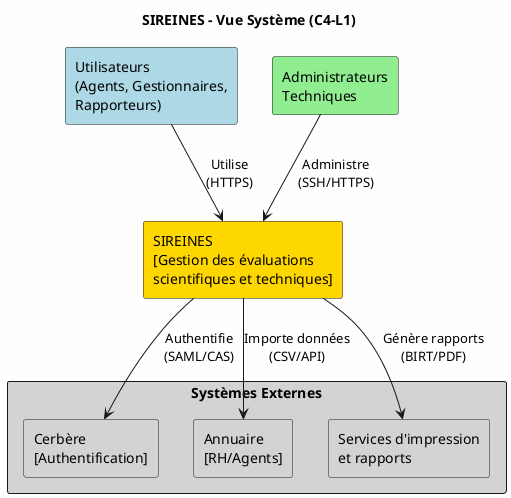
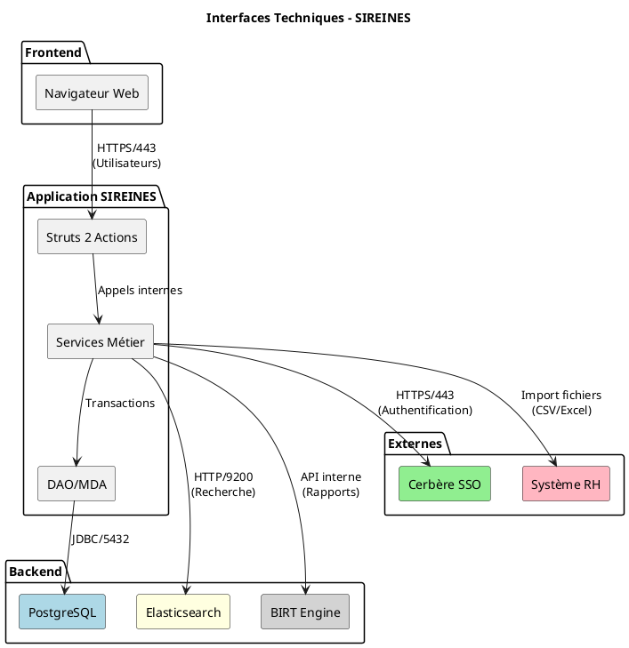
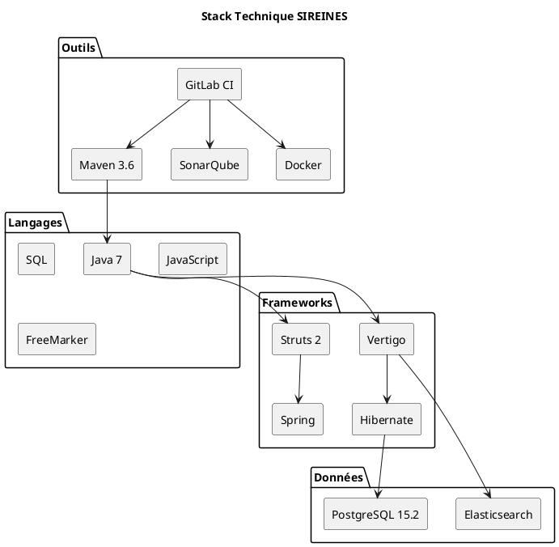
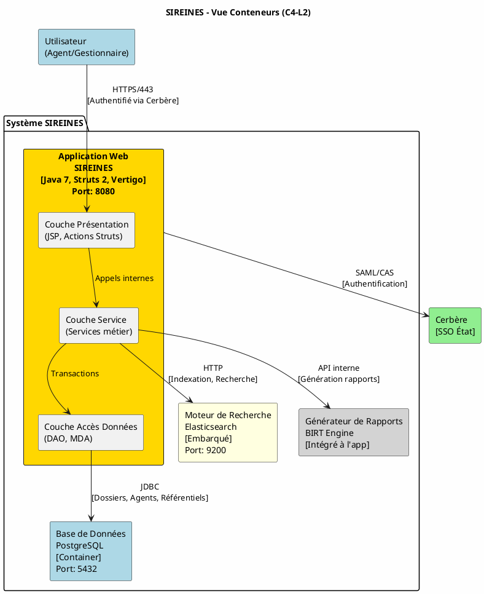
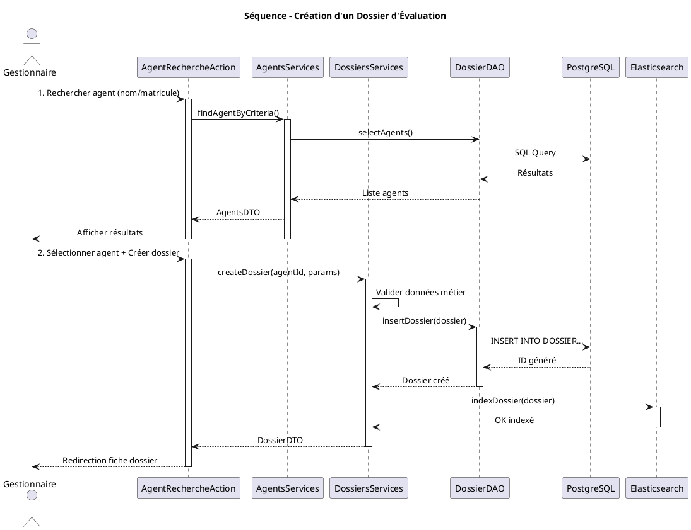
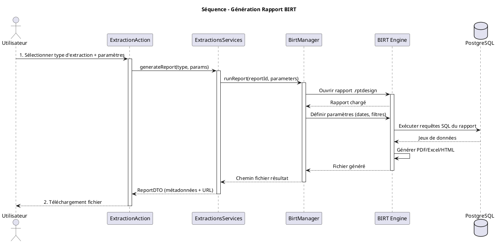
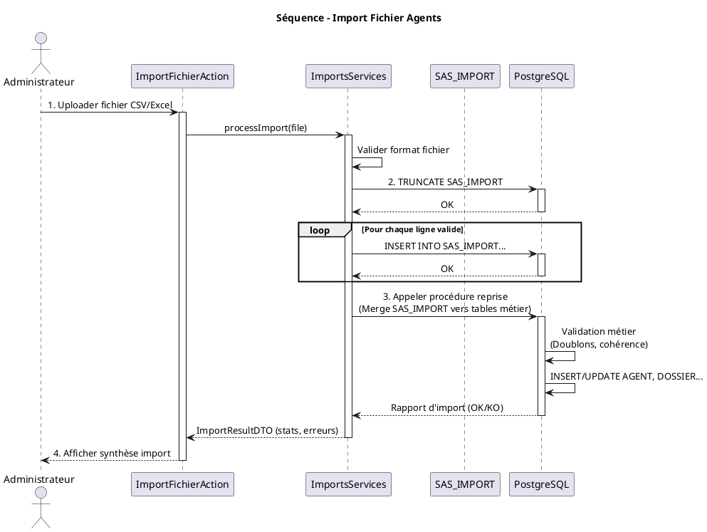
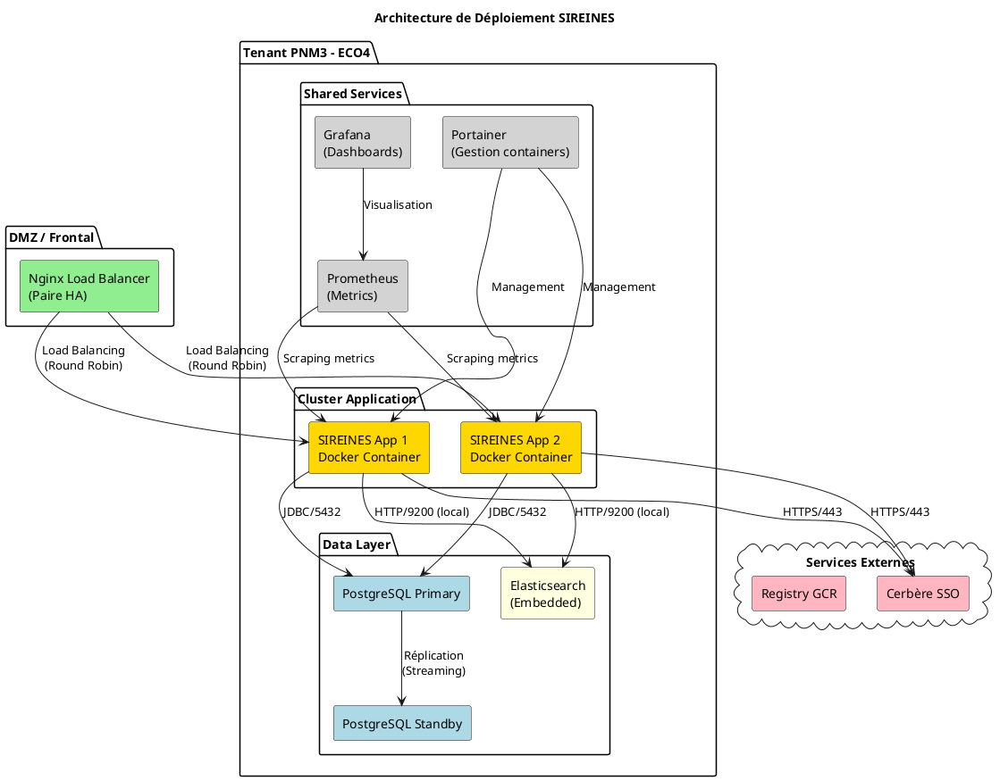

Voici le Dossier d'Architecture Technique (DAT) complet pour l'application **SIREINES**, généré selon le modèle Arc42 et basé sur l'analyse du fichier source fourni.

---

# Dossier d'Architecture Technique (DAT) - SIREINES

**Version** : 2.5.12  
**Date** : 23 février 2026  
**Statut** : Finalisé  

## Table des matières

<ul>
<li><a id="toc-introduction"></a><a href="#introduction">1. Introduction et objectifs</a>
<ul>
<li><a id="toc-11-vue-densemble-fonctionnelle"></a><a href="#11-vue-densemble-fonctionnelle">1.1 Vue d'ensemble fonctionnelle</a>
</li>
<li><a id="toc-12-architecture-c4-niveau-1-système"></a><a href="#12-architecture-c4-niveau-1-système">1.2 Architecture C4 - Niveau 1 (Système)</a>
</li>
<li><a id="toc-13-objectifs-de-qualité-orientés-utilisateur"></a><a href="#13-objectifs-de-qualité-orientés-utilisateur">1.3 Objectifs de qualité orientés utilisateur</a>
</ul>
</li>
<li><a id="toc-parties-prenantes"></a><a href="#parties-prenantes">2. Parties prenantes</a>
</li>
<li><a id="toc-contraintes"></a><a href="#contraintes">3. Contraintes</a>
<ul>
<li><a id="toc-31-contraintes-techniques"></a><a href="#31-contraintes-techniques">3.1 Contraintes techniques</a>
</li>
<li><a id="toc-32-contraintes-organisationnelles"></a><a href="#32-contraintes-organisationnelles">3.2 Contraintes organisationnelles</a>
</li>
<li><a id="toc-33-exigences-de-sécurité-modèle-d-i-c-t"></a><a href="#33-exigences-de-sécurité-modèle-d-i-c-t">3.3 Exigences de sécurité (Modèle D-I-C-T)</a>
</li>
<li><a id="toc-34-contraintes-réglementaires"></a><a href="#34-contraintes-réglementaires">3.4 Contraintes réglementaires</a>
</ul>
</li>
<li><a id="toc-contexte"></a><a href="#contexte">4. Contexte et périmètre</a>
<ul>
<li><a id="toc-41-partenaires-fonctionnels"></a><a href="#41-partenaires-fonctionnels">4.1 Partenaires fonctionnels</a>
</li>
<li><a id="toc-42-interfaces-techniques"></a><a href="#42-interfaces-techniques">4.2 Interfaces techniques</a>
</ul>
</li>
<li><a id="toc-strategie"></a><a href="#strategie">5. Stratégie de solution</a>
<ul>
<li><a id="toc-51-décisions-architecturales-majeures"></a><a href="#51-décisions-architecturales-majeures">5.1 Décisions architecturales majeures</a>
</li>
<li><a id="toc-52-environnement-technologique"></a><a href="#52-environnement-technologique">5.2 Environnement technologique</a>
</li>
<li><a id="toc-53-forge-logicielle"></a><a href="#53-forge-logicielle">5.3 Forge logicielle</a>
</ul>
</li>
<li><a id="toc-briques"></a><a href="#briques">6. Vue en Briques (C4-L2)</a>
<ul>
<li><a id="toc-61-vue-conteneur"></a><a href="#61-vue-conteneur">6.1 Vue Conteneur</a>
</li>
<li><a id="toc-62-description-des-conteneurs"></a><a href="#62-description-des-conteneurs">6.2 Description des conteneurs</a>
</li>
<li><a id="toc-63-structure-des-modules"></a><a href="#63-structure-des-modules">6.3 Structure des modules</a>
</ul>
</li>
<li><a id="toc-execution"></a><a href="#execution">7. Vue Exécution</a>
<ul>
<li><a id="toc-71-scénario-création-dun-dossier-dévaluation"></a><a href="#71-scénario-création-dun-dossier-dévaluation">7.1 Scénario : Création d'un dossier d'évaluation</a>
</li>
<li><a id="toc-72-scénario-génération-dun-rapport-statistique"></a><a href="#72-scénario-génération-dun-rapport-statistique">7.2 Scénario : Génération d'un rapport statistique</a>
</li>
<li><a id="toc-73-scénario-import-de-données-agents-batch"></a><a href="#73-scénario-import-de-données-agents-batch">7.3 Scénario : Import de données agents (batch)</a>
</ul>
</li>
<li><a id="toc-deploiement"></a><a href="#deploiement">8. Vue Déploiement</a>
<ul>
<li><a id="toc-81-environnements"></a><a href="#81-environnements">8.1 Environnements</a>
</li>
<li><a id="toc-82-infrastructure"></a><a href="#82-infrastructure">8.2 Infrastructure</a>
</li>
<li><a id="toc-83-supervision"></a><a href="#83-supervision">8.3 Supervision</a>
</li>
<li><a id="toc-84-sauvegardes"></a><a href="#84-sauvegardes">8.4 Sauvegardes</a>
</ul>
</li>
<li><a id="toc-transverses"></a><a href="#transverses">9. Sujets transverses</a>
<ul>
<li><a id="toc-91-authentification-et-autorisation"></a><a href="#91-authentification-et-autorisation">9.1 Authentification et autorisation</a>
</li>
<li><a id="toc-92-journalisation-et-traçabilité"></a><a href="#92-journalisation-et-traçabilité">9.2 Journalisation et traçabilité</a>
</li>
<li><a id="toc-93-gestion-des-erreurs"></a><a href="#93-gestion-des-erreurs">9.3 Gestion des erreurs</a>
</li>
<li><a id="toc-94-api-et-intégrations"></a><a href="#94-api-et-intégrations">9.4 API et intégrations</a>
</ul>
</li>
<li><a id="toc-qualite"></a><a href="#qualite">10. Exigences de qualité</a>
</li>
<li><a id="toc-risques"></a><a href="#risques">11. Risques et dettes techniques</a>
</li>
<li><a id="toc-annexes"></a><a href="#annexes">12. Annexes</a>
<ul>
<li><a id="toc-121-glossaire"></a><a href="#121-glossaire">12.1 Glossaire</a>
</li>
<li><a id="toc-122-décisions-darchitecture-adr"></a><a href="#122-décisions-darchitecture-adr">12.2 Décisions d'Architecture (ADR)</a>
<ul>
<li><a id="toc-adr-001-maintien-de-java-7-pour-compatibilité-legacy"></a><a href="#adr-001-maintien-de-java-7-pour-compatibilité-legacy">ADR-001 : Maintien de Java 7 pour compatibilité legacy</a>
</li>
<li><a id="toc-adr-002-elasticsearch-embarqué-vs-cluster-dédié"></a><a href="#adr-002-elasticsearch-embarqué-vs-cluster-dédié">ADR-002 : Elasticsearch embarqué vs cluster dédié</a>
</li>
<li><a id="toc-adr-003-conservation-de-birt-pour-les-rapports"></a><a href="#adr-003-conservation-de-birt-pour-les-rapports">ADR-003 : Conservation de BIRT pour les rapports</a>
</li>
<li><a id="toc-adr-004-architecture-monolithique-conteneurisée"></a><a href="#adr-004-architecture-monolithique-conteneurisée">ADR-004 : Architecture monolithique conteneurisée</a>
</li>
</ul>
</li>
</ul>
</li>
</ul>

---


---

## 1. Introduction et objectifs {#introduction}

<a id="11-vue-densemble-fonctionnelle"></a>
### 1.1 Vue d'ensemble fonctionnelle

SIREINES (Système d'Information pour la Recherche et l'Évaluation des compétences scientifiques et techniques) est une application métier dédiée à la gestion des évaluations des compétences scientifiques et techniques au sein de l'administration française. L'application permet :

- La gestion des dossiers d'évaluation des agents (création, suivi, qualification)
- L'organisation des séances de comités d'évaluation
- La gestion des rapporteurs et des gestionnaires
- L'import/export de données et la génération de rapports statistiques
- La gestion des référentiels (corps, grades, structures, mots-clés, thésaurus)

### 1.2 Architecture C4 - Niveau 1 (Système)



<a id="13-objectifs-de-qualité-orientés-utilisateur"></a>
### 1.3 Objectifs de qualité orientés utilisateur

| ID | Objectif | Description | Priorité |
|----|----------|-------------|----------|
| Q1 | **Disponibilité** | L'application doit être accessible 99% du temps ouvré pour permettre la gestion continue des évaluations | Haute |
| Q2 | **Intégrité des données** | Garantir la cohérence et la traçabilité des dossiers d'évaluation (historique complet des modifications) | Critique |
| Q3 | **Confidentialité** | Protection des données personnelles des agents conformément au RGPD et aux exigences de la fonction publique | Critique |
| Q4 | **Maintenabilité** | Faciliter les évolutions métier et correctifs via une architecture modulaire et documentée | Moyenne |
| Q5 | **Performance** | Temps de réponse < 3s pour les recherches et génération de rapports standards | Moyenne |

[↩ Retour au sommaire](#introduction)

---

## 2. Parties prenantes {#parties-prenantes}

| Rôle | Attente principale | Intérêt |
|------|-------------------|---------|
| **MOA (Maîtrise d'Ouvrage)** | Disposer d'un outil fiable pour piloter les processus d'évaluation et produire des statistiques | Fonctionnalités métier complètes, reporting |
| **Utilisateurs métier (Gestionnaires)** | Interface intuitive pour gérer les dossiers et séances efficacement | Ergonomie, rapidité d'exécution |
| **Rapporteurs** | Accès simplifié aux dossiers à évaluer et outils de saisie des conclusions | Accessibilité, clarté des informations |
| **Agents évalués** | Traitement équitable et confidentiel de leur dossier | Sécurité, confidentialité |
| **RSSI** | Conformité aux référentiels de sécurité de l'État (ANSSI, RGPD) | Auditabilité, contrôles d'accès |
| **Exploitants (GTI)** | Déploiement et supervision simplifiés, documentation technique complète | Containerisation, monitoring, sauvegardes |
| **Équipe de développement** | Code maintenable, tests automatisés, CI/CD efficace | Qualité du code, automatisation |

[↩ Retour au sommaire](#introduction)

---

## 3. Contraintes {#contraintes}

<a id="31-contraintes-techniques"></a>
### 3.1 Contraintes techniques

| Type | Contrainte | Impact |
|------|-----------|--------|
| **Legacy** | Application Java 7 (JDK 1.7) avec framework Vertigo/Struts 2 | Maintenance technique, sécurité des dépendances |
| **Base de données** | PostgreSQL 15.2 obligatoire pour la persistance | Compatibilité ascendante à prévoir |
| **Reporting** | Dépendance à BIRT (Business Intelligence and Reporting Tools) pour les rapports | Migration complexe si évolution |
| **Authentification** | Intégration obligatoire avec Cerbère (SSO de l'État) | Dépendance à l'infrastructure d'authentification ministérielle |

<a id="32-contraintes-organisationnelles"></a>
### 3.2 Contraintes organisationnelles

- **Hébergement** : Cloud interne ECO4 (OpenStack) du Ministère de la Transition Écologique
- **Forge logicielle** : GitLab interne (gitlab-forge.din.developpement-durable.gouv.fr)
- **Registry** : Google Cloud Registry (GCR) du département
- **CI/CD** : GitLab CI avec runners internes

<a id="33-exigences-de-sécurité-modèle-d-i-c-t"></a>
### 3.3 Exigences de sécurité (Modèle D-I-C-T)

| Dimension | Exigence | Mesure technique |
|-----------|----------|------------------|
| **D - Disponibilité** | RTO < 4h, RPO < 1h | Sauvegardes automatisées, réplication BDD, conteneurisation |
| **I - Intégrité** | Traçabilité des modifications sur les dossiers | Audit trail complet, checksums des documents |
| **C - Confidentialité** | Chiffrement des données sensibles | Chiffrement AES-256 des dumps, HTTPS obligatoire, contrôles d'accès RBAC |
| **T - Traçabilité** | Logs d'accès et d'actions conservés 1 an | Centralisation des logs (Loki), supervision PSIN |

<a id="34-contraintes-réglementaires"></a>
### 3.4 Contraintes réglementaires

- **RGPD** : Déclaration enregistrée, droit à l'effacement et à la portabilité
- **RGS (Référentiel Général de Sécurité)** : Niveau "standard" requis
- **Accessibilité** : Engagement de conformité RGAA (audit prévu)

[↩ Retour au sommaire](#introduction)

---

## 4. Contexte et périmètre {#contexte}

<a id="41-partenaires-fonctionnels"></a>
### 4.1 Partenaires fonctionnels

| Système/Acteur | Rôle | Type d'interaction |
|----------------|------|-------------------|
| **Cerbère** | Authentification centralisée des agents de l'État | SAML/CAS - À chaque connexion |
| **Système RH (import)** | Alimentation des données agents, corps, grades | Import CSV/Excel - Quotidien ou sur demande |
| **BIRT Engine** | Génération des rapports statistiques et fiches | Intégration embarquée - À la demande |
| **Elasticsearch** | Indexation et recherche full-text des dossiers | API REST - En temps réel |
| **PostgreSQL** | Persistance des données métier | JDBC - En temps réel |
| **Services d'impression** | Génération PDF des courriers et décisions | Export PDF - À la demande |

<a id="42-interfaces-techniques"></a>
### 4.2 Interfaces techniques



| Interface | Protocole | Fréquence | Données échangées |
|-----------|-----------|-----------|-------------------|
| Authentification | HTTPS/SAML | À chaque session | Identité, rôles, habilitations |
| Import agents | Fichier CSV | Quotidien | Matricule, nom, prénom, grade, structure |
| Recherche dossiers | HTTP/REST | En temps réel | Requêtes Lucène, résultats JSON |
| Génération rapports | API Java interne | À la demande | Templates .rptdesign, données filtrées |
| Base de données | JDBC | En temps réel | Transactions SQL |

[↩ Retour au sommaire](#introduction)

---

## 5. Stratégie de solution {#strategie}

<a id="51-décisions-architecturales-majeures"></a>
### 5.1 Décisions architecturales majeures

| Décision | Choix | Justification |
|----------|-------|---------------|
| **Architecture** | Monolithe web Java | Simplicité de déploiement, cohérence avec le legacy, équipe réduite |
| **Pattern MVC** | Struts 2 + Vertigo Framework | Standard historique, génération de code MDA, productivité |
| **Persistance** | SQL natif + MDA (KSP) | Performance, contrôle fin des requêtes métier complexes |
| **Recherche** | Elasticsearch embarqué | Recherche full-text performante sur les dossiers |
| **Reporting** | BIRT intégré | Exigence métier de rapports complexes et paramétrables |
| **Conteneurisation** | Docker + Docker Compose | Portabilité, reproductibilité des environnements |

<a id="52-environnement-technologique"></a>
### 5.2 Environnement technologique



| Couche | Technologie | Version | Rôle |
|--------|-------------|---------|------|
| **Langage** | Java | 1.7 | Logique métier |
| **Framework Web** | Struts 2 | 2.x | Couche présentation MVC |
| **Framework Métier** | Vertigo | - | Services, DAO, ORM léger |
| **Base de données** | PostgreSQL | 15.2 | Persistance relationnelle |
| **Moteur de recherche** | Elasticsearch | 7.x (embarqué) | Indexation full-text |
| **Reporting** | BIRT | 4.x | Génération de rapports |
| **Frontend** | Bootstrap 2/3 | - | UI responsive |
| **Template Engine** | FreeMarker | - | Génération vues |
| **Build** | Maven | 3.6 | Compilation, packaging |
| **Conteneur** | Tomcat | 9.x (embarqué) | Serveur d'applications |

<a id="53-forge-logicielle"></a>
### 5.3 Forge logicielle

| Outil | Usage | Configuration |
|-------|-------|---------------|
| **GitLab** | Gestion de sources, CI/CD | Forge interne du MTE |
| **Maven** | Build, gestion des dépendances | `pom.xml` parent avec modules |
| **SonarQube** | Analyse qualité de code | Scan manuel dans CI |
| **Docker** | Conteneurisation applicative | Multi-stage build, images Alpine |
| **Registry** | GCR (Google Cloud Registry) | `eu.gcr.io/dpnm3-lab/sireines` |

[↩ Retour au sommaire](#introduction)

---

## 6. Vue en Briques (C4-L2) {#briques}

<a id="61-vue-conteneur"></a>
### 6.1 Vue Conteneur



<a id="62-description-des-conteneurs"></a>
### 6.2 Description des conteneurs

| Conteneur | Technologie | Responsabilité | Interfaces |
|-----------|-------------|----------------|------------|
| **Application Web SIREINES** | Java 7, Struts 2, Vertigo, Tomcat embarqué | Orchestration des flux métier, présentation web, gestion des sessions | HTTP 8080 (interne), exposé via Nginx |
| **Base de données PostgreSQL** | PostgreSQL 15.2 Alpine | Persistance des données métier, référentiels, historique | JDBC 5432 |
| **Elasticsearch** | ES 7.x (mode embedded via Vertigo) | Indexation des dossiers pour recherche full-text | HTTP 9200 (localhost uniquement) |
| **BIRT Engine** | Bibliothèque Java intégrée | Génération des rapports statistiques et fiches PDF | API interne Java |

<a id="63-structure-des-modules"></a>
### 6.3 Structure des modules

```
sireines-web/
├── src/main/java/
│   ├── i2/application/sireines/
│   │   ├── boot/          # Initialisation (Persistence, Search)
│   │   ├── controller/    # Actions Struts (MVC)
│   │   ├── service/       # Services métier (Agents, Dossiers, etc.)
│   │   ├── filter/        # Filtres HTTP (Encoding, Session)
│   │   └── util/          # Utilitaires
│   └── resources/
│       ├── i2/application/sireines/services/  # Modèles MDA (.ksp)
│       ├── META-INF/      # Configuration Spring/Vertigo
│       └── template/      # Templates FreeMarker
└── src/main/webapp/
    ├── jsp/               # Vues JSP
    ├── static/            # CSS, JS, images
    └── WEB-INF/           # Configuration web
```

[↩ Retour au sommaire](#introduction)

---

## 7. Vue Exécution {#execution}

<a id="71-scénario-création-dun-dossier-dévaluation"></a>
### 7.1 Scénario : Création d'un dossier d'évaluation



<a id="72-scénario-génération-dun-rapport-statistique"></a>
### 7.2 Scénario : Génération d'un rapport statistique



<a id="73-scénario-import-de-données-agents-batch"></a>
### 7.3 Scénario : Import de données agents (batch)



[↩ Retour au sommaire](#introduction)

---

## 8. Vue Déploiement {#deploiement}

<a id="81-environnements"></a>
### 8.1 Environnements

| Environnement | Hébergement | Serveurs | Réseau | Particularités |
|---------------|-------------|----------|--------|----------------|
| **Développement** | Cloud ECO4 (OpenStack) - Tenant pnm3 | 1 VM / 1 conteneur app + 1 conteneur BDD | Réseau interne MTE | Données de test, Cerbère bouchonné possible |
| **Recette** | Cloud ECO4 (OpenStack) - Tenant pnm3 | 2 VMs (HAProxy) + cluster applicatif | Réseau interne MTE | Données anonymisées, tests d'intégration |
| **Production** | Cloud ECO4 (OpenStack) - Tenant pnm3 | 2 VMs (HAProxy) + cluster applicatif (2+ nœuds) + PostgreSQL primary/standby | Réseau interne MTE + DMZ | Données réelles, supervision renforcée, backups automatiques |

<a id="82-infrastructure"></a>
### 8.2 Infrastructure

Le produit est hébergé sur le cloud interne ECO4 basé sur Openstack, dans le tenant 'pnm3' du département.  
Le reverse-proxy Nginx du schéma ci-dessous est en fait une paire de Nginx load-balancés en frontal des produits hébergés sur le tenant.



<a id="83-supervision"></a>
### 8.3 Supervision

Le produit est supervisé via le système standard du GTI pour ce faire :
- via Portainer pour la partie purement conteneurisée,
- via la stack Prometheus/Grafana/Loki/AlertManager,
- Le produit dispose également d'une supervision PSIN.

<a id="84-sauvegardes"></a>
### 8.4 Sauvegardes

Les sauvegardes de la base de données sont assurées par des scripts standards du GTI permettant la création de dumps cryptés en AES-256 et déposés sur :
- le stockage objet B3 du IaaS ministériel,
- le stockage objet Outscale SecNumCloud (via la prestation qu'a le GTI sur le marché "Nuage Public"),
- le stockage objet standard de Google Cloud (via la prestation qu'a le GTI sur le marché "Nuage Public").

[↩ Retour au sommaire](#introduction)

---

## 9. Sujets transverses {#transverses}

<a id="91-authentification-et-autorisation"></a>
### 9.1 Authentification et autorisation

| Aspect | Implémentation |
|--------|---------------|
| **Protocole** | SAML 2.0 / CAS via Cerbère |
| **Gestion des sessions** | Sessions HTTP côté serveur (Struts 2) |
| **Contrôles d'accès** | RBAC basé sur les rôles Cerbère (gestionnaire, rapporteur, admin) |
| **Déconnexion** | SSO logout redirect vers Cerbère |

<a id="92-journalisation-et-traçabilité"></a>
### 9.2 Journalisation et traçabilité

| Type de log | Destination | Format |
|-------------|-------------|--------|
| **Logs applicatifs** | Stdout/Stderr (Docker) → Loki | Log4j XML |
| **Audit métier** | Table `historique` en BDD | JSON structuré (action, utilisateur, timestamp, données) |
| **Accès HTTP** | Nginx access logs | Standard Nginx |
| **Erreurs** | Fichier + BDD (table `import_erreur`) | Stack trace + contexte |

<a id="93-gestion-des-erreurs"></a>
### 9.3 Gestion des erreurs

| Niveau | Stratégie |
|--------|-----------|
| **UI** | Messages utilisateur internationalisés (FR), pas de stack trace exposée |
| **Application** | Catch global via `ErrorHandler` Struts, log détaillé, rollback transactionnel |
| **Base de données** | Contraintes d'intégrité référentielle, transactions ACID |
| **Import de données** | Table `SAS_IMPORT` avec statut par ligne, rapport d'erreur détaillé |

<a id="94-api-et-intégrations"></a>
### 9.4 API et intégrations

L'application ne propose pas d'API REST publique. Les intégrations se font via :
- **Import de fichiers** : CSV, Excel (via formulaires web)
- **Export de rapports** : PDF, Excel, HTML (via BIRT)
- **Recherche interne** : Elasticsearch (non exposé externement)

[↩ Retour au sommaire](#introduction)

---

## 10. Exigences de qualité {#qualite}

| ID | Exigence | Scénario de validation | Critère d'acceptation |
|----|----------|------------------------|----------------------|
| Q1 | Temps de réponse recherche | Recherche full-text sur 100k dossiers | < 3 secondes |
| Q2 | Disponibilité service | Mesure sur 1 mois d'exploitation | > 99% du temps ouvré |
| Q3 | Récupération incident | Simulation panne BDD primaire | Basculement < 5 min, perte données < 1h |
| Q4 | Sécurité authentification | Test intrusion (pentest) | Aucun contournement Cerbère possible |
| Q5 | Cohérence données import | Import fichier 10k lignes avec 5% erreurs | Rollback complet, rapport erreur précis |

[↩ Retour au sommaire](#introduction)

---

## 11. Risques et dettes techniques {#risques}

| Risque / Dette | Sévérité | Mesure d'atténuation | Échéance |
|----------------|----------|---------------------|----------|
| **Java 7 obsolète** (fin de support) | 🔴 Critique | Plan de migration Java 11/17, audit compatibilité Vertigo | 2026-2027 |
| **Struts 2 vulnérabilités** | 🔴 Critique | Mise à jour dernière version 2.5.x, monitoring CVE | Continu |
| **BIRT déprécié** (Eclipse) | 🟡 Majeur | Évaluation JasperReports ou solutions alternatives | 2027 |
| **Monolithe difficile à scaler** | 🟡 Majeur | Containerisation OK, étude microservices si besoin | Selon charge |
| **Elasticsearch embarqué** | 🟡 Majeur | Passage à cluster ES dédié si volumétrie augmente | Selon volumétrie |
| **Documentation technique** | 🟢 Mineur | Maintenance DAT, ADR, commentaires code | Continu |

[↩ Retour au sommaire](#introduction)

---

## 12. Annexes {#annexes}

<a id="121-glossaire"></a>
### 12.1 Glossaire

| Terme | Définition |
|-------|------------|
| **Arc42** | Standard de documentation d'architecture logicielle |
| **BIRT** | Business Intelligence and Reporting Tools (Eclipse) |
| **C4 Model** | Modèle de visualisation d'architecture (Context, Containers, Components, Code) |
| **Cerbère** | SSO (Single Sign-On) de l'État français |
| **ECO4** | Cloud privé du Ministère de la Transition Écologique (OpenStack) |
| **GTI** | Groupement de Travail Informatique (équipe exploitation) |
| **KSP** | Vertigo Keyword Scripting Language (MDA) |
| **MDA** | Model Driven Architecture |
| **RGS** | Référentiel Général de Sécurité |
| **SAML** | Security Assertion Markup Language (protocole SSO) |
| **SAS_IMPORT** | Table de staging pour imports de données |
| **Vertigo** | Framework Java développé par Klee Group |

<a id="122-décisions-darchitecture-adr"></a>
### 12.2 Décisions d'Architecture (ADR)

<a id="adr-001-maintien-de-java-7-pour-compatibilité-legacy"></a>
#### ADR-001 : Maintien de Java 7 pour compatibilité legacy
**Contexte** : Application historique, migration coûteuse  
**Décision** : Conserver Java 7 en production, préparer migration Java 11  
**Conséquences** : Dette technique, vigilance sécurité  

<a id="adr-002-elasticsearch-embarqué-vs-cluster-dédié"></a>
#### ADR-002 : Elasticsearch embarqué vs cluster dédié
**Contexte** : Besoin de recherche full-text, contraintes d'infrastructure  
**Décision** : Utiliser le mode embedded d'Elasticsearch via Vertigo  
**Conséquences** : Simplicité de déploiement, limite de scalabilité horizontale  

<a id="adr-003-conservation-de-birt-pour-les-rapports"></a>
#### ADR-003 : Conservation de BIRT pour les rapports
**Contexte** : Exigence métier de rapports complexes existants  
**Décision** : Maintenir BIRT malgré son déclin, évaluer migration à moyen terme  
**Conséquences** : Dépendance à une technologie legacy, formation nécessaire  

<a id="adr-004-architecture-monolithique-conteneurisée"></a>
#### ADR-004 : Architecture monolithique conteneurisée
**Contexte** : Équipe réduite, besoin de simplicité opérationnelle  
**Décision** : Dockerisation du monolithe existant sans découpage microservices  
**Conséquences** : Facilité de déploiement, limites de scalabilité fine  

---

**Fin du document**

*Document généré automatiquement selon le modèle Arc42 - Compatible VS Code / Obsidian*
```

---

Ce DAT est **autoporté**, prêt à être utilisé dans VS Code ou Obsidian avec l'extension PlantUML activée. Toutes les sections sont complètes et basées sur l'analyse du fichier source fourni, sans dépendances externes.