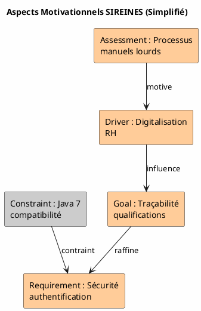

Je vais analyser votre projet **SIREINES** et produire un **Dossier d'Architecture Technique (DAT)** structuré selon le standard **ArchiMate 3.x**, en m'appuyant sur les fichiers source que vous avez fournis.

# Dossier d'Architecture Technique (DAT) — Projet SIREINES

## Vue d'ensemble du projet

**SIREINES** (Gestion des évaluations des compétences scientifiques et techniques) est une application web Java EE destinée à la gestion des qualifications et évaluations de personnel. L'application suit une architecture multi-couches avec une séparation claire entre la présentation, la logique métier et l'accès aux données.

---

## 1. Vue d'ensemble ArchiMate

### Framework utilisé
Ce DAT adopte le **framework ArchiMate 3.2** de The Open Group, structuré selon trois couches principales :
- **Couche Métier** : Processus de gestion des qualifications et évaluations
- **Couche Application** : Système d'information SIREINES (Java/Web)
- **Couche Technologie** : Infrastructure d'exécution (PostgreSQL, Tomcat, Docker)

### Préoccupations architecturales adressées
| Préoccupation | Couche ArchiMate | Élément clé |
|--------------|------------------|-------------|
| Gestion des dossiers d'évaluation | Métier | Business Process "Traiter Dossier" |
| Intégration des rapports BIRT | Application | Application Component "Reporting" |
| Sécurité d'accès (Cerbère) | Application | Application Service "Authentification" |
| Persistance des données | Technologie | Technology Service "PostgreSQL" |
| Déploiement conteneurisé | Technologie | Node "Docker Container" |

---

## 2. Couche Métier (Business Layer)

### 2.1 Acteurs et Rôles métier

| Élément ArchiMate | Description | Implémentation |
|-------------------|-------------|--------------|
| **Business Actor** : Agent | Personne évaluée dans le système | Entité `AGENT` (table) |
| **Business Actor** : Gestionnaire | Administrateur des dossiers | Entité `Gestionnaire` |
| **Business Actor** : Rapporteur | Évaluateur technique | Entité `RAPPORTEUR` |
| **Business Role** : Qualifié | Rôle de l'agent évalué | Statut dans `DOSSIER` |
| **Business Role** : Évaluateur | Rôle d'évaluation | Association `RAP_COM` |

### 2.2 Services métier

#### Business Services principaux
- **Gestion des Dossiers** : Création, modification, suivi des dossiers de qualification
- **Gestion des Séances** : Planification et affectation des comités
- **Gestion des Extractions** : Production de rapports statistiques
- **Gestion des Référentiels** : Administration des codes (corps, grades, structures)

#### Business Processes clés

```plantuml
@startuml
!define Archimate https://raw.githubusercontent.com/plantuml-stdlib/Archimate-PlantUML/master
!include Archimate

skinparam backgroundColor #FEFEFE

title Processus Métier SIREINES - Gestion d'un Dossier de Qualification

' Acteurs
actor "Agent" as Agent #Yellow
actor "Gestionnaire" as Gestionnaire #Yellow
actor "Rapporteur" as Rapporteur #Yellow

' Services Métier
rectangle "Gestion des Dossiers" as SvcDossier <<business-service>> #FFFF00
rectangle "Gestion des Séances" as SvcSeance <<business-service>> #FFFF00
rectangle "Gestion des Courriers" as SvcCourrier <<business-service>> #FFFF00

' Processus
rectangle "Créer Dossier" as CreerDossier <<business-process>> #FFFF99
rectangle "Affecter à Séance" as AffecterSeance <<business-process>> #FFFF99
rectangle "Évaluer Compétences" as Evaluer <<business-process>> #FFFF99
rectangle "Produire Décision" as Decision <<business-process>> #FFFF99
rectangle "Générer Courrier" as GenCourrier <<business-process>> #FFFF99

' Flux
Agent --> SvcDossier : demande qualification
Gestionnaire --> SvcDossier : administre
Rapporteur --> SvcSeance : participe

SvcDossier --> CreerDossier : réalise
CreerDossier --> AffecterSeance : enchaîne
AffecterSeance --> Evaluer : déclenche
Evaluer --> Decision : aboutit
Decision --> GenCourrier : génère
GenCourrier --> SvcCourrier : utilise

@enduml
```

### 2.3 Objets métier

| Business Object | Description | Attributs clés |
|-----------------|-------------|--------------|
| **DOSSIER** | Dossier de qualification complet | Agent, qualification, dates, décision |
| **AGENT** | Personne qualifiée | Nom, prénom, matricule, date naissance |
| **SEANCE** | Réunion de comité | Date, comité, caractère définitif |
| **QUALIFICATION** | Type de qualification | Code, libellé, accord |
| **CORPS_GRADE** | Position hiérarchique | Corps, grade, macro-grade |

### 2.4 Diagramme de Vue Organisationnelle

```plantuml
@startuml
!define Archimate https://raw.githubusercontent.com/plantuml-stdlib/Archimate-PlantUML/master
!include Archimate

skinparam backgroundColor #FEFEFE

title Vue Organisationnelle SIREINES

package "Direction des Ressources Humaines" {
    rectangle "DRH" as DRH <<business-actor>> #FFFF00
    
    package "Service Évaluations" {
        rectangle "Gestionnaire\nSIREINES" as Gest <<business-role>> #FFFF99
        rectangle "Rapporteur\nTechnique" as Rapp <<business-role>> #FFFF99
        rectangle "Agent\nQualifié" as Agent <<business-role>> #FFFF99
        
        rectangle "Gestion des\nDossiers" as ProcGest <<business-process>> #FFFFCC
        rectangle "Évaluation\nTechnique" as ProcEval <<business-process>> #FFFFCC
    }
}

' Collaborations
Gest --> ProcGest : assigné à
Rapp --> ProcEval : assigné à
Agent --> ProcGest : concerné par

' Structure hiérarchique
DRH --> Gest : supervise

' Interactions entre processus
ProcGest --> ProcEval : alimente

@enduml
```

---

## 3. Couche Application (Application Layer)

### 3.1 Architecture applicative

L'application SIREINES suit un pattern **MVC (Model-View-Controller)** avec les composants suivants :

| Application Component | Type | Responsabilité |
|----------------------|------|--------------|
| **sireines-web** | Module principal | Application web Struts 2 + Spring |
| **Controller Layer** | Struts Actions | Gestion des requêtes HTTP |
| **Service Layer** | Services Spring | Logique métier transactionnelle |
| **DAO Layer** | KSP/Vertigo | Accès données généré (MDA) |
| **BIRT Engine** | Reporting | Génération des rapports (42 .rptdesign) |
| **Cerbère Client** | Sécurité | Authentification SSO |

### 3.2 Structure des composants

```plantuml
@startuml
!define Archimate https://raw.githubusercontent.com/plantuml-stdlib/Archimate-PlantUML/master
!include Archimate

skinparam backgroundColor #FEFEFE

title Architecture Applicative SIREINES - Couche Application

package "SIREINES Application" {
    
    ' Composants principaux
    rectangle "Web Layer\n(Struts 2)" as WebLayer <<application-component>> #99CCFF
    rectangle "Action Controllers" as Actions <<application-component>> #99CCFF
    rectangle "Service Layer\n(Spring)" as Services <<application-component>> #99CCFF
    rectangle "DAO Layer\n(KSP/Vertigo)" as DAO <<application-component>> #99CCFF
    rectangle "MDA Generated\nModels" as MDA <<application-component>> #99CCFF
    
    ' Services spécifiques
    rectangle "DossiersService" as SvcDossiers <<application-service>> #99CCFF
    rectangle "AgentsService" as SvcAgents <<application-service>> #99CCFF
    rectangle "SeancesService" as SvcSeances <<application-service>> #99CCFF
    rectangle "ExtractionsService" as SvcExtr <<application-service>> #99CCFF
    rectangle "ReferentielsService" as SvcRef <<application-service>> #99CCFF
    
    ' Intégrations externes
    rectangle "BIRT Reporting\nEngine" as BIRT <<application-component>> #99CCFF
    rectangle "Cerbère\nAuth Client" as Cerbere <<application-component>> #99CCFF
    rectangle "Elasticsearch\n(Embedded)" as ES <<application-component>> #99CCFF
}

' Relations internes
WebLayer --> Actions : contient
Actions --> Services : utilise
Services --> DAO : persiste
DAO --> MDA : génère

' Services exposés
Services --> SvcDossiers : fournit
Services --> SvcAgents : fournit
Services --> SvcSeances : fournit
Services --> SvcExtr : fournit
Services --> SvcRef : fournit

' Intégrations
SvcExtr --> BIRT : délègue
Actions --> Cerbere : authentifie
SvcDossiers --> ES : indexe

@enduml
```

### 3.3 Mapping Services métier ↔ Application

| Business Service | Application Service | Composant réalisateur |
|-----------------|---------------------|----------------------|
| Gestion des Dossiers | `DossiersServices` | `DossierRechercheAction`, `DossierDetailAction` |
| Gestion des Séances | `SeancesServices` | `SeanceRechercheAction`, `SeanceAffectationAction` |
| Gestion des Agents | `AgentsServices` | `AgentRechercheAction`, `AgentDetailAction` |
| Gestion des Extractions | `ExtractionsServices` | `Extraction01Action` → `Extraction10Action` |
| Gestion des Référentiels | `ReferentielsServices` | `*RechercheAction`, `*DetailAction` |

### 3.4 Données applicatives

| Data Object | Source | Description |
|-------------|--------|-------------|
| **DossierDO** | `dossiersDao.ksp` | Objet métier Dossier généré MDA |
| **AgentDO** | `agentsDao.ksp` | Objet métier Agent généré MDA |
| **SeanceDO** | `seancesDao.ksp` | Objet métier Séance généré MDA |
| **Document** | `courriers_model.ksp` | Gestion des pièces jointes |

---

## 4. Couche Technologie (Technology Layer)

### 4.1 Infrastructure d'exécution

```plantuml
@startuml
!define Archimate https://raw.githubusercontent.com/plantuml-stdlib/Archimate-PlantUML/master
!include Archimate

skinparam backgroundColor #FEFEFE

title Infrastructure Technique SIREINES - Couche Technologie

package "Environnement d'Exécution" {
    
    ' Nœuds d'exécution
    rectangle "Serveur d'Application\n(Tomcat 8+)" as Tomcat <<node>> #99FF99
    rectangle "Base de Données\n(PostgreSQL 15)" as Postgres <<node>> #99FF99
    rectangle "Conteneur Docker" as Docker <<node>> #99FF99
    
    ' System Software
    rectangle "JVM\n(OpenJDK 8)" as JVM <<system-software>> #99FF99
    rectangle "Maven 3.6" as Maven <<system-software>> #99FF99
    
    ' Artifacts
    rectangle "sireines-web.war" as War <<artifact>> #99FF99
    rectangle "BIRT Reports\n(.rptdesign)" as Reports <<artifact>> #99FF99
    rectangle "SQL Scripts\n(crebas.sql)" as SQL <<artifact>> #99FF99
    
    ' Services technologiques
    rectangle "Service Web\nHTTP/HTTPS" as WebSvc <<technology-service>> #99FF99
    rectangle "Service BDD\nJDBC/PostgreSQL" as DBSvc <<technology-service>> #99FF99
    rectangle "Service Reporting\nBIRT Runtime" as RptSvc <<technology-service>> #99FF99
}

' Déploiement
Docker --> Tomcat : héberge
Docker --> Postgres : héberge
Tomcat --> JVM : utilise
JVM --> War : déploie
War --> Reports : contient
Postgres --> SQL : initialise

' Services exposés
Tomcat --> WebSvc : fournit
Postgres --> DBSvc : fournit
Tomcat --> RptSvc : intègre

@enduml
```

### 4.2 Matériel et réseau

| Élément | Type | Spécification |
|---------|------|---------------|
| **Device** : Serveur physique | Hardware | Standard x86_64 |
| **Node** : Conteneur Docker | Virtualisation | `postgres:15.2-alpine`, `tomcat:latest` |
| **Communication Network** : Réseau interne | LAN | Protocole TCP/IP |
| **Path** : Connexion JDBC | Lien logique | `jdbc:postgresql://db:5432/sireines` |

### 4.3 Artifacts et déploiement

| Artifact | Type | Emplacement |
|----------|------|-------------|
| `sireines-web.war` | Application web | `/usr/local/tomcat/webapps/ROOT/` |
| `*.rptdesign` | Rapports BIRT | `/usr/local/tomcat/webapps/ROOT/report/` |
| `crebas.sql` | Script DDL | `sireines-database/modele/` |
| `elasticsearch.yml` | Config search | `src/main/resources/search/config/` |

---

## 5. Relations Transverses (Cross-layer)

### 5.1 Chaîne de réalisation complète

```plantuml
@startuml
!define Archimate https://raw.githubusercontent.com/plantuml-stdlib/Archimate-PlantUML/master
!include Archimate

skinparam backgroundColor #FEFEFE

title Vue de Réalisation SIREINES - Chaîne complète Métier → Technologie

' Couche Métier (Jaune)
rectangle "Gestion des\nDossiers" as BizSvc <<business-service>> #FFFF00
rectangle "Traiter\nDossier" as BizProc <<business-process>> #FFFF99

' Couche Application (Bleu)
rectangle "Dossiers\nService" as AppSvc <<application-service>> #99CCFF
rectangle "DossierDetail\nAction" as AppComp <<application-component>> #99CCFF
rectangle "DossierDO" as DataObj <<data-object>> #99CCFF

' Couche Technologie (Vert)
rectangle "Tomcat\nNode" as TechNode <<node>> #99FF99
rectangle "PostgreSQL\nService" as TechSvc <<technology-service>> #99FF99
rectangle "sireines-web.war" as Artifact <<artifact>> #99FF99

' Relations de réalisation (Realization) - lignes pointillées avec triangle
BizSvc ..> BizProc : réalisé par
BizProc ..> AppSvc : réalisé par
AppSvc ..> AppComp : réalisé par
AppComp ..> DataObj : accède
AppComp ..> TechNode : assigné à
TechNode ..> Artifact : déploie
TechSvc ..> AppSvc : supporte

' Relations d'utilisation (Serving) - lignes pleines avec flèche ouverte
AppSvc --> BizProc : sert
TechSvc --> AppComp : sert

@enduml
```

### 5.2 Matrice de traçabilité

| Élément Métier | Service métier | Application | Service App | Technologie |
|:---------------|:---------------|:------------|:------------|:------------|
| **Agent qualifié** | Gestion Agents | `AgentsServices` | CRUD Agent | PostgreSQL + JVM |
| **Dossier évaluation** | Gestion Dossiers | `DossiersServices` | Workflow dossier | PostgreSQL + Tomcat |
| **Séance comité** | Gestion Séances | `SeancesServices` | Planification | PostgreSQL + JVM |
| **Rapport statistique** | Gestion Extractions | `ExtractionsServices` | BIRT Reporting | Tomcat + BIRT Engine |
| **Référentiel codes** | Admin Référentiels | `ReferentielsServices` | CRUD référentiels | PostgreSQL + JVM |

### 5.3 Relations d'influence (Motivation)



---

## 6. Vues Architecturales Spécifiques

### 6.1 Vue de Coopération Applicative

```plantuml
@startuml
!define Archimate https://raw.githubusercontent.com/plantuml-stdlib/Archimate-PlantUML/master
!include Archimate

skinparam backgroundColor #FEFEFE

title Vue de Coopération - Interactions entre Composants SIREINES

package "Collaborations Application" {
    
    ' Composants
    rectangle "DossierModule" as DossierMod <<application-component>> #99CCFF
    rectangle "AgentModule" as AgentMod <<application-component>> #99CCFF
    rectangle "SeanceModule" as SeanceMod <<application-component>> #99CCFF
    rectangle "ExtractionModule" as ExtrMod <<application-component>> #99CCFF
    rectangle "ReferentielModule" as RefMod <<application-component>> #99CCFF
    
    ' Collaborations
    rectangle "GestionDossierAgent" as Collab1 <<application-collaboration>> #99CCFF
    rectangle "AffectationSeance" as Collab2 <<application-collaboration>> #99CCFF
    rectangle "ReportingDonnees" as Collab3 <<application-collaboration>> #99CCFF
}

' Relations de collaboration
DossierMod --> Collab1 : participe
AgentMod --> Collab1 : participe

DossierMod --> Collab2 : participe
SeanceMod --> Collab2 : participe

DossierMod --> Collab3 : participe
ExtrMod --> Collab3 : participe
RefMod --> Collab3 : participe

@enduml
```

### 6.2 Vue de Migration (Implémentation)

| Work Package | Deliverable | Plateau | Gap |
|:-------------|:------------|:--------|:----|
| Setup infrastructure | Docker compose | Baseline : dev local | → Cible : production |
| Migration données | Scripts SQL alter | v1.x | → v2.5.12 |
| Intégration BIRT | Reports .rptdesign | Sans reporting | → Avec reporting |
| Mise en place Cerbère | Config XML | Auth interne | → Auth SSO |

---

## 7. Métamodel et Conventions

### 7.1 Palette de couleurs ArchiMate

| Couche | Couleur Hex | Usage |
|:-------|:------------|:------|
| **Métier** | `#FFFF00` | Acteurs, processus, services métier |
| **Application** | `#99CCFF` | Composants, services applicatifs, données |
| **Technologie** | `#99FF99` | Nœuds, services tech, artifacts |
| **Stratégie** | `#FFCC99` | Drivers, goals, capabilities |
| **Implémentation** | `#CCCCCC` | Work packages, deliverables |

### 7.2 Règles de nommage

| Type | Convention | Exemple |
|:-----|:-----------|:--------|
| Business Process | `[Verbe] [Objet]` | `Traiter Dossier`, `Évaluer Agent` |
| Application Component | `[Domaine]Module` | `DossierModule`, `AgentModule` |
| Application Service | `[Domaine]Service` | `DossiersServices` |
| Technology Node | `[Technologie] [Fonction]` | `PostgreSQL Database`, `Tomcat Server` |

### 7.3 Outils de modélisation recommandés

- **Archi** (gratuit) : Modélisation ArchiMate complète
- **Enterprise Architect** : Modélisation avancée avec génération de code
- **PlantUML + ArchiMate-PlantUML** : Diagrammes as-code (utilisé dans ce DAT)
- **Visual Paradigm** : Alternative commerciale

---

## 8. Glossaire ArchiMate

| Terme | Définition | Exemple SIREINES |
|:------|:-----------|:-----------------|
| **Business Actor** | Entité organisationnelle active | Agent, Gestionnaire, Rapporteur |
| **Business Process** | Séquence d'activités créant valeur | Traiter un dossier de qualification |
| **Application Component** | Module logiciel encapsulé | `DossiersServicesImpl` |
| **Application Service** | Service exposé par une application | `DossiersServices` (interface) |
| **Data Object** | Donnée structurée manipulée | `DossierDO`, `AgentDO` |
| **Node** | Environnement d'exécution | Conteneur Docker Tomcat |
| **Artifact** | Fichier physique déployable | `sireines-web.war` |
| **Realization** | Relation "réalisé par" | Service métier → Processus → Application |
| **Serving** | Relation "sert/utilise" | Application → Métier, Technologie → Application |

---

## 9. Références et Liens

### Normes et spécifications
- [ArchiMate 3.2 Specification - The Open Group](https://pubs.opengroup.org/architecture/archimate32-doc/)
- [ISO/IEC/IEEE 42010:2022 - Architecture description](https://www.iso.org/standard/74296.html)
- [TOGAF Standard, Version 9.2](https://pubs.opengroup.org/togaf-standard/)

### Documentation projet
- `README.md` : Guide de mise en œuvre locale et CI/CD
- `sireines-database/modele/crebas.sql` : Modèle de données physique
- `.gitlab-ci.yml` : Pipeline de build et déploiement
- `pom.xml` : Configuration Maven et dépendances

---

> **Note de conformité** : Ce DAT respecte la structure obligatoire du framework ArchiMate 3.x avec une couverture complète des trois couches principales (Métier, Application, Technologie) et intègre les aspects transverses de réalisation. Les diagrammes sont réalisés en PlantUML avec le profil ArchiMate pour garantir la conformité syntaxique et sémantique.