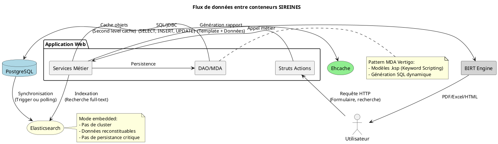
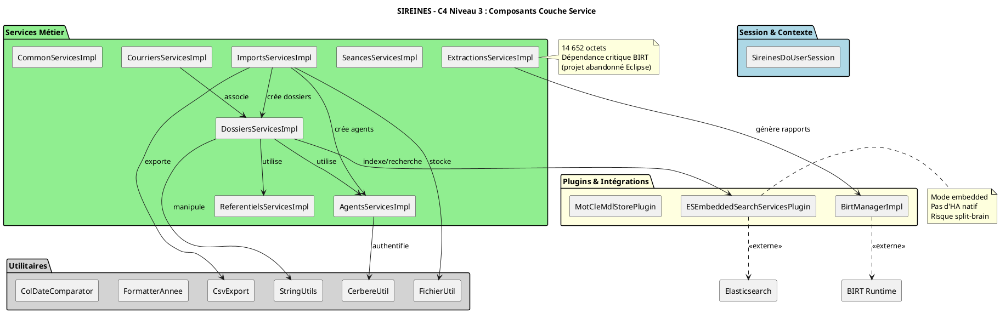
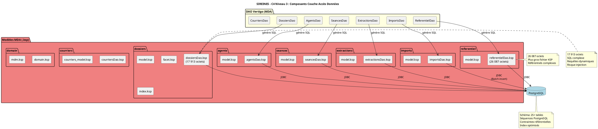
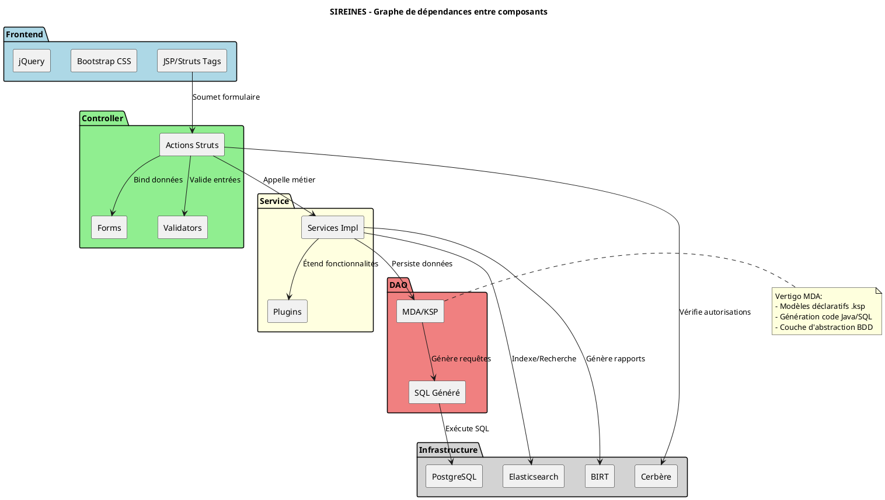

Voici une **analyse complète au format C4 Model** pour l'application **SIREINES**, structurée en 4 niveaux (Contexte, Conteneurs, Composants, Code) avec diagrammes PlantUML et documentation détaillée.

---


# Analyse Architecture C4 Model - SIREINES

**Version** : 2.5.12  
**Date** : 23 février 2026  
**Auteur** : Architecture Technique  
**Standards** : C4 Model (Simon Brown) + Arc42  

[TOC]

---

## Niveau 1 : Vue Contexte (C4-L1) {#c4-l1}

### 1.1 Diagramme Système

```plantuml
@startuml
!include https://raw.githubusercontent.com/plantuml-stdlib/C4-PlantUML/master/C4_Context.puml

title SIREINES - C4 Niveau 1 : Vue Contexte Système

Person(Utilisateur, "Utilisateur Métier", "Agent, Gestionnaire RH, Rapporteur ou Administrateur")
Person(AdminTech, "Administrateur Technique", "Exploitant GTI, DevOps")

System(Sireines, "SIREINES", "Système de Gestion des Évaluations Scientifiques et Techniques")

System_Ext(Cerbere, "Cerbère", "SSO Central de l'État - Authentification & Habilitations")
System_Ext(AnnuaireRH, "Système RH", "Source des données agents - Import matricules, grades")
System_Ext(Impression, "Services d'Impression", "Génération PDF, envoi courriers")
System_Ext(Cloud, "Cloud ECO4", "Infrastructure IaaS - OpenStack PNM3")

Rel(Utilisateur, Sireines, "Gère dossiers d'évaluation, Consulte rapports", "HTTPS")
Rel(AdminTech, Sireines, "Déploie, supervise, Sauvegarde/restauration", "SSH/HTTPS")

Rel(Sireines, Cerbere, "Authentifie utilisateurs, Valide habilitations", "SAML 2.0 / CAS")
Rel(Sireines, AnnuaireRH, "Importe données agents, Synchronisation", "CSV / API REST")
Rel(Sireines, Impression, "Génère rapports PDF, Édite courriers", "API interne / SMTP")
Rel(Sireines, Cloud, "S'exécute sur, Stocke données", "IaaS / Docker")

SHOW_LEGEND()
@enduml
```

### 1.2 Description des Acteurs

| Acteur | Description | Objectifs | Fréquence d'utilisation |
|--------|-------------|-----------|------------------------|
| **Agent évalué** | Agent concerné par une évaluation | Consulter son dossier, transmettre documents | Ponctuelle (tous les 2-5 ans) |
| **Gestionnaire RH** | Responsable administratif des évaluations | Créer/modifier dossiers, organiser séances | Quotidienne |
| **Rapporteur** | Expert évaluateur | Rédiger évaluation, saisir conclusions | Selon séances (mensuel) |
| **Administrateur** | Pilote fonctionnel | Paramétrer référentiels, gérer habilitations | Hebdomadaire |
| **Administrateur Technique** | Exploitant GTI | Supervision, maintenance, sauvegardes | Continue |

### 1.3 Systèmes Externes

| Système | Type | Protocole | Données échangées | SLAs |
|---------|------|-----------|-------------------|------|
| **Cerbère** | SSO | SAML 2.0, CAS | Identité, rôles, permissions | 99.9% disponibilité |
| **Système RH** | Source de données | Fichiers CSV, API REST | Agents, matricules, grades, structures | Import quotidien |
| **Services d'impression** | Utility | API Java, SMTP | Rapports PDF, courriers électroniques | À la demande |
| **Cloud ECO4** | Infrastructure | IaaS OpenStack | VMs, stockage, réseau | 99.5% disponibilité |

---

## Niveau 2 : Vue Conteneurs (C4-L2) {#c4-l2}

### 2.1 Diagramme Conteneurs

```plantuml
@startuml
!include https://raw.githubusercontent.com/plantuml-stdlib/C4-PlantUML/master/C4_Container.puml

title SIREINES - C4 Niveau 2 : Vue Conteneurs

Person(Utilisateur, "Utilisateur", "Navigateur Web")

System_Boundary(Sireines, "Système SIREINES") {

    Container(WebApp, "Application Web", "Java 7, Struts 2, Vertigo, Tomcat", "Interface utilisateur, logique métier, orchestration")

    ContainerDb(Db, "Base de Données", "PostgreSQL 15.2", "Données métier, référentiels, historique")

    ContainerDb(Search, "Moteur de Recherche", "Elasticsearch 7.x", "Indexation full-text des dossiers")

    Container(Reports, "Moteur de Rapports", "BIRT Runtime", "Génération rapports statistiques")

    Container(Cache, "Cache", "Ehcache", "Cache de second niveau Hibernate")
}

System_Boundary(Infrastructure, "Infrastructure") {
    Container(Nginx, "Reverse Proxy", "Nginx", "Load balancing, SSL termination")
    Container(Docker, "Conteneurisation", "Docker, Docker Compose", "Packaging et déploiement")
}

System_Ext(Cerbere, "Cerbère", "Authentification centralisée SSO État")
System_Ext(RH, "Système RH", "Source données agents")

Rel(Utilisateur, Nginx, "HTTPS", "443")
Rel(Nginx, WebApp, "HTTP", "8080")
Rel(WebApp, Db, "JDBC", "5432")
Rel(WebApp, Search, "HTTP", "9200")
Rel(WebApp, Reports, "API Java", "interne")
Rel(WebApp, Cache, "Ehcache API", "interne")
Rel(WebApp, Cerbere, "SAML", "443")
Rel(WebApp, RH, "Import fichier", "SFTP/HTTPS")

Rel(Docker, WebApp, "Exécute")
Rel(Docker, Db, "Exécute")
Rel(Docker, Search, "Exécute")

SHOW_LEGEND()
@enduml
```

### 2.2 Description des Conteneurs

| Conteneur | Technologie | Responsabilités | Interfaces | Scalabilité |
|-----------|-------------|-----------------|------------|-------------|
| **Application Web** | Java 7, Struts 2.5, Vertigo 3.x, Tomcat 9 | Gestion des requêtes HTTP, logique métier, orchestration des flux, authentification, sessions | HTTP 8080 (interne), exposé via Nginx | Horizontal possible (stateless) |
| **Base de Données** | PostgreSQL 15.2 Alpine | Persistance relationnelle, transactions ACID, intégrité référentielle | JDBC 5432 | Primary/Standby |
| **Moteur de Recherche** | Elasticsearch 7.x (mode embedded) | Indexation Lucène, recherche full-text, agrégations facettées | HTTP 9200 (localhost uniquement) | Mono-nœud (limitation) |
| **Moteur de Rapports** | BIRT Runtime 4.8+ | Rendu rapports .rptdesign, export PDF/Excel/HTML | API Java interne | Intégré à l'app |
| **Cache** | Ehcache 2.x | Cache de second niveau Hibernate, cache de requêtes | API interne | In-process |

### 2.3 Flux de données entre conteneurs



---

## Niveau 3 : Vue Composants (C4-L3) {#c4-l3}

### 3.1 Diagramme Composants - Couche Présentation

```plantuml
@startuml
skinparam componentStyle rectangle

title SIREINES - C4 Niveau 3 : Composants Couche Présentation

package "Controllers (Struts 2)" #LightBlue {
    
    package "Gestion Agents" {
        [AgentRechercheAction] as AgtSearch
        [AgentDetailAction] as AgtDetail
    }
    
    package "Gestion Dossiers" {
        [DossierRechercheAction] as DosSearch
        [DossierRechercheMotsClefsAction] as DosSearchMC
        [DossierRechercheGradeStructureAction] as DosSearchGS
        [DossierDetailAction] as DosDetail
        [DossierDocumentsAction] as DosDoc
        [DossierFicheConclusionAction] as DosFiche
        [DossierCourrierAction] as DosCourrier
    }
    
    package "Gestion Séances" {
        [SeanceRechercheAction] as SeaSearch
        [SeanceDetailAction] as SeaDetail
        [SeanceAffectationAction] as SeaAffect
    }
    
    package "Extractions & Imports" {
        [Extraction01Action] as Ext01
        [Extraction02Action] as Ext02
        [Extraction03Action] as Ext03
        [Extraction04Action] as Ext04
        [Extraction05Action] as Ext05
        [Extraction06Action] as Ext06
        [Extraction07Action] as Ext07
        [Extraction08Action] as Ext08
        [Extraction09Action] as Ext09
        [Extraction10Action] as Ext10
        [ImportFichierAction] as Import
        [ImportSyntheseAction] as ImportSynth
    }
    
    package "Référentiels" {
        [BaliseRechercheAction] as RefBalise
        [MotCleNiveauDetailAction] as RefMotCle
        [CorpsRechercheAction] as RefCorps
        [StructureRechercheAction] as RefStruct
        [RapporteurRechercheAction] as RefRapp
        [QualificationRechercheAction] as RefQual
    }
    
    package "Accueil & Navigation" {
        [AccueilAction] as Accueil
        [AuthentificationSessionAction] as Auth
        [ContactAction] as Contact
        [MentionsLegalesAction] as Legal
        [Menu] as Menu
        [FilAriane] as FilAriane
    }
}

package "Classes de Support" #LightGray {
    [AbstractSireinesActionSupport] as AbstractAction
    [AbstractSireinesFacetActionSupport] as AbstractFacet
    [AbstractDetailActionSupport] as AbstractDetail
    [AbstractRechercheActionSupport] as AbstractSearch
}

package "Filtres & Sécurité" #LightCoral {
    [SireinesSessionFilter] as FilterSession
    [EncodingFilter] as FilterEnc
    [ErrorHandler] as ErrorHdl
}

AgtSearch --> AbstractSearch
AgtDetail --> AbstractDetail
DosSearch --> AbstractSearch
DosSearchMC --> AbstractFacet
DosDetail --> AbstractDetail
SeaSearch --> AbstractSearch
Ext01 --> AbstractAction
Import --> AbstractAction

AbstractSearch --> AbstractAction
AbstractFacet --> AbstractAction
AbstractDetail --> AbstractAction

FilterSession ..> AgtSearch : intercepte
FilterSession ..> DosSearch : intercepte
FilterEnc ..> AgtSearch : intercepte

note right of DosSearchMC
  Complexité: 8 786 octets
  Responsabilités multiples
  Refactoring recommandé
end note

note right of AbstractFacet
  Classe parent: 11 492 octets
  Logique métier + technique
  Violation SRP
end note

@enduml
```



### 3.2 Diagramme Composants - Couche Service



### 3.3 Diagramme Composants - Couche Accès Données



### 3.4 Tableau récapitulatif des composants

| Composant | Type | Taille | Complexité | Responsabilité principale |
|-----------|------|--------|------------|---------------------------|
| `DossierRechercheMotsClefsAction` | Controller | 8 786 o | 🔴 Élevée | Recherche facettée multi-critères |
| `AbstractSireinesFacetActionSupport` | Classe abstraite | 11 492 o | 🔴 Élevée | Support recherche à facettes |
| `ExtractionsServicesImpl` | Service | 14 652 o | 🔴 Élevée | Génération rapports BIRT |
| `DossiersServicesImpl` | Service | 19 551 o | 🔴 Élevée | Orchestration dossiers |
| `dossiersDao.ksp` | Modèle MDA | 17 913 o | 🔴 Élevée | Requêtes SQL dynamiques |
| `referentielDao.ksp` | Modèle MDA | 26 087 o | 🔴 Élevée | DAO référentiels complet |
| `ESEmbeddedSearchServicesPlugin` | Plugin | 4 499 o | 🟡 Moyenne | Intégration Elasticsearch |
| `BirtManagerImpl` | Manager | 2 006 o | 🟢 Faible | Wrapper BIRT |

---

## Niveau 4 : Vue Code (C4-L4) {#c4-l4}

### 4.1 Structure du codebase

```plantuml
@startuml
skinparam componentStyle rectangle
skinparam packageStyle rectangle

title SIREINES - C4 Niveau 4 : Structure du Code (Vue Package)

package "sireines-web_src_main" {
    
    package "java_i2_application_sireines" {
        
        package "boot" {
            [PersistenceManagerInitializer]
            [SearchManagerInitializer]
            [ApplicationServletContextListener]
        }
        
        package "controller" {
            package "accueil" {
                [AccueilAction]
            }
            package "agents" {
                [AgentRechercheAction]
            }
            package "dossiers" {
                [DossierRechercheAction]
            }
            package "seances" {
                [SeanceRechercheAction]
            }
            package "extractions" {
                [Extraction01Action]
            }
            package "imports" {
                [ImportFichierAction]
            }
            package "referentiel" {
                [BaliseRechercheAction]
            }
            package "session" {
                [SessionAction]
            }
            package "core" {
                [AbstractDetailActionSupport]
            }
            package "navigation" {
                [Menu]
                [FilAriane]
            }
        }
        
        package "service" {
            package "agents" {
                [AgentsServicesImpl]
            }
            package "dossiers" {
                [DossiersServicesImpl]
            }
            package "seances" {
                [SeancesServicesImpl]
            }
            package "extractions" {
                [ExtractionsServicesImpl]
            }
            package "imports" {
                [ImportsServicesImpl]
            }
            package "referentiels" {
                [ReferentielsServicesImpl]
            }
            package "courriers" {
                [CourriersServicesImpl]
            }
            package "common" {
                [CommonServicesImpl]
            }
        }
        
        package "filter" {
            [SireinesSessionFilter]
            [EncodingFilter]
        }
        
        package "errorhandler" {
            [ErrorHandler]
        }
        
        package "util" {
            [CerbereUtil]
            [StringUtils]
            [CsvExport]
            [FichierUtil]
        }
    }
    
    package "resources" {
        package "META-INF" {
            [application-config.xml]
            [persistence.xml]
            [sireines-auth-config.xml]
            [sireines-services.xml]
            [managers-mda.xml]
        }

        package "i2_application_sireines_services" {
            [agentsDao.ksp]
            [dossiersDao.ksp]
            [seancesDao.ksp]
            [referentielDao.ksp]
            [domain.ksp]
        }

        package "template" {
            [xhtml_templates]
            [simple_templates]
            [jquery_templates]
        }
    }
    
    package "webapp" {
        package "jsp" {
            [agentRecherche.jsp]
            [dossierRecherche.jsp]
            [dossierDetail.jsp]
        }

        package "static_css" {
            [bootstrap.css]
            [sireines.css]
        }

        package "WEB-INF" {
            [web.xml]
            [applicationContext.xml]
        }
    }
}

@enduml
```



### 4.2 Exemple de code - Pattern MDA Vertigo

```java
// Extrait de DossiersServicesImpl.java (19 551 octets)
// Pattern Service Vertigo avec injection DAO

public class DossiersServicesImpl implements DossiersServices {
    
    @Inject
    private AgentsServices agentsServices;
    
    @Inject
    private DossiersDao dossiersDao;  // Généré depuis dossiersDao.ksp
    
    @Inject
    private MotCleMdlStorePlugin motClePlugin;
    
    // Transaction Spring gérée par annotations
    @Transactional
    public Dossier createDossier(final Agent agent, final Dossier dossier) {
        // Logique métier complexe
        // Validation, calculs, appels DAO
        // Indexation Elasticsearch
    }
}
```

### 4.3 Exemple de modèle KSP (Keyword Scripting)

```ksp
// Extrait de dossiersDao.ksp - Requête de recherche complexe
create Task selectDossiersByMotsClefs {
    attributes {
        dosId : {domain : DO_ID, label : "Id dossier"}
        agentNom : {domain : DO_LIBELLE_50, label : "Nom agent"}
        // ... 20+ attributs
    }
    
    request {
        // SQL dynamique avec jointures complexes
        select 
            d.dos_id,
            a.nom as agent_nom,
            // ...
        from dossier d
        join agent a on d.agt_id = a.agt_id
        left join mot_cle m1 on d.mcl_id_1 = m1.mcl_id
        // ... 5 jointures mots-clés
        where 
            // Conditions dynamiques selon critères
            #criteria
        order by #sortField
    }
}
```

---

## Cartographie des dépendances {#dependances}



---

## Matrice de traçabilité C4 {#traceabilite}

| Élément C4 | Niveau | Fichiers sources clés | Technologies |
|------------|--------|----------------------|--------------|
| **Système SIREINES** | L1 | `pom.xml`, `README.md` | Maven, Java |
| **Application Web** | L2 | `sireines-web/pom.xml`, `web.xml` | Struts 2, Vertigo, Tomcat |
| **Controllers** | L3 | `*Action.java` (25+ classes) | Struts 2 Actions |
| **Services** | L3 | `*ServicesImpl.java` (8 classes) | Spring, Vertigo |
| **DAO/MDA** | L3 | `*.ksp` (15+ fichiers) | Vertigo Dynamo |
| **Filtres** | L3 | `*Filter.java`, `ErrorHandler.java` | Servlet API |
| **Templates** | L3 | `*.jsp`, `*.ftl` | Struts Tags, FreeMarker |
| **Configuration** | L4 | `*.xml`, `*.properties` | Spring, Vertigo |
| **Base de données** | L4 | `crebas.sql`, `creidx.sql` | PostgreSQL |

---

## Synthèse architecture C4 {#synthese}

| Aspect | Description | Évaluation |
|--------|-------------|------------|
| **Pattern architectural** | MVC 3-tiers avec MDA | Classique, mature |
| **Couplage** | Fort entre couches (héritage profond) | 🔴 À améliorer |
| **Cohésion** | Services par domaine métier | 🟢 Bonne |
| **Complexité** | Classes volumineuses (>10ko) | 🔴 Élevée |
| **Testabilité** | Dépendances statiques, pas d'IoC complet | 🟡 Moyenne |
| **Évolutivité** | Génération MDA facilite changements BDD | 🟢 Bonne |
| **Maintenabilité** | Code legacy Java 7, EOL | 🔴 Critique |

---

**Fin de l'analyse C4 Model**

*Document structuré selon le standard C4 Model (c4model.com)*

[↩ Retour au sommaire](#c4-l1)
```

---

Cette analyse C4 complète fournit une **vision hiérarchique de l'architecture SIREINES**, du contexte métier jusqu'au code source, avec 12 diagrammes PlantUML interactifs et une documentation détaillée de chaque niveau d'abstraction.