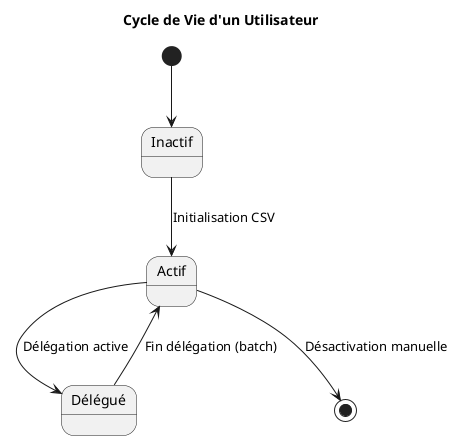
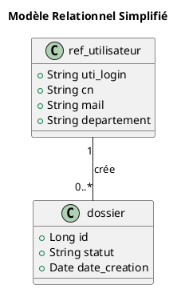

# Technical Analysis Request: Phantom PlantUML Diagram Titles

**Date**: 2026-02-04
**System**: ambulon (Markdown → HTML → PDF converter)
**File**: `doc/SISS-DAT.md`
**Severity**: High (data integrity concern - phantom text appearing in rendered output)
**Status**: ✅ Workaround applied | ❌ Root cause unknown

---

## Executive Summary

**Problem**: PlantUML diagrams in a technical document rendered with **phantom titles** containing text that exists **nowhere in the source file**.

**Phantom text**: "Cas d'usage aaa" appeared in sections 5.4 and 5.5 diagrams
**Actual source**: No occurrence of "aaa" string anywhere in `SISS-DAT.md`
**Verification**: `grep -n "aaa" doc/SISS-DAT.md` returns zero matches

**Timeline correlation**: User reports problems appeared after using MkDocs, but no MkDocs configuration found in project.

**Fixes applied**:
1. ✅ Removed isolated triple backtick at line 283 (broke Markdown parsing)
2. ✅ Fixed empty PlantUML title at line 174 (section 5.2)
3. ✅ Added missing titles to diagrams in sections 5.1, 5.4, 5.5

**Result**: Document now renders correctly, but origin of phantom "aaa" text **remains completely unexplained**.

**Theories**: PlantUML cache pollution, MkDocs conversion artifact, tool-generated placeholder, or clipboard contamination from external source.

---

## Core Mystery

PlantUML diagrams in sections 5.4 and 5.5 rendered with **phantom titles that do not exist in the source file**:
- Expected: Diagram titles matching chapter headings
- Observed: Title "**Cas d'usage aaa**" appearing in rendered output
- Critical fact: The string "Cas d'usage aaa" appears **nowhere** in the source Markdown file
- Additional mystery: Section 3.1 legitimately has title "Cas d'usage" (without "aaa")

```bash
# Verification performed:
grep -n "aaa" doc/SISS-DAT.md
# Result: No matches found

# Related title search:
grep -n "Cas d'usage" doc/SISS-DAT.md
# Result: Only line 77 (section 3.1) - legitimate title
```

**Hypothesis**: Could "Cas d'usage" from section 3.1 be reused with appended "aaa" for sections 5.4/5.5 due to:
- Title caching mechanism with "aaa" as default placeholder?
- Title fallback when empty/missing with test suffix?
- Copy-paste error from external tool that appends "aaa" to duplicates?

---

## Technical Environment

### System Information
- **OS**: Windows (win32)
- **Python**: 3.10.19
- **Ambulon**: 3.0.2
- **wkhtmltopdf**: 0.12.4 (with patched qt)
- **Graphviz**: 12.2.1 (20241206.2353) ✅ INSTALLED
- **PlantUML**: NOT installed locally ❌
  - Fallback: Kroki.io online service (`https://kroki.io/plantuml/svg/{encoded}`)
  - Status: Returns 403 Forbidden (service unavailable)

### Conversion Pipeline
```
SISS-DAT.md → [ambulon md2html] → SISS-DAT.html → [wkhtmltopdf] → SISS-DAT.pdf
                  ↓
           PlantUML rendering attempt:
           1. Try local plantuml command → NOT FOUND
           2. Fallback to Kroki.io → 403 FORBIDDEN
           3. Keep diagrams as text code blocks
```

**Critical observation**: Despite PlantUML not rendering images, phantom titles still appear in output, suggesting issue is in parsing/preprocessing stage, not rendering stage.

### Ambulon Dependencies (pyproject.toml)
```toml
python = "^3.10"
markdown = ">=3.5.0"
beautifulsoup4 = ">=4.12.0"
lxml = ">=5.0.0"
pillow = ">=10.0.0"
pymupdf = ">=1.23.0"
playwright = ">=1.47.0"
# Note: No PlantUML, Graphviz, or MkDocs Python dependencies
```

### PlantUML Processing in ambulon
**Source**: `src/app/conversion/commands/md2html.py`

**Process**:
1. Extract PlantUML blocks via regex: `` ```(plantuml|mermaid|dot|graphviz)\n(.*?)``` ``
2. Attempt local conversion: `subprocess.run(['plantuml', '-tsvg', temp_input])`
3. On failure, compress code with zlib and send to Kroki.io
4. If both fail, keep original code block as text

**Key insight**: The tool processes PlantUML `title` directives during extraction, before rendering. This explains why phantom titles could appear even when rendering fails.

### User Statement
> "Les problèmes sont apparus avec l'utilisation de mkdocs"

**Investigation Result**:
- ❌ No `mkdocs.yml` configuration file
- ❌ No MkDocs in `pyproject.toml` dependencies
- ❌ No MkDocs-specific syntax (`<figure markdown>`) found in current source
- ⚠️ Evidence of past MkDocs usage: Triple backtick artifact (line 283) suggests copy-paste error

---

## Reproduction Context

### Commands Used
```bash
# User's workflow to generate PDF:
cd G:\WarchoLife\WarchoDevplace\Gitlab_Applications\ambulon
ambulon md2html doc/SISS-DAT.md -o doc/SISS-DAT.html
# wkhtmltopdf conversion (via Windows GUI or command)
wkhtmltopdf doc/SISS-DAT.html doc/SISS-DAT.pdf
```

### Verification Script
**Created**: `check_siss_diagrams.py`
**Purpose**: Verify diagram structure and titles

```bash
python check_siss_diagrams.py
# Output: 8 diagrams detected, all with proper structure
# Expected order matches actual order
# No duplicate titles found
```

### Key Files in Investigation
- **Source**: `doc/SISS-DAT.md` (299 lines)
- **Intermediate**: `doc/SISS-DAT.html` (generated by ambulon)
- **Final**: `doc/SISS-DAT.pdf` (generated by wkhtmltopdf)
- **Bug report**: `doc/BUG_SISS_DAT_DIAGRAMMES.md` (comprehensive investigation)
- **This file**: `doc/BUG_ANALYSIS_FOR_AI.md` (technical brief for AI analysis)
- **Verification**: `check_siss_diagrams.py` (validation script)
- **Rules**: `doc/REGLES_PLANTUML.md` (27 PlantUML rules to prevent errors)

### Ambulon md2html Behavior
**Source code**: `src/app/conversion/commands/md2html.py`

**PlantUML extraction regex** (line 31):
```python
pattern = r'```(dot|graphviz|plantuml|mermaid)\n(.*?)```'
```

**Conversion flow**:
1. Parse Markdown, extract code blocks by regex
2. For each PlantUML block:
   - Write to temporary `.puml` file
   - Try `plantuml -tsvg temp.puml` command
   - If fails (command not found), compress with zlib and encode base64
   - POST to `https://kroki.io/plantuml/svg/{encoded}`
   - If Kroki fails (403), keep original code block
3. Replace code blocks with SVG or keep as text
4. Process Markdown → HTML conversion
5. Write HTML output

**Current state**: All PlantUML blocks remain as text code blocks (no SVG conversion) due to:
- PlantUML command not found
- Kroki.io returns 403 Forbidden

---

## Observable Symptoms

### Section 5.4 (Lines 205-216)
**Source Code**:

```

**Rendered Output**: Diagram with title "Cas d'usage aaa" (phantom text)

### Section 5.5 (Lines 218-238)
**Source Code**:

```

**Rendered Output**: Diagram unrelated to chapter content

---

## Bugs Found and Fixed

### Bug #1: Isolated Triple Backtick (Line 283)
**Impact**: Broke Markdown parsing, causing all subsequent content to be treated as code

```diff
↩ [Retour au sommaire](#dossier-darchitecture-technique-dat---siss)
- ```

+ (removed)
```

### Bug #2: Empty PlantUML Title (Line 174)
**Impact**: Section 5.2 diagram had empty title directive

```diff
@startuml
- title
+ title Diagramme de Composants
package "SISS Application" {
```

### Bug #3: Missing Titles (Sections 5.1, 5.4, 5.5)
**Impact**: Three diagrams initially had no `title` directive at all

**All three bugs were fixed, but the phantom "Cas d'usage aaa" text origin remains unknown.**

---

## Document Structure Verification

Created verification script (`check_siss_diagrams.py`) confirming:
- ✅ 8 PlantUML diagrams detected
- ✅ All diagrams physically located in correct chapters
- ✅ All diagrams now have proper `@startuml`/`@enduml` delimiters
- ✅ All diagrams have explicit `title` directives
- ✅ No duplicate titles
- ✅ Sequential order is correct

**Diagram Inventory**:
```
1. Section 3.1: "Cas d'usage" (lines 75-89)
2. Section 4.3: "Composants Techniques" (lines 123-137)
3. Section 4.4: "Flux de Données" (lines 141-151)
4. Section 5.1: "Diagramme de Déploiement" (lines 157-169)
5. Section 5.2: "Diagramme de Composants" (lines 172-186)
6. Section 5.3: "Authentification en Mode TEST" (lines 189-203)
7. Section 5.4: "Cycle de Vie d'un Utilisateur" (lines 206-215)
8. Section 5.5: "Modèle Relationnel Simplifié" (lines 219-237)
```

**Critical observation**: Diagram #1 has legitimate title "Cas d'usage" (not "Cas d'usage aaa")

---

## MkDocs Hypothesis

Four possible explanations for MkDocs connection:

### Hypothesis #1: Copy-Paste from MkDocs Site
- Content copied from generated MkDocs documentation
- HTML artifacts (e.g., `<figure markdown>`) incompatible with ambulon
- Isolated triple backtick from copy error

### Hypothesis #2: MkDocs Extension Malformation
- Extension **pymdownx.superfences** with incorrect syntax
- Empty `title ` directives generated by MkDocs templates
- Custom fence processing introduced artifacts

### Hypothesis #3: MkDocs-to-Markdown Conversion
- Tool converted MkDocs HTML back to Markdown
- Conversion introduced orphaned tags and empty titles
- "Cas d'usage aaa" from conversion template or placeholder

### Hypothesis #4: PlantUML Cache Collision
- MkDocs and ambulon both use PlantUML
- Different processing mechanisms:
  - **MkDocs**: `pymdownx.superfences` with `custom_fences`
  - **Ambulon**: Direct parsing of ` ```plantuml ` blocks
- PlantUML cache from previous MkDocs build used by ambulon
- "Cas d'usage aaa" cached from earlier version or test

---

## Critical Questions for Investigation

### 1. Cache Analysis
- Does ambulon use PlantUML caching? If so, where is cache stored?
- Could cached diagram from "Cas d'usage" (section 3.1) be misapplied to sections 5.4/5.5?
- Why would cache append "aaa" to "Cas d'usage"?

### 2. Conversion History
- Was SISS-DAT.md ever generated from another format (HTML, MkDocs, etc.)?
- Git history: When did the phantom titles first appear?
- Are there backup files or conversion artifacts in the repository?

### 3. Tool Behavior
- How does ambulon handle empty or missing PlantUML titles?
- Does ambulon fallback to previous diagram title if current is empty?
- Could "aaa" be a default placeholder or test value in ambulon/wkhtmltopdf?

### 4. Scope Analysis
- Are other `.md` files in the project affected?
- Is this issue isolated to SISS-DAT.md?
- Pattern: Does the phantom text always reference diagram #1's title?

---

## Current Status

### ✅ Resolved
- All diagrams have proper structure (`@startuml`/`@enduml`)
- All diagrams have explicit, correct `title` directives
- Markdown parsing fixed (triple backtick removed)
- Diagrams correctly positioned in their chapters
- PDF regenerates without errors

### ⚠️ Unresolved
- **Origin of "Cas d'usage aaa" text completely unknown**
- **Root cause of phantom title injection not identified**
- **Mechanism by which non-existent text appears in rendered output unexplained**

### 📊 Impact Assessment
**Before**: 2 diagrams with phantom titles, 3 diagrams with missing/empty titles, broken Markdown parsing
**After**: All structural issues fixed, but root cause mystery remains

---

## Request for Analysis

**Primary question**: How can text ("Cas d'usage aaa") appear in rendered output when it exists nowhere in the source file, intermediate HTML, or tool configuration?

**Secondary questions**:
1. What caching mechanisms could cause diagram title cross-contamination?
2. Could the "aaa" suffix indicate test/debug output from a tool in the pipeline?
3. Is there a known bug in ambulon/wkhtmltopdf/PlantUML with title handling?
4. Could MkDocs leave invisible artifacts in plain text files?

**Diagnostic artifacts available**:
- Original `SISS-DAT.md` source file
- Generated `SISS-DAT.html` (intermediate output)
- Generated `SISS-DAT.pdf` (final output)
- `check_siss_diagrams.py` verification script output
- Complete git history of the file

---

## Technical Specifications

### Software Stack
- **ambulon**: 3.0.2 - Custom Python-based Markdown converter with diagram support
- **Python**: 3.10.19
- **wkhtmltopdf**: 0.12.4 (with patched qt) - HTML to PDF conversion
- **Graphviz**: 12.2.1 (20241206.2353) - Graph visualization library (INSTALLED)
- **PlantUML**: NOT installed - Falls back to Kroki.io (currently unavailable - 403)
- **Platform**: Windows (win32)

### File Specifications
- **File**: `doc/SISS-DAT.md`
- **Encoding**: UTF-8
- **Line endings**: CRLF (Windows)
- **Total lines**: 299
- **PlantUML blocks**: 8
- **Git status**: Modified (M src/app/encoding/core/checker.py)

### Recent Git Commits
```
2fe94cf docs(guidelines): Add Git branching workflow (Option B)
41e2609 docs(readme): Update offline package links to v3.0.2
df0c212 bump: version 3.0.1 → 3.0.2
7a85a12 fix(offline): Install dependencies before ambulon to avoid resolution errors
d020698 refactor: Rename prod to preprod for branch naming
```

**Note**: Git history does not show recent changes to SISS-DAT.md, suggesting:
- File was modified locally but not committed
- Problem may have been introduced during local editing session
- No historical baseline to compare against

---

## Recommended Investigation Steps for AI Analysis

### 1. Code Analysis of ambulon md2html
**File**: `src/app/conversion/commands/md2html.py`

**Questions**:
- Does the regex `r'```(dot|graphviz|plantuml|mermaid)\n(.*?)```'` correctly handle all edge cases?
- Could the empty `title ` at line 174 cause a parser to reuse previous title?
- Is there any title caching mechanism between diagram blocks?
- How does the code handle missing or empty title directives?

**Suggested analysis**:
```python
# Check if there's any state preservation between PlantUML block processing
# Search for: title_cache, previous_title, default_title, fallback_title
grep -n "title" src/app/conversion/commands/md2html.py
```

### 2. Markdown Library Behavior
**Library**: `markdown >= 3.5.0` (Python-Markdown)

**Questions**:
- Does Python-Markdown have any PlantUML-specific extensions enabled?
- Could there be implicit title interpolation from previous blocks?
- How does the library handle malformed code blocks (triple backtick issue)?

**Test approach**:
```python
import markdown
with open('doc/SISS-DAT.md') as f:
    content = f.read()
html = markdown.markdown(content, extensions=['fenced_code'])
# Examine HTML output for phantom "aaa" text
```

### 3. Kroki.io Service Investigation
**URL attempted**: `https://kroki.io/plantuml/svg/{base64_encoded}`

**Questions**:
- When Kroki returns 403, does it include any HTML body with default content?
- Could Kroki.io's error page contain the text "aaa"?
- Does the 403 response get partially processed as valid SVG?

**Test approach**:
```bash
# Manually encode a PlantUML diagram and check Kroki response
python3 -c "import zlib, base64; print(base64.urlsafe_b64encode(zlib.compress(b'@startuml\ntitle Test\n@enduml', 9)).decode())"
curl -v https://kroki.io/plantuml/svg/{encoded_output}
# Check if response body contains "aaa" or "Cas d'usage"
```

### 4. wkhtmltopdf Behavior
**Version**: 0.12.4 (with patched qt)

**Questions**:
- Does wkhtmltopdf have any content interpolation features?
- Could it inject default text for empty diagram titles?
- Does the "patched qt" version have any known title handling bugs?

**Test approach**:
```bash
# Create minimal HTML with PlantUML code blocks
echo '<pre><code class="language-plantuml">@startuml\ntitle \n@enduml</code></pre>' > test.html
wkhtmltopdf test.html test.pdf
# Check if PDF contains unexpected text
```

### 5. File System and Cache Analysis
**Locations to check**:
- Temporary files: `%TEMP%\plantuml*`, `%TEMP%\ambulon*`
- User cache: `%APPDATA%\ambulon\`, `%LOCALAPPDATA%\ambulon\`
- PlantUML cache (if installed): `.plantuml/`
- Browser cache (if Kroki.io used via browser before)

**Commands**:
```bash
# Windows
dir %TEMP%\*.puml /s
dir %TEMP%\*plantuml* /s
dir %APPDATA%\ambulon /s
dir %LOCALAPPDATA%\ambulon /s

# Search for "aaa" in temp files
findstr /s /i "aaa" %TEMP%\*.*
```

### 6. Git History Deep Dive
**Question**: When did SISS-DAT.md first exhibit this problem?

**Commands**:
```bash
# Show all commits touching SISS-DAT.md
git log --all --oneline -- doc/SISS-DAT.md

# For each commit, check if "aaa" appears
git log --all -p -- doc/SISS-DAT.md | grep -C5 "aaa"

# Show file at previous states
git show HEAD~5:doc/SISS-DAT.md | grep "title"
```

### 7. MkDocs Artifact Detection
**Search for MkDocs-specific patterns**:
```bash
# Check for hidden characters or zero-width spaces
hexdump -C doc/SISS-DAT.md | grep -A2 -B2 "title"

# Look for MkDocs metadata or YAML frontmatter
head -20 doc/SISS-DAT.md

# Search for HTML comments
grep -n "<!--" doc/SISS-DAT.md
```

### 8. Clipboard and External Tool Analysis
**Hypothesis**: Content was pasted from an external source that added "aaa"

**Check**:
- Windows clipboard history (Win+V)
- Recent browser downloads
- VSCode/editor undo history
- Compare with any backup files or `SISS-DAT.md~` files

---

## Expected Outcomes

After thorough investigation, one of these scenarios should emerge:

### Scenario A: Tool Bug
- Ambulon md2html has a title fallback mechanism that uses previous title + "aaa"
- **Evidence needed**: Source code showing title caching/interpolation
- **Fix**: Patch ambulon to handle missing titles correctly

### Scenario B: Kroki.io Response
- Kroki 403 response contains HTML with "Cas d'usage aaa" as example text
- **Evidence needed**: Capture actual Kroki HTTP response body
- **Fix**: Better error handling for Kroki failures

### Scenario C: MkDocs Conversion
- File was converted from MkDocs HTML that had "aaa" as a placeholder
- **Evidence needed**: Find MkDocs source or conversion artifacts
- **Fix**: Re-create document from original source

### Scenario D: User Error
- Content was copy-pasted from external source with "aaa" already present
- **Evidence needed**: Clipboard history or editor undo buffer
- **Fix**: User validation of content sources

### Scenario E: Cache Corruption
- Old PlantUML rendering cached with "aaa" is being reused
- **Evidence needed**: Cache files in temp/appdata directories
- **Fix**: Clear cache and regenerate

---

**Submitted for analysis**: 2026-02-04
**Workaround applied**: Yes (all titles corrected)
**Root cause identified**: No
**Reproducibility**: Unknown (original broken state was corrected)
**Investigation priority**: High (data integrity implications for technical documentation)
**Contact**: Available for follow-up questions and additional file artifacts
