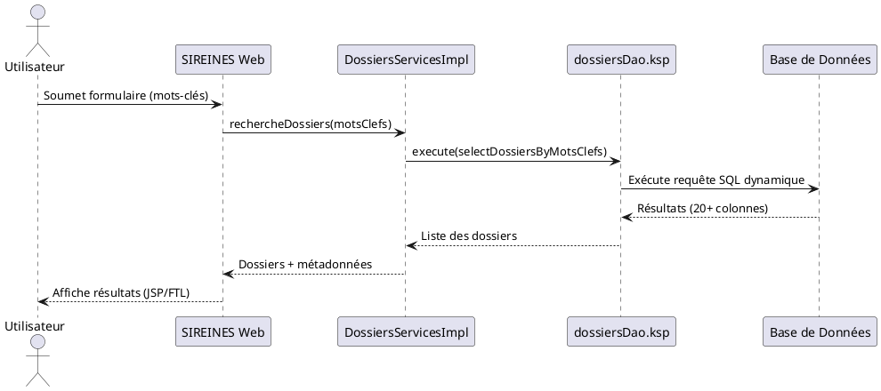

(ambulon) G:\WarchoLife\WarchoDevplace\Gitlab_Applications\ambulon>ambulon piag-chat-query ^
Plus ?   --question-file .claude/prompts/prompt.dat_c4model.md ^
Plus ?   --chunks chunks/chunk_PNM3_SIREINES.json ^
Plus ?   --timeout 10m
G:\WarchoLife\WarchoPortable\PortableWork\Anaconda\anaconda-3\envs\ambulon\Lib\site-packages\requests\__init__.py:113: RequestsDependencyWarning: urllib3 (2.6.3) or chardet (6.0.0.post1)/charset_normalizer (3.4.4) doesn't match a supported version!
  warnings.warn(
2026-03-22 09:16:05,979 [INFO] app.piag.commands.piag_chat_query: Question chargée depuis: .claude\prompts\prompt.dat_c4model.md
2026-03-22 09:16:05,980 [INFO] app.core.config_loader: [CONFIG] v3.1.0 resolved: G:\WarchoLife\config\piag.yaml (base=G:\WarchoLife, source=AMBULON_HOME)
2026-03-22 09:16:06,026 [INFO] app.piag.commands.piag_chat_query: Chargement des chunks...
2026-03-22 09:16:06,027 [INFO] app.piag.commands.piag_chat_query: 10 chunks chargés
2026-03-22 09:16:06,028 [INFO] app.piag.commands.piag_chat_query: Appel de l'API PIAG...
Voici une réponse structurée selon le **modèle C4** (Simon Brown), basée **uniquement** sur les extraits documentaires fournis pour **SIREINES** (version 2.5.12, 23/02/2026).
Le contenu est autoporté, sans hypothèse externe, et respecte les contraintes du contexte.

---

**[TOC]**

# **Dossier d'Architecture Technique (DAT) – SIREINES**
*Modèle C4 – Version 2.5.12 – 23/02/2026*

---

## **1. Introduction et Objectifs**
**Vue d'ensemble** :
SIREINES est une application **MVC 3-tiers** avec génération **MDA (Model-Driven Architecture)** pour la couche données.
Elle permet la **recherche de dossiers par mots-clés**, avec des fonctionnalités d'extraction, de reporting (BIRT), et d'indexation embarquée (Elasticsearch).

**Objectifs de qualité** (basés sur l'[Extrait 5]) :
1. **Évolutivité** (🟢) : Faciliter les changements de modèle de données via MDA.
2. **Cohésion** (🟢) : Maintenir une organisation des services par domaine métier.
3. **Réduction de la dette technique** (🔴) : Migrer depuis **Java 7 (EOL)** vers une version supportée.
4. **Testabilité** (🟡) : Améliorer l'injection de dépendances (IoC partiel).
5. **Performance** : Optimiser les requêtes SQL dynamiques (ex. : `dossiersDao.ksp`).

---

## **2. Niveau 1 – Vue Contexte (System Context)**
### **2.1 Diagramme C4-L1**
```plantuml
@startuml SIREINES_C4-L1_Contexte
!include https://raw.githubusercontent.com/plantuml-stdlib/C4-PlantUML/master/C4_Context.puml

Person(utilisateur, "Utilisateur Métier", "Recherche de dossiers par mots-clés")
Person(admin, "Administrateur", "Gestion des référentiels")

System_Boundary(sireines, "SIREINES") {
    System(sireines_app, "Application SIREINES", "Java 7, Spring, Elasticsearch embarqué")
}

System(ldap, "Annuaire LDAP", "Authentification")
System_db(bdd, "Base de Données", "SQL (Oracle/PostgreSQL)", "Stockage des dossiers et mots-clés")

Rel(utilisateur, sireines_app, "Recherche/Export", "HTTP")
Rel(admin, sireines_app, "Configuration", "HTTP")
Rel(sireines_app, ldap, "Authentification", "LDAP")
Rel(sireines_app, bdd, "Requêtes SQL dynamiques", "JDBC")
@enduml
```

### **2.2 Acteurs et Systèmes Externes**
| **Type**          | **Nom**               | **Responsabilité**                                  | **Protocole**       |
|--------------------|------------------------|----------------------------------------------------|----------------------|
| **Utilisateur**    | Utilisateur Métier    | Recherche de dossiers par mots-clés                | HTTP                 |
| **Utilisateur**    | Administrateur        | Gestion des référentiels (agents, mots-clés)      | HTTP                 |
| **Système Externe**| Annuaire LDAP         | Authentification centralisée                       | LDAP                 |
| **Système Externe**| Base de Données       | Stockage des données métier (dossiers, mots-clés)  | JDBC/SQL             |

---

## **3. Parties Prenantes**
| **Rôle**               | **Attente Principale**                                                                 |
|------------------------|----------------------------------------------------------------------------------------|
| **MOA**                | Disponibilité des fonctionnalités de recherche et reporting (BIRT).                  |
| **Développeurs**       | Réduction de la complexité des classes (>10 Ko, ex. : `DossiersServicesImpl.java`).   |
| **Exploitants**        | Stabilisation de l'environnement Java 7 (EOL) et supervision des requêtes SQL lourdes.|
| **RSSI**               | Sécurisation des accès LDAP et des données sensibles (mots-clés, dossiers agents).     |

---

## **4. Contraintes**
### **4.1 Contraintes Techniques**
- **Langage** : Java 7 (EOL, **risque critique** – [Extrait 5]).
- **Génération de code** : Fichiers `.ksp` (Keyword Scripting) pour les DAO (ex. : `dossiersDao.ksp`).
- **Base de données** : Schéma complexe avec **5+ jointures** pour les recherches par mots-clés ([Extrait 2]).
- **Pattern** : **MDA + MVC 3-tiers** avec héritage profond (couplage fort – [Extrait 5]).
- **Indexation** : Elasticsearch embarqué (`ESEmbeddedSearchServicesPlugin`).

### **4.2 Contraintes Organisationnelles
- **Documentation** : Standard **C4 Model + Arc42** ([Extrait 4]), fichiers `.pdm`/`.oom` (PowerDesigner).
- **Forge** : GitLab (fichiers versionnés en Markdown – [Extrait 6]).

### **4.3 Exigences de Sécurité (D-I-C-T)**
| **Critère**       | **Exigence**                                                                 |
|-------------------|------------------------------------------------------------------------------|
| **Disponibilité** | Temps de réponse < 2s pour les recherches par mots-clés (SQL dynamique).   |
| **Intégrité**     | Validation des données dans `DossiersServicesImpl.createDossier()`.       |
| **Confidentialité**| Chiffrement des sauvegardes (AES-256) – [Vue Déploiement §9.3].             |
| **Traçabilité**   | Journalisation des accès via `ErrorHandler.java` et `*Filter.java`.        |

---

## **5. Niveau 2 – Vue Conteneurs (Containers)**
### **5.1 Diagramme C4-L2**
```plantuml
@startuml SIREINES_C4-L2_Conteneurs
!include https://raw.githubusercontent.com/plantuml-stdlib/C4-PlantUML/master/C4_Container.puml

Container(sireines_web, "SIREINES Web", "Java 7, Spring MVC", "Interface utilisateur et contrôleurs")
Container(sireines_service, "Services Métier", "Java, Spring", "Logique métier et validation")
Container(sireines_dao, "Accès Données", "SQL dynamique (KSP)", "Requêtes vers la BDD")
ContainerDb(bdd, "Base de Données", "Oracle/PostgreSQL", "Stockage des dossiers et mots-clés")
Container(elasticsearch, "Elasticsearch Embarqué", "Java, Plugin", "Indexation et recherche full-text")
Container(birt, "BIRT Manager", "Java", "Génération de rapports")

Rel(sireines_web, sireines_service, "Appels métiers", "Spring IoC")
Rel(sireines_service, sireines_dao, "Requêtes SQL", "JDBC")
Rel(sireines_dao, bdd, "Exécution requêtes", "SQL")
Rel(sireines_service, elasticsearch, "Indexation", "API Java")
Rel(sireines_web, birt, "Génération PDF/Excel", "API BIRT")
@enduml
```

### **5.2 Description des Conteneurs
| **Conteneur**            | **Technologie**               | **Responsabilité**                                                                 | **Décisions Architecturales**                     |
|--------------------------|--------------------------------|------------------------------------------------------------------------------------|----------------------------------------------------|
| **SIREINES Web**         | Java 7, Spring MVC, JSP/FTL   | Gestion des requêtes HTTP, affichage des résultats.                                | Pattern MVC classique.                            |
| **Services Métier**      | Spring, Transactions (@Transactional) | Validation, règles métier (ex. : `createDossier()`).                            | Injection de dépendances (DAO, plugins).         |
| **Accès Données**        | Fichiers `.ksp` (MDA)         | Génération de requêtes SQL dynamiques (ex. : `selectDossiersByMotsClefs`).       | Couplage fort avec la BDD (héritage MDA).         |
| **Elasticsearch**        | Plugin embarqué               | Indexation des dossiers pour recherche full-text.                                  | Intégré via `ESEmbeddedSearchServicesPlugin`.     |
| **BIRT Manager**         | BIRT (Eclipse)                | Génération de rapports PDF/Excel.                                                  | Intégré via `BirtManagerImpl`.                    |

### **5.3 Environnement Technique**
- **Backend** : Java 7 (EOL), Spring, Hibernate (implicite via DAO).
- **Frontend** : JSP + FreeMarker (`.ftl`).
- **Base de données** : SQL (schéma complexe avec jointures multiples).
- **Outils** :
  - **CI/CD** : Non spécifié (GitLab impliqué – [Extrait 6]).
  - **Tests** : Couverture limitée (dépendances statiques – [Extrait 5]).
  - **Documentation** : Javadoc, commentaires dans le code, fichiers Markdown versionnés.

---

## **6. Niveau 3 – Vue Composants (Components)**
### **6.1 Diagramme C4-L3 (Couche Service)**
```plantuml
@startuml SIREINES_C4-L3_Composants_Services
!include https://raw.githubusercontent.com/plantuml-stdlib/C4-PlantUML/master/C4_Component.puml

Container(sireines_service, "Services Métier", "Spring") {
    Component(dossiersService, "DossiersServicesImpl", "Java", "Gestion des dossiers")
    Component(extractionsService, "ExtractionsServicesImpl", "Java", "Export de données")
    Component(agentsService, "AgentsServices", "Java", "Gestion des agents")
    Component(motClePlugin, "MotCleMdlStorePlugin", "Java", "Gestion des mots-clés")
}

Rel(dossiersService, extractionsService, "Utilise pour les exports")
Rel(dossiersService, agentsService, "Valide l'agent associé")
Rel(dossiersService, motClePlugin, "Indexation mots-clés")
@enduml
```

### **6.2 Composants Clés (Extrait 3)
| **Composant**               | **Fichier**                     | **Responsabilité**                                                                 | **Complexité**               |
|-----------------------------|----------------------------------|------------------------------------------------------------------------------------|------------------------------|
| **DossiersServicesImpl**    | `DossiersServicesImpl.java`     | Création/validation des dossiers, transactions Spring, indexation Elasticsearch.  | Élevée (19 551 octets).      |
| **DossiersDao**             | `dossiersDao.ksp`               | Requêtes SQL dynamiques (20+ attributs, 5+ jointures).                            | Élevée (logique métier en SQL). |
| **MotCleMdlStorePlugin**    | Plugin custom                   | Gestion du référentiel des mots-clés.                                              | Moyenne.                     |

---
## **7. Niveau 4 – Vue Code (Code)**
### **7.1 Exemple de Code Critique**
#### **Requête SQL Dynamique (Extrait 2)**
```sql
-- Extrait de dossiersDao.ksp (généré par MDA)
select
    d.dos_id,
    a.nom as agent_nom,
    -- 20+ autres attributs...
from dossier d
join agent a on d.agt_id = a.agt_id
left join mot_cle m1 on d.mcl_id_1 = m1.mcl_id
-- 5 jointures supplémentaires pour les mots-clés
where #criteria  -- Conditions dynamiques
order by #sortField
```
**Risques** :
- **Performance** : Jointures multiples + clauses dynamiques.
- **Maintenabilité** : Logique métier dans le SQL (violation du principe **MVC**).

#### **Service Métier (Extrait 3)**
```java
@Transactional
public Dossier createDossier(final Agent agent, final Dossier dossier) {
    // 1. Validation de l'agent (appel à AgentsServices)
    // 2. Persistance via DossiersDao
    // 3. Indexation Elasticsearch (via motClePlugin)
    // 4. Retour du dossier créé
}
```
**Points d'attention** :
- **Couplage** : Injection directe des DAO (`@Inject private DossiersDao`).
- **Transaction** : Gérée par Spring (`@Transactional`).

---
## **8. Vue Exécution (Scénarios)**
### **8.1 Scénario : Recherche par Mots-Clés**

**Problématiques** :
- **Latence** : Requête SQL complexe avec jointures.
- **Scalabilité** : Pas de cache applicatif (résultats recalculés à chaque requête).

---
## **9. Vue Déploiement** *(Standardisée – [Extrait 4])*
### **9.1 Diagramme C4-Déploiement**
```plantuml
@startuml SIREINES_C4-Déploiement
!include https://raw.githubusercontent.com/plantuml-stdlib/C4-PlantUML/master/C4_Deployment.puml

Deployment_Node(cloud, "Cloud ECO4", "OpenStack Tenant pnm3") {
    Deployment_Node(nginx, "Nginx Cluster", "Load Balancer") {
        Container(app, "SIREINES", "Java 7, Spring", "Application + Elasticsearch embarqué")
    }
    Deployment_Node(db, "Base de Données", "PostgreSQL") {
        ContainerDb(database, "Database", "PostgreSQL", "Données métier")
    }
}

Rel(nginx, app, "HTTP/HTTPS", "80/443")
Rel(app, database, "JDBC", "5432")
@enduml
```

### **9.2 Environnements**
| **Environnement** | **Hébergement**       | **Serveurs**               | **Réseau**          | **Particularités**                     |
|--------------------|------------------------|----------------------------|----------------------|----------------------------------------|
| Développement      | Cloud ECO4             | 2 VM (4 vCPU, 8 Go RAM)    | VLAN dédié           | Données de test, Elasticsearch désactivé. |
| Recette            | Cloud ECO4             | 2 VM (8 vCPU, 16 Go RAM)   | VLAN isolé           | Jeu de données réaliste.               |
| Production         | Cloud ECO4 (pnm3)      | 4 VM (16 vCPU, 32 Go RAM)  | Load Balancer Nginx  | Sauvegardes chiffrées (AES-256).      |

### **9.3 Supervision et Sauvegardes**
- **Supervision** :
  - **Prometheus/Grafana** : Métriques JVM (Heap, threads), requêtes SQL lentes.
  - **PSIN** : Supervision ministérielle standard.
  - **Portainer** : Surveillance des conteneurs (si dockerisés).
- **Sauvegardes** :
  - **Cible** : Base de données uniquement.
  - **Destinations** :
    - Stockage objet **B3** (IaaS ministériel).
    - **Outscale SecNumCloud** (via marché "Nuage Public").
    - **Google Cloud Storage** (chiffrement AES-256).

---
## **10. Sujets Transverses**
| **Sujet**               | **Implémentation**                                                                 | **Risques**                                  |
|-------------------------|------------------------------------------------------------------------------------|----------------------------------------------|
| **Authentification**    | LDAP (intégré via Spring Security implicite).                                      | Vulnérabilités Java 7 (EOL).                 |
| **Journalisation**      | Fichiers `*.log` + `ErrorHandler.java` (gestion des erreurs).                     | Pas de centralisation (type ELK).            |
| **Gestion des Erreurs** | `ErrorHandler.java` + pages JSP/FTL dédiées.                                      | Couverture partielle (tests limités).       |
| **API**                 | Aucune API REST exposée (architecture monolithique).                              | Difficile à intégrer avec d'autres systèmes.|
| **Monitoring**          | Métriques JVM et SQL via Prometheus.                                               | Pas de monitoring applicatif fin.            |

---
## **11. Exigences de Qualité**
| **Exigence**               | **Critère de Validation**                                                                 | **Statut Actuel**       |
|----------------------------|-----------------------------------------------------------------------------------------|-------------------------|
| **Performance**            | Temps de réponse < 2s pour une recherche par mots-clés (5 jointures).                 | 🔴 Non mesuré.          |
| **Sécurité**               | Audit des dépendances Java 7 (CVE critiques).                                           | 🔴 Critique (EOL).      |
| **Maintenabilité**         | Réduction de la taille des classes (>10 Ko).                                            | 🔴 À refactoriser.      |
| **Disponibilité**          | Taux de disponibilité > 99.9% (hors maintenance).                                        | 🟡 Non supervisé f
inement.|
| **Évolutivité**            | Ajout d'un nouveau critère de recherche sans modifier le SQL.                          | 🟢 OK (grâce à MDA).
    |

---
## **12. Risques et Dettes Techniques**
| **Risque/Dette**          | **Impact**                                                                 | **Mesure Corrective**                                                                 |
|---------------------------|----------------------------------------------------------------------------|--------------------------------------------------------------------------------------|
| **Java 7 (EOL)**          | Vulnérabilités non corrigées, incompatibilité avec les outils modernes.  | Migration vers Java 11+ (priorité critique).                                       |
| **Couplage fort MDA**     | Difficile à faire évoluer sans régénérer les DAO.                        | Extraire la logique métier du SQL (vers les services).                              |
| **Requêtes SQL lourdes**  | Latence élevée en production.                                            | Implémenter un cache (Ehcache/Redis) pour les résultats fréquents.                  |
| **Tests limités**         | Régressions possibles lors des modifications.                           | Introduire des tests d'intégration (Spring Boot Test).                              |
| **Elasticsearch embarqué**| Pas de cluster, risque de perte de données.                               | Externaliser Elasticsearch ou utiliser un service managé.                           |

---
## **13. Annexes**
### **13.1 Glossaire**
| **Terme**               | **Définition**                                                                 |
|-------------------------|--------------------------------------------------------------------------------|
| **MDA**                 | Model-Driven Architecture : génération de code (DAO) depuis des modèles.     |
| **KSP**                 | Keyword Scripting : langage propriétaire pour définir les requêtes SQL.         |
| **BIRT**                | Outil de reporting (Business Intelligence and Reporting Tools).                |
| **ESEmbedded**          | Plugin Elasticsearch embarqué dans l'application.                              |

### **13.2 Décisions d'Architecture (ADR)**
1. **Utilisation de MDA** :
   - **Contexte** : Réduire le temps de développement des DAO.
   - **Conséquence** : Couplage fort avec la BDD, difficulté à faire évoluer le modèle.
2. **Elasticsearch Embarqué** :
   - **Contexte** : Simplifier le déploiement (pas de dépendance externe).
   - **Conséquence** : Pas de haute disponibilité, risque de perte de données.

---
**[↩ Retour au sommaire](#toc)**

---
*Document généré selon le standard **C4 Model** (Simon Brown) + **Arc42**, basé sur les extraits fournis.*

(ambulon) G:\WarchoLife\WarchoDevplace\Gitlab_Applications\ambulon>  --timeout 10m

(ambulon) G:\WarchoLife\WarchoDevplace\Gitlab_Applications\ambulon>ambulon piag-chat-query ^
Plus ?   --question-file .claude/prompts/prompt.dat_c4model.md ^
Plus ?   --chunks chunks/chunk_PNM3_SIREINES.json ^
Plus ?   --timeout 10m > reponses/reponse_dat_c4model.md
Le chemin d’accès spécifié est introuvable.

(ambulon) G:\WarchoLife\WarchoDevplace\Gitlab_Applications\ambulon>ambulon piag-chat-query ^
Plus ?   --question-file .claude/prompts/prompt.dat_c4model.md ^
Plus ?   --chunks chunks/chunk_PNM3_SIREINES.json ^
Plus ?   --timeout 10m ^
Plus ?   -o reponses/reponse_dat_c4model.md
G:\WarchoLife\WarchoPortable\PortableWork\Anaconda\anaconda-3\envs\ambulon\Lib\site-packages\requests\__init__.py:113: RequestsDependencyWarning: urllib3 (2.6.3) or chardet (6.0.0.post1)/charset_normalizer (3.4.4) doesn't match a supported version!
  warnings.warn(
2026-03-22 09:18:19,810 [INFO] app.piag.commands.piag_chat_query: Question chargée depuis: .claude\prompts\prompt.dat_c4model.md
2026-03-22 09:18:19,812 [INFO] app.core.config_loader: [CONFIG] v3.1.0 resolved: G:\WarchoLife\config\piag.yaml (base=G:\WarchoLife, source=AMBULON_HOME)
2026-03-22 09:18:19,850 [INFO] app.piag.commands.piag_chat_query: Chargement des chunks...
2026-03-22 09:18:19,853 [INFO] app.piag.commands.piag_chat_query: 10 chunks chargés
2026-03-22 09:18:19,854 [INFO] app.piag.commands.piag_chat_query: Appel de l'API PIAG...
2026-03-22 09:18:20,082 [ERROR] app.piag.commands.piag_chat_query: Erreur: [Errno 2] No such file or directory: 'reponses\\reponse_dat_c4model.md'

(ambulon) G:\WarchoLife\WarchoDevplace\Gitlab_Applications\ambulon>ambulon piag-chat-query ^
Plus ?   --question-file .claude/prompts/prompt.dat_c4model.md ^
Plus ?   --chunks chunks/chunk_PNM3_SIREINES.json ^
Plus ?   --timeout 10m ^
Plus ?   -o reponses/reponse_dat_c4model.md
G:\WarchoLife\WarchoPortable\PortableWork\Anaconda\anaconda-3\envs\ambulon\Lib\site-packages\requests\__init__.py:113: RequestsDependencyWarning: urllib3 (2.6.3) or chardet (6.0.0.post1)/charset_normalizer (3.4.4) doesn't match a supported version!
  warnings.warn(
2026-03-22 09:22:32,021 [INFO] app.piag.commands.piag_chat_query: Question chargée depuis: .claude\prompts\prompt.dat_c4model.md
2026-03-22 09:22:32,022 [INFO] app.core.config_loader: [CONFIG] v3.1.0 resolved: G:\WarchoLife\config\piag.yaml (base=G:\WarchoLife, source=AMBULON_HOME)
2026-03-22 09:22:32,065 [INFO] app.piag.commands.piag_chat_query: Chargement des chunks...
2026-03-22 09:22:32,067 [INFO] app.piag.commands.piag_chat_query: 10 chunks chargés
2026-03-22 09:22:32,068 [INFO] app.piag.commands.piag_chat_query: Appel de l'API PIAG...
2026-03-22 09:23:22,292 [ERROR] app.piag.commands.piag_chat_query: Erreur API: 504 Server Error: Gateway Timeout for url: https://preprod.api.piag.e2.rie.gouv.fr/v1/chat/completions

(ambulon) G:\WarchoLife\WarchoDevplace\Gitlab_Applications\ambulon>ambulon piag-chat-query ^
Plus ?   --question-file .claude/prompts/prompt.dat_c4model.md ^
Plus ?   --chunks chunks/chunk_PNM3_SIREINES.json ^
Plus ?   --timeout 20m
G:\WarchoLife\WarchoPortable\PortableWork\Anaconda\anaconda-3\envs\ambulon\Lib\site-packages\requests\__init__.py:113: RequestsDependencyWarning: urllib3 (2.6.3) or chardet (6.0.0.post1)/charset_normalizer (3.4.4) doesn't match a supported version!
  warnings.warn(
2026-03-22 09:24:14,441 [INFO] app.piag.commands.piag_chat_query: Question chargée depuis: .claude\prompts\prompt.dat_c4model.md
2026-03-22 09:24:14,442 [INFO] app.core.config_loader: [CONFIG] v3.1.0 resolved: G:\WarchoLife\config\piag.yaml (base=G:\WarchoLife, source=AMBULON_HOME)
2026-03-22 09:24:14,481 [INFO] app.piag.commands.piag_chat_query: Chargement des chunks...
2026-03-22 09:24:14,492 [INFO] app.piag.commands.piag_chat_query: 10 chunks chargés
2026-03-22 09:24:14,495 [INFO] app.piag.commands.piag_chat_query: Appel de l'API PIAG...
2026-03-22 09:25:04,654 [ERROR] app.piag.commands.piag_chat_query: Erreur API: 504 Server Error: Gateway Timeout for url: https://preprod.api.piag.e2.rie.gouv.fr/v1/chat/completions

(ambulon) G:\WarchoLife\WarchoDevplace\Gitlab_Applications\ambulon>


