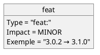
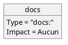

# Guidelines Claude pour PlantUML

**Document de référence** : Bonnes pratiques pour Claude lors de la création ou vérification de diagrammes PlantUML

**Date de création** : 2026-02-02
**Auteur** : Hervé Marchal <herve.marchal@hotmail.fr>
**Version** : 1.0

---

## Table des Matières

1. [Introduction](#introduction)
2. [Syntaxe des Objets](#syntaxe-objets)
3. [Nommage des Éléments](#nommage)
4. [Checklist de Révision](#checklist)

---

<a name="introduction"></a>
## 1. Introduction

Ce document contient les **bonnes pratiques de style** recommandées pour Claude lors de la création ou vérification de diagrammes PlantUML.

Ces règles ne sont **pas des erreurs techniques** (les deux syntaxes fonctionnent), mais des **conventions** pour améliorer la lisibilité et la maintenabilité.

---

<a name="syntaxe-objets"></a>
## 2. Syntaxe des Objets

### ✅ Guideline #1 : Préférer la Syntaxe Explicite pour les Objets

**Recommandation** : Utiliser la syntaxe avec séparation nom/attributs plutôt que la syntaxe avec accolades.

#### ⚠️ Syntaxe valide mais non recommandée

```plantuml
@startuml
object "feat:" {
  Impact = MINOR
  Exemple = "3.0.2 → 3.1.0"
}
@enduml
```

**Pourquoi éviter** :
- La syntaxe avec accolades est moins explicite
- Mélange la déclaration et les attributs
- Moins cohérente avec la documentation PlantUML officielle

#### ✅ Syntaxe recommandée (explicite)



**Avantages** :
- ✅ Séparation claire : déclaration puis attributs
- ✅ Syntaxe officielle PlantUML
- ✅ Plus facile à modifier (ajouter/retirer des attributs)
- ✅ Cohérence avec la documentation

**Pattern recommandé** :
```
object nomObjet
nomObjet : attribut1 = valeur1
nomObjet : attribut2 = valeur2
```

---

<a name="nommage"></a>
## 3. Nommage des Éléments

### ✅ Guideline #2 : Éviter les Caractères Spéciaux dans les Noms d'Objets

**Recommandation** : Ne pas utiliser `:` dans le nom d'un objet. Placer cette information dans un attribut.

#### ⚠️ Syntaxe valide mais non recommandée

```plantuml
@startuml
object "docs:" {
  Impact = Aucun
}
@enduml
```

**Pourquoi éviter** :
- Le `:` est un séparateur réservé pour les stéréotypes et attributs
- Peut causer de la confusion lors de la lecture
- Rend le code moins maintenable

#### ✅ Syntaxe recommandée



**Avantages** :
- ✅ Nom simple et clair
- ✅ Information du type dans un attribut dédié
- ✅ Évite les conflits avec les caractères réservés
- ✅ Plus facile à référencer dans les relations

**Caractères à éviter dans les noms** :
- `:` (deux-points) - séparateur de stéréotype
- `\n` (newline) - erreurs de référence
- `*` et `**` - conflit avec markdown
- `=>`, `->`, `--` - symboles de relation

**Solution** : Mettre ces caractères dans des attributs ou le contenu, pas dans les noms.

---

<a name="checklist"></a>
## 4. Checklist de Révision

Lorsque Claude crée ou vérifie un diagramme PlantUML, vérifier :

### Structure générale
- [ ] Chaque bloc commence par `@startuml`
- [ ] Chaque bloc se termine par `@enduml`
- [ ] Ordre des éléments : `"Nom" as alias #couleur`

### Objets
- [ ] Syntaxe explicite privilégiée : `object nom` puis `nom : attr = val`
- [ ] Pas de `:` dans les noms d'objets
- [ ] Caractères spéciaux évités dans les identifiants

### Notes et documentation
- [ ] Contenu complexe/indenté dans des notes, pas dans les rectangles
- [ ] Notes attachées avec des alias : `note right of alias`
- [ ] Formatage HTML dans les notes : `<b>`, `<i>`, `<u>`

### Diagrammes d'activité
- [ ] `backward` uniquement dans `repeat...repeat while`
- [ ] Pas de `backward` dans des structures `if...endif`

### Mindmaps
- [ ] Hiérarchie respectée : `*` (racine), `**` (niveau 1), `***` (niveau 2)
- [ ] Pas de `**` pour le gras (utiliser `<b>` si nécessaire)

---

## Résumé

Ces guidelines permettent à Claude de :
1. **Générer du code PlantUML cohérent** et maintenable
2. **Suivre les conventions** de la documentation officielle
3. **Éviter les patterns** qui fonctionnent mais sont déconseillés
4. **Faciliter la révision** et la modification ultérieure

**Note importante** : Ces règles sont des **recommandations**, pas des erreurs. Les deux syntaxes fonctionnent en PlantUML, mais la syntaxe recommandée améliore la qualité du code généré.
