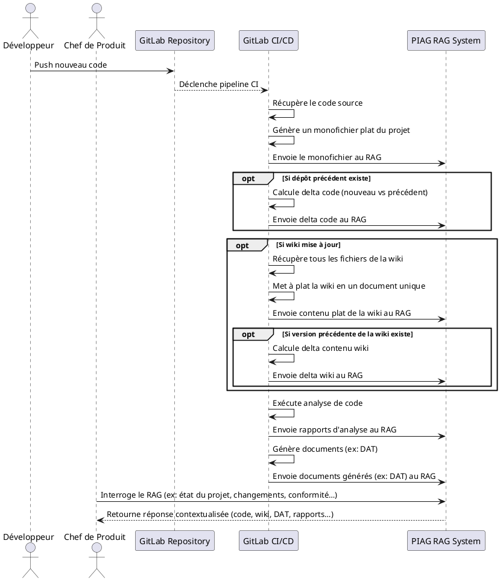
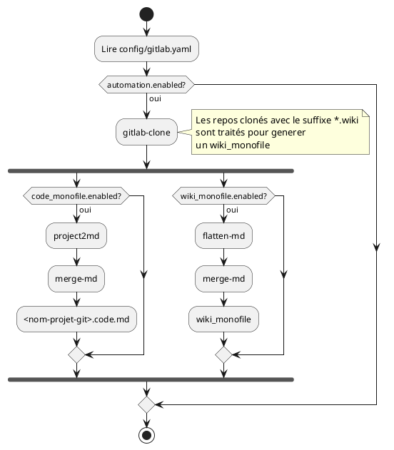

# RAG PIAG - Workflow et commandes CLI

Ce document associe les etapes du workflow RAG PIAG aux commandes CLI disponibles dans Ambulon,
et conserve le diagramme d'origine.

---

## Diagramme (PlantUML)



---

## Schema automation GitLab -> monofichiers



## Options d'automatisation (config/gitlab.yaml)

```yaml
gitlab:
  automation:
    enabled: true
    output_mode: "separate" # separate|shared
    code_monofile:
      enabled: true
      output_dir: null # par defaut: <repo>.rag a cote du repo
      templates:
        - "{project}.code.md"
        - "{project}.code.html"
      pipeline: ["project2md"]
    wiki_monofile:
      enabled: true
      output_dir: null # par defaut: <repo>.rag a cote du repo
      templates:
        - "{project}.md"
        - "{project}.html"
      pipeline: ["flatten-md", "merge-md"]
```

Note: output_mode "separate" cree <repo>.rag et <repo>.wiki.rag.
output_mode "shared" place code + wiki dans <repo>.rag (pas de <repo>.wiki.rag).

---

## 1) Flux principal (code -> RAG)

0. Recuperer le code (depuis GitLab)
   - `ambulon gitlab-clone`

1. Generer un monofichier plat du projet
   - `ambulon project2md <repertoire_projet> -o <output.md>`
   - ou `ambulon gitlab-monofile <repo_clone>` (mode auto)
   - ou `ambulon gitlab-monofile <repo_clone> --mode code|wiki|both`
   - un fichier HTML est genere automatiquement via `md2html`
   - Alternatives selon le format:
     - `ambulon flatten-md <dossier_md> -o <output_dir>`
     - `ambulon merge-md <dossier_md> -o <output.md>`
     - `ambulon flatten-html <dossier_html> -o <output_dir>`
     - `ambulon merge-html <dossier_html> -o <output.html>`

2. Envoyer le monofichier au RAG
   - `ambulon piag-rag-doc-upload --file <output.md>`

---

## 2) Flux Wiki (wiki -> RAG)

0. Recuperer le code (si la wiki est dans GitLab)
   - `ambulon gitlab-clone`

1. Recuperer le contenu WikiSI
   - `ambulon wikisi-scrape <url> -o <dossier_sortie>`

2. Mettre a plat le contenu
   - `ambulon wikisi-flatten <dossier_wikisi> -o <dossier_sortie>`

3. Envoyer le contenu plat au RAG
   - `ambulon piag-rag-doc-upload --folder <dossier_sortie>`

---

## 3) Interroger le RAG

- `ambulon piag-rag-search --query "<question>" --collection-name "<collection>"`
- ou `ambulon piag-rag-search --query "<question>" --collection-id "<id>"`

---

## 4) Commandes RAG PIAG disponibles

Collections:
- `ambulon piag-rag-collection-add`
- `ambulon piag-rag-collection-list`
- `ambulon piag-rag-collection-get`
- `ambulon piag-rag-collection-update`
- `ambulon piag-rag-collection-rm`

Documents:
- `ambulon piag-rag-doc-upload`
- `ambulon piag-rag-doc-list`
- `ambulon piag-rag-doc-get`
- `ambulon piag-rag-doc-rm`
- `ambulon piag-rag-doc-chunks`

Recherche:
- `ambulon piag-rag-search`

---

## 5) Modules sans commande directe

Les etapes suivantes n'ont pas de commande CLI dediee dans Ambulon:
- Calcul de delta code (nouveau vs precedent)
- Calcul de delta wiki
- Analyse de code pour rapports
- Generation de documents "DAT"

---

## 6) Cas concrets

### A) Projet -> monofichier -> upload RAG

```bash
# 0) Cloner les repos GitLab definis dans config/gitlab.yaml
ambulon gitlab-clone

# 1) Transformer un depot en Markdown unique
ambulon project2md G:\repos\mon-projet -o out\project.md

# 1b) Variante directe via gitlab-monofile
ambulon gitlab-monofile G:\repos\mon-projet

# 1c) Variante explicite: code / wiki / les deux
ambulon gitlab-monofile G:\repos\mon-projet --mode code
ambulon gitlab-monofile G:\repos\mon-projet.wiki --mode wiki
ambulon gitlab-monofile G:\repos\mon-projet --mode both

# 1d) Exemple avec Gitlab2 (chemin reel)
ambulon gitlab-monofile G:\WarchoLife\WarchoDevplace\Gitlab2\admin_ep --mode code
ambulon gitlab-monofile G:\WarchoLife\WarchoDevplace\Gitlab2\admin_ep.wiki --mode wiki

# 2) Uploader dans la collection
ambulon piag-rag-doc-upload --file out\project.md --collection-name "ambulon" --project-id "12345"
```

### B) WikiSI -> aplatir -> upload RAG

```bash
# 0) Cloner les repos GitLab si la wiki est versionnee
ambulon gitlab-clone

# 1) Aspirer le site WikiSI
ambulon wikisi-scrape https://wiki.example.fr -o out\wikisi

# 2) Aplatir l'arborescence
ambulon wikisi-flatten out\wikisi -o out\wikisi_flat

# 3) Uploader tous les fichiers
ambulon piag-rag-doc-upload --folder out\wikisi_flat --collection-name "ambulon" --project-id "12345"
```

### C) Recherche RAG

```bash
# Recherche par nom de collection
ambulon piag-rag-search --query "etat du projet" --collection-name "ambulon" --project-id "12345"

# Recherche par ID de collection
ambulon piag-rag-search --query "changements depuis hier" --collection-id "col_abc123" --project-id "12345"
```

### D) Variante avec config YAML

```bash
# Utilise config\piag.yaml pour base_url/token/project_id
ambulon piag-rag-search --query "risques" --collection-name "ambulon" --config config\piag.yaml
```

### E) Variante full CLI (sans config)

```bash
ambulon piag-rag-doc-upload ^
  --file out\project.md ^
  --collection-id "col_abc123" ^
  --project-id "12345" ^
  --base-url "https://preprod.api.piag.e2.rie.gouv.fr/rag/" ^
  --token "VOTRE_TOKEN_ICI"
```

### F) Recherche avec token explicite

```bash
ambulon piag-rag-search ^
  --query "etat de la collection" ^
  --collection-id "col_abc123" ^
  --project-id "12345" ^
  --base-url "https://preprod.api.piag.e2.rie.gouv.fr/rag/" ^
  --token "VOTRE_TOKEN_ICI"
```
