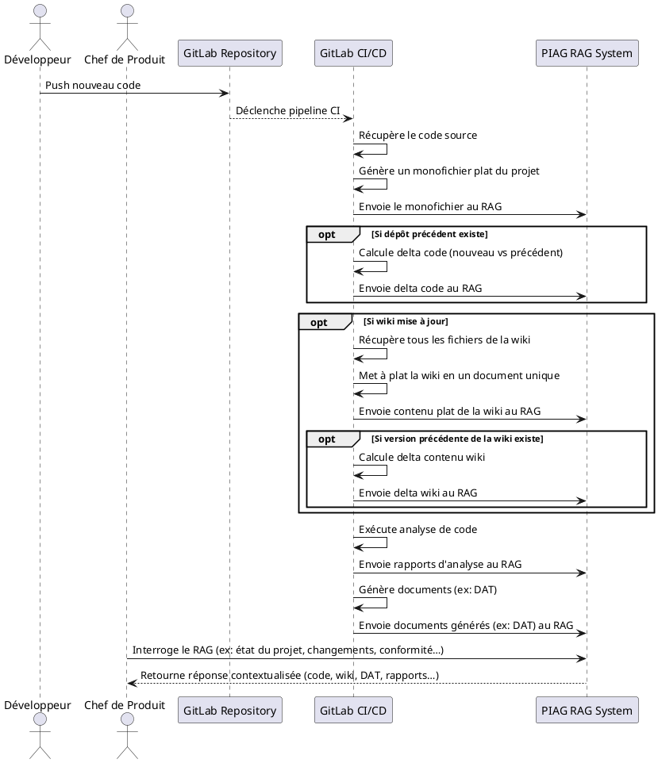

```plantuml
@startuml
actor "Développeur" as Dev
actor "Chef de Produit" as PO
participant "GitLab Repository" as Repo
participant "GitLab CI/CD" as CI
participant "PIAG RAG System" as RAG

Dev -> Repo : Push nouveau code
Repo --> CI : Déclenche pipeline CI

CI -> CI : Récupère le code source
CI -> CI : Génère un monofichier plat du projet
CI -> RAG : Envoie le monofichier au RAG

opt Si dépôt précédent existe
  CI -> CI : Calcule delta code (nouveau vs précédent)
  CI -> RAG : Envoie delta code au RAG
end opt

opt Si wiki mise à jour
  CI -> CI : Récupère tous les fichiers de la wiki
  CI -> CI : Met à plat la wiki en un document unique
  CI -> RAG : Envoie contenu plat de la wiki au RAG

  opt Si version précédente de la wiki existe
    CI -> CI : Calcule delta contenu wiki
    CI -> RAG : Envoie delta wiki au RAG
  end opt
end opt

CI -> CI : Exécute analyse de code
CI -> RAG : Envoie rapports d'analyse au RAG

CI -> CI : Génère documents (ex: DAT)
CI -> RAG : Envoie documents générés (ex: DAT) au RAG

PO -> RAG : Interroge le RAG (ex: état du projet, changements, conformité…)
RAG --> PO : Retourne réponse contextualisée (code, wiki, DAT, rapports…)

@enduml
```