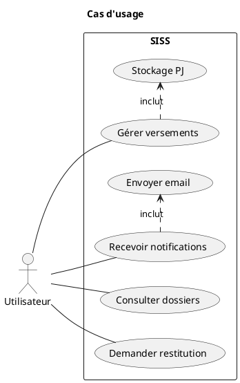
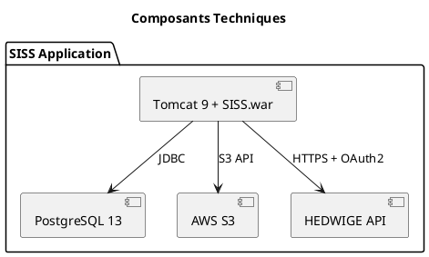
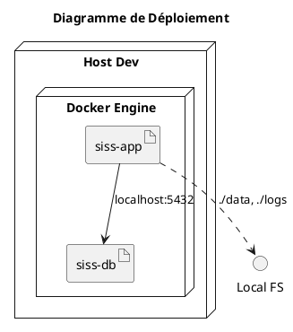
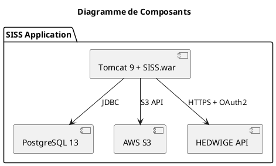
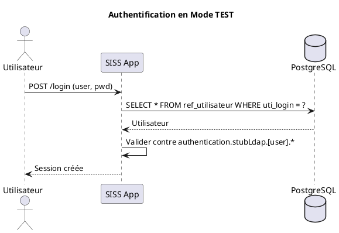
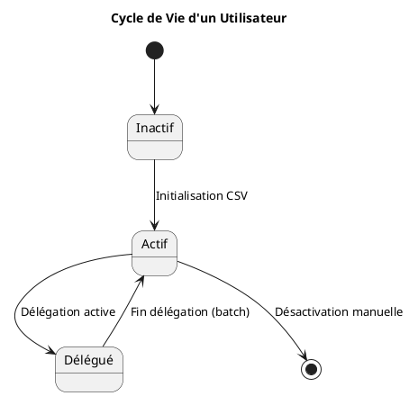
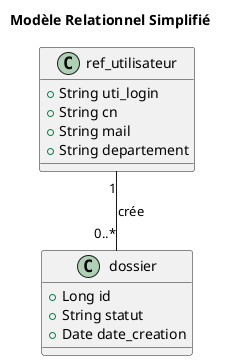

Bien sûr ! Voici le contenu corrigé au format Markdown, prêt à être enregistré dans un fichier `.md`.

Vous pouvez copier tout ce qui suit et l’enregistrer sous `SISS-DAT-corrige.md` (ou remplacer votre fichier actuel).


Voici le DAT (Dossier d'Architecture Technique) détaillé de l'application SISS, illustré avec des diagrammes PlantUML et structuré selon les exigences techniques et fonctionnelles identifiées.

# Dossier d'Architecture Technique (DAT) - SISS

## Table des Matières
- [1. Introduction](#1-introduction)
- [2. Contexte et Périmètre](#2-contexte-et-périmètre)
- [3. Architecture Fonctionnelle](#3-architecture-fonctionnelle)
  - [3.1 Cas d'Usage](#31-cas-dusage)
  - [3.2 Règles Métier](#32-règles-métier)
- [4. Architecture Technique](#4-architecture-technique)
  - [4.1 Architecture Logique](#41-architecture-logique)
  - [4.2 Architecture Physique](#42-architecture-physique)
  - [4.3 Composants Techniques](#43-composants-techniques)
  - [4.4 Flux de Données](#44-flux-de-données)
- [5. Diagrammes Techniques](#5-diagrammes-techniques)
  - [5.1 Diagramme de Déploiement](#51-diagramme-de-déploiement)
  - [5.2 Diagramme de Composants](#52-diagramme-de-composants)
  - [5.3 Diagramme de Séquence](#53-diagramme-de-séquence)
  - [5.4 Diagramme d'États](#54-diagramme-détats)
  - [5.5 Diagramme de Classes](#55-diagramme-de-classes)
- [6. Configuration et Déploiement](#6-configuration-et-déploiement)
- [7. Sécurité](#7-sécurité)
- [8. Annexes](#8-annexes)

## 1. Introduction

Le SISS (Système d'Information pour le Suivi des Stockages) est une application conçue pour gérer l'archivage physique et numérique de documents sensibles dans un contexte administratif ministériel. Elle assure la traçabilité des mouvements, la gestion sécurisée des accès et le stockage conforme des pièces jointes.

## 2. Contexte et Périmètre

### 2.1 Description Générale
- **ID** : 583  
- **Statut** : En construction  
- **Numéro d'affaire** : AFF0583  
- **Acteur MOE** : SG/DNUM/PNM/DPNM3  
- **Technologie principale** : Java  

### 2.2 Domaine Applicatif
L'application SISS gère :
- L'archivage physique de documents sensibles.
- La traçabilité des mouvements.
- La gestion des accès sécurisés.
- Le stockage des pièces jointes.

### 2.3 Périmètre Fonctionnel

**Inclus** :
- Versements de documents.
- Demandes d'accès, consultation et restitution.
- Mouvements de documents (transferts, archivage, désarchivage).
- Gestion des référentiels (utilisateurs, départements) via fichiers CSV.
- Authentification (SAML2 ou mode TEST local).
- Stockage sécurisé des pièces jointes (AWS S3-compatible).
- Envoi d'e-mails via API HEDWIGE ou SMTP.
- Batchs automatisés (fin de délégation, nettoyage).

**Exclus** :
- Gestion de données patients.
- Logique de facturation ou tarification.
- Workflow avancé (pas de moteur BPM).

## 3. Architecture Fonctionnelle

### 3.1 Cas d'Usage



*Fig 3.1 Cas d'usage*

### 3.2 Règles Métier

**Gestion des pièces jointes** :
- Formats autorisés : Configurables via `siss.format_piece_jointe` (ex. : `pdf, docx`).
- Stockage : AWS S3-compatible (`siss.pj-stockage.mode=AWS`).
- Chemin temporaire local : `/app/data/siss_upload`.

**Chiffrement des données** :
- Clé symétrique définie dans `siss.encryption.key`.
- Non modifiable après initialisation.
- Générée via `siss-generate-key.jar`.

## 4. Architecture Technique

### 4.1 Architecture Logique

| Composant           | Technologie             | Description                                      |
|---------------------|-------------------------|--------------------------------------------------|
| Backend             | Java Spring Boot        | Application embarquée dans Tomcat 9.0.82 (JDK 11). |
| Frontend            | Inclus dans le `.war`   | Pas de séparation explicite avec le backend.      |
| Base de données     | PostgreSQL 13.19        | Stockage des données métiers et des référentiels. |
| Stockage des PJ     | AWS S3-compatible       | Stockage sécurisé des pièces jointes.            |
| Authentification    | SAML2 / Stub LDAP       | Authentification centralisée ou locale (mode TEST). |
| Envoi d'e-mails     | API HEDWIGE / SMTP      | Intégration avec le service ministériel d'e-mails sécurisés. |

### 4.2 Architecture Physique

**Environnements** :
- **Développement** : Sources locales (fichiers `.tar.bz2` copiés dans l'image Docker).
- **Production** : Sources téléchargées depuis Nexus Silicom (`nexus.sro.silicom.fr`).

### 4.3 Composants Techniques



*Fig 4.3 Composants Techniques*

### 4.4 Flux de Données

```plantuml
@startuml
title Flux de Données
actor Utilisateur
Utilisateur -> ((Tomcat SISS.war)) : Requêtes
((Tomcat SISS.war)) -> (PostgreSQL 13) : JDBC
((Tomcat SISS.war)) -> (AWS S3) : S3 API
((Tomcat SISS.war)) -> (HEDWIGE API) : HTTPS + OAuth2
@enduml
```

*Fig 4.4 Flux de Données*

## 5. Diagrammes Techniques

### 5.1 Diagramme de Déploiement



*Fig 5.1 : Diagramme de Déploiement*

### 5.2 Diagramme de Composants



*Fig 5.2 Diagramme de Composants*

### 5.3 Diagramme de Séquence : Authentification en Mode TEST



*Fig 5.3 : Authentification en Mode TEST*

### 5.4 Diagramme d'États : Cycle de Vie d'un Utilisateur



*Fig 5.4 : Cycle de Vie d'un Utilisateur*

### 5.5 Diagramme de Classes : Modèle Relationnel Simplifié



*Fig 5.5 : Modèle Relationnel Simplifié*

## 6. Configuration et Déploiement

### 6.1 Paramétrage

**Fichiers de configuration** :
- `application.properties` : Paramètres principaux.
- `access.properties` : Accès sécurisés.
- `ref_utilisateur.csv` : Initialisation des utilisateurs.

**Clé de chiffrement** :  
Générée via la commande :
```bash
docker exec -it siss:latest java -jar /app/siss/lib/version/siss-generate-key.jar [cle-de-chiffrement]
```
Résultat à renseigner dans `siss.encryption.key`.

### 6.2 Déploiement

**Build locale** :
```bash
docker build -t siss:latest --build-arg SISS_VERSION=X.Y.Z -f conf/dev/Dockerfile .
```

**Build CI/CD** :  
Image disponible sous `eu.gcr.io/dpnm3-lab/siss`.

## 7. Sécurité

- **Chiffrement des données** :  
  Clé symétrique pour le chiffrement/déchiffrement des données. Non modifiable après initialisation.
- **Authentification** :  
  SAML2 pour la production. Stub LDAP pour les tests.

## 8. Annexes

**Références** :  
Ce document suit les principes de arc42 pour une documentation claire et orientée décision.  
Diagrammes centrés sur les besoins.

↩ [Retour au sommaire](#dossier-darchitecture-technique-dat---siss)

### Points clés du DAT :
- **Diagrammes PlantUML** :  
  Tous les diagrammes sont intégrés directement dans le document.  
  Ils couvrent les aspects fonctionnels et techniques (cas d'usage, composants, séquences, états, classes).
- **Structure claire** :  
  Sections bien définies pour chaque aspect de l'architecture.  
  Navigation facile grâce aux liens de retour vers la TOC.
- **Conformité** :  
  Respect des règles de PlantUML et des exigences techniques identifiées dans les documents sources.
```