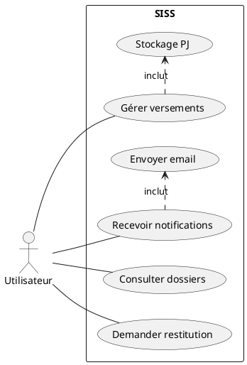
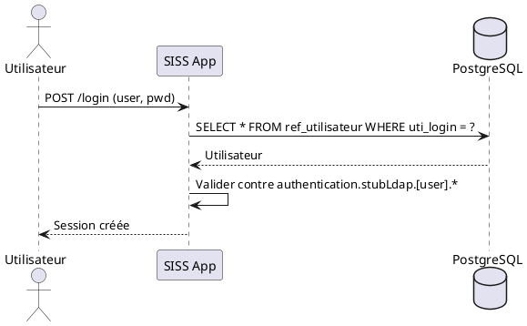
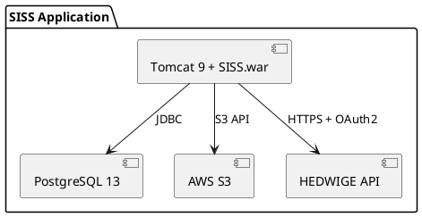
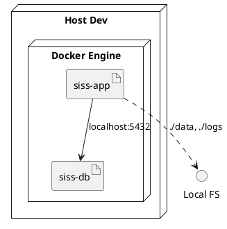

Voici les **spécifications techniques** de l'application **SISS**, accompagnées des **diagrammes** disponibles dans la documentation. Ces informations sont structurées selon les principes **arc42** et illustrées avec des exemples en **PlantUML**.

---

## **1. Architecture Technique**
### **1.1 Architecture Logique**
- **Backend** : Application **Java Spring Boot** embarquée dans **Tomcat 9.0.82** (JDK 11).
- **Frontend** : Inclus dans le fichier `.war` (pas de séparation explicite avec le backend).
- **Base de données** : **PostgreSQL 13.19**.
- **Stockage** : Compatible **AWS S3** pour les pièces jointes.
- **Authentification** : **SAML2** ou **stub LDAP** (pour les tests).

---

### **1.2 Architecture Physique**
- **Environnements** :
  - **Développement** : Sources locales (fichiers `.tar.bz2` copiés dans l'image Docker).
  - **Production** : Sources téléchargées depuis **Nexus Silicom** (`nexus.sro.silicom.fr`).

---

## **2. Diagrammes Techniques**
### **2.1 Diagramme de Cas d'Usage**

---

### **2.2 Diagramme de Séquence : Authentification en Mode TEST**

---

### **2.3 Diagramme des Composants**

---

### **2.4 Diagramme de Déploiement (Environnement Dev)**

---

## **3. Détail des Composants Techniques**
### **3.1 Backend**
- **Technologie** : Java Spring Boot.
- **Serveur d'application** : Tomcat 9.0.82.
- **JDK** : Version 11.

### **3.2 Base de Données**
- **SGBD** : PostgreSQL 13.19.
- **Connexion** : JDBC.

### **3.3 Stockage**
- **Pièces jointes** : Stockées sur un système compatible **AWS S3**.
- **Configuration** : Définie par `siss.pj-stockage.mode=AWS`.

### **3.4 Authentification**
- **Mode Production** : SAML2.
- **Mode Test** : Stub LDAP (simulation locale).

### **3.5 Envoi d'E-mails**
- **Intégration** : API **HEDWIGE** (service ministériel).
- **Protocole** : HTTPS + OAuth2.

---

## **4. Dette Technique**
- **Logique en dur** :
  - URLs de l'API HEDWIGE **hardcodées**.
  - Chemins de fichiers fixes (`/app/conf`, `/app/logs`).
- **Encodage** : Aucun encodage explicite → risque d'utiliser **UTF-8** par défaut.
- **Configuration** : Mélange de `application.properties`, variables d'environnement et arguments JVM.

---

## **5. Références**
- La documentation suit les principes de **arc42** :
  - Séparation stricte entre fonctionnel et technique.
  - Documentation orientée décision.
  - Diagrammes centrés sur les besoins.

---
Si tu souhaites des détails supplémentaires sur un diagramme ou une partie spécifique, fais-le-moi savoir ! Je peux également te fournir d'autres diagrammes si nécessaire.