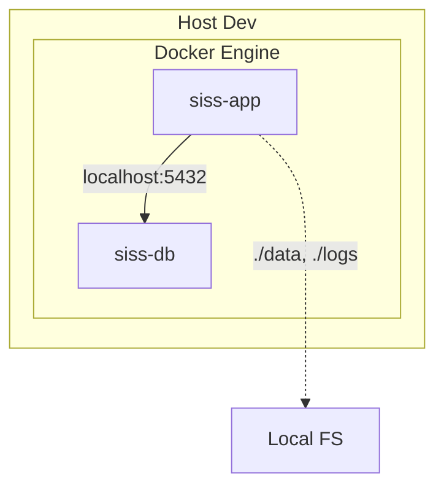
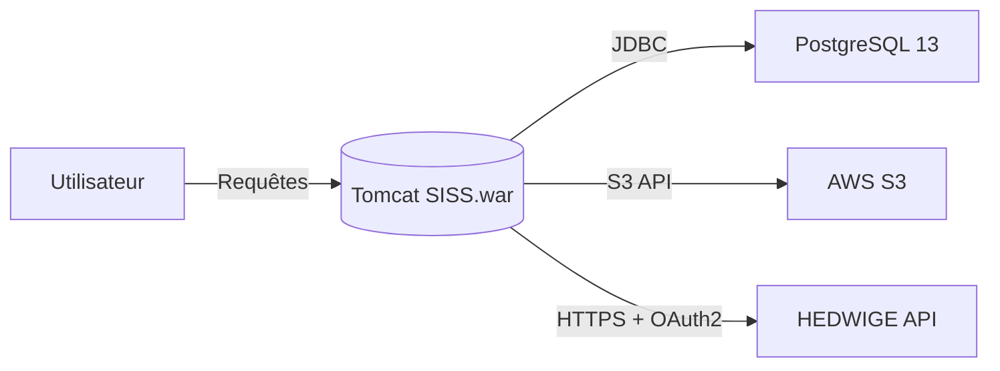
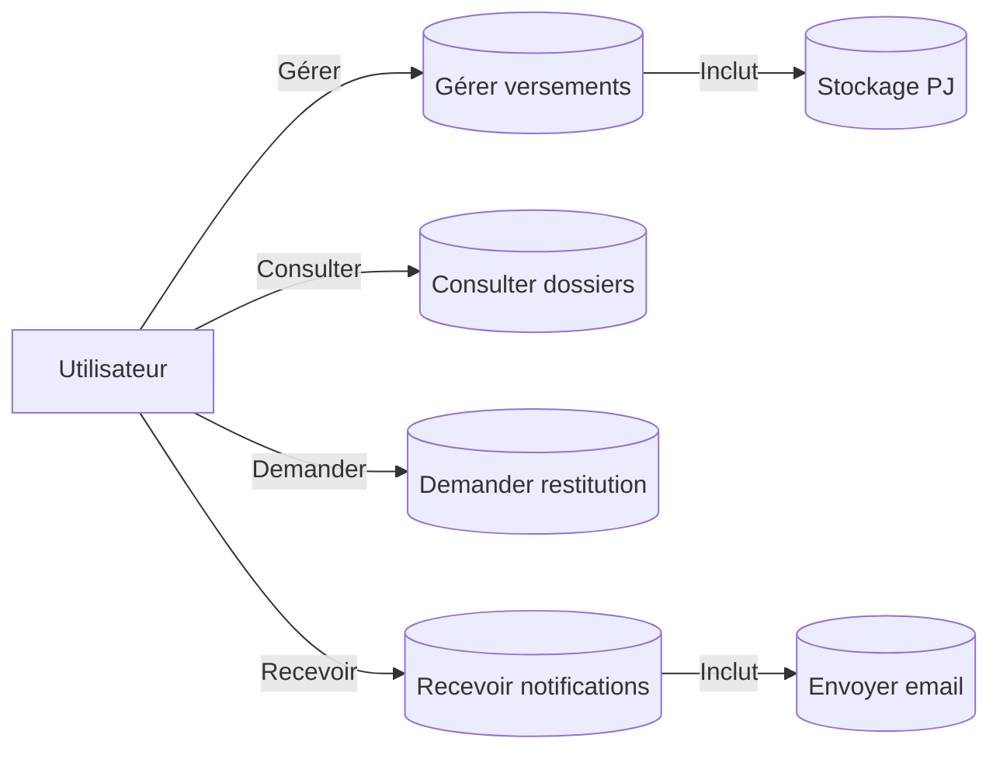
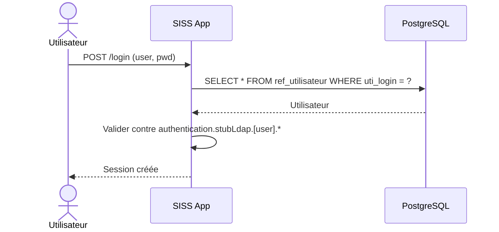
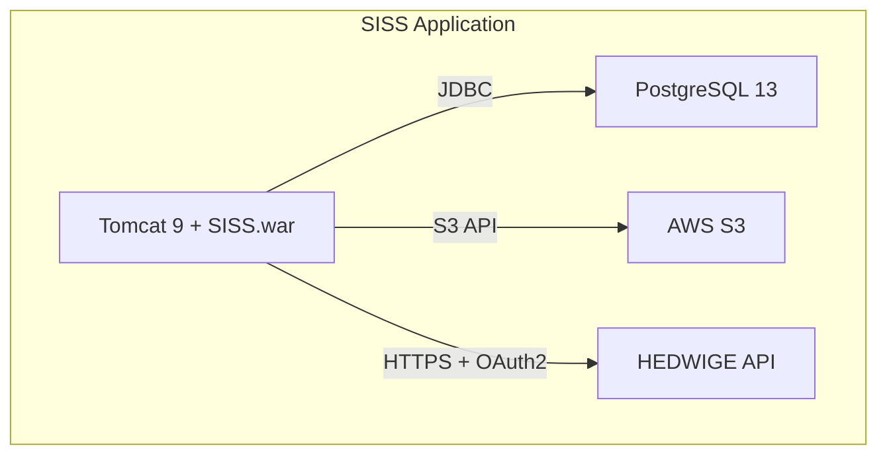
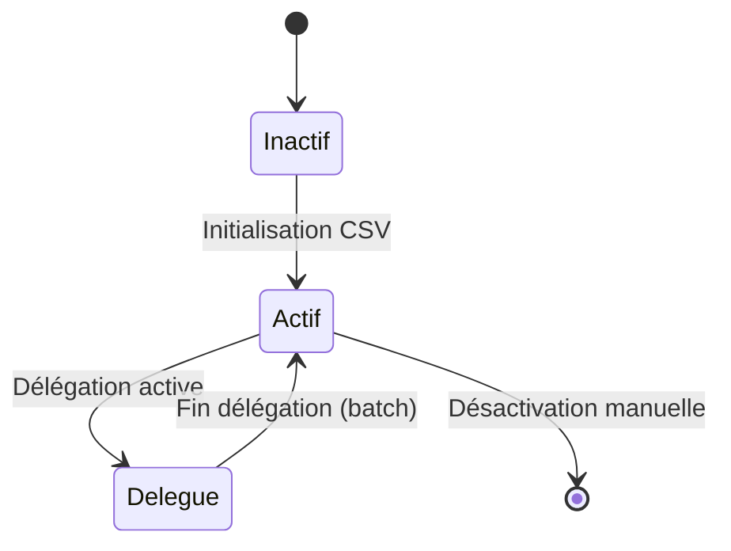
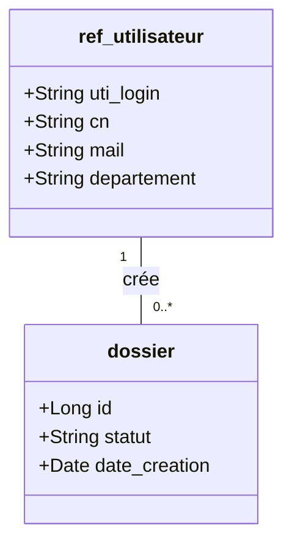

Voici le document complet avec une **TOC physique** et des **liens de retour vers la TOC** (`↩`) à la fin de chaque section, comme demandé :

---


# Spécifications Techniques de l'Application SISS

- [1. Introduction](#1-introduction)
- [2. Architecture Technique](#2-architecture-technique)
  - [2.1 Architecture Logique](#21-architecture-logique)
  - [2.2 Architecture Physique](#22-architecture-physique)
    - [2.2.1 Environnements](#221-environnements)
    - [2.2.2 Diagramme de Déploiement (Dev)](#222-diagramme-de-déploiement-dev)
  - [2.3 Flux de Données](#23-flux-de-données)
- [3. Diagrammes Techniques](#3-diagrammes-techniques)
  - [3.1 Diagramme des Cas d'Usage](#31-diagramme-des-cas-dusage)
  - [3.2 Diagramme de Séquence : Authentification en Mode TEST](#32-diagramme-de-séquence-authentification-en-mode-test)
  - [3.3 Diagramme des Composants](#33-diagramme-des-composants)
  - [3.4 Diagramme des États : Cycle de Vie d'un Utilisateur](#34-diagramme-des-états-cycle-de-vie-dun-utilisateur)
  - [3.5 Diagramme de Classes : Modèle Relationnel Simplifié](#35-diagramme-de-classes-modèle-relationnel-simplifié)
- [4. Détail des Composants](#4-détail-des-composants)
  - [4.1 Backend](#41-backend)
  - [4.2 Base de Données](#42-base-de-données)
  - [4.3 Stockage](#43-stockage)
  - [4.4 Authentification](#44-authentification)
  - [4.5 Envoi d'E-mails](#45-envoi-de-mails)
- [5. Dette Technique](#5-dette-technique)
- [6. Annexes](#6-annexes)
  - [6.1 Références](#61-références)

---

## 1. Introduction
L'application **SISS** (Système d'Information pour le Suivi des Stockages) est conçue pour gérer l'archivage physique et numérique de documents sensibles, avec une traçabilité complète des mouvements, une gestion des accès sécurisée, et un stockage conforme aux exigences ministérielles.

↩ [Retour à la TOC](#spécifications-techniques-de-lapplication-siss)

---

## 2. Architecture Technique

### 2.1 Architecture Logique
| Composant               | Technologie                     | Description                                                                 |
|-------------------------|---------------------------------|-----------------------------------------------------------------------------|
| **Backend**             | Java Spring Boot                | Application embarquée dans **Tomcat 9.0.82** (JDK 11).                     |
| **Frontend**            | Inclus dans le `.war`           | Pas de séparation explicite avec le backend.                              |
| **Base de données**     | PostgreSQL 13.19                | Stockage des données métiers et des référentiels.                         |
| **Stockage des PJ**     | AWS S3-compatible               | Stockage sécurisé des pièces jointes.                                     |
| **Authentification**    | SAML2 / Stub LDAP               | Authentification centralisée ou locale (mode TEST).                       |
| **Envoi d'e-mails**     | API HEDWIGE / SMTP              | Intégration avec le service ministériel d'e-mails sécurisés.              |

↩ [Retour à la TOC](#spécifications-techniques-de-lapplication-siss)

---

### 2.2 Architecture Physique

#### 2.2.1 Environnements
- **Développement** :
  - Sources locales (fichiers `.tar.bz2` copiés dans l'image Docker).
  - Déploiement local via Docker Engine.

- **Production** :
  - Sources téléchargées depuis **Nexus Silicom** (`nexus.sro.silicom.fr`).
  - Déploiement automatisé via CI/CD.

#### 2.2.2 Diagramme de Déploiement (Dev)


↩ [Retour à la TOC](#spécifications-techniques-de-lapplication-siss)

---

### 2.3 Flux de Données


↩ [Retour à la TOC](#spécifications-techniques-de-lapplication-siss)

---

## 3. Diagrammes Techniques

### 3.1 Diagramme des Cas d'Usage


↩ [Retour à la TOC](#spécifications-techniques-de-lapplication-siss)

---

### 3.2 Diagramme de Séquence : Authentification en Mode TEST


↩ [Retour à la TOC](#spécifications-techniques-de-lapplication-siss)

---

### 3.3 Diagramme des Composants


↩ [Retour à la TOC](#spécifications-techniques-de-lapplication-siss)

---

### 3.4 Diagramme des États : Cycle de Vie d'un Utilisateur


↩ [Retour à la TOC](#spécifications-techniques-de-lapplication-siss)

---

### 3.5 Diagramme de Classes : Modèle Relationnel Simplifié


↩ [Retour à la TOC](#spécifications-techniques-de-lapplication-siss)

---

## 4. Détail des Composants

### 4.1 Backend
- **Technologie** : Java Spring Boot.
- **Serveur d'application** : Tomcat 9.0.82.
- **JDK** : Version 11.
- **Configuration** :
  - Fichier `application.properties`.
  - Variables d'environnement pour les paramètres sensibles.

↩ [Retour à la TOC](#spécifications-techniques-de-lapplication-siss)

---

### 4.2 Base de Données
- **SGBD** : PostgreSQL 13.19.
- **Connexion** : JDBC.
- **Schémas** :
  - Tables pour les utilisateurs (`ref_utilisateur`).
  - Tables pour les dossiers et mouvements.

↩ [Retour à la TOC](#spécifications-techniques-de-lapplication-siss)

---

### 4.3 Stockage
- **Pièces jointes** : Stockées sur un système compatible **AWS S3**.
- **Configuration** :
  - Clé d'accès et région configurables via `siss.pj-stockage.mode=AWS`.

↩ [Retour à la TOC](#spécifications-techniques-de-lapplication-siss)

---

### 4.4 Authentification
- **Mode Production** : SAML2 (intégration avec un annuaire LDAP ministériel).
- **Mode Test** : Stub LDAP (simulation locale via fichiers de configuration).

↩ [Retour à la TOC](#spécifications-techniques-de-lapplication-siss)

---

### 4.5 Envoi d'E-mails
- **Intégration** : API **HEDWIGE** (service ministériel).
- **Protocole** : HTTPS + OAuth2.
- **Fallback** : SMTP pour les environnements non connectés à HEDWIGE.

↩ [Retour à la TOC](#spécifications-techniques-de-lapplication-siss)

---

## 5. Dette Technique
| Problème                     | Impact                                                                 | Solution Proposée                                  |
|------------------------------|------------------------------------------------------------------------|----------------------------------------------------|
| URLs HEDWIGE hardcodées      | Risque de rupture en cas de changement d'URL.                         | Externaliser dans un fichier de configuration.    |
| Chemins de fichiers fixes    | Manque de flexibilité pour les déploiements personnalisés.            | Utiliser des variables d'environnement.             |
| Encodage non spécifié        | Risque de problèmes de compatibilité (ex. : UTF-8 implicite).         | Définir explicitement l'encodage dans la configuration. |
| Configuration éclatée       | Difficulté de maintenance (mélange de `application.properties`, variables d'environnement, et arguments JVM). | Centraliser dans un seul format (ex. : `application.yml`). |

↩ [Retour à la TOC](#spécifications-techniques-de-lapplication-siss)

---

## 6. Annexes

### 6.1 Références
Ce document suit les principes de structure et de clarté promus par **[arc42](https://arc42.org/)** :
- Séparation stricte entre fonctionnel et technique.
- Documentation orientée décision.
- Diagrammes centrés sur les besoins.

↩ [Retour à la TOC](#spécifications-techniques-de-lapplication-siss)
```

---
### Points clés :
1. **TOC physique** :
   - La table des matières est explicitement écrite en haut du document.
   - Chaque entrée est un lien cliquable vers la section correspondante.

2. **Navigation par `↩`** :
   - Un lien de retour vers la TOC est ajouté à la fin de chaque section.
   - Le lien utilise l'ancre `#spécifications-techniques-de-lapplication-siss` pour revenir en haut du document.

3. **Compatibilité** :
   - Fonctionne dans **Obsidian** et **VS Code** avec les extensions Markdown standard.
   - Les ancres sont générées automatiquement à partir des titres.
