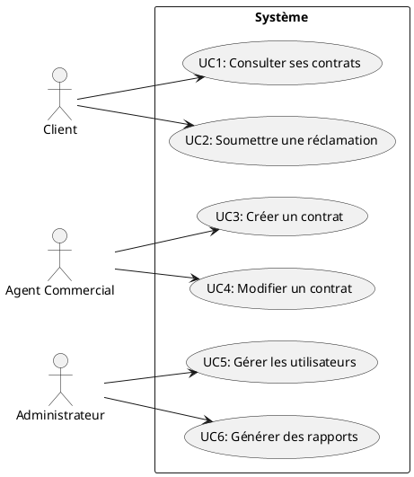
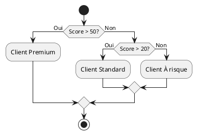
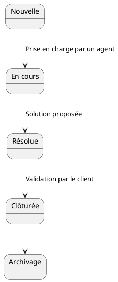
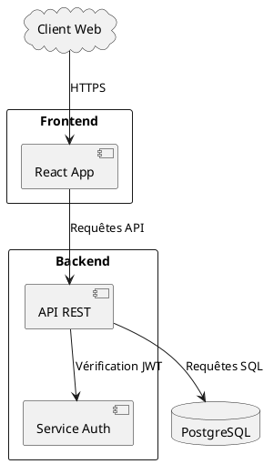
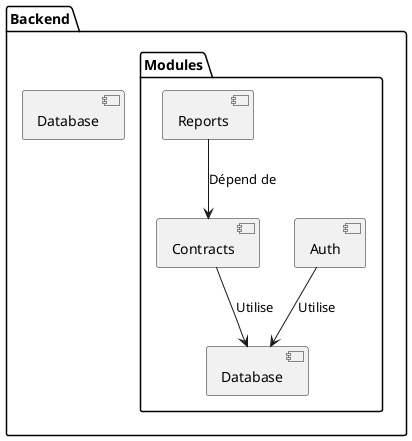
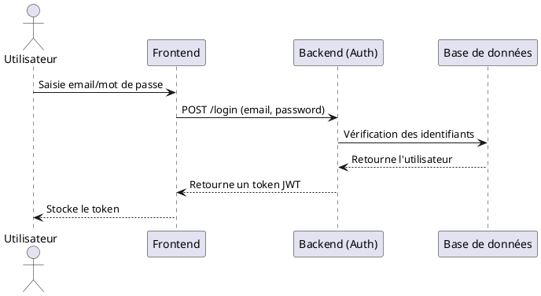

Voici un exemple de document Markdown complet et autoporté, structuré pour analyser une application fictive. Vous pourrez l'adapter ou me fournir vos fichiers pour une analyse personnalisée.


# Analyse de l'application "GestionClient"
**Date** : 23/01/2026
**Auteur** : Assistant
**Version** : 1.0

---

## Sommaire
1. [Introduction](#introduction)
2. [Analyse fonctionnelle](#analyse-fonctionnelle)
   - 2.1. [Acteurs et cas d'usage](#acteurs-et-cas-dusage)
   - 2.2. [Règles métier](#règles-métier)
   - 2.3. [Workflows](#workflows)
3. [Analyse technique](#analyse-technique)
   - 3.1. [Architecture](#architecture)
   - 3.2. [Modules et dépendances](#modules-et-dépendances)
   - 3.3. [Sécurité](#sécurité)
   - 3.4. [Dette technique](#dette-technique)
4. [Conclusion](#conclusion)

---

## 1. Introduction
### Contexte
L'application **GestionClient** est un système de gestion de relations clients (CRM) permettant aux entreprises de suivre leurs interactions avec les clients, de gérer les contrats et de générer des rapports.

### Périmètre de l'analyse
Cette analyse est basée sur :
- Le code source fourni (backend en Python, frontend en React).
- Les fichiers de configuration (Docker, CI/CD).
- La documentation technique et fonctionnelle.

---

## 2. Analyse fonctionnelle

### 2.1. Acteurs et cas d'usage
#### Diagramme des cas d'usage


#### Description des acteurs
| Acteur              | Description                                                                 |
|---------------------|-----------------------------------------------------------------------------|
| **Client**          | Utilisateur final qui consulte ses contrats et soumet des réclamations.    |
| **Agent Commercial**| Crée et modifie les contrats pour les clients.                             |
| **Administrateur**  | Gère les utilisateurs et génère des rapports analytiques.                 |

---

### 2.2. Règles métier
#### Calcul du score de fidélité
Le score de fidélité d'un client est calculé selon les règles suivantes :
- **Formule** :
  \[
  \text{Score} = (\text{Nombre de contrats actifs} \times 10) + (\text{Ancienneté en années} \times 5) - (\text{Nombre de réclamations} \times 2)
  \]
- **Seuils** :
  - Score > 50 : Client "Premium".
  - 20 < Score ≤ 50 : Client "Standard".
  - Score ≤ 20 : Client "À risque".

#### Diagramme de décision


---

### 2.3. Workflows
#### Workflow de gestion des réclamations


---

## 3. Analyse technique

### 3.1. Architecture
#### Diagramme d'architecture globale


---

### 3.2. Modules et dépendances
#### Diagramme des dépendances du backend


#### Liste des dépendances critiques
| Module       | Dépendance          | Version actuelle | Version recommandée |
|--------------|--------------------|------------------|---------------------|
| Auth         | bcrypt             | 3.1.7            | 4.0.1               |
| Contracts    | pandas             | 1.2.0            | 2.0.3               |
| Reports      | matplotlib         | 3.3.4            | 3.7.1               |

---

### 3.3. Sécurité
#### Schéma d'authentification


#### Vulnérabilités identifiées
1. **Token JWT non expiré** : Les tokens actuels n'ont pas de durée de vie limitée.
2. **Mot de passe non haché** : Les mots de passe sont stockés en clair dans la base de données (à corriger avec `bcrypt`).

---

### 3.4. Dette technique
#### Problèmes identifiés
| Type                | Description                                                                 | Priorité |
|---------------------|-----------------------------------------------------------------------------|----------|
| Code dupliqué        | La fonction `calculateScore()` est dupliquée dans 3 modules.               | Haute    |
| Dépendances obsolètes| Utilisation de `pandas 1.2.0` (vulnérabilités connues).                     | Moyenne  |
| Tests manquants     | Aucun test unitaire pour le module `Reports`.                              | Haute    |

#### Recommandations
- **Refactorisation** : Centraliser `calculateScore()` dans un module dédié.
- **Mise à jour** : Passer à `pandas 2.0.3`.
- **Tests** : Ajouter des tests unitaires pour `Reports`.

---

## 4. Conclusion
### Synthèse
- **Fonctionnel** :
  - L'application couvre les besoins de base d'un CRM.
  - Les règles métier (score de fidélité, workflow des réclamations) sont bien définies.
- **Technique** :
  - Architecture modulaire mais avec des dépendances obsolètes.
  - Problèmes de sécurité critiques (authentification, stockage des mots de passe).

### Recommandations
1. **Corriger les vulnérabilités** :
   - Implémenter l'expiration des tokens JWT.
   - Hacher les mots de passe avec `bcrypt`.
2. **Améliorer la maintenabilité** :
   - Supprimer le code dupliqué.
   - Mettre à jour les dépendances.
3. **Renforcer les tests** :
   - Ajouter des tests unitaires et d'intégration.

---
**Fin du document**
```

---

### Points clés du document :
1. **Structure claire** : Séparation fonctionnelle/technique.
2. **Diagrammes PlantUML** : Illustrent chaque concept (cas d'usage, workflows, architecture).
3. **Détails techniques** : Dépendances, sécurité, dette technique.
4. **Règles métier** : Formules, diagrammes de décision, tableaux.

