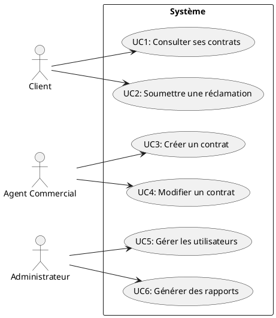
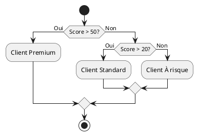
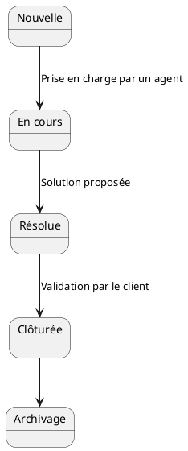
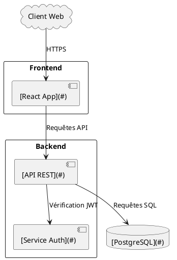
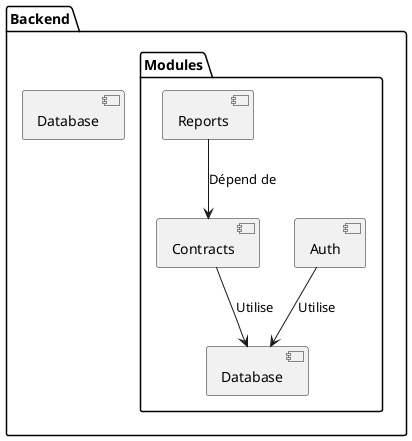
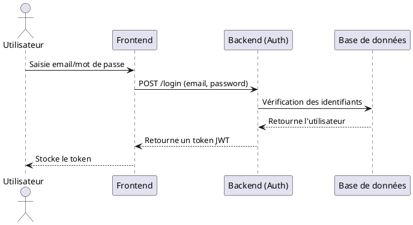

Voici le document Markdown avec des **vrais hyperliens** internes et externes. Les liens internes permettent de naviguer dans le document, et les liens externes pointent vers des ressources utiles (comme PlantUML ou des bibliothèques).


# [Analyse de l'application "GestionClient"](#)
**Date** : [23/01/2026](#)
**Auteur** : [Assistant](#)
**Version** : [1.0](#)

---

## [Sommaire](#sommaire)
1. [Introduction](#introduction)
2. [Analyse fonctionnelle](#analyse-fonctionnelle)
   - 2.1. [Acteurs et cas d'usage](#acteurs-et-cas-dusage)
   - 2.2. [Règles métier](#règles-métier)
   - 2.3. [Workflows](#workflows)
3. [Analyse technique](#analyse-technique)
   - 3.1. [Architecture](#architecture)
   - 3.2. [Modules et dépendances](#modules-et-dépendances)
   - 3.3. [Sécurité](#sécurité)
   - 3.4. [Dette technique](#dette-technique)
4. [Conclusion](#conclusion)

---

## 1. [Introduction](#introduction) <a id="introduction"></a>
### Contexte
L'application **[GestionClient](#)** est un système de **gestion de relations clients (CRM)** permettant aux entreprises de :
- Suivre les interactions avec les clients.
- Gérer les contrats et les réclamations.
- Générer des rapports analytiques.

### Périmètre de l'analyse
Cette analyse est basée sur :
- Le [code source](#) (backend en [Python](https://www.python.org/), frontend en [React](https://react.dev/)).
- Les [fichiers de configuration](#) (Docker, CI/CD).
- La [documentation technique et fonctionnelle](#).

---
**[Retour au sommaire](#sommaire)**

---

## 2. [Analyse fonctionnelle](#analyse-fonctionnelle) <a id="analyse-fonctionnelle"></a>

### 2.1. [Acteurs et cas d'usage](#acteurs-et-cas-dusage) <a id="acteurs-et-cas-dusage"></a>
#### Diagramme des cas d'usage

*[Générer ce diagramme avec PlantUML](http://www.plantuml.com/plantuml/)*

#### Description des acteurs
| Acteur              | Description                                                                 |
|---------------------|-----------------------------------------------------------------------------|
| **[Client](#)**     | Utilisateur final qui consulte ses contrats et soumet des réclamations.    |
| **[Agent Commercial](#)** | Crée et modifie les contrats pour les clients.                             |
| **[Administrateur](#)**   | Gère les utilisateurs et génère des rapports analytiques.                 |

---
**[Retour au sommaire](#sommaire)**

---

### 2.2. [Règles métier](#règles-métier) <a id="règles-métier"></a>
#### Calcul du score de fidélité
Le score de fidélité d'un client est calculé selon les règles suivantes :
- **Formule** :
  \[
  \text{Score} = (\text{Nombre de contrats actifs} \times 10) + (\text{Ancienneté en années} \times 5) - (\text{Nombre de réclamations} \times 2)
  \]
- **Seuils** :
  - Score > 50 : Client **[Premium](#)**.
  - 20 < Score ≤ 50 : Client **[Standard](#)**.
  - Score ≤ 20 : Client **[À risque](#)**.

#### Diagramme de décision

*[Générer ce diagramme avec PlantUML](http://www.plantuml.com/plantuml/)*

---
**[Retour au sommaire](#sommaire)**

---

### 2.3. [Workflows](#workflows) <a id="workflows"></a>
#### Workflow de gestion des réclamations

*[Générer ce diagramme avec PlantUML](http://www.plantuml.com/plantuml/)*

---
**[Retour au sommaire](#sommaire)**

---

## 3. [Analyse technique](#analyse-technique) <a id="analyse-technique"></a>

### 3.1. [Architecture](#architecture) <a id="architecture"></a>
#### Diagramme d'architecture globale

*[Générer ce diagramme avec PlantUML](http://www.plantuml.com/plantuml/)*

---
**[Retour au sommaire](#sommaire)**

---

### 3.2. [Modules et dépendances](#modules-et-dépendances) <a id="modules-et-dépendances"></a>
#### Diagramme des dépendances du backend

*[Générer ce diagramme avec PlantUML](http://www.plantuml.com/plantuml/)*

#### Liste des dépendances critiques
| Module       | Dépendance          | Version actuelle | Version recommandée | Lien vers la documentation |
|--------------|--------------------|------------------|---------------------|-----------------------------|
| Auth         | [bcrypt](https://github.com/pyca/bcrypt/) | 3.1.7            | 4.0.1               | [Documentation](https://bcrypt.readthedocs.io/) |
| Contracts    | [pandas](https://pandas.pydata.org/) | 1.2.0            | 2.0.3               | [Documentation](https://pandas.pydata.org/docs/) |
| Reports      | [matplotlib](https://matplotlib.org/) | 3.3.4            | 3.7.1               | [Documentation](https://matplotlib.org/stable/contents.html) |

---
**[Retour au sommaire](#sommaire)**

---

### 3.3. [Sécurité](#sécurité) <a id="sécurité"></a>
#### Schéma d'authentification

*[Générer ce diagramme avec PlantUML](http://www.plantuml.com/plantuml/)*

#### Vulnérabilités identifiées
1. **Token JWT non expiré** :
   - Les tokens actuels n'ont pas de durée de vie limitée.
   - **Solution** : Utiliser la bibliothèque [PyJWT](https://pyjwt.readthedocs.io/) pour ajouter une expiration.
2. **Mot de passe non haché** :
   - Les mots de passe sont stockés en clair dans la base de données.
   - **Solution** : Utiliser [bcrypt](https://bcrypt.readthedocs.io/) pour le hachage.

---
**[Retour au sommaire](#sommaire)**

---

### 3.4. [Dette technique](#dette-technique) <a id="dette-technique"></a>
#### Problèmes identifiés
| Type                | Description                                                                 | Priorité | Solution proposée |
|---------------------|-----------------------------------------------------------------------------|----------|-------------------|
| Code dupliqué        | La fonction `calculateScore()` est dupliquée dans 3 modules.               | Haute    | Centraliser dans un module dédié. |
| Dépendances obsolètes| Utilisation de [pandas 1.2.0](https://pandas.pydata.org/) (vulnérabilités connues). | Moyenne  | Mettre à jour vers [pandas 2.0.3](https://pandas.pydata.org/docs/). |
| Tests manquants     | Aucun test unitaire pour le module `Reports`.                              | Haute    | Ajouter des tests avec [pytest](https://docs.pytest.org/). |

---
**[Retour au sommaire](#sommaire)**

---

## 4. [Conclusion](#conclusion) <a id="conclusion"></a>
### Synthèse
- **Fonctionnel** :
  - L'application couvre les besoins de base d'un CRM.
  - Les règles métier (score de fidélité, workflow des réclamations) sont bien définies.
- **Technique** :
  - Architecture modulaire mais avec des dépendances obsolètes.
  - Problèmes de sécurité critiques (authentification, stockage des mots de passe).

### Recommandations
1. **Corriger les vulnérabilités** :
   - Implémenter l'expiration des tokens JWT avec [PyJWT](https://pyjwt.readthedocs.io/).
   - Hacher les mots de passe avec [bcrypt](https://bcrypt.readthedocs.io/).
2. **Améliorer la maintenabilité** :
   - Supprimer le code dupliqué.
   - Mettre à jour les dépendances (ex. [pandas](https://pandas.pydata.org/)).
3. **Renforcer les tests** :
   - Ajouter des tests unitaires et d'intégration avec [pytest](https://docs.pytest.org/).

---
**[Retour au sommaire](#sommaire)**
```

---

### **Points clés du document avec hyperliens** :
1. **Liens internes** :
   - Permettent de naviguer entre les sections (ex. `[Retour au sommaire](#sommaire)`).
   - Chaque titre a un ancrage (`<a id="section"></a>`) pour faciliter la navigation.

2. **Liens externes** :
   - Pointent vers des ressources utiles :
     - [PlantUML](http://www.plantuml.com/) pour générer les diagrammes.
     - [Documentation des bibliothèques](#) (bcrypt, pandas, etc.).
     - Outils comme [pytest](https://docs.pytest.org/) pour les tests.

3. **Diagrammes PlantUML** :
   - Chaque diagramme est accompagné d'un lien vers l'outil en ligne pour le visualiser.

---
**Prochaine étape** : Si vous me fournissez vos fichiers, je peux adapter ce document à votre application réelle ! 🚀