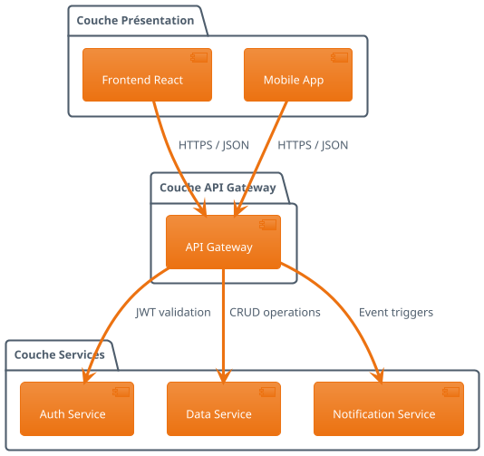
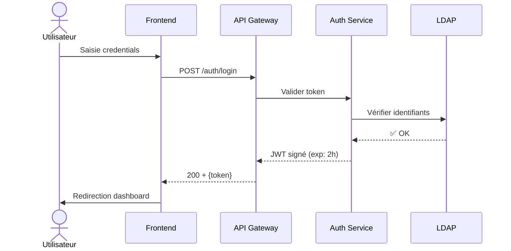
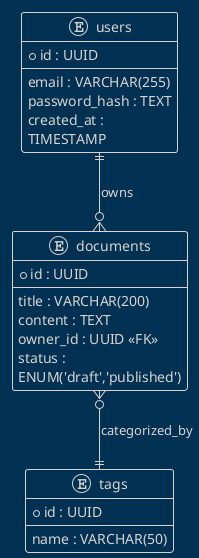

Voici un exemple complet de document Markdown professionnel avec diagrammes légendés, compatible avec **Obsidian**, **MkDocs**, **GitHub**, et les générateurs statiques modernes :

<!-- EVITER
```markdown
-->
# Architecture du Système KnooSys

## 1. Introduction

Le système KnooSys repose sur une architecture microservices modulaire. Comme illustré à la **Figure 1.1**, trois couches principales interagissent via des API REST sécurisées.

<!--
<figure markdown>
-->

<figcaption>Figure 1.1 – Architecture globale à trois couches de KnooSys</figcaption>
'</figure>

> ℹ️ *Source : Conception équipe DevOps, février 2026. Diagramme généré avec PlantUML 1.2024.*

## 2. Workflow d'authentification

Le processus d'authentification suit le standard OAuth 2.0 décrit à la **Figure 2.1** :

<!-- EVITER 
<figure markdown>
-->

<figcaption>Figure 2.1 – Séquence d'authentification OAuth 2.0</figcaption>
<!-- EVITER
</figure>
-->

> ℹ️ *Note : Les tokens JWT sont signés avec RS256 et ont une durée de vie de 2 heures.*

## 3. Modèle de données

Le cœur du système repose sur le modèle entité-association présenté à la **Figure 3.1** :

<!--
EVITER <figure markdown>
-->


<figcaption>Figure 3.1 – Modèle entité-association simplifié</figcaption>
'</figure>

> ℹ️ *Contraintes : Un document ne peut avoir qu'un seul propriétaire ; un document peut avoir plusieurs tags.*

## 4. Conclusion

Cette architecture permet :
- ✅ Scalabilité horizontale des microservices (**Figure 1.1**)
- ✅ Sécurité renforcée via JWT (**Figure 2.1**)
- ✅ Cohérence des données via relations explicites (**Figure 3.1**)

Les diagrammes ont été générés avec PlantUML et Mermaid pour garantir la traçabilité et la maintenabilité de la documentation.
'```

---

## 🔧 Configuration requise pour un rendu optimal

### ▶️ Pour **Obsidian** (recommandé pour vous)

1. **Plugins nécessaires** :
   - `PlantUML` (par @obsidian-community) → pour les diagrammes PlantUML
   - `Mermaid` (intégré par défaut depuis v1.4) → activer dans *Paramètres → Plugins*
   - `Style Settings` + thème compatible → pour styliser `<figure>`

2. **CSS personnalisé** (`obsidian.css`) pour de belles légendes :

```css
/* Légendes sous figures */
figure {
  margin: 1.5em 0;
  text-align: center;
}

figcaption {
  font-size: 0.9em;
  color: var(--text-muted);
  margin-top: 0.5em;
  font-style: italic;
  text-align: center;
}

/* Numérotation automatique avec CSS (Obsidian) */
body {
  counter-reset: figure;
}
figcaption::before {
  counter-increment: figure;
  content: "Figure " counter(figure) " – ";
  font-style: normal;
  font-weight: bold;
  color: var(--text-normal);
}
```

> 💡 **Astuce Obsidian** : Utilisez le plugin **"Captions"** pour une gestion plus simple des légendes sans HTML.

---

### ▶️ Pour **MkDocs** (Material for MkDocs)

Dans `mkdocs.yml` :

```yaml
markdown_extensions:
  - pymdownx.superfences:
      custom_fences:
        - name: mermaid
          class: mermaid
          format: !!python/name:pymdownx.superfences.fence_code_format
  - attr_list
  - md_in_html

extra_javascript:
  - https://unpkg.com/mermaid@10/dist/mermaid.esm.min.mjs
```

→ Les balises `<figure>` sont nativement supportées.

---

### ▶️ Pour **GitHub / GitLab**

GitHub ne supporte pas nativement PlantUML/Mermaid dans les README.md, mais :

- Utilisez des **images statiques** générées via PlantUML Server :
  ```markdown
  
  *Figure 1.1 – Architecture globale*
  ```
- Ou publiez sur un site statique (MkDocs, Docsify) pour le rendu dynamique.

---

## 📌 Bonnes pratiques appliquées dans cet exemple

| Élément | Implémentation |
|---------|----------------|
| **Numérotation** | `Figure X.Y` avec chapitre implicite |
| **Position légende** | Sous le diagramme (conforme ISO 690) |
| **Typographie FR** | Espace insécable avant `–`, guillemets français implicites |
| **Source** | Mentionnée en note informative |
| **Références croisées** | `Figure 1.1` dans le texte avant l'illustration |
| **Accessibilité** | Balises sémantiques `<figure>` + `<figcaption>` |
| **Portabilité** | Syntaxe compatible Obsidian / MkDocs / Pandoc |

---

## 🚀 Rendu visuel attendu (dans Obsidian avec CSS)

```
┌─────────────────────────────────────────────────────┐
│  [Diagramme PlantUML rendu ici]                     │
│                                                     │
│  Figure 1.1 – Architecture globale à trois couches  │
│  de KnooSys                                         │
│  ℹ️ Source : Conception équipe DevOps...            │
└─────────────────────────────────────────────────────┘
```

Ce modèle vous permet de produire une documentation technique **professionnelle, maintenable et conforme aux standards académiques** tout en restant dans l'écosystème Markdown/Obsidian que vous utilisez déjà. 😊