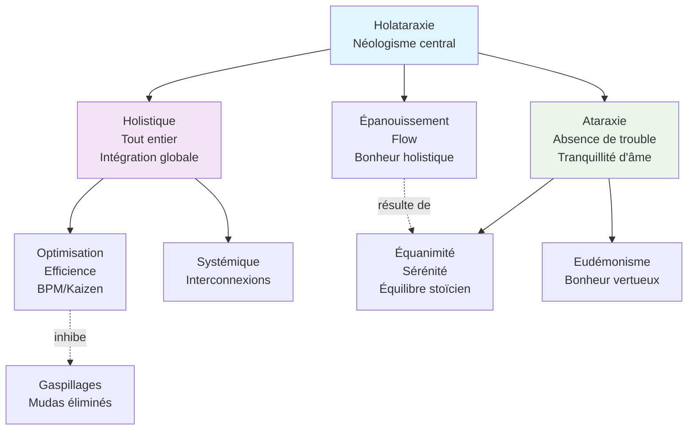

```mermaid
graph TD
    A[Holataraxie<br/>Néologisme central] --> B[Holistique<br/>Tout entier<br/>Intégration globale]
    A --> C[Ataraxie<br/>Absence de trouble<br/>Tranquillité d'âme]
    B --> D[Optimisation<br/>Efficience<br/>BPM/Kaizen]
    B --> E[Systémique<br/>Interconnexions]
    C --> F[Équanimité<br/>Sérénité<br/>Équilibre stoïcien]
    C --> G[Eudémonisme<br/>Bonheur vertueux]
    A --> H[Épanouissement<br/>Flow<br/>Bonheur holistique]
    D -.->|inhibe| I[Gaspillages<br/>Mudas éliminés]
    H -.->|résulte de| F
    style A fill:#e1f5fe
    style B fill:#f3e5f5
    style C fill:#e8f5e8
```    