Voici une version améliorée. Pour respecter votre demande ("les uns à côté des autres" et "ramassé"), j'ai structuré le diagramme en flux horizontal (`LR` - Left to Right), mais chaque niveau (colonne) a son propre contenu empilé verticalement (`TB`).

Les audiences sont placées en bas de chaque colonne, exactement comme sur l'image originale.

```mermaid
flowchart LR
    %% Définition globale du style
    classDef blue fill:#e1f5fe,stroke:#039be5,color:#01579b,stroke-width:2px;
    classDef orange fill:#fff3e0,stroke:#fb8c00,color:#e65100,stroke-width:2px;
    classDef purple fill:#f3e5f5,stroke:#8e24aa,color:#4a148c,stroke-width:2px;
    classDef green fill:#e8f5e9,stroke:#43a047,color:#1b5e20,stroke-width:2px;
    classDef audience fill:#f9f9f9,stroke:#bdbdbd,stroke-width:1px,stroke-dasharray: 3 3;
    classDef arrow font-size:10px,fill:none;

    %% ================= NIVEAU 1 : CONTEXT =================
    subgraph L1 [Level 1 : CONTEXT]
        direction TB
        User((👤 User))
        SysExt["System(s)<br>Internal & External"]
        Sys["System"]
        
        User --- Sys
        SysExt --- Sys

        subgraph Aud1 [AUDIENCE]
            direction LR
            A1_1[Business]
            A1_2[Architect]
            A1_3[Develop]
            A1_4[Designer]
        end
    end

    %% ================= NIVEAU 2 : CONTAINER =================
    subgraph L2 [Level 2 : CONTAINER]
        direction TB
        Micro["Micro services"]
        Mobile["Mobile App"]
        Web["Web App"]
        DB[(Database)]
        Cache[(Cache)]

        subgraph Aud2 [AUDIENCE]
            direction LR
            A2_1[Architect]
            A2_2[Develop]
            A2_3[Designer]
        end
    end

    %% ================= NIVEAU 3 : COMPONENT =================
    subgraph L3 [Level 3 : COMPONENT]
        direction TB
        Cron["Cron"]
        Rest["REST Api"]
        Grpc["gRPC"]
        ETL["ETL / ELT"]
        WH["Warehouse"]
        Comp1["Component"]
        Comp2["Component"]

        subgraph Aud3 [AUDIENCE]
            direction LR
            A3_1[Architect]
            A3_2[Develop]
        end
    end

    %% ================= NIVEAU 4 : CODE =================
    subgraph L4 [Level 4 : CODE]
        direction TB
        GH1["GitHub"]
        GH2["GitHub"]
        GH3["GitHub"]
        UML["UML"]
        ERD["ERD"]
        Config["Config"]

        subgraph Aud4 [AUDIENCE]
            direction LR
            A4_1[Architect]
            A4_2[Develop]
            A4_3[Designer]
        end
    end

    %% ================= LIENS ENTRE NIVEAUX =================
    L1 ==>|"Zoom in 🔎"| L2
    L2 ==>|"Zoom in 🔎"| L3
    L3 ==>|"Zoom in 🔎"| L4

    %% ================= APPLICATION DES STYLES =================
    class L1 blue;
    class L2 orange;
    class L3 purple;
    class L4 green;
    class Aud1,Aud2,Aud3,Aud4 audience;
```

### Ce qui a changé :
1.  **Disposition en colonnes :** Le flux principal est horizontal (`flowchart LR`), ce qui place les 4 niveaux côte à côte.
2.  **Interne vertical :** À l'intérieur de chaque niveau, j'ai forcé `direction TB` (Top to Bottom) pour empiler les éléments techniques au-dessus de l'audience, comme sur le dessin original.
3.  **Audiences visibles :** Chaque niveau contient maintenant un sous-groupe "AUDIENCE" en bas avec les rôles correspondants.
4.  **Couleurs :** J'ai appliqué des codes couleurs correspondant à l'image (Bleu, Orange, Violet, Vert).