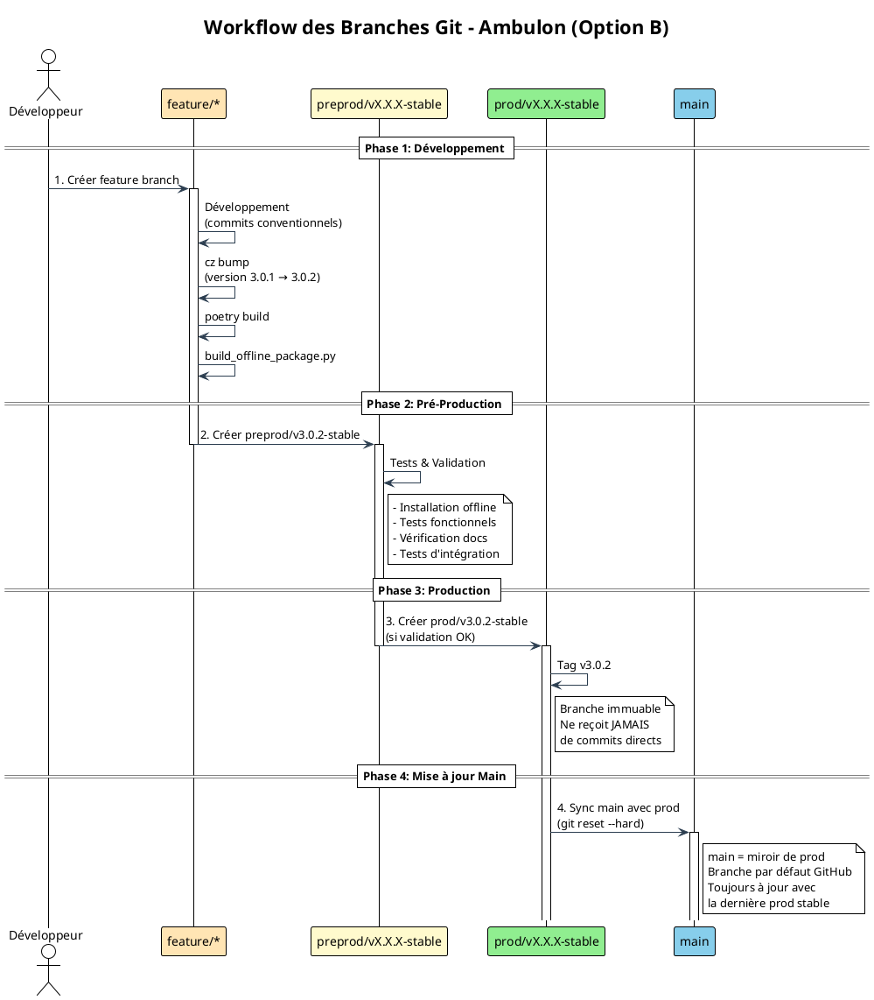
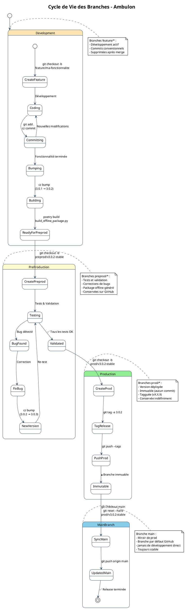
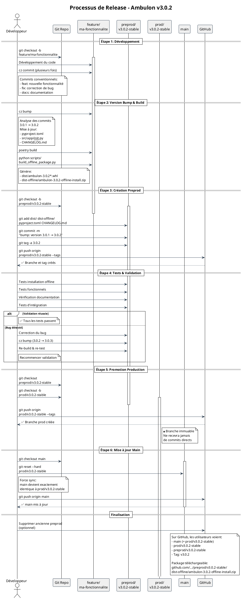
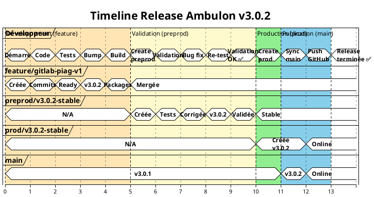
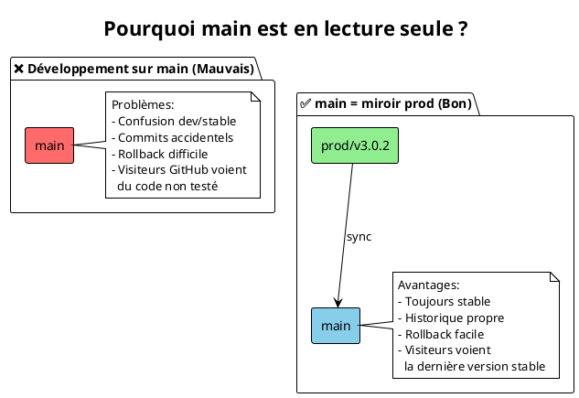
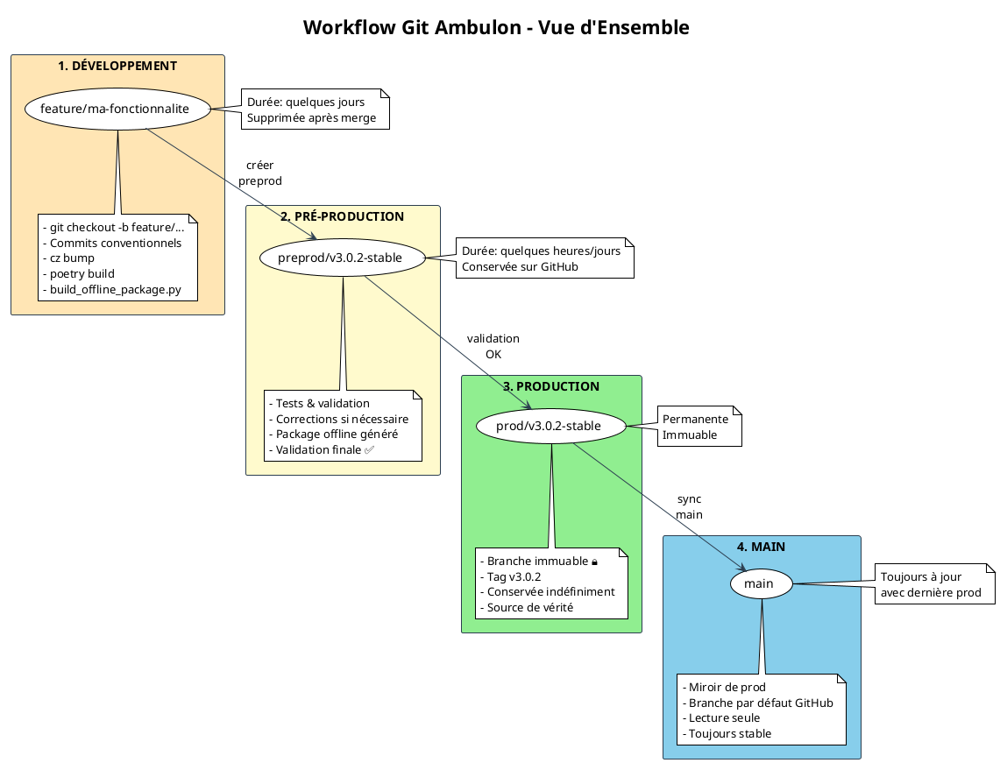

# Workflow Git - Ambulon

Documentation visuelle du workflow de branches et de release avec diagrammes PlantUML.

---

## Architecture des Branches (Option B - Production First)

### Diagramme de l'Architecture Globale



---

## Cycle de Vie Détaillé des Branches

### Diagramme d'État



---

## Processus de Release Complet

### Diagramme de Séquence



---

## Diagramme de Décision - Gestion des Bugs

### Que faire quand un bug est détecté ?

```plantuml
@startuml
!theme plain

skinparam ActivityBackgroundColor #F0F0F0
skinparam ActivityBorderColor #2C3E50
skinparam ArrowColor #2C3E50
skinparam DiamondBackgroundColor #FFFACD
skinparam DiamondBorderColor #2C3E50

title Gestion des Bugs - Arbre de Décision

start

:Bug détecté;

if (Où est le bug ?) then (En développement\nsur feature branch)
  #FFE5B4:Corriger sur\nfeature branch;
  :cz commit (fix: ...);
  :Continuer développement;
  stop

elseif (En preprod) then (oui)
  #FFFACD:Corriger sur\npreprod/vX.X.X-stable;
  :cz commit (fix: ...);
  :cz bump\n(patch: X.X.X → X.X.X+1);
  :poetry build;
  :build_offline_package.py;
  :Re-tester;

  if (Tests OK ?) then (✅ oui)
    :Continuer vers prod;
  else (❌ non)
    :Retour correction;
    backward:Re-fix;
  endif
  stop

elseif (En prod) then (🔒 IMMUTABLE)
  #90EE90:**JAMAIS** corriger\ndirectement sur prod;

  :Créer nouvelle\npreprod/vX.X.X+1-stable;
  note right
    Créer depuis prod/vX.X.X-stable
    et appliquer le fix
  end note

  :Suivre workflow complet;
  :preprod → tests → prod → main;
  stop

else (Sur main)
  #87CEEB:**JAMAIS** corriger\ndirectement sur main;

  :Identifier version prod\ncorrespondante;
  :Créer preprod depuis prod;
  :Appliquer le fix;
  :Workflow complet;
  stop
endif

@enduml
```

---

## Structure des Commits Conventionnels

### Types de Commits et Impact Version

```plantuml
@startuml
!theme plain

skinparam rectangle {
  BackgroundColor<<Major>> #FF6B6B
  BackgroundColor<<Minor>> #4ECDC4
  BackgroundColor<<Patch>> #95E1D3
  BackgroundColor<<NoVersion>> #F0F0F0
  BorderColor #2C3E50
}

title Types de Commits Conventionnels et Versioning

package "Commits qui BUMP la version" {
  rectangle "feat: Nouvelle fonctionnalité" as feat <<Minor>> {
    note bottom
      Version: 3.0.1 → 3.1.0
      Exemple:
      feat(piag): Add RAG search timeout configuration
    end note
  }

  rectangle "fix: Correction de bug" as fix <<Patch>> {
    note bottom
      Version: 3.0.1 → 3.0.2
      Exemple:
      fix(offline): Install deps before ambulon
    end note
  }

  rectangle "feat!: BREAKING CHANGE" as breaking <<Major>> {
    note bottom
      Version: 3.0.1 → 4.0.0
      Exemple:
      feat!: Refactor PIAG API (BREAKING CHANGE)
    end note
  }
}

package "Commits qui NE BUMP PAS la version" {
  rectangle "docs: Documentation" as docs <<NoVersion>>
  rectangle "style: Formatage" as style <<NoVersion>>
  rectangle "refactor: Refactoring" as refactor <<NoVersion>>
  rectangle "test: Tests" as test <<NoVersion>>
  rectangle "chore: Maintenance" as chore <<NoVersion>>
  rectangle "perf: Performance" as perf <<NoVersion>>
}

note right of breaking
  Le "!" après le type
  ou "BREAKING CHANGE:"
  dans le footer indique
  un changement majeur
end note

note right of docs
  Ces commits sont
  inclus dans le CHANGELOG
  mais ne modifient pas
  le numéro de version
end note

@enduml
```

---

## Règles Strictes - Matrice Autorisé/Interdit

### Ce qu'on PEUT et NE PEUT PAS faire

```plantuml
@startuml
!theme plain

skinparam rectangle {
  BackgroundColor<<Allowed>> #90EE90
  BackgroundColor<<Forbidden>> #FF6B6B
  BorderColor #2C3E50
}

title Règles Git - Matrice Autorisé/Interdit

rectangle "✅ AUTORISÉ" <<Allowed>> {
  card "Sur feature/*" {
    - Commiter du code
    - cz commit
    - cz bump
    - poetry build
    - build_offline_package.py
    - Merge dans preprod
  }

  card "Sur preprod/*" {
    - Créer depuis feature
    - Tester et valider
    - Corriger des bugs
    - cz bump (si bug)
    - Rebuild packages
    - Créer prod depuis preprod
  }

  card "Sur prod/*" {
    - Créer depuis preprod validée
    - git tag -a vX.X.X
    - Conserver indéfiniment
    - Sync avec main
  }

  card "Sur main" {
    - git reset --hard prod/vX.X.X
    - git merge --ff-only prod/vX.X.X
    - Lecture seule pour visiteurs
  }
}

rectangle "❌ INTERDIT" <<Forbidden>> {
  card "Sur feature/*" {
    ⛔ Pusher des secrets/tokens
    ⛔ Skip tests avant preprod
    ⛔ Bumper sans commits conventionnels
  }

  card "Sur preprod/*" {
    ⛔ Créer prod sans validation
    ⛔ Pusher avec tests qui échouent
    ⛔ Sauter l'étape de build offline
  }

  card "Sur prod/*" {
    🔒 Commiter directement
    🔒 Modifier après création
    🔒 Supprimer la branche
    🔒 Force push
  }

  card "Sur main" {
    🚫 Développer directement
    🚫 Commiter du code
    🚫 Créer depuis feature
    🚫 MAJ avant création de prod
  }
}

note bottom of "✅ AUTORISÉ"
  Suivre ces règles garantit:
  - Traçabilité complète
  - Versions stables
  - Rollback possible
  - Historique propre
end note

note bottom of "❌ INTERDIT"
  Violer ces règles cause:
  - Confusion dans l'historique
  - Versions instables
  - Difficultés de rollback
  - Perte de traçabilité
end note

@enduml
```

---

## Timeline Exemple - Release 3.0.2

### Chronologie Réelle d'une Release



---

## FAQ - Questions Fréquentes

### Q1: Pourquoi ne pas développer sur `main` ?



### Q2: Que faire si un bug est en production ?

```plantuml
@startuml
!theme plain

title Hotfix en Production

start

:Bug critique\ndétecté en prod;

:Identifier version\nprod/v3.0.2-stable;

:git checkout\nprod/v3.0.2-stable;

:git checkout -b\npreprod/v3.0.3-stable;

:Corriger le bug;

:cz commit (fix: ...);

:cz bump\n(3.0.2 → 3.0.3);

:poetry build;

:build_offline_package.py;

:Tests complets;

if (Tests OK ?) then (✅ oui)
  :git checkout -b\nprod/v3.0.3-stable;
  :git push --tags;
  :sync main;
  :✅ Hotfix déployé;
  stop
else (❌ non)
  :Continuer corrections;
  backward:Re-fix;
endif

note right
  JAMAIS corriger
  directement sur prod !

  Toujours passer par:
  preprod → validation
  → prod → main
end note

@enduml
```

---

## Résumé Visuel

### Workflow Complet en un Coup d'Œil



---

## Checklist Avant Release

### Points de Contrôle Obligatoires

```plantuml
@startuml
!theme plain

title Checklist Release - Points de Contrôle

skinparam activityBackgroundColor #F0F0F0
skinparam activityBorderColor #2C3E50
skinparam activityDiamondBackgroundColor #FFFACD

|Développement|
start
:Tous les commits\nsont conventionnels ?;
note right: cz commit obligatoire

:Tests unitaires\npassent ?;

:cz bump exécuté ?;
note right: Version bumpée correctement

:poetry build\nréussi ?;

:build_offline_package.py\nréussi ?;
note right: Package de 80MB généré

|Preprod|
:Branche preprod créée ?;

:Installation offline\ntestée ?;
note right
  Test critique:
  Installation sans Internet
  dans environnement vierge
end note

:Toutes les fonctionnalités\ntestées ?;

:Documentation\nà jour ?;

if (Bugs détectés ?) then (oui)
  :Corriger sur preprod;
  :cz bump (patch);
  :Rebuild;
  backward:Re-tester;
else (non)
  :Validation preprod ✅;
endif

|Production|
:Branche prod créée\ndepuis preprod ?;

:Tag vX.X.X créé ?;

:Branche prod\npushée sur GitHub ?;

|Main|
:main synchronisé\navec prod ?;

:Vérification\nGitHub ?;
note right
  - Tag visible
  - Package téléchargeable
  - README à jour
end note

stop

@enduml
```

---

## Génération des Diagrammes

Pour générer les images PNG/SVG des diagrammes PlantUML :

```bash
# Installer PlantUML
sudo apt-get install plantuml  # Linux
brew install plantuml          # macOS

# Générer tous les diagrammes
plantuml doc/git-workflow.md

# Ou utiliser le service en ligne
# https://www.plantuml.com/plantuml/uml/
```

---

**Auteur**: Hervé Marchal <herve.marchal@hotmail.fr>
**Version**: 3.0.2
**Date**: 2026-01-31
**Licence**: MIT
