# Guidelines de Développement Ambulon - Version Illustrée

Documentation complète avec diagrammes PlantUML de toutes les pratiques et patterns du projet Ambulon.

---

## Table des Matières

1. [Architecture CLI - Interdiction Typer](#architecture-cli)
2. [Pattern argparse Obligatoire](#pattern-argparse)
3. [Workflow Git et Branches](#workflow-git)
4. [Processus de Release](#processus-release)
5. [Configuration Hiérarchique](#configuration)
6. [Pattern de Modules de Conversion](#modules-conversion)
7. [Gestion des Secrets](#securite)
8. [Structure du Projet](#structure)
9. [Workflow Complet de Développement](#workflow-dev)

---

<a name="architecture-cli"></a>
## 1. Architecture CLI - Interdiction Typer

### Pourquoi Typer est Banni

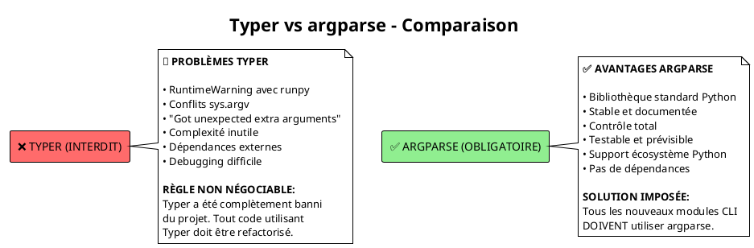
<figcaption>Figure 1.1 – Comparaison CLI : Typer vs Argparse</figcaption>

---

<a name="pattern-argparse"></a>
## 2. Pattern argparse Obligatoire

### Structure d'un Module CLI

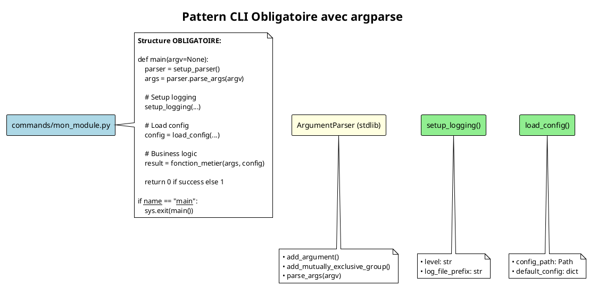
<figcaption>Figure 2.1 – Pattern argparse obligatoire</figcaption>

### Flux d'Exécution CLI

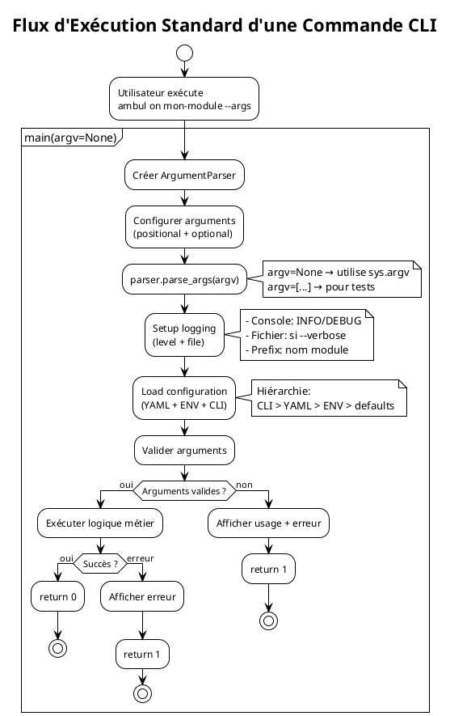
<figcaption>Figure 2.2 – Flux d'exécution CLI standard</figcaption>

---

<a name="workflow-git"></a>
## 3. Workflow Git et Branches

### Architecture des Branches

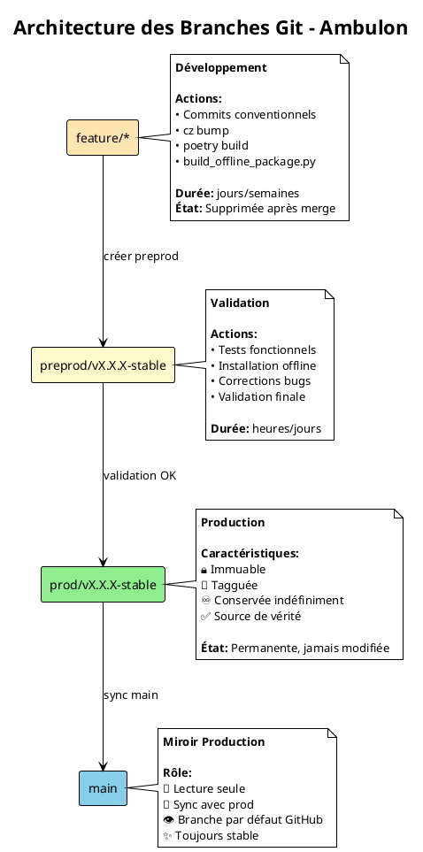
<figcaption>Figure 3.1 – Architecture des branches Git</figcaption>

Voir [doc/git-workflow.md](git-workflow.md) pour les diagrammes détaillés du workflow Git.

---

<a name="processus-release"></a>
## 4. Processus de Release

### Workflow SemVer et Commitizen

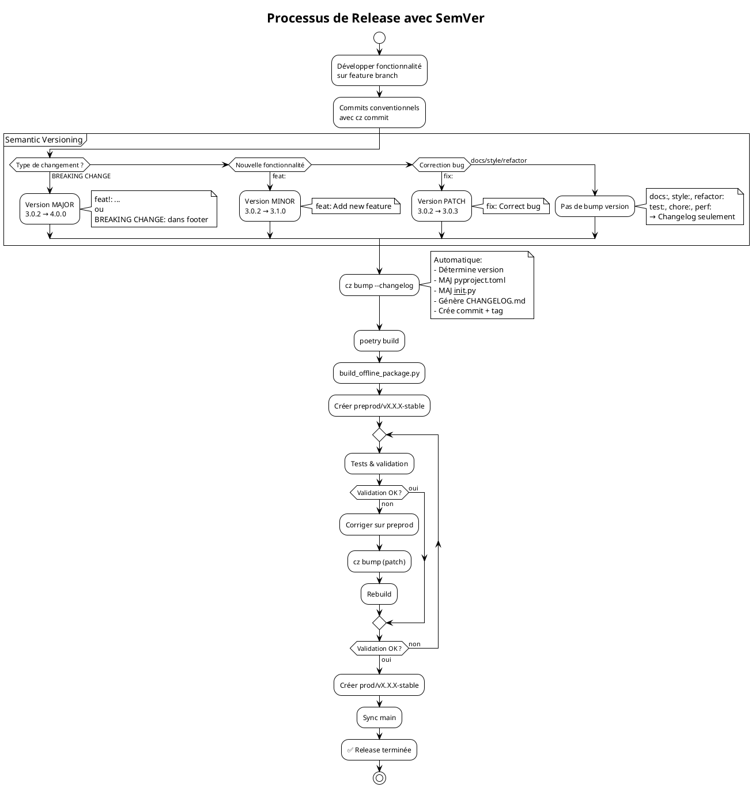
<figcaption>Figure 4.1 – Processus de release avec SemVer</figcaption>

### Types de Commits et Impact

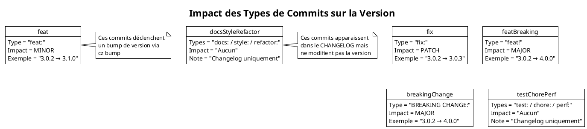
<figcaption>Figure 4.2 – Impact des types de commits</figcaption>

---

<a name="configuration"></a>
## 5. Configuration Hiérarchique

### Hiérarchie de Configuration (CLI > YAML > ENV > Defaults)

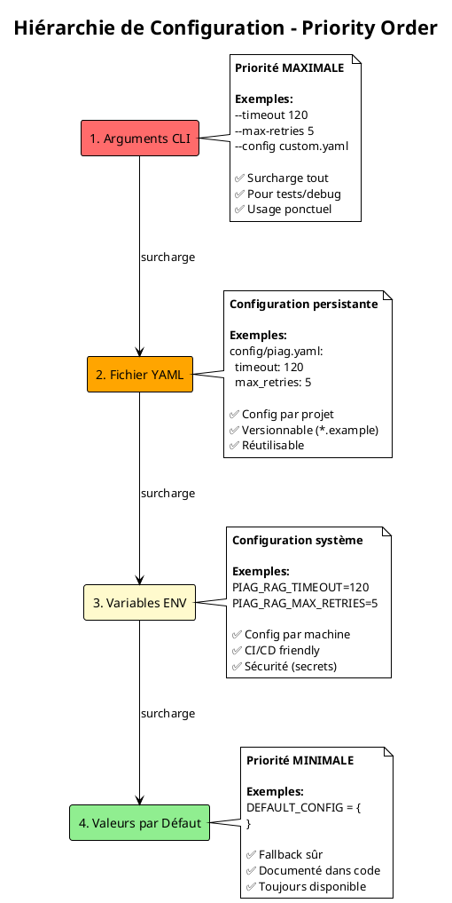
<figcaption>Figure 5.1 – Hiérarchie de configuration</figcaption>

### Flux de Résolution de Configuration

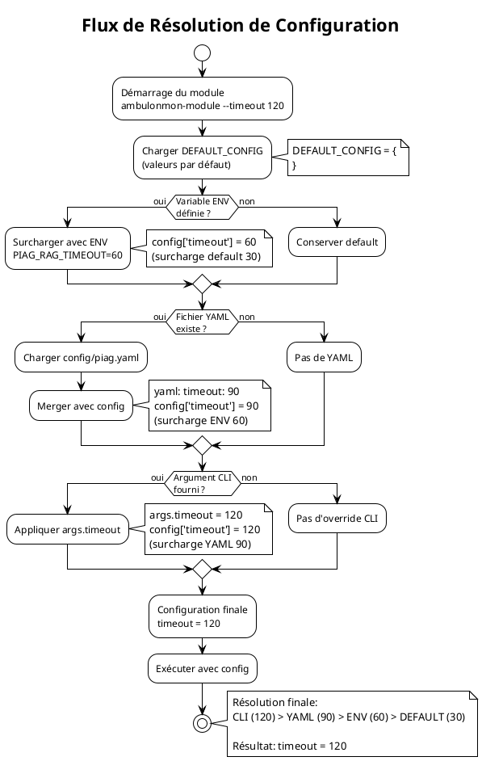
<figcaption>Figure 5.2 – Flux de résolution de configuration</figcaption>

---

<a name="modules-conversion"></a>
## 6. Pattern de Modules de Conversion

### Architecture Standard des Modules

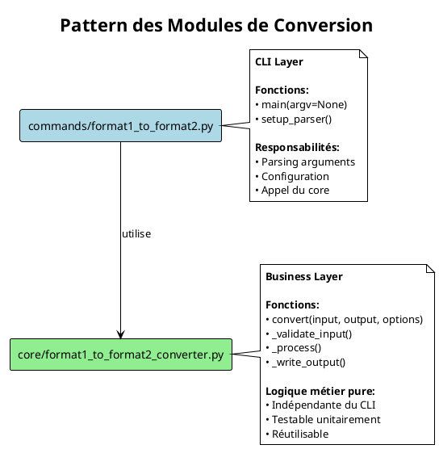
<figcaption>Figure 6.1 – Pattern des modules de conversion</figcaption>

### Naming Conventions

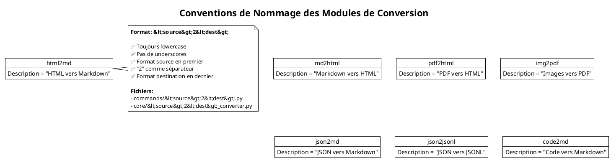
<figcaption>Figure 6.2 – Conventions de nommage</figcaption>

### Interface CLI Unifiée

```plantuml
@startuml
!theme plain

title Interface CLI Standard pour Conversions

start

:ambulon <source>2<dest>\n<input> [options];

partition "Arguments Positionnels" {
  :input_file\n(obligatoire);
  note right
    Fichier ou dossier source
    Peut être omis pour stdin
  end note
}

partition "Options Communes" {
  :-o, --output\n(optionnel);
  note right
    Fichier de sortie
    Si omis: génération auto
    input.ext → input.<dest>.ext
  end note

  :--verbose, -v\n(optionnel);
  note right
    Active logging DEBUG
  end note
}

partition "Options Spécifiques au Module" {
  :Options propres\nau type de conversion;
  note right
    Exemples:
    --quality (pdf)
    --lang (ocr)
    --format (code2md)
  end note
}

:Exécuter conversion;

if (Succès ?) then (oui)
  :Afficher chemin de sortie;
  :return 0;
  stop
else (erreur)
  :Afficher erreur;
  :return 1;
  stop
endif

@enduml
```
<figcaption>Figure 6.3 – Interface CLI standard</figcaption>

---

<a name="securite"></a>
## 7. Gestion des Secrets

### Règles de Sécurité Strictes

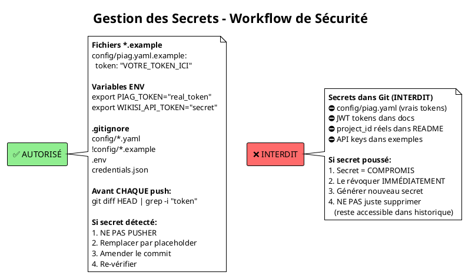
<figcaption>Figure 7.1 – Workflow de gestion des secrets</figcaption>

### Checklist Pré-Push

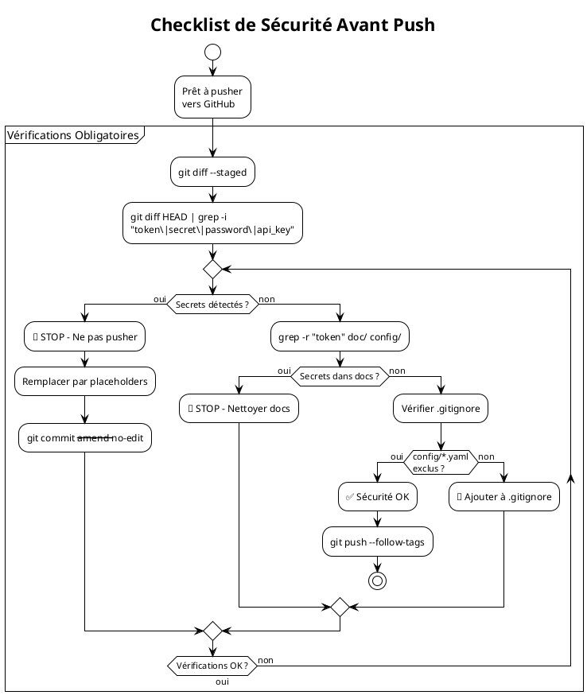
<figcaption>Figure 7.2 – Checklist de sécurité pré-push</figcaption>

---

<a name="structure"></a>
## 8. Structure du Projet

### Arborescence Complète

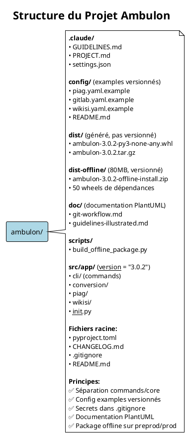
<figcaption>Figure 8.1 – Structure du projet Ambulon</figcaption>

### Séparation Commands / Core

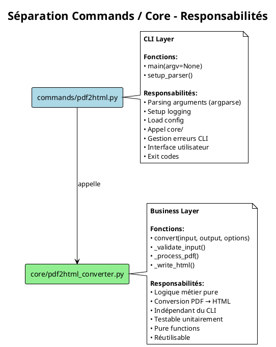
<figcaption>Figure 8.2 – Séparation Commands/Core</figcaption>

---

<a name="workflow-dev"></a>
## 9. Workflow Complet de Développement

### Cycle de Vie d'une Fonctionnalité

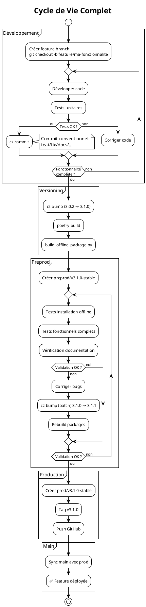
<figcaption>Figure 9.1 – Cycle de vie d'une fonctionnalité</figcaption>

### Matrice de Décision - Quel Type de Commit ?

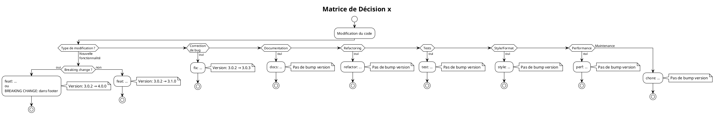
<figcaption>Figure 9.2 – Matrice de décision des commits</figcaption>

---

## Génération des Diagrammes

### Avec PlantUML

```bash
# Installation
sudo apt-get install plantuml  # Linux
brew install plantuml          # macOS
choco install plantuml        # Windows

# Générer tous les diagrammes depuis ce fichier
plantuml doc/guidelines-illustrated.md

# Générer en SVG (meilleure qualité)
plantuml -tsvg doc/guidelines-illustrated.md

# Générer en PNG
plantuml -tpng doc/guidelines-illustrated.md
```

### Avec le service en ligne

1. Copier un bloc PlantUML depuis ce fichier
2. Aller sur https://www.plantuml.com/plantuml/uml/
3. Coller le code
4. Télécharger le diagramme généré

---

## Résumé des Principes Clés

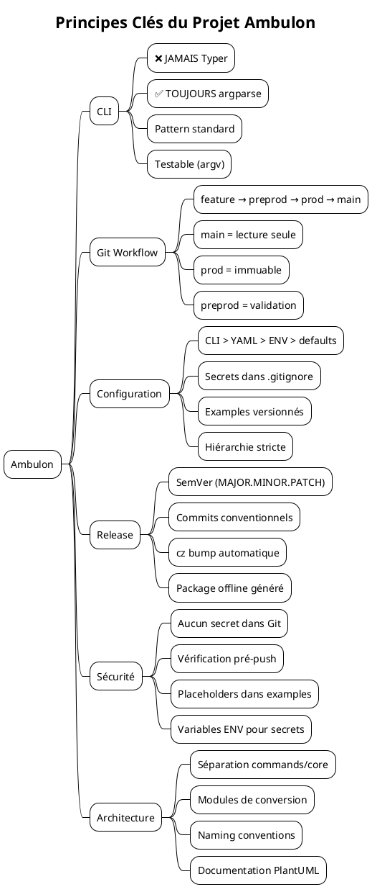
<figcaption>Figure 10.1 – Résumé des principes clés</figcaption>

---

**Auteur**: Hervé Marchal <herve.marchal@hotmail.fr>
**Version**: 3.0.2
**Date**: 2026-01-31
**Licence**: MIT

---

## Index des Diagrammes

1. **Architecture CLI**
   - Typer vs argparse
   - Pattern CLI obligatoire
   - Flux d'exécution CLI

2. **Workflow Git**
   - Architecture des branches
   - Cycle de vie des branches
   - Processus de release
   - Gestion des bugs
   - Timeline exemple

3. **Versioning**
   - SemVer workflow
   - Types de commits
   - Matrice de décision commits

4. **Configuration**
   - Hiérarchie de configuration
   - Flux de résolution

5. **Modules de Conversion**
   - Architecture standard
   - Naming conventions
   - Interface CLI unifiée

6. **Sécurité**
   - Règles secrets
   - Checklist pré-push

7. **Structure Projet**
   - Arborescence complète
   - Séparation commands/core

8. **Workflow Développement**
   - Cycle de vie feature
   - Matrice de décision

9. **Résumé**
   - Mindmap principes clés
