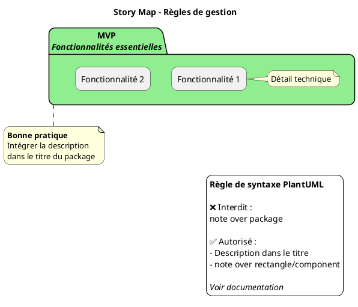
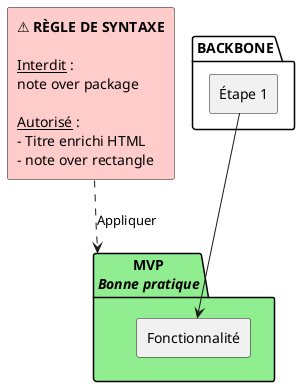

Pour exprimer cette **règle de gestion** concernant l'utilisation des notes en PlantUML, voici plusieurs approches selon le contexte :

## 1. **Dans la documentation Markdown** (Recommandé)

```markdown
### ⚠️ Règles de syntaxe PlantUML - Notes

**Règle** : N'utilisez pas `note over` sur des éléments de type `package`.

**Problème** : 
```plantuml
package "MVP" as mvp { ... }
note over mvp : Description  ❌ ERREUR
```

**Solution** : Intégrez la description directement dans le titre du package :
```plantuml
package "<b>MVP</b>\n<i>Description</i>" as mvp { ... }  ✅ OK
```

**Exception** : Les notes fonctionnent sur les `rectangle`, `component`, `usecase`, etc.
```plantuml
rectangle "Fonctionnalité" as f1
note over f1 : Description  ✅ OK
```
```

---

## 2. **Dans le diagramme PlantUML lui-même** (Auto-documentation)



---

## 3. **Comme commentaire dans le code PlantUML**

```plantuml
@startuml
' ============================================================================
' RÈGLE DE GESTION : Utilisation des notes PlantUML
' ============================================================================
' 
' ❌ NE PAS FAIRE :
'   package "MVP" as mvp { ... }
'   note over mvp : Description  -> ERREUR DE SYNTAXE
'
' ✅ FAIRE :
'   1. Intégrer la description dans le titre :
'      package "<b>MVP</b>\n<i>Description</i>" as mvp { ... }
'
'   2. OU utiliser des notes sur les rectangles uniquement :
'      rectangle "Fonctionnalité" as f1
'      note over f1 : Description  -> FONCTIONNE
'
' ============================================================================

package "<b>MVP</b>\n<i>Fonctionnalités essentielles</i>" as mvp #LightGreen {
  rectangle "Fonctionnalité 1" as f1
  rectangle "Fonctionnalité 2" as f2
}

@enduml
```



---

## 4. **Comme note d'avertissement dans le diagramme**



---

## 5. **Comme ADR (Architecture Decision Record)**

Crée un fichier séparé `ADR-001-plantuml-notes.md` :

```markdown
# ADR-001 : Utilisation des notes en PlantUML

## Contexte
Lors de la création de diagrammes Story Map, nous avons rencontré des erreurs de syntaxe avec les notes sur les packages.

## Décision
**Il est interdit d'utiliser `note over` sur des éléments `package`.**

## Raisons
- PlantUML ne supporte pas les notes sur les packages
- Cela génère des erreurs de compilation
- Alternative disponible et plus élégante

## Alternative retenue
Intégrer les descriptions directement dans les titres des packages en utilisant :
- Balises HTML (`<b>`, `<i>`, `<u>`)
- Sauts de ligne `\n`
- Exemple : `package "<b>MVP</b>\n<i>Description</i>" as mvp`

## Exceptions
Les notes fonctionnent sur :
- ✅ `rectangle`
- ✅ `component`
- ✅ `usecase`
- ✅ `actor`
- ❌ `package`

## Statut
Accepté - À appliquer dans tous les diagrammes PlantUML du projet
```

---

## 📋 **Récapitulatif visuel**

```
┌─────────────────────────────────────────────────────────────┐
│                    RÈGLE DE GESTION                         │
│                  Notes PlantUML                             │
├─────────────────────────────────────────────────────────────┤
│                                                             │
│  ❌ INTERDIT :                                              │
│     package "MVP" as mvp { ... }                            │
│     note over mvp : Description  ← ERREUR                   │
│                                                             │
│  ✅ AUTORISÉ :                                              │
│     1. package "<b>MVP</b>\n<i>Desc</i>" as mvp { ... }     │
│                                                             │
│     2. rectangle "F1" as f1                                 │
│        note over f1 : Description  ← OK                     │
│                                                             │
└─────────────────────────────────────────────────────────────┘
```

---

### 🎯 **Recommandation**

Pour ton guide Story Mapping, je te conseille d'utiliser **une combinaison** :

1. **Commentaires dans le code** (pour les développeurs)
2. **Section Markdown dédiée** (pour la documentation)
3. **Légende dans le diagramme** (pour les utilisateurs finaux)

Cela couvre tous les cas d'usage et tous les publics !