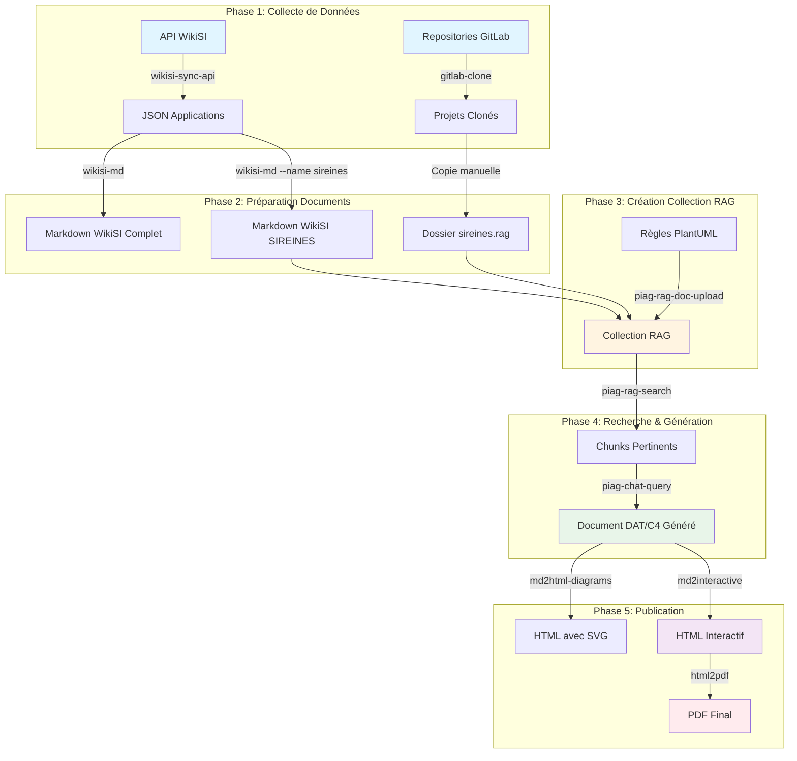
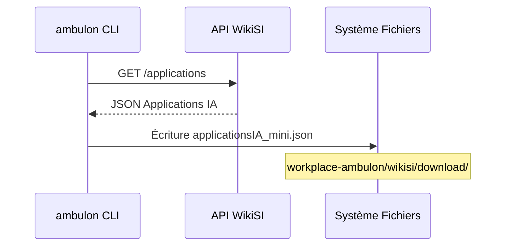
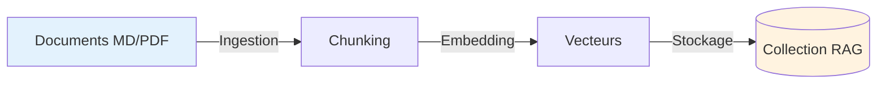
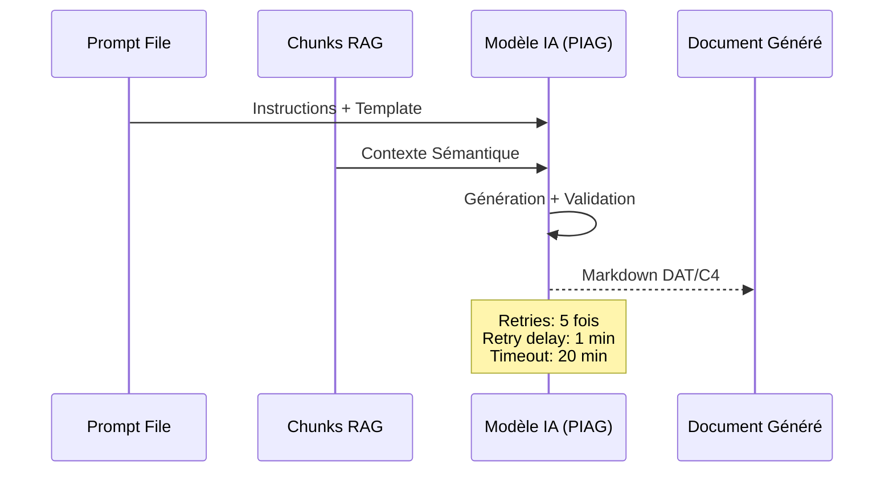
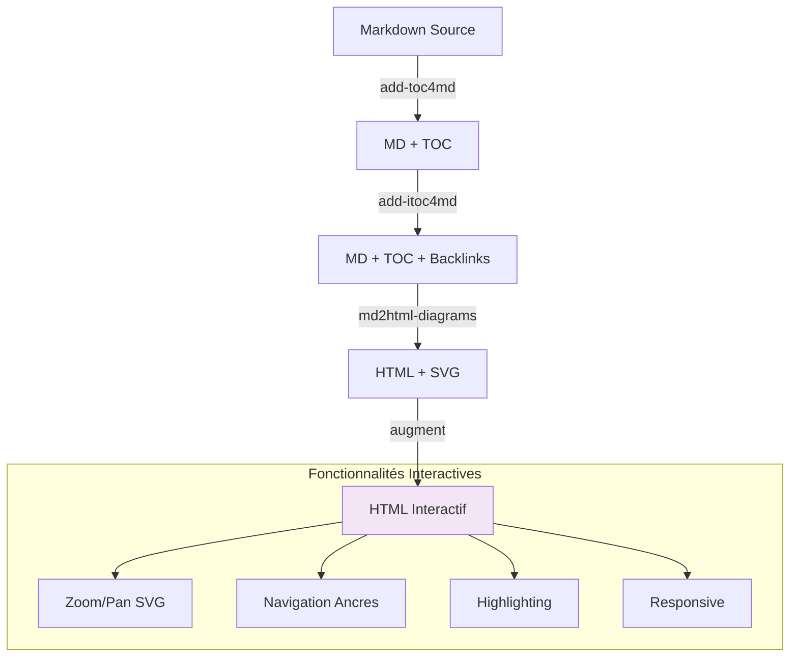
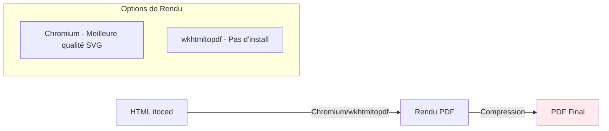
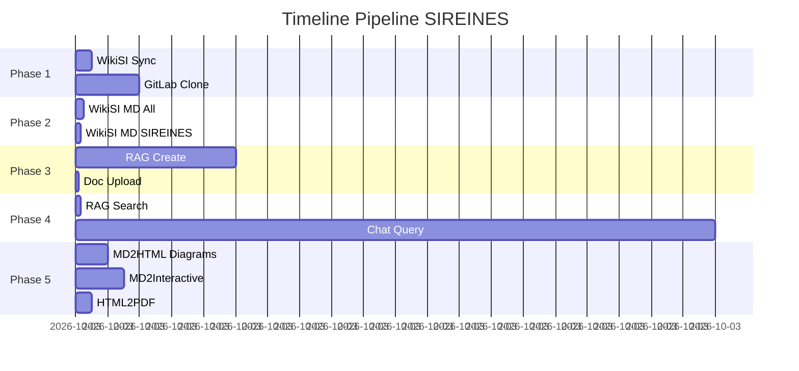

# Automatisation Pipeline SIREINES - Documentation Bout en Bout

## Vue d'ensemble

Ce document décrit le pipeline complet d'automatisation pour la génération de documentation technique SIREINES enrichie par RAG (Retrieval-Augmented Generation). Le processus combine la récupération de données WikiSI, le traitement de repositories GitLab, l'utilisation de l'IA générative avec contexte sémantique, et la production de documents HTML interactifs.

## Architecture Globale du Pipeline



## Workflow Détaillé

### Phase 1 : Collecte de Données

#### 1.1 Synchronisation WikiSI

Récupère les données du parc applicatif depuis l'API WikiSI.



**Commande :**
```bash
ambulon wikisi-sync-api --output workplace-ambulon\wikisi\download
```

**Sortie :**
- `workplace-ambulon/wikisi/download/applicationsIA_mini.json`

---

#### 1.2 Clone des Repositories GitLab

Clone les projets GitLab configurés (SIREINES DAT, composants, etc.).

```bash
ambulon gitlab-clone
```

**Sortie :**
- Repositories clonés dans le workspace configuré

---

### Phase 2 : Préparation des Documents

#### 2.1 Conversion WikiSI Complète

Convertit l'ensemble des applications en Markdown pour analyse globale.

```bash
ambulon wikisi-md ^
  workplace-ambulon/wikisi/download/applicationsIA_mini.json ^
  -o workplace-ambulon/wikisi/download/applications_all_mini.md
```

**Sortie :**
- `workplace-ambulon/wikisi/download/applications_all_mini.md`

---

#### 2.2 Extraction SIREINES

Filtre uniquement les données SIREINES pour le RAG.

```bash
ambulon wikisi-md ^
  workplace-ambulon/wikisi/download/applicationsIA_mini.json ^
  --name sireines ^
  -o workplace-ambulon/gitlab/sireines.rag/sireines_wikisi.md
```

**Sortie :**
- `workplace-ambulon/gitlab/sireines.rag/sireines_wikisi.md`

---

### Phase 3 : Création Collection RAG

#### 3.1 Initialisation de la Collection

Crée une collection RAG vectorielle avec l'ensemble des documents SIREINES.



**Commande :**
```bash
ambulon piag-rag-create ^
  --collection-name PNM3_SIREINES ^
  --description "Documentation complète SIREINES : DAT, C4, Composants, Wiki" ^
  --directory workplace-ambulon/gitlab/sireines.rag ^
  --extensions md,pdf
```

**Actions :**
1. Scan du répertoire `workplace-ambulon/gitlab/sireines.rag`
2. Extraction des fichiers `.md` et `.pdf`
3. Découpage en chunks sémantiques
4. Génération d'embeddings vectoriels
5. Indexation dans la collection `PNM3_SIREINES`

---

#### 3.2 Ajout de Documents Complémentaires

Enrichit la collection avec des règles métier (PlantUML, normes, etc.).

```bash
ambulon piag-rag-doc-upload ^
  --collection-name "PNM3_SIREINES" ^
  --file workplace-ambulon\piag-rag\REGLES_PLANTUML.md
```

---

#### 3.3 Vérification de la Collection

Liste les documents indexés pour validation.

```bash
ambulon piag-rag-doc-list ^
  --collection-name "PNM3_SIREINES"
```

---

### Phase 4 : Recherche Sémantique & Génération

#### 4.1 Recherche de Chunks Pertinents

Interroge la collection RAG pour extraire les passages pertinents.


**Commande :**
```bash
ambulon piag-rag-search ^
  --collection-name PNM3_SIREINES ^
  --query "DAT, Dossier d'Architecture Technique, Composants, Scénario, Environnements, Infrastructure" ^
  --top-k 10 ^
  --timeout 10s ^
  -o workplace-ambulon/piag-rag/chunks/chunk.sireines.dat.json
```

**Paramètres :**
- `--top-k 10` : Retourne les 10 chunks les plus pertinents
- `--timeout 10s` : Limite de temps pour la recherche
- Sortie : `chunk.sireines.dat.json` (chunks avec scores de similarité)

---

#### 4.2 Génération avec Contexte RAG

Génère le document technique en utilisant les chunks comme contexte.



**Commande :**
```bash
ambulon piag-chat-query ^
  --question-file workplace-ambulon/piag-chat/prompts/prompt.dat_c4model.md ^
  --chunks workplace-ambulon/piag-rag/chunks/chunk.sireines.dat.json ^
  --timeout 20m ^
  --max-retries 5 ^
  --retry-delay 1m ^
  -o workplace-ambulon/piag-chat/responses/response.sireines.dat_c4model.md
```

**Mécanismes de Résilience :**
- **Timeout** : 20 minutes max par requête
- **Retries** : 5 tentatives en cas d'échec
- **Retry Delay** : Attente de 1 minute entre tentatives
- **Streaming** : Affichage progressif de la réponse

**Sortie :**
- `response.sireines.dat_c4model.md` : Document Markdown avec diagrammes PlantUML/Mermaid

---

### Phase 5 : Publication de Documents Autoporteurs

#### 5.1 Génération HTML avec Diagrammes SVG

Convertit le Markdown en HTML standalone avec diagrammes vectoriels.


**Commande :**
```bash
ambulon md2html-diagrams "applications/sireines.rag.archive/sireines.dat_c4model.md" ^
   -o "docs-autoporteurs/sireines.dat_c4model.html" ^
   --toc-backlinks ^
   --verbose
```

**Fonctionnalités :**
- Conversion PlantUML/Mermaid/Graphviz → SVG
- Génération table des matières (TOC)
- Liens retour bidirectionnels (↑)
- CSS intégré pour styling professionnel

---

#### 5.2 Génération HTML Interactif

Produit un document HTML avec navigation avancée (zoom, pan, ancres).



**Commande :**
```bash
ambulon md2interactive "applications/sireines.rag.archive/sireines.dat_c4model.md" ^
    -o "docs-autoporteurs" ^
    --verbose
```

**Pipeline Interne :**
1. **Ajout TOC** : Table des matières générée automatiquement
2. **Ajout iTOC** : Liens retour (↑) après chaque titre
3. **Conversion HTML** : Markdown → HTML + SVG diagrammes
4. **Augmentation** : JavaScript pour interactivité (zoom, pan, navigation)

**Sortie :**
- `sireines.dat_c4model-interactive.html` : Document HTML autoporteur interactif

---

#### 5.3 Génération PDF à partir du HTML itoced

Convertit le HTML avec table des matières et backlinks en document PDF imprimable.



**Commande avec Chromium (recommandé) :**
```bash
ambulon html2pdf "docs-autoporteurs/sireines.dat_c4model-itoced.html" ^
   -o "docs-autoporteurs/sireines.dat_c4model.pdf" ^
   -p portrait ^
   -m chromium ^
   --verbose
```

**Commande avec wkhtmltopdf (sans installation) :**
```bash
ambulon html2pdf "docs-autoporteurs/sireines.dat_c4model-itoced.html" ^
   -o "docs-autoporteurs/sireines.dat_c4model.pdf" ^
   -p portrait ^
   -m wkhtmltopdf ^
   --verbose
```

**Workflow Recommandé pour PDF Optimal :**

Pour obtenir un PDF de qualité optimale, générez d'abord le HTML avec l'orientation souhaitée, puis convertissez en PDF :

```bash
# 1. Générer HTML avec orientation portrait
ambulon md2html-diagrams "doc/sireines.automation.md" ^
   -o "docs-autoporteurs/sireines.automation.html" ^
   -p portrait ^
   --toc-backlinks ^
   --verbose

# 2. Convertir en PDF avec même orientation
ambulon html2pdf "docs-autoporteurs/sireines.automation.html" ^
   -o "docs-autoporteurs/sireines.automation.pdf" ^
   -p portrait ^
   -m chromium ^
   --verbose
```

**Options d'orientation :**
- **`portrait`** : Format vertical A4 (700px max width pour SVG)
- **`landscape`** : Format horizontal A4 (900px max width pour SVG)

**Installation Chromium (première utilisation) :**
```bash
poetry run playwright install chromium
# ou
ambulon html2pdf --install-chromium
```

**Sortie :**
- `sireines.dat_c4model.pdf` : Document PDF avec TOC, backlinks et diagrammes SVG haute qualité

---

## Récapitulatif des Commandes

```bash
# ========================================
# PHASE 1 : COLLECTE
# ========================================

# Synchroniser WikiSI
ambulon wikisi-sync-api --output workplace-ambulon\wikisi\download

# Cloner repositories GitLab
ambulon gitlab-clone

# ========================================
# PHASE 2 : PRÉPARATION
# ========================================

# Convertir WikiSI complet
ambulon wikisi-md ^
  workplace-ambulon/wikisi/download/applicationsIA_mini.json ^
  -o workplace-ambulon/wikisi/download/applications_all_mini.md

# Filtrer SIREINES
ambulon wikisi-md ^
  workplace-ambulon/wikisi/download/applicationsIA_mini.json ^
  --name sireines ^
  -o workplace-ambulon/gitlab/sireines.rag/sireines_wikisi.md

# ========================================
# PHASE 3 : CRÉATION RAG
# ========================================

# Créer collection RAG
ambulon piag-rag-create ^
  --collection-name PNM3_SIREINES ^
  --description "Documentation complète SIREINES : DAT, C4, Composants, Wiki" ^
  --directory workplace-ambulon/gitlab/sireines.rag ^
  --extensions md,pdf

# Ajouter règles complémentaires
ambulon piag-rag-doc-upload ^
  --collection-name "PNM3_SIREINES" ^
  --file workplace-ambulon\piag-rag\REGLES_PLANTUML.md

# Vérifier collection
ambulon piag-rag-doc-list ^
  --collection-name "PNM3_SIREINES"

# ========================================
# PHASE 4 : RECHERCHE & GÉNÉRATION
# ========================================

# Recherche sémantique
ambulon piag-rag-search ^
  --collection-name PNM3_SIREINES ^
  --query "DAT, Dossier d'Architecture Technique, Composants, Scénario, Environnements, Infrastructure" ^
  --top-k 10 ^
  --timeout 10s ^
  -o workplace-ambulon/piag-rag/chunks/chunk.sireines.dat.json

# Génération avec RAG
ambulon piag-chat-query ^
  --question-file workplace-ambulon/piag-chat/prompts/prompt.dat_c4model.md ^
  --chunks workplace-ambulon/piag-rag/chunks/chunk.sireines.dat.json ^
  --timeout 20m ^
  --max-retries 5 ^
  --retry-delay 1m ^
  -o workplace-ambulon/piag-chat/responses/response.sireines.dat_c4model.md

# ========================================
# PHASE 5 : PUBLICATION
# ========================================

# HTML avec diagrammes SVG
ambulon md2html-diagrams "applications/sireines.rag.archive/sireines.dat_c4model.md" ^
   -o "docs-autoporteurs/sireines.dat_c4model.html" ^
   --toc-backlinks ^
   --verbose

# HTML interactif (zoom/pan)
ambulon md2interactive "applications/sireines.rag.archive/sireines.dat_c4model.md" ^
    -o "docs-autoporteurs" ^
    --verbose

# PDF à partir du HTML itoced (meilleure qualité)
ambulon html2pdf "docs-autoporteurs/sireines.dat_c4model-itoced.html" ^
   -o "docs-autoporteurs/sireines.dat_c4model.pdf" ^
   -p portrait ^
   -m chromium ^
   --verbose
```

## Fichiers Produits

### Arborescence Complète

```
workplace-ambulon/
├── wikisi/
│   └── download/
│       ├── applicationsIA_mini.json          # Données brutes API WikiSI
│       └── applications_all_mini.md          # Toutes applications MD
│
├── gitlab/
│   └── sireines.rag/
│       ├── sireines_wikisi.md                # WikiSI filtré SIREINES
│       ├── sireines.dat.md                   # DAT depuis GitLab
│       └── ...                               # Autres docs techniques
│
├── piag-rag/
│   ├── chunks/
│   │   └── chunk.sireines.dat.json           # Chunks pertinents (Top-10)
│   └── REGLES_PLANTUML.md                    # Règles métier
│
└── piag-chat/
    ├── prompts/
    │   └── prompt.dat_c4model.md             # Template de génération
    └── responses/
        └── response.sireines.dat_c4model.md  # Document généré

docs-autoporteurs/
├── sireines.dat_c4model.html                 # HTML standard + SVG
├── sireines.dat_c4model-toced.md             # MD avec TOC
├── sireines.dat_c4model-itoced.md            # MD avec TOC + backlinks
├── sireines.dat_c4model-itoced.html          # HTML avec TOC + backlinks
├── sireines.dat_c4model-interactive.html     # HTML interactif
└── sireines.dat_c4model.pdf                  # PDF final (depuis itoced.html)
```

## Métriques & Performance

### Temps d'Exécution Estimé



**Total estimé** : ~30-36 minutes (dépend de la taille des docs et latence API PIAG)

---

## Troubleshooting

### Problèmes Courants

#### 1. Timeout PIAG Chat Query

**Symptôme** : `Error: Request timeout after 20m`

**Solutions** :
- Augmenter `--timeout 30m`
- Réduire la taille du prompt
- Vérifier la disponibilité de l'API PIAG

---

#### 2. Échec Conversion PlantUML

**Symptôme** : `Error converting PlantUML diagram`

**Solutions** :
```bash
# Utiliser méthode JAR au lieu de Kroki
ambulon md2html-diagrams file.md --plantuml-method jar

# Ou spécifier le chemin du JAR
ambulon md2html-diagrams file.md --plantuml-jar /path/to/plantuml.jar
```

---

#### 3. Collection RAG Vide

**Symptôme** : `No documents found in collection`

**Solutions** :
```bash
# Vérifier extensions supportées
ambulon piag-rag-create --extensions md,pdf,txt

# Lister les documents
ambulon piag-rag-doc-list --collection-name PNM3_SIREINES
```

---

## Améliorations Futures

### Automatisation Complète

Créer un script Bash/PowerShell pour exécuter tout le pipeline :

```bash
#!/bin/bash
# pipeline_sireines.sh

set -e  # Exit on error

echo "=== Phase 1: Collecte ==="
ambulon wikisi-sync-api --output workplace-ambulon/wikisi/download
ambulon gitlab-clone

echo "=== Phase 2: Préparation ==="
ambulon wikisi-md workplace-ambulon/wikisi/download/applicationsIA_mini.json \
  -o workplace-ambulon/wikisi/download/applications_all_mini.md

ambulon wikisi-md workplace-ambulon/wikisi/download/applicationsIA_mini.json \
  --name sireines \
  -o workplace-ambulon/gitlab/sireines.rag/sireines_wikisi.md

echo "=== Phase 3: RAG ==="
ambulon piag-rag-create \
  --collection-name PNM3_SIREINES \
  --description "Documentation complète SIREINES" \
  --directory workplace-ambulon/gitlab/sireines.rag \
  --extensions md,pdf

echo "=== Phase 4: Génération ==="
ambulon piag-rag-search \
  --collection-name PNM3_SIREINES \
  --query "DAT, Architecture, Composants" \
  --top-k 10 \
  -o workplace-ambulon/piag-rag/chunks/chunk.sireines.dat.json

ambulon piag-chat-query \
  --question-file workplace-ambulon/piag-chat/prompts/prompt.dat_c4model.md \
  --chunks workplace-ambulon/piag-rag/chunks/chunk.sireines.dat.json \
  --timeout 20m \
  -o workplace-ambulon/piag-chat/responses/response.sireines.dat_c4model.md

echo "=== Phase 5: Publication ==="
ambulon md2interactive applications/sireines.rag.archive/sireines.dat_c4model.md \
  -o docs-autoporteurs \
  --verbose

ambulon html2pdf docs-autoporteurs/sireines.dat_c4model-itoced.html \
  -o docs-autoporteurs/sireines.dat_c4model.pdf \
  -p portrait \
  -m chromium \
  --verbose

echo "=== Pipeline terminé avec succès ! ==="
```

### Intégration CI/CD

```yaml
# .gitlab-ci.yml
stages:
  - collect
  - prepare
  - rag
  - generate
  - publish

collect_data:
  stage: collect
  script:
    - ambulon wikisi-sync-api --output workplace-ambulon/wikisi/download
    - ambulon gitlab-clone
  artifacts:
    paths:
      - workplace-ambulon/

generate_docs:
  stage: generate
  script:
    - ambulon piag-chat-query ...
  artifacts:
    paths:
      - workplace-ambulon/piag-chat/responses/

publish_html:
  stage: publish
  script:
    - ambulon md2interactive applications/sireines.rag.archive/sireines.dat_c4model.md -o docs-autoporteurs --verbose
    - ambulon html2pdf docs-autoporteurs/sireines.dat_c4model-itoced.html -o docs-autoporteurs/sireines.dat_c4model.pdf -p portrait -m chromium --verbose
  artifacts:
    paths:
      - docs-autoporteurs/
```

---

## Conclusion

Ce pipeline offre une chaîne complète de génération documentaire enrichie par IA :

✅ **Collecte automatisée** de données multi-sources (WikiSI + GitLab)
✅ **RAG vectoriel** pour contexte sémantique pertinent
✅ **Génération IA** avec retry automatique et streaming
✅ **Publication multi-format** : HTML interactif et PDF haute qualité

**Résultat** : Documentation technique de haute qualité, toujours à jour, navigable et visuellement riche, disponible en HTML autoporteur et PDF imprimable.
