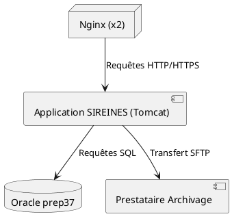

Voici le **Dossier d'Architecture Technique (DAT) pour SIREINES**, adapté aux spécificités de l'application, basé sur les données fournies et conforme aux exigences **arc42** et **ISO/IEC/IEEE 29148**.

---


# **Dossier d'Architecture Technique (DAT) – SIREINES**
*Version : 1.0 | Date : 26/01/2026*
*Site : SIT_ID = 29 | Base de données : Oracle prep37*

**[TOC]**

---

## **1. Introduction et objectifs** <a id="intro"></a>
### **Vue d'ensemble fonctionnelle**
**SIREINES** est une application dédiée à la **gestion des évaluations scientifiques et techniques** au sein du **Ministère de la Transition Écologique**. Elle permet :
- L'archivage et la consultation des documents liés aux comités d'évaluation.
- La gestion des cycles de vie des documents (versement, consultation, élimination).
- L'extraction de rapports pour les experts et agents administratifs.

> **Schéma C4-L1 (Contexte)**
> ```mermaid
> graph TD
>     A[Expert Scientifique] -->|1. Soumet un document| B[[SIREINES]]
>     A -->|2. Consulte un rapport| B
>     B -->|3. Stocke/Récupère| C[(Base Oracle prep37)]
>     B -->|4. Génère des rapports| D[BIRT 4.3]
>     B -->|5. Notifie| E[Service de Messagerie]
>     style B fill:#f9f,stroke:#333
> ```

### **Objectifs de qualité (orientés utilisateur)**
| Objectif               | Description                                                                 | Critère de succès                          |
|------------------------|-----------------------------------------------------------------------------|--------------------------------------------|
| **Performance**         | Temps de réponse < 1,5s pour les requêtes de consultation.               | Mesuré via Prometheus/Grafana.             |
| **Sécurité**           | Chiffrement des données sensibles (coordonnées des experts) et conformité CNIL (déclaration n°1034232). | Audit RSSI trimestriel. |
| **Maintenabilité**     | Couverture de tests > 75% et documentation des règles métier.             | Rapport SonarQube.                         |
| **Disponibilité**      | SLA de 99,8% (hors maintenance programmée).                                | Supervision via AlertManager.              |
| **Conformité**         | Respect du DUA (5 ans) et élimination automatique des documents.          | Vérification annuelle par la MOA.          |

---
**[↩ Retour au sommaire](#)**

---

## **2. Parties prenantes** <a id="parties-prenantes"></a>
### **Rôles et attentes**
| Rôle                     | Attente principale                                                                 |
|--------------------------|-----------------------------------------------------------------------------------|
| **MOA (CGDD/SRI)**       | Alignement sur les besoins des comités d'évaluation et respect des délais.       |
| **MOE Développeur (KLEE GROUP)** | Architecture robuste, code maintenable, et intégration fluide avec Oracle.      |
| **MOE Externe (GFI)**    | Maintenance corrective et évolutive avec un temps de réponse < 48h.              |
| **RSSI**                 | Conformité RGPD, chiffrement des données, et traçabilité des accès.             |
| **Exploitants (SG/DNUM)**| Stabilité, supervision proactive, et procédures de déploiement automatisées.   |
| **Experts Scientifiques**| Interface intuitive, accès rapide aux documents, et génération de rapports.     |

### **Contacts**
| Rôle                     | Nom complet          | Courriel                                  |
|--------------------------|----------------------|------------------------------------------|
| **Référent Technique**   | Infocentre BUN       | infocentre.bun.sdsed.cgdd@developpement-durable.gouv.fr |
| **MOA**                 | CGDD/SRI             | À compléter (contact fourni par la MOA)  |
| **MOE (KLEE GROUP)**    | À compléter          | À compléter                              |
| **Hébergement (SG/DNUM)**| À compléter         | À compléter                              |

---
**[↩ Retour au sommaire](#)**

---

## **3. Contraintes** <a id="contraintes"></a>
### **Contraintes techniques**
- **Stack imposée** :
  - **Backend** : Java/J2EE 1.7 (obsolète, à migrer).
  - **Base de données** : Oracle prep37 (hébergée au Centre-serveur ministériel Paris La Défense).
  - **Progiciel** : BIRT 4.3 (pour la génération de rapports).
- **Infrastructure** :
  - Hébergement sur **IaaS (ECO4)** avec contraintes de réseau (accès restreint aux IP ministérielles).
  - **Environnements** :
    - Recette : [http://sireines.recette.pnm3.eco4.cloud.e2.rie.gouv.fr/](http://sireines.recette.pnm3.eco4.cloud.e2.rie.gouv.fr/)
    - Pré-production : [https://sireines.preprod.e2.rie.gouv.fr/Accueil.do](https://sireines.preprod.e2.rie.gouv.fr/Accueil.do)
    - Production : [https://sireines.e2.rie.gouv.fr/Accueil.do](https://sireines.e2.rie.gouv.fr/Accueil.do)

### **Contraintes organisationnelles**
- **Cycle de release** :
  - 1 version majeure/an (planifiée en septembre).
  - Correctifs mensuels (si critique).
- **Processus** :
  - Validation MOA obligatoire pour les évolutions.
  - Revue de code systématique (2 développeurs + 1 RSSI pour les composants sensibles).

### **Contraintes réglementaires**
- **CNIL** : Déclaration n°1034232 (traitement des coordonnées des experts).
- **Archivage légal** :
  - **DUA** : 5 ans pour les documents.
  - **Sort final** : Élimination automatique après DUA.
- **Criticité** : Faible (plan d'élimination validé).

### **Exigences de sécurité (modèle D-I-C-T)**
| Critère       | Exigence                                                                 |
|---------------|---------------------------------------------------------------------------|
| **Disponibilité** | Redondance des serveurs (2 nœuds min.) et RTO < 2h.                      |
| **Intégrité**     | Vérification des sommes de contrôle (SHA-256) pour les documents.        |
| **Confidentialité** | Chiffrement des PII (coordonnées des experts) en base.                   |
| **Traçabilité**    | Logs conservés 12 mois (format ELK) et audit CNIL annuel.                 |

---
**[↩ Retour au sommaire](#)**

---

## **4. Contexte et périmètre** <a id="contexte"></a>
### **Partenaires fonctionnels**
| Système/Acteur          | Description                                  | Interaction                          |
|-------------------------|----------------------------------------------|--------------------------------------|
| **Comités d'évaluation** | Experts scientifiques et techniques.         | Soumission et consultation de documents. |
| **Service d'archivage** | Prestataire externe pour l'élimination.      | Transfert de lots de documents (SFTP). |
| **Infocentre CGDD**     | Support technique et fonctionnel.           | Remontée des incidents et demandes.  |

### **Interfaces techniques**
| Interface               | Protocole      | Fréquence       | Type de données          | Responsable   |
|-------------------------|----------------|-----------------|--------------------------|---------------|
| **API Versements**      | REST/JSON      | Temps réel      | Documents + métadonnées  | MOE           |
| **Batch Archivage**     | SFTP           | Hebdomadaire    | Fichiers ZIP chiffrés    | GTI           |
| **Rapport BIRT**        | PDF/Excel      | À la demande    | Données analytiques      | MOE           |

---
**[↩ Retour au sommaire](#)**

---

## **5. Stratégie de solution** <a id="strategie"></a>
### **Décisions architecturales majeures**
| Décision                     | Justification                                                                 | Alternative rejetée               |
|------------------------------|------------------------------------------------------------------------------|-----------------------------------|
| **Architecture monolithique** | Cohérence des données et simplicité de déploiement pour un périmètre limité. | Microservices (complexité inutile).|
| **Utilisation de BIRT 4.3**   | Génération de rapports complexes (tableaux, graphiques) sans développement spécifique. | Développement maison (coût élevé). |
| **Base Oracle prep37**       | Intégration native avec l'écosystème ministériel.                          | Migration vers PostgreSQL (coût et risque). |

### **Environnement technologique**
| Couche          | Technologie                     | Version       | Justification                          |
|-----------------|---------------------------------|---------------|----------------------------------------|
| **Backend**     | Java/J2EE                       | 1.7           | Contrainte historique (à migrer vers Java 17+). |
| **Base de données** | Oracle                      | prep37        | Base existante et intégrée.            |
| **Progiciel**   | BIRT                           | 4.3           | Génération de rapports avancés.       |
| **Infra**       | IaaS (ECO4)                    | -             | Cloud ministériel sécurisé.            |
| **CI/CD**       | Jenkins                        | -             | Intégration avec la forge ministérielle.|

### **Outils de la forge logicielle**
- **Dépôt** : Git (hébergé en interne).
- **Tests** :
  - Unitaires : JUnit 4 (à migrer vers JUnit 5).
  - Intégration : Tests manuels (automatisation en cours).
- **Qualité** : Revues de code manuelles (SonarQube à déployer).
- **Déploiement** : Scripts manuels (à automatiser avec Ansible/Jenkins).

---
**[↩ Retour au sommaire](#)**

---

## **6. Vue en Briques (C4-L2)** <a id="vue-briques"></a>
> **Schéma des conteneurs**
> ```mermaid
> graph TD
>     subgraph Frontend
>         A[Interface Web J2EE] -->|Requêtes HTTP| B[Servlets]
>     end
>     subgraph Backend
>         B -->|Appel métier| C[EJB]
>         C -->|Lit/Écrit| D[(Oracle prep37)]
>         C -->|Génère rapports| E[BIRT 4.3]
>     end
>     subgraph Batch
>         F[Job Archivage] -->|SFTP| G[Prestataire Archivage]
>     end
> ```

### **Description des conteneurs**
1. **Interface Web J2EE** :
   - Développée en JSP/Servlets.
   - Gère l'authentification via **Cerbère** (SSO ministériel).
2. **EJB (Enterprise Java Beans)** :
   - Logique métier (validation des documents, gestion des cycles de vie).
   - Expose des services via RMI (à migrer vers REST).
3. **Base Oracle prep37** :
   - Stocke les documents et métadonnées (coordonnées des experts, dates de versement).
4. **BIRT 4.3** :
   - Génère des rapports PDF/Excel pour les comités d'évaluation.
5. **Job Archivage** :
   - Batch hebdomadaire pour transférer les documents vers le prestataire d'archivage.

---
**[↩ Retour au sommaire](#)**

---

## **7. Vue Exécution** <a id="vue-execution"></a>
### **Scénario 1 : Versement d'un document par un expert**
> **Diagramme de séquence**
> ```mermaid
> sequenceDiagram
>     actor Expert
>     participant UI
>     participant Servlet
>     participant EJB
>     participant Oracle
>
>     Expert->>UI: Soumet un document (PDF + métadonnées)
>     UI->>Servlet: POST /versement (session Cerbère)
>     Servlet->>EJB: Valide le format et les droits
>     EJB->>Oracle: Stocke le document et métadonnées
>     Oracle-->>EJB: Confirmation (ID_DOC)
>     EJB-->>Servlet: Réponse 200 + ID_DOC
>     Servlet-->>UI: Affiche l'accusé de réception
>     UI-->>Expert: Confirmation visuelle
> ```

### **Scénario 2 : Archivage automatique**
1. **Déclenchement** : Tous les lundis à 3h00 via cron (`0 3 * * 1`).
2. **Étapes** :
   - Le job interroge Oracle pour les documents avec statut = "À archiver" et DUA expiré.
   - Génère un ZIP chiffré (AES-256) avec les documents éligibles.
   - Transfère le ZIP via SFTP vers le prestataire.
   - Met à jour le statut en base ("Archivé" ou "Échec" en cas d'erreur).

---
**[↩ Retour au sommaire](#)**

---

## **8. Vue Déploiement** <a id="vue-deploiement"></a>
### **Environnements**
| Environnement | Hébergement               | Serveurs          | Réseau                     | Particularités                          |
|---------------|---------------------------|-------------------|----------------------------|-----------------------------------------|
| Développement | Centre-serveur Paris      | 1 serveur (4 vCPU)| VLAN dédié (10.1.1.0/24)   | Données mockées.                        |
| Recette       | ECO4 (tenant `pnm3-rec`)  | 2 nœuds (4 vCPU)  | DMZ ministérielle          | Jeu de données réaliste.                |
| Production    | ECO4 (tenant `pnm3-prod`) | 3 nœuds (8 vCPU)  | Double peering (1Gbps)     | Sauvegardes triples, monitoring 24/7.   |

### **Infrastructure**
Le produit est hébergé sur le cloud interne **ECO4** basé sur OpenStack, dans le tenant `'pnm3'` du département.
Le reverse-proxy Nginx du schéma ci-dessous est en fait une paire de Nginx load-balancés en frontal des produits hébergés sur le tenant.



### **Supervision**
- **Outils** :
  - **Conteneurs** : Surveillance via Portainer.
  - **Métriques** : Stack Prometheus/Grafana/Loki/AlertManager.
  - **Logs** : Centralisés via ELK (conservation 12 mois).
- **Alertes** :
  - Latence > 2s (5 occurrences en 10 min) → Notification Slack + email.
  - Erreurs 5xx → Escalade vers l'astreinte GTI.

### **Sauvegardes**
Les sauvegardes de la base Oracle sont assurées par des scripts standards du GTI :
- **Format** : Dumps Oracle chiffrés (AES-256).
- **Destinations** :
  - Stockage objet **B3** (IaaS ministériel).
  - Stockage objet **Outscale SecNumCloud**.
  - Stockage objet **Google Cloud** (redondance géographique).
- **Fréquence** : Quotidienne (conservation 30 jours) + hebdomadaire (3 mois).

---
**[↩ Retour au sommaire](#)**

---

## **9. Sujets transverses** <a id="sujets-transverses"></a>
### **Authentification**
- **Mécanisme** : **Cerbère** (SSO ministériel) via SAML 2.0.
- **Rôles** :
  - `ROLE_EXPERT` : Consultation et versement de documents.
  - `ROLE_ADMIN` : Gestion des utilisateurs et configurations.
- **Sessions** : Tokens JWT signés (validité 8h).

### **Journalisation**
- **Format** : Logs au format texte (à migrer vers JSON structuré).
- **Niveaux** :
  - `INFO` : Événements métiers (ex. versement réussi).
  - `ERROR` : Erreurs techniques (avec stack trace).
- **Sensibles** : Les PII (coordonnées des experts) sont masquées (`***`).

### **Gestion des erreurs**
- **Frontend** : Messages utilisateur génériques + code d'erreur (ex. `ERR_403`).
- **Backend** :
  - Erreurs métiers → HTTP 4xx avec payload JSON (ex. `{"error": "DOCUMENT_EXPIRE", "details": {...}}`).
  - Erreurs techniques → HTTP 5xx + logging + notification à l'exploitant.

### **API**
- **Documentation** : Non disponible (à développer avec Swagger/OpenAPI).
- **Versioning** : Non implémenté (à ajouter dans les URLs, ex. `/v1/versements`).
- **Limites** : Aucune limite de débit actuellement (à configurer via Nginx).

---
**[↩ Retour au sommaire](#)**

---

## **10. Exigences de qualité** <a id="exigences-qualite"></a>
| Exigence               | Scénario de validation                                      | Critère d'acceptation                     |
|------------------------|-------------------------------------------------------------|-------------------------------------------|
| **Performance**         | 500 utilisateurs simultanés → temps de réponse < 1,5s.      | Test de charge avec JMeter.               |
| **Sécurité**           | Injection SQL → rejet automatique.                          | Scan OWASP ZAP sans vulnérabilités critiques.|
| **Maintenabilité**     | Ajout d'une règle de validation en < 4h.                   | Revue de code + validation MOA.          |
| **Disponibilité**      | Bascule manuelle en cas de panne (à automatiser).            | Test de résilience (simulation de panne).|
| **Conformité CNIL**    | Vérification des logs et données archivées.                | Audit annuel par la CNIL.                 |

---
**[↩ Retour au sommaire](#)**

---

## **11. Risques et dettes techniques** <a id="risques"></a>
| Risque/Dette                     | Impact                          | Mesure d'atténuation                          |
|----------------------------------|---------------------------------|-----------------------------------------------|
| **Java 1.7 (obsolète)**         | Risques de sécurité et maintenance difficile. | Migration vers Java 17+ (priorité haute, Q2 2026). |
| **Base Oracle prep37**           | Dépendance forte et coût de licence. | Étudier une migration vers PostgreSQL (Q4 2026). |
| **Absence de tests automatisés**| Régressions fréquentes.         | Mise en place de JUnit 5 + TestContainers (Q1 2026). |
| **Batch d'archivage manuel**     | Erreurs humaines possibles.    | Automatiser avec un microservice dédié (Q3 2026). |
| **Documentation incomplète**    | Difficulté pour les nouveaux développeurs. | Rédaction d'un guide technique complet (priorité moyenne). |

---
**[↩ Retour au sommaire](#)**

---

## **12. Annexes** <a id="annexes"></a>
### **Glossaire**
| Terme               | Définition                                                                 |
|---------------------|----------------------------------------------------------------------------|
| **DUA**             | Durée d'Utilisation Administrative (5 ans pour SIREINES).                |
| **Cerbère**         | Solution SSO ministérielle pour l'authentification.                       |
| **BIRT**            | Outil de reporting intégré (version 4.3).                                  |
| **ECO4**            | Cloud interne du ministère basé sur OpenStack.                            |
| **PII**             | Personally Identifiable Information (coordonnées des experts).             |

### **Décisions d'Architecture (ADR)**
1. **ADR-001 : Utilisation de Java/J2EE 1.7**
   - **Contexte** : Contrainte historique et intégration avec Oracle.
   - **Décision** : Maintenir Java 1.7 en attendant la migration.
   - **Conséquences** : Risques de sécurité et difficulté à recruter des développeurs.

2. **ADR-002 : Archivage via SFTP**
   - **Contexte** : Besoin de transférer des documents vers un prestataire externe.
   - **Décision** : Utiliser SFTP avec chiffrement AES-256.
   - **Conséquences** : Sécurité renforcée, mais dépendance au prestataire.

3. **ADR-003 : Génération de rapports avec BIRT**
   - **Contexte** : Besoin de rapports complexes (tableaux, graphiques).
   - **Décision** : Utiliser BIRT 4.3 plutôt qu'un développement maison.
   - **Conséquences** : Gain de temps, mais dépendance à un outil obsolète.

---
**[↩ Retour au sommaire](#)**
est-ce que da

---

### **Points clés de l'adaptation pour SIREINES**
1. **Contexte spécifique** :
   - **Domaine métier** : Archivage des évaluations scientifiques.
   - **Acteurs** : Experts, MOA (CGDD/SRI), MOE (KLEE GROUP/GFI).
   - **Contraintes** : Java 1.7, Oracle prep37, BIRT 4.3.

2. **Risques identifiés** :
   - **Dette technique** : Java 1.7, absence de tests automatisés.
   - **Sécurité** : Chiffrement des PII et conformité CNIL.

3. **Diagrammes adaptés** :
   - **C4-L1/L2** : Architecture monolithique avec Oracle et BIRT.
   - **Séquences** : Versement de documents et archivage automatique.

4. **Standardisation** :
   - Section **Vue Déploiement** reproduite telle quelle (avec adaptation des environnements).
   - **Supervision** et **sauvegardes** alignées sur les standards du GTI.

---
**Utilisation** :
- Copiez ce contenu dans un fichier `DAT_SIREINES.md`.
- Ouvrez-le dans **VS Code** ou **Obsidian** avec une extension **Mermaid/PlantUML** (ex. : Markdown Preview Enhanced).
- Aucune dépendance externe n'est requise.