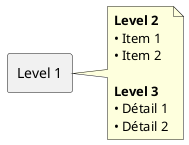
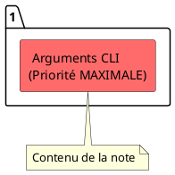
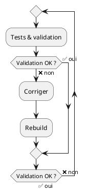
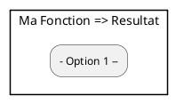
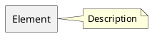
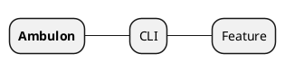

# Test des Mauvais Exemples

## Mauvais Exemple 1: ### ✅ Règle #1 : Privilégier la Complexité



## Mauvais Exemple 2: ### ✅ Règle #2 : Utiliser des Alias Courts



## Mauvais Exemple 3: ### ✅ Règle #3 : Éviter les Caractères Spéciaux dans les Noms

```plantuml
@startuml
object "feat:" {
  Impact = MINOR
}
@enduml
```

## Mauvais Exemple 4: ### ✅ Règle #5 : Utiliser les Listes à Tirets dans les Rectangles Imbriqués

```plantuml
@startuml
rectangle "Container" #LIGHTBLUE as container

note right of container
  <b>Actions:</b>
  • Action 1
  • Action 2
  • Action 3
end note
@enduml
```

## Mauvais Exemple 5: ### ✅ Règle #6 : Pas de Contenu Indenté (YAML/JSON) dans les Rectangles

```plantuml
@startuml
rectangle "Config" {
  config/piag.yaml:
    timeout: 120
    retries: 3
}
@enduml
```

## Mauvais Exemple 6: ### ✅ Règle #7 : Syntaxe Correcte des Objets

```plantuml
@startuml
object "feat:" {
  Impact = MINOR
  Exemple = "3.0.2 → 3.1.0"
}
@enduml
```

## Mauvais Exemple 7: ### ✅ Règle #8 : Éviter les Deux-Points dans les Noms d'Objets

```plantuml
@startuml
object "docs:" {
  Impact = Aucun
}
@enduml
```

## Mauvais Exemple 8: ### ✅ Règle #9 : `backward` Uniquement dans `repeat...repeat while`

```plantuml
@startuml
if (Validation OK ?) then (✅ oui)
  :Continuer;
else (❌ non)
  :Corriger;
  backward :Re-tester;  # ❌ ERREUR
endif
```
**Pourquoi** : `backward` est un mot-clé réservé pour les boucles `repeat`.

#### ✅ Bon exemple (repeat...repeat while)

```text
repeat
  :Tests & validation;

  if (Validation OK ?) then (✅ oui)
  else (❌ non)
    :Corriger;
    :Rebuild;
  endif

repeat while (Validation OK ?) is (❌ non) not (✅ oui)
```



## Mauvais Exemple 9: ### ✅ Règle #12 : Utiliser `<b>` pour le Bold dans les Notes



## Mauvais Exemple 10: ### ✅ Règle #21 : Balises @startuml et @enduml Obligatoires



## Mauvais Exemple 11: ### ✅ Règle #16 : Pas de Markdown Bold (`**`) dans les Mindmaps



