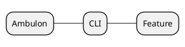

# Test des Exemples PlantUML

## Test 1: Note avec element non défini (ligne 567)

```plantuml
note right of element
  <b>Titre en Gras</b>
  <i>Texte en italique</i>
  <u>Texte souligné</u>

  Texte normal
end note
```

## Test 2: Object avec accolades (ligne 171)

```plantuml
object feat {
  Type = "feat:"
  Impact = MINOR
}
```

## Test 3: Object syntaxe officielle (ligne 379)

```plantuml
object feat
feat : Type = "feat:"
feat : Impact = MINOR
feat : Exemple = "3.0.2 → 3.1.0"
```

## Test 4: Rectangle 3 niveaux (ligne 77)

```plantuml
rectangle "Level 1" {
  rectangle "Level 2" {
    rectangle "Level 3" {
      - Item 1
      - Item 2
    }
  }
}
```

## Test 5: Rectangle avec note sans alias (ligne 49)

```plantuml
rectangle "Level 1" as level1

note right of level1
  <b>Level 2</b>
  • Item 1
  • Item 2

  <b>Level 3</b>
  • Détail 1
  • Détail 2
end note
```

## Test 6: Object avec deux-points dans nom (ligne 406)

```plantuml
object "docs:" {
  Impact = Aucun
}
```

## Test 7: Rectangle avec alias (ligne 127)

```plantuml
rectangle "1. Arguments CLI" #FF6B6B as cli

note bottom of cli
  <b>Priorité MAXIMALE</b>
  Contenu de la note
end note
```

## Test 8: Mindmap basique (ligne 843)



## Test 9: Rectangle avec contenu YAML (ligne 312 - mauvais exemple)

```plantuml
rectangle "Config" {
  config/piag.yaml:
    timeout: 120
    retries: 3
}
```

## Test 10: Repeat while (ligne 477)

```plantuml
repeat
  :Tests & validation;

  if (Validation OK ?) then (✅ oui)
  else (❌ non)
    :Corriger;
    :Rebuild;
  endif

repeat while (Validation OK ?) is (❌ non) not (✅ oui)
```
