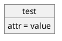

# Test Simple PlantUML

## Test 1: Rectangle basique

```plantuml
@startuml
rectangle "Test"
@enduml
```

## Test 2: Object simple

```plantuml
@startuml
object test
test : attr = value
@enduml
```

## Test 3: Note avec element défini

```plantuml
@startuml
rectangle "Element" as element

note right of element
  <b>Titre</b>
  Description
end note
@enduml
```
