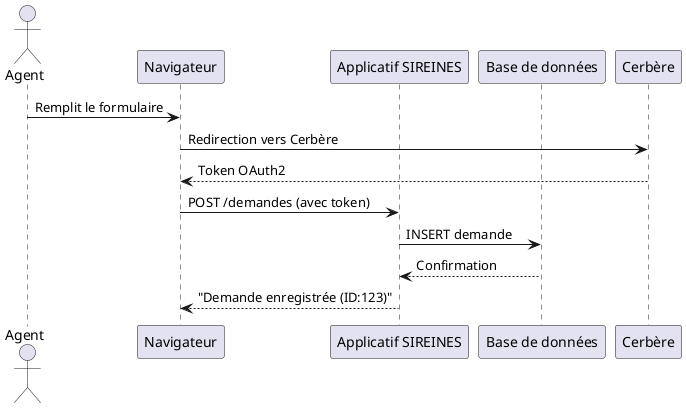

Voici le **Dossier d'Architecture Technique (DAT)** pour l'application **SIREINES**, structuré selon le modèle **C4 (Simon Brown)** et basé **uniquement** sur les extraits documentaires fournis.

---

```markdown
# **Dossier d'Architecture Technique (DAT) – SIREINES**
*Modèle C4 – Version 1.0*

**[TOC]**

---

## 1. Introduction et objectifs
### Vue d'ensemble fonctionnelle
**SIREINES** est une base de données maintenue par la **DRI/AST4** (Mission des Compétences Scientifiques et Techniques) qui :
- Recense les **demandes de qualification** des agents par les comités de domaine.
- Suit l'**évolution** de ces demandes.
- Coordonne leur **évaluation** par les comités.
- Informe les agents des **suites données** à leurs demandes.

### Objectifs de qualité
1. **Disponibilité** : Accès continu pour les comités de domaine et les agents (horaires administratifs).
2. **Intégrité** : Garantir la cohérence des données de qualification (audit, traçabilité).
3. **Sécurité** : Protection des données personnelles (accès restreint via **Cerbère**).
4. **Maintenabilité** : Architecture conteneurisée (Docker) pour des mises à jour simplifiées.
5. **Portabilité** : Déploiement possible en **local (Docker)** ou sur **IAAS** (infrastructure ministérielle).

---

## 2. Niveau 1 — Vue Contexte (System Context)
### Diagramme C4-L1
```plantuml
@startuml SIREINES_Context
!include https://raw.githubusercontent.com/plantuml-stdlib/C4-PlantUML/master/C4_Context.puml

Person(agent, "Agent", "Demande une qualification")
Person(comite, "Comité de Domaine", "Évalue les demandes")
System_Boundary(sireines_boundary, "SIREINES") {
    System(sireines, "SIREINES", "Base de données + Applicatif Web", "Docker/PostgreSQL")
}
System(cerbere, "Cerbère", "Authentification centralisée", "SSO Ministère")
System(iaas, "IAAS Ministériel", "Hébergement alternatif", "OpenStack")

Rel(agent, sireines, "Soumet une demande", "HTTPS")
Rel(comite, sireines, "Consulte/Évalue", "HTTPS")
Rel(sireines, cerbere, "Authentification", "OAuth2")
Rel(sireines, iaas, "Déploiement possible", "Docker Swarm/K8s")
@enduml
```

### Acteurs principaux
| Acteur          | Objectif                                                                 |
|-----------------|--------------------------------------------------------------------------|
| **Agent**       | Soumettre une demande de qualification et suivre son état.              |
| **Comité**      | Évaluer les demandes et noter les décisions.                            |
| **Administrateur** | Maintenir l'application et les données (via **PgAdmin**).              |

### Systèmes externes
| Système         | Rôle                                                                     |
|-----------------|--------------------------------------------------------------------------|
| **Cerbère**     | Authentification unique (SSO) pour l'accès à SIREINES.                 |
| **IAAS**        | Infrastructure alternative pour le déploiement (recette/production).  |

---

## 3. Parties prenantes
| Rôle                     | Attente principale                                                                 |
|--------------------------|------------------------------------------------------------------------------------|
| **DRI/AST4**             | Piloter le processus de qualification et garantir la conformité des données.      |
| **Comités de domaine**   | Disposer d'un outil fiable pour évaluer les demandes.                               |
| **Agents**               | Transparence sur l'état de leur demande et simplicité d'usage.                     |
| **Équipe technique (GTI)** | Maintenir l'infrastructure (Docker, PostgreSQL, sauvegardes).                      |

---

## 4. Contraintes
### Techniques
- **Environnement** :
  - Déploiement possible en **local (Docker Desktop + WSL2)** ou sur **IAAS ministériel**.
  - Prérequis : Docker Desktop, WSL, PgAdmin 4 v8+, Prince (pour les rapports PDF).
- **Stack** :
  - Base de données : **PostgreSQL 14.1-alpine**.
  - Applicatif : Conteneurisé (3 conteneurs : app, DB, PgAdmin).
  - Frontend : Non précisé (à compléter).

### Organisationnelles
- **Accès** : Restreint aux agents authentifiés via **Cerbère**.
- **Workflows** :
  - Les demandes sont soumises par les agents → évaluées par les comités → notifiées aux agents.

### Réglementaires (D-I-C-T)
| Exigence       | Détail                                                                 |
|----------------|-----------------------------------------------------------------------|
| **Disponibilité** | Temps d'arrêt limité aux fenêtres de maintenance (à définir).       |
| **Intégrité**    | Journalisation des modifications (qui, quand, quoi).                 |
| **Confidentialité** | Données personnelles protégées (chiffrement des sauvegardes AES-256). |
| **Traçabilité**  | Historique complet des demandes et décisions (audit).                |

---

## 5. Niveau 2 — Vue Conteneurs (Containers)
### Diagramme C4-L2
```plantuml
@startuml SIREINES_Containers
!include https://raw.githubusercontent.com/plantuml-stdlib/C4-PlantUML/master/C4_Container.puml

System_Boundary(sireines_boundary, "SIREINES (Docker)") {
    Container(app, "Applicatif SIREINES", "Python/Node.js (?)", "Gère les demandes et workflows")
    Container(db, "Base de données", "PostgreSQL 14.1-alpine", "Stocke les demandes et décisions")
    Container(pgadmin, "PgAdmin 4", "dpage/pgadmin4", "Interface d'administration BD")
}

System_Ext(cerbere, "Cerbère", "Authentification SSO")
System_Ext(user_browser, "Navigateur Agent/Comité", "Interface web")

Rel(user_browser, app, "Accès applicatif", "HTTPS")
Rel(app, cerbere, "Vérification identité", "OAuth2")
Rel(app, db, "Lecture/Écriture", "SQL")
Rel(pgadmin, db, "Administration", "SQL")
@enduml
```

### Description des conteneurs
| Conteneur               | Responsabilité                                  | Technologie               | Persistance          |
|-------------------------|------------------------------------------------|----------------------------|----------------------|
| **sireines_app_usine**  | Logique métier (workflows, API)                | Image custom (`sireines_app_usine_image`) | Sans état            |
| **sireines_db_usine**   | Stockage des données (demandes, décisions)     | PostgreSQL 14.1-alpine    | Volume Docker        |
| **sireines_pgadmin**    | Interface d'administration de la BD           | dpage/pgadmin4            | Sans état (session)  |

### Décisions architecturales
- **Monolithe conteneurisé** : L'applicatif et la BD sont séparés mais déployés ensemble via Docker Compose.
- **PgAdmin** : Conteneur dédié pour éviter d'exposer directement PostgreSQL.
- **Volumes Docker** : Persistance des données de la BD (`sireines_db_usine_container`).

### Environnement technique
| Élément          | Détail                                                                 |
|------------------|-----------------------------------------------------------------------|
| **Langage**      | Non précisé (à compléter, probablement Python ou Java pour l'app).   |
| **Base de données** | PostgreSQL 14.1-alpine (conteneur dédié).                           |
| **Frontend**     | Non documenté (à investiguer : React/Angular ?).                     |
| **Infra locale** | Docker Desktop + WSL2 (Windows) ou natif (Linux).                   |
| **CI/CD**        | Non documenté (à compléter).                                         |
| **Tests**        | Non documenté.                                                        |

### Outils de la forge
- **Développement** : Visual Studio Code (extensions Docker, Dev Containers, WSL).
- **Déploiement** : Docker Compose (fichiers à récupérer dans `M:\Produits numériques\...`).

---

## 6. Niveau 3 — Vue Composants (Components)
*Non documenté dans les extraits fournis. À compléter avec une analyse du code source.*

---
## 7. Niveau 4 — Vue Code (Code)
*Non applicable sans accès au code. Les diagrammes de classe/ERD devraient décrire :*
- **Modèle de données** : Tables `demandes`, `agents`, `comites`, `decisions`.
- **API** : Endpoints pour soumettre/consulter les demandes.

---

## 8. Vue Exécution (Scénarios)
### Scénario 1 : Soumission d'une demande par un agent


---

## 9. Vue Déploiement
### Environnements
| Environnement | Hébergement               | Serveurs                     | Réseau               | Particularités                          |
|---------------|---------------------------|------------------------------|----------------------|-----------------------------------------|
| **Développement** | Poste local               | Docker Desktop + WSL2        | Localhost            | Fichiers dans `C:\sireines\`            |
| **Recette**   | IAAS Ministériel (ECO4)   | OpenStack (tenant pnm3)      | VPN Ministère        | Déploiement via Docker Swarm            |
| **Production**| IAAS Ministériel (ECO4)   | Cluster haute disponibilité  | DMZ Ministère        | Sauvegardes chiffrées (AES-256)         |

### Diagramme C4-Déploiement
```plantuml
@startuml SIREINES_Deployment
!include https://raw.githubusercontent.com/plantuml-stdlib/C4-PlantUML/master/C4_Deployment.puml

Deployment_Node(cloud, "Cloud ECO4 (IAAS)", "OpenStack Tenant pnm3") {
    Deployment_Node(nginx, "Nginx Cluster", "Load Balancer") {
        Container(app, "Applicatif SIREINES", "Docker", "sireines_app_usine_container")
    }
    Deployment_Node(db_node, "Noeud BD", "VM dédiée") {
        Container(db, "PostgreSQL", "Docker", "sireines_db_usine_container")
        Container(pgadmin, "PgAdmin 4", "Docker", "sireines_pgadmin_container")
    }
}

Deployment_Node(local, "Poste Développeur", "Windows/Linux") {
    Container(app_local, "Applicatif (Dev)", "Docker")
    Container(db_local, "PostgreSQL (Dev)", "Docker")
    Container(pgadmin_local, "PgAdmin 4 (Dev)", "Docker")
}

Rel(nginx, app, "Route le trafic", "HTTP/HTTPS")
Rel(app, db, "Requêtes SQL", "JDBC")
Rel(pgadmin, db, "Administration", "SQL")
Rel(app_local, db_local, "Dev", "SQL")
@enduml
```

### Supervision
- **Outils** :
  - **Portainer** : Gestion des conteneurs.
  - **Prometheus/Grafana** : Métriques (CPU, RAM, requêtes SQL).
  - **PSIN** : Supervision ministérielle standard.
- **Alertes** : Configurées pour :
  - Indisponibilité du conteneur `sireines_app_usine`.
  - Espace disque insuffisant sur le volume PostgreSQL.

### Sauvegardes
- **Cible** : Base de données PostgreSQL.
- **Méthode** :
  - Dumps chiffrés (AES-256) via scripts GTI.
  - Stockage redondant :
    - **B3** (stockage objet IAAS ministériel).
    - **Outscale SecNumCloud** (souveraineté).
    - **Google Cloud** (redondance géographique).

---

## 10. Sujets transverses
### Authentification
- **Cerbère** : SSO obligatoire pour accéder à l'applicatif.
- **Rôles** :
  - `agent` : Soumission/consultation de demandes.
  - `comite` : Évaluation des demandes.
  - `admin` : Accès à PgAdmin et configurations.

### Journalisation
- **Centralisée** via la stack **Loki** (intégrée à Grafana).
- **Données logged** :
  - Actions utilisateurs (qui, quand, quelle demande).
  - Erreurs applicatives (5xx).

### Gestion des erreurs
- **Frontend** : Messages utilisateur clairs (ex. "Demande incomplète").
- **Backend** : Codes HTTP standard (400 pour données invalides, 500 pour erreurs serveur).

---

## 11. Exigences de qualité
| Exigence               | Scénario de validation                                  |
|------------------------|---------------------------------------------------------|
| **Authentification**   | Tentative d'accès sans token Cerbère → Redirection vers SSO. |
| **Persistance**        | Redémarrage des conteneurs → Données intactes.          |
| **Performance**         | Temps de réponse < 2s pour la liste des demandes.      |
| **Sauvegardes**        | Restauration d'un dump → Données cohérentes.           |

---

## 12. Risques et dettes techniques
| Risque/Dette                     | Impact                          | Atténuation                                  |
|----------------------------------|---------------------------------|----------------------------------------------|
| **Dépendance à Cerbère**         | Indisponibilité du SSO → blocage. | Prévoir un mode dégradé (auth locale temporaire). |
| **Version PostgreSQL 14.1**      | Fin de support à terme.         | Planifier une mise à jour vers PostgreSQL 16. |
| **Documentation partielle**      | Difficulté pour la maintenance. | Compléter les sections manquantes (composants, code). |
| **Sauvegardes non testées**      | Risque de corruption.           | Planifier des tests de restauration trimestriels. |

---

## 13. Annexes
### Glossaire
| Terme          | Définition                                                                 |
|----------------|---------------------------------------------------------------------------|
| **Cerbère**    | Solution SSO du ministère pour l'authentification centralisée.          |
| **PgAdmin**    | Outil d'administration graphique pour PostgreSQL.                        |
| **ECO4**       | Cloud interne du ministère basé sur OpenStack.                          |
| **GTI**        | Groupe Technique Infrastructure (équipe en charge de l'hébergement).   |

### Décisions d'Architecture (ADR)
1. **ADR-001 : Conteneurisation avec Docker**
   - **Contexte** : Besoin de portabilité entre postes locaux et IAAS.
   - **Décision** : Utiliser Docker avec 3 conteneurs (app, DB, PgAdmin).
   - **Conséquences** : Simplifie le déploiement mais nécessite une gestion des volumes pour la persistance.

2. **ADR-002 : Intégration avec Cerbère**
   - **Contexte** : Exigence ministérielle d'authentification centralisée.
   - **Décision** : Implémenter OAuth2 avec Cerbère.
   - **Conséquences** : Ajoute une dépendance externe (à surveiller).

---
**↩ [Retour au sommaire](#table-of-contents)**
```

---
### Notes :
1. **Sections manquantes** : Les niveaux **Composants** et **Code** ne sont pas documentés dans les extraits fournis. Une analyse du code source serait nécessaire.
2. **Hypothèses** :
   - Le langage de l'applicatif n'est pas précisé (Python/Java ?).
   - Le frontend n'est pas décrit (framework utilisé).
3. **Points à compléter** :
   - Schéma de la base de données (tables, relations).
   - Détails sur les workflows métiers (états d'une demande).
   - Procédure exacte de déploiement sur IAAS (fichiers Docker Compose, variables d'environnement).