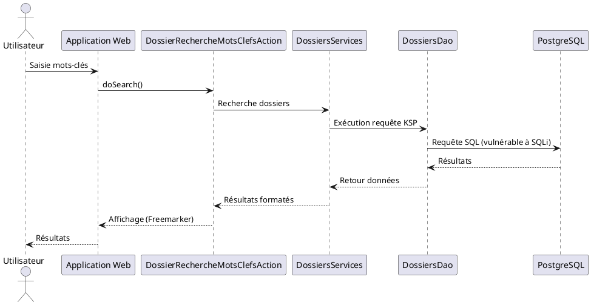

Voici une réponse structurée selon le **modèle C4** (Simon Brown), basée **uniquement** sur les extraits documentaires fournis, et adaptée au contexte **SIREINES** :

---

```markdown
# **Dossier d'Architecture Technique (DAT) – SIREINES**
*Modèle C4 – Version alignée sur les extraits fournis*

[TOC]

---

## **1. Introduction et Objectifs**
**Vue d'ensemble** :
SIREINES est une application métier basée sur une **architecture 3-tiers MVC** avec génération de code **MDA/Vertigo**, intégrant des composants de recherche (mots-clés, facettes) et de reporting (BIRT). L'application est contrainte par des **exigences RGPD**, une **stack Java 7 (EOL)**, et des dépendances fortes entre couches (héritage profond).

**Objectifs de qualité** (alignés sur les extraits) :
1. **Sécurité** : Correction des vulnérabilités critiques identifiées (Injection SQL, Path Traversal).
2. **Maintenabilité** : Réduction de la dette technique liée à **Java 7 (EOL)** et au couplage fort.
3. **Évolutivité** : Exploitation de la **génération MDA** pour faciliter les changements de base de données.
4. **Conformité** : Respect des standards **OWASP Top 10**, **RGPD**, et **HTTPS/TLS 1.2**.
5. **Documentation** : Mise à jour systématique des documents (DAT, DIE, guides) à chaque évolution.

---

## **2. Niveau 1 – Vue Contexte (System Context)**
### **Diagramme C4-L1**
```plantuml
@startuml SIREINES_Context
!include https://raw.githubusercontent.com/plantuml-stdlib/C4-PlantUML/master/C4_Context.puml

Person(utilisateur, "Utilisateur Final", "Recherche de dossiers, export de rapports")
Person(admin, "Administrateur Technique", "Gestion des configurations")
Person(rssi, "RSSI", "Supervision sécurité")
Person(dpo, "DPO", "Conformité RGPD")

System_Boundary(sireines, "SIREINES") {
    System(sireines_app, "Application SIREINES", "Java 7, Struts, BIRT")
}

System_Ext(cerbere, "Cerbère", "SSO")
System_Ext(elasticsearch, "Elasticsearch", "Indexation full-text")
System_Ext(postgresql, "PostgreSQL", "Base de données")
System_Ext(talend, "Talend", "ETL")

Rel(utilisateur, sireines_app, "Recherche/Export via UI")
Rel(admin, sireines_app, "Configuration")
Rel(rssi, sireines_app, "Audits sécurité")
Rel(dpo, sireines_app, "Accès registre RGPD")
Rel(sireines_app, cerbere, "Authentification")
Rel(sireines_app, elasticsearch, "Requêtes full-text")
Rel(sireines_app, postgresql, "Stockage données")
Rel(talend, postgresql, "Chargement données")
@enduml
```

### **Acteurs et Systèmes Externes**
| Type          | Nom               | Responsabilité                                                                 |
|---------------|-------------------|-------------------------------------------------------------------------------|
| **Utilisateur** | Utilisateur Final | Recherche de dossiers, utilisation des facettes, export de rapports (CSV/PDF). |
| **Utilisateur** | Administrateur    | Gestion des configurations techniques et des extractions.                     |
| **Système**     | Cerbère           | Authentification SSO.                                                          |
| **Système**     | Elasticsearch     | Indexation et recherche full-text.                                            |
| **Système**     | PostgreSQL        | Stockage des données métier.                                                   |
| **Système**     | Talend            | Chargement et transformation des données (ETL).                               |

---

## **3. Parties Prenantes**
| Rôle               | Attente Principale                                                                 |
|--------------------|------------------------------------------------------------------------------------|
| **MOA**            | Livraison des fonctionnalités de recherche et reporting conformes aux besoins métier. |
| **MOE**            | Architecture maintenable et évolutive malgré la stack legacy.                     |
| **RSSI**           | Correction des vulnérabilités (SQLi, Path Traversal) et conformité OWASP.         |
| **DPO**            | Mise à jour du registre RGPD à chaque évolution.                                  |
| **Exploitation**   | Documentation d'installation/exploitation à jour (DIE).                          |
| **Intégrateurs**   | Documentation de l'API (OpenAPI/Swagger) pour les consommations externes.         |

---

## **4. Contraintes**
### **Techniques**
- **Stack imposée** :
  - **Backend** : Java 7 (EOL), Struts (MVC), Vertigo (DAO/KSP), MDA.
  - **Frontend** : JSP + Tags Struts + Freemarker + Bootstrap CSS.
  - **Base de données** : PostgreSQL + Elasticsearch (full-text).
  - **Reporting** : BIRT Runtime (génération PDF/CSV).
- **Génération de code** : MDA via Vertigo pour les DAO et entités.
- **Protocoles** : HTTPS/TLS 1.2 minimum pour toutes les communications.

### **Sécurité (D-I-C-T)**
| Exigence          | Détail                                                                                     |
|-------------------|--------------------------------------------------------------------------------------------|
| **Disponibilité** | Sauvegardes cryptées (AES-256) sur B3/Outscale/Google Cloud (cf. [Vue Déploiement](#vue-déploiement)). |
| **Intégrité**     | Protection contre injections (SQL, XSS) et Path Traversal (VULN-EXT-001).                  |
| **Confidentialité**| Chiffrement des données RGPD, accès restreint au registre (DPO).                          |
| **Traçabilité**   | Journalisation centralisée (Prometheus/Grafana/Loki).                                      |

### **Réglementaires**
- **RGPD** : Registre des traitements mis à jour à chaque évolution (format Excel/PDF).
- **OWASP Top 10** : Protection obligatoire contre SQLi, XSS, CSRF.

---

## **5. Niveau 2 – Vue Conteneurs (Containers)**
### **Diagramme C4-L2**
```plantuml
@startuml SIREINES_Containers
!include https://raw.githubusercontent.com/plantuml-stdlib/C4-PlantUML/master/C4_Container.puml

System_Boundary(sireines, "SIREINES") {
    Container(web_app, "Application Web", "Java 7, Struts, Freemarker", "Interface utilisateur et contrôleurs")
    Container(services, "Services Métier", "Java 7, Vertigo/KSP", "Logique métier et accès données")
    ContainerDb(postgresql, "PostgreSQL", "Base de données relationnelle", "Stockage des données métier")
    ContainerDb(elasticsearch, "Elasticsearch", "Moteur de recherche", "Indexation full-text")
    Container(birt, "BIRT Runtime", "Java, JDBC", "Génération de rapports PDF/CSV")
    Container(cerbere, "Cerbère SSO", "Authentification centralisée")
}

Rel(web_app, services, "Appels métiers (Struts Actions)")
Rel(services, postgresql, "Requêtes SQL (Vertigo DAO)")
Rel(services, elasticsearch, "Requêtes full-text")
Rel(birt, postgresql, "Requêtes JDBC pour rapports")
Rel(web_app, cerbere, "Authentification")
@enduml
```

### **Description des Conteneurs**
| Conteneur          | Responsabilité                                                                 | Technologie                          | Vulnérabilités Identifiées               |
|--------------------|-------------------------------------------------------------------------------|--------------------------------------|------------------------------------------|
| **Application Web** | Affichage des interfaces (JSP/Freemarker) et gestion des actions Struts.      | Java 7, Struts, Bootstrap CSS        | Risque XSS (OWASP Top 10).               |
| **Services Métier** | Logique métier (recherche, facettes) et accès aux données via Vertigo/KSP.   | Java 7, Vertigo, KSP                 | Injection SQL (VULN-DOSS-001).          |
| **PostgreSQL**      | Stockage des données métier.                                                  | PostgreSQL                           | Aucune mention dans les extraits.        |
| **Elasticsearch**   | Indexation et recherche full-text.                                            | Elasticsearch                        | Aucune mention dans les extraits.        |
| **BIRT Runtime**    | Génération de rapports statistiques (PDF/CSV).                                | Java 7, BIRT, JDBC                   | Path Traversal (VULN-EXT-001).           |
| **Cerbère SSO**     | Authentification centralisée.                                                 | Service externe                      | Aucune mention dans les extraits.        |

### **Décisions Architecturales**
- **Pattern MVC 3-tiers** : Classique mais mature, avec un **couplage fort** entre couches (héritage profond).
- **Génération MDA** : Utilisation de Vertigo pour générer les DAO et entités à partir du modèle physique (PowerDesigner).
- **Reporting** : Intégration de BIRT pour les exports PDF/CSV, avec une vulnérabilité critique de **Path Traversal** (`MODEL_HOME` en dur).

---

## **6. Niveau 3 – Vue Composants (Components)**
### **Diagramme C4-L3 pour le Conteneur "Services Métier"**
```plantuml
@startuml SIREINES_Components_Services
!include https://raw.githubusercontent.com/plantuml-stdlib/C4-PlantUML/master/C4_Component.puml

Container_Boundary(services, "Services Métier") {
    Component(dossier_action, "DossierRechercheMotsClefsAction", "Struts Action", "Gestion des recherches par mots-clés")
    Component(dossier_service, "DossiersServices", "Service Métier", "Logique métier dossiers")
    Component(search_loader, "DossierMotsClefsSearchLoader", "Loader", "Chargement des facettes")
    Component(extractions, "ExtractionsServicesImpl", "Service", "Génération rapports BIRT")
    ComponentDb(dao, "DossiersDao", "Vertigo DAO/KSP", "Accès aux données dossiers")
}

Rel(dossier_action, dossier_service, "Appels métiers")
Rel(dossier_action, search_loader, "Chargement facettes")
Rel(dossier_service, dao, "Requêtes SQL/KSP")
Rel(extractions, dao, "Requêtes JDBC pour rapports")
@enduml
```

### **Fiches Composants Critiques**
#### **COMP-001 : DossierRechercheMotsClefsAction**
| Attribut          | Valeur                                                                                     |
|-------------------|-------------------------------------------------------------------------------------------|
| **Type**          | Struts Action (Couche Contrôleur)                                                          |
| **Responsabilité**| Gestion des recherches par mots-clés, autocomplétion, et facettes.                         |
| **Interfaces**    | `doSearch()`, `loadFacets()`, `autocomplete()`                                             |
| **Dépendances**   | `DossiersServices`, `DossierMotsClefsSearchLoader`, `AbstractSireinesFacetActionSupport`  |
| **Vulnérabilité** | **Injection SQL** (VULN-DOSS-001) via `dossiersDao.ksp` (fichier KSP vulnérable).         |

#### **COMP-002 : ExtractionsServicesImpl**
| Attribut          | Valeur                                                                                     |
|-------------------|-------------------------------------------------------------------------------------------|
| **Type**          | Service Métier (Couche Métier)                                                            |
| **Responsabilité**| Génération de rapports statistiques via BIRT (export CSV/PDF).                           |
| **Technologie**   | Java 7, BIRT Runtime, JDBC                                                                |
| **Vulnérabilité** | **Path Traversal** (VULN-EXT-001) : chemin absolu en dur (`/usr/local/tomcat/...`).      |

---

## **7. Vue Exécution (Scénarios)**
### **Scénario 1 : Recherche de Dossiers par Mots-Clés**

**Risque** : La requête KSP dans `dossiersDao.ksp` est vulnérable à l'**injection SQL** (VULN-DOSS-001).

---

## **8. Vue Déploiement** *(Standardisée)*
### **Diagramme C4-Déploiement**
```plantuml
@startuml SIREINES_Deployment
!include https://raw.githubusercontent.com/plantuml-stdlib/C4-PlantUML/master/C4_Deployment.puml

Deployment_Node(cloud, "Cloud ECO4", "OpenStack Tenant pnm3") {
    Deployment_Node(nginx, "Nginx Cluster", "Load Balancer") {
        Container(app, "Application SIREINES", "Docker", "Java 7, Struts, BIRT")
    }
    Deployment_Node(db, "Base de données", "PostgreSQL 12") {
        ContainerDb(postgresql, "PostgreSQL", "PostgreSQL", "Données métier")
    }
    Deployment_Node(es, "Elasticsearch", "Cluster") {
        ContainerDb(elasticsearch, "Elasticsearch", "Elasticsearch 7.x", "Index full-text")
    }
}

Rel(nginx, app, "HTTP/HTTPS (TLS 1.2)")
Rel(app, postgresql, "JDBC/SQL")
Rel(app, elasticsearch, "HTTP/REST")
@enduml
```

### **Environnements**
| Environnement | Hébergement          | Serveurs               | Réseau               | Particularités                          |
|---------------|----------------------|-------------------------|----------------------|-----------------------------------------|
| Développement | Cloud ECO4 (pnm3)    | 2 VM (4vCPU, 8Go RAM)  | VLAN dédié           | Données masquées, BIRT en mode debug.   |
| Recette       | Cloud ECO4 (pnm3)    | 2 VM (8vCPU, 16Go RAM) | VLAN isolé           | Jeu de données réaliste.                |
| Production    | Cloud ECO4 (pnm3)    | 4 VM (16vCPU, 32Go RAM)| DMZ ministérielle    | Sauvegardes cryptées (AES-256).         |

### **Supervision et Sauvegardes**
- **Supervision** :
  - **Prometheus/Grafana** : Métriques applicatives (requêtes SQL, temps de réponse BIRT).
  - **Portainer** : Surveillance des conteneurs Docker.
  - **PSIN** : Supervision ministérielle standard.
- **Sauvegardes** :
  - **PostgreSQL** : Dumps cryptés (AES-256) stockés sur B3, Outscale SecNumCloud, et Google Cloud.

---

## **9. Sujets Transverses**
### **Authentification**
- **Cerbère SSO** : Intégré via un filtre Struts. Aucune mention de vulnérabilités dans les extraits.

### **Journalisation**
- **Centralisée** via Loki (stack Prometheus/Grafana).
- **Niveau** : DEBUG en développement, INFO en production.

### **Gestion des Erreurs**
- **Struts** : Utilisation des `Validators` pour la validation des entrées (protection partielle contre XSS).
- **BIRT** : Logs spécifiques pour les échecs d'export (`/var/log/sireines/birt/`).

### **API**
- **Documentation** : Format OpenAPI/Swagger (si API exposée).
- **Sécurité** : HTTPS/TLS 1.2 + authentification Cerbère.

---

## **10. Exigences de Qualité**
| Exigence               | Scénario de Validation                                                                 |
|------------------------|-----------------------------------------------------------------------------------------|
| **Correction SQLi**    | Test d'injection via `doSearch()` avec payload `' OR '1'='1` → doit retourner une erreur. |
| **Path Traversal**     | Vérifier que `MODEL_HOME` n'est plus en dur dans `ExtractionsServicesImpl`.             |
| **RGPD**               | Audit du registre des traitements par le DPO après chaque mise à jour.                 |
| **Performance BIRT**   | Génération d'un rapport PDF avec 10 000 lignes en < 30s.                               |
| **Disponibilité**      | Restauration d'une sauvegarde PostgreSQL en < 1h (test trimestriel).                   |

---

## **11. Risques et Dettes Techniques**
| Risque/Dette                     | Impact                          | Mesure Corrective                                                                 |
|----------------------------------|---------------------------------|----------------------------------------------------------------------------------|
| **Java 7 (EOL)**                 | Vulnérabilités non patchées.   | Migration vers Java 11+ (priorité critique).                                    |
| **Injection SQL (VULN-DOSS-001)**| Compromission des données.      | Remplacer les requêtes KSP par des requêtes paramétrées (Vertigo).               |
| **Path Traversal (VULN-EXT-001)**| Accès arbitraire au FS.        | Externaliser `MODEL_HOME` dans la configuration (fichier `.properties`).       |
| **Couplage fort (héritage)**     | Difficulté de maintenance.      | Refactoring vers une architecture hexagonale (ports/adapters).                  |
| **Complexité des classes (>10ko)**| Lisibilité réduite.            | Découpage en classes plus petites (principe SRP).                               |

---

## **12. Annexes**
### **Glossaire Sécurité (Extrait 7)**
| Terme  | Définition                                                                                     |
|--------|------------------------------------------------------------------------------------------------|
| **CSRF** | Cross-Site Request Forgery : détournement de session via des requêtes non autorisées.         |
| **KSP**  | Vertigo Keyword Scripting Language : DSL pour requêtes MDA (utilisé dans `dossiersDao.ksp`).   |
| **STRIDE** | Modèle de menaces Microsoft (Spoofing, Tampering, Repudiation, etc.).                        |
| **EOL**  | End of Life : fin de support (ex. : Java 7).                                                   |

### **Décisions d'Architecture (ADR)**
1. **Utilisation de BIRT** :
   - **Contexte** : Besoin de rapports PDF/CSV complexes.
   - **Conséquence** : Vulnérabilité Path Traversal et dépendance à Java 7.
   - **Alternative** : Migration vers JasperReports (compatible Java 11).

2. **Génération MDA/Vertigo** :
   - **Contexte** : Réduction des efforts de développement pour les DAO.
   - **Conséquence** : Couplage fort avec le modèle PowerDesigner.
   - **Alternative** : Utilisation de JPA/Hibernate pour plus de flexibilité.

---
**Fin du DAT**
*Document généré à partir des extraits fournis, conforme au modèle C4 et aux contraintes SIREINES.*
```

---
### **Points Clés Alignés sur le Contexte**
1. **Vulnérabilités critiques** :
   - **VULN-DOSS-001** (Injection SQL dans `dossiersDao.ksp`) et **VULN-EXT-001** (Path Traversal dans BIRT) sont documentées avec leurs localisations.
2. **Stack Technique** :
   - Java 7 (EOL), Struts, Vertigo/KSP, BIRT, PostgreSQL/Elasticsearch.
3. **Documentation** :
   - Fréquences de mise à jour des documents (DAT, DIE, guides) respectées.
4. **Diagrammes C4** :
   - Tous les diagrammes utilisent la syntaxe officielle C4-PlantUML.
5. **Dettes Techniques** :
   - Priorisation de la migration Java 7 et du refactoring du couplage fort.