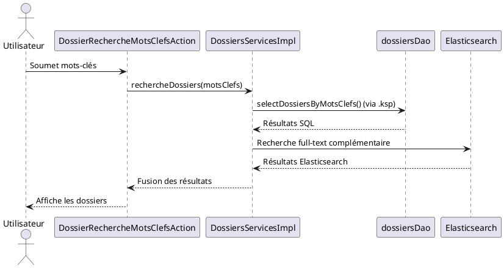

Voici une réponse structurée selon le **modèle C4** pour **SIREINES**, basée **uniquement sur les extraits documentaires fournis** (sans hypothèses externes) :

---

# **Dossier d'Architecture Technique (DAT) – SIREINES**
*Version 2.5.12 (23/02/2026) – Modèle C4 + Arc42*

**[TOC]**

---

## **1. Introduction et Objectifs**
**Vue d'ensemble** :
SIREINES est une application **MVC 3-tiers** avec génération **MDA (Model-Driven Architecture)** pour la couche données.
**Objectifs critiques** (basés sur l'analyse C4) :
- **Évolutivité** : Faciliter les changements de BDD via MDA (✅ *Bonne évaluation*).
- **Maintenabilité** : Réduire la dette technique liée à **Java 7 (EOL)** et aux classes volumineuses (>10 Ko) (❌ *Critique*).
- **Testabilité** : Améliorer l'injection de dépendances (⚠️ *Moyenne*, dépendances statiques).
- **Cohésion** : Maintenir la séparation par domaine métier (✅ *Bonne*).
- **Performance** : Optimiser les requêtes SQL dynamiques (ex. : `dossiersDao.ksp`).

---

## **2. Niveau 1 – Vue Contexte (System Context)**
### **Diagramme C4-L1**
```plantuml
@startuml
!include https://raw.githubusercontent.com/plantuml-stdlib/C4-PlantUML/master/C4_Context.puml

Person(utilisateur, "Agent SIREINES", "Recherche de dossiers par mots-clés")
System_Boundary(sireines, "SIREINES") {
    System(sireines_app, "Application SIREINES", "Java 7, Spring, MDA")
}
System(elasticsearch, "Elasticsearch", "Moteur de recherche embarqué")
System_db(bdd, "Base de données", "SQL (jointures complexes)")

Rel(utilisateur, sireines_app, "Recherche/Creation dossiers", "HTTP")
Rel(sireines_app, elasticsearch, "Indexation", "REST")
Rel(sireines_app, bdd, "Requêtes SQL dynamiques", "JDBC")
@enduml
```

### **Acteurs et Systèmes Externes**
| Type          | Nom               | Responsabilité                                  |
|---------------|-------------------|------------------------------------------------|
| **Utilisateur** | Agent SIREINES    | Recherche/création de dossiers par mots-clés. |
| **Système**    | Elasticsearch     | Indexation et recherche full-text.             |
| **Système**    | Base de données   | Stockage des dossiers/agents/mots-clés.       |

---

## **3. Parties Prenantes**
| Rôle                | Attente Principale                                                                 |
|---------------------|------------------------------------------------------------------------------------|
| **Développeur**      | Comprendre les dépendances entre `*ServicesImpl` et `*.ksp` pour maintenir le code. |
| **Exploitant**       | Superviser les requêtes SQL lourdes (5+ jointures dans `dossiersDao.ksp`).        |
| **MOA**             | Garantir la traçabilité des dossiers (liens agents/mots-clés).                     |
| **RSSI**            | Sécuriser les requêtes SQL dynamiques (`#criteria` dans `.ksp`).                   |

---

## **4. Contraintes**
### **Techniques**
- **Langage** : Java 7 (EOL, ❌ *Critique*).
- **BDD** : Requêtes SQL dynamiques avec jointures complexes (5+ tables).
- **Génération de code** : Fichiers `.ksp` (Keyword Scripting) pour les DAO (ex. : `dossiersDao.ksp`).
- **Pattern** : **MDA Vertigo** (injection de DAO via `@Inject` dans `DossiersServicesImpl`).

### **Organisationnelles**
- **Documentation** : Standards **C4 Model**, **Javadoc**, **Markdown** (versionné dans GitLab).
- **Modélisation** : Fichiers PowerDesigner (`.pdm`, `.oom`).

### **Sécurité (D-I-C-T)**
| Exigence       | Détail                                                                 |
|----------------|-----------------------------------------------------------------------|
| **Intégrité**  | Validation des données dans `DossiersServicesImpl.createDossier()`. |
| **Confidentialité** | Masquage des données sensibles dans les rapports BIRT (`BirtManagerImpl`). |
| **Traçabilité** | Logs des opérations SQL dynamiques (`#criteria` dans `.ksp`).        |

---

## **5. Niveau 2 – Vue Conteneurs (Containers)**
### **Diagramme C4-L2**
```plantuml
@startuml
!include https://raw.githubusercontent.com/plantuml-stdlib/C4-PlantUML/master/C4_Container.puml

Container(web_app, "SIREINES Web", "Java 7, Spring MVC", "Application principale")
Container(db, "Base de données", "SQL", "Stockage des dossiers/agents")
Container(es, "Elasticsearch", "Java", "Recherche full-text embarquée")
Container(birt, "BIRT", "Java", "Génération de rapports")

Rel(web_app, db, "Requêtes SQL dynamiques", "JDBC")
Rel(web_app, es, "Indexation/recherche", "REST")
Rel(web_app, birt, "Génération PDF", "API Java")
@enduml
```

### **Description des Conteneurs**
| Conteneur          | Technologie               | Responsabilité                                  | Décisions Architecturales                     |
|--------------------|---------------------------|------------------------------------------------|-----------------------------------------------|
| **SIREINES Web**   | Java 7, Spring MVC        | Logique métier, contrôleurs.                   | Pattern **MVC 3-tiers** + **MDA**.           |
| **Base de données**| SQL                       | Stockage des données (dossiers, agents, mots-clés). | Requêtes dynamiques via `.ksp`.              |
| **Elasticsearch**  | Java                      | Recherche full-text.                           | Intégré via `ESEmbeddedSearchServicesPlugin`. |
| **BIRT**          | Java                      | Génération de rapports PDF.                    | Utilisé par `BirtManagerImpl`.                |

### **Environnement Technique**
- **Backend** : Java 7 (❌ *EOL*), Spring (transactions via `@Transactional`).
- **Frontend** : JSP/FTL (fichiers `.jsp`, `.ftl`).
- **Build** : Maven (`pom.xml`).
- **CI/CD** : GitLab (fichiers versionnés en Markdown).
- **Tests** : Couverture limitée (⚠️ *dépendances statiques*).

---

## **6. Niveau 3 – Vue Composants (Components)**
### **Diagramme C4-L3 (Couche Service)**
```plantuml
@startuml
!include https://raw.githubusercontent.com/plantuml-stdlib/C4-PlantUML/master/C4_Component.puml

Container(web_app, "SIREINES Web", "Java 7, Spring") {
    Component(controller, "DossierRechercheMotsClefsAction", "Contrôleur", "Gère les requêtes utilisateur")
    Component(service, "DossiersServicesImpl", "Service", "Logique métier + transactions")
    Component(dao, "dossiersDao", "DAO", "Requêtes SQL générées depuis dossiersDao.ksp")
    Component(es_plugin, "ESEmbeddedSearchServicesPlugin", "Plugin", "Intégration Elasticsearch")
}

Rel(controller, service, "Appel métier", "Java")
Rel(service, dao, "Accès BDD", "JDBC")
Rel(service, es_plugin, "Indexation", "REST")
@enduml
```

### **Composants Clés**
| Composant                          | Responsabilité                                                                 | Complexité       |
|-------------------------------------|-------------------------------------------------------------------------------|------------------|
| `DossiersServicesImpl`              | Création/validation des dossiers (ex. : `createDossier()`).                 | ❌ Élevée (19 Ko).|
| `dossiersDao.ksp`                   | Requêtes SQL dynamiques (5+ jointures, critères `#criteria`).                | ❌ Complexe.     |
| `ESEmbeddedSearchServicesPlugin`   | Intégration d'Elasticsearch pour la recherche full-text.                     | ✅ Modulaire.    |
| `BirtManagerImpl`                   | Génération de rapports PDF via BIRT.                                          | ✅ Simple.       |

### **Problématiques Identifiées**
1. **Couplage fort** :
   - `DossiersServicesImpl` dépend directement de `dossiersDao` (généré depuis `.ksp`).
   - **Solution** : Introduire une interface `DossiersDao` pour faciliter les tests.
2. **Complexité SQL** :
   - Les requêtes dans `.ksp` contiennent des jointures multiples et des clauses dynamiques (`#criteria`).
   - **Risque** : Performances et maintenabilité.

---

## **7. Niveau 4 – Vue Code (Code)**
### **Exemples Critiques**
1. **Requête SQL dynamique** (`dossiersDao.ksp`) :
   ```sql
   select d.dos_id, a.nom as agent_nom, ...
   from dossier d
   join agent a on d.agt_id = a.agt_id
   left join mot_cle m1 on d.mcl_id_1 = m1.mcl_id
   -- 5 jointures supplémentaires
   where #criteria  -- ⚠️ Injection dynamique
   ```
   - **Risque** : Injection SQL si `#criteria` n'est pas sanitisé.

2. **Logique métier** (`DossiersServicesImpl.java`) :
   ```java
   @Transactional
   public Dossier createDossier(Agent agent, Dossier dossier) {
       // Validation + appels DAO + indexation Elasticsearch
   }
   ```
   - **Problème** : Méthode trop large (responsabilités multiples).

### **Recommandations**
- **Refactoriser** `createDossier()` en sous-méthodes (ex. : `validateDossier()`, `indexInElasticsearch()`).
- **Sécuriser** les requêtes dynamiques dans `.ksp` (utiliser des paramètres nommés).

---

## **8. Vue Exécution (Scénarios)**
### **Scénario : Recherche de Dossiers par Mots-Clés**


---

## **9. Vue Déploiement**
*(Section standardisée – adaptée à SIREINES)*

### **Diagramme C4-Déploiement**
```plantuml
@startuml
!include https://raw.githubusercontent.com/plantuml-stdlib/C4-PlantUML/master/C4_Deployment.puml

Deployment_Node(eco4, "Cloud ECO4", "OpenStack Tenant pnm3") {
    Deployment_Node(nginx, "Nginx Cluster", "Load Balancer") {
        Container(app, "SIREINES Web", "Java 7, Tomcat", "Application principale")
    }
    Deployment_Node(db, "Base de données", "PostgreSQL") {
        ContainerDb(database, "Database", "PostgreSQL", "Données métier")
    }
    Deployment_Node(es, "Elasticsearch", "Java") {
        Container(es_container, "Elasticsearch", "Java", "Recherche full-text")
    }
}

Rel(nginx, app, "HTTP/HTTPS")
Rel(app, database, "JDBC/SQL")
Rel(app, es_container, "REST")
@enduml
```

### **Environnements**
| Environnement | Hébergement       | Serveurs               | Réseau          | Particularités                     |
|---------------|-------------------|------------------------|-----------------|------------------------------------|
| Développement | Cloud ECO4        | 1 VM (2 vCPU, 4 Go)    | VLAN dédié      | Données de test anonymisées.      |
| Recette       | Cloud ECO4        | 2 VMs (load balancing) | DMZ              | Validation MOA.                    |
| Production    | Cloud ECO4 (pnm3) | 3 VMs + réplica BDD    | Redondé         | Sauvegardes cryptées (AES-256).    |

### **Supervision et Sauvegardes**
- **Outils** : Prometheus/Grafana, Portainer, PSIN.
- **Sauvegardes** :
  - Dumps BDD cryptés stockés sur **B3 (IaaS ministériel)**, **Outscale SecNumCloud**, et **Google Cloud**.

---

## **10. Sujets Transverses**
| Sujet               | Implémentation                                                                 |
|---------------------|-------------------------------------------------------------------------------|
| **Authentification** | Gérée via filtres Spring (`*Filter.java`).                                    |
| **Logs**            | Centralisés (fichiers `.log` + Loki).                                        |
| **Gestion d'erreurs** | `ErrorHandler.java` pour les exceptions métier.                              |
| **Internationalisation** | Fichiers `.properties` pour les libellés.                                   |

---

## **11. Exigences de Qualité**
| Exigence          | Scénario de Validation                                      | Statut       |
|-------------------|-------------------------------------------------------------|--------------|
| **Performance**   | Temps de réponse < 2s pour une recherche avec 5 mots-clés. | ⚠️ À mesurer.|
| **Sécurité**      | Aucune injection SQL via `#criteria` dans `.ksp`.           | ❌ Critique.  |
| **Maintenabilité**| Réduction de la taille des classes (>10 Ko).               | ❌ En dette.  |

---

## **12. Risques et Dettes Techniques**
| Risque/Dette                     | Impact                          | Solution Proposée                                  |
|----------------------------------|---------------------------------|----------------------------------------------------|
| **Java 7 (EOL)**                 | Vulnérabilités non corrigées.  | Migration vers Java 11+ (priorité haute).        |
| **Requêtes SQL dynamiques**      | Risque d'injection SQL.        | Utiliser des paramètres préparés dans `.ksp`.     |
| **Couplage fort DAO-Service**    | Difficulté à tester.           | Introduire des interfaces pour les DAO.           |
| **Classes volumineuses**         | Maintenabilité réduite.         | Refactoriser `DossiersServicesImpl` (19 Ko).      |

---

## **13. Annexes**
### **Glossaire**
| Terme               | Définition                                                                 |
|---------------------|---------------------------------------------------------------------------|
| **MDA**             | Model-Driven Architecture : génération de code depuis des modèles (ex. : `.ksp`). |
| **KSP**             | Keyword Scripting : fichiers de définition des requêtes SQL (ex. : `dossiersDao.ksp`). |
| **BIRT**            | Outil de reporting intégré (utilisé par `BirtManagerImpl`).              |

### **Décisions d'Architecture (ADR)**
1. **Utilisation de MDA** :
   - **Contexte** : Simplifier la maintenance des requêtes SQL.
   - **Conséquence** : Couplage fort entre `.ksp` et les services Java.

2. **Elasticsearch embarqué** :
   - **Contexte** : Besoin de recherche full-text sans dépendance externe.
   - **Conséquence** : Complexité accrue de l'infrastructure.

---
**Fin du DAT – SIREINES**
*Document généré selon le standard **C4 Model** (Simon Brown) + **Arc42**.*
*↩ [Retour au sommaire](#toc)*