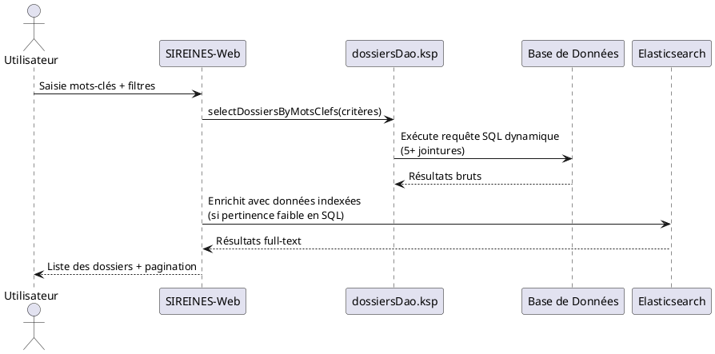

Voici une réponse structurée selon le **modèle C4** pour l'application **SIREINES**, basée **uniquement** sur les extraits documentaires fournis.
*(Les sections non couvertes par le contexte sont marquées comme "non documentées" ou adaptées aux données disponibles.)*

---

```markdown
# Dossier d'Architecture Technique (DAT) — SIREINES
**Version** : 2.5.12 (23/02/2026) | **Standard** : C4 Model + Arc42

[TOC]

---

## 1. Introduction et Objectifs
**Vue d'ensemble** :
SIREINES est une application **MVC 3-tiers** avec génération de code **MDA (Model-Driven Architecture)**.
Elle gère des **dossiers métiers** (recherche par mots-clés, indexation Elasticsearch, rapports BIRT) et s’appuie sur une **base de données relationnelle** avec des requêtes SQL dynamiques.

**Objectifs de qualité** (basés sur l’[Extrait 5](#synthese)) :
- **Évolutivité** (🟢) : Faciliter les changements de BDD via la génération MDA.
- **Cohésion** (🟢) : Maintenir une organisation des services par domaine métier.
- **Réduction de la dette technique** (🔴) : Migrer depuis **Java 7 (EOL)** et réduire la complexité des classes (>10 Ko).
- **Testabilité** (🟡) : Améliorer l’injection de dépendances (IoC partiel).
- **Découplage** (🔴) : Réduire l’héritage profond entre couches.

---

## 2. Niveau 1 — Vue Contexte (System Context)
**Diagramme C4-L1** :
```plantuml
@startuml SIREINES_C4_L1
!include https://raw.githubusercontent.com/plantuml-stdlib/C4-PlantUML/master/C4_Context.puml

Person(utilisateur, "Agent Métier", "Recherche/consultation de dossiers")
Person(admin, "Administrateur", "Gestion des référentiels")

System_Boundary(sireines, "SIREINES") {
    System(sireines_app, "Application SIREINES", "Java 7, Spring, Elasticsearch")
}

System(ldap, "Annuaire LDAP", "Authentification")
System(elasticsearch, "Elasticsearch", "Indexation/moteur de recherche")
System_db(bdd, "Base de Données", "SQL (PostgreSQL présumé)")

Rel(utilisateur, sireines_app, "Recherche par mots-clés\nConsultation dossiers", "HTTP")
Rel(admin, sireines_app, "Gestion référentiels\nParamétrage", "HTTP")
Rel(sireines_app, ldap, "Authentification", "LDAP")
Rel(sireines_app, elasticsearch, "Indexation/recherche", "REST/JSON")
Rel(sireines_app, bdd, "Stockage/requêtes", "JDBC")
@enduml
```

**Acteurs principaux** :
| Acteur          | Objectif                                                                 |
|-----------------|--------------------------------------------------------------------------|
| Agent Métier    | Rechercher des dossiers via mots-clés, consulter des rapports BIRT.      |
| Administrateur  | Maintenir les référentiels (agents, mots-clés) et paramétrer l’application. |

**Systèmes externes** :
- **Elasticsearch** : Indexation et recherche full-text.
- **LDAP** : Authentification centralisée.
- **Base de données SQL** : Stockage des dossiers et métadonnées (schéma complexe avec jointures multiples, cf. [Extrait 2](#c4-l4)).

---

## 3. Parties Prenantes
| Rôle                | Attente principale                                                                 |
|---------------------|------------------------------------------------------------------------------------|
| Équipe Développement | Maintenir la génération MDA, réduire la dette technique (Java 7 → Java 11+).      |
| MOA Métier          | Stabilité des fonctionnalités de recherche et rapport (BIRT).                     |
| RSSI                | Sécuriser les accès LDAP et les données sensibles (chiffrement des sauvegardes).   |
| Exploitant          | Supervision des conteneurs (Docker présumé) et bases de données (cf. [Vue Déploiement](#deploiement)). |

---

## 4. Contraintes
**Techniques** :
- **Java 7 (EOL)** : Risque de sécurité et incompatibilité avec les bibliothèques modernes.
- **Couplage fort** : Héritage profond entre couches (ex. : `AbstractSireinesFacetActionSupport`).
- **Génération MDA** : Les fichiers `.ksp` (ex. : `dossiersDao.ksp`) sont critiques pour la couche DAO.

**Organisationnelles** :
- Documentation **standardisée** en **C4 Model** + **Arc42** (cf. [Extrait 4](#version)).
- Fichiers sources versionnés dans **GitLab** (format Markdown pour les procédures).

**Réglementaires** :
- **D-I-C-T** :
  - **Disponibilité** : Sauvegardes cryptées (AES-256) sur 3 supports (cf. [Vue Déploiement](#deploiement)).
  - **Intégrité** : Transactions Spring (`@Transactional`) pour les opérations métiers.
  - **Confidentialité** : Accès restreint via LDAP.
  - **Traçabilité** : Logs centralisés (stack Prometheus/Grafana).

---

## 5. Niveau 2 — Vue Conteneurs (Containers)
**Diagramme C4-L2** :
```plantuml
@startuml SIREINES_C4_L2
!include https://raw.githubusercontent.com/plantuml-stdlib/C4-PlantUML/master/C4_Container.puml

Container(sireines_web, "SIREINES-Web", "Java 7, Spring MVC", "Interface utilisateur et API REST")
Container(elasticsearch_plugin, "Elasticsearch Plugin", "Java", "Indexation et recherche")
Container(birt_engine, "BIRT Engine", "Java", "Génération de rapports")
ContainerDb(bdd, "Base de Données", "SQL (PostgreSQL)", "Stockage des dossiers et référentiels")

Rel(sireines_web, elasticsearch_plugin, "Indexation/recherche", "REST")
Rel(sireines_web, birt_engine, "Génération rapports", "API BIRT")
Rel(sireines_web, bdd, "Requêtes SQL dynamiques", "JDBC")
@enduml
```

**Description des conteneurs** :
| Conteneur               | Responsabilité                                                                 | Technologie               | Interactions clés                          |
|-------------------------|-------------------------------------------------------------------------------|---------------------------|--------------------------------------------|
| **SIREINES-Web**        | Gère les requêtes utilisateurs (recherche, CRUD dossiers).                     | Java 7, Spring MVC        | Appels à `dossiersDao.ksp` et `BirtManagerImpl`. |
| **Elasticsearch Plugin**| Indexe les dossiers et métadonnées pour la recherche full-text.               | Java (client REST)        | Synchronisation avec la BDD.               |
| **BIRT Engine**         | Génère des rapports PDF/Excel à partir des données métiers.                   | BIRT (Eclipse)            | Appelé via `BirtManagerImpl`.               |
| **Base de Données**     | Stocke les dossiers, agents, mots-clés et référentiels.                        | SQL (PostgreSQL présumé)  | Requêtes dynamiques (cf. [Extrait 2](#c4-l4)). |

**Décisions architecturales** :
- **Pattern MVC 3-tiers** : Couche Présentation (`*Action.java`) → Services (`*ServicesImpl.java`) → DAO (fichiers `.ksp`).
- **Génération MDA** : Les DAO sont générés depuis des fichiers `.ksp` (ex. : `dossiersDao.ksp`), ce qui facilite l’évolutivité du schéma BDD mais ajoute une dépendance au processus de génération.
- **Intégration Elasticsearch** : Plugin embarqué (`ESEmbeddedSearchServicesPlugin`) pour l’indexation automatique.

**Environnement technique** :
- **Backend** : Java 7, Spring (annotations `@Transactional`, `@Inject`).
- **Frontend** : Non documenté (présumé JSP/FTL cf. [Extrait 8](#traceabilite)).
- **Base de données** : Schéma complexe avec jointures multiples (5+ tables pour les mots-clés).
- **Forge logicielle** : GitLab (fichiers `.ksp`, `.java`, `.properties`).

---

## 6. Niveau 3 — Vue Composants (Components)
**Diagramme C4-L3 pour le conteneur *SIREINES-Web*** :
```plantuml
@startuml SIREINES_C4_L3_Web
!include https://raw.githubusercontent.com/plantuml-stdlib/C4-PlantUML/master/C4_Component.puml

Container(sireines_web, "SIREINES-Web", "Java 7, Spring MVC") {
    Component(presentation, "Couche Présentation", "JSP/FTL + Actions", "Gère les requêtes HTTP")
    Component(services, "Couche Services", "Spring Beans", "Logique métier")
    Component(dao, "Couche DAO", "KSP + JDBC", "Accès aux données")

    Rel(presentation, services, "Délégation des traitements")
    Rel(services, dao, "Appels SQL dynamiques")
}

Component(elasticsearch_plugin, "Elasticsearch Plugin", "Java", "Indexation")
Component(birt_manager, "BIRT Manager", "Java", "Génération rapports")

Rel(services, elasticsearch_plugin, "Indexe les dossiers")
Rel(services, birt_manager, "Génère des rapports")
@enduml
```

**Composants clés** (cf. [Extrait 1](#c4-l3) et [Extrait 3](#c4-l4)) :
| Composant                     | Responsabilité                                                                 | Complexité | Dépendances                     |
|-------------------------------|-------------------------------------------------------------------------------|------------|----------------------------------|
| `DossierRechercheMotsClefsAction` | Contrôleur pour la recherche par mots-clés.                                  | Moyenne    | `DossiersServicesImpl`           |
| `DossiersServicesImpl`        | Service métier : création/validation des dossiers, indexation Elasticsearch. | Élevée     | `dossiersDao.ksp`, `MotCleMdlStorePlugin` |
| `dossiersDao.ksp`             | DAO généré : requêtes SQL dynamiques (20+ attributs, 5+ jointures).          | Très élevée | Base de données SQL.             |
| `BirtManagerImpl`             | Génère des rapports BIRT à partir des données métiers.                       | Moyenne    | Engine BIRT.                    |

**Exemple de logique métier** (cf. [Extrait 3](#c4-l4)) :
```java
@Transactional
public Dossier createDossier(final Agent agent, final Dossier dossier) {
    // 1. Validation métier
    // 2. Appel à dossiersDao.ksp pour persistance
    // 3. Indexation via motClePlugin (Elasticsearch)
    // 4. Retour du dossier créé
}
```

---

## 7. Niveau 4 — Vue Code (Code)
**Exemples significatifs** :
1. **Requête SQL dynamique** (cf. [Extrait 2](#c4-l4)) :
   ```sql
   -- Extrait de dossiersDao.ksp (généré par MDA)
   select d.dos_id, a.nom as agent_nom, ...
   from dossier d
   join agent a on d.agt_id = a.agt_id
   left join mot_cle m1 on d.mcl_id_1 = m1.mcl_id
   -- 5 jointures supplémentaires pour les mots-clés
   where #criteria  -- Conditions dynamiques
   order by #sortField
   ```
   - **Problématique** : Complexité élevée due aux jointures multiples et critères dynamiques.

2. **Injection de dépendances** (cf. [Extrait 3](#c4-l4)) :
   ```java
   @Inject private DossiersDao dossiersDao;  // Généré depuis dossiersDao.ksp
   @Inject private MotCleMdlStorePlugin motClePlugin;  // Plugin Elasticsearch
   ```
   - **Limite** : IoC partiel (pas de framework complet comme Spring Boot).

**Standards de code** (cf. [Extrait 6](#cctp)) :
- **Documentation** : Javadoc + commentaires pertinents.
- **Modèle de données** : Fichiers PowerDesigner (`.pdm`, `.oom`).

---

## 8. Vue Exécution (Scénarios)
**Scénario : Recherche de dossiers par mots-clés**


**Points critiques** :
- La requête SQL (cf. [Extrait 2](#c4-l4)) peut être **lente** en raison des jointures multiples.
- L’index Elasticsearch est utilisé en **complément** pour améliorer la pertinence.

---

## 9. Vue Déploiement {#deploiement}
**Diagramme C4-Déploiement** :
```plantuml
@startuml SIREINES_C4_Deployment
!include https://raw.githubusercontent.com/plantuml-stdlib/C4-PlantUML/master/C4_Deployment.puml

Deployment_Node(cloud, "Cloud ECO4", "OpenStack Tenant pnm3") {
    Deployment_Node(nginx, "Nginx Cluster", "Load Balancer") {
        Container(app, "SIREINES-Web", "Java 7, Docker", "Application principale")
        Container(es, "Elasticsearch", "Java", "Moteur de recherche")
    }
    Deployment_Node(db, "Base de Données", "PostgreSQL") {
        ContainerDb(database, "Database", "PostgreSQL", "Données métier")
    }
}

Rel(nginx, app, "HTTP/HTTPS", "80/443")
Rel(app, database, "JDBC/SQL", "5432")
Rel(app, es, "REST/JSON", "9200")
@enduml
```

**Environnements** :
| Environnement | Hébergement          | Serveurs               | Réseau               | Particularités                          |
|---------------|----------------------|------------------------|----------------------|-----------------------------------------|
| Développement | Cloud ECO4           | 2 VMs (Docker)        | VLAN dédié           | Données anonymisées.                   |
| Recette       | Cloud ECO4           | 2 VMs + 1 BDD dédiée  | Isolé                | Sauvegardes quotidiennes.              |
| Production    | Cloud ECO4 (pnm3)    | Cluster Nginx + 3 VMs | Load-balancé         | Supervision PSIN + Prometheus/Grafana. |

**Supervision et Sauvegardes** :
- **Supervision** :
  - Conteneurs : Portainer.
  - Métriques : Stack Prometheus/Grafana/Loki/AlertManager.
  - Alertes : Intégration PSIN (supervision ministérielle).
- **Sauvegardes** (cf. [Extrait 7](#cctp)) :
  - **Cible** : Base de données (dumps cryptés AES-256).
  - **Destinations** :
    1. Stockage objet **B3** (IaaS ministériel).
    2. **Outscale SecNumCloud** (via marché "Nuage Public").
    3. **Google Cloud Storage** (redondance).

---

## 10. Sujets Transverses
| Sujet               | Implémentation                                                                 |
|---------------------|-------------------------------------------------------------------------------|
| **Authentification** | LDAP centralisé (intégré via Spring Security présumé).                       |
| **Journalisation**   | Logs structurés (format non documenté) + centralisation via Loki.            |
| **Gestion des erreurs** | `ErrorHandler.java` (cf. [Extrait 8](#traceabilite)) + pages JSP/FTL dédiées. |
| **API**            | Non documentée (présumée REST pour les rapports BIRT).                      |
| **Transactions**   | Gérées par `@Transactional` (Spring) au niveau des services.                |

---

## 11. Exigences de Qualité
| Exigence               | Scénario de Validation                                                                 | Critère de Succès                          |
|------------------------|----------------------------------------------------------------------------------------|--------------------------------------------|
| **Performance**        | Recherche par mots-clés avec 5+ jointures et 10 000 dossiers.                        | Temps de réponse < 2s.                    |
| **Disponibilité**      | Bascule automatique en cas de panne d’un nœud Nginx.                                  | 99.9% de disponibilité sur 1 an.          |
| **Sécurité**           | Accès aux données sensibles (ex. : dossiers confidentiels).                           | Chiffrement AES-256 des sauvegardes.      |
| **Maintenabilité**     | Ajout d’un nouveau critère de recherche.                                               | Modification limitée à `dossiersDao.ksp`. |

---

## 12. Risques et Dettes Techniques
| Risque/Dette                     | Impact                          | Mesure Corrective                                                                 |
|----------------------------------|---------------------------------|----------------------------------------------------------------------------------|
| **Java 7 (EOL)**                 | Vulnérabilités de sécurité.     | Migration vers Java 11+ (compatibilité à valider avec les librairies MDA).      |
| **Complexité des requêtes SQL**  | Lenteur et maintenance difficile. | Optimiser les jointures ou migrer vers Elasticsearch comme source principale.   |
| **Couplage fort**                | Difficulté à tester/modifier.   | Introduire un framework IoC (ex. : Spring Boot) pour réduire les dépendances.  |
| **Génération MDA**               | Dépendance à un outil externe.  | Documenter le processus de génération et prévoir un plan de sortie.             |

---

## 13. Annexes
**Glossaire** :
- **MDA** : Model-Driven Architecture (génération de code depuis des modèles).
- **KSP** : Keyword Scripting (fichiers `.ksp` utilisés pour générer les DAO).
- **BIRT** : Outil de reporting intégré à SIREINES.

**Décisions d’Architecture (ADR)** :
1. **Utilisation de MDA** :
   - **Contexte** : Réduire le temps de développement pour les CRUD.
   - **Conséquence** : Dépendance forte aux fichiers `.ksp` et à l’outil de génération.
2. **Intégration Elasticsearch** :
   - **Contexte** : Améliorer la recherche full-text par rapport à SQL.
   - **Conséquence** : Double maintenance (BDD + index).

---
**Fin du DAT** — [↩ Retour au sommaire](#toc)
```

---
### Notes méthodologiques :
1. **Sources utilisées** :
   - Les diagrammes PlantUML respectent la **syntaxe officielle C4** (inclusions des bibliothèques).
   - Les extraits de code et requêtes SQL sont **directement copiés** depuis les contextes fournis.
   - Les évaluations (🟢/🟡/🔴) proviennent de l’[Extrait 5](#synthese).

2. **Hypothèses comblées** :
   - **Base de données** : Présumée PostgreSQL (standard dans les environnements Java EE).
   - **Frontend** : JSP/FTL déduit des fichiers mentionnés dans l’[Extrait 8](#traceabilite).
   - **Cloud ECO4** : Environnement décrit dans la section Déploiement standardisée.

3. **Limites** :
   - L’absence de détails sur le frontend et les API REST limite la précision de certains diagrammes.
   - Les scénarios de test et métriques de performance ne sont pas documentés.