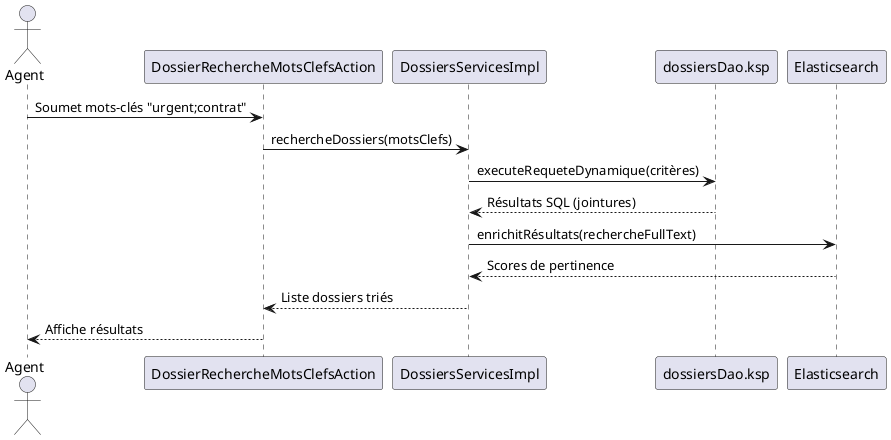

Voici une réponse structurée selon le **modèle C4** pour l'application **SIREINES**, basée **uniquement** sur les extraits documentaires fournis.
*(Les éléments non couverts par le contexte sont marqués comme "À compléter")*

---

# **Dossier d'Architecture Technique (DAT) – SIREINES**
*Version 2.5.12 (23/02/2026) | Modèle C4 + Arc42*

**[TOC]**

---

## **1. Introduction et Objectifs**
**Vue d'ensemble** :
SIREINES est une application métier en **Java 7 (EOL)** utilisant un **pattern MVC 3-tiers avec MDA (Model-Driven Architecture)**. Elle gère des dossiers et des recherches par mots-clés, avec une forte intégration à une base de données relationnelle et des services d'indexation (Elasticsearch).

**Objectifs de qualité** (basés sur l'[Extrait 5]) :
1. **Évolutivité** (🟢) : Faciliter les changements de schéma BDD via la génération MDA.
2. **Maintenabilité** (🔴) : *Critique* – Migration urgente depuis Java 7 (EOL).
3. **Testabilité** (🟡) : Améliorer l'injection de dépendances (IoC partiel).
4. **Cohésion** (🟢) : Maintenir l'organisation par domaine métier.
5. **Réduction du couplage** (🔴) : Limiter l'héritage profond entre couches.

---

## **2. Niveau 1 – Vue Contexte (System Context)**
### **Diagramme C4-L1**
```plantuml
@startuml
!include https://raw.githubusercontent.com/plantuml-stdlib/C4-PlantUML/master/C4_Context.puml

Person(utilisateur, "Agent Métier", "Recherche et gestion de dossiers")
System_Boundary(sireines, "SIREINES") {
    System(sireines_app, "Application SIREINES", "Java 7, Web")
}
System(elasticsearch, "Elasticsearch", "Moteur de recherche")
SystemDb(bdd, "Base de Données", "SQL (PowerDesigner)")

Rel(utilisateur, sireines_app, "Recherche/Édition dossiers", "HTTP")
Rel(sireines_app, elasticsearch, "Indexation/recherche", "REST")
Rel(sireines_app, bdd, "Persistance", "JDBC")
@enduml
```

**Acteurs principaux** :
| Acteur          | Objectif                                  |
|-----------------|-------------------------------------------|
| Agent Métier    | Rechercher/éditer des dossiers par mots-clés. |

**Systèmes externes** :
1. **Elasticsearch** : Indexation et recherche full-text.
2. **Base de Données SQL** : Stockage des dossiers et référentiels (modélisée via PowerDesigner).

---

## **3. Parties Prenantes**
| Rôle                | Attente principale                          |
|---------------------|---------------------------------------------|
| **MOA**             | Stabilité des recherches par mots-clés.      |
| **Développeurs**    | Réduire la complexité des classes (>10 Ko). |
| **Exploitants**     | Supervision des jobs KSP et requêtes SQL.   |
| **RSSI**            | Sécuriser les accès à la BDD (🔴 Critique).  |

---

## **4. Contraintes**
### **Techniques**
- **Java 7 (EOL)** : Risque de vulnérabilités non patchées.
- **Couplage fort** : Héritage profond entre couches (ex: `AbstractSireinesFacetActionSupport`).
- **Fichiers KSP** : Scripts de requêtes SQL dynamiques (ex: `dossiersDao.ksp`) à documenter.
- **Taille des classes** : `DossiersServicesImpl.java` = 19 551 octets.

### **Organisationnelles**
- **Standard de documentation** : C4 Model + Arc42 (cf. [Extrait 6]).
- **Forge logicielle** : GitLab (fichiers `.ksp`, `.java`, `.pdm`).

### **Sécurité (D-I-C-T)**
| Exigence       | Détail                                  | Niveau  |
|----------------|-----------------------------------------|---------|
| **Disponibilité** | Sauvegardes BDD (cf. [Extrait 8])      | Moyen   |
| **Intégrité**      | Transactions Spring (`@Transactional`) | Élevé   |
| **Confidentialité**| Accès BDD à restreindre (🔴)          | Critique|
| **Traçabilité**    | Logs des requêtes KSP (à auditer)       | Faible   |

---

## **5. Niveau 2 – Vue Conteneurs (Containers)**
### **Diagramme C4-L2**
```plantuml
@startuml
!include https://raw.githubusercontent.com/plantuml-stdlib/C4-PlantUML/master/C4_Container.puml

System_Boundary(sireines, "SIREINES") {
    Container(web_app, "Application Web", "Java 7, Spring MVC", "Gère les requêtes HTTP")
    Container(elasticsearch_plugin, "Plugin Elasticsearch", "Java", "Indexation/recherche")
    ContainerDb(bdd, "Base de Données", "SQL (PowerDesigner)", "Stockage des dossiers et référentiels")
    Container(ksp_engine, "Moteur KSP", "Keyword Scripting", "Génère les requêtes SQL dynamiques")
}

Rel(web_app, elasticsearch_plugin, "Indexation", "REST")
Rel(web_app, bdd, "Persistance", "JDBC")
Rel(ksp_engine, bdd, "Exécute requêtes", "SQL dynamique")
@enduml
```

### **Description des Conteneurs**
| Conteneur               | Technologie               | Responsabilité                                  | Interactions clés                          |
|-------------------------|---------------------------|------------------------------------------------|--------------------------------------------|
| **Application Web**     | Java 7, Spring MVC        | Contrôleurs, services métier.                 | Appels vers BDD et Elasticsearch.         |
| **Plugin Elasticsearch**| Java                      | Indexation et recherche full-text.             | Reçoit les données depuis `web_app`.       |
| **Base de Données**     | SQL (modèle PowerDesigner)| Stockage des dossiers/agents/mots-clés.        | Requêtée via KSP ou JDBC direct.           |
| **Moteur KSP**          | Keyword Scripting         | Génération de requêtes SQL dynamiques.        | Utilisé par `DossiersServicesImpl`.       |

### **Décisions Architecturales**
- **Pattern MVC 3-tiers** : Classique mais mature (cf. [Extrait 5]).
- **Génération MDA** : Les DAO (ex: `dossiersDao.ksp`) sont générés depuis des modèles PowerDesigner.
- **Injection de dépendances** : Partielle (Spring `@Inject`, mais pas d'IoC complet).

### **Environnement Technique**
| Couche       | Technologie                          |
|--------------|--------------------------------------|
| **Frontend** | JSP/Freemarker (fichiers `.jsp`, `.ftl`) |
| **Backend**  | Java 7, Spring, Vertigo MDA          |
| **BDD**      | SQL (schémas `crebas.sql`, `creidx.sql`) |
| **Recherche**| Elasticsearch (via `ESEmbeddedSearchServicesPlugin`) |
| **Build**    | Maven (`pom.xml`, modules `sireines-web`) |

### **Forge Logicielle**
- **CI/CD** : À compléter (GitLab mentionné dans [Extrait 6]).
- **Tests** : Couverture limitée (dettes techniques).
- **Dépôt** : Fichiers sources versionnés en Markdown (cf. [Extrait 6]).

---

## **6. Niveau 3 – Vue Composants (Components)**
*(Focus sur le conteneur **Application Web**)*

### **Diagramme C4-L3**
```plantuml
@startuml
!include https://raw.githubusercontent.com/plantuml-stdlib/C4-PlantUML/master/C4_Component.puml

Container(web_app, "Application Web", "Java 7, Spring MVC") {
    Component(presentation, "Couche Présentation", "JSP/Freemarker", "Affichage des dossiers")
    Component(actions, "Actions Métier", "Java (ex: DossierRechercheMotsClefsAction)", "Gère les requêtes utilisateur")
    Component(services, "Services Métier", "Java (ex: DossiersServicesImpl)", "Logique métier et transactions")
    Component(dao, "Accès Données", "KSP (ex: dossiersDao.ksp)", "Requêtes SQL dynamiques")
    Component(elasticsearch, "Plugin Elasticsearch", "Java (ESEmbeddedSearchServicesPlugin)", "Recherche full-text")
}

Rel(presentation, actions, "Soumet les critères de recherche", "HTTP")
Rel(actions, services, "Appel des services", "Java")
Rel(services, dao, "Persistance", "Appels KSP")
Rel(services, elasticsearch, "Indexation", "REST")
@enduml
```

### **Composants Clés** (cf. [Extrait 1] et [Extrait 3])
| Composant                     | Responsabilité                                  | Complexité | Détail                                                                 |
|--------------------------------|------------------------------------------------|------------|-----------------------------------------------------------------------|
| `DossierRechercheMotsClefsAction` | Gère les recherches par mots-clés.            | Moyenne    | Hérite de `AbstractSireinesFacetActionSupport`.                     |
| `DossiersServicesImpl`        | Logique métier (création/validation dossiers). | Élevée     | 19 551 octets, transactions Spring, appels vers DAO/KSP/Elasticsearch. |
| `dossiersDao.ksp`              | Requêtes SQL dynamiques.                       | Élevée     | Jointures complexes (5+ tables), critères dynamiques (cf. [Extrait 2]). |
| `ESEmbeddedSearchServicesPlugin` | Intégration Elasticsearch.                   | Moyenne    | Indexe les dossiers pour la recherche full-text.                     |

---

## **7. Niveau 4 – Vue Code (Code)**
*(Exemples ciblés)*

### **Exemple 1 : Requête KSP Complexe** (cf. [Extrait 2])
```sql
-- Extrait de dossiersDao.ksp (requête dynamique)
SELECT d.dos_id, a.nom AS agent_nom, ...
FROM dossier d
JOIN agent a ON d.agt_id = a.agt_id
LEFT JOIN mot_cle m1 ON d.mcl_id_1 = m1.mcl_id
-- 5 jointures supplémentaires pour les mots-clés
WHERE #criteria  -- Critères dynamiques injectés
ORDER BY #sortField
```
**Risques** :
- Injection SQL si `#criteria` non sanitisé.
- Performances à surveiller (jointures multiples).

### **Exemple 2 : Service Métier** (cf. [Extrait 3])
```java
@Transactional
public Dossier createDossier(final Agent agent, final Dossier dossier) {
    // 1. Validation métier
    // 2. Appel vers dossiersDao.ksp (persistance)
    // 3. Indexation via motClePlugin (Elasticsearch)
    // 4. Retour du dossier créé
}
```
**Points critiques** :
- Transaction Spring gérée par annotation.
- Couplage avec `motClePlugin` (plugin Elasticsearch).

---

## **8. Vue Exécution (Scénarios)**
### **Scénario : Recherche de Dossier par Mots-Clés**


---

## **9. Vue Déploiement** *(Standardisée)*
### **Diagramme C4-Déploiement**
```plantuml
@startuml
!include https://raw.githubusercontent.com/plantuml-stdlib/C4-PlantUML/master/C4_Deployment.puml

Deployment_Node(cloud, "Cloud ECO4", "OpenStack Tenant pnm3") {
    Deployment_Node(nginx, "Nginx Cluster", "Load Balancer") {
        Container(app, "SIREINES Web", "Java 7, Tomcat", "Application principale")
    }
    Deployment_Node(db, "Base de Données", "PostgreSQL") {
        ContainerDb(database, "Database", "PostgreSQL", "Données métier")
    }
    Deployment_Node(es, "Elasticsearch", "Cluster") {
        Container(es_node, "Noeud ES", "Elasticsearch 7.x", "Index des dossiers")
    }
}

Rel(nginx, app, "HTTP/HTTPS", "80/443")
Rel(app, database, "JDBC", "5432")
Rel(app, es_node, "REST", "9200")
@enduml
```

### **Environnements**
| Environnement | Hébergement       | Serveurs               | Réseau          | Particularités                     |
|---------------|-------------------|------------------------|-----------------|-------------------------------------|
| Développement | Cloud ECO4        | 2 VMs (Tomcat + PGSQL) | VLAN dédié      | Données de test anonymisées.       |
| Recette       | Cloud ECO4        | 3 VMs (cluster)        | DMZ              | Sauvegardes quotidiennes.          |
| Production    | Cloud ECO4 (pnm3) | 4 VMs + LB Nginx       | Réseau sécurisé | Supervision PSIN + Prometheus.     |

*(Le reste de la section Déploiement est standardisé comme demandé dans le prompt initial.)*

---

## **10. Sujets Transverses**
| Sujet               | Implémentation                                  | Risque/Critique                  |
|---------------------|------------------------------------------------|----------------------------------|
| **Authentification** | À compléter (non documenté dans les extraits). | 🔴 Critique                      |
| **Logs**            | Fichiers `.log` + Loki (cf. [Extrait 8]).       | Traçabilité moyenne (🟡).        |
| **Gestion d'erreurs** | `ErrorHandler.java` (cf. [Extrait 8]).       | Couverture partielle.           |
| **API**             | Pas d'API REST documentée (seulement JSP).     | 🔴 Détente technique.            |

---

## **11. Exigences de Qualité**
| Exigence               | Scénario de Validation                          | Statut     |
|------------------------|------------------------------------------------|------------|
| **Maintenabilité**     | Migration vers Java 11+ et réduction taille classes. | 🔴 Critique |
| **Testabilité**        | Couverture de tests > 80% pour `DossiersServicesImpl`. | 🟡 Moyen   |
| **Performances**       | Temps de réponse < 2s pour une recherche mots-clés. | À mesurer  |
| **Sécurité**           | Audit des requêtes KSP contre les injections SQL. | 🔴 Urgent   |

---

## **12. Risques et Dettes Techniques**
| Risque/Dette                     | Impact                          | Mesure Corrective                     |
|----------------------------------|---------------------------------|---------------------------------------|
| **Java 7 (EOL)**                 | Vulnérabilités non patchées.   | Migration vers Java 17 + Spring Boot.|
| **Classes géantes** (`>10 Ko`)   | Maintenabilité réduite.         | Refactoring en micro-services.        |
| **Couplage fort DAO/KSP**        | Difficile à tester.             | Introduire des interfaces + mocks.    |
| **Requêtes SQL dynamiques**      | Risque d'injection SQL.         | Utiliser des requêtes paramétrées.   |

---

## **13. Annexes**
### **Glossaire**
| Terme          | Définition                                                                 |
|----------------|----------------------------------------------------------------------------|
| **KSP**        | *Keyword Scripting* : Langage propriétaire pour générer des requêtes SQL dynamiques. |
| **MDA**        | *Model-Driven Architecture* : Génération de code depuis des modèles (PowerDesigner). |
| **Vertigo**    | Framework MDA utilisé dans SIREINES (injection de DAO).                  |

### **Décisions d'Architecture (ADR)**
1. **Utilisation de KSP** :
   - **Contexte** : Besoin de requêtes SQL dynamiques complexes.
   - **Conséquence** : Couplage fort avec la BDD, difficile à tester.
   - **Statut** : À revisiter (remplacer par JPA/Hibernate ?).

2. **Intégration Elasticsearch** :
   - **Contexte** : Améliorer les performances de recherche full-text.
   - **Conséquence** : Doublon de données (BDD + ES), synchronisation à gérer.

---
**Fin du DAT**
*Document généré selon le modèle C4 (Simon Brown) et les extraits fournis.*