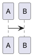

# Module Diagrams - Ambulon

## Vue d'ensemble

Le module `diagrams` fournit une API unifiée pour :
1. La détection et conversion de diagrammes (PlantUML, Mermaid, Graphviz) vers SVG
2. La conversion de documents Markdown vers HTML avec support intégré des diagrammes

> **Distinction importante** : La commande `md2html` (module `conversion`) convertit Markdown en HTML **sans** traiter les diagrammes. Pour convertir **avec** les diagrammes en SVG, utilisez la commande `md2html-diagrams` (module `diagrams`).

## Commandes disponibles

| Commande | Module | Description |
|----------|--------|-------------|
| `md2html` | `conversion` | Markdown → HTML (SANS conversion des diagrammes) |
| `md2html-diagrams` | `diagrams` | Markdown → HTML **AVEC** conversion des diagrammes en SVG |
| `diagram2svg4md` | `diagrams` | Convertit les diagrammes en SVG inline dans Markdown |

## Structure

```
diagrams/
├── __init__.py           # Exports publics du module
├── README.md             # Ce fichier
├── commands/             # Commandes CLI
│   ├── diagram2svg4md.py # Diagrammes → SVG inline
│   └── md2html.py        # Markdown → HTML avec diagrammes
└── core/                 # Core unifié
    ├── __init__.py       # Exports du core
    ├── base.py           # Types et classes de base
    ├── checker.py        # Vérification PlantUML
    ├── converters.py     # Conversion vers SVG
    ├── detector.py       # Détection des diagrammes
    ├── extractor.py      # Extraction vers fichiers
    ├── markdown_to_html.py  # Conversion MD→HTML
    ├── svg_utils.py      # Utilitaires SVG
    ├── diagram_detector.py  # SHIM (compatibilité)
    └── plantuml_converter.py # SHIM (compatibilité)
```

## Utilisation

### Markdown → HTML (avec diagrammes)

Pour convertir un fichier Markdown en HTML **avec conversion des diagrammes** en SVG :

```bash
# CLI
ambulon md2html-diagrams document.md
ambulon md2html-diagrams doc.md -o out.html --plantuml-method jar -p landscape

# Python
from app.diagrams import process_markdown_to_html

process_markdown_to_html(
    markdown_path="doc.md",
    output_path="doc.html",
    plantuml_method="jar",  # ou "kroki" (défaut) ou "auto"
    plantuml_jar="/path/to/plantuml.jar",
    page_orientation="landscape",
    add_toc_backlinks=True
)
```

### Markdown → HTML (sans diagrammes)

Pour une conversion **simple sans diagrammes** (les blocs PlantUML/Mermaid restent en texte) :

```bash
# CLI
ambulon md2html document.md

# Python
from app.conversion import process_markdown_to_html_simple

process_markdown_to_html_simple("doc.md", "doc.html")
```

### Détection de diagrammes

```python
from app.diagrams import extract_diagram_blocks, has_diagrams

content = """
# Document


"""

# Vérifier s'il y a des diagrammes
if has_diagrams(content):
    print("Document contains diagrams")

# Extraire les diagrammes
diagrams = extract_diagram_blocks(content)
for diagram in diagrams:
    print(f"Type: {diagram.type_name}")
    print(f"Content: {diagram.content}")
    print(f"Lines: {diagram.start_line}-{diagram.end_line}")
```

### Conversion de diagrammes

```python
from app.diagrams import convert_plantuml, convert_mermaid, convert_graphviz
from app.diagrams.core import ConversionMethod

# PlantUML via Kroki (défaut)
result = convert_plantuml("@startuml\nA -> B\n@enduml")
if result.success:
    svg = result.svg_content

# PlantUML via JAR local
result = convert_plantuml(
    plantuml_code,
    method=ConversionMethod.JAR,
    plantuml_jar="/path/to/plantuml.jar"
)

# Mermaid
result = convert_mermaid("graph TD\n  A --> B")

# Graphviz
result = convert_graphviz("digraph { A -> B }")
```

### Nettoyage SVG

```python
from app.diagrams import clean_svg_content, optimize_svg_for_pdf

# Nettoyage pour intégration inline
svg = clean_svg_content(raw_svg)

# Optimisation pour PDF
svg = optimize_svg_for_pdf(raw_svg, page_orientation='landscape')
```

### Vérification PlantUML

```python
from app.diagrams import PlantUMLChecker, check_plantuml_file

# Vérifier un fichier
checker = PlantUMLChecker("document.md")
checker.check_all()
print(f"Found {len(checker.violations)} violations")

# Générer un rapport
report_path = checker.generate_report("report.md")

# Fonction utilitaire
violations, errors = check_plantuml_file("doc.md", "violations.md")
```

### Extraction vers fichiers

```python
from app.diagrams import extract_diagrams_to_files
from app.diagrams.core import DiagramType

# Extraire tous les diagrammes
exit_code, files = extract_diagrams_to_files(
    input_path=Path("document.md"),
    output_dir=Path("diagrams/")
)

# Extraire seulement PlantUML
exit_code, files = extract_diagrams_to_files(
    input_path=Path("document.md"),
    output_dir=Path("diagrams/"),
    allowed_types=[DiagramType.PLANTUML]
)
```

## Différence entre `md2html` et `md2html-diagrams`

| Aspect | `md2html` (conversion) | `md2html-diagrams` (diagrams) |
|--------|------------------------|-------------------------------|
| **Diagrammes** | Non convertis | Convertis en SVG |
| **Commande** | `ambulon md2html` | `ambulon md2html-diagrams` |
| **Module** | `app.conversion` | `app.diagrams` |
| **Options** | Basiques | Inclut `--plantuml-method`, `--plantuml-jar`, `-p` |
| **Usage** | Documentation simple | Documentation technique avec schémas |

## Migration depuis les anciens modules

### Ancien code (processing/diagram_extractor)

```python
# AVANT
from app.processing.core.diagram_extractor import isolate_diagrams_logic

exit_code, files = isolate_diagrams_logic(
    input_path=Path("doc.md"),
    output_dir=Path("out/"),
    allowed_types=["plantuml"]
)
```

### Nouveau code

```python
# APRÈS
from app.diagrams import extract_diagrams_to_files
from app.diagrams.core import DiagramType

exit_code, files = extract_diagrams_to_files(
    input_path=Path("doc.md"),
    output_dir=Path("out/"),
    allowed_types=[DiagramType.PLANTUML]
)
```

### Ancien code (encoding/plantuml_checker)

```python
# AVANT
from app.encoding.core.plantuml_checker import PlantUMLChecker
```

### Nouveau code

```python
# APRÈS
from app.diagrams import PlantUMLChecker
# ou
from app.diagrams.core import PlantUMLChecker
```

## Dépendances

- `requests` - Pour les appels API Kroki
- `python-slugify` - Pour le slugification des noms de fichiers

## Variables d'environnement

- `PLANTUML_JAR` - Chemin vers le fichier JAR PlantUML
- `GRAPHVIZ_EXE` - Chemin vers l'exécutable dot (Graphviz)

## Tests

```bash
# Tests unitaires
pytest tests/unit/diagrams/ -v

# Tests d'intégration
pytest tests/integration/test_md2html.py -v
```

## Notes

- Le module maintient la compatibilité ascendante avec les imports existants
- Les anciens modules (`diagram_detector`, `plantuml_converter`) sont maintenant des shims qui ré-exportent depuis le core unifié
- Il est recommandé de migrer vers les nouveaux imports pour bénéficier des améliorations
