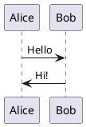
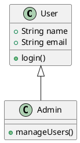

# Test Diagramme PlantUML

Voici un exemple de diagramme de séquence :

```plantuml
@startuml
Alice -> Bob: Hello
Bob -> Alice: Hi!
@enduml
```

Et un diagramme de classes :

```plantuml
@startuml
class User {
  +String name
  +String email
  +login()
}
class Admin {
  +manageUsers()
}
User <|-- Admin
@enduml
```

Fin du document.
