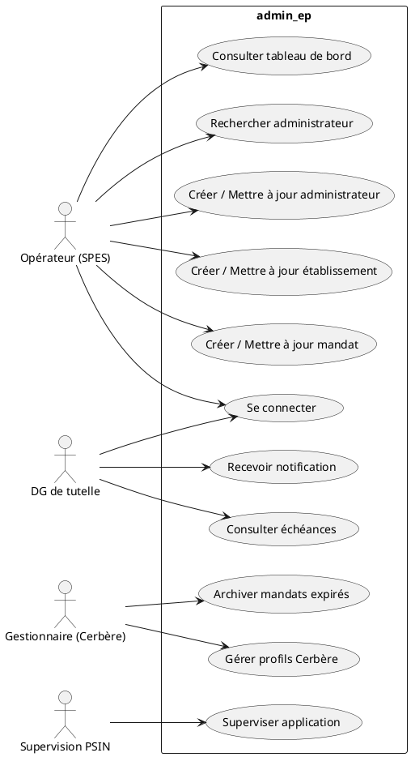

# Cahier des Charges Fonctionnel (CCF) – **admin_ep**
> **Projet** : Administration des établissements publics (admin_ep)  
> **Version** : 1.0 – 27/04/2026  
> **Auteur** : ChatGPT – Analyste fonctionnel  

[TOC]

---  

## 1. Introduction et contexte du projet {#intro}
| Élément | Description |
|---|---|
| **Intitulé** | Administration des établissements publics (admin_ep) |
| **Objectif stratégique** | Mettre à disposition une base de données partagée et une interface fonctionnelle permettant la gestion des membres (administrateurs, gestionnaires) des conseils d’administration des établissements publics du ministère de la Transition écologique et solidaire (MTES‑MCT). |
| **Valeur attendue** | – Centralisation fiable des mandats <br> – visibilité en temps réel pour les services de tutelle <br> – automatisation de la collecte JORF <br> – réduction des risques de non‑conformité (RGPD, DICT) |
| **Périmètre fonctionnel** | **Inclus** : <br>• Saisie manuelle d’administrateurs, établissements, mandats <br>• Import automatisé JORF → mise à jour des mandats <br>• Authentification Cerbère & gestion des profils <br>• Archivage des mandats expirés & pièces justificatives <br>• Recherche multi‑critères <br>• Tableaux de bord statistiques <br>• Notification d’échéance mandat (mail) <br>• Supervision & audit d’application <br>**Exclus** : <br>• Gestion des contenus du site web (wiki) <br>• Déploiement d’infrastructure (IaaS, conteneurisation) <br>• Gestion des droits hors Cerbère (ex. SSO tiers) |

---

## 2. Expression fonctionnelle du besoin {#besoin}
> **Conforme à NF EN 16271 – Décomposition en fonctions de service (FS)**  

| FS # | Fonction de service (FS) | Description (quoi) | Critères d’appréciation | Niveau d’importance / Pondération |
|---|---|---|---|---|
| **FS‑01** | **Gestion des comptes utilisateurs** | Création, mise à jour, suppression et attribution de profils (Cerbère) | • Temps de création ≤ 2 min <br>• Historisation des changements <br>• Conformité RGPD (droit à l’oubli) | **Très haute** – 15 % |
| **FS‑02** | **Saisie / mise à jour des administrateurs** | Enregistrement manuel des informations (nom, fonction, mandat, pièces) | • Validation de champs obligatoires <br>• Cohérence mandat (type, dates) <br>• Pièces jointes stockées ≥ 30 jours | **Très haute** – 15 % |
| **FS‑03** | **Gestion des établissements publics** | Création, recherche, association à un type d’instance et à des collèges | • Recherche < 300 ms <br>• Unicité du SIREN <br>• Historique des modifications | **Haute** – 12 % |
| **FS‑04** | **Gestion des mandats** | Création, modification, archivage, suivi d’échéance | • Détection automatique d’échéance (≤ 30 jours) <br>• Envoi de notification mail fiable (taux de remise ≥ 98 %) | **Très haute** – 15 % |
| **FS‑05** | **Import automatisé JORF** | Extraction périodique du JORF, parsing des nominations, mise à jour des mandats | • Taux de parsing ≥ 95 % <br>• Pas d’interruption du service (batch nocturne) <br>• Logs détaillés | **Haute** – 10 % |
| **FS‑06** | **Recherche multi‑critères** | Recherche d’administrateurs / établissements / mandats par texte libre, filtres (type, charge, date…) | • Temps de réponse ≤ 500 ms <br>• Précision ≥ 90 % (relevé test) | **Haute** – 10 % |
| **FS‑07** | **Statistiques & reporting** | Tableaux de bord (nombre d’administrateurs, mandats actifs, échéances, répartition par charge) | • Actualisation ≤ 15 min <br>• Export CSV/Excel | **Moyenne** – 8 % |
| **FS‑08** | **Notification d’échéance** | Envoi automatique d’email aux référents (gestionnaire, DG tutelle) | • Taux de délivrabilité ≥ 97 % <br>• Contenu conforme aux exigences légales | **Haute** – 8 % |
| **FS‑09** | **Supervision & audit** | Tableau de santé de l’application, logs d’accès, alertes d’incident | • Disponibilité ≥ 99,5 % <br>• Historique logs ≥ 180 jours | **Moyenne** – 5 % |
| **FS‑10** | **Archivage légal** | Conservation des mandats expirés et pièces jointes conformément aux exigences du Ministère | • Conservation ≥ 10 ans <br>• Accès en lecture seule | **Moyenne** – 2 % |

### Contraintes associées
| # | Contrainte | Référence |
|---|---|---|
| C‑01 | Base de données PostgreSQL ≥ 9.6 (production) – migration prévue vers 15 | Architecture |
| C‑02 | Serveur d’application Tomcat ≥ 9.0.8 (production) – montée prévue vers 10 | Architecture |
| C‑03 | Authentification unique via Cerbère (ID 619) | Sécurité |
| C‑04 | Respect du RGPD – registre des traitements, droit à l’oubli | Légal |
| C‑05 | Evaluation DICT positive (07/09/2018) – maintien à jour | Sécurité |
| C‑06 | Disponibilité hébergement MSP (Paris La Défense) | Hébergement |
| C‑07 | Conteneurisation en cours (Docker/K8s) – aucune rupture de service pendant migration | Technique |

---

## 3. Acteurs et parties prenantes {#acteurs}
| Acteur | Rôle | Objectifs / Besoins spécifiques |
|---|---|---|
| **MOA – SG/SPES** | Maîtrise d’Ouvrage | Garantir la conformité fonctionnelle, suivre les évolutions produit |
| **MOE – SG/DNUM/PNM/DPNM3/BPN** (Chef de département, Chef de groupe, Chef de produit, Développeurs) | Maîtrise d’Œuvre | Développer, maintenir et faire évoluer la solution |
| **Utilisateurs finaux** – <br>• **SPES** (services de tutelle) <br>• **DG de tutelle** <br>• **Opérateurs** | Utilisation quotidienne | Saisie, consultation, suivi d’échéance, production de rapports |
| **Responsable sécurité / RSSI** | Sécurité des accès et données | Contrôles d’accès, audit, conformité RGPD/DICT |
| **Équipe de support** | Assistance & incidents | Traitement tickets, mise à jour de la documentation |
| **Prestataire CGI** | Développement externe (si besoin) | Livraison de correctifs, évolution fonctionnelle |
| **Supervision PSIN** | Monitoring de la plateforme | Alertes de disponibilité, performance |

---

## 4. Cas d’usage (Use Cases) {#usecases}
### 4.1 Diagramme de cas d’utilisation (UML)  


### 4.2 Tableau descriptif des cas d’usage
| UC # | Nom du cas d’usage | Acteur(s) principal(aux) | Scénario nominal | Scénarios alternatifs / d’erreur | Pré‑conditions | Post‑conditions |
|---|---|---|---|---|---|---|
| **UC‑01** | Se connecter | Opérateur, DG, Gestionnaire | 1. L’utilisateur saisit identifiant Cerbère <br>2. Le système valide le token <br>3. Accès à l’accueil | 1. Identifiant invalide → affichage message d’erreur <br>2. Session expirée → redirection login | L’utilisateur possède un compte Cerbère actif | Session valide, accès aux fonctions autorisées |
| **UC‑02** | Rechercher administrateur | Opérateur | 1. Saisie de critères (nom, SIREN, mandat) <br>2. Le système interroge la BDD <br>3. Affichage résultats paginés | 1. Aucun résultat → affichage « Aucun administrateur trouvé » | L’utilisateur est connecté | Résultats affichés ou message d’absence |
| **UC‑03** | Créer / Mettre à jour administrateur | Opérateur | 1. Ouverture du formulaire <br>2. Saisie des champs obligatoires <br>3. Validation → création ou mise à jour <br>4. Confirmation affichée | 1. Champ manquant → blocage + message <br>2. Conflit mandat (date chevauchante) → refus | L’utilisateur a les droits d’écriture | Enregistrement persistant, log d’audit |
| **UC‑04** | Créer / Mettre à jour établissement | Opérateur | Idem UC‑03, vérification unicité SIREN | SIREN déjà présent → message d’erreur | – | Enregistrement ou mise à jour |
| **UC‑05** | Créer / Mettre à jour mandat | Opérateur | 1. Sélection de l’administrateur & établissement <br>2. Saisie type, dates, pièces <br>3. Validation → calcul échéance <br>4. Notification planifiée | 1. Date fin antérieure à date début → rejet <br>2. Pièce manquante → avertissement | L’administrateur et l’établissement existent | Mandat enregistré, tâche planifiée pour notification |
| **UC‑06** | Import JORF (batch nocturne) | Système (cron) | 1. Le batch télécharge le fichier JORF <br>2. Parser extrait nominations <br>3. Comparaison avec la BDD <br>4. Création / mise à jour des mandats | 1. Fichier indisponible → log d’erreur, reprise le lendemain <br>2. Parsing incomplet → alerte opérateur | Le serveur a accès réseau au dépôt JORF | BDD synchronisée, logs générés |
| **UC‑07** | Notification d’échéance | Système (scheduler) | 1. Chaque jour, le scheduler recherche mandats expirant ≤ 30 j <br>2. Envoi mail aux référents <br>3. Historisation de l’envoi | 1. Mail non délivré → retry 3× puis alerte | Mandats avec date d’échéance renseignée | Emails envoyés, statut mis à jour |
| **UC‑08** | Consultation tableau de bord | Opérateur, DG | 1. Sélection d’un indicateur <br>2. Affichage graphique / tableau <br>3. Export CSV possible | Aucun data → message « Pas de données » | – | Visualisation ou export |
| **UC‑09** | Supervision & audit | Supervision PSIN | 1. Collecte métriques (CPU, temps réponse, erreurs) <br>2. Alertes en cas de dépassement seuils | – | Application déployée | Dashboard de santé disponible |
| **UC‑10** | Archivage légal | Gestionnaire | 1. Sélection d’un mandat expiré <br>2. Déplacement vers zone d’archivage (read‑only) <br>3. Mise à jour statut | 1. Tentative de suppression → refus (read‑only) | Mandat expiré | Mandat archivé, accès en lecture seule |

---

## 5. Processus métier (optionnel) {#processus}
### 5.1 Diagramme BPMN – **Import JORF → Mise à jour des mandats**
```plantuml
@startbpmn
start
:Planifier batch (01:00);
:Télécharger fichier JORF;
if (Fichier disponible ?) then (oui)
  :Parser JORF;
  :Comparer avec BDD;
  split
    :Créer nouveaux mandats;
  split again
    :Mettre à jour mandats existants;
  end split
  :Enregistrer logs;
else (non)
  :Log erreur & alerter opérateur;
endif
stop
@endbpmn
```

### 5.2 Description des flux critiques
| Processus | Entrée | Sortie | Points de contrôle | Règle de gestion |
|---|---|---|---|---|
| **Saisie administrateur** | Formulaire UI | Enregistrement BDD | Validation champs obligatoires, unicité (nom + SIREN) | Si mandat déjà actif → refus (pas de doublement) |
| **Import JORF** | Fichier JORF | Mandats créés / mis à jour | Vérification checksum, logs d’erreur | Aucun mandat ne doit être perdu – rollback en cas d’échec complet |
| **Notification échéance** | Mandats avec date ≤ 30 j | Emails | Taux de remise, suivi d’état (envoyé / échoué) | Si email échoue 3 fois → créer ticket d’incident |
| **Archivage légal** | Mandat expiré > 10 ans | Zone d’archivage (read‑only) | Vérification de la date d’expiration | Aucun accès en écriture n’est autorisé |

---

## 6. Règles métier et contraintes fonctionnelles {#regles}
| # | Règle métier (condition → action) |
|---|---|
| **R‑01** | **Un mandat ne peut chevaucher** un autre mandat du même administrateur sur le même établissement (type = Titulaire ou Suppléant). |
| **R‑02** | **Date de fin** doit être supérieure à **date de début** ; sinon rejet. |
| **R‑03** | **Archivage** : tout mandat expiré depuis plus de 10 ans est automatiquement déplacé en zone d’archivage en lecture seule. |
| **R‑04** | **Notification** : dès qu’un mandat atteint 30 jours avant son échéance, un email est envoyé au référent (gestionnaire) et au DG de tutelle. |
| **R‑05** | **Import JORF** : les nominations extraites sont comparées aux administrateurs existants via **nom complet + SIREN** ; création si absent, mise à jour sinon. |
| **R‑06** | **RGPD** : toute suppression de données personnelles doit être tracée (log) et le droit à l’oubli doit être appliqué sous 30 jours. |
| **R‑07** | **Sécurité** : seuls les comptes Cerbère avec le rôle **ADMIN_EP** peuvent créer / modifier des mandats. |
| **R‑08** | **Performance** : les requêtes de recherche doivent renvoyer les résultats en < 300 ms pour un jeu de données de 100 000 enregistrements. |
| **R‑09** | **Disponibilité** : l’application doit être disponible ≥ 99,5 % (hors fenêtre de maintenance planifiée). |
| **R‑10** | **Audit** : chaque action CRUD doit générer un enregistrement d’audit (utilisateur, horodatage, opération). |

---

## 7. Parcours utilisateurs (User Journey) {#journey}
### 7.1 Saisie d’un nouvel administrateur
| Étape | Interaction | Point de contact | Critère d’acceptation (Gherkin) |
|---|---|---|---|
| 1 | L’opérateur se connecte (Cerbère) | Page de login | `Given user is on login page` <br>`When user provides valid Cerbère credentials` <br>`Then user is redirected to home page` |
| 2 | Accède au menu **Administrateurs → Créer** | Menu principal | `When user selects "Create Administrator"` <br>`Then create form is displayed` |
| 3 | Remplit le formulaire (nom, fonction, mandat) | Formulaire UI | `When user fills mandatory fields with valid data` <br>`And clicks "Validate"` |
| 4 | Le système valide les règles (R‑01, R‑02) | Backend | `Then system checks for overlapping mandates` <br>`And returns success` |
| 5 | Confirmation affichée & audit enregistré | Page de confirmation | `Then a confirmation message is shown` <br>`And audit log contains the creation event` |

### 7.2 Gestion des échéances
| Étape | Interaction | Point de contact | Critère d’acceptation |
|---|---|---|---|
| 1 | Scheduler quotidien s’exécute | Serveur d’application | `Given scheduler runs at 02:00` |
| 2 | Recherche mandats ≤ 30 j | BDD | `When mandats with expiry ≤30 days are found` |
| 3 | Envoi mail aux référents | Service mail | `Then email is sent to each référent` <br>`And status = "sent"` |
| 4 | Historisation de l’envoi | Table `notification_log` | `And a log entry is created with timestamp` |

---

## 8. Modèle Conceptuel de Données (MCD) {#mcd}
### 8.1 Diagramme de classes (UML) – version abstraite
```plantuml
@startuml
class Administrateur {
  +id : UUID
  +nom : String
  +prenom : String
  +email : String
}
class Etablissement {
  +id : UUID
  +siren : String
  +sigle : String
  +libelle : String
}
class Mandat {
  +id : UUID
  +type : TypeMandat
  +dateDebut : Date
  +dateFin : Date
  +pieceJointe : Blob
}
class TypeMandat {
  +code : String
}
class Charge {
  +id : UUID
  +libelle : String
}
class College {
  +id : UUID
  +identifiant : String
}
class Gestionnaire {
  +id : UUID
  +nom : String
}
class RoleApplicatifEnum { <<enumeration>> }
class RoleCerbereEnum { <<enumeration>> }

Administrateur "1" -- "0..*" Mandat : possède >
Etablissement "1" -- "0..*" Mandat : concerné >
Mandat "1" -- "1" TypeMandat : type >
Etablissement "1" -- "0..*" College : associe >
College "1" -- "0..*" Charge : sousTutelle >
Etablissement "1" -- "0..*" Gestionnaire : géré_par >
Administrateur "1" -- "0..*" RoleApplicatifEnum : rôle >
Administrateur "1" -- "0..*" RoleCerbereEnum : profil_cerbere >
@enduml
```

### 8.2 Description des entités majeures
| Entité | Attributs clés | Relations |
|---|---|---|
| **Administrateur** | id, nom, prénom, email, rôle (Cerbère) | 0..* Mandat, 0..* Rôles |
| **Etablissement** | id, siren, sigle, libellé, typeInstance (FK) | 0..* Mandat, 0..* College, 0..* Gestionnaire |
| **Mandat** | id, typeMandat (FK), dateDébut, dateFin, pièce | 1 Administrateur, 1 Etablissement |
| **TypeMandat** | id, libellé (Titulaire / Suppléant) | 1..* Mandat |
| **Charge** | id, libellé, description | 0..* College (tutelle) |
| **College** | id, identifiant, synonymes | 1 Charge, 0..* Etablissement |
| **Gestionnaire** | id, nom, email | 0..* Etablissement |
| **RoleCerbereEnum / RoleApplicatifEnum** | enum (ex. ADMIN_EP, OPERATOR) | 0..* Administrateur |

---

## 9. Critères d’acceptation et validation {#acceptation}
| Fonction | Critère d’acceptation | Méthode de validation | Responsable |
|---|---|---|---|
| **FS‑01** – Authentification Cerbère | ✅ Authentification en ≤ 2 s, refus en cas de token invalide | Tests fonctionnels (JUnit + Selenium) | MOE |
| **FS‑02** – Saisie administrateur | ✅ Création réussie, logs d’audit créés | Test d’intégration + revue code | MOE |
| **FS‑03** – Gestion établissements | ✅ SIREN unique, recherche < 300 ms | Jeu de données de 100 k établissements, benchmark | MOE |
| **FS‑04** – Gestion mandats | ✅ Détection d’échéance ≤ 30 j, envoi mail | Test end‑to‑end (Scheduler + MailHog) | MOE |
| **FS‑05** – Import JORF | ✅ Taux de parsing ≥ 95 % sur jeu de fichiers réels | Comparaison fichier source ↔ BDD après batch | MOE |
| **FS‑06** – Recherche multi‑critères | ✅ Temps réponse ≤ 500 ms, pertinence ≥ 90 % (requêtes test) | Tests de charge (JMeter) | MOE |
| **FS‑07** – Statistiques | ✅ Tableaux actualisés toutes les 15 min, export CSV valide | Vérification manuelle + script de validation | MOE |
| **FS‑08** – Notification | ✅ Taux de remise ≥ 97 % (rapport mail) | Analyse logs de serveur mail | RSSI |
| **FS‑09** – Supervision | ✅ Disponibilité ≥ 99,5 % (rapport mensuel) | Monitoring (Grafana) | Supervision |
| **FS‑10** – Archivage | ✅ Mandats > 10 ans en read‑only, accès audit | Requête BDD + contrôle droits | RSSI |

*Les critères sont pondérés selon le tableau de la section 2 pour le calcul du score d’évaluation des offres.*

---

## 10. Annexes {#annexes}
### 10.1 Glossaire métier
| Terme | Définition |
|---|---|
| **Administrateur** | Personne physique ou morale membre d’un conseil d’administration d’un établissement public. |
| **Mandat** | Période pendant laquelle un administrateur exerce ses fonctions (Titulaire ou Suppléant). |
| **Charge** | Ministère ou direction responsable d’un domaine (ex. « Affaires étrangères »). |
| **College** | Regroupement d’établissements partageant le même type d’instance. |
| **Gestionnaire** | Agent ou service chargé de la mise à jour opérationnelle de la base (ex. opérateur SPES). |
| **Cerbère** | Système d’authentification unique du ministère (ID 619). |
| **JORF** | Journal officiel de la République française – source officielle des nominations. |
| **DI​CT** | Déclaration d’impact sur la protection des données. |
| **RGPD** | Règlement général sur la protection des données (UE). |

### 10.2 Référentiels et normes applicables
| Référence | Domaine |
|---|---|
| NF EN 16271 | Management par la valeur – Expression fonctionnelle du besoin |
| ISO/IEC/IEEE 29148 :2018 | Ingénierie des exigences |
| ISO/IEC 19505‑2 | UML 2.x (diagrammes de cas d’usage, classes) |
| ISO/IEC 19510 | BPMN 2.0 (processus métier) |
| RGPD 2016/679 | Protection des données à caractère personnel |
| DICT 2018‑09‑07 | Evaluation de l’impact sur la protection des données |

### 10.3 Historique des versions du document
| Version | Date | Auteur | Modifications |
|---|---|---|---|
| 1.0 | 27/04/2026 | ChatGPT (analyste) | Document initial – couverture complète du projet admin_ep |
| 0.1 | 15/03/2026 | — | Draft interne (extraction de l’arborescence) |

---  

*Fin du Cahier des Charges Fonctionnel – admin_ep*   ↩ [Retour au sommaire](#toc)