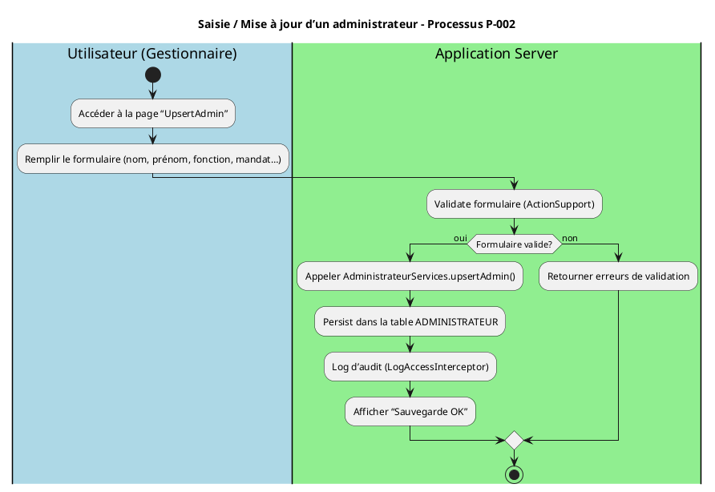
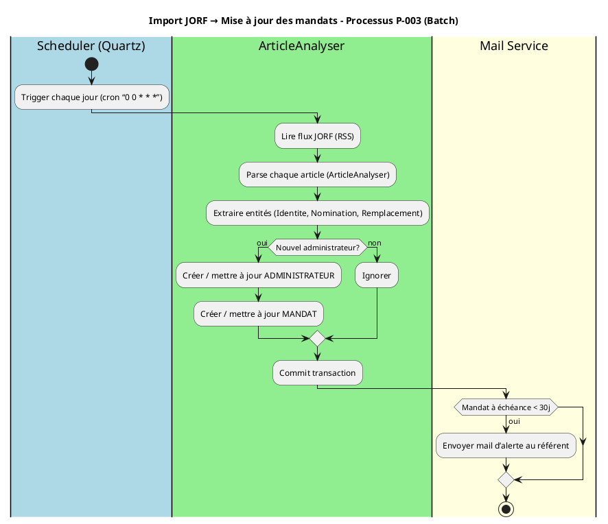
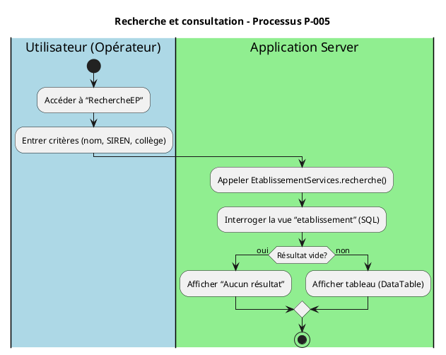

# 📄 Cahier des Charges Fonctionnel (CCF) – **admin_ep**  
*Modélisation BPMN – ISO/IEC 19510 : 2013*  

> **Version** : 1.0 – 2024‑04‑27  
> **Auteur** : ChatGPT – Analyste BPMN certifié  

---  

## 1️⃣ Introduction & Contexte

| Élément | Description |
|---|---|
| **Nom du projet** | **admin_ep** – Administration des établissements publics (MTES‑MCT) |
| **Objet** | Gestion centralisée des membres des conseils d’administration (CA) et des conseils de surveillance (CS) des établissements publics placés sous la tutelle du ministère. |
| **Environnement technique** | - Java 8, Tomcat 9 (migration → Tomcat 10) <br> - PostgreSQL 9.6 (migration → PostgreSQL 15) <br> - ACAI / IaaS (ECO4) <br> - Docker / K8s (en cours de conteneurisation) |
| **Portée fonctionnelle** | - Saisie manuelle des données (admin, établissements, mandats, etc.) <br> - Import automatique depuis le JORF (outil *ArticleAnalyser*) <br> - Authentification via Cerbère (profil baseadmin) <br> - Archivage des mandats expirés et pièces jointes <br> - Consultation (recherche, visualisation) <br> - Tableaux de bord statistiques <br> - Alertes e‑mail sur échéances de mandats |
| **Acteurs principaux** | - **Maîtrise d’ouvrage (MOA)** : SG/SPES <br> - **Maîtrise d’œuvre (MOE)** : SG/SNUM/PNM/DPNM3/BPN <br> - **Utilisateurs finaux** : SPES, DG de tutelle, opérateurs (gestionnaires) |
| **Glossaire (extraits)** | *Mandat* : mandat de titularité ou de suppléance d’un administrateur. <br> *Charge* : ministère ou direction porteuse d’un mandat. <br> *College* : groupe d’établissements (ex. « COL‑01 »). <br> *JOF* : Journal officiel des Finances (source JORF). |
| **Objectifs du CCF** | - Formaliser les processus métier de **admin_ep**. <br> - Produire des diagrammes BPMN exécutables (niveau *Analytic*). <br> - Garantir traçabilité exigences ↔ processus ↔ tests. <br> - Préparer la migration vers un moteur BPMN (Camunda). |

---  

## 2️⃣ Cartographie des processus (Process Map)

### 2.1 Nomenclature hiérarchisée

| Niveau | Type | Exemple |
|---|---|---|
| **1** | **Processus métier stratégiques** | *Gestion des mandats & alertes* |
| **2** | **Processus métier opérationnels** | *Saisie d’un administrateur*, *Import JORF*, *Recherche d’établissements*, *Gestion des utilisateurs* |
| **2** | **Processus de support** | *Gestion des logs*, *Gestion des paramètres système* |
| **2** | **Processus de management** | *Déploiement & supervision*, *Mise à jour de la base* |

### 2.2 Matrice de processus

| ID | Nom du processus | Type | Propriétaire | Priorité |
|---|---|---|---|---|
| **P‑001** | Authentification & Gestion des droits | Opérationnel | **SecurityManagerInitializer** (MOE) | Critique |
| **P‑002** | Saisie / Mise à jour d’un administrateur | Opérationnel | **AdministrateurServices** | Critique |
| **P‑003** | Import JORF → Création / Mise à jour des mandats | Opérationnel | **ArticleAnalyser** (batch) | Haute |
| **P‑004** | Notification d’échéance mandat | Opérationnel | **MandatServices** | Haute |
| **P‑005** | Recherche & Consultation (établissements, admins) | Opérationnel | **RechercheArticleDao** | Moyenne |
| **P‑006** | Génération des statistiques | Support | **StatistiquesAction** | Moyenne |
| **P‑007** | Gestion des archivages (mandats expirés) | Support | **ArchivageJob** (batch) | Moyenne |
| **P‑008** | Supervision & Monitoring (PSIN) | Management | **SupervisionAction** | Moyenne |
| **P‑009** | Déploiement & mise à jour de schéma DB | Management | **Maven‑assembly** | Haute |

---  

## 3️⃣ Modélisation BPMN détaillée  

> **Notation** : diagrammes PlantUML compatibles BPMN 2.0.  
> **Convention** : chaque diagramme représente un **niveau d’abstraction** (une seule **Start Event**, au moins une **End Event**).  

### 3.1 Diagramme de **Collaboration** – Authentification (P‑001)

```plantuml
@startuml
!define BPMN
!include <https://raw.githubusercontent.com/plantuml-stdlib/C4-PlantUML/master/C4_Deployment.puml>

title Authentification & Gestion des droits – Processus P‑001

|#LightBlue|Client (Navigateur)|
start
:HTTP GET /login;
:Render login page;
|#LightGreen|Application Server (Tomcat)|
:Receive credentials;
:Call SecurityManagerInitializer;
:Validate via Cerbère (ID = 619);
if (Valid?) then (yes)
  :Create session (BaseAdminUserSession);
  :Redirect to home;
else (no)
  :Show error page;
endif
stop
@enduml
```

### 3.2 Diagramme de **Processus** – Saisie/Modification d’un administrateur (P‑002)



### 3.3 Diagramme de **Processus** – Import JORF (P‑003)



### 3.4 Diagramme de **Processus** – Notification d’échéance mandat (P‑004)

```plantuml
@startuml
title Notification d’échéance mandat – Processus P‑004

|#LightBlue|Scheduler|
start
:Planifier quotidien (00:00);
|#LightGreen|MandatServices|
:Rechercher mandats expirant < 30 jours;
foreach mandat
  :Construire mail (destinataire = référent);
  :Envoyer via MailService;
endforeach
stop
@enduml
```

### 3.5 Diagramme de **Processus** – Recherche d’établissements (P‑005)



### 3.6 Diagramme de **Processus** – Archivage des mandats expirés (P‑007)

```plantuml
@startuml
title Archivage des mandats expirés – Processus P‑007 (Batch)

|#LightBlue|Scheduler|
start
:Trigger chaque nuit;
|#LightGreen|MandatServices|
:Sélectionner mandats expirés (> 90 jours);
foreach mandat
  :Copier vers table ARCHIVE_MANDAT;
  :Supprimer de MANDAT;
endforeach
:Commit;
stop
@enduml
```

---  

## 4️⃣ Règles de gestion métier  

| Point de décision | Condition | Règle métier | Source |
|---|---|---|---|
| **RB‑001** | `mandat.dateFin ≤ aujourd’hui + 30j` | Générer une alerte e‑mail au référent. | Spécifications fonctionnelles (doc wiki) |
| **RB‑002** | `typeMandat = "Titulaire"` | Le mandat doit être associé à un **College** et à une **Charge**. | Modèle de données (TYPE_MANDAT) |
| **RB‑003** | `utilisateur.role ∈ {ADMIN, MANAGER}` | Autoriser la création/modification d’un administrateur. | Cerbère – groupe 619 |
| **RB‑004** | `import JORF` | Si la personne n’existe pas → création admin + mandat. | ArticleAnalyser (step PreStepAnalyseRecupererArticlesEP) |
| **RB‑005** | `suppression d’un administrateur` | Bloquer si un mandat actif existe → erreur. | Business rule dans `AdministrateurServices` |
| **RB‑006** | `login échoué > 5 fois` | Verrouiller le compte pendant 15 min. | Sécurité – `SecurityFilter` |

---  

## 5️⃣ Données & Artifacts  

### 5.1 Objets de données (Data Objects)

| Data Object | Description | Persistance |
|---|---|---|
| **ADMINISTRATEUR** | Identité, fonction, profil Cerbère | Table `administrateur` (integration) |
| **MANDAT** | Type, date début / fin, charge, collège | Table `mandat` (integration) |
| **ETABLISSEMENT** | SIREN, libellé, type d’instance | Table `etablissement` |
| **CHARGE** | Nom de la charge ministérielle | Table `charge` |
| **COLLEGE** | Identifiant, synonymes | Table `college` + `synonyme_college` |
| **ARCHIVE_MANDAT** | Historique des mandats expirés | Table `archive_mandat` (batch) |
| **JOURNAL_AUDIT** | Traces d’accès & modifications | Table `audit_log` (non‑décrite) |
| **MAIL_QUEUE** | Mails à envoyer (notifications) | Table `mail_queue` (service mail) |

### 5.2 Artifacts BPMN

| Artifact | Usage |
|---|---|
| **Group** | Regroupement logique des activités « Saisie » et « Import » dans les diagrammes. |
| **Annotation** | Indique les règles RB‑001…RB‑006 sur les gateways. |
| **Association** | Lie les *Data Objects* aux *Tasks* (ex. : `Create Admin` ↔ `ADMINISTRATEUR`). |

---  

## 6️⃣ Acteurs & Rôles  

| Lane BPMN | Rôle métier | Responsabilités | Compétences |
|---|---|---|---|
| **Gestionnaire** | Opérateur de saisie | Crée / met à jour administrateurs, mandats, établissements. | Connaissance du référentiel juridique. |
| **Scheduler** | Batch / Quartz | Déclenche les jobs d’import JORF, notifications, archivage. | Java, planification cron. |
| **Security Manager** | Gestion des droits (Cerbère) | Authentifie, attribue profils, contrôle accès. | Sécurité IAM, Cerbère. |
| **Supervision (PSIN)** | Monitoring | Surveille la santé de l’application (logs, métriques). | Ops / SRE. |
| **Mail Service** | Notification | Envoie les alertes mandat. | SMTP, templates. |

---  

## 7️⃣ Performances & KPI  

| Indicateur | Formule | Objectif | Seuil d’alerte |
|---|---|---|---|
| **Durée moyenne d’import JORF** | `temps_total_import / nb_articles` | < 5 min | > 10 min |
| **Taux de mandats expirés non notifiés** | `mandats_non_notifiés / total_mandats_expirés` | < 2 % | > 5 % |
| **Temps de réponse recherche EP** | `temps_recherche` (ms) | < 800 ms | > 2 s |
| **Disponibilité applicative** | `uptime / période` | 99,9 % | < 99 % |
| **Taux d’erreur HTTP 5xx** | `nb_5xx / nb_requests` | < 0,1 % | > 0,5 % |

*Points de mesure BPMN* – **Timer Events** (ex. : déclencheur quotidien), **Intermediate Message Events** (mail), **Boundary Error Events** (échec import).

---  

## 8️⃣ Gestion des exceptions  

| Type d’exception | Élément BPMN | Action (Boundary Event) | Conséquence |
|---|---|---|---|
| **Timeout JORF** | *Task “Lire flux JORF”* | **Boundary Timer** (5 min) → *Send Alert* → *Terminate* | Notification ops, re‑planification. |
| **Violation contrainte DB** | *Task “Persist admin”* | **Boundary Error** → *Rollback transaction* → *User error page* | Retour à l’écran avec message. |
| **Mail non délivré** | *Task “Envoyer mail”* | **Boundary Error** → *Retry (3×)* → *Log & continue* | Pas d’interruption du batch. |
| **Accès non autorisé** | *Task “Valider droits”* | **Boundary Error** → *Redirect to login* | Session invalide. |
| **Mandat déjà présent** | *Gateway “Mandat existant ?”* | **Exclusive Gateway** (yes) → *Update* / (no) → *Create* | Idempotence du batch. |

---  

## 9️⃣ Sous‑processus & Réutilisation  

| Sous‑processus | Description | Points d’appel (Call Activity) |
|---|---|---|
| **SP‑Auth** | Authentification Cerbère + création session. | P‑001, toutes les actions sécurisées. |
| **SP‑Import_JORF** | Lecture, parsing, extraction, persistance. | P‑003 (batch). |
| **SP‑Mandat_Alert** | Recherche mandats à échéance, construction mail, envoi. | P‑004, P‑003 (post‑import). |
| **SP‑Archive_Mandat** | Déplacement mandats expirés vers archive. | P‑007. |
| **SP‑Statistiques** | Agrégation KPI, génération rapport. | P‑006. |

---  

## 🔟 Matrice de traçabilité  

| Exigence CCF | Processus BPMN | Tâche(s) concernée(s) | Scénario de test |
|---|---|---|---|
| **EXG‑001** – Authentifier les utilisateurs | P‑001 | *Validate credentials* | Test login valide / invalide. |
| **EXG‑002** – Créer admin | P‑002 | *Persist ADMINISTRATEUR* | Saisie formulaire → vérif DB. |
| **EXG‑003** – Import JORF quotidien | P‑003 | *Parse article*, *Create/Update mandat* | Simuler flux JORF → comparer tables. |
| **EXG‑004** – Alerte mandat échéant | P‑004 | *Envoyer mail* | Mandat à +15 j → vérifier mail reçu. |
| **EXG‑005** – Recherche EP | P‑005 | *Recherche critères* | Recherche “Ministère” → résultat attendu. |
| **EXG‑006** – Archivage mandats expirés | P‑007 | *Copier → ARCHIVE_MANDAT* | Mandat expiré > 90 j → présent en archive. |
| **EXG‑007** – Statistiques globales | P‑006 | *Calcul KPI* | Dashboard → valeurs correctes. |

---  

## 1️⃣1️⃣ Validation & Conformité  

### 11.1 Checklist BPMN (ISO 19510)

- [x] Tous les flux ont une source et une cible.  
- [x] Une **Start Event** unique (none) par processus.  
- [x] Au moins une **End Event** (none) par processus.  
- [x] Aucun **Gateway** orphelin.  
- [x] Labels des passerelles explicites (ex. : `Mandat existant ?`).  
- [x] Nomenclature cohérente (`P‑XXX`).  

### 11.2 Niveau de conformité  

| Niveau | Description | Processus concernés |
|---|---|---|
| **Descriptive** | Diagrammes lisibles, non exécutables. | Tous les diagrammes de vue synthétique. |
| **Analytic** | Modélisation détaillée, données & règles. | P‑001 à P‑007 (pré‑exécution). |
| **Common Executable** | Export Camunda‑compatible (BPMN XML). | Tous les processus (prévu pour version 2.0). |

---  

## 1️⃣2️⃣ Implémentation & Exécution  

### 12.1 Maturité processus (CMMI‑like)

| Niveau | Caractéristiques | BPMN applicable |
|---|---|---|
| 1 – Initial | Ad‑hoc, scripts manuels | **Descriptive** |
| 2 – Managed | Documentation, procédures | **Descriptive** |
| 3 – Defined | Processus standardisés | **Analytic** |
| 4 – Quantified | Mesure KPI, monitoring | **Analytic** |
| 5 – Optimized | Amélioration continue, automatisation | **Common Executable** (Camunda) |

> **Objectif** : Atteindre le **Niveau 5** d’ici fin 2025 en déployant les diagrammes BPMN sur **Camunda** (Spring Boot) et en automatisant les tests d’intégration.

### 12.2 Intégration système  

| Composant | Technologie | Points d’intégration BPMN |
|---|---|---|
| **Moteur BPMN** | Camunda 7 (Spring‑Boot) | Déploiement des processus `admin_ep` (P‑001…P‑007). |
| **Base de données** | PostgreSQL 15 | *Data Objects* ↔ *Service Tasks* via JPA (`EntityManager`). |
| **Scheduler** | Quartz 2 | *Timer Events* (déclencheurs batch). |
| **Mail** | JavaMail (SMTP) | *Message Events* (notification). |
| **Supervision** | Prometheus + Grafana | *Metrics* exposés via Camunda‑Prometheus‑Exporter. |
| **Sécurité** | Cerbère (OAuth2) | *Message Event* d’erreur d’authentification. |

---  

## 📎 Annexes  

### A – Glossaire complet (extraits)  

| Terme | Définition |
|---|---|
| **Mandat** | Période pendant laquelle un administrateur exerce ses fonctions (titulaire ou suppléant). |
| **Charge** | Entité ministérielle (ex. « Affaires étrangères ») responsable du mandat. |
| **College** | Regroupement d’établissements partageant la même charge. |
| **Cerbère** | Service d’authentification et d’autorisation du ministère. |
| **JORF** | Journal officiel de la République française – source des nominations. |
| **ACAï** | Plateforme d’exécution Java du ministère (clusters ESXi). |

### B – Références  

- ISO/IEC 19510 : 2013 – BPMN 2.0.  
- Doc‑wiki admin_ep (home › Fiche‑Produit).  
- Scripts SQL d’initialisation (see `1_createSequenceAndTablesIntegration.sql`).  
- Code source Java (package `fr.gouv.e2.baseadmin.*`).  

---  

> **Conclusion**  
> Le présent CCF formalise l’ensemble des processus métier d’**admin_ep** sous une notation BPMN conforme à la norme ISO 19510. Il fournit les bases nécessaires à la migration vers un moteur de workflow (Camunda) et à la mise en place d’une gouvernance continue (KPIs, monitoring, traçabilité).  

*Fin du document.*