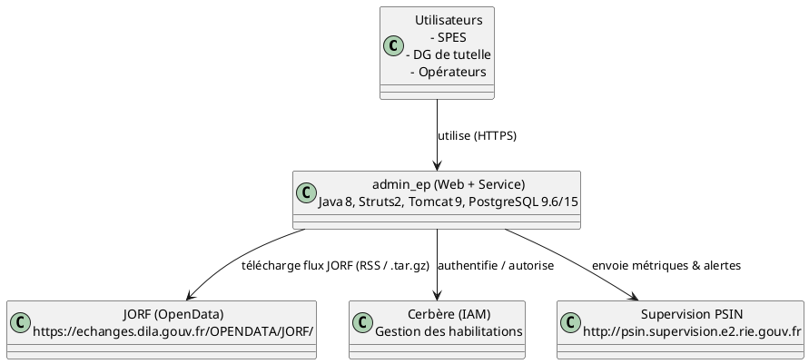
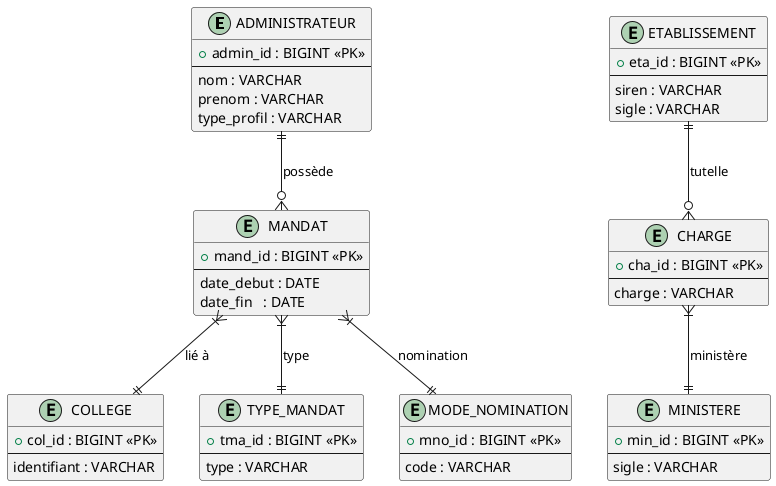
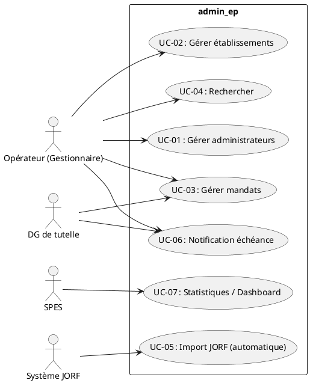
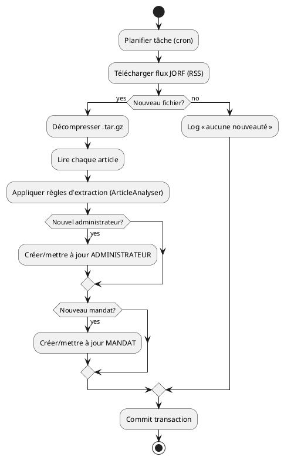
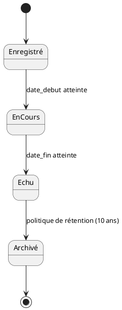
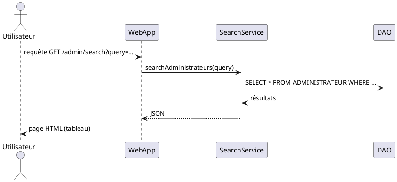

# 📄 Cahier des Charges Fonctionnel (CCF) – **admin_ep**  
**Projet** : admin_ep – Administration des établissements publics (MTES‑MCT)  

> **Version** : 1.0 – 27 avril 2026  
> **Auteur** : Équipe d’ingénierie exigences (ISO/IEC/IEEE 29148)  
> **Références** :  
> - ISO/IEC/IEEE 29148:2018 – Ingénierie des exigences  
> - ISO/IEC/IEEE 15288 & 12207 – Cycle de vie système / logiciel  
> - Document “home › Fiche‑Produit” (admin_ep.wiki.md)  
> - Base de données : `adminep-database/scripts/init/*.sql`  
> - Architecture : arborescence du dépôt (admin_ep.code.filtered.md)  

---  

## 1️⃣ Identification & Contexte du document  

| Élément | Valeur |
|---|---|
| **Identifiant unique du CCF** | **CCF‑ADMIN‑EP‑001** |
| **Version / Historique** | 1.0 – 27/04/2026 (création) |
| **Documents associés** | - Vision produit (home.md)   - Business case (admin_ep.wikisi.md)   - Architecture Maven (`pom.xml`)   - Modèle de données (scripts SQL) |
| **Portée** | Définir les exigences fonctionnelles et non‑fonctionnelles du module *admin_ep* (back‑end Java / Struts2, base PostgreSQL, interface web) ainsi que les exigences d’intégration avec le service JORF. |
| **Objectifs** | - Permettre la saisie, la consultation, la mise à jour et l’archivage des mandats d’administrateurs.   - Automatiser l’alimentation des données à partir du JORF.   - Garantir la traçabilité, la sécurité d’accès (Cerbère) et la disponibilité du service. |

---  

## 2️⃣ Description de l’écosystème (System/Software Context)

- **Front‑end** : JSP / Struts2, CSS Bootstrap, thème jQuery UI.  
- **Back‑end** : Java 8, Struts2‑core, Vertigo, services métier (admin, gestionnaire, mandat, etc.).  
- **Base de données** : PostgreSQL 9.6 (production) – migration prévue vers 15.  
- **Infrastructure** : Tomcat 9 (production) → Tomcat 10 (prévu). Hébergement MSP (Paris La Défense), conteneurisation en cours (Docker/K8s).  

---  

## 3️⃣ Exigences fonctionnelles  

> **Format** : `[ID] Titre` – Description – Rationale – Source – Priority – Verification – Dependencies  

| ID | Titre | Description | Rationale | Source | Priorité | Vérif. | Dépendances |
|----|-------|-------------|-----------|--------|----------|--------|--------------|
| **EXG‑FCT‑001** | Gestion des **Administrateurs** | L’application doit permettre la création, la lecture, la mise à jour et la suppression (CRUD) d’un administrateur (nom, prénom, fonction, mandat, rôle Cerbère). | Recenser les membres des CA/CS pour chaque EP. | Home › Fiche‑Produit, code `DetailAdminAction`, `UpsertAdminAction` | Mandatory | Tests fonctionnels (JUnit/Servlet) + UI tests (Selenium) | – |
| **EXG‑FCT‑002** | Gestion des **Établissements publics (EP)** | CRUD complet des EP (SIREN, sigle, libellé, type d’instance, collège(s) associés). | Base de données partagée des EP sous tutelle. | Home › Fiche‑Produit, code `DetailEPAction` | Mandatory | Tests d’intégration + validation du schéma DB (`ETABLISSEMENT` table) | – |
| **EXG‑FCT‑003** | Gestion des **Mandats** | Enregistrement des mandats (type : titulaire / suppléant, dates de début‑fin, mode de nomination, pièces jointes). | Suivi des mandats et archivage légal. | Home › Fiche‑Produit, code `DetailMandatAction` | Mandatory | Tests fonctionnels + génération de PDF d’archive | EXG‑FCT‑001, EXG‑FCT‑002 |
| **EXG‑FCT‑004** | **Recherche globale** | Moteur de recherche (full‑text) permettant de retrouver un administrateur, un EP ou un mandat à partir de mots‑clés (nom, SIREN, collège, charge, etc.). | Besoin d’accès rapide aux informations. | Home › Fiche‑Produit, code `RechercheAdminsAction`, `RechercheEPAction` | Mandatory | Tests de performance (requêtes < 2 s) + tests d’acceptation BDD | EXG‑FCT‑001, EXG‑FCT‑002 |
| **EXG‑FCT‑005** | **Ingestion JORF** | Service planifié (cron) qui télécharge les flux JORF, extrait les articles, identifie les nouveaux administrateurs/mandats et les insère automatiquement. | Alimenter la base sans saisie manuelle. | Doc‑JORF‑BO, code `ArticleAnalyser`, `ReindexArticlesByArtiIDTask` | Mandatory | Tests d’intégration (mock JORF) + validation de la règle d’extraction | EXG‑FCT‑001, EXG‑FCT‑003 |
| **EXG‑FCT‑006** | **Notification d’échéance** | Envoi automatique d’un e‑mail au référent lorsqu’un mandat arrive à moins de 30 jours de son terme. | Prévenir les renouvellements. | Home › Fiche‑Produit | Desirable | Tests d’envoi (SMTP mock) + scénario BDD | EXG‑FCT‑003 |
| **EXG‑FCT‑007** | **Statistiques** | Tableaux de bord (nombre d’EP, nombre d’administrateurs, répartition par charge, évolution temporelle). | Pilotage et reporting. | Home › Fiche‑Produit, code `StatistiquesAction` | Desirable | Tests unitaires sur services `StatistiquesService` | – |
| **EXG‑FCT‑008** | **Gestion des droits (Cerbère)** | Authentification via Cerbère, contrôle d’accès par rôle (admin, gestionnaire, lecteur). | Sécuriser les données sensibles. | Home › Fiche‑Produit, code `SecurityManagerInitializer` | Mandatory | Tests d’authentification (LDAP mock) + revue de sécurité | – |
| **EXG‑FCT‑009** | **Archivage légal** | Conservation des mandats expirés et de leurs pièces jointes pendant au moins 10 ans, avec horodatage immuable. | Conformité réglementaire. | Home › Fiche‑Produit | Mandatory | Tests de rétention + audit d’intégrité | EXG‑FCT‑003 |
| **EXG‑FCT‑010** | **Export CSV / Excel** | Export des listes (administrateurs, EP, mandats) au format CSV ou ODS. | Besoin d’analyse externe. | Home › Fiche‑Produit | Desirable | Tests d’export (vérif. en‑tête, encodage UTF‑8) | – |

---  

## 4️⃣ Exigences non‑fonctionnelles  

| ID | Catégorie | Description |
|----|-----------|-------------|
| **EXG‑NFR‑001** | **Performance** – Temps de réponse | < 1 s pour les pages de recherche, < 2 s pour l’ingestion JORF (batch de 10 000 articles). |
| **EXG‑NFR‑002** | **Performance** – Débit | Capable de servir ≥ 200 req/s en pic (pré‑prod). |
| **EXG‑NFR‑003** | **Performance** – Utilisation ressources | Mémoire JVM ≤ 1 GiB, CPU ≤ 70 % sur serveur Tomcat 9. |
| **EXG‑NFR‑004** | **Interface utilisateur** | Conformité aux standards WCAG 2.1 AA, responsive (Bootstrap 4). |
| **EXG‑NFR‑005** | **Interface externe** – JORF | Accès HTTPS, gestion des certificats (trust‑all pour tests, validation en prod). |
| **EXG‑NFR‑006** | **Sécurité – Confidentialité** | Chiffrement TLS 1.2+ sur toutes les communications, chiffrement AES‑256 des pièces jointes stockées. |
| **EXG‑NFR‑007** | **Sécurité – Intégrité** | Signature SHA‑256 des fichiers d’import JORF, vérification d’intégrité avant traitement. |
| **EXG‑NFR‑008** | **Sécurité – Disponibilité** | SLA = 99,5 % (temps d’arrêt annuel ≤ 44 h). Redondance Tomcat + PostgreSQL en réplication. |
| **EXG‑NFR‑009** | **Maintenabilité** | Couverture de code ≥ 80 % (JUnit + JaCoCo), conventions Checkstyle, documentation Javadoc. |
| **EXG‑NFR‑010** | **Portabilité** | Application packagée en Docker / OCI, exécutable sur tout OS supportant Java 8+. |
| **EXG‑NFR‑011** | **Testabilité** | Tests automatisés (unitaires, d’intégration, UI) exécutés via Maven Surefire/Failsafe. |
| **EXG‑NFR‑012** | **Fiabilité** | Taux d’erreur < 0,1 % en production, journalisation (log4j2) avec rotation quotidienne. |
| **EXG‑NFR‑013** | **Contrainte de développement** | Utilisation obligatoire de Maven 3, Java 8, Struts2 2.5, Vertigo framework, Spring 4. |
| **EXG‑NFR‑014** | **Conformité légale** | Evaluation DICT = Oui (07/09/2018), respect RGPD (données personnelles limitées). |

---  

## 5️⃣ Modèle de données conceptuel  

### 5.1 Entités principales (extrait)  

| Entité | Attributs clés | Description |
|--------|----------------|-------------|
| **ADMINISTRATEUR** | `admin_id PK`, `nom`, `prenom`, `type_profil` (BaseAdmin / Cerbère) | Personne physique membre d’un mandat. |
| **ETABLISSEMENT** | `eta_id PK`, `siren`, `sigle`, `libelle`, `type_instance_id FK` | EP sous tutelle. |
| **COLLEGE** | `col_id PK`, `identifiant` | Organe de gouvernance (ex : collège). |
| **CHARGE** | `cha_id PK`, `charge`, `ministere_charge_de` | Charge ministérielle (ex : Affaires étrangères). |
| **MANDAT** | `mand_id PK`, `admin_id FK`, `college_id FK`, `type_mandat_id FK`, `date_debut`, `date_fin`, `mode_nomination_id FK` | Mandat d’un administrateur dans un collège. |
| **TYPE_MANDAT** | `tma_id PK`, `type` | Titulaire / Suppléant. |
| **TYPE_INSTANCE** | `tin_id PK`, `type`, `a_linstance_de`, `de_linstance_de` | Type d’instance (CA, CS). |
| **MODE_NOMINATION** | `mno_id PK`, `code`, `mode`, `mot_cle_titre`, `mot_cle_corps_texte` | Arrêté, Décret, etc. |
| **MINISTERE** | `min_id PK`, `sigle`, `nom`, `statut` | Ministère (ex : Agriculture). |
| **TUTELLE_ETABLISSEMENT_CHARGE** | `eta_id FK`, `cha_id FK`, `tutelle_principale` | Relation de tutelle. |

*(Diagramme UML simplifié – PlantUML)*  

---  

## 6️⃣ Modélisation des comportements  

### 6.1 Diagrammes de cas d’utilisation (UML)  

### 6.2 Diagrammes d’activités (exemple : Ingestion JORF)  

### 6.3 Diagrammes d’états (exemple : Cycle de vie d’un mandat)  

### 6.4 Diagrammes de séquence (exemple : Recherche d’un administrateur)  

---  

## 7️⃣ Attributs d’exigences (Requirements Attributes)  

| Identifiant | Description | Rationale | Source | Priority | Status | Verification | Risk | Stability |
|------------|-------------|-----------|--------|----------|--------|----------------|------|-----------|
| EXG‑FCT‑001 | Gestion des administrateurs | Recenser les membres | Home › Fiche‑Produit | Mandatory | Draft | Test fonctionnel (JUnit) | Medium | Stable |
| EXG‑FCT‑002 | Gestion des EP | Base partagée | Home › Fiche‑Produit | Mandatory | Draft | Test d’intégration DB | Low | Stable |
| EXG‑FCT‑003 | Gestion des mandats | Suivi légal | Home › Fiche‑Produit | Mandatory | Draft | Test fonctionnel + archivage | High | Stable |
| EXG‑FCT‑004 | Recherche globale | Accès rapide | Home › Fiche‑Produit | Mandatory | Draft | Test de performance (JMeter) | Medium | Stable |
| EXG‑FCT‑005 | Ingestion JORF | Alimenter automatiquement | Doc‑JORF‑BO | Mandatory | Draft | Test d’intégration (mock JORF) | High | Volatile (evol. flux) |
| … | … | … | … | … | … | … | … | … |

---  

## 8️⃣ Traçabilité des exigences  

| Exigence (ID) | Cas d’utilisation | Composant(s) Java | Test(s) | Source |
|---|---|---|---|---|
| EXG‑FCT‑001 | UC‑01 | `DetailAdminAction`, `UpsertAdminAction`, `AdministrateurServicesImpl` | TC‑FCT‑001 (CRUD admin) | Home › Fiche‑Produit |
| EXG‑FCT‑002 | UC‑02 | `DetailEPAction`, `UpsertEPAction`, `EtablissementServicesImpl` | TC‑FCT‑002 | Home › Fiche‑Produit |
| EXG‑FCT‑003 | UC‑03 | `DetailMandatAction`, `UpsertMandatAction`, `MandatServicesImpl` | TC‑FCT‑003 | Home › Fiche‑Produit |
| EXG‑FCT‑004 | UC‑04 | `RechercheAdminsAction`, `RechercheEPAction`, `SearchService` | TC‑FCT‑004 | Home › Fiche‑Produit |
| EXG‑FCT‑005 | UC‑05 | `ArticleAnalyser`, `ReindexArticlesByArtiIDTask`, `ArticleServicesImpl` | TC‑FCT‑005 | Doc‑JORF‑BO |
| EXG‑FCT‑006 | UC‑06 | `NotificationService`, `MailSender` | TC‑FCT‑006 | Home › Fiche‑Produit |
| EXG‑FCT‑007 | UC‑07 | `StatistiquesAction`, `StatistiquesService` | TC‑FCT‑007 | Home › Fiche‑Produit |
| EXG‑FCT‑008 | UC‑01/02/03 | `SecurityHelper`, `CerbereUtil` | TC‑SEC‑001 (auth) | Home › Fiche‑Produit |
| EXG‑FCT‑009 | UC‑03 | `MandatArchivingJob` | TC‑FCT‑009 | Home › Fiche‑Produit |
| EXG‑FCT‑010 | UC‑04 | `ExportService` | TC‑FCT‑010 | Home › Fiche‑Produit |
| EXG‑NFR‑001…‑014 | – | – | – | – | – | – | – | – |

---  

## 9️⃣ Gestion des exigences  

| Processus | Description | Outils |
|----------|-------------|--------|
| **Gestion du changement** | Toute modification d’une exigence doit passer par une *Change Request* (CR) avec justification, impact analysis, approbation du *Product Owner*. | JIRA / GitLab Issues |
| **Résolution des conflits** | Conflits entre exigences fonctionnelles (ex : suppression d’un champ vs archivage) sont résolus en comité de pilotage (MOA / MOE). | Confluence / Réunions hebdo |
| **Priorisation** | Méthode MoSCoW (Must, Should, Could, Won’t) – les exigences *Mandatory* sont Must. | Excel / Jira Backlog |
| **Outils recommandés** | - **Jama Connect** ou **IBM DOORS NG** pour le catalogue d’exigences   - **PlantUML** (intégré à VS Code) pour les modèles UML   - **Maven**, **Surefire/Failsafe**, **JaCoCo** pour la traçabilité de tests |  |

---  

## 🔟 Validation & Vérification  

| Exigence | Critère d’acceptation | Méthode de validation | Responsable |
|----------|----------------------|----------------------|-------------|
| EXG‑FCT‑001 | Création / mise à jour d’un admin visible dans la liste, ID généré, audit log créé | Test fonctionnel automatisé (Selenium) + revue de code | QA Lead |
| EXG‑FCT‑004 | Temps de réponse < 2 s pour 100 000 enregistrements | Test de charge JMeter (200 req/s) | Performance Engineer |
| EXG‑FCT‑005 | Tous les nouveaux articles JORF du jour sont importés, aucun doublon | Test d’intégration avec jeu de données JORF (mock) + comparaison DB | DevOps |
| EXG‑NFR‑006 | Toutes les communications HTTPS utilisent TLS 1.2+ | Scan SSL (Qualys) | Security Officer |
| EXG‑NFR‑009 | Couverture de code ≥ 80 % | Rapport JaCoCo | QA Lead |
| EXG‑NFR‑010 | Docker image démarre en < 30 s, expose port 8080 | Test d’image (Docker‑Compose) | DevOps |
| … | … | … | … |

**Plan de revue d’exigences**  

1. **Revue initiale** – MOA / MOE – validation du catalogue (heure 2).  
2. **Revue détaillée** – par paquet de fonctionnalités (sprint) – validation de la traçabilité et des critères d’acceptation.  
3. **Revue de conformité** – audit sécurité (DI‑CT) – validation des exigences NFR‑006/007/012.  

---  

## 📎 Annexes  

### A. Glossaire  

| Terme | Définition |
|-------|------------|
| **EP** | Établissement public sous tutelle du MTES‑MCT. |
| **College** | Organe de gouvernance (CA/CS) d’un EP. |
| **Mandat** | Période d’exercice d’un administrateur dans un college. |
| **JORF** | Journal officiel de la République française – source officielle des nominations. |
| **Cerbère** | Service d’authentification et d’autorisation (IAM) du ministère. |
| **ACA​I** | Plateforme d’exécution Java (clusters ESXi) utilisée en production. |
| **PSIN** | Plateforme de supervision ministérielle. |

### B. Références externes  

| Référence | Lien |
|-----------|------|
| JORF – OpenData | <https://echanges.dila.gouv.fr/OPENDATA/JORF/> |
| DICT – Evaluation sécurité | <https://www.gouvernement.fr/dict> |
| ISO/IEC/IEEE 29148 : 2018 | Norme internationale – disponible via ISO. |

---  

*Fin du Cahier des Charges Fonctionnel*  

---  

**Notes d’utilisation**  

- Ce CCF est fourni au format **Markdown** et contient des diagrammes **PlantUML** directement interprétables par les outils compatibles (e.g. VS Code + PlantUML extension, GitLab CI).  
- Les identifiants d’exigences (`EXG‑FCT‑xxx`, `EXG‑NFR‑xxx`) respectent la convention **préfixe‑type‑numéro** exigée par la norme 29148.  
- La **matrice de traçabilité** (section 8) doit être maintenue à jour dans l’outil de gestion d’exigences choisi (Jama, DOORS, JIRA).  

---  

*Document généré automatiquement le 27 avril 2026 à 10 h 15 (UTC+2) par le modèle d’ingénierie des exigences.*