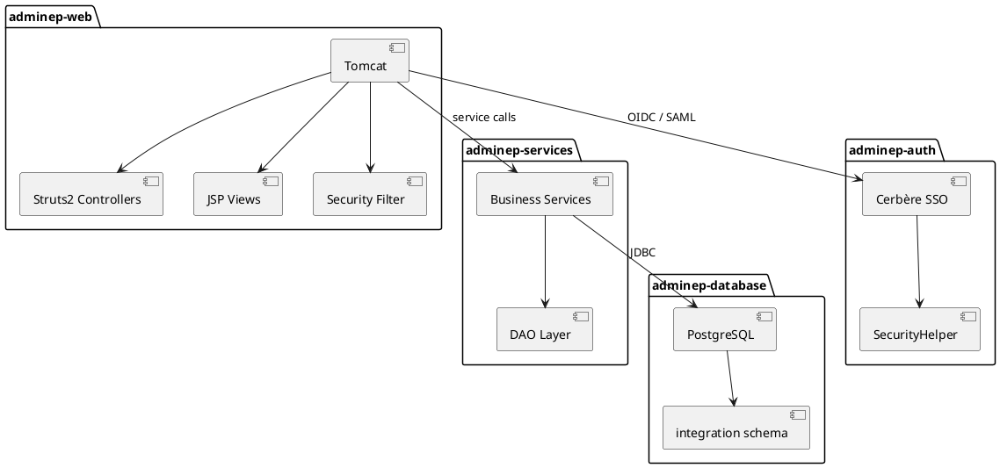
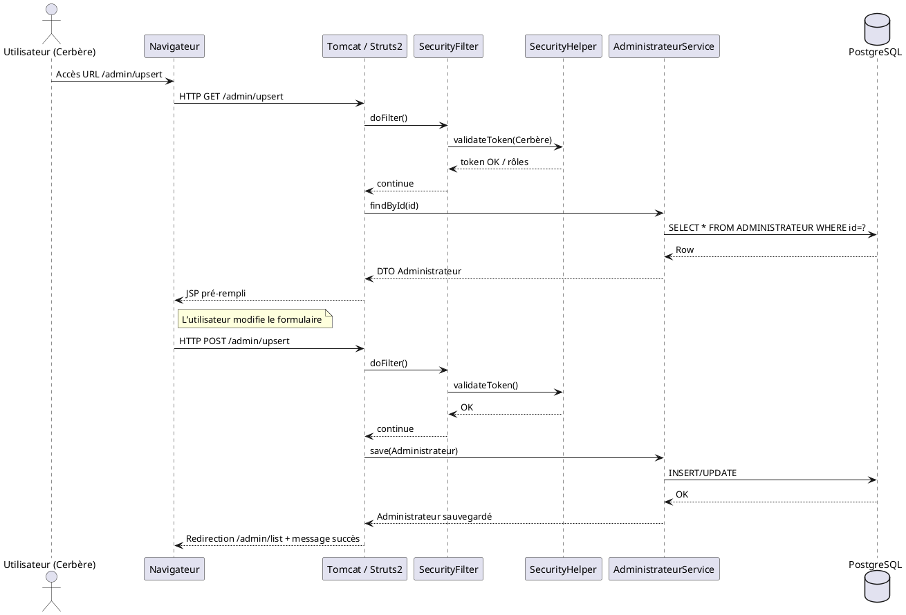
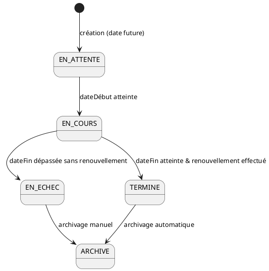
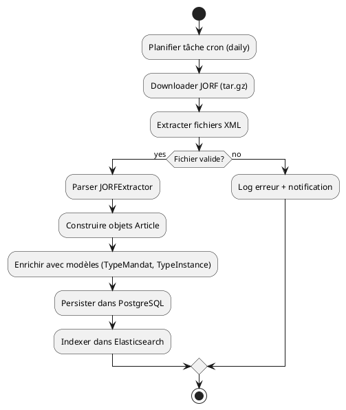

# 📘 Cahier des Spécifications Techniques (CST) – **admin_ep**  

[TOC]

---  

## 1️⃣ Introduction et objectifs techniques  <a id="section-intro"></a>

| Élément | Description |
|---|---|
| **Nom du projet** | **admin_ep** – Administration des établissements publics |
| **Contexte** | Application Java destinée à la gestion des membres des conseils d’administration des établissements publics placés sous la tutelle du Ministère de la Transition Écologique (MTES‑MCT). |
| **Environnements** | Développement, Recette, Pré‑production, Production (hébergement MSP – datacenter Paris La Défense). |
| **Objectifs de qualité (ISO 25010)** | <ul><li>**Aptitude fonctionnelle** – Respect du cahier des charges fonctionnel (saisie, recherche, archivage, notifications).</li><li>**Performance** – Temps de réponse ≤ 2 s en charge normale, capacité de 200 req/s.</li><li>**Compatibilité** – Navigateur moderne, API REST & Struts 2, SSO Cerbère.</li><li>**Utilisabilité** – UI web accessible (WCAG 2.1 AA), ergonomie des formulaires.</li><li>**Fiabilité** – Disponibilité ≥ 99,9 % (HA Tomcat, réplication PostgreSQL).</li><li>**Sécurité** – Conformité RGPD, OWASP Top 10, chiffrement TLS 1.2+.</li><li>**Maintenabilité** – Code Java 8, conventions Sun/Google, tests ≥ 80 % de couverture.</li><li>**Portabilité** – Conteneurisation Docker, exécution sur Linux (CentOS 7/8) et Windows (dev).</li></ul> |
| **Conformité réglementaire** | <ul><li>RGPD – registre des traitements, consentement, droit d’accès.</li><li>RGS – exigences de sécurité (TLS, authentification forte).</li><li>Référentiels internes : SSI, CCTP ministériel.</li></ul> |

↩︎ [Retour au sommaire](#toc)

---  

## 2️⃣ Architecture logicielle  <a id="section-architecture"></a>

### 2.1 Diagramme de composants (UML)  



> *Le diagramme ci‑dessus représente les principaux modules Maven : **adminep‑database**, **adminep‑web**, **adminep‑services**, **adminep‑auth** ainsi que leurs dépendances externes (PostgreSQL, Cerbère SSO, Tomcat).*

### 2.2 Description modulaire  

| Module | Responsable | Contenu principal | Technologies |
|---|---|---|---|
| **adminep-database** | DBA | Scripts SQL d’initialisation, séquences, tables d’intégration, migrations. | PostgreSQL 9.6 / 15, Maven Assembly (zip des scripts). |
| **adminep-web** | Front‑end | Struts 2, JSP, contrôleurs d’interface (admins, établissements, mandats, statistiques). | Java 8, Struts 2, Apache Tomcat 9, Log4j2, DisplayTag. |
| **adminep-services** | Back‑end | Services métiers (Article, Administrateur, Gestionnaire, Mandat, Integration). | Java 8, Vertigo (ORM), Vertigo‑VEGA (filters), Vertigo‑DYNAMOX (re‑indexation). |
| **adminep-auth** | Sécurité | Gestion du SSO Cerbère, helpers de droits, filtres HTTP. | OAuth2 / OIDC, SAML, SSL, TrustManagerAllCertificates. |
| **adminep-deployment** | DevOps | Assemblage des artefacts (WAR, ZIP), scripts de déploiement, configuration. | Maven, Docker, Kubernetes (optionnel), Ansible. |
| **adminep-doc** | Documentation | Assembleur de la documentation technique (PDF, HTML). | Maven‑site, Asciidoctor. |

### 2.3 Patterns architecturaux  

| Pattern | Usage | Justification |
|---|---|---|
| **MVC (Struts 2)** | Séparation UI / contrôleurs / modèle. | Facilite la maintenabilité et les tests unitaires. |
| **DAO / Service Layer** | Accès aux données via Vertigo‑ORM, logique métier isolée. | Permet le découplage et le remplacement du SGBD si besoin. |
| **Facade** (adminep‑services) | Regroupe plusieurs services pour les actions complexes (ex. : analyse JORF). | Simplifie les appels depuis les contrôleurs. |
| **Factory (TrustManagerAllCertificates)** | Création d’un TrustManager permissif en mode test. | Centralise la logique de création de certificats. |
| **Singleton (SecurityHelper)** | Gestion du contexte de sécurité partagé. | Garantit une unique source d’autorisation. |
| **Circuit Breaker (Future)** | Prévu pour les appels externes (API JORF). | Améliore la résilience. |

↩︎ [Retour au sommaire](#toc)

---  

## 3️⃣ Stack technique détaillée  <a id="section-stack"></a>

| Niveau | Technologie | Version | Rôle |
|---|---|---|---|
| **Langage** | Java | 8 (compatibilité JDK 8) | Implémentation métier, contrôleurs, services. |
| **Frameworks** | Struts 2 | 2.5.x | MVC web. |
| | Vertigo (Vertigo‑ORM, Vertigo‑VEGA, Vertigo‑DYNAMOX) | 2.3.x | ORM, filtres, recherche full‑text. |
| | DisplayTag | 1.2.x | Table HTML enrichie. |
| **Serveur d’applications** | Apache Tomcat | 9.0.8 (production / 10 en évolution) | Hébergement du WAR. |
| **Base de données** | PostgreSQL | 9.6.11 (production) – 15 (prévision) | Persistance des référentiels. |
| **Moteur de recherche** | Elasticsearch | 7.x (via `elasticsearch.yml`) | Indexation des articles JORF. |
| **Gestion de dépendances / build** | Maven | 3.6.x | Compilation, packaging, assembly. |
| **Conteneurisation** | Docker | 20.x | Image `adminep-web` (Tomcat + WAR). |
| **CI/CD** | GitLab CI | – | Pipelines de build, test, déploiement. |
| **Logging** | Log4j2 | 2.17.x | Centralisation logs, rotation. |
| **Sécurité** | TLS 1.2+, OAuth2 / OIDC, SAML (Cerbère) | – | Authentification SSO, chiffrement. |
| **Configuration** | Spring‑like XML (boot‑config) | – | Paramètres applicatifs, datasource, Elasticsearch. |
| **Tests** | JUnit 5, Mockito, Selenium (E2E) | – | Unitaires, intégration, UI. |
| **Documentation** | Asciidoctor, Maven‑site | – | Génération du site technique. |

↩︎ [Retour au sommaire](#toc)

---  

## 4️⃣ Modélisation statique  <a id="section-static-model"></a>

### 4.1 Diagramme de classes (UML)

```plantuml
@startuml
package "model" {
    class RoleApplicatifEnum {
        +ADMIN
        +GESTIONNAIRE
        +SUPER_ADMIN
    }
    class RoleVertigoEnum {
        +READ
        +WRITE
        +ADMIN
    }
    class TypeProfilBaseAdmin {
        +id : Long
        +libelle : String
    }
    class TypeProfilCerbere {
        +id : Long
        +libelle : String
    }
    class Administrateur {
        +id : Long
        +nom : String
        +prenom : String
        +profil : TypeProfilBaseAdmin
    }
    class Etablissement {
        +id : Long
        +siren : String
        +libelle : String
        +typeInstance : TypeInstance
    }
    class Mandat {
        +id : Long
        +type : TypeMandat
        +dateDebut : Date
        +dateFin : Date
    }
    class Charge {
        +id : Long
        +libelle : String
    }
    class Ministere {
        +id : Long
        +sigle : String
        +nom : String
    }
    class TypeInstance {
        +id : Long
        +type : String
    }
    class TypeMandat {
        +id : Long
        +type : String
    }
}
package "service" {
    interface AdministrateurService {
        +findById(Long) : Administrateur
        +save(Administrateur) : Administrateur
    }
    interface EtablissementService { … }
    interface MandatService { … }
}
AdministrateurService <|.. AdministrateurServiceImpl
EtablissementService <|.. EtablissementServiceImpl
MandatService <|.. MandatServiceImpl
Administrateur --> RoleApplicatifEnum
Etablissement --> TypeInstance
Mandat --> TypeMandat
Charge --> Ministere
@enduml
```

> *Ce diagramme représente les entités du domaine (modèle) et les interfaces de services métier exposées.*

### 4.2 Modèle physique de données (MPD)

| Table | Clé primaire | Clés étrangères | Indexes |
|---|---|---|---|
| **TYPE_MANDAT** | TMA_ID | – | idx_type_mandat_type |
| **TYPE_INSTANCE** | TIN_ID | – | idx_type_instance_type |
| **CHARGE** | CHA_ID | – | idx_charge_libelle |
| **MINISTERE** | MIN_ID | – | idx_ministere_sigle |
| **COLLEGE** | COL_ID | – | idx_college_identifiant |
| **ETABLISSEMENT** | ETA_ID | TIN_ID_FK → TYPE_INSTANCE | idx_etablissement_siren |
| **SYNONYME_COLLEGE** | (COL_ID_FK, SYN_SYNONYME) | COL_ID_FK → COLLEGE | – |
| **MINISTERE_CHARGE** | (CHA_ID_FK, MIN_ID_FK) | CHA_ID_FK → CHARGE, MIN_ID_FK → MINISTERE | – |
| **ETABLISSEMENT_COLLEGE** | (ETA_ID_FK, COL_ID_FK) | ETA_ID_FK → ETABLISSEMENT, COL_ID_FK → COLLEGE | – |
| **TUTELLE_ETABLISSEMENT_CHARGE** | (ETA_ID_FK, CHA_ID_FK) | ETA_ID_FK → ETABLISSEMENT, CHA_ID_FK → CHARGE | – |
| **DIRECTION** | DIR_ID | – | idx_direction_sigle |
| **DIRECTION_MINISTERE** | (DIR_ID_FK, MIN_ID_FK) | DIR_ID_FK → DIRECTION, MIN_ID_FK → MINISTERE | – |

↩︎ [Retour au sommaire](#toc)

---  

## 5️⃣ Modélisation dynamique  <a id="section-dynamic"></a>

### 5.1 Diagramme de séquence (authentification + mise à jour d’un administrateur)



### 5.2 Diagramme d’états‑transitions (cycle de vie d’un mandat)



### 5.3 Diagramme d’activités (processus d’import JORF)



↩︎ [Retour au sommaire](#toc)

---  

## 6️⃣ Interfaces et intégrations  <a id="section-interfaces"></a>

| Interface | Type | Description | Contrat (OpenAPI / XSD) |
|---|---|---|---|
| **Web UI** | HTTP/HTML (Struts2) | Formulaires d’administration, recherche, statistiques. | N/A (JSP). |
| **API interne** | Java Interface (service layer) | `AdministrateurService`, `EtablissementService`, etc. | JavaDoc, Maven JAR. |
| **Elasticsearch** | REST (JSON) | Indexation et recherche d’articles JORF. | `/_bulk`, `/_search`. |
| **Cerbère SSO** | OAuth2 / OIDC (HTTPS) | Authentification unique, propagation des rôles. | `/.well-known/openid-configuration`. |
| **Export CSV** | HTTP GET (file) | Extraction de listes d’administrateurs. | MIME `text/csv`. |
| **Notification mail** | SMTP (TLS) | Envoi d’alertes d’échéance de mandat. | Template `mandat_alerte.ftl`. |
| **Batch JORF** | File (tar.gz) + HTTP (RSS) | Téléchargement quotidien des archives JORF. | XSD JORF (DILA). |

↩︎ [Retour au sommaire](#toc)

---  

## 7️⃣ Architecture de déploiement  <a id="section-deployment"></a>

### 7.1 Diagramme de déploiement (UML)

```plantuml
@startuml
node "Développeur" {
    [IDE (IntelliJ/Eclipse)]
}
node "CI/CD (GitLab)" {
    [Runner Docker]
}
node "Environnement DEV" {
    artifact "adminep-web.war"
    database "PostgreSQL (Docker)"
    container "Tomcat 9 (Docker)" as TomcatDev
}
node "Environnement PREPROD" {
    container "Tomcat 9 (VM)" as TomcatPre
    database "PostgreSQL 9.6"
}
node "Environnement PROD" {
    cloud "AWS / OVH" {
        component "Load Balancer (HTTPS)" as LB
        container "Tomcat 9 (Cluster ESXi)" as TomcatProd
        database "PostgreSQL 15 (HA, streaming replication)"
        component "Elasticsearch 7.x"
    }
}
TomcatDev --> DB : JDBC
TomcatPre --> DB : JDBC
TomcatProd --> DB : JDBC
TomcatProd --> Elasticsearch : REST
LB --> TomcatProd : HTTPS
@enduml
```

### 7.2 Description des environnements  

| Environnement | Serveur d’applications | Base de données | Réseau | HA / Failover |
|---|---|---|---|---|
| **DEV** | Tomcat 9 (Docker) + Maven‑Jetty (local) | PostgreSQL 13 (Docker) | localhost | Aucun (dev). |
| **RECETTE** | Tomcat 9 (VM) | PostgreSQL 9.6 (single) | VLAN interne | Redondance VM (optional). |
| **PRE‑PROD** | Tomcat 9 (cluster) | PostgreSQL 12 (streaming) | DMZ + VPN | Tomcat load‑balancer, DB standby. |
| **PRODUCTION** | Tomcat 9 (cluster ESXi) | PostgreSQL 15 (primary/standby) | DMZ, firewall strict | LB (HAProxy), DB failover, Elasticsearch cluster. |

↩︎ [Retour au sommaire](#toc)

---  

## 8️⃣ Sécurité technique  <a id="section-security"></a>

| Aspect | Implémentation | Référence |
|---|---|---|
| **Authentification** | Cerbère SSO (OAuth2 / OIDC) → JWT signé, validation via `SecurityHelper`. | ISO 27001, RGS. |
| **Autorisation** | Rôles applicatifs (`RoleApplicatifEnum`) + droits (`RightsHelper`). | OWASP Access‑Control. |
| **Chiffrement en transit** | TLS 1.2+ sur HTTP, JDBC SSL, Elasticsearch HTTPS. | NIST SP 800‑52. |
| **Chiffrement au repos** | PostgreSQL `pgcrypto` pour colonnes sensibles (emails). | RGPD‑Art 32. |
| **Gestion des secrets** | `vault` (HashiCorp) ou `K8s Secrets`; variables d’environnement. | ISO 27002. |
| **Protection contre les vulnérabilités** | - Dépendances à jour (Maven‑enforcer). <br>- OWASP Dependency‑Check. <br>- Input validation via Struts2 validators. | OWASP Top 10. |
| **Journalisation** | Log4j2 avec appender JSON, rotation quotidienne, masquage des PII. | ISO 25012 (confidentialité). |
| **Tests de sécurité** | OWASP ZAP (scan dynamique), SonarQube (analyse statique). | ISO 25024. |

↩︎ [Retour au sommaire](#toc)

---  

## 9️⃣ Qualité et tests (ISO 29119)  <a id="section-tests"></a>

| Niveau | Type de test | Outils | Objectif | Couverture |
|---|---|---|---|---|
| **Unitaire** | JUnit 5 + Mockito | Maven Surefire | Vérifier chaque méthode métier. | ≥ 80 % (lines). |
| **Intégration** | Testcontainers (PostgreSQL, Elasticsearch) | Maven Failsafe | Scénarios service ↔ DB, service ↔ ES. | ≥ 70 % (branches). |
| **Fonctionnel** | Selenium WebDriver (Chrome) | Maven Failsafe | Parcours UI (login, recherche, upsert). | Scénarios critiques (5). |
| **Performance** | JMeter, Gatling | – | 200 req/s, latence ≤ 2 s, 95 % OK. | – |
| **Sécurité** | OWASP ZAP, SonarQube | – | Détection XSS, SQLi, CSRF. | Aucun défaut critique. |
| **Recette** | Tests d’acceptation (Cucumber) | – | Validation du cahier des charges fonctionnel. | Tous les critères fonctionnels. |
| **Gestion des tests** | Test Plan, Test Cases, Test Suites (ISO 29119) | TestLink | Traçabilité exigences → tests. | – |

**Critères d’acceptation techniques**  

- Tous les tests passent dans le pipeline CI.  
- Couverture globale ≥ 80 % (lines) et ≥ 70 % (branches).  
- Aucun défaut de sécurité de niveau **High** détecté.  
- Temps moyen de build ≤ 10 min.  

↩︎ [Retour au sommaire](#toc)

---  

## 🔟 Performance et scalabilité  <a id="section-performance"></a>

| KPI | Valeur cible | Méthode de mesure |
|---|---|---|
| **Temps de réponse moyen** | ≤ 2 s (page list) | JMeter – 100 concurrents. |
| **Débit** | 200 req/s (peak) | Gatling – scénario mixte. |
| **Utilisation CPU** | ≤ 70 % (4 cœurs) | Grafana + Prometheus. |
| **Mémoire JVM** | < 1 GiB (heap) | JConsole / VisualVM. |
| **Scalabilité horizontale** | Ajout d’une instance Tomcat → capacité + 30 % sans re‑déploiement. | Test de cluster. |
| **Cache** | 2 min (EhCache) pour listes statiques. | Vérification via HTTP headers. |
| **Gestion de la charge** | Back‑pressure via Tomcat thread pool (maxThreads = 200). | Logs Tomcat. |

**Stratégies d’optimisation**  

- Indexation des colonnes de recherche (`nom`, `siren`).  
- Utilisation de **prepared statements** (Vertigo‑ORM).  
- Caching HTTP (`Cache‑Control`) pour les pages de consultation.  
- Mise en place d’un **pool de connexion** (HikariCP) avec taille adaptée.  

↩︎ [Retour au sommaire](#toc)

---  

## 1️⃣1️⃣ Maintenabilité et exploitation  <a id="section-maintenance"></a>

| Aspect | Pratique |
|---|---|
| **Normes de code** | Java 8, Google Java Style Guide, Checkstyle, SpotBugs. |
| **Documentation** | Javadoc complet, README MD, diagrammes PlantUML dans `/docs`. |
| **Logging** | Log4j2 JSON, MDC (requestId, userId). |
| **Monitoring** | Prometheus + Grafana (JVM, DB, Tomcat, ES). |
| **Alerting** | Alertmanager (latence > 3 s, erreurs 5xx > 5 %). |
| **Déploiement** | Docker‑Compose (dev), Helm chart (k8s), Ansible playbooks (VM). |
| **Rollback** | Versionnage d’artefacts (semver), script `helm rollback` ou `docker-compose down && up`. |
| **Gestion de configuration** | Spring‑like XML + `environment` variables, secrets via Vault. |
| **Gestion des dépendances** | Maven `dependencyManagement`, version lock, `mvn versions:display-dependency-updates`. |

↩︎ [Retour au sommaire](#toc)

---  

## 1️⃣2️⃣ Gestion des erreurs et résilience  <a id="section-error"></a>

| Type d’erreur | Traitement |
|---|---|
| **Exception métier** (ex. : `MandatNotFoundException`) | Capturée par `ErrorHandler`, retour HTTP 404 + message JSON. |
| **Erreur d’accès DB** | Retry (3×) via Spring‑Retry, puis fallback `ServiceUnavailableException`. |
| **Timeout HTTP externe** (JORF) | `CircuitBreaker` (Hystrix) → réponse vide + alerte. |
| **Défaillance Tomcat** | Redémarrage automatique via systemd / Kubernetes liveness probe. |
| **Overflow JVM** | OOM‑kill, alert via Prometheus, scaling horizontal. |
| **Défaillance Elasticsearch** | Re‑indexation différée, utilisation du cache local. |

**Plan de reprise d’activité (PRA)**  

1. **Sauvegarde** quotidienne des bases (pg_dump) + WAL archiving.  
2. **Snapshot** des images Docker (Harbor).  
3. **Failover** : bascule automatique du primary PostgreSQL vers le standby via Patroni.  
4. **Test** du PRA chaque trimestre (simulation d’arrêt complet).  

↩︎ [Retour au sommaire](#toc)

---  

## 1️⃣3️⃣ Contraintes et dépendances  <a id="section-constraints"></a>

| Contrainte | Détails |
|---|---|
| **Legacy** | Tomcat 9, Java 8, PostgreSQL 9.6 (production) – migration prévue vers Tomcat 10 / PostgreSQL 15. |
| **Intégrations imposées** | Cerbère SSO (déploiement interne), Elasticsearch 7.x, DILA JORF (RSS + tar.gz). |
| **Dépendances externes** | `org.apache.struts:struts2-core:2.5.x`, `com.github.jferard:fastods:0.12.x`, `org.displaytag:displaytag:1.2.x`. |
| **Licences** | Apache 2.0 (majorité), LGPL (DisplayTag), propriétaire (Cerbère). |
| **Contraintes de sécurité** | Aucun port ouvert autre que 443 (HTTPS) et 5432 (DB interne). |
| **Contraintes de conformité** | RGPD – stockage chiffré des données à caractère personnel, droit à l’oubli. |
| **Contraintes d’infrastructure** | VM ESXi / KVM, réseau isolé, quotas de stockage (500 GB). |

↩︎ [Retour au sommaire](#toc)

---  

## 1️⃣4️⃣ Annexes techniques  <a id="section-annexes"></a>

### 14.1 Glossaire  

| Terme | Définition |
|---|---|
| **Cerbère** | Système d’authentification unique (SSO) de la DGSI, compatible OAuth2/OIDC. |
| **JORF** | Journal officiel de la République française – source des nominations. |
| **Mandat** | Période d’exercice d’un administrateur (titulaire ou suppléant). |
| **Charge** | Ministère ou délégation responsable d’un établissement. |
| **ACA​I** | Plateforme Java interne du ministère (clusters ESXi). |
| **Vertigo** | Framework interne (ORM, DI, tâches asynchrones). |
| **KSP** | Vertigo‑definition file (model). |
| **ADR** | Architecture Decision Record – décisions majeures (ex. : choix Struts 2, SSO Cerbère). |

### 14.2 Références des frameworks et bibliothèques  

| Bibliothèque | Version | Licence |
|---|---|---|
| Struts 2 | 2.5.30 | Apache 2.0 |
| Vertigo Core | 2.3.4 | Apache 2.0 |
| Vertigo‑VEGA | 2.3.4 | Apache 2.0 |
| Log4j2 | 2.17.1 | Apache 2.0 |
| JUnit 5 | 5.8.2 | Eclipse Public License |
| Mockito | 4.2.0 | MIT |
| Selenium | 4.1.0 | Apache 2.0 |
| OWASP ZAP | 2.10.0 | Apache 2.0 |
| PostgreSQL JDBC | 42.3.3 | BSD‑3 |
| Elasticsearch Java API | 7.15.0 | Apache 2.0 |
| FastODS (style) | 0.12.0 | Apache 2.0 |

### 14.3 Architecture Decision Records (ADR) pertinents  

| # | Décision | Résultat |
|---|---|---|
| **ADR‑001** | Choix du framework web : **Struts 2** vs Spring MVC. | Struts 2 retenu pour cohérence historique, compatibilité avec Vertigo. |
| **ADR‑002** | Authentification via **Cerbère SSO** plutôt que gestion locale. | Centralisation, conformité RGPD, réduction du périmètre d’attaque. |
| **ADR‑003** | Utilisation de **Maven Assembly** pour empaqueter les scripts SQL. | Simplifie la génération du zip `adminep-database-sql.zip`. |
| **ADR‑004** | Conteneurisation Docker à partir de **Tomcat 9** (alpine) pour le web. | Facilité de déploiement, isolation des dépendances. |
| **ADR‑005** | Indexation des articles JORF dans **Elasticsearch** plutôt que en base pure. | Recherche full‑text rapide, scalabilité. |

---  

*Fin du Cahier des Spécifications Techniques.*  

---  

**Document généré le** `2026‑04‑27` **par** ChatGPT (modèle GPT‑4).  