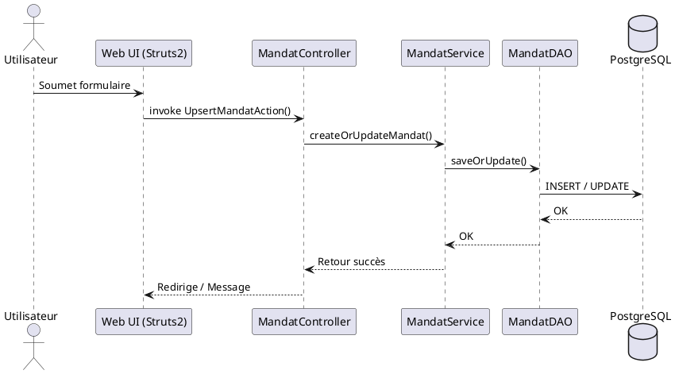
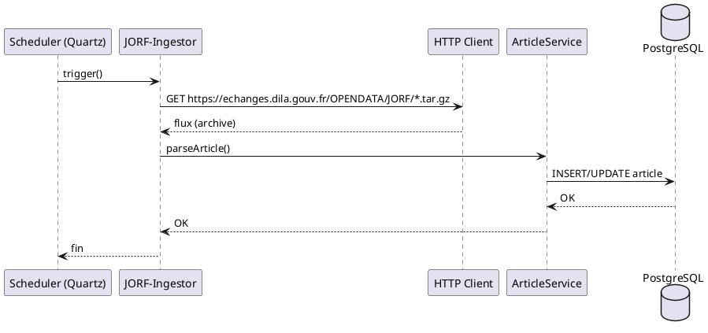

# 📂 Dossier d’Architecture Technique (DAT) – **admin_ep**  
*Version du DAT : 2024‑04‑27*  

[TOC]

---  

## 1️⃣ Introduction & Vision architecturale  

**Objectif** – Fournir une vue claire, vivante et itérative de l’architecture du projet **admin_ep** (Administration des établissements publics).  

**Résumé exécutif** –  
admin_ep est une application Java 8 (Struts 2 / Vertigo) déployée sur Tomcat 9, persistant les données dans PostgreSQL 9.6 (migration prévue vers 15). Elle expose une interface web (JSP) aux utilisateurs (SPES, DG de tutelle, opérateurs) et consomme les publications du **Journal Officiel de la République Française (JORF)** pour alimenter automatiquement la base. L’authentification s’appuie sur le service **Cerbère** (SSO ministériel). L’application est en cours de conteneurisation (Docker) et d’évolution vers une plateforme IaaS (ECO4).  

**Qualités prioritaires (ISO / IEC 25010)**  

| Qualité | Niveau visé | Raison |
|--------|-------------|--------|
| **Sécurité** | ★★★★★ | Gestion d’identités sensibles via Cerbère, conformité DICT. |
| **Fiabilité** | ★★★★ | Gestion de la persistance, archivage des mandats. |
| **Performance** | ★★★ | Chargement de listes (administrateurs, établissements) – cache envisagé. |
| **Maintenabilité** | ★★★★★ | Architecture modulaire (controllers / services / model). |
| **Portabilité** | ★★★ | Migration vers conteneurs Docker, IaaS. |

**Documents associés**  

| Document | Lien |
|----------|------|
| Cahier des charges fonctionnel (CCF) | `admin_ep-doc/assembly.xml` |
| Spécifications techniques (CST) | `admin_ep-web/src/main/resources/boot/config/application-config.xml` |
| Wiki produit | `admin_ep.wiki.md` |
| Fiche produit | `admin_ep.wiki.md` (section *Fiche‑Produit*) |

---  

## 2️⃣ Niveau 1 – Vue **Contexte** (C4 System Context)  

```plantuml
@startuml
!include https://raw.githubusercontent.com/plantuml-stdlib/C4-PlantUML/master/C4_Context.puml

System_Boundary(admin_ep, "admin_ep") {
    System(admin, "admin_ep – Application web")
    System(db, "PostgreSQL – Base de données")
    System(jorf, "JORF – Source de données législatives")
    System(cerbere, "Cerbère – Authentification SSO")
    System(monitoring, "Monitoring (Prometheus / Grafana)")

    Person(user, "Utilisateur métier", "SPES, DG de tutelle, Opérateurs")
}

Rel(user, admin, "Utilise UI (HTTPS)", "HTML/JSP")
Rel(admin, db, "Lecture/Écriture", "JDBC")
Rel(admin, jorf, "Consommation quotidienne", "HTTP/HTTPS (RSS, TAR.GZ)")
Rel(admin, cerbere, "Authentifie via SSO", "OAuth2 / SAML")
Rel(admin, monitoring, "Envoie métriques & logs", "HTTP")
@enduml
```

**Description** – Le système **admin_ep** se situe au cœur d’un périmètre ministériel : il expose une UI aux utilisateurs internes, persiste les données dans PostgreSQL, consomme les flux JORF et s’appuie sur Cerbère pour l’authentification.  

**Objectifs métier couverts** – Gestion des administrateurs, suivi des mandats, génération de statistiques, alertes d’échéance.  

---  

## 3️⃣ Niveau 2 – Vue **Conteneurs** (C4 Containers)  

```plantuml
@startuml
!include https://raw.githubusercontent.com/plantuml-stdlib/C4-PlantUML/master/C4_Container.puml

System_Boundary(admin_ep, "admin_ep") {
    Container(web_app, "admin_ep‑Web", "Java 8 (Struts2 / Vertigo)", "UI web, logique métier")
    Container(db, "PostgreSQL", "PostgreSQL 9.6 (→15)", "Persistance relationnelle")
    Container(jorf_ingest, "JORF‑Ingestor", "Java 8", "Extraction & transformation des flux JORF")
    Container(cerbere_proxy, "Cerbère‑Proxy", "Java 8 (Spring Security)", "Gestion SSO")
    Container(monitor, "Monitoring Agent", "Java 8", "Export métriques (Prometheus) & logs (Log4j2)")
}
Person(user, "Utilisateur métier")
Rel(user, web_app, "HTTPS (HTML/JSP)", "Navigateur")
Rel(web_app, db, "JDBC", "SQL")
Rel(web_app, jorf_ingest, "Appel REST", "HTTP")
Rel(web_app, cerbere_proxy, "OAuth2 / SAML", "HTTPS")
Rel(web_app, monitor, "Push métriques & logs", "HTTP")
@enduml
```

### Conteneurs détaillés  

| Conteneur | Responsabilité | Technologies |
|-----------|----------------|--------------|
| **admin_ep‑Web** | UI Struts2, contrôleurs, services métier, sécurité (Cerbère) | Java 8, Struts 2, Vertigo, Tomcat 9, Log4j2 |
| **PostgreSQL** | Persistance des tables : *TYPE_MANDAT, TYPE_INSTANCE, CHARGE, COLLEGE, ETABLISSEMENT …* | PostgreSQL 9.6 → 15 |
| **JORF‑Ingestor** | Extraction quotidienne des archives JORF, enrichissement des entités | Java 8, HTTP client, scheduler (Quartz) |
| **Cerbère‑Proxy** | Intermédiaire SSO, mapping des rôles Cerbère → rôles applicatifs | Java 8, Spring‑Security, OAuth2 |
| **Monitoring Agent** | Export métriques (temps de réponse, taux d’erreur) et logs centralisés | Prometheus client, Log4j2 appender |

### Décisions d’architecture majeures (voir ADR‑001, ADR‑002)  

* **Monolithe vs micro‑services** – Le projet a été conservé sous forme d’un **monolithe Java** (container unique) afin de limiter la complexité opérationnelle et de respecter le périmètre fonctionnel actuel.  
* **Stack technologique** – Java 8, Tomcat 9, PostgreSQL 9.6 ont été retenus pour leur maturité au sein du ministère et la compatibilité avec les environnements existants.  

---  

## 4️⃣ Architecture Decision Records (ADRs)  

> Chaque ADR suit le format : **Contexte → Options → Décision → Conséquences**.  

### ADR‑001 – Choix de l’architecture globale  

- **Statut** : Accepté  
- **Date** : 2023‑02‑10  
- **Décideurs** : Chef de produit (Christian Arbogast), Architecte (Guillaume Decuq)  

#### Contexte  
L’application doit être rapidement mise en production, exploiter les services existants (Cerbère, JORF) et être maintenable par l’équipe de développement interne.  

#### Options considérées  

| Option | Avantages | Inconvénients |
|--------|-----------|---------------|
| **Monolithe Java (Struts 2)** | Simplicité de déploiement, moindre coût d’infrastructure, réutilisation du code existant. | Scalabilité limitée, risque de “big‑ball of mud”. |
| **Micro‑services (Spring Boot)** | Scalabilité horizontale, isolation des domaines fonctionnels. | Complexité d’orchestration, besoin d’une plateforme Kubernetes, montée en compétences. |
| **Serverless (FaaS)** | Facturation à l’usage, aucun serveur à gérer. | Inadapté aux besoins d’état (transactions DB) et à la dépendance à Cerbère. |

#### Décision  
Adopter le **monolithe Java** (Struts 2) comme architecture de base, avec une **future migration progressive** vers des conteneurs Docker (ADR‑005).  

#### Conséquences  

- **Positives** : Déploiement rapide, moindre dette technique initiale.  
- **Négatives** : Limitation future de la scalabilité ; besoin de refactoriser pour micro‑services si la charge augmente.  
- **À valider** : Pilotage d’une version containerisée (Docker) avant toute migration micro‑services.  

---  

### ADR‑002 – Stack technologique principal  

- **Statut** : Accepté  
- **Date** : 2023‑02‑12  
- **Décideurs** : Architecte, Responsable Infra  

| Option | Avantages | Inconvénients |
|--------|-----------|---------------|
| **Java 8 + Tomcat 9 + PostgreSQL 9.6** | Compatibilité avec les environnements ministériels, stabilité, licences open source. | Java 8 approche de fin de vie, PostgreSQL 9.6 obsolète. |
| **Java 11 + WildFly + PostgreSQL 12** | LTS plus recent, meilleures performances. | Nécessite migration du code, validation de compatibilité Cerbère. |
| **Kotlin + Quarkus + PostgreSQL 15** | Modernité, temps de démarrage réduit. | Risque de rupture de compétences, impact sur la maintenance. |

**Décision** – Conserver **Java 8 / Tomcat 9 / PostgreSQL 9.6** pour la version actuelle, avec un **plan de migration** vers **Java 11 / PostgreSQL 15** (voir ADR‑011).  

---  

### ADR‑003 – Stratégie de persistance des données  

- **Statut** : Accepté  
- **Date** : 2023‑02‑15  
- **Décideurs** : DBA, Architecte  

| Option | Avantages | Inconvénients |
|--------|-----------|---------------|
| **Schéma unique (integration)** | Simplicité, pas de duplication. | Risque de verrous, complexité de requêtes. |
| **Schéma dédié par domaine (admin, integration)** | Isolation, meilleure gouvernance. | Gestion supplémentaire des migrations. |
| **Event‑sourcing** | Historisation native. | Implémentation lourde, surcharge. |

**Décision** – Utiliser le **schéma `integration`** unique (déjà en place) et **activer les contraintes de clé étrangère** pour garantir l’intégrité référentielle.  

---  

### ADR‑004 – Pattern d’authentification & sécurité  

- **Statut** : Accepté  
- **Date** : 2023‑02‑20  
- **Décideurs** : Responsable Sécurité, Architecte  

| Option | Avantages | Inconvénients |
|--------|-----------|---------------|
| **Cerbère (SSO)** | Centralisation, conformité ministérielle. | Dépendance externe, besoin de proxy. |
| **Gestion locale (LDAP)** | Indépendance. | Duplication des comptes, surcharge d’administration. |
| **JWT + OAuth2 interne** | Flexibilité. | Implémentation lourde. |

**Décision** – S’appuyer sur **Cerbère** via le **Cerbère‑Proxy** (Spring‑Security) pour l’authentification et la gestion des rôles applicatifs (`RoleApplicatifEnum`).  

---  

### ADR‑005 – Stratégie de déploiement & conteneurisation  

- **Statut** : Proposé (en cours)  
- **Date** : 2023‑03‑01  
- **Décideurs** : DevOps, Chef de produit  

| Option | Avantages | Inconvénients |
|--------|-----------|---------------|
| **Déploiement classique (WAR sur Tomcat)** | Simplicité, déjà en place. | Gestion manuelle des serveurs, faible portabilité. |
| **Docker + Docker‑Compose** | Portabilité, reproductibilité, prérequis pour future IaaS. | Nécessite scripts de build, gestion des volumes DB. |
| **Kubernetes (EKS/ECS)** | Scalabilité, auto‑healing. | Complexité opérationnelle, besoin d’un cluster dédié. |

**Décision** – **Dockeriser** l’application (image `adminep-web`) et le **PostgreSQL** dans un **docker‑compose**. La migration vers Kubernetes sera étudiée (ADR‑012).  

---  

### ADR‑006 – Approche d’intégration avec systèmes externes  

- **Statut** : Accepté  
- **Date** : 2023‑03‑10  

| Option | Avantages | Inconvénients |
|--------|-----------|---------------|
| **Pull périodique (cron) du flux JORF** | Simplicité, maîtrise du timing. | Latence d’actualisation. |
| **Webhooks JORF** | Réactivité, push‑based. | Non disponible aujourd’hui. |
| **Message queue (Kafka)** | Découplage, résilience. | Infrastructure supplémentaire. |

**Décision** – Utiliser un **scheduler Quartz** (dans `admin_ep‑Web`) qui exécute le **JORF‑Ingestor** toutes les 24 h (pull).  

---  

### ADR‑007 – Stratégie de cache & performance  

- **Statut** : Proposé  
- **Date** : 2023‑04‑01  

| Option | Avantages | Inconvénients |
|--------|-----------|---------------|
| **Cache en mémoire (Ehcache)** | Gains de latence pour listes de référence. | Risque d’incohérence, besoin d’invalidation. |
| **Cache distribué (Redis)** | Scalabilité, persistance. | Complexité supplémentaire. |
| **Pas de cache** | Simplicité, données toujours à jour. | Performances limitées sur gros volumes. |

**Décision** – **Implémenter Ehcache** sur les tables de référence (TYPE_MANDAT, TYPE_INSTANCE, MODE_NOMINATION) avec TTL = 12 h.  

---  

### ADR‑008 – Gestion des erreurs & résilience  

- **Statut** : Accepté  
- **Date** : 2023‑04‑05  

| Option | Avantages | Inconvénients |
|--------|-----------|---------------|
| **ErrorHandler central (Struts2)** | Uniformisation, logs centralisés. | Nécessite bonne couverture. |
| **Circuit‑breaker (Resilience4j)** | Protection des appels externes (JORF). | Ajout de dépendances. |
| **Aucun** | Simplicité. | Risque de plantage complet. |

**Décision** – Utiliser **ErrorHandler** (`adminep‑web/src/main/java/fr/gouv/e2/baseadmin/errorhandler/ErrorHandler.java`) et ajouter **Resilience4j** autour du **JORF‑Ingestor**.  

---  

### ADR‑009 – Gestion des logs & monitoring  

- **Statut** : Accepté  
- **Date** : 2023‑04‑10  

| Option | Avantages | Inconvénients |
|--------|-----------|---------------|
| **Log4j2 + FileAppender** | Facile à configurer. | Pas de centralisation. |
| **Log4j2 + Syslog / ELK** | Centralisation, recherche. | Nécessite infra ELK. |
| **Prometheus + Grafana** | Métriques temps réel. | Implémentation supplémentaire. |

**Décision** – **Log4j2** (config `log4j2.xml`) + **Prometheus exporter** (via `monitoring` container).  

---  

### ADR‑010 – Stratégie de testabilité  

- **Statut** : Accepté  
- **Date** : 2023‑04‑15  

| Niveau | Outils | Objectif |
|--------|--------|----------|
| **Unitaire** | JUnit 5, Mockito | Couverture > 80 % des services. |
| **Intégration** | Spring‑Test, DBUnit | Vérifier les DAO, migrations. |
| **End‑to‑End** | Selenium, Cucumber | Scénarios critiques (login, création mandat). |
| **Performance** | JMeter | Tests de charge sur le service de recherche. |

---  

### ADR‑011 – Migration vers PostgreSQL 15 & Java 11  

- **Statut** : Proposé  
- **Date** : 2023‑05‑01  

| Option | Avantages | Inconvénients |
|--------|-----------|---------------|
| **Upgrade in‑place** | Minimal downtime. | Risque de régression. |
| **Migration via dump/restore** | Clean‑slate, possibilité de refactorer schémas. | Temps d’indisponibilité. |
| **Dual‑write (micro‑service)** | Transition progressive. | Complexité. |

**Décision** – **Planifier un upgrade in‑place** pendant la fenêtre de maintenance (Q4 2024).  

---  

### ADR‑012 – Adoption d’une plateforme Kubernetes (future)  

- **Statut** : En discussion  
- **Date** : 2023‑06‑01  

| Option | Avantages | Inconvénients |
|--------|-----------|---------------|
| **EKS (AWS)** | Service managé, scalabilité. | Coût, souveraineté des données. |
| **GKE (Google)** | Intégration CI/CD. | Même contrainte souveraineté. |
| **OpenShift (on‑prem)** | Conformité ministérielle. | Complexité d’installation. |

**Décision** – **OpenShift** sur le data‑center ministériel (déjà utilisé pour d’autres applications).  

---  

## 5️⃣ Niveau 3 – Vue **Composants** (C4 Container → Component)  

### 5.1 admin_ep‑Web (container)  

```plantuml
@startuml
!include https://raw.githubusercontent.com/plantuml-stdlib/C4-PlantUML/master/C4_Component.puml

Container(web, "admin_ep‑Web", "Java 8 (Struts2)", "Application web")

Component(controller, "Controllers", "Struts2 Actions", "Gestion des requêtes HTTP")
Component(service, "Services", "Business logic", "Orchestration des DAO")
Component(security, "Security", "Cerbère‑Proxy", "Gestion SSO, droits")
Component(model, "Domain Model", "POJOs", "Entités JPA")
Component(persistence, "DAO Layer", "JPA / Hibernate", "Accès PostgreSQL")
Component(scheduler, "Scheduler", "Quartz", "Planification JORF‑Ingestor")
Component(errorHandler, "ErrorHandler", "Struts2 Interceptor", "Gestion centralisée des erreurs")
Rel(controller, service, "Appelle")
Rel(service, persistence, "Utilise")
Rel(controller, security, "Vérifie")
Rel(service, scheduler, "Planifie")
Rel(controller, errorHandler, "Intercepte")
@enduml
```

#### Principaux composants  

| Composant | Classes représentatives | Rôle |
|-----------|----------------------|------|
| **Controllers** | `AccueilAction`, `DetailAdminAction`, `RechercheAdminsAction`, `UpsertAdminAction`, `DetailEPAction`, `RechercheEPAction`, `UpsertEPAction` | Traitement des requêtes HTTP, navigation. |
| **Services** | `ArticleServicesImpl`, `MandatServicesImpl`, `GestionnaireServicesImpl`, `ChargeServicesImpl` | Logique métier, validation, appels DAO. |
| **Security** | `SecurityManagerInitializer`, `BaseAdminUserSession`, `RightsHelper`, `Roles` | Authentification via Cerbère, contrôle d’accès. |
| **Model** | `RoleApplicatifEnum`, `RoleVertigoEnum`, `CodeEnum`, `WikiArticleUrl` | Représentation des entités métier. |
| **DAO** | `ArticleDao`, `MandatDao`, `EtablissementDao` (définis dans les *ksp* du répertoire `boot/definitions`) | Accès aux tables PostgreSQL. |
| **Scheduler** | `SchedulerInitializer`, `RecupererJORFActivityEngine`, `TraitementRecuperationJORF` | Extraction quotidienne du flux JORF. |
| **ErrorHandler** | `ErrorHandler` | Capture et journalisation des exceptions. |

---  

## 6️⃣ Niveau 4 – Vue **Code** (optionnelle)  

- **Pattern utilisés** : DAO, Service‑Facade, Interceptor (Struts2), Factory (Spring), Builder (`TableCellStyleBuilder`).  
- **Conventions** : Packages suivant la couche (`controller`, `services`, `model`, `security`, `util`).  
- **Standards** : Java 8, Checkstyle, SpotBugs, JUnit 5.  

---  

## 7️⃣ Vue **Exécution** – Scénarios critiques (Diagrammes de séquence)  

### 7.1 Création d’un mandat (flow “UpsertMandat”)  



### 7.2 Ingestion quotidienne du flux JORF  



---  

## 8️⃣ Vue **Déploiement** – Diagramme C4 Deployment  

```plantuml
@startuml
!include https://raw.githubusercontent.com/plantuml-stdlib/C4-PlantUML/master/C4_Deployment.puml

Node(prod, "Environnement Production") {
    ContainerDb(db, "PostgreSQL 15", "Docker", "Persistance")
    ContainerWeb(web, "admin_ep‑Web", "Docker (Tomcat 9)", "Application")
    ContainerProxy(proxy, "Cerbère‑Proxy", "Docker (Spring)", "SSO")
    ContainerIngest(ing, "JORF‑Ingestor", "Docker (Java)", "Extraction JORF")
    ContainerMon(monitor, "Monitoring Agent", "Docker (Prometheus)", "Métriques & logs")
}
Rel(web, db, "JDBC")
Rel(web, proxy, "OAuth2 / SAML")
Rel(web, ing, "REST (scheduler)")
Rel(web, monitor, "Push metrics")
@enduml
```

**Environnements**  

| Environnement | Description | Artefacts Docker |
|----------------|--------------|------------------|
| **Développement** | Docker‑Compose local, base PostgreSQL 15. | `adminep-web:dev`, `postgres:15` |
| **Recette** | IaaS (ECO4) – pré‑production, base de test. | `adminep-web:recette` |
| **Production** | Centre‑serveur ministériel (LDF), conteneurs orchestrés via OpenShift. | `adminep-web:prod` |

---  

## 9️⃣ Sujets transverses & qualités  

| Sujet | Description | Décisions clés |
|------|-------------|----------------|
| **Sécurité** | Authentification via Cerbère, contrôle d’accès (Roles). | ADR‑004, utilisation de `SecurityFilter`. |
| **Performance** | Cache Ehcache sur tables de référence, pagination des listes. | ADR‑007. |
| **Monitoring** | Prometheus + Grafana, logs Log4j2. | ADR‑009. |
| **Testabilité** | Tests unitaires, d’intégration, end‑to‑end. | ADR‑010. |
| **Gestion des erreurs** | `ErrorHandler`, Resilience4j pour appels JORF. | ADR‑008. |

---  

## 🔟 Risques & dettes techniques  

| Risque | Impact | Probabilité | Mitigation |
|--------|--------|--------------|------------|
| **Fin de vie Java 8 / PostgreSQL 9.6** | Bloquage de correctifs de sécurité. | Élevée | Plan migration (ADR‑011). |
| **Monolithe difficile à scaler** | Saturation en cas de pic d’usage. | Moyen | Containerisation (ADR‑005) + cache (ADR‑007). |
| **Dépendance à Cerbère** | Indisponibilité du SSO. | Faible | Fallback en mode “maintenance” (affichage page d’erreur). |
| **Gestion manuelle des scripts SQL** | Risque d’incohérence schema / données. | Moyen | Automatiser les migrations avec Flyway/Liquibase. |
| **Absence de circuit‑breaker sur JORF** | Plantage du scheduler si le flux est indisponible. | Moyen | Resilience4j (ADR‑008). |

**Dette technique identifiée**  

- **Legacy code** dans les anciens scripts d’initialisation (`adminep-database/scripts/init/*.sql`).  
- **Couplage direct** entre les contrôleurs Struts et les DAO (pas d’interface service).  
- **Absence de versionning des schémas** – à corriger avec **Flyway**.  

---  

## 1️⃣1️⃣ Feuille de route & évolutivité  

| Trimestre | Objectif | ADR(s) concerné(s) |
|-----------|-----------|--------------------|
| **Q2 2024** | Dockeriser l’application (ADR‑005). | ADR‑005 |
| **Q3 2024** | Implémenter Ehcache (ADR‑007). | ADR‑007 |
| **Q4 2024** | Upgrade PostgreSQL 15 & Java 11 (ADR‑011). | ADR‑011 |
| **2025** | Migration vers OpenShift (ADR‑012). | ADR‑012 |
| **2025‑2026** | Refactorisation en micro‑services (optionnel). | ADR‑001 (future) |

**ADRs futurs à envisager**  

- `ADR‑013 – Adoption d’un outil de migration de schéma (Flyway)`.  
- `ADR‑014 – Mise en place d’un bus d’événements (Kafka) pour la diffusion des changements de mandats`.  

---  

## 1️⃣2️⃣ Annexes  

### Glossaire  

| Terme | Définition |
|-------|------------|
| **CERBERE** | Service d’authentification unique du ministère. |
| **JORF** | Journal Officiel de la République Française – source légale des nominations. |
| **Mandat** | Période de mandat d’un administrateur au sein d’un établissement. |
| **Établissement** | Structure publique placée sous tutelle du ministère. |
| **ACAI** | Plateforme de virtualisation (clusters ESXi) utilisée en production. |
| **IaaS** | Infrastructure as a Service – plateforme d’hébergement (ECO4). |

### Index des ADRs  

| ADR | Titre | Statut |
|-----|-------|--------|
| ADR‑001 | Choix de l’architecture globale | Accepté |
| ADR‑002 | Stack technologique principal | Accepté |
| ADR‑003 | Stratégie de persistance des données | Accepté |
| ADR‑004 | Pattern d’authentification & sécurité | Accepté |
| ADR‑005 | Stratégie de déploiement & conteneurisation | Proposé |
| ADR‑006 | Approche d’intégration avec systèmes externes | Accepté |
| ADR‑007 | Stratégie de cache et performance | Proposé |
| ADR‑008 | Gestion des erreurs & résilience | Accepté |
| ADR‑009 | Gestion des logs & monitoring | Accepté |
| ADR‑010 | Stratégie de testabilité | Accepté |
| ADR‑011 | Migration vers PostgreSQL 15 & Java 11 | Proposé |
| ADR‑012 | Adoption d’une plateforme Kubernetes | En discussion |

### Références & ressources  

| Ressource | Lien |
|-----------|------|
| **Code source** | `gitlab_Applications/ambulon/workplace-ambulon/gitlab/admin_ep` |
| **Base de données** | `adminep-database/scripts/` (init, update) |
| **Documentation produit** | `admin_ep.wiki.md`, `admin_ep.wikisi.md` |
| **Fiche produit** | `admin_ep.wiki.md` (section *Fiche‑Produit*) |
| **Configuration Tomcat** | `admine0-web/src/main/webapp/WEB-INF/web.xml` |
| **Configuration Log4j2** | `adminep-web/src/main/resources/log4j2.xml` |
| **Déploiement Docker** | `adminep-deployment/assembly-*.xml` (Maven Assembly) |
| **Gestion des versions** | `pom.xml` à la racine du projet |

---  

*Ce DAT est un document vivant. Les ADRs, diagrammes et décisions seront revus à chaque itération du projet.*  