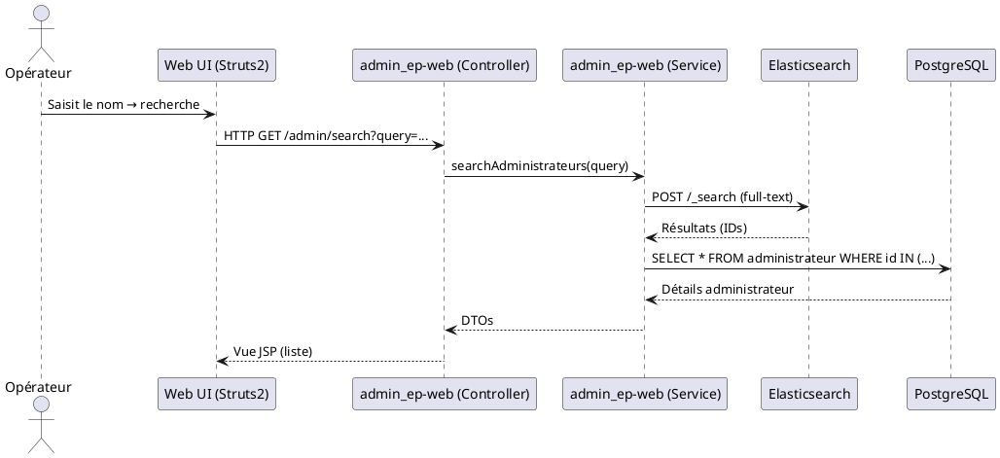
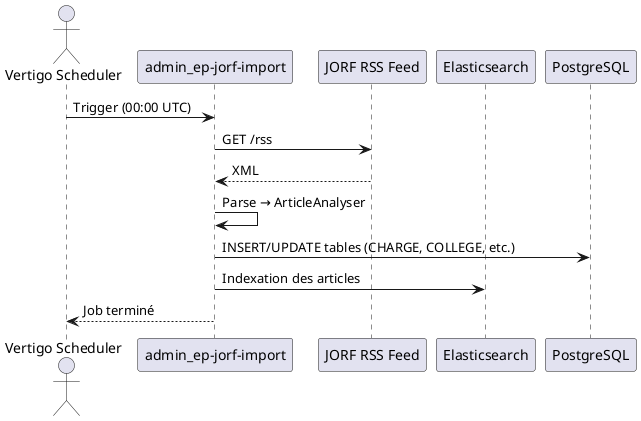
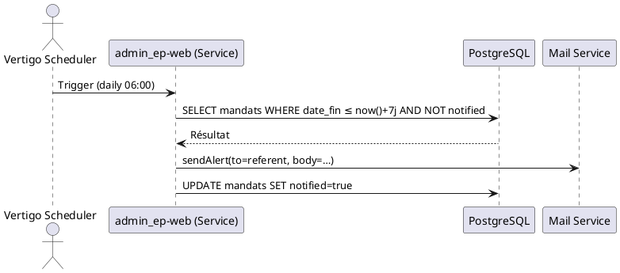

# 📄 Dossier d’Architecture Technique – **admin_ep**  
*Version : 1.0 – 27 avril 2026*  

[TOC]

---  

## 1️⃣ Introduction et objectifs  

**admin_ep** (Administration des établissements publics) est une application métier du ministère de la Transition écologique et solidaire (MTES‑MCT). Elle centralise les listes des membres des conseils d’administration des établissements publics placés sous la tutelle du ministère, assure la collecte automatique des données depuis le Journal officiel (JORF) et propose des fonctions de recherche, de suivi des mandats et de statistiques.  

### Objectifs de qualité orientés utilisateur  

| # | Objectif | Raison métier |
|---|----------|--------------|
| 1️⃣ | **Disponibilité ≥ 99 %** | Les opérateurs doivent pouvoir consulter les mandats à tout moment (production, pré‑prod). |
| 2️⃣ | **Sécurité des données (confidentialité & intégrité)** | Les informations personnelles (identités, mandats) sont soumises au RGPD et à la DICT. |
| 3️⃣ | **Temps de réponse ≤ 2 s** pour les requêtes de recherche | Garantir une expérience fluide aux utilisateurs (MOA, opérateurs). |
| 4️⃣ | **Traçabilité des modifications** (audit) | Besoin de justifier les changements de mandat et d’historiser les imports JORF. |
| 5️⃣ | **Facilité de maintenance & évolutivité** (déploiement de nouvelles versions sans interruption) | Permettre la montée de version de Tomcat/PostgreSQL et l’ajout de nouveaux modules (ex. : tableau de bord). |

↩ [Retour au sommaire](#toc)

---  

## 2️⃣ Niveau 1 – Vue Contexte (System Context)  

```plantuml
@startuml
!include https://raw.githubusercontent.com/plantuml-stdlib/C4-PlantUML/master/C4_Context.puml

Person(adminUser, "Opérateur / MOA", "Utilise l’interface web pour créer, modifier et rechercher des administrateurs.")
Person(jorfCrawler, "Processus JORF", "Importe automatiquement les articles du JORF (RSS) et les injecte dans l’application.")
System(adminEp, "admin_ep", "Gestion des établissements publics (web + batch)")

System_Ext(postgres, "PostgreSQL", "Base de données métier")
System_Ext(cerbere, "Cerbère (IAM)", "Gestion des habilitations")
System_Ext(elasticsearch, "Elasticsearch", "Indexation plein‑texte pour les recherches")
System_Ext(nginx, "Nginx LB", "Reverse‑proxy / load‑balancer")
System_Ext(gitlabCi, "GitLab CI", "Pipeline de build & déploiement")

Rel(adminUser, adminEp, "Utilise (HTTPS)")
Rel(adminEp, postgres, "Persistance (JDBC/SQL)")
Rel(adminEp, cerbere, "Authentification (SAML/OIDC)")
Rel(adminEp, elasticsearch, "Recherche (REST API)")
Rel(adminEp, nginx, "HTTPS (terminaison TLS)")
Rel(jorfCrawler, adminEp, "Envoie les flux JORF (REST)")
Rel(gitlabCi, nginx, "Déploie les artefacts Docker")
@enduml
```

### Acteurs principaux  

| Acteur | Objectif |
|--------|----------|
| **Opérateur / MOA** | Créer, mettre à jour et rechercher des administrateurs, consulter les statistiques et les alertes de mandat. |
| **Processus JORF** | Alimenter automatiquement la base avec les nouveaux articles du Journal officiel. |
| **Cerbère (IAM)** | Garantir que chaque utilisateur accède uniquement aux écrans autorisés (profil : Baseadmin). |

### Systèmes externes  

| Système | Rôle |
|---------|------|
| **PostgreSQL** | Persistance des tables métier (integration schema). |
| **Elasticsearch** | Indexation des textes d’articles JORF pour la recherche plein‑texte. |
| **Cerbère** | Authentification unique (SSO) et gestion des droits. |
| **Nginx** | Point d’entrée HTTPS, équilibrage de charge des conteneurs Docker. |
| **GitLab CI** | Construction des images Docker et déploiement automatisé. |
| **Flux JORF (RSS)** | Source officielle des nominations publiées. |

↩ [Retour au sommaire](#toc)

---  

## 3️⃣ Parties prenantes  

| Rôle | Responsable | Attente principale |
|------|--------------|--------------------|
| **Maîtrise d’Ouvrage (MOA)** | SG / SPES | Fonctionnalités métier, conformité réglementaire (DICT, RGPD). |
| **Maîtrise d’Œuvre (MOE)** | SG / SNUM / PNM / DPNM3 / BPN | Livraison technique, respect des contraintes d’infrastructure. |
| **Prestataire** | CGI | Garantie de support, livrables de qualité, respect du planning. |
| **Responsable Sécurité** | SG / SNUM | Sécurité des données, auditabilité, conformité D‑I‑C‑T. |
| **Opérateurs / Utilisateurs finaux** | SPES, DG de tutelle | Disponibilité, rapidité d’accès, alertes de mandat. |
| **Équipe de Supervision (PSIN)** | DSI | Monitoring, alertes, sauvegardes. |

↩ [Retour au sommaire](#toc)

---  

## 4️⃣ Contraintes  

### Contraintes techniques  

| Type | Description |
|------|-------------|
| **Plateforme** | Hébergement sur le cloud interne **ECO4** (OpenStack) – tenant *pnm3*. |
| **Conteneurisation** | Application packagée en **Docker**, déployée derrière un **Nginx LB**. |
| **Serveur d’applications** | Tomcat 9.0.8 (migration prévue vers Tomcat 10). |
| **Base de données** | PostgreSQL 9.6.11 en production (migration prévue vers PostgreSQL 15). |
| **CI/CD** | GitLab CI → Docker Registry → K8s (ou Docker‑Compose) selon l’environnement. |
| **Interopérabilité** | Accès via HTTPS (TLS 1.2+), API REST pour Elasticsearch et JORF. |
| **Gestion des logs** | Log4j2, agrégés via la stack **Prometheus/Grafana/Loki**. |
| **Sauvegarde** | Dumps chiffrés AES‑256, stockés sur B3, Outscale SecNumCloud et Google Cloud. |

### Contraintes organisationnelles  

* Montée de version simultanée de **Tomcat** et **PostgreSQL** doit être planifiée (fenêtre de maintenance).  
* Les évolutions fonctionnelles doivent être validées par la **MOA** et documentées dans le **cahier des charges**.  

### Contraintes réglementaires (modèle D‑I‑C‑T)  

| Dimension | Exigence |
|-----------|----------|
| **Disponibilité** | 99 % (SLA) – supervision via GTI. |
| **Intégrité** | Transactions ACID, journalisation des imports JORF. |
| **Confidentialité** | chiffrement des sauvegardes, accès restreint via Cerbère. |
| **Traçabilité** | Historique des modifications (audit table), logs centralisés. |

↩ [Retour au sommaire](#toc)

---  

## 5️⃣ Niveau 2 – Vue Conteneurs (Containers)  

```plantuml
@startuml
!include https://raw.githubusercontent.com/plantuml-stdlib/C4-PlantUML/master/C4_Container.puml

System(adminEp, "admin_ep", "Gestion des établissements publics")

Container(webApp, "admin_ep‑web", "Java 8 / Spring MVC", "Application web, contrôleurs Struts2, services métier.")
Container(db, "admin_ep‑db", "PostgreSQL 9.6", "Schéma *integration* (tables TYPE_MANDAT, CHARGE, etc.)")
Container(es, "admin_ep‑search", "Elasticsearch 7.x", "Indexation plein‑texte des articles JORF.")
Container(batch, "admin_ep‑jorf‑import", "Java 8 (Scheduler)", "Récupération périodique du flux JORF, parsing, persistance.")
Container(nginx, "Nginx LB", "NGINX 1.21", "Reverse‑proxy HTTPS, load‑balancing des conteneurs web.")
Container(ci, "GitLab CI", "GitLab Runner", "Build Docker images, tests unitaires, déploiement automatisé.")

Rel(webApp, db, "JDBC/SQL")
Rel(webApp, es, "REST (search)")
Rel(webApp, nginx, "HTTPS")
Rel(batch, db, "JDBC/SQL")
Rel(batch, es, "REST (indexation)")
Rel(ci, nginx, "Déploie les images Docker")
Rel(webApp, cerbere, "SAML/OIDC")
@enduml
```

### Description des conteneurs  

| Conteneur | Responsabilité | Technologie | Interactions clés |
|----------|----------------|-------------|-------------------|
| **admin_ep‑web** | Interface utilisateur, logique métier, sécurité, planification des tâches | Java 8, Struts2, Spring, Vertigo, Tomcat 9, Log4j2 | DB, Elasticsearch, Cerbère, Nginx |
| **admin_ep‑db** | Persistance des données métier (tables *integration* et *baseadmin*) | PostgreSQL 9.6 (prévu 15) | Web, batch |
| **admin_ep‑search** | Indexation et recherche plein‑texte des articles JORF et des administrateurs | Elasticsearch 7.x | Web, batch |
| **admin_ep‑jorf‑import** | Scheduler (Quartz) → Récupère les flux RSS JORF, parse les articles, alimente DB & ES | Java 8, Scheduler, JORF‑Extractor | DB, ES |
| **Nginx LB** | Point d’entrée HTTPS, terminaisons TLS, répartition du trafic | Nginx 1.21 | Web, CI |
| **GitLab CI** | Build, tests, création d’images Docker, promotion en environnement | GitLab Runner, Docker | Nginx, Registry Docker |

### Décisions architecturales majeures  

* **Conteneurisation** – Toutes les briques sont packagées en Docker, facilitant le déploiement sur le cloud ECO4.  
* **Pattern MVC + Service Layer** – Contrôleurs Struts2 orchestrent des services métiers (ex. `AdministrateurServices`).  
* **Scheduler intégré** – Utilisation de *Vertigo Scheduler* pour le job d’import JORF (déclenché quotidiennement).  
* **Séparation du moteur de recherche** – Elasticsearch dédié afin d’alléger la charge DB lors des recherches plein‑texte.  

### Environnement technologique  

| Niveau | Technologie |
|--------|-------------|
| **Langage** | Java 8 (compatibilité 1.8, futur 11) |
| **Framework web** | Struts2, Vertigo, Spring |
| **Serveur d’applications** | Tomcat 9 (migration prévue vers Tomcat 10) |
| **Base de données** | PostgreSQL 9.6 (migration à 15) |
| **Recherche** | Elasticsearch 7.x |
| **CI/CD** | GitLab CI, Docker, Helm (option K8s) |
| **Monitoring** | Prometheus + Grafana, Loki, AlertManager |
| **Sécurité** | TLS 1.2+, Cerbère SSO, rôle RBAC, chiffrement AES‑256 des sauvegardes |

↩ [Retour au sommaire](#toc)

---  

## 6️⃣ Niveau 3 – Vue Composants (Components)  

*(Décomposition du conteneur **admin_ep‑web**) – seules les briques majeures sont présentées.*

```plantuml
@startuml
!include https://raw.githubusercontent.com/plantuml-stdlib/C4-PlantUML/master/C4_Component.puml

Container(webApp, "admin_ep‑web", "Java 8 / Tomcat", "Application web")
Component(ctrl, "Controllers", "Struts2", "Gestion des requêtes HTTP (ex. AccueilAction, DetailAdminAction).")
Component(svc, "Services", "Business layer", "Implémentations métier (ex. AdministrateurServices, MandatServices).")
Component(repo, "Repositories", "JPA / DAO", "Accès aux tables PostgreSQL.")
Component(sec, "Security", "Cerbère‑Adapter", "Gestion du SSO, droits d’accès.")
Component(sch, "Scheduler", "Vertigo Scheduler", "Job d’import JORF (Cron).")
Component(log, "Logging", "Log4j2", "Journalisation centralisée.")
Rel(ctrl, svc, "Appelle")
Rel(svc, repo, "Persistance")
Rel(svc, es, "Recherche plein‑texte")
Rel(ctrl, sec, "Vérifie les droits")
Rel(sch, svc, "Exécute les tâches")
@enduml
```

| Composant | Rôle | Principales classes (exemples) |
|-----------|------|--------------------------------|
| **Controllers** | Interface MVC – réception des requêtes, navigation JSP. | `AccueilAction`, `DetailAdminAction`, `RechercheAdminsAction`, `UpsertAdminAction`. |
| **Services** | Logique métier, orchestration des DAO et des appels externes. | `AdministrateurServicesImpl`, `MandatServicesImpl`, `ArticleSearchLoader`. |
| **Repositories** | Accès aux tables PostgreSQL (JPA / Vertigo). | `AdministrateurDao`, `MandatDao`, `ChargeDao`. |
| **Security** | Intégration Cerbère, mapping des profils (`BaseAdminUserSession`). | `SecurityHelper`, `RightsHelper`. |
| **Scheduler** | Job planifié d’import JORF (quotidien). | `SchedulerInitializer`, `ArticleAnalyser`, `ReindexArticlesByArtiIDTask`. |
| **Logging** | Centralisation des logs applicatifs et d’erreurs. | `log4j2.xml`, `ErrorHandler`. |

↩ [Retour au sommaire](#toc)

---  

## 7️⃣ Niveau 4 – Vue Code (Code)  

Ce niveau n’est pas détaillé ici (hors besoin spécifique).  
*Des diagrammes de classes UML et les ERD sont disponibles dans le répertoire `adminep-web/src/main/resources/boot/definitions/` (fichiers *.ksp).*

↩ [Retour au sommaire](#toc)

---  

## 8️⃣ Vue Exécution (Scénarios)  

### 8.1 🎯 Recherche d’un administrateur  



**Validation** : Temps de réponse ≤ 2 s, logs d’audit créés (`searchAdministrateur`).  

### 8.2 📥 Import quotidien du JORF  



**Validation** : Chaque article doit être inscrit dans la table `article` et l’index ES doit contenir le même `doc_id`.  

### 8.3 ⏰ Notification d’échéance de mandat  



**Validation** : Courriel envoyé, statut `notified` mis à jour, logs d’audit (table `mandat_audit`).  

↩ [Retour au sommaire](#toc)

---  

## 9️⃣ Vue Déploiement *(section standardisée)*  

```markdown
### Environnements
| Environnement | Hébergement | Serveurs | Réseau | Particularités |
|---------------|-------------|----------|--------|----------------|
| Développement | Cloud ECO4 (tenant pnm3) | Docker‑Compose (1 node) | VLAN dev | Logs en mode DEBUG |
| Recette       | Cloud ECO4 (tenant pnm3) | Docker‑Swarm (2 nodes) | VLAN recette | Tests d’intégration automatisés |
| Production    | Cloud ECO4 (tenant pnm3) | Kubernetes (3 nodes) | VLAN prod | HA, sauvegardes chiffrées, monitoring GTI |
```

### Infrastructure  

Le produit est hébergé sur le cloud interne **ECO4** basé sur **OpenStack**, dans le tenant **'pnm3'** du département.  
Le reverse‑proxy Nginx du schéma ci‑dessous est en fait une paire de Nginx load‑balancés en frontal des produits hébergés sur le tenant.  

```plantuml
@startuml
!include https://raw.githubusercontent.com/plantuml-stdlib/C4-PlantUML/master/C4_Deployment.puml

Deployment_Node(cloud, "Cloud ECO4", "OpenStack Tenant pnm3") {
    Deployment_Node(nginx, "Nginx Cluster", "Load Balancer") {
        Container(web, "admin_ep‑web", "Docker (Tomcat)", "Conteneur web")
        Container(batch, "admin_ep‑jorf‑import", "Docker (Scheduler)", "Job d’import JORF")
    }
    Deployment_Node(db, "PostgreSQL", "Docker (PostgreSQL)") {
        ContainerDb(database, "admin_ep‑db", "PostgreSQL", "Schéma *integration*")
    }
    Deployment_Node(es, "Elasticsearch", "Docker (ES)") {
        Container(search, "admin_ep‑search", "Elasticsearch", "Indexation plein‑texte")
    }
}

Rel(nginx, web, "HTTPS")
Rel(nginx, batch, "HTTPS")
Rel(web, database, "JDBC/SQL")
Rel(batch, database, "JDBC/SQL")
Rel(web, search, "REST (search)")
Rel(batch, search, "REST (indexation)")
@enduml
```

### Supervision  

Le produit est supervisé via le système standard du GTI pour ce faire :  
- via **Portainer** pour la partie purement conteneurisée,  
- via la stack **Prometheus/Grafana/Loki/AlertManager**,  
- le produit dispose également d’une supervision **PSIN**.  

### Sauvegardes  

Les sauvegardes de la base de données sont assurées par des scripts standards du GTI permettant la création de dumps cryptés en **AES‑256** et déposés sur :  
- le stockage objet **B3** du IaaS ministériel,  
- le stockage objet **Outscale SecNumCloud** (via la prestation du GTI « Nuage Public »),  
- le stockage objet standard de **Google Cloud** (via la même prestation).  

↩ [Retour au sommaire](#toc)

---  

## 🔟 Sujets transverses  

| Domaine | Points clés |
|---------|--------------|
| **Authentification & Autorisation** | SSO Cerbère (SAML/OIDC) → mapping des rôles (`BaseAdmin`, `Gestionnaire`). Utilisation de `SecurityHelper` et `RightsHelper`. |
| **Journalisation** | Log4j2 → Loki ; chaque action métier crée un événement d’audit (`AuditLog`). |
| **Monitoring** | Métriques Tomcat, PostgreSQL, Elasticsearch exposées via **Prometheus** (`/metrics`). Tableaux Grafana pour temps de réponse, taux d’erreurs, utilisation CPU/mémoire. |
| **Gestion des erreurs** | `ErrorHandler` centralise les exceptions, renvoie les pages d’erreur (`application-error.jsp`). |
| **API & Intégration** | API REST interne pour le batch JORF et la recherche Elasticsearch. |
| **CI/CD** | Pipeline GitLab → build Docker, tests unitaires (JUnit), tests d’intégration (PostgreSQL en container), déploiement via Helm/K8s. |
| **Sécurité des données** | Chiffrement des sauvegardes, TLS 1.2+, restrictions réseau (only Nginx ↔ containers). |
| **Gestion de la configuration** | `application-config.xml`, propriétés dans `applicationConfiguration.properties`. |

↩ [Retour au sommaire](#toc)

---  

## 1️⃣1️⃣ Exigences de qualité  

| Exigence | Critère de succès | Scénario de validation |
|----------|-------------------|------------------------|
| **Performance** | Temps moyen de recherche ≤ 2 s (95 % des requêtes) | Tests de charge JMeter sur `/admin/search` avec 100 concurrents. |
| **Sécurité** | Aucun accès non‑autorisé détecté (pentest OWASP 10) | Scan automatisé (ZAP) + revue des logs Cerbère. |
| **Disponibilité** | SLA ≥ 99 % sur 30 jours | Analyse des métriques Prometheus (uptime). |
| **Maintenabilité** | Couverture de code unitaires ≥ 80 % | Rapport JaCoCo sur le pipeline CI. |
| **Traçabilité** | Historique complet des imports JORF | Vérification du tableau `article_audit` après chaque run. |
| **Scalabilité** | Le système supporte le double de trafic (doublage de conteneurs) sans dégradation > 10 % | Test de scaling horizontal (K8s HPA). |

↩ [Retour au sommaire](#toc)

---  

## 1️⃣2️⃣ Risques et dettes techniques  

| Risque / Dette | Impact | Mesure d’atténuation |
|----------------|--------|----------------------|
| **Montée de version Tomcat 9 → 10** | Incompatibilité des API Struts2/Servlet | Planifier une phase de migration avec tests d’intégration, valider la compatibilité du code. |
| **PostgreSQL 9.6 → 15** | Risque de rupture de compatibilité des fonctions PL/pgSQL | Utiliser des scripts de migration (pg_dump/restore) en environnement de pré‑prod, tests de régression. |
| **Dépendance à Cerbère** | Blocage si la plateforme IAM subit une indisponibilité | Implémenter un fallback « mode maintenance » avec authentification locale temporaire. |
| **Job JORF → cron** | Possibles doublons d’import si le job échoue à mi‑parcours | Idempotence du batch (`INSERT … ON CONFLICT DO UPDATE`). |
| **Dette de documentation** | Difficulté de prise en main des nouveaux développeurs | Maintenir le **ADR** (Architecture Decision Records) à jour, automatiser la génération du diagramme C4. |
| **Sur‑dimensionnement du cluster** | Coût d’infrastructure inutile | Mettre en place un auto‑scaling (HPA) basé sur la charge CPU/mémoire. |

↩ [Retour au sommaire](#toc)

---  

## 1️⃣3️⃣ Annexes  

### 📚 Glossaire  

| Terme | Définition |
|-------|------------|
| **CERBÈRE** | Service d’identité et d’authentification du ministère (SSO, gestion des profils). |
| **ACA I** | Plateforme d’hébergement « Application Containerisation & Automation » (clusters ESXi). |
| **ECO4** | Cloud interne du ministère (OpenStack). |
| **DI​C​T** | Délégation d’Information, Confidentialité et Traçabilité – cadre d’évaluation de la sécurité. |
| **Vertigo** | Framework interne de développement (boot, services, orchestration). |
| **JDBC** | Java Database Connectivity – driver pour PostgreSQL. |
| **K8s** | Kubernetes – orchestrateur de conteneurs (production). |

### 📄 Décisions d’architecture (ADR) – Extraits  

| # | Décision | Contexte | Résultat |
|---|----------|----------|----------|
| **ADR‑001** | **Conteneurisation de l’application** | Besoin de déploiements rapides sur différents environnements. | Application packagée en Docker, déploiement via GitLab CI. |
| **ADR‑002** | **Séparer le moteur de recherche** | Recherche plein‑texte trop coûteuse sur PostgreSQL. | Utilisation d’Elasticsearch dédié. |
| **ADR‑003** | **Utiliser Cerbère comme IdP** | Conformité aux exigences d’authentification ministérielle. | Intégration SAML/OIDC, mapping des rôles. |
| **ADR‑004** | **Job d’import JORF via Scheduler Vertigo** | Nécessité d’une exécution récurrente sans dépendance externe. | Scheduler intégré, idempotent, logs d’audit. |
| **ADR‑005** | **Sauvegardes chiffrées sur trois stockages** | Risque de perte de données critiques. | Dumps AES‑256 sur B3, Outscale SecNumCloud, Google Cloud. |

---  

*Ce DAT a été généré automatiquement à partir des métadonnées du projet `admin_ep` et est destiné à être maintenu dans le dépôt GitLab du projet, versionné avec le code source.*  

↩ [Retour au sommaire](#toc)