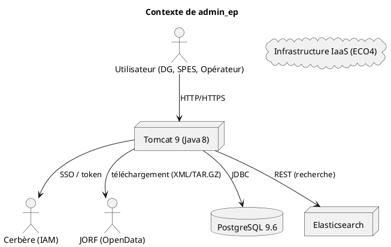
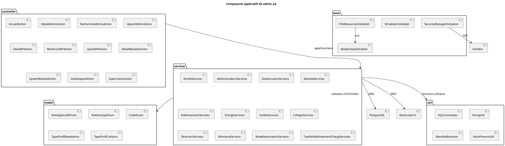
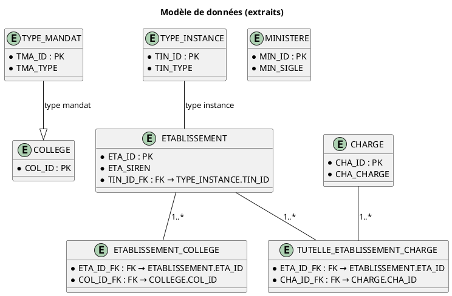
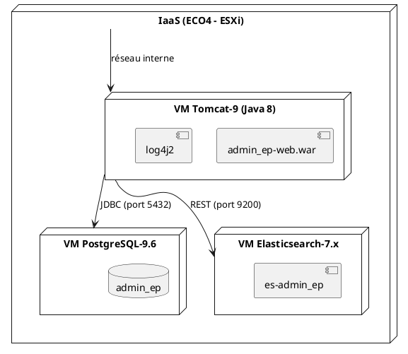
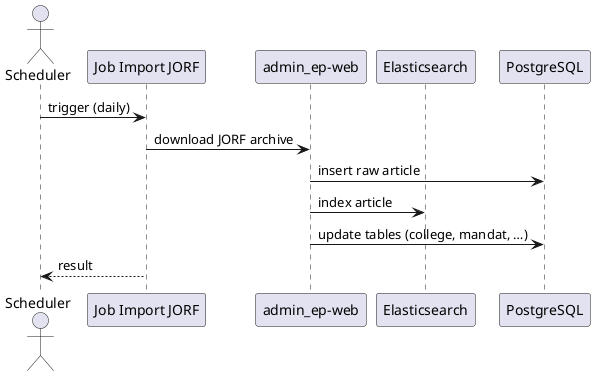
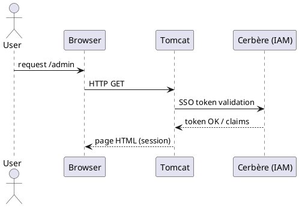

# 📚 Dossier d'Architecture Technique – **admin_ep**  
[TOC]

---  

## 1. Introduction et contexte de l'architecture  

### 1.1 Objectifs du document  

Ce Dossier d’Architecture Technique (DAT) décrit l’architecture du système **admin_ep** (Administration des établissements publics) conformément à la norme **ISO/IEC/IEEE 42010 :2022**. Il sert à :  

* Communiquer la conception aux parties prenantes (MOA, MOE, exploitation, sécurité).  
* Faciliter les analyses de conformité, de performance et de sécurité.  
* Servir de référence pour les évolutions futures (containerisation, mise à jour des plateformes).  

### 1.2 Périmètre architectural  

| Niveau | Description |
|--------|-------------|
| **Système** | Application web Java (Struts 2 / Vertigo) déployée sur Tomcat, persistance PostgreSQL, services d’indexation Elasticsearch, intégration JORF et Cerbère. |
| **Sous‑systèmes** | - **admin_ep‑web** (UI, contrôleurs, services)   - **admin_ep‑database** (schéma SQL, scripts d’initialisation/migration)   - **admin_ep‑deployment** (packaging, configuration) |
| **Environnement** | Production, pré‑production, recette, IaaS (ECO4) – data‑center Paris La Défense. |

### 1.3 Références aux documents source  

| Référence | Type | Lien |
|----------|------|------|
| admin_ep.code.filtered.md | Arborescence & code source | `admin_ep.code.filtered.md` |
| admin_ep.code.summarized.md | Synthèse de l’arborescence | `admin_ep.code.summarized.md` |
| admin_ep.wiki.md | Documentation fonctionnelle & organisation | `admin_ep.wiki.md` |
| admin_ep.wikisi.md | Métadonnées métier & hébergement | `admin_ep.wikisi.md` |
| CCF / CST | Cadre de conception fonctionnelle (non fourni) | – |

### 1.4 Vue d’ensemble du système & écosystème  

*Le diagramme ci‑dessus représente le système **admin_ep** et ses principaux acteurs externes.*  

---  

## 2. Parties prenantes et préoccupations  

| # | Partie prenante | Rôle | Principales préoccupations |
|---|----------------|------|---------------------------|
| **P1** | **Maîtrise d’Ouvrage (MOA)** – SG/SPES | Pilotage fonctionnel | Respect du périmètre fonctionnel, traçabilité des mandats, conformité règlementaire (DICT). |
| **P2** | **Maîtrise d’Œuvre (MOE)** – SG/SNUM/PNM/DPNM3/BPN | Développement & maintenance | Qualité du code, évolutivité, respect des standards Java/Struts, facilité de déploiement. |
| **P3** | **Exploitation** – équipe Ops | Exploitation & supervision | Disponibilité, monitoring, sauvegarde, mise à jour (Tomcat 10, PostgreSQL 15). |
| **P4** | **Sécurité** – RSSI | Sécurité de l’information | Confidentialité, intégrité, traçabilité (logs), gestion des droits (Cerbère). |
| **P5** | **Utilisateurs finaux** (DG, SPES, opérateurs) | Consultation & saisie de données | Ergonomie, performance des recherches, alertes d’échéance. |
| **P6** | **Auditeurs** (RGPD, DICT) | Conformité légale | Bilan d’impact (DICT), journalisation, protection des données personnelles. |

> **Correspondance préoccupations ↔ points de vue** (voir § 3).  

---  

## 3. Points de vue architecturaux  

| ID | Nom du point de vue | Préoccupations couvertes | Langage de modélisation | Méthode d’analyse |
|----|---------------------|--------------------------|------------------------|-------------------|
| **VP‑C** | **System Context Viewpoint** | Environnement, dépendances externes, flux d’informations | PlantUML (C4‑L1) | Analyse d’impact & de confiance |
| **VP‑F** | **Functional Viewpoint** | Fonctionnalités métier, capacités, processus CCF | Tableaux fonctionnels / BPMN (simplifié) | Mapping CCF → CST |
| **VP‑A** | **Application Viewpoint** | Modularisation du code, composants, patterns | PlantUML (C4‑L2) | Analyse de couplage & cohésion |
| **VP‑D** | **Data Viewpoint** | Modèle de données, persistance, cycles de vie | UML Class Diagram (extraits du schéma SQL) | Validation d’intégrité référentielle |
| **VP‑T** | **Technical / Infrastructure Viewpoint** | Déploiement, infrastructure, contraintes technologiques | UML Deployment Diagram | Analyse de capacité & résilience |
| **VP‑I** | **Integration Viewpoint** | Points d’intégration (JORF, Cerbère, ES) | UML Sequence Diagram | Tests d’interfaçage |
| **VP‑S‑Sec** | **Security Viewpoint** | D‑I‑C‑T, gestion des rôles, chiffrement | UML Component Diagram (sécurité) | Analyse de menace (STRIDE) |
| **VP‑O** | **Operational Viewpoint** | Supervision, logs, alertes, procédures de maintenance | UML Activity Diagram | Analyse de disponibilité (HA) |
| **VP‑R** | **Requirements Viewpoint** | Exigences non‑fonctionnelles (ISO 25010) | Tableau NFR | Priorisation & arbitrage |

---  

## 4. Vues architecturales  

### 4.1 Vue Contexte – **VP‑C**  

*(Voir diagramme PlantUML du § 1.4.)*  

| Élément | Description |
|---------|-------------|
| **admin_ep** | Application web Java (Struts 2 / Vertigo). |
| **PostgreSQL 9.6** | Base de données relationnelle (schéma *integration*). |
| **Elasticsearch** | Indexation des articles JORF pour recherche plein texte. |
| **Cerbère** | Service d’authentification unique (IAM). |
| **JORF OpenData** | Source de données législatives (XML/TAR.GZ). |
| **Tomcat 9** | Conteneur d’exécution Java. |
| **IaaS (ECO4)** | Plateforme d’hébergement (VM ESXi). |

---  

### 4.2 Vue Fonctionnelle / Métier – **VP‑F**  

| Fonctionnalité | Description | CCF (extraits) |
|----------------|-------------|----------------|
| **Gestion des administrateurs** | CRUD sur les administrateurs d’établissement. | `Gestion Administrateur` |
| **Gestion des établissements** | Saisie, recherche, mise à jour des établissements publics. | `Gestion Etablissement` |
| **Gestion des mandats** | Saisie, suivi, alerte d’échéance (titulaire / suppléant). | `Gestion Mandat` |
| **Recherche JORF** | Import automatisé des articles JORF → mise à jour des données. | `Intégration JORF` |
| **Statistiques** | Tableaux de bord (nombre d’établissements, mandats, etc.). | `Reporting` |
| **Authentification Cerbère** | Accès en fonction du profil (admin, opérateur). | `Gestion Accès` |
| **Archivage** | Conservation des mandats expirés et pièces jointes. | `Archivage` |

---  

### 4.3 Vue Applicative / Logicielle – **VP‑A**  

*Notes* :  
* **Patterns appliqués** – DAO, Service‑Facade, MVC (Struts 2), Scheduler (Quartz).  
* **Modularisation** – chaque domaine métier possède son sous‑package (`admin`, `etablissements`, `mandats`, …).  

---  

### 4.4 Vue Données et Information – **VP‑D**  

*Le schéma complet se trouve dans les scripts `1_createSequenceAndTablesIntegration.sql` et `2_populateTablesIntegration.sql`.*  

---  

### 4.5 Vue Technique / Infrastructure – **VP‑T**  

*Contraintes technologiques* :  
* Java 8, Tomcat 9 (en cours de migration vers Tomcat 10).  
* PostgreSQL 9.6 (mise à jour prévue vers 15).  
* Elasticsearch 7.x (compatible avec le module de recherche).  

---  

### 4.6 Vue Intégration – **VP‑I**  

#### 4.6.1 Séquence d’import JORF  

#### 4.6.2 Authentification Cerbère  

---  

### 4.7 Vue Sécurité – **VP‑S‑Sec**  

| Aspect | Description | Implémentation |
|--------|-------------|----------------|
| **Authentification** | SSO via Cerbère (OAuth2 / SAML) | `SecurityManagerInitializer`, `BaseAdminUserSession`. |
| **Autorisation** | Rôles fonctionnels (`RoleApplicatifEnum`, `RoleVertigoEnum`) | Intercepteur `LogAccessInterceptor`. |
| **Confidentialité** | TLS 1.2+ sur toutes les communications HTTP | `web.xml` + `server.xml` (Tomcat). |
| **Intégrité** | Vérification des signatures JORF (checksum) | `JORFExtractor` + `FileUtil`. |
| **Traçabilité** | Logs d’accès, actions CRUD, audit (log4j2) | `log4j2.xml`, `ErrorHandler`. |
| **Protection des données** | Masquage des PII, chiffrement des mots de passe (BCrypt) | `SecurityHelper`. |

---  

### 4.8 Vue Opérationnelle / Exploitation – **VP‑O**  

| Élément | Description | Outils |
|--------|-------------|--------|
| **Supervision** | Monitoring Tomcat, PostgreSQL, ES (CPU, RAM, latence) | **Zabbix / Prometheus** (non fourni, à prévoir). |
| **Logging** | Centralisation des logs (log4j2) → fichier + syslog | **ELK Stack** (Logstash, Kibana). |
| **Alertes d’échéance** | Job quotidien (Scheduler) envoie mail aux référents | **Quartz Scheduler**, **JavaMail**. |
| **Backup** | Dump PostgreSQL quotidien, snapshots VM | **pg_dump**, **VM snapshot**. |
| **Déploiement** | Maven assembly + Docker (en cours) | **Dockerfile**, **Kubernetes** (road‑map). |
| **Gestion de la configuration** | Fichiers XML (`application-config.xml`, `baseadmin‑auth‑config.xml`) | **Spring‑Boot** (future migration). |

---  

## 5. Correspondance entre vues  

| Concern (Préoccupation) | VP‑C | VP‑F | VP‑A | VP‑D | VP‑T | VP‑I | VP‑S‑Sec | VP‑O |
|--------------------------|------|------|------|------|------|------|-----------|------|
| **Fonctionnalités métier** | ✅ | ✅ | ✅ |  |  |  |  |  |
| **Intégrité des données** |  | ✅ | ✅ | ✅ |  | ✅ | ✅ |  |
| **Performance (temps de réponse)** |  |  | ✅ | ✅ | ✅ | ✅ |  | ✅ |
| **Disponibilité** |  |  |  |  | ✅ |  | ✅ | ✅ |
| **Sécurité (authN/Z, DICT)** | ✅ |  | ✅ |  |  | ✅ | ✅ | ✅ |
| **Évolutivité** |  | ✅ | ✅ | ✅ | ✅ | ✅ |  | ✅ |
| **Maintenabilité** |  | ✅ | ✅ | ✅ | ✅ |  | ✅ | ✅ |
| **Traçabilité / Audit** | ✅ | ✅ | ✅ | ✅ |  |  | ✅ | ✅ |
| **Conformité aux standards** | ✅ | ✅ | ✅ | ✅ | ✅ | ✅ | ✅ | ✅ |

> **CCF → CST → DAT** :  
> - Les exigences fonctionnelles du CCF sont mappées aux fonctions de la **Vue Fonctionnelle**.  
> - Le **CST** (Cahier des Spécifications Techniques) décrit les contraintes techniques (Java 8, PostgreSQL 9.6, Tomcat 9) qui apparaissent dans les **Vues Application**, **Data** et **Technical**.  

---  

## 6. Décisions architecturales (ADR)  

| # | Décision | Contexte & Problématique | Options considérées | Décision retenue | Justification | Conséquences | Statut |
|---|----------|--------------------------|--------------------|-------------------|----------------|----------------|--------|
| **ADR‑001** | **Choix du SGBD** | Besoin d’une base relationnelle robuste, support des contraintes référentielles. | PostgreSQL 9.6 (actuel) / MySQL 8 / Oracle 19c | **PostgreSQL 9.6** (maintenu) | Open‑source, riche en types, déjà utilisé. | Migration future vers PostgreSQL 15 prévue (voir roadmap). | Acceptée |
| **ADR‑002** | **Framework web** | Application existante en Struts 2, besoin de garder la stabilité. | Struts 2 / Spring MVC / JSF | **Struts 2** (actuel) | Code legacy, expertise interne. | Migration envisagée vers Spring Boot (long terme). | Acceptée |
| **ADR‑003** | **Gestion des identités** | Authentification unique, conformité DICT. | Cerbère (déjà en place) / Keycloak / LDAP | **Cerbère** (actuel) | Déjà intégré, supporte le profilage. | Aucun changement immédiat. | Acceptée |
| **ADR‑004** | **Conteneurisation** | Besoin de moderniser le déploiement, faciliter les montées de version. | Docker + Docker‑Compose / Kubernetes / VM uniquement | **Docker** (prototype) | Simplifie le packaging (assembly‑zip). | Migration progressive vers Kubernetes (road‑map). | Proposée |
| **ADR‑005** | **Mise à jour de Tomcat** | Tomcat 9 devient obsolète, besoin de Java 11+. | Tomcat 10 (Servlet 5) / Jetty / WildFly | **Tomcat 10** | Compatibilité avec Java 11, standardisation. | Refonte des `web.xml` (migration). | En cours |
| **ADR‑006** | **Mise à jour de PostgreSQL** | PostgreSQL 9.6 en fin de support, besoin de nouvelles fonctionnalités. | PostgreSQL 12 / 13 / 15 | **PostgreSQL 15** | Améliorations de performance, sécurité. | Migration de schéma + réplication. | Planifiée (Q4 2026) |
| **ADR‑007** | **Moteur de recherche** | Recherche plein texte sur les articles JORF. | Elasticsearch 7.x (actuel) / Solr / OpenSearch | **Elasticsearch 7.x** | Déjà intégré, performances satisfaisantes. | Aucun changement prévu. | Acceptée |

---  

## 7. Analyse des écarts et risques architecturaux  

| Risque | Description | Probabilité | Impact | Niveau | Mesure d’atténuation |
|--------|-------------|--------------|--------|--------|----------------------|
| **R‑01** | **Obsolescence des plateformes** (Tomcat 9, PostgreSQL 9.6) | Élevée | Critique | Haute | Plan de migration (see Road‑map). |
| **R‑02** | **Défaillance du service Cerbère** (authentification) | Moyenne | Haute | Moyenne | Mise en place d’un fallback local (LDAP) et tests de résilience. |
| **R‑03** | **Pertes de données JORF** (source externe) | Faible | Moyenne | Faible | Archive locale des téléchargements, vérification checksum. |
| **R‑04** | **Non‑conformité DICT** (traçabilité) | Moyenne | Haute | Haute | Implémentation de logs d’audit détaillés, revue périodique. |
| **R‑05** | **Dette technique sur le code legacy Struts 2** | Élevée | Moyenne | Haute | Refactorisation progressive, couverture de tests unitaires. |
| **R‑06** | **Scalabilité limitée** (monolite Tomcat) | Moyenne | Moyenne | Moyenne | Passage à Docker + Kubernetes (micro‑services). |

---  

## 8. Qualités et exigences non‑fonctionnelles  

| Qualité (ISO 25010) | Exigence | Niveau cible | Scénario de validation |
|----------------------|----------|--------------|------------------------|
| **Performance** | Temps moyen de réponse < 2 s pour recherche admin | 95 % des requêtes | Tests de charge (JMeter) sur recherche d’établissements. |
| **Sécurité** | Authentification SSO, chiffrement TLS 1.2+ | 100 % des connexions | Scan SSL Labs, tests d’injection OWASP. |
| **Fiabilité** | Disponibilité > 99,5 % (MTBF) | 1 h d’arrêt max par an | Monitoring Zabbix + KPI d’uptime. |
| **Maintenabilité** | Couverture de tests unitaires > 70 % | 70 % | SonarQube, rapport de couverture. |
| **Portabilité** | Déploiement via Docker | 100 % des environnements | Build Docker, exécution sur dev, pre‑prod, prod. |
| **Compatibilité** | Support Java 8 → 11 | Migration progressive | Compilation avec JDK 11, tests d’intégration. |
| **Extensibilité** | Ajout d’un nouveau type de mandat sans code source | 0 % de modifications | Utilisation de tables de référence (`TYPE_MANDAT`). |
| **Auditabilité** | Journalisation complète des actions CRUD | 100 % | Vérification des logs (`log4j2.xml`). |

---  

## 9. Évolutivité et feuille de route  

| Horizon | Objectif | Actions clés | Responsable |
|--------|----------|--------------|-------------|
| **Court terme (Q2 2024)** | Stabiliser la plateforme | - Finaliser migration Tomcat 10   - Déployer Docker prototype   - Mettre à jour les scripts de backup | MOE |
| **Moyen terme (Q4 2024)** | Moderniser la stack | - Migration PostgreSQL 15 (replication)   - Refactorisation Struts 2 → Spring Boot (module par module)   - Implémenter CI/CD (GitLab‑CI) | MOE / Ops |
| **Long terme (2025‑2026)** | Containerisation & orchestration | - Kubernetes (Helm charts)   - Migration complète vers micro‑services (ex. service JORF, service mandat)   - Mise en place d’une plateforme observabilité (Prometheus + Grafana) | MOE / Ops |
| **Beyond 2026** | IA & automatisation | - Analyse sémantique des articles JORF (NLP)   - IA pour prédiction d’échéances de mandat   - Déploiement d’un data‑lake (S3) | Pôle Innovation |

---  

## 10. Annexes  

### 10.1 Glossaire architectural  

| Terme | Définition |
|-------|------------|
| **ADMINEP** | Application d’administration des établissements publics du ministère de la Transition écologique. |
| **Cahier des Charges Fonctionnel (CCF)** | Document décrivant les besoins métiers. |
| **Cahier des Spécifications Techniques (CST)** | Document détaillant les contraintes techniques. |
| **DDD** | Domain‑Driven Design – approche utilisée pour structurer les packages (`admin`, `etablissements`, …). |
| **Struts 2** | Framework MVC Java utilisé dans l’application. |
| **Vertigo** | Framework interne (DI, composant) utilisé par l’application. |
| **Cerbère** | Service d’authentification SSO (IAM) de l’État. |
| **JORF** | Journal officiel de la République française – source d’import des articles législatifs. |
| **DICT** | Déclaration d’Intérêt et de Conformité aux Traitements (sécurité). |
| **ADR** | Architecture Decision Record – décision consignée. |
| **NFR** | Non‑Functional Requirement (exigence non fonctionnelle). |

### 10.2 Référentiels et normes applicables  

| Référence | Description |
|-----------|-------------|
| ISO/IEC/IEEE 42010 :2022 | Description d’architecture. |
| ISO/IEC 25010 | Modèle de qualité des produits logiciels. |
| RFC 5246 | TLS 1.2 – exigences de chiffrement. |
| OWASP Top 10 | Principes de sécurisation des applications web. |
| RGPD – Article 30 | Registre des traitements (DICTION). |
| DICT – Ministère de la Transition écologique | Guide de sécurité des SI. |

### 10.3 Modèles de référence utilisés  

* **C4 Model** – niveaux L1 (Contexte) et L2 (Conteneurs) pour les diagrammes de vues.  
* **UML** – diagrammes de classe, séquence, déploiement.  
* **PlantUML** – outil de génération de diagrammes intégré dans le repository.  

---  

*Fin du Dossier d’Architecture Technique – admin_ep*  