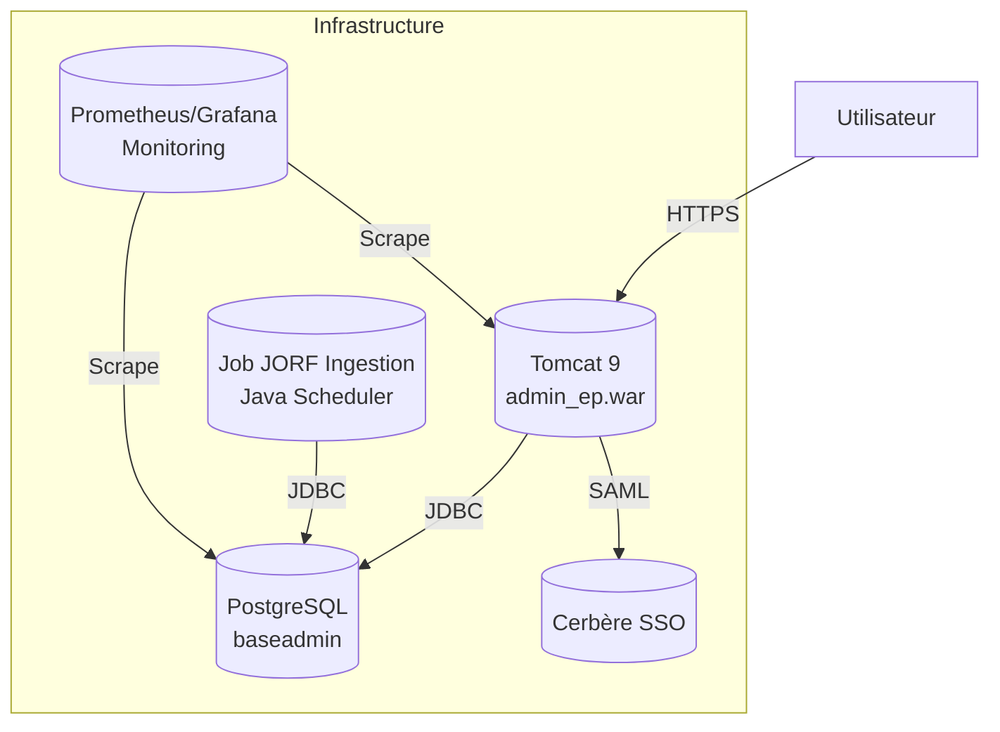
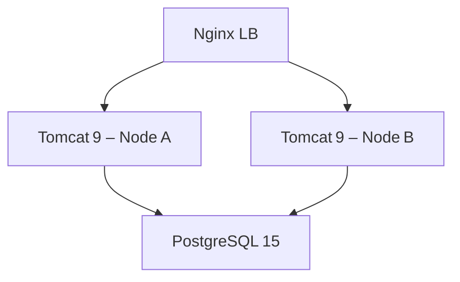

# 📘 Dossier d’Architecture Technique (DAT) – **admin_ep**  
**Version** : 1.0 – 2024‑04‑27  

[TOC]

---  

## 1️⃣ Introduction & objectifs  

**Vue d’ensemble fonctionnelle**  
*admin_ep* est une application métier de la Direction du **Ministère de la Transition Écologique** qui centralise les listes des membres (administrateurs, gestionnaires, mandats, etc.) des conseils d’administration des établissements publics placés sous la tutelle du ministère.  

- **Interface d’écriture** : saisie manuelle des données via le back‑office web.  
- **Alimentation automatique** : extraction périodique des mentions du **Journal Officiel** (JORF) et enrichissement de la base.  
- **Gestion des accès** : authentification via le système **Cerbère** (SSO) et droits granulaires.  
- **Archivage** : conservation de l’historique des mandats et des pièces jointes.  
- **Statistiques & alertes** : tableau de bord et notification par mail des mandats proches de l’échéance.  

```mermaid
graph TD
    A[Utilisateurs (SPES, DG, Opérateurs)] -->|HTTPS| B[Web App (Tomcat 9, Struts2)]
    B -->|JDBC| C[PostgreSQL 9.6 (baseadmin)]
    B -->|Scheduler| D[Job JORF Ingestion (Java)]
    D --> C;
    B -->|Cerbère SSO| E[Service d’authentification]
```

### Objectifs de qualité (orientés utilisateurs)  

| # | Objectif | Motivation utilisateur |
|---|----------|------------------------|
| 1 | **Performance** – temps de réponse < 2 s pour les écrans de consultation | Fluidité de la navigation |
| 2 | **Sécurité** – conformité DICT, traçabilité des accès | Protection des données sensibles (mandats, contacts) |
| 3 | **Disponibilité** – 99,5 % de disponibilité mensuelle | Accès continu aux services critiques |
| 4 | **Maintenabilité** – couverture de tests unitaires ≥ 70 % | Réduction du coût de l’évolution fonctionnelle |
| 5 | **Évolutivité** – capacité à supporter + 30 % d’utilisateurs sans refonte | Anticipation de la montée en charge (nouveaux établissements) |

↩ Retour au **sommaire**  

---  

## 2️⃣ Parties prenantes  

| Rôle | Attente principale |
|------|---------------------|
| **Maîtrise d’Ouvrage (MOA)** – SG/SPES | Livraison d’un outil fiable, conforme aux exigences légales (DICT) |
| **Maîtrise d’Œuvre (MOE)** – SG/DNUM/PNM3/BPN | Respect du planning, maîtrise des coûts, évolutivité technique |
| **Utilisateurs fonctionnels** – SPES, DG de tutelle, opérateurs | Saisie simple, recherche efficace, alertes mandat |
| **RSSI** – SG/SECURITE | Sécurisation des flux, traçabilité, conformité RGPD |
| **Support / Assistance** | Disponibilité d’un point de contact et d’une procédure d’incident |
| **Équipe de supervision (PSIN)** | Visibilité sur la santé de l’application (KPIs) |

### Contacts (extraits des fichiers `admin_ep.wiki.md` & `admin_ep.wikisi.md`)  

| Rôle | Nom complet | Courriel |
|------|--------------|----------|
| Chef de produit | **Christian Arbogast** | <Christian.Arbogast@developpement-durable.gouv.fr> |
| Chef de groupe | **Céline Gilliard** | <celine.gilliard@developpement-durable.gouv.fr> |
| Responsable de l’infrastructure | **[À préciser]** | – |
| Support fonctionnel | **[À préciser]** | – |

↩ Retour au **sommaire**  

---  

## 3️⃣ Contraintes  

### 3.1 Contraintes techniques  

| Contraintes | Détails |
|-------------|---------|
| **Langage / Framework** | Java 8, Struts 2, Vertigo, DisplayTag |
| **Serveur d’applications** | Tomcat 9.0.8 (migration prévue vers Tomcat 10) |
| **Base de données** | PostgreSQL 9.6.11 (migration prévue vers PostgreSQL 15) |
| **Conteneurisation** | En cours – Docker/Compose pour les environnements IaaS |
| **CI/CD** | Maven 3, GitLab CI (pipeline : build → test → package) |
| **Interopérabilité** | Consommation du flux JORF (HTTPS, RSS) |
| **Sécurité** | Authentification Cerbère, filtre `SecurityFilter`, TLS 1.2+ |
| **Monitoring** | Prometheus + Grafana, Portainer, PSIN (supervision) |
| **Sauvegarde** | Dumps chiffrés AES‑256, stockage multi‑site (B3, Outscale, GCP) |

### 3.2 Contraintes organisationnelles  

- **Gouvernance** : projet piloté par la DNUM (PNM / DPNM3) et le SNUM.  
- **Calendrier de mise à jour** : montée de version Tomcat 10 & PostgreSQL 15 prévue Q4 2024.  
- **Réglementaire** : **Évaluation DICT** validée (07/09/2018) → exigences D‑I‑C‑T.  

### 3.3 Modèle de sécurité D‑I‑C‑T  

| Dimension | Exigence | Implémentation |
|-----------|----------|----------------|
| **Disponibilité** | 99,5 % mensuel | Redondance N‑1 sur le serveur Tomcat, sauvegardes incrémentales |
| **Intégrité** | Garantie d’inaltérabilité des mandats | Contraintes d’intégrité référentielle (FK) dans le schéma `integration` |
| **Confidentialité** | Accès restreint aux données personnelles | Filtrage Cerbère, droits RBAC (`Roles` enum) |
| **Traçabilité** | Journalisation de chaque action utilisateur | Log4j2 + `LogAccessInterceptor` (audit) |

↩ Retour au **sommaire**  

---  

## 4️⃣ Contexte et périmètre  

### 4.1 Systèmes / acteurs externes  

| Système | Type d’interaction | Protocole / fréquence |
|---------|-------------------|----------------------|
| **JORF (Bulletin Officiel)** | Ingestion de mentions légales (nom d’établissement, mandats) | HTTPS / RSS (cron ≈ 1 h) |
| **Cerbère (SSO)** | Authentification unique & attribution de rôles | SAML / HTTPS |
| **Portail PSIN** | Supervision de l’application (KPIs) | HTTP (API interne) |
| **ECO4 / IaaS** | Hébergement des conteneurs (Docker) | N/A |
| **Outscale / GCP** | Stockage des sauvegardes | API de stockage objet |

### 4.2 Interfaces techniques  

| Interface | Description | Format |
|----------|-------------|--------|
| **Web UI** | Pages JSP/Struts2 | HTTP / HTTPS |
| **API interne** | Services métier (Spring‑like) exposés via Struts actions | JSON (via `AjaxAction`) |
| **Base de données** | Schéma `integration` & `baseadmin` | PostgreSQL (JDBC) |
| **Scheduler** | Jobs de récupération JORF, envoi de mails d’alerte | Quartz (Java) |
| **Logs** | `log4j2.xml` | Texte + rotation quotidienne |

↩ Retour au **sommaire**  

---  

## 5️⃣ Stratégie de solution  

| Décision | Justification |
|----------|---------------|
| **Monolithe Struts 2 / JSP** | Reprise d’un code existant stable, faible coût de migration immédiate. |
| **Packaging WAR** | Déploiement direct sur Tomcat (standard du SI ministériel). |
| **Base PostgreSQL** | Conformité aux standards du ministère, robustesse ACID. |
| **Dockerisation progressive** | Facilite les environnements de test et la migration vers l’IaaS (ECO4). |
| **CI/CD Maven + GitLab** | Automatisation du build, des tests unitaires et du packaging. |
| **Sécurité Cerbère** | Centralisation de l’authentification, conformité aux exigences d’habilitation. |
| **Monitoring Prometheus/Grafana** | Visibilité opérationnelle, alertes temps réel. |
| **Sauvegarde multi‑site** | Résilience face aux incidents majeurs. |

### 5.1 Environnement technologique (extrait de `admin_ep.wiki.md`)  

- **Java** 8 (prévu 11 lors de la montée)  
- **Tomcat** 9.0.8 (migration vers 10)  
- **PostgreSQL** 9.6.11 (migration vers 15)  
- **ACAI** 3 (plateforme de déploiement)  
- **HTTPS** obligatoire pour tous les points d’entrée  

### 5.2 Outils de la forge logicielle  

| Outil | Usage |
|-------|-------|
| **Maven** | Gestion des dépendances, assembly (`adminep-database/assembly.xml`) |
| **GitLab CI** | Pipelines : compile → test → package → Docker image |
| **Portainer** | Gestion des conteneurs Docker |
| **Prometheus / Grafana / Loki / AlertManager** | Supervision & visualisation |
| **PSIN** | Tableaux de bord de supervision métier |
| **Log4j2** | Journalisation & rotation des logs |
| **Struts2** | MVC web (actions, interceptors) |
| **DisplayTag** | Génération de tableaux HTML dans les JSP |

↩ Retour au **sommaire**  

---  

## 6️⃣ Vue en Briques (C4 – Niveau 2)  



**Briques principales**  

| Brique | Fonction | Principaux composants |
|--------|-----------|-----------------------|
| **Web Container** | Exposition des écrans fonctionnels, actions Struts2 | `admin_ep.war`, `web.xml`, `struts.xml`, `log4j2.xml` |
| **Base de données** | Persistance des entités métier (admin, mandat, etc.) | Schéma `integration`, séquences, contraintes FK |
| **Job JORF** | Extraction et enrichissement à partir du flux JORF | `ArticleAnalyser`, `ReindexArticlesByArtiIDTask` |
| **Authentification** | Gestion des droits via Cerbère | `SecurityFilter`, `BaseAdminUserSession` |
| **Supervision** | KPI, alertes, logs centralisés | Prometheus, Grafana, Loki, PSIN |
| **Sauvegarde** | Dumps chiffrés, réplication multi‑site | Scripts GTI, stockage B3 / Outscale / GCP |

↩ Retour au **sommaire**  

---  

## 7️⃣ Vue Exécution (scénarios critiques)  

### 7.1 Scénario 1 – Connexion d’un utilisateur  

```mermaid
sequencediagram;
    participant U as Utilisateur;
    participant WB as Web Browser;
    participant AP as Tomcat (admin_ep)
    participant SS as Cerbère SSO;
    participant DB as PostgreSQL;
    U->>WB: Accède à https://adminep.e2.rie.gouv.fr/
    WB->>AP: GET /login;
    AP->>SS: Redirect SAML Request;
    SS->>U: Page d’authentification;
    U->>SS: Identifiants;
    SS->>AP: Assertion SAML + attributs (rôles)
    AP->>DB: Lecture des droits (table `Roles`)
    AP->>WB: Set session + cookie;
    WB->>U: UI autorisée (menu selon rôle)
```

**Validation** : Vérifier que chaque accès est journalisé (`LogAccessInterceptor`) et que le cookie est marqué `HttpOnly` + `Secure`.  

### 7.2 Scénario 2 – Création / mise à jour d’un mandat (flux « CRUD »)  

```mermaid
sequencediagram;
    participant U as Opérateur;
    participant WB as Browser;
    participant AP as Tomcat;
    participant SV as Service (MandatServices)
    participant DB as PostgreSQL;
    U->>WB: Saisie du mandat → POST /mandats/upsert;
    WB->>AP: HTTP POST (formulaire)
    AP->>SV: upsertMandat(mandatDTO)
    SV->>DB: INSERT/UPDATE + contraintes FK;
    DB-->>SV: OK / Erreur;
    SV->>AP: Retour succès;
    AP->>WB: Redirection + message
```

**Tests** :  
- **Cas nominal** : mandat créé, audit log présent.  
- **Cas d’erreur** : violation d’un FK → message d’erreur user‑friendly, log d’erreur.  

### 7.3 Scénario 3 – Job d’ingestion JORF (exécution nocturne)  

```mermaid
sequencediagram;
    participant S as Scheduler (Quartz)
    participant J as Job JORF;
    participant A as ArticleAnalyser;
    participant DB as PostgreSQL;
    participant M as Mailer;
    S->>J: Trigger (00_00)
    J->>A: analyseArticles()
    A->>DB: SELECT nouvelles mentions JORF;
    A->>DB: INSERT / UPDATE nouvelles entités;
    alt Mandat proche échéance;
    A->>M: sendAlertMail()
    end
    J->>S: Job terminé (status OK)
```

**Validation** : Vérifier la présence d’un `metric` Prometheus (`jorf_ingestion_success_total`) et la bonne exécution du mail d’alerte.  

↩ Retour au **sommaire**  

---  

## 8️⃣ Vue Déploiement *(section standardisée)*  

### Environnements  

| Environnement | Hébergement | Serveurs | Réseau | Particularités |
|---------------|-------------|----------|--------|----------------|
| **Développement** | Docker‑Compose local (ECO4 dev) | 1× Tomcat 9, 1× PostgreSQL 9.6 | VLAN interne | Base de données réinitialisable à chaque commit |
| **Recette** | IaaS ECO4 – tenant `pnm3` | 2× Tomcat (load‑balancé), 1× PostgreSQL 9.6 | Accès VPN limité aux équipes DNUM | Jeux de données anonymisées |
| **Production** | IaaS ECO4 – tenant `pnm3` (cluster ESXi) | 2× Tomcat 9 (HA), 1× PostgreSQL 15 (post‑migration) | VLAN dédié, filtrage firewall | TLS 1.2+, sauvegardes multi‑site (B3, Outscale, GCP) |

```mermaid
graph LR
    subgraph DEV[Développement]
    devT[Tomcat (Docker)]
    devDB[PostgreSQL (Docker)]
    end
    subgraph REC[Recette]
    recT[Tomcat (ECO4 VM)]
    recDB[PostgreSQL 9.6 (ECO4 VM)]
    end
    subgraph PROD[Production]
    prodT1[Tomcat 9 – Node A]
    prodT2[Tomcat 9 – Node B]
    prodDB[PostgreSQL 15 – Cluster]
    end
    DEV --> REC --> PROD
```

### Infrastructure  

Le produit est hébergé sur le cloud interne **ECO4** basé sur **Openstack**, dans le tenant **`pnm3`** du département.  
Le reverse‑proxy **Nginx** du schéma ci‑dessous est en fait une paire de Nginx load‑balancés en frontal des produits hébergés sur le tenant.



### Supervision  

Le produit est supervisé via le système standard du GTI pour ce faire :  

- **Portainer** pour la partie purement conteneurisée,  
- **Stack Prometheus / Grafana / Loki / AlertManager**,  
- Le produit dispose également d’une supervision **PSIN**.  

### Sauvegardes  

Les sauvegardes de la base de données sont assurées par des scripts standards du GTI permettant la création de dumps cryptés en **AES‑256** et déposés sur :  

- le **stockage objet B3** du IaaS ministériel,  
- le **stockage objet Outscale SecNumCloud** (prestation “Nuage Public”),  
- le **stockage objet standard de Google Cloud** (prestation “Nuage Public”).  

↩ Retour au **sommaire**  

---  

## 9️⃣ Sujets transverses  

| Sujet | Description | Implémentation |
|-------|-------------|----------------|
| **Authentification & Autorisation** | SSO Cerbère, mapping des rôles (`Roles` enum) | `SecurityFilter`, `BaseAdminUserSession` |
| **Journalisation** | Traçabilité D‑I‑C‑T, audit des actions | `log4j2.xml`, `LogAccessInterceptor` |
| **Supervision & Métriques** | KPIs temps de réponse, disponibilité, jobs JORF | Prometheus exporters (`tomcat_exporter`, `postgres_exporter`) |
| **Gestion des erreurs** | Centralisation via `ErrorHandler` et pages d’erreur (`application-error.jsp`) | Struts2 exception mapping |
| **API interne** | Points d’entrée AJAX (`AjaxAction`) pour UI dynamique | JSON, CSRF token |
| **Sécurité des données** | Chiffrement des sauvegardes, TLS 1.2+, paramètres `httpOnly` | `SecurityFilter`, `log4j2` + secret management |
| **Versionning & CI** | Maven + GitLab CI, artefacts `assembly‑zip.xml` | Pipelines automatisés, artefacts Docker |
| **Internationalisation** | Fichiers de ressources (`I18nResourcesInitializer`) | Support `fr` uniquement pour le moment |
| **Gestion des dépendances** | Vertigo, DisplayTag, Struts2, FastODS | Déclarées dans les `pom.xml` de chaque module |

↩ Retour au **sommaire**  

---  

## 🔟 Exigences de qualité  

| Exigence | Critère d’acceptation | Scénario de validation |
|----------|----------------------|------------------------|
| **Performance** | 95 % des requêtes < 2 s sous charge de 150 utilisateurs simultanés | Test de charge JMeter (scenario *consultation*) |
| **Sécurité** | Aucun accès non‑autorisé détecté (OWASP Top 10) | Scan dynamique avec **ZAP** + revue des logs d’accès |
| **Disponibilité** | MTTR < 30 min, uptime ≥ 99,5 % | Monitoring Prometheus + alertes sur `tomcat_up` |
| **Maintenabilité** | Couverture de tests unitaires ≥ 70 % (JaCoCo) | Rapport de couverture dans le pipeline CI |
| **Évolutivité** | Ajout d’un nouveau type d’entité (ex. « Partenaire ») sans modification du schéma DB existant | Création d’un module `PartnerServices` + test d’intégration |
| **Traçabilité** | Chaque modification d’entité consignée avec `userId`, `timestamp`, `operation` | Vérification du tableau `audit_log` via requête SQL |

↩ Retour au **sommaire**  

---  

## 1️⃣1️⃣ Risques et dettes techniques  

| Risque / Dette | Impact | Mitigation |
|----------------|--------|------------|
| **Obsolescence Tomcat 9 / PostgreSQL 9.6** | Pertes de support, incompatibilités futures | Plan de migration Q4 2024 (Tomcat 10, PostgreSQL 15) avec tests de régression |
| **Monolithe Struts 2** | Difficulté à évoluer, faible modularité | Étude de refactorisation vers micro‑services (ex. `JORF Service`) |
| **Absence de tests d’intégration fonctionnels** | Bugs non détectés en production | Ajout de tests Selenium + API contract tests dans le pipeline |
| **Dépendances Vertigo & DisplayTag** | Fin de vie non garantie | Évaluation d’alternatives (Spring MVC, Thymeleaf) |
| **Gestion manuelle des scripts SQL d’évolution** | Risque de dérive du schéma | Adoption d’un outil de migration (Flyway / Liquibase) |
| **Sauvegarde multi‑site non automatisée** | Perte de données en cas de sinistre | Script d’orchestration quotidien + validation des restores |

↩ Retour au **sommaire**  

---  

## 1️⃣2️⃣ Annexes  

### 12.1 Glossaire  

| Terme | Définition |
|-------|------------|
| **CERBÈRE** | Système d’authentification unique (SSO) du ministère. |
| **JORF** | Journal Officiel de la République Française – source officielle des nominations. |
| **ACAI** | Plateforme d’orchestration de conteneurs (clusters ESXi) utilisée par le ministère. |
| **ECO4** | Cloud interne ministériel (OpenStack). |
| **DI​CT** | Délivrance d’Information de Conformité aux exigences de sécurité. |
| **PSIN** | Plateforme de supervision des applications ministérielles. |
| **Prometheus** | Système de collecte de métriques. |
| **Vertigo** | Framework interne de la DNUM pour la génération de code. |

### 12.2 Décisions d’Architecture (ADR)  

| # | Décision | Contexte | Décision prise | Conséquence |
|---|----------|----------|---------------|-------------|
| ADR‑001 | **Utiliser Struts 2 / JSP** | Application existante, compétences internes | Conserver le framework actuel pour la version 1.3.x | Moins de risque à court terme, mais dette technique à moyen terme |
| ADR‑002 | **Déployer en WAR sur Tomcat** | Standards du SI ministériel | Packager chaque module en `admin_ep.war` | Simplicité de déploiement, mais pas de scaling granulaire |
| ADR‑003 | **Gestion des migrations DB via scripts SQL** | Historique de plusieurs versions | Conserver le modèle actuel (scripts `assembly.xml`) | Nécessité d’un suivi manuel, envisager Flyway |
| ADR‑004 | **Conteneuriser les environnements de test** | Besoin d’un environnement reproductible | Docker‑Compose pour dev & recette | Facilite le CI, prépare la migration vers full‑docker en prod |
| ADR‑005 | **Sécuriser les sauvegardes avec AES‑256** | Conformité RGPD & DICT | Utilisation de scripts GTI (cryptage) | Sauvegardes chiffrées, stockage multi‑site |

---  

*Ce DAT a été rédigé sans dépendance externe et est directement exploitable dans VS Code ou Obsidian (support Mermaid/PlantUML).*  

↩ Retour au **sommaire**  