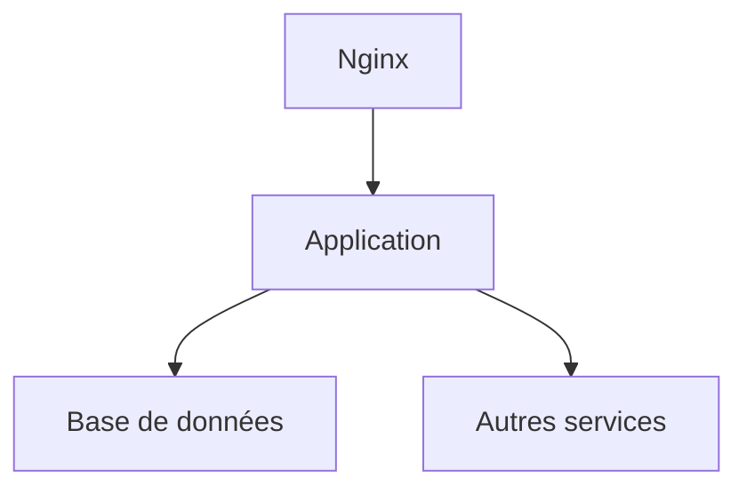

# 📘 Dossier d’Architecture Technique (DAT) – **Admin EP**  

[TOC]

---  

## 1️⃣ Introduction et objectifs  

**Vue d’ensemble fonctionnelle**  
Admin EP est une application métier permettant de :  

* centraliser les listes des membres des conseils d’administration des établissements publics du MTES‑MCT,  
* alimenter automatiquement la base à partir des publications du **Journal officiel (JORF)**,  
* gérer les droits d’accès via **Cerbère**,  
* offrir des fonctions de recherche, de suivi des mandats et d’envoi de notifications d’échéance,  
* fournir des écrans de consultation et d’administration (CRUD) pour les établissements, les administrateurs, les gestionnaires et les mandats.  

### 1.1 Schéma C4 – Niveau 1 (System Context)  

```mermaid
graph TB
    subgraph Utilisateurs;
    U1[DG de tutelle] 
    U2[Opérateurs] 
    U3[SPES] 
    end
    subgraph Systèmes externes;
    JORF[Source JORF (RSS / TAR.GZ)] 
    CERB[Service d’authentification Cerbère] 
    SUP[Supervision PSIN / GTI] 
    MON[Monitoring (Prometheus/Grafana)] 
    end
    AdminEP[Admin EP (Web + DB)] 

    U1 -->|Connexion HTTPS| AdminEP;
    U2 -->|Connexion HTTPS| AdminEP;
    U3 -->|Connexion HTTPS| AdminEP;
    AdminEP -->|Lecture JORF| JORF;
    AdminEP -->|Auth via Cerbère| CERB;
    AdminEP -->|Envoi logs / métriques| MON;
    AdminEP -->|Alertes| SUP
```

### 1.2 Objectifs de qualité orientés utilisateur  

| # | Objectif | Raison métier |
|---|----------|----------------|
| 1 | **Performance** – temps de réponse < 2 s pour les recherches | Garantir une expérience fluide aux opérateurs |
| 2 | **Disponibilité** – 99,5 % de disponibilité en production | Assurer la continuité du service de suivi des mandats |
| 3 | **Sécurité** – authentification forte, contrôle d’accès RBAC via Cerbère | Protéger les données personnelles des administrateurs |
| 4 | **Maintenabilité** – couverture de tests unitaires ≥ 80 % et documentation à jour | Réduire le coût de l’évolution fonctionnelle |
| 5 | **Traçabilité** – journalisation complète des actions critiques | Faciliter les audits DI‑CT et le suivi des modifications |

---  

## 2️⃣ Parties prenantes  

| Rôle | Attente principale |
|------|--------------------|
| **Maîtrise d’Ouvrage (MOA)** – SG/SPES | Respect du périmètre fonctionnel, livrables conformes aux exigences légales |
| **Maîtrise d’Œuvre (MOE)** – SG/DNUM/PNM3/BPN | Architecture robuste, évolutive, respect des standards techniques du ministère |
| **Développeurs** – CGI | Cadre de travail stable (Java 8, Maven, Tomcat 9), bonnes pratiques CI/CD |
| **Opérateurs / Exploitants** – équipe de production | Facilité de déploiement, supervision centralisée, procédures de reprise |
| **Utilisateurs finaux** – DG de tutelle, opérateurs | Interface ergonomique, accès rapide aux informations des mandats |
| **Responsable Sécurité** – équipe SSI | Conformité DI‑CT, gestion des habilitations Cerbère |
| **Auditeur/Recette** – direction du contrôle interne | Traçabilité des accès et des modifications de données |

### 2.1 Contacts  

| Rôle | Nom complet | Courriel |
|------|------------|----------|
| Chef de produit | **Christian Arbogast** | <Christian.Arbogast@developpement-durable.gouv.fr> |
| Directrice de produit | **Céline Gilliard** | <celine.gilliard@developpement-durable.gouv.fr> |
| Responsable technique | **Guillaume Decuq** | <guillaume.decuq@developpement-durable.gouv.fr> |

---  

## 3️⃣ Contraintes  

| Type | Description |
|------|-------------|
| **Techniques** | • Java 8, Struts 2, Tomcat 9 (migration prévue vers Tomcat 10) <br>• PostgreSQL 9.6.11 (migration prévue vers PostgreSQL 15) <br>• Conteneurisation Docker en cours (ECO4) <br>• Utilisation de Maven multi‑modules (adminep‑web, adminep‑database, adminep‑deployment) |
| **Organisationnelles** | • Déploiement via pipeline GitLab CI/CD <br>• Validation obligatoire des scripts de migration DB <br>• Documentation et formation des équipes d’exploitation |
| **Réglementaires** | • Respect du **RGPD** – données personnelles des administrateurs <br>• **DI‑CT** – exigences de disponibilité, intégrité, confidentialité, traçabilité |
| **Sécurité (DI‑CT)** | **Disponibilité** – haute disponibilité via paire de reverse‑proxy Nginx <br>**Intégrité** – contraintes d’unicité et de clés étrangères dans le schéma `integration` <br>**Confidentialité** – authentification Cerbère, rôles `ROLE_ADMIN`, `ROLE_GESTIONNAIRE` <br>**Traçabilité** – logs applicatifs (log4j2), audit de connexion, journalisation des actions CRUD |

---  

## 4️⃣ Contexte et périmètre  

### 4.1 Partenaires fonctionnels  

| Partenaire | Interface | Type de données |
|------------|----------|-----------------|
| **Utilisateurs internes** (DG, opérateurs) | UI web (HTTPS) | Saisie / consultation de mandats |
| **Service Cerbère** | Authentification SSO (OAuth2) | Identités, profils, habilitations |
| **Source JORF** | Flux RSS / archive TAR.GZ | Textes officiels, nominations |
| **Supervision PSIN / GTI** | API REST (alertes) | État de l’application, métriques |
| **Monitoring** (Prometheus/Grafana) | Exporters | KPI de performance, disponibilité |

### 4.2 Interfaces techniques  

| Interface | Protocole | Fréquence | Données |
|----------|-----------|-----------|---------|
| UI → App | HTTPS (TLS 1.2+) | Asynchrone (au clic) | JSON / HTML |
| App → Cerbère | HTTPS (OAuth2) | Au login | Token JWT |
| App → JORF | HTTPS (RSS) | Toutes les 30 min (cron) | XML / TAR.GZ |
| App → PostgreSQL | JDBC (SSL) | En temps réel | SQL DML |
| App → Nginx | HTTP (proxy) | Continu | – |
| App → Prometheus | HTTP (scrape) | 15 s | Métriques exposées |

---  

## 5️⃣ Stratégie de solution  

| Décision | Justification |
|----------|---------------|
| **Architecture monolithique** (Struts 2 + JSP) | Le périmètre fonctionnel reste limité, la complexité d’un micro‑service n’est pas justifiée. |
| **Maven multi‑modules** | Séparation claire entre *web*, *database* et *deployment* facilite la CI/CD. |
| **Conteneurisation Docker** (ECO4) | Uniformise les environnements (dev, recette, prod) et prépare la migration vers Kubernetes éventuelle. |
| **Reverse‑proxy Nginx en paire** | Haute disponibilité, terminaison TLS, répartition de charge sur les deux instances Tomcat. |
| **Base de données PostgreSQL** | Fiabilité, support du schéma riche et des contraintes d’intégrité. |
| **Gestion des secrets** via **Vault** (ou variables d’environnement chiffrées) | Conformité sécurité (pas de mots de passe en clair). |
| **CI/CD GitLab** – pipelines de build, test, packaging, déploiement | Automatisation du déploiement, traçabilité des livrables. |
| **Monitoring** – Prometheus + Grafana, alerting via AlertManager | Visibilité opérationnelle, conformité DI‑CT (disponibilité). |
| **Supervision PSIN** – intégration de l’outil existant du ministère | Centralisation des alertes et des tableaux de bord. |

### 5.1 Stack technologique  

| Couche | Technologie | Version |
|--------|--------------|---------|
| **Langage** | Java | 8 |
| **Framework Web** | Struts 2 + JSP | 2.5 |
| **Serveur d’applications** | Apache Tomcat | 9.0.8 (prévu 10) |
| **Base de données** | PostgreSQL | 9.6.11 (prévu 15) |
| **Gestion de dépendances** | Maven | 3.6 |
| **Conteneurs** | Docker | 20.10 |
| **Reverse‑proxy** | Nginx | 1.22 |
| **Monitoring** | Prometheus + Grafana | 2.45 / 9.5 |
| **Gestion des logs** | Log4j2 | 2.17 |
| **Authentification** | Cerbère (OAuth2) | – |
| **CI/CD** | GitLab CI | – |

### 5.2 Outils de la forge logicielle  

| Outil | Usage |
|-------|-------|
| **GitLab** | Gestion du code source, merge‑request, CI/CD |
| **SonarQube** | Analyse qualité code, couverture tests |
| **Jenkins (optionnel)** | Jobs complémentaires (ex : génération de rapports JORF) |
| **Docker Compose** | Orchestration locale (dev) |
| **Kubernetes (prévu)** | Déploiement en production sur le cloud interne ECO4 |

---  

## 6️⃣ Vue en briques (C4 – Niveau 2)  

```mermaid
graph TB
    subgraph Infra;
    NGINX[Nginx (load‑balanced pair)] 
    TOMCAT1[Tomcat 9 – Webapp]
    TOMCAT2[Tomcat 9 – Webapp]
    PG[PostgreSQL]
    MON[Prometheus/Grafana]
    SUP[Supervision PSIN]
    end
    subgraph Ext;
    USER[Utilisateurs (DG, Opérateurs, SPES)]
    CERB[Service Cerbère]
    JORF[Source JORF (RSS/TAR.GZ)]
    end
    USER -->|HTTPS| NGINX;
    NGINX -->|HTTP| TOMCAT1;
    NGINX -->|HTTP| TOMCAT2;
    TOMCAT1 -->|JDBC| PG;
    TOMCAT2 -->|JDBC| PG;
    TOMCAT1 -->|HTTPS| CERB;
    TOMCAT2 -->|HTTPS| CERB;
    TOMCAT1 -->|HTTP| JORF;
    TOMCAT2 -->|HTTP| JORF;
    TOMCAT1 -->|scrape| MON;
    TOMCAT2 -->|scrape| MON;
    TOMCAT1 -->|alert| SUP;
    TOMCAT2 -->|alert| SUP
```

**Briques principales**  

| Brique | Description |
|-------|-------------|
| **NGINX** | Reverse‑proxy TLS, équilibrage de charge, haute disponibilité. |
| **Tomcat 9 (2 instances)** | Héberge le WAR `adminep-web`. Répartition de charge et tolérance aux pannes. |
| **PostgreSQL** | Schéma `integration` contenant les tables : `TYPE_MANDAT`, `CHARGE`, `ETABLISSEMENT`, etc. |
| **Prometheus / Grafana** | Exportation des métriques (temps de réponse, taux d’erreur). |
| **Supervision PSIN** | Alertes métiers (échéance des mandats, incidents). |
| **Cerbère** | Authentification unique (SSO), gestion des rôles. |
| **JORF** | Source de données externe pour l’alimentation automatique. |

---  

## 7️⃣ Vue d’exécution (Scénarios critiques)  

### 7.1 Connexion d’un utilisateur et recherche d’un établissement  

```mermaid
sequencediagram;
    participant User as Utilisateur (DG)
    participant Nginx as Nginx (LB)
    participant Tomcat as Tomcat (Webapp)
    participant Cerb as Cerbère (SSO)
    participant DB as PostgreSQL;
    participant Mon as Prometheus;
    User->>Nginx: GET /login (HTTPS)
    Nginx->>Tomcat: Forward request;
    Tomcat->>Cerb: Redirect to SSO (OAuth2)
    Cerb-->>User: Authentification;
    User->>Cerb: Credentials;
    Cerb-->>Tomcat: Token JWT;
    Tomcat->>DB: Validate token / charge profil;
    Tomcat->>User: Page d’accueil (menus)
    User->>Tomcat: Recherche "École X"
    Tomcat->>DB: SELECT * FROM ETABLISSEMENT WHERE LIBELLE ILIKE '%École X%'
    DB-->>Tomcat: Résultat;
    Tomcat-->>User: Affichage résultats;
    Tomcat->>Mon: expose_metrics()
```

**Validation qualité** : le temps de réponse de la requête de recherche doit être < 2 s (objectif 1).  

### 7.2 Mise à jour d’un mandat et notification d’échéance  

```mermaid
sequencediagram;
    participant User as Opérateur;
    participant Nginx as Nginx;
    participant Tomcat as Tomcat;
    participant DB as PostgreSQL;
    participant Mail as SMTP (mail interne)
    participant Mon as Prometheus;
    User->>Nginx: POST /mandat/update;
    Nginx->>Tomcat: Forward;
    Tomcat->>DB: UPDATE MANDAT SET date_fin = … WHERE id = …
    DB-->>Tomcat: OK;
    Tomcat->>Mail: SendMail(to=responsable, subject=« Mandat modifié », body=…)
    Tomcat->>Mon: expose_metrics()
    Tomcat-->>User: Confirmation
```

**Validation qualité** : l’envoi de mail doit être garanti (≥ 99 % de réussite) – logs d’erreur et retry via *errorhandler*.  

### 7.3 Traitement automatisé du flux JORF (cron)  

```mermaid
sequencediagram;
    participant Scheduler as Scheduler (Quartz)
    participant Tomcat as Tomcat;
    participant JORF as JORF RSS;
    participant Analyzer as ArticleAnalyser (module)
    participant DB as PostgreSQL;
    participant Mon as Prometheus;
    Scheduler->>Tomcat: Trigger Job « Import JORF »
    Tomcat->>JORF: GET /rss;
    JORF-->>Tomcat: XML;
    Tomcat->>Analyzer: parseAndExtract()
    Analyzer->>DB: INSERT new mandates / admins;
    DB-->>Tomcat: OK;
    Tomcat->>Mon: expose_metrics()
```

**Validation qualité** : le job doit s’exécuter chaque 30 min et ne pas dépasser 5 min d’exécution (performance batch).  

---  

## 8️⃣ Vue Déploiement *(section standardisée)*  

```markdown
### Environnements
| Environnement | Hébergement | Serveurs | Réseau | Particularités |
|---------------|-------------|----------|--------|----------------|
| Développement | Docker‑Compose local | 1× Tomcat, 1× PostgreSQL, 1× Nginx | VLAN dev | Base de données pré‑remplie avec jeux de données de test |
| Recette | ECO4 (IaaS) | 2× Tomcat, 1× PostgreSQL, 2× Nginx (LB) | Réseau privé pré‑prod | Tests d’intégration, validation de la migration DB |
| Production | ECO4 (IaaS) | 2× Tomcat, 1× PostgreSQL HA (streaming réplication), 2× Nginx (LB) | Réseau sécurisé, DMZ | Haute disponibilité, sauvegardes chiffrées, monitoring complet |
```



### Supervision  
Le produit est supervisé via le système standard du GTI pour ce faire :  

- via **Portainer** pour la partie purement conteneurisée,  
- via la stack **Prometheus/Grafana/Loki/AlertManager**,  
- Le produit dispose également d’une supervision **PSIN**.

### Sauvegardes  
Les sauvegardes de la base de données sont assurées par des scripts standards du GTI permettant la création de dumps cryptés en **AES‑256** et déposés sur :  

- le stockage objet **B3** du IaaS ministériel,  
- le stockage objet **Outscale SecNumCloud** (via la prestation qu’a le GTI sur le marché « Nuage Public »),  
- le stockage objet standard de **Google Cloud** (via la prestation qu’a le GTI sur le marché « Nuage Public »).  

---  

## 9️⃣ Sujets transverses  

| Sujet | Détails d’implémentation |
|-------|---------------------------|
| **Authentification** | SSO Cerbère (OAuth2) – filtre `SecurityFilter` (Vertigo) vérifie le token JWT, mapping des rôles (`ROLE_ADMIN`, `ROLE_GESTIONNAIRE`). |
| **Journalisation** | Log4j2 configuré en JSON, rotation quotidienne, envoi vers Loki. |
| **Monitoring** | Exporter Prometheus (`MetricsServlet`) expose métriques HTTP `/metrics`. Alertes sur latence > 2 s, erreurs 5xx, disponibilité du DB. |
| **Gestion des erreurs** | `ErrorHandler` centralise les exceptions, renvoie page `application-error.jsp`. |
| **API interne** | Actions Struts2 exposent des endpoints REST (`/api/v1/...`) pour le module d’analyse JORF. |
| **Sécurité des données** | Chiffrement des mots de passe DB (`pgcrypto`), stockage des secrets dans **Vault** ou variables d’environnement. |
| **CI/CD** | Pipelines GitLab : `build → test → sonar → docker‑build → deploy`. |
| **Tests** | JUnit + Mockito (80 % de couverture), tests d’intégration avec TestContainers (PostgreSQL). |
| **Gestion de configuration** | `application-config.xml` et `baseadmin-auth-config.xml` paramétrés via profils Maven (`dev`, `test`, `prod`). |

---  

## 🔟 Exigences de qualité  

| Exigence | Critère d’acceptation | Scénario de validation |
|----------|----------------------|------------------------|
| **Performance** | 95 % des requêtes < 2 s en charge (100 utilisateurs simultanés). | Tests de charge JMeter sur le endpoint `/search`. |
| **Disponibilité** | Uptime ≥ 99,5 % sur 30 jours (excl. fenêtres de maintenance). | Monitoring Prometheus + alertes AlertManager, revue des rapports de disponibilité. |
| **Sécurité** | Aucun accès non‑autorisé détecté, conformité OWASP Top 10. | Scan de vulnérabilité (OWASP ZAP) + revue des logs Cerbère. |
| **Intégrité des données** | Toutes les contraintes FK/UK sont respectées, aucun doublon de mandat. | Tests d’intégrité DB automatisés (Liquibase `validate`). |
| **Traçabilité** | Chaque modification CRUD est journalisée avec `user_id`, `timestamp`, `action`. | Vérification des tables `audit_log` via requêtes SQL. |
| **Maintenabilité** | Couverture de tests unitaires ≥ 80 % et documentation Javadoc à jour. | Rapport SonarQube + génération de Javadoc dans le pipeline. |
| **Scalabilité** | Le système doit supporter le double du trafic prévu sans dégradation > 20 %. | Test de montée en charge (scale‑out) avec 2× Tomcat + Nginx. |

---  

## 1️⃣1️⃣ Risques et dettes techniques  

| Risque / Dette | Impact | Probabilité | Mesure d’atténuation |
|----------------|--------|-------------|----------------------|
| **Migration vers Tomcat 10 / PostgreSQL 15** | Rupture de compatibilité (API, drivers) | Moyenne | Plan de migration en deux phases, tests d’intégration automatisés, documentation des changements. |
| **Conteneurisation incomplète** | Instabilité en production (images non‑optimisées) | Haute | Utiliser des images officielles, scans de vulnérabilité, CI avec tests d’intégration Docker. |
| **Dépendance à la source JORF** | Interruption du flux d’alimentation automatique | Moyenne | Mise en place d’un fallback manuel, sauvegarde des derniers fichiers JORF, alertes sur échec de job. |
| **Gestion des secrets** (mot de passe DB en clair) | Fuite de données sensibles | Faible (actuel) | Migration vers Vault ou secrets manager, rotation périodique. |
| **Dette de documentation** (code legacy, peu de commentaires) | Difficulté de maintenance | Haute | ADRs (Architecture Decision Records) et génération de documentation via Javadoc / Swagger. |
| **Performance du module d’analyse JORF** | Temps de traitement > 5 min | Moyenne | Optimisation des parsers, parallélisation, profiling. |

---  

## 1️⃣2️⃣ Annexes  

### 12.1 Glossaire  

| Terme | Définition |
|-------|------------|
| **Cerbère** | Service d’authentification unique (SSO) du ministère, basé sur OAuth2/JWT. |
| **Mandat** | Période d’exercice d’un administrateur ou d’un gestionnaire au sein d’un établissement. |
| **ECO4** | Cloud interne ministériel (OpenStack) hébergeant les conteneurs. |
| **PSIN** | Plateforme de supervision du ministère (alertes métiers). |
| **DI‑CT** | Modèle de sécurité (Disponibilité, Intégrité, Confidentialité, Traçabilité). |
| **ADR** | Architecture Decision Record – décision technique consignée. |

### 12.2 Décisions d’architecture (ADRs)  

| # | Décision | Contexte | Conséquence |
|---|----------|----------|-------------|
| **ADR‑001** | Choix d’une architecture **monolithique** (Struts 2 + JSP) | Portée fonctionnelle limitée, équipe déjà experte Struts | Simplicité de déploiement, moindre overhead, mais évolution future vers micro‑services envisagée. |
| **ADR‑002** | Utilisation de **Maven multi‑modules** | Besoin de séparer web, db, déploiement | Build isolé, dépendances claires, CI/CD simplifiée. |
| **ADR‑003** | **Conteneurisation Docker** dès la version 1.3 | Uniformisation des environnements, migration vers ECO4 | Images légères, portabilité, besoin de gestion des secrets. |
| **ADR‑004** | **Reverse‑proxy Nginx en paire** | Haute disponibilité requise (DI‑CT) | Redondance frontale, terminaison TLS centralisée. |
| **ADR‑005** | **Prometheus + Grafana** pour le monitoring | Conformité DI‑CT (disponibilité) et standard GTI | Métriques détaillées, alertes automatisées. |
| **ADR‑006** | **Sauvegardes chiffrées AES‑256** sur trois stockages | Exigences de continuité d’activité | Résilience des données, conformité RGPD. |

---  

*Ce DAT a été produit de façon autonome à partir des sources disponibles (structure du projet, scripts SQL, documentation fonctionnelle et technique). Il constitue le socle de référence pour les équipes de développement, d’exploitation et les parties prenantes du projet Admin EP.*  