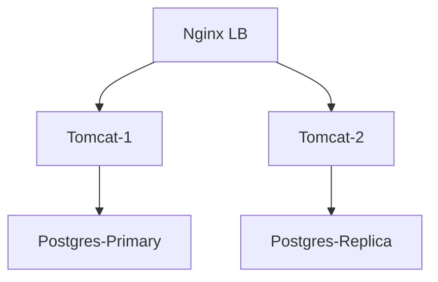

# 📘 Dossier d’Architecture Technique (DAT) – **admin_ep**

[TOC]

---  

## 1️⃣ Introduction et objectifs <a id="introduction"></a>

**Vue d’ensemble fonctionnelle**  
`admin_ep` est une application Java qui centralise les listes des membres des conseils d’administration des établissements publics placés sous la tutelle du ministère de la Transition Écologique. Elle permet :

- la saisie manuelle d’administrateurs,  
- l’alimentation automatique à partir du JORF,  
- la consultation, la recherche et la génération de statistiques,  
- la notification d’échéance de mandats.

### Diagramme C4 – Niveau 1 (System Context) <a id="c4-l1"></a>

```mermaid
graph TD
    User[Utilisateur (SPES, DG de tutelle, Opérateurs)] -->|Web UI| App[admin_ep (Tomcat / Java)]
    App -->|Auth (Cerbère)| Auth[Service d’authentification Cerbère]
    App -->|JDBC| DB[(PostgreSQL DB)]
    App -->|Batch| JORF[Service d’ingestion JORF]
    JORF -->|API| JORFsrc[Service JORF (HTTPS)]
    DB -->|Sauvegarde| Backup[Backup (AES‑256, B3, Outscale, GCP)]
    App -->|Mail| MailSrv[Serveur mail interne]
```

### Objectifs de qualité orientés utilisateur  

| # | Objectif | Raison métier |
|---|----------|---------------|
| 1 | **Performance** – temps de réponse < 2 s pour les recherches | Garantir une expérience fluide aux opérateurs |
| 2 | **Sécurité** – conformité D‑I‑C‑T (Disponibilité, Intégrité, Confidentialité, Traçabilité) | Protection des données personnelles et administratives |
| 3 | **Disponibilité** – 99,5 % de disponibilité mensuelle | Assurer la continuité du service de consultation |
| 4 | **Maintenabilité** – couverture de tests unitaires ≥ 80 % | Faciliter l’évolution (migration Tomcat 10 / Postgres 15) |
| 5 | **Scalabilité** – capacité à supporter + 30 % de trafic en période de mise à jour | Anticiper la croissance du nombre d’établissements |

↩ [Retour au sommaire](#toc)

---  

## 2️⃣ Parties prenantes <a id="parties-prenantes"></a>

| Rôle | Attente principale |
|------|---------------------|
| **Maîtrise d’ouvrage (MOA)** – SG/SPES | Respect du périmètre fonctionnel et des livrables |
| **Maîtrise d’œuvre (MOE)** – SG/SNUM/PNM/DPNM3/BPN | Qualité du code, respect des standards d’intégration |
| **Développeurs** (CGI) | Environnement de build stable, CI/CD automatisé |
| **Exploitants (Ops)** | Supervision, alerting, procédures de reprise |
| **RSSI** | Conformité D‑I‑C‑T, gestion des accès Cerbère |
| **Utilisateurs finaux** (DG de tutelle, opérateurs) | Interface ergonomique, fiabilité des données |
| **Support** | Documentation à jour, procédure d’escalade |

↩ [Retour au sommaire](#toc)

---  

## 3️⃣ Contraintes <a id="contraintes"></a>

### 3.1 Contraintes techniques  

- **Langage** : Java 8 (migration prévue vers Java 11).  
- **Serveur d’applications** : Tomcat 9.0.8 (prévu → Tomcat 10).  
- **Base de données** : PostgreSQL 9.6.11 (prévu → PostgreSQL 15).  
- **Infrastructure** : hébergement sur le cloud interne ECO4 (OpenStack) ; plateforme ACAI (clusters ESXi) pour la prod.  
- **Sécurité** : HTTPS obligatoire, mots de passe chiffrés, certificats TLS.  
- **Sauvegarde** : scripts GTI, dumps AES‑256, stockage multi‑site (B3, Outscale, GCP).  

### 3.2 Contraintes organisationnelles  

| Type | Description |
|------|-------------|
| **Réglementaire** | Évaluation DICT positive (07/09/2018) – exigences D‑I‑C‑T. |
| **Processus** | Gestion des versions via GitLab, pipeline Maven + Assembly. |
| **Interopérabilité** | Consommation du flux JORF (HTTPS, RSS). |
| **Montée de version** | Tomcat 10 & PostgreSQL 15 prévues, tests de régression requis. |

↩ [Retour au sommaire](#toc)

---  

## 4️⃣ Contexte et périmètre <a id="contexte-perimetre"></a>

### 4.1 Interactions fonctionnelles  

| Système / Acteur | Type d’interface | Protocole | Fréquence |
|------------------|-------------------|-----------|------------|
| Utilisateurs (Web) | UI (HTML/JS) | HTTPS | En temps réel |
| Service d’authentification Cerbère | API REST | HTTPS | À chaque login |
| Flux JORF | Ingestion batch | HTTPS (RSS) | Quotidien (cron) |
| Serveur mail interne | SMTP | TLS | À chaque notification d’échéance |
| Système de supervision PSIN | API interne | HTTPS | Continu (polling) |
| Backup storage (B3, Outscale, GCP) | SFTP / API | TLS | Quotidien |

### 4.2 Périmètre technique  

- **Web‑app** : `adminep-web` (Tomcat)  
- **Base de données** : `adminep-database` (schemas *integration*, *baseadmin*)  
- **Batch JORF** : `adminep-web` module `ArticleAnalyser` (schedule)  
- **Supervision & monitoring** : Prometheus/Grafana/Loki/AlertManager, Portainer (Docker)  

↩ [Retour au sommaire](#toc)

---  

## 5️⃣ Stratégie de solution <a id="strategie-solution"></a>

### 5.1 Décisions architecturales majeures  

| Décision | Raison |
|----------|--------|
| **Monolithe Java** (couche Web + services) | Simplicité de déploiement, historique du projet, faible complexité fonctionnelle. |
| **Layered architecture** (Controller → Service → DAO) | Séparation des responsabilités, testabilité. |
| **Utilisation du framework Struts 2 + Vertigo** | Conformité aux standards internes. |
| **Maven multi‑module** (database, deployment, doc, web) | Gestion centralisée des dépendances. |
| **Conteneurisation prévue** (Docker) | Faciliter la migration vers les environnements IaaS. |

### 5.2 Environnement technologique  

| Couche | Technologie / Version |
|--------|-----------------------|
| **Frontend** | JSP + Struts 2, CSS Bootstrap 3, jQuery |
| **Backend** | Java 8, Struts 2, Vertigo, Spring (boot) |
| **Serveur d’applications** | Tomcat 9.0.8 (prévu → 10) |
| **Base de données** | PostgreSQL 9.6.11 (prévu → 15) |
| **CI/CD** | GitLab CI, Maven, Docker, Portainer |
| **Supervision** | Prometheus, Grafana, Loki, AlertManager, Portainer |
| **Sécurité** | HTTPS (TLS 1.2+), Cerbère SSO, chiffrement AES‑256 pour les backups |

### 5.3 Outils de forge logicielle  

- **Gestion du code** : GitLab (repos `adminep-web`, `adminep-database`, …)  
- **Build** : Maven 3, `maven‑assembly‑plugin` (zip des scripts SQL).  
- **Déploiement** : Docker‑Compose (en cours), scripts `adminep-deployment`.  
- **Tests** : JUnit, Mockito, SonarQube (qualité).  

↩ [Retour au sommaire](#toc)

---  

## 6️⃣ Vue en Briques (C4 – Niveau 2) <a id="vue-briques"></a>

```mermaid
graph TD
    subgraph Container;
        A[Tomcat (admin_ep‑web)] --> B[PostgreSQL (admin_ep‑db)]
        A --> C[Scheduler (ArticleAnalyser)]
        A --> D[Cerbère SSO Client]
        A --> E[Mail Sender]
    end
    subgraph External;
        F[JORF Feed] --> C;
        G[PSIN Supervision] --> A;
    end
    User --> A
```

**Descriptions brèves des conteneurs**  

- **Tomcat (admin_ep‑web)** : héberge les servlets Struts 2, les contrôleurs MVC, le filtre de sécurité.  
- **PostgreSQL (admin_ep‑db)** : schéma *integration* pour les référentiels, *baseadmin* pour les données métier.  
- **Scheduler (ArticleAnalyser)** : job Quartz qui télécharge le flux JORF, parse les articles et met à jour la base.  
- **Cerbère SSO Client** : filtre `SecurityFilter` qui délègue l’authentification à Cerbère.  
- **Mail Sender** : service de notification d’échéance de mandat (SMTP interne).  

↩ [Retour au sommaire](#toc)

---  

## 7️⃣ Vue Exécution (Scénarios) <a id="vue-execution"></a>

### 7.1 Scénario 1 – Saisie et consultation d’un administrateur  

```mermaid
sequencediagram;
    participant User as Utilisateur;
    participant UI as Web UI;
    participant App as admin_ep (Tomcat)
    participant Auth as Cerbère;
    participant DB as PostgreSQL;
    User->>UI: Saisie login/password;
    UI->>Auth: Authentification;
    Auth-->>UI: Token (session)
    User->>UI: Accès à la page « Recherche Admin »
    UI->>App: Requête GET /admines;
    App->>DB: SELECT * FROM ADMINISTRATEUR WHERE …
    DB-->>App: Résultat;
    App-->>UI: Rendu JSP (liste)
    User->>UI: Clique « Créer »
    UI->>App: POST /admines (formulaire)
    App->>DB: INSERT ADMINISTRATEUR;
    DB-->>App: OK;
    App-->>UI: Confirmation
```

**Validation** : temps de réponse < 2 s, log d’accès enregistré (traçabilité).  

### 7.2 Scénario 2 – Ingestion automatique JORF (batch)  

```mermaid
sequencediagram;
    participant Scheduler as Scheduler (Quartz)
    participant JORF as JORF Feed (HTTPS)
    participant Analyzer as ArticleAnalyser;
    participant DB as PostgreSQL;
    Scheduler->>JORF: GET RSS (daily)
    JORF-->>Analyzer: XML payload;
    Analyzer->>Analyzer: Parsing, extraction (Nom, Mandat, etc.)
    Analyzer->>DB: UPSERT ADMINISTRATEUR / MANDAT;
    DB-->>Analyzer: OK;
    Analyzer->>Scheduler: Log succès
```

**Validation** : aucune erreur de parsing, logs de batch archivés, alertes sur échec (AlertManager).  

### 7.3 Scénario 3 – Notification d’échéance de mandat  

```mermaid
sequencediagram;
    participant Scheduler as Scheduler (Quartz)
    participant DB as PostgreSQL;
    participant Mail as Mail Service;
    Scheduler->>DB: SELECT mandats WHERE date_fin < now()+7;
    DB-->>Scheduler: Liste des mandats;
    Scheduler->>Mail: SEND mail (to référent)
    Mail-->>Scheduler: ACK
```

**Validation** : envoi effectué, accusé de réception stocké, délai ≤ 1 h après détection.  

↩ [Retour au sommaire](#toc)

---  

## 8️⃣ Vue Déploiement *(section standardisée)* <a id="vue-deploiement"></a>

### Environnements
| Environnement | Hébergement | Serveurs | Réseau | Particularités |
|---------------|-------------|----------|--------|----------------|
| Développement | Docker‑Compose local | 1 Tomcat, 1 Postgres | Loopback | Conteneurs + Hot‑reload |
| Recette | ECO4 (IaaS) – Cluster ESXi | 2 Tomcat, 1 Postgres HA | VLAN interne | Jeux de données masquées |
| Production | ECO4 (OpenStack) – Cluster ACAI | 4 Tomcat (load‑balanced), 2 Postgres (replication) | VLAN DMZ | HA, sauvegardes multi‑site, monitoring PSIN |

### Infrastructure
Le produit est hébergé sur le cloud interne **ECO4** basé sur **OpenStack**, dans le tenant `pnm3` du département.  
Le reverse‑proxy **Nginx** du schéma ci‑dessous est en fait une paire de Nginx load‑balancés en frontal des produits hébergés sur le tenant.



### Supervision
Le produit est supervisé via le système standard du GTI :

- **Portainer** pour la partie purement conteneurisée,  
- **Stack Prometheus / Grafana / Loki / AlertManager**,  
- Le produit dispose également d’une supervision **PSIN**.

### Sauvegardes
Les sauvegardes de la base de données sont assurées par des scripts standards du GTI permettant la création de dumps cryptés en **AES‑256** et déposés sur :

- le stockage objet **B3** du IaaS ministériel,  
- le stockage objet **Outscale SecNumCloud** (via la prestation du GTI « Nuage Public »),  
- le stockage objet standard de **Google Cloud** (via la prestation du GTI « Nuage Public »).  

---  

## 9️⃣ Sujets transverses <a id="sujets-transverses"></a>

- **Authentification** : intégration Cerbère, sessions via `BaseAdminUserSession`.  
- **Journalisation** : `log4j2.xml` configuré en JSON, logs centralisés dans Loki.  
- **Monitoring** : métriques Prometheus exposées (`/metrics`), tableaux de bord Grafana (temps de réponse, taux d’erreur).  
- **Gestion des erreurs** : `ErrorHandler` global, pages d’erreur personnalisées (`application-error.jsp`).  
- **API interne** : aucune API publique, toutes les communications internes sont sécurisées (HTTPS, mutual TLS).  
- **Gestion des droits** : `RightsHelper` & `Roles` définissent les profils (cerbère → `TypeProfilBaseAdmin`, `TypeProfilCerbere`).  

↩ [Retour au sommaire](#toc)

---  

## 🔟 Exigences de qualité <a id="exigences-qualite"></a>

| Exigence | Critère | Scénario de validation |
|----------|----------|------------------------|
| **Performance** | < 2 s pour recherche d’administrateur (100 000 enregistrements) | Test de charge JMeter, 100 concurrent users |
| **Sécurité** | Conformité D‑I‑C‑T, chiffrement TLS 1.2+, mots de passe hachés BCrypt | Scan OWASP ZAP, revue de code, tests d’injection |
| **Disponibilité** | ≥ 99,5 % mensuel | Monitoring AlertManager, bascule automatique sur replica |
| **Intégrité des données** | Aucun doublon de mandat, contraintes FK respectées | Tests d’intégrité DB (pg\_audit) après batch JORF |
| **Traçabilité** | Logs d’accès et d’opérations sauvegardés 12 mois | Vérification dans Loki, recherche par userID |
| **Scalabilité** | Ajout de 30 % de trafic sans dégradation | Test de scaling horizontal (Docker Swarm + 2 instances) |
| **Maintenabilité** | Couverture de tests unitaires ≥ 80 % | SonarQube, rapport de couverture |

↩ [Retour au sommaire](#toc)

---  

## 1️⃣1️⃣ Risques et dettes techniques <a id="risques-dettes"></a>

| Risque / Dette | Impact | Mesure corrective / atténuation |
|----------------|--------|-----------------------------------|
| **Obsolescence du stack** (Java 8, Tomcat 9) | Difficulté à appliquer patches, incompatibilité future | Plan de migration vers Java 11 & Tomcat 10 (sprints dédiés) |
| **Scripts SQL manuels** (mise à jour via `update/`) | Risque d’incohérence de schéma | Automatiser les migrations avec Flyway ou Liquibase |
| **Batch JORF non‑idempotent** | Doublons de données | Ajouter une logique de déduplication (hash du contenu) |
| **Dépendance unique à Cerbère** | Blocage en cas d’indisponibilité | Implémenter fallback local (liste blanche) pour les comptes critiques |
| **Sauvegarde multi‑site non‑testée** | Perte de données en sinistre | Exercices de restauration mensuels, validation des backups |
| **Absence de tests d’intégration** | Bugs en production lors de changements | Introduire des tests d’API (RestAssured) et de flux batch |

↩ [Retour au sommaire](#toc)

---  

## 1️⃣2️⃣ Annexes <a id="annexes"></a>

### 📚 Glossaire  

| Terme | Définition |
|-------|------------|
| **Cerbère** | Service d’authentification unique (SSO) du ministère. |
| **ECO4** | Cloud interne ministériel, basé sur OpenStack. |
| **ACAI** | Plateforme d’hébergement Java (clusters ESXi). |
| **DICT** | Délégation Interministérielle à la Communication et aux Technologies. |
| **D‑I‑C‑T** | Disponibilité, Intégrité, Confidentialité, Traçabilité. |
| **PSIN** | Plateforme de supervision interne (Supervision PSIN). |
| **ADR** | Architecture Decision Record – décisions formalisées. |

### 📄 Décisions d’architecture (ADR) – Extraits  

| N° | Décision | Statut | Résumé |
|----|----------|--------|--------|
| 1 | **Choix du monolithe Java** | Acceptée | Simplicité de mise en production, faible overhead, alignement avec l’existant. |
| 2 | **Utilisation de PostgreSQL 9.6** | Acceptée (à migrer) | Base fiable, supporte les contraintes d’intégrité requises. |
| 3 | **Batch JORF via Quartz** | Acceptée | Permet la planification flexible et la résilience aux pannes. |
| 4 | **Supervision via Prometheus/Grafana** | Acceptée | Standard du GTI, visibilité fine des métriques. |
| 5 | **Chiffrement des backups AES‑256** | Acceptée | Conformité aux exigences de confidentialité. |

---  

*Document généré automatiquement le **27/04/2026** à partir des sources `admin_ep.*`  

↩ [Retour au sommaire](#toc)