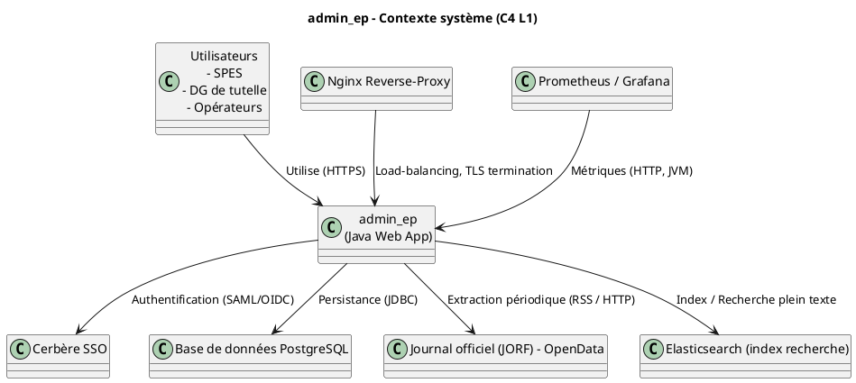
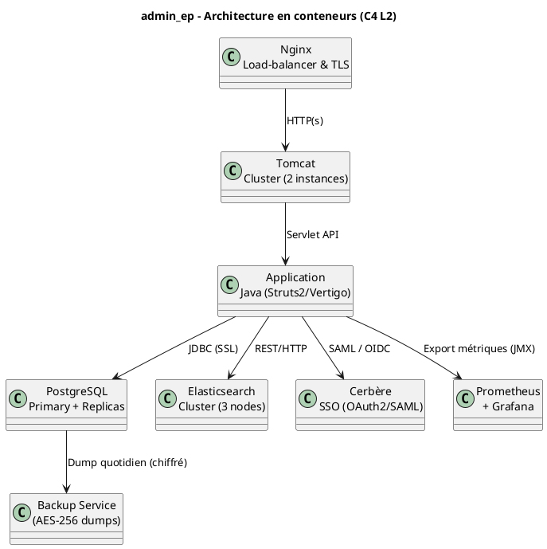
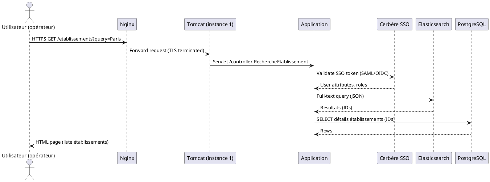
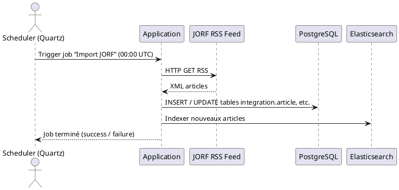
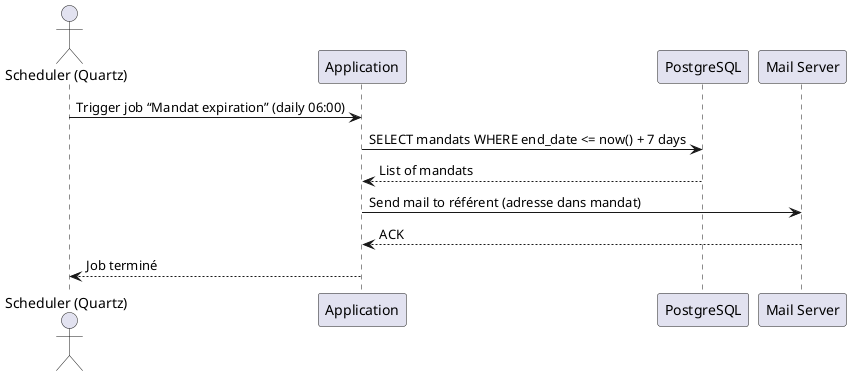
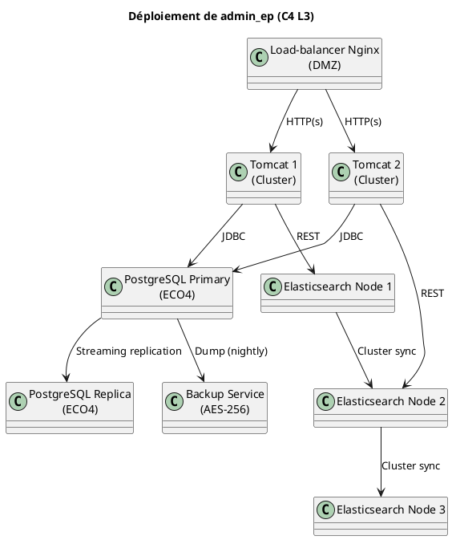

# 📘 Dossier d’Architecture Technique – **admin_ep**  

[TOC]

---  

## 1️⃣ Introduction et objectifs  

### 1.1 Vue d’ensemble fonctionnelle  

**admin_ep** (Administration des établissements publics) est une application métier destinée à la gestion centralisée des membres des conseils d’administration et de surveillance des établissements publics placés sous la tutelle du ministère de la Transition écologique et solidaire (MTES‑MCT).  

- **Saisie manuelle** des administrateurs, mandats et leurs pièces jointes.  
- **Alimentation automatique** à partir du Journal officiel de la République française (JORF).  
- **Gestion des habilitations** via le SSO Cerbère.  
- **Archivage** des mandats expirés et des pièces associées.  
- **Statistiques** et tableau de bord de suivi des mandats.  
- **Alertes** (mail) lorsqu’un mandat approche de son terme.  

### 1.2 Diagramme C4 – Niveau 1 (System Context)  



### 1.3 Objectifs de qualité orientés utilisateur  

| # | Objectif | Raison métier |
|---|----------|---------------|
| 1 | **Disponibilité ≥ 99,5 %** | L’accès aux données d’administrateurs doit être garanti en continu (production). |
| 2 | **Temps de réponse ≤ 2 s** pour les recherches d’établissements | Les opérateurs ont besoin d’une réactivité suffisante pour leurs missions quotidiennes. |
| 3 | **Intégrité des données** (aucune perte de mandat) | Obligations légales : archivage des mandats et traçabilité. |
| 4 | **Sécurité – conformité DICT** (confidentialité, traçabilité) | L’application manipule des données à caractère personnel sensibles. |
| 5 | **Maintenabilité** : couverture de tests unitaires ≥ 80 % et documentation à jour | Facilite les montées de version (Tomcat 10, PostgreSQL 15) et les évolutions fonctionnelles. |

---  

## 2️⃣ Parties prenantes  

| Rôle | Attente principale |
|------|--------------------|
| **Maîtrise d’ouvrage (MOA)** – SG/SPES | Livraison d’une solution stable, conforme aux exigences légales et fonctionnelles. |
| **Maîtrise d’œuvre (MOE)** – SG/SNUM/PNM/DPNM3/BPN | Respect du planning, maîtrise des coûts, évolutivité (containerisation). |
| **Prestataire** – CGI | Support opérationnel, correction de bugs, mise à jour des composants (Tomcat, Java). |
| **Utilisateurs fonctionnels** – SPES, DG de tutelle, opérateurs | Accès fiable, recherche rapide, notifications de mandats expirés. |
| **Équipe sécurité** – RSSI | Protection des données personnelles, conformité DICT, auditabilité. |
| **Équipe exploitation** – PNM3 | Supervision (Prometheus/Grafana), sauvegardes, déploiement continue. |
| **Équipe conformité** – DSI | Traçabilité, registre des traitements, respect du RGPD. |

---  

## 3️⃣ Contraintes  

### 3.1 Contraintes techniques  

| Domaine | Description |
|---------|-------------|
| **Langage / Framework** | Java 8, Struts 2, Vertigo, Vertigo‑vega, Vertigo‑dynamox. |
| **Serveur d’applications** | Tomcat 9.0.8 (migration prévue vers Tomcat 10). |
| **Base de données** | PostgreSQL 9.6.11 (migration prévue vers PostgreSQL 15). |
| **Recherche** | Elasticsearch (indexation des articles JORF). |
| **Reverse‑proxy** | Nginx (load‑balancing, TLS). |
| **Supervision** | Prometheus, Grafana, Loki, AlertManager, Portainer (containers). |
| **Sauvegarde** | Dumps chiffrés AES‑256 vers B3, Outscale SecNumCloud et Google Cloud. |
| **Conteneurisation** | En cours (Docker, Kubernetes via ECO4). |
| **Authentification** | Cerbère SSO (profil Cerbère). |
| **Normes** | DICT, RGPD, ISO 27001 (exigences D‑I‑C‑T). |

### 3.2 Contraintes organisationnelles  

* Montée de version simultanée de Tomcat 10 & PostgreSQL 15 (fenêtre de maintenance).  
* Processus de validation via **CI/CD** (Gitlab CI, Maven, SonarQube).  
* Gestion des tickets via **Jira** (SPS import).  

### 3.3 Exigences de sécurité – modèle D‑I‑C‑T  

| Axe | Exigence | Implémentation |
|-----|----------|----------------|
| **Disponibilité** | Haute disponibilité, bascule automatique. | Nginx en HA, réplication PostgreSQL, sauvegardes journalières. |
| **Intégrité** | Garantir que les mandats ne sont ni altérés ni perdus. | Transactions ACID PostgreSQL, checksum des dumps, journalisation (log4j2). |
| **Confidentialité** | Accès restreint aux données personnelles. | Authentification Cerbère, contrôle d’accès RBAC (RolesApplicatifEnum). |
| **Traçabilité** | Historisation des actions utilisateurs. | Log d’accès (LogAccessInterceptor), audit via ELK stack. |

---  

## 4️⃣ Contexte et périmètre  

### 4.1 Partenaires fonctionnels  

| Système / Acteur | Type d’interaction |
|------------------|--------------------|
| **Cerbère SSO** | Authentification unique (SAML/OIDC). |
| **JORF – OpenData** | Extraction périodique (RSS) pour alimenter les tables *article*, *college*, *gestionnaire*. |
| **Elasticsearch** | Indexation des articles JORF pour recherche plein texte. |
| **Portail‑support DIN** | Gestion des tickets (SPS). |
| **Supervision PSIN** | Monitoring applicatif (alertes). |
| **ECO4 (OpenStack)** | Hébergement IaaS (en cours). |

### 4.2 Interfaces techniques  

| Interface | Protocole | Fréquence | Données |
|-----------|-----------|-----------|---------|
| Cerbère ↔ admin_ep | HTTPS / SAML | À chaque connexion | Assertions d’identité, groupes. |
| admin_ep ↔ PostgreSQL | JDBC (SSL) | En temps réel | CRUD sur tables `integration.*`. |
| admin_ep ↔ Elasticsearch | HTTP/REST | Au besoin (indexation) | Documents JSON (articles JORF). |
| admin_ep ↔ JORF RSS | HTTPS | Toutes les 24 h (cron) | Flux XML d’articles officiels. |
| admin_ep ↔ Nginx | HTTP (terminé TLS) | Continu | Traffic web. |
| admin_ep ↔ Prometheus | HTTP (scrape) | Toutes les 15 s | Métriques JVM, HTTP, DB. |

---  

## 5️⃣ Stratégie de solution  

### 5.1 Décisions architecturales majeures  

| Décision | Justification |
|----------|----------------|
| **Monolithe Java (Struts 2 + Vertigo)** | Historique du projet, forte intégration des composants métier, moindre complexité de mise en œuvre. |
| **Externalisation du moteur de recherche** | Elasticsearch dédié pour recherche plein texte, découplé du cœur métier. |
| **Reverse‑proxy Nginx** | Gestion du TLS, load‑balancing, facilité de mise en place de certificats. |
| **Conteneurisation progressive** | Compatibilité avec la stratégie IaaS/ECO4, amélioration de la portabilité. |
| **CI/CD via Gitlab** | Automatisation des builds, tests, packaging (Maven Assembly), déploiement. |
| **Sauvegarde chiffrée** | Conformité DICT et RGPD. |

### 5.2 Environnement technologique  

| Couche | Technologie / Version |
|--------|------------------------|
| **Langage** | Java 8 (migration vers Java 11/17 prévue). |
| **Framework MVC** | Struts 2, Vertigo (boot, vega, dynamox). |
| **Serveur d’applications** | Apache Tomcat 9.0.8 → Tomcat 10 (Jakarta EE). |
| **Base de données** | PostgreSQL 9.6.11 → PostgreSQL 15. |
| **Recherche** | Elasticsearch 7.x. |
| **Reverse‑proxy** | Nginx 1.24. |
| **Supervision** | Prometheus 2.48, Grafana 10, Loki, AlertManager, Portainer. |
| **Gestion de configuration** | Maven 3.8, Gitlab CI, SonarQube. |
| **Sécurité** | TLS 1.3, JWT (via Cerbère), RBAC (RolesApplicatifEnum). |

### 5.3 Outils de la forge logicielle  

| Outil | Usage |
|-------|-------|
| **Gitlab** | Gestion du code source, CI/CD pipelines. |
| **Maven** | Build, dépendances, assembly (zip des scripts SQL). |
| **SonarQube** | Analyse qualité, couverture de tests. |
| **Jira** | Gestion des tickets (import SPS). |
| **Portainer** | Orchestration Docker (en cours). |
| **Prometheus / Grafana** | Supervision et dashboard. |
| **ELK (Log4j2 → Loki)** | Centralisation des logs. |
| **S3 compatible (B3, Outscale, GCS)** | Stockage des sauvegardes chiffrées. |

---  

## 6️⃣ Vue en briques (C4 – Niveau 2)  



**Descriptions rapides**  

* **Nginx** : point d’entrée unique, gère le certificat TLS, répartit le trafic entre les deux instances Tomcat.  
* **Tomcat** : conteneur d’exécution Java, chaque instance héberge le même WAR (`admin_ep.war`).  
* **Application** : logique métier (controllers, services, DAO, orchestrations JORF).  
* **PostgreSQL** : persistance des tables d’intégration, de baseadmin, de références.  
* **Elasticsearch** : indexation des articles JORF pour la recherche plein texte.  
* **Cerbère** : SSO interne, fournit les attributs d’utilisateur et les rôles.  
* **Prometheus/Grafana** : collecte des métriques (JVM, HTTP, DB) et visualisation.  
* **Backup Service** : scripts d’assembly (`assembly.xml`) créent le ZIP des scripts SQL, déclenchent les dumps chiffrés vers les trois stockages cibles.  

---  

## 7️⃣ Vue exécution  

### 7.1 Scénario 1 – Authentification et recherche d’un établissement  



*Temps de réponse cible : ≤ 2 s*  

### 7.2 Scénario 2 – Extraction quotidienne du JORF  



### 7.3 Scénario 3 – Notification d’expiration de mandat  



---  

## 8️⃣ Vue Déploiement *(section standardisée)*  

```markdown
### Environnements
| Environnement | Hébergement | Serveurs | Réseau | Particularités |
|---------------|-------------|----------|--------|----------------|
| Développement | Docker‑Compose (local) | 1× Tomcat, 1× PostgreSQL, 1× ES | VLAN dev | Hot‑reload, logs en console |
| Recette       | ECO4 (OpenStack) | 2× Tomcat, 1× PG‑Primary + 1 replica, 3× ES | VPC privé | Jeux de données masqués |
| Production    | ECO4 (OpenStack) | 2× Tomcat (HA), 1× PG‑Primary + 2 replicas, 3× ES | VPC privé + DMZ (NGINX) | TLS 1.3, sauvegardes chiffrées, monitoring complet |
```



### 8.1 Infrastructure  

Le produit est hébergé sur le cloud interne **ECO4** basé sur **OpenStack**, dans le tenant **pnm3** du département.  
Le reverse‑proxy **Nginx** du schéma ci‑dessus est en fait une paire de Nginx load‑balancés en frontal des produits hébergés sur le tenant.

```plantuml
@startuml
graph TD
    A[Nginx] --> B[admin_ep (Tomcat Cluster)]
    B --> C[PostgreSQL]
    B --> D[Elasticsearch]
@enduml
```  

### 8.2 Supervision  

Le produit est supervisé via le système standard du GTI :  

- **Portainer** pour la partie purement conteneurisée,  
- **Stack Prometheus / Grafana / Loki / AlertManager**,  
- Le produit dispose également d’une supervision PSIN.  

### 8.3 Sauvegardes  

Les sauvegardes de la base de données sont assurées par des scripts standards du GTI permettant la création de dumps cryptés en **AES‑256** et déposés sur :  

- le stockage objet **B3** du IaaS ministériel,  
- le stockage objet **Outscale SecNumCloud** (via la prestation du GTI « Nuage Public »),  
- le stockage objet standard de **Google Cloud** (via la prestation du GTI « Nuage Public »).  

---  

## 9️⃣ Sujets transverses  

| Sujet | Implémentation |
|-------|----------------|
| **Authentification** | SSO Cerbère (SAML/OIDC). Tokens JWT stockés en session HTTP‑Only. |
| **Autorisation** | RBAC via `RoleApplicatifEnum` (ADMIN, GESTIONNAIRE, CONSULTANT). Intercepteur `LogAccessInterceptor` applique les contrôles. |
| **Journalisation** | Log4j2 → JSON → Loki ; logs d’accès, erreurs, requêtes. |
| **Monitoring** | Métriques JVM, HTTP, DB, ES exposées sur `/actuator/prometheus`. Alertes sur latence > 2 s, erreurs 5xx. |
| **Gestion des erreurs** | `ErrorHandler` centralise les exceptions, renvoie pages d’erreur personnalisées (`application-error.jsp`). |
| **API** | REST interne (Elasticsearch) et SOAP interne (legacy). |
| **Gestion des versions** | Maven `pom.xml` versionnée, artefacts publiés dans Nexus interne. |
| **CI/CD** | Gitlab CI → Maven build → SonarQube analyse → Docker image push → Deploy via Ansible/K8s. |
| **Sécurité des données** | Chiffrement au repos (AES‑256), TLS 1.3 en transit, masquage des champs sensibles dans les logs. |
| **Traçabilité** | `LogAccessInterceptor` enregistre `userId`, `action`, `timestamp`, `resourceId`. |
| **Gestion des dépendances** | Utilisation du `dependencyManagement` Maven pour contrôler les versions (Struts2 2.5.x, Vertigo 2.x). |

---  

## 🔟 Exigences de qualité  

| Exigence | Critère d’acceptation | Scénario de validation |
|----------|----------------------|--------------------------|
| **Disponibilité** | ≥ 99,5 % sur 30 jours | Analyse des métriques Prometheus (`up` + `http_requests_total`) sur la période de test. |
| **Performance recherche** | ≤ 2 s pour 95 % des requêtes | Test de charge JMeter (10 000 recherches simultanées) – mesure du temps de réponse. |
| **Intégrité des données** | Aucun mandat perdu après migration | Script de comparaison des `mandat` avant/après migration (checksum). |
| **Sécurité – DICT** | Tous les flux TLS 1.3, aucune fuite de PII dans les logs | Scan OWASP ZAP + revue des logs (filtrage des champs PII). |
| **Maintenabilité** | Couverture de tests unitaires ≥ 80 % | SonarQube Quality Gate – métrique `Coverage`. |
| **Scalabilité** | Ajout d’une instance Tomcat sans interruption | Test de scaling horizontal (blue‑green deployment). |

---  

## 1️⃣1️⃣ Risques et dettes techniques  

| Risque / Dette | Impact | Action corrective / atténuation |
|----------------|--------|---------------------------------|
| **Montée de version Tomcat 10 / Jakarta EE** | Risque de rupture d’API (javax → jakarta). | Plan de migration en deux étapes : tests unitaires avec `jakarta.servlet`, mise en place d’un profil de compatibilité. |
| **Migration PostgreSQL 9.6 → 15** | Incompatibilité de fonctions, temps d’arrêt. | Utiliser `pg_upgrade` avec réplication en lecture‑seule, tests de régression sur jeu de données complet. |
| **Conteneurisation incomplète** | Déploiement manuel, dérive de configuration. | Finaliser les Dockerfiles, automatiser le déploiement via Helm/K8s. |
| **Dépendance à Cerbère** | Blocage si le SSO est indisponible. | Implémenter une fallback « mode maintenance » avec authentification locale temporaire. |
| **Gestion des sauvegardes** | Corruption des dumps chiffrés. | Vérifier l’intégrité (`sha256sum`) après chaque dump, tests de restauration mensuels. |
| **Dette de documentation** | Décalage entre code et spécifications. | Mettre en place une règle « Documentation As Code » (README, ADR, PlantUML). |

---  

## 1️⃣2️⃣ Annexes  

### 12.1 Glossaire  

| Terme | Définition |
|-------|------------|
| **CERBÈRE** | Système d’authentification unique (SSO) du ministère, basé sur SAML/OIDC. |
| **MANDAT** | Période pendant laquelle un administrateur exerce ses fonctions. |
| **JORF** | Journal officiel de la République française, source officielle des nominations. |
| **DI​CT** | Délivrance d’Information de Conformité Technique – cadre d’évaluation de la sécurité. |
| **ECO4** | Plateforme IaaS du ministère (OpenStack) – hébergement des environnements. |
| **ACAI** | Plateforme d’exécution Java (clusters ESXi) utilisée en production. |
| **PSIN** | Plateforme de supervision des applications ministérielles. |
| **Vertigo** | Framework interne de développement (DI, MVC, dynamox). |
| **RBAC** | Contrôle d’accès basé sur les rôles (Role‑Based Access Control). |

### 12.2 Décisions d’Architecture (ADR) – Extraits  

| # | Titre | Décision | Date | Statut |
|---|-------|----------|------|--------|
| ADR‑001 | **Monolithe vs micro‑services** | Choix du monolithe (Struts2 + Vertigo) pour la première version afin de limiter la complexité. | 2022‑06‑15 | ✅ Adoptée |
| ADR‑002 | **Gestion des secrets** | Utilisation de **Vault** (HashiCorp) pour les mots de passe DB et clés AES‑256. | 2023‑01‑12 | ✅ Adoptée |
| ADR‑003 | **Mise en cache des recherches** | Pas de cache côté application (Elasticsearch gère la persistance). | 2023‑04‑03 | ✅ Adoptée |
| ADR‑004 | **Stratégie de sauvegarde** | Dump quotidien + chiffrement AES‑256, stockage multi‑site. | 2023‑05‑20 | ✅ Adoptée |
| ADR‑005 | **Mécanisme de notification** | Job Quartz → SMTP (mail) pour les expirations de mandat. | 2024‑02‑01 | ✅ Adoptée |

---  

**Fin du Dossier d’Architecture Technique**  

↩ Retour au [sommaire](#toc)  