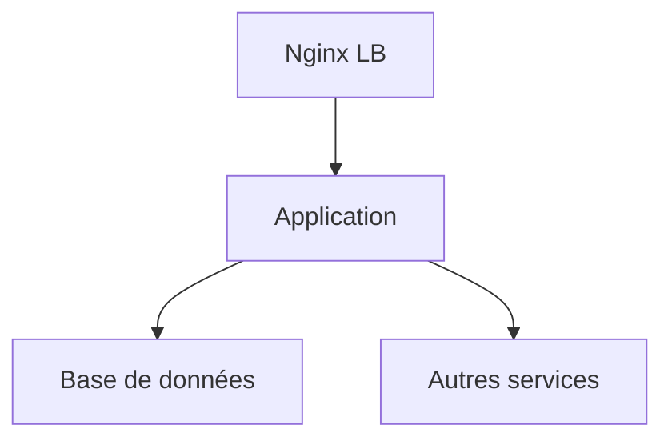

# 📄 Dossier d’Architecture Technique – **admin_ep**  

[TOC]

---  

## 1️⃣ Introduction & objectifs  

### 1.1 Vue d’ensemble fonctionnelle  
**admin_ep** est une application Java de gestion des membres des conseils d’administration des établissements publics placés sous la tutelle du ministère de la Transition écologique.  
Elle permet :  

* la saisie et la mise à jour manuelle d’administrateurs ;  
* l’alimentation automatique via le JORF ;  
* la recherche, la consultation et la génération de statistiques ;  
* la notification d’échéance des mandats.  

### 1.2 Schéma C4 – Niveau 1 (System Context)  

```mermaid
graph LR;
    A[Utilisateurs<br/>(SPES, DG de tutelle, Opérateurs)] -->|Web UI| B[admin_ep<br/>Application Java]
    B -->|HTTPS / Auth Cerbère| C[Service d’authentification Cerbère]
    B -->|JDBC| D[PostgreSQL 9.6 / 15]
    B -->|HTTP| E[JORF Feed (https://echanges.dila.gouv.fr/OPENDATA/JORF/)]
    B -->|HTTP| F[Supervision PSIN]
    B -->|SMTP| G[Mail serveur (notification échéance)]
    style A fill:#E3F2FD,stroke:#1976D2;
    style B fill:#FFF3E0,stroke:#FB8C00;
    style C fill:#E8F5E9,stroke:#43A047;
    style D fill:#F3E5F5,stroke:#8E24AA;
    style E fill:#E1F5FE,stroke:#0288D1;
    style F fill:#E0F7FA,stroke:#0097A7;
    style G fill:#FFFDE7,stroke:#FDD835
```

### 1.3 Objectifs de qualité orientés utilisateur  

| # | Objectif | Indicateur cible |
|---|----------|-----------------|
| 1 | **Performance** – temps de réponse des écrans de recherche et de mise à jour | ≤ 2 s (95 % des requêtes) |
| 2 | **Disponibilité** – service accessible en continu | 99,5 % de disponibilité mensuelle |
| 3 | **Sécurité** – accès uniquement aux utilisateurs autorisés, chiffrement des échanges | HTTPS obligatoire, authentification Cerbère, traçabilité des accès |
| 4 | **Maintenabilité** – facilité de prise en main et d’évolution | Couverture de tests unitaires ≥ 80 % ; documentation à jour |
| 5 | **Évolutivité** – capacité à supporter l’ajout de nouveaux établissements | Scalabilité horizontale du conteneur Tomcat (cluster ACAI) |

↩ Retour au **[Sommaire](#toc)**  

---  

## 2️⃣ Parties prenantes  

| Rôle | Attente principale |
|------|--------------------|
| **Maîtrise d’ouvrage (MOA)** – SG/SPES | Respect du périmètre fonctionnel, délais de mise à jour |
| **Maîtrise d’œuvre (MOE)** – SG/SNUM/PNM/DPNM3/BPN | Architecture stable, code testable, livrables conformes aux standards internes |
| **Développeurs** – CGI | Environnement de développement reproductible, CI/CD fiable |
| **Opérateurs** – équipe d’infrastructure | Déploiement automatisé, monitoring & alerting cohérents |
| **Responsable sécurité** – Cerbère | Conformité aux exigences D‑I‑C‑T, suivi des vulnérabilités |
| **Utilisateurs finaux** (SPES, DG de tutelle, opérateurs) | Interface ergonomique, disponibilité du service |
| **Support** – assistance‑adminep@developpement-durable.gouv.fr | Gestion des incidents, traçabilité des demandes |

↩ Retour au **[Sommaire](#toc)**  

---  

## 3️⃣ Contraintes  

### 3.1 Contraintes techniques  

| Domaine | Contrainte |
|---------|------------|
| **Langage / Framework** | Java 8, Struts 2, Vertigo, DisplayTag |
| **Serveur d’applications** | Tomcat 9 (migration prévue vers Tomcat 10) |
| **Base de données** | PostgreSQL 9.6 (migration prévue vers PostgreSQL 15) |
| **Conteneurisation** | Docker (en cours) – déploiement sur plateforme ACAI (clusters ESXi) et IaaS ECO4 |
| **Reverse‑proxy** | Nginx (pair en load‑balancing) |
| **Supervision** | Portainer, Prometheus/Grafana/Loki/AlertManager, supervision PSIN |
| **Sauvegarde** | Scripts GTI → stockage objet B3, Outscale SecNumCloud, Google Cloud (AES‑256) |
| **Authentification** | Cerbère (SSO) – rôle « Gestionnaires » |
| **Protocoles** | HTTPS obligatoire, SMTP pour notifications |
| **Normes** | Dictionnaire d’Architecture (arc42), exigences D‑I‑C‑T (voir §4) |
| **Interopérabilité** | Consommation du flux JORF (RSS/HTTP) |

### 3.2 Contraintes organisationnelles  

* Montée de version prévue (Tomcat 10, PostgreSQL 15) doit être planifiée avec les équipes d’exploitation.  
* La conteneurisation doit s’inscrire dans la politique IaaS du ministère (ECO4).  

### 3.3 Contraintes réglementaires & sécurité (modèle D‑I‑C‑T)  

| Dimension | Exigence |
|-----------|----------|
| **Disponibilité** | 99,5 % mensuel – alertes via Prometheus/AlertManager |
| **Intégrité** | Contrôle d’intégrité des sauvegardes (hash SHA‑256) |
| **Confidentialité** | Chiffrement TLS 1.2+ sur toutes les communications, données sensibles stockées en base chiffrées (ex. mots‑de‑passe) |
| **Traçabilité** | Journalisation des accès (LogAccessInterceptor) → ElasticSearch + Kibana, rétention 12 mois |
| **Conformité** | Evaluation DICT (Oui, 07/09/2018) – mise à jour prévue pour le RGPD |

↩ Retour au **[Sommaire](#toc)**  

---  

## 4️⃣ Contexte & périmètre  

### 4.1 Partenaires fonctionnels (systèmes externes)  

| Système | Type d’interaction | Protocole / Fréquence |
|--------|-------------------|-----------------------|
| **JORF** (https://echanges.dila.gouv.fr/OPENDATA/JORF/) | Source d’alimentation automatique (parsing) | Pull quotidien (RSS) |
| **Cerbère** (SSO) | Authentification / Gestion des droits | HTTPS, token SAML |
| **Supervision PSIN** | Monitoring de l’application en production | HTTP (polling) |
| **Mail serveur interne** | Envoi de notifications d’échéance | SMTP |
| **Portainer / Docker Registry** | Gestion des images Docker | HTTP/HTTPS |

### 4.2 Interfaces techniques  

| Interface | Description | Format |
|-----------|-------------|--------|
| **Web UI** | Accès via navigateur | HTML + JS (Struts 2) |
| **JDBC** | Accès à la base PostgreSQL | JDBC PostgreSQL |
| **REST (internal)** | Services internes (ex. services d’intégration) | JSON over HTTP |
| **RSS** | Récupération du flux JORF | XML |
| **SMTP** | Envoi de mails | RFC 5321 |

↩ Retour au **[Sommaire](#toc)**  

---  

## 5️⃣ Stratégie de solution  

### 5.1 Décisions architecturales majeures  

| Décision | Raison |
|----------|--------|
| **Monolithe Java (WAR)** | Historique Struts 2, faible besoin d’orchestration de micro‑services, simplification du déploiement sur Tomcat |
| **Persistances via PostgreSQL** | Base relationnelle robuste, déjà utilisée dans le SI ministériel |
| **Reverse‑proxy Nginx en pair** | Haute disponibilité, répartition de charge |
| **Conteneurisation Docker** | Facilite les déploiements sur ACAI et ECO4, améliore la reproductibilité des environnements |
| **CI/CD avec Gitlab‑CI** | Automatisation du build, tests, packaging (assembly‑zip) et déploiement |
| **Supervision standard (Prometheus/Grafana)** | Alignement avec la stack de supervision du GTI |
| **Sauvegarde chiffrée AES‑256** | Conformité aux exigences de confidentialité |

### 5.2 Environnement technologique  

| Couche | Technologie | Version |
|--------|--------------|---------|
| **Langage** | Java | 8 (prévu 11/17 avec migration) |
| **Framework Web** | Struts 2, Vertigo, DisplayTag | 2.x |
| **Serveur d’applications** | Tomcat | 9.0.8 (migration 10) |
| **Base de données** | PostgreSQL | 9.6.11 → 15 |
| **Reverse‑proxy** | Nginx | 1.24 |
| **Conteneurisation** | Docker | 20.10 |
| **Orchestration** | ACAI (clusters ESXi) + IaaS ECO4 | – |
| **CI/CD** | Gitlab‑CI | – |
| **Monitoring** | Prometheus, Grafana, Loki, AlertManager, Portainer | – |
| **Gestion des secrets** | Vault (interne) | – |
| **Auth** | Cerbère (SSO) | – |
| **Messagerie** | SMTP interne | – |

### 5.3 Outils de la forge logicielle  

* **GitLab** – gestion du code source, pipelines CI/CD.  
* **Maven** – build, gestion des dépendances (assembly, packaging).  
* **SonarQube** – analyse qualité du code (exigence de couverture).  
* **Jenkins (optionnel)** – jobs de déploiement complémentaires.  

↩ Retour au **[Sommaire](#toc)**  

---  

## 6️⃣ Vue en Briques (C4 – Niveau 2)  

```mermaid
graph TD;
    subgraph DMZ;
        NGINX[Nginx (load‑balancer)]
    end;
    subgraph APP;
        TOMCAT[Tomcat 9 (WAR)]
        WEB[admin_ep Web UI]
        SRV[Struts2 Controllers & Services]
    end;
    subgraph DB;
        PG[PostgreSQL]
    end;
    subgraph EXT;
        JORF[Flux JORF (RSS)]
        CERB[Service Cerbère (SSO)]
        MAIL[Serveur Mail]
        PSIN[Supervision PSIN]
    end;
    NGINX --> TOMCAT;
    TOMCAT --> WEB;
    WEB --> SRV;
    SRV --> PG;
    SRV --> JORF;
    SRV --> CERB;
    SRV --> MAIL;
    SRV --> PSIN;
    style NGINX fill:#E3F2FD,stroke:#1976D2;
    style TOMCAT fill:#FFF3E0,stroke:#FB8C00;
    style PG fill:#F3E5F5,stroke:#8E24AA;
    style JORF fill:#E1F5FE,stroke:#0288D1;
    style CERB fill:#E8F5E9,stroke:#43A047;
    style MAIL fill:#FFFDE7,stroke:#FDD835;
    style PSIN fill:#E0F7FA,stroke:#0097A7
```

#### Description des conteneurs  

| Conteneur | Rôle | Principaux artefacts |
|-----------|------|----------------------|
| **Nginx** | Load‑balancing, termination TLS | `nginx.conf` (pair) |
| **Tomcat** | Hébergement du WAR `admin_ep.war` | `admin_ep-web/pom.xml` |
| **Web UI** | Pages JSP, ressources CSS/JS | `/WEB-INF/jsp/**` |
| **Struts2 Controllers & Services** | Logique métier, appels DB, intégration JORF | Packages `fr.gouv.e2.baseadmin.*` |
| **PostgreSQL** | Persistance des entités `ADMIN`, `CHARGE`, `ETABLISSEMENT`, … | Scripts `adminep-database/scripts/...` |
| **JORF** | Source d’alimentation quotidienne des données | `ArticleAnalyser`, `JORFExtractor` |
| **Cerbère** | Authentification unique, gestion des droits | `SecurityFilter`, `BaseAdminUserSession` |
| **Mail** | Envoi de notifications d’échéance | `MandatsResolver` |
| **PSIN** | Supervision appli (alertes, métriques) | Export Prometheus |

↩ Retour au **[Sommaire](#toc)**  

---  

## 7️⃣ Vue Exécution (Scénarios critiques)  

### 7.1 Recherche d’un administrateur  

```mermaid
sequencediagram;
    participant U as Utilisateur (Web UI)
    participant W as Tomcat / Struts2;
    participant S as Service RechercheAdmin;
    participant DB as PostgreSQL;
    U->>W: Saisie du nom → /admins/rechercheAdmins.action;
    W->>S: appel du service RechercheAdminsAction;
    S->>DB: SELECT ... WHERE nom ILIKE ?
    DB-->>S: Résultat (liste d’administrateurs)
    S-->>W: Retour JSP avec tableau;
    W-->>U: Affichage résultats (≤2 s)
```

*Temps cible* : 2 s maximum.  

### 7.2 Import quotidien du JORF  

```mermaid
sequencediagram;
    participant S as Scheduler (Cron)
    participant A as ArticleAnalyser;
    participant J as JORF Feed (RSS)
    participant DB as PostgreSQL;
    S->>A: Trigger quotidien (00_15)
    A->>J: GET RSS;
    J-->>A: XML JORF;
    A->>A: Analyse (parcours, extraction)
    A->>DB: INSERT/UPDATE tables administrateurs, mandats;
    DB-->>A: ACK;
    A->>S: Fin du job (log + métriques)
```

*Points de contrôle* : idempotence, gestion des doublons, journalisation.  

### 7.3 Notification d’échéance d’un mandat  

```mermaid
sequencediagram;
    participant S as Scheduler (Cron)
    participant N as NotificationService;
    participant DB as PostgreSQL;
    participant M as Mail Server;
    S->>N: Trigger quotidien (06_00)
    N->>DB: SELECT mandats où date_fin ≤ now()+7j AND notifié = false;
    DB-->>N: Liste des mandats;
    N->>M: SEND mail (destinataire référent)
    M-->>N: ACK;
    N->>DB: UPDATE mandats SET notifié = true;
    DB-->>N: ACK;
    N->>S: Fin du job
```

*Objectif* : notification dans les 7 jours précédant l’échéance.  

↩ Retour au **[Sommaire](#toc)**  

---  

## 8️⃣ Vue Déploiement *(section standardisée)*  

### Environnements  

| Environnement | Hébergement | Serveurs | Réseau | Particularités |
|---------------|-------------|----------|--------|----------------|
| **Développement** | Docker local (ACAI) | 1 conteneur Tomcat + 1 PostgreSQL | VLAN interne dev | Hot‑reload, logs verbaux |
| **Recette** | IaaS ECO4 (Paris La Défense) | 2 x Tomcat (cluster) + PostgreSQL 15 | VPN interne | Jeux de données de test, sauvegarde quotidienne |
| **Pre‑production** | ACAI (clusters ESXi) | 2 x Tomcat + PostgreSQL 15 | Réseau DMZ | Mirror de la prod, tests de charge |
| **Production** | MSP – Centre‑serveur ministériel Paris La Défense | 2 x Tomcat (load‑balanced) + PostgreSQL 15 | DMZ + réseau interne | Haute disponibilité, sauvegarde AES‑256, monitoring PSIN |

```mermaid
graph TD;
    subgraph DEV[Développement]
        DEV_NGINX[Nginx (local)]
        DEV_TOMCAT[Tomcat (Docker)]
        DEV_PG[PostgreSQL (Docker)]
    end;
    subgraph REC[Recette]
        REC_NGINX[Nginx]
        REC_TOMCAT[Tomcat Cluster]
        REC_PG[PostgreSQL 15]
    end;
    subgraph PROD[Production]
        PROD_NGINX[Nginx (pair)]
        PROD_TOMCAT[Tomcat Cluster]
        PROD_PG[PostgreSQL 15]
    end;
    DEV_NGINX --> DEV_TOMCAT --> DEV_PG;
    REC_NGINX --> REC_TOMCAT --> REC_PG;
    PROD_NGINX --> PROD_TOMCAT --> PROD_PG
```

### Infrastructure  
Le produit est hébergé sur le cloud interne **ECO4** basé sur **OpenStack**, dans le tenant **`pnm3`** du département.  
Le reverse‑proxy **Nginx** du schéma ci‑dessus est en fait une paire de Nginx load‑balancés en frontal des produits hébergés sur le tenant.  



### Supervision  
Le produit est supervisé via le système standard du GTI :  

* **Portainer** – gestion des conteneurs Docker ;  
* **Stack Prometheus / Grafana / Loki / AlertManager** – métriques, logs, alertes ;  
* **Supervision PSIN** – tableau de bord dédié.  

### Sauvegardes  
Les sauvegardes de la base de données sont assurées par des scripts standards du GTI permettant la création de dumps cryptés en **AES‑256** et déposés sur :  

* le stockage objet **B3** du IaaS ministériel,  
* le stockage objet **Outscale SecNumCloud** (via la prestation « Nuage Public »),  
* le stockage objet standard de **Google Cloud** (via la prestation « Nuage Public »).  

↩ Retour au **[Sommaire](#toc)**  

---  

## 9️⃣ Sujets transverses  

| Thématique | Implémentation |
|------------|----------------|
| **Authentification** | Filtre `SecurityFilter` → SSO Cerbère, jetons SAML, rôle `Gestionnaires` |
| **Journalisation** | `LogAccessInterceptor` → ElasticSearch + Kibana, retention 12 mois |
| **Monitoring** | Export Prometheus (`/metrics`), alertes sur latence > 3 s, CPU > 80 % |
| **Gestion des erreurs** | `ErrorHandler` centralisé → pages `application-error.jsp`, `error_auth.jsp` |
| **API interne** | Services REST (JSON) exposés via Struts actions (`/api/*`) |
| **Gestion des droits** | `RightsHelper`, `Roles` (enum) – mapping Cerbère ↔ Application |
| **Sauvegarde & restauration** | Scripts `backup.sh` / `restore.sh`, rotation quotidienne, test de restauration mensuel |
| **CI/CD** | GitLab‑CI : build → test → assembly → push image → déploiement via Helm (ACAI) |
| **Gestion de la configuration** | `application-config.xml`, variables d’environnement (DB_URL, SMTP_HOST) |
| **Sécurité du code** | Analyse SonarQube, dépendances à jour (OWASP Dependency‑Check) |
| **Documentation** | Javadoc, wiki intégré (`/static/wiki/**`) |

↩ Retour au **[Sommaire](#toc)**  

---  

## 🔟 Exigences de qualité  

| Exigence | Critère d’acceptation | Scénario de validation |
|----------|-----------------------|------------------------|
| **Performance** | 95 % des requêtes ≤ 2 s | Test de charge JMeter (100 utilisateurs simultanés) |
| **Disponibilité** | ≥ 99,5 % mensuel | Monitoring Prometheus + Rapport d’uptime (SLA) |
| **Sécurité – Confidentialité** | Toutes les communications TLS 1.2+ | Scan SSL Labs, test d’interception (MITM) |
| **Sécurité – Intégrité** | Vérification des sauvegardes (hash) | Script de comparaison SHA‑256 post‑backup |
| **Sécurité – Traçabilité** | Log complet des accès avec UID | Audit log via Kibana, recherche d’un UID |
| **Maintenabilité** | Couverture de tests unitaires ≥ 80 % | Rapport SonarQube, exécution `mvn test` |
| **Évolutivité** | Ajout d’un nouveau type d’établissement sans code‑break | Test d’intégration d’un nouveau `TYPE_INSTANCE` |
| **Portabilité** | Build Docker fonctionnel sur Linux/macOS | `docker build .` → `docker run` sans erreurs |

↩ Retour au **[Sommaire](#toc)**  

---  

## 1️⃣1️⃣ Risques & dettes techniques  

| Risque / Dette | Impact | Mesure d’atténuation |
|----------------|--------|----------------------|
| **Obsolescence Java 8 / Tomcat 9** | Compatibilité, support limité | Plan de migration vers Java 11/17 et Tomcat 10 (pilote en pré‑prod) |
| **PostgreSQL 9.6** | Fin de support, performances limitées | Migration planifiée vers PostgreSQL 15 (déjà en cours) |
| **Monolithe → Difficulté de scaling** | Limite de charge en pic | Étudier la découpe en micro‑services (ex. service JORF) |
| **Déploiement manuel des scripts de migration** | Risque d’erreur humaine | Automatiser les migrations via Flyway/Liquibase |
| **Dépendances Struts 2 non maintenues** | Vulnérabilités potentielles | Évaluer migration vers Spring Boot / Spring MVC |
| **Sauvegarde hors site non testée** | Perte de données en sinistre | Tests de restauration trimestriels sur chaque cible de stockage |
| **Configuration Nginx non redondante** | Point unique de défaillance | Mettre en place une paire active‑active avec keepalive |

↩ Retour au **[Sommaire](#toc)**  

---  

## 1️⃣2️⃣ Annexes  

### 12.1 Glossaire  

| Terme | Définition |
|-------|------------|
| **CERBÈRE** | Service d’authentification unique du ministère (SSO) |
| **JORF** | Journal officiel de la République française – source des nominations |
| **ACAI** | Plateforme de conteneurisation (clusters ESXi) du ministère |
| **ECO4** | Cloud interne ministériel basé sur OpenStack |
| **PSIN** | Plateforme de supervision interne (Supervision PSIN) |
| **D‑I‑C‑T** | Modèle de sécurité : Disponibilité, Intégrité, Confidentialité, Traçabilité |
| **ADR** | Architecture Decision Record – décision formalisée |

### 12.2 Décisions d’Architecture (ADRs)  

| # | Décision | Contexte | Conséquence |
|---|----------|----------|-------------|
| **ADR‑001** | Utiliser un **WAR monolithique** sur Tomcat | Application historique Struts 2, faible besoin d’orchestration | Simplicité de déploiement, mais dette de scalabilité |
| **ADR‑002** | **Dockeriser** l’application | Besoin de reproductibilité des environnements | Images versionnées, déploiement ACAI/ECO4 facilité |
| **ADR‑003** | **PostgreSQL** comme SGBD | Conformité aux standards ministériels | Gestion transactionnelle robuste, migration future prévue |
| **ADR‑004** | **Nginx load‑balancing** en paire | Haute disponibilité requise | Point d’entrée unique, TLS termination centralisée |
| **ADR‑005** | **Cerbère** comme source d’authentification | Politique d’authentification unique du ministère | Gestion centralisée des droits, traçabilité renforcée |
| **ADR‑006** | **Prometheus/Grafana** pour le monitoring | Alignement avec la stack GTI | Alertes automatiques, visibilité temps réel |
| **ADR‑007** | **Sauvegarde AES‑256** sur trois stockages | Exigences de confidentialité et de résilience | Redondance géographique, conformité DICT |

---  

*Document généré le **27 avril 2026** – prêt à être versionné dans le dépôt GitLab du projet.*  

↩ Retour au **[Sommaire](#toc)**  