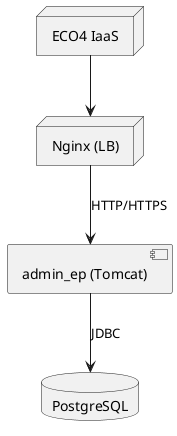

# 📚 Dossier d’Architecture Technique (DAT) – **admin_ep**  

[TOC]

---  

## 1️⃣ Introduction et objectifs <a id="section-1"></a>

**Vue d’ensemble fonctionnelle**  
`admin_ep` (Administration des Établissements Publics) est une application web qui centralise la gestion des membres des conseils d’administration et de surveillance des établissements publics du ministère de la Transition Écologique. Elle permet :  

* la saisie et la mise à jour manuelle des administrateurs, gestionnaires, mandats, etc.  
* l’alimentation automatique à partir du JORF (Journal Officiel) ;  
* la recherche, la consultation et la génération de statistiques ;  
* la notification des échéances de mandat.  

**C4 – Niveau 1 – Schéma système (Mermaid)**  

```mermaid
graph LR;
    subgraph Utilisateurs;
        MOA[Maîtrise d’Ouvrage (SG/SPES)]
        MOE[Maîtrise d’Œuvre (SG/DNUM/PNM3/BPN)]
        Ops[Opérateurs (DG de tutelle, SPES)]
    end;
    subgraph Système;
        AdminEP[admin_ep<br/>Web + DB]
    end;
    subgraph Services externes;
        JORF[(JORF – flux OpenData)]
        Mail[(Serveur de mail)]
        Auth[(Cerbère – Authentification)]
    end;
    MOA --> AdminEP;
    MOE --> AdminEP;
    Ops --> AdminEP;
    AdminEP --> JORF;
    AdminEP --> Mail;
    AdminEP --> Auth
```

**Objectifs de qualité orientés utilisateur**  

| # | Objectif | Mesure |
|---|----------|--------|
| 1 | **Performance** – Temps de réponse < 2 s pour les recherches d’administrateurs. | Tests de charge (JMeter) – 95 % des requêtes < 2 s. |
| 2 | **Sécurité** – Authentification unique via Cerbère, chiffrement TLS 1.3. | Audit D‑I‑C‑T, tests d’intrusion OWASP ZAP. |
| 3 | **Disponibilité** – 99,5 % de disponibilité mensuelle. | Monitoring (Prometheus) + SLA. |
| 4 | **Maintenabilité** – Temps moyen de correction (MTTC) < 4 h. | Couverture de tests unitaires ≥ 80 %. |
| 5 | **Évolutivité** – Ajout d’un nouveau type d’établissement sans redeploiement complet. | Architecture modulaire (containers). |

↩ Retour au **[Sommaire](#toc)**  

---  

## 2️⃣ Parties prenantes <a id="section-2"></a>

| Rôle | Attente principale |
|------|--------------------|
| **Maîtrise d’Ouvrage (SG/SPES)** | Livrer une application fiable, conforme aux exigences fonctionnelles et réglementaires. |
| **Maîtrise d’Œuvre (SG/DNUM/PNM3/BPN)** | Garantir la qualité du code, la conformité aux standards techniques et la capacité de maintenance. |
| **Direction Générale (DG) de tutelle** | Disposer d’une vision consolidée des mandats et pouvoir être alertée des échéances. |
| **Opérateurs (Gestionnaires, Administrateurs)** | Saisir et mettre à jour les données rapidement, avec une interface ergonomique. |
| **Services de supervision (PSIN)** | Accéder à des métriques d’état et à des alertes en temps réel. |
| **Équipe Sécurité (Cerbère)** | Assurer le respect du modèle d’authentification et la traçabilité des accès. |
| **Équipe Support** | Disposer d’informations d’incident claires et d’un processus de résolution. |

### Contacts (exemple) <a id="section-2-contacts"></a>

| Rôle | Nom complet | Courriel |
|------|-------------|----------|
| Chef de produit | **Christian ARBOGAST** | Christian.Arbogast@developpement-durable.gouv.fr |
| Directrice de produit | **Céline GILLIARD** | celine.gilliard@developpement-durable.gouv.fr |
| Responsable sécurité | **[à préciser]** | security.admin_ep@developpement-durable.gouv.fr |

↩ Retour au **[Sommaire](#toc)**  

---  

## 3️⃣ Contraintes <a id="section-3"></a>

| Type | Description |
|------|-------------|
| **Technique** | Java 8, Tomcat 9, PostgreSQL 9.6 (en production 9.6.11) – migration prévue vers Tomcat 10 & PostgreSQL 15. |
| **Organisationnelle** | Livraison continue via GitLab CI/CD, respect des processus de validation de la DG. |
| **Réglementaire** | Conformité D‑I‑C‑T (Disponibilité, Intégrité, Confidentialité, Traçabilité) – évaluation DICT réalisée le 07/09/2018. |
| **Sécurité** | Authentification via Cerbère, chiffrement TLS 1.3, journalisation obligatoire des actions critiques. |
| **Interopérabilité** | Consommation du flux OpenData JORF (HTTPS, JSON/XML). |
| **Performance** | Temps de réponse < 2 s pour les recherches, capacité à servir ~ 200 concurrent users. |

**Exigences de sécurité D‑I‑C‑T**  

| D‑I‑C‑T | Exigence | Implémentation |
|--------|----------|----------------|
| **Disponibilité** | 99,5 % mensuel | Redondance Nginx, monitoring Prometheus + AlertManager. |
| **Intégrité** | Aucun altération des données | Transactions PostgreSQL, contraintes d’intégrité référentielle. |
| **Confidentialité** | Accès limité aux profils Cerbère | Filtrage RBAC via `BaseAdminUserSession`. |
| **Traçabilité** | Historisation des modifications | Table `audit_log` + log4j2 JSON. |

↩ Retour au **[Sommaire](#toc)**  

---  

## 4️⃣ Contexte et périmètre <a id="section-4"></a>

**Partenaires fonctionnels**  

| Système/Acteur | Rôle |
|----------------|------|
| **JORF (OpenData)** | Fournit les arrêtés et décrets qui alimentent automatiquement la base. |
| **Cerbère** | Gestion des comptes utilisateurs et des droits. |
| **Mail (SMTP interne)** | Envoi de notifications d’échéance de mandat. |
| **PSIN** | Supervision de l’application (dashboard). |

**Interfaces techniques**  

| Interface | Protocole | Fréquence | Type de données |
|----------|----------|-----------|-----------------|
| JORF → admin_ep | HTTPS (GET) | Quotidien (cron) | XML/JSON (articles JORF) |
| admin_ep → Cerbère | HTTPS (POST) | À chaque authentification | JSON (token) |
| admin_ep → Mail | SMTP (TLS) | À chaque alerte mandat | Texte (mail) |
| admin_ep → PSIN | HTTP (GET) | Toutes les 30 s | Métriques Prometheus (JSON) |

↩ Retour au **[Sommaire](#toc)**  

---  

## 5️⃣ Stratégie de solution <a id="section-5"></a>

### Décisions architecturales majeures  

| Décision | Raison |
|----------|--------|
| **Monolithe web (Struts 2 + Vertigo) déployé dans un conteneur Tomcat** | Réutilisation du socle existant, faible complexité de mise en œuvre. |
| **Base de données PostgreSQL** | Fiabilité, support de transactions, contraintes d’intégrité. |
| **Conteneurisation (Docker) prévue** | Facilite la montée en version (Tomcat 10) et la portabilité sur l’IaaS ECO4. |
| **Pattern MVC + Service Layer** | Séparation claire des responsabilités, testabilité. |
| **Utilisation du framework Vertigo (DI, sécurité)** | Gestion centralisée des beans, interceptors, filtres. |

### Environnement technologique  

| Couche | Technologie / Version |
|--------|------------------------|
| **Langage** | Java 8 (migration prévue vers Java 11) |
| **Framework web** | Struts 2, Vertigo 9 |
| **Serveur d’applications** | Tomcat 9.0.8 (prévu Tomcat 10) |
| **Base de données** | PostgreSQL 9.6.11 (prévu PostgreSQL 15) |
| **Front‑end** | JSP, Bootstrap 3, jQuery |
| **Sécurité** | Cerbère, TLS 1.3, filtre `SecurityFilter` |
| **CI/CD** | GitLab CI (Maven 3.6, SonarQube, Docker) |
| **Supervision** | Prometheus 2.x, Grafana 8.x, Loki, AlertManager |
| **Sauvegarde** | Scripts AES‑256 → stockage B3, Outscale SecNumCloud, Google Cloud |

### Outils de la forge logicielle  

* **Maven** pour la compilation & packaging.  
* **GitLab** (repos, pipelines, artefacts).  
* **SonarQube** pour la qualité du code.  
* **Docker** (Dockerfile, docker‑compose) – future.  
* **Jira** (gestion des tickets – import SPS).  

↩ Retour au **[Sommaire](#toc)**  

---  

## 6️⃣ Vue en Briques (C4 – Niveau 2) <a id="section-6"></a>

**Diagramme conteneur (Mermaid)**  

```mermaid
C4Container;
    title admin_ep – Niveau 2 (Conteneurs)
    Enterprise_Boundary(b0, "admin_ep") {
        Container(web, "Web Application", "Java (Struts2 + Vertigo)", "Interface utilisateur, API REST interne")
        ContainerDb(db, "PostgreSQL", "PostgreSQL 9.6", "Stockage persistant des données métier")
        ContainerExt(jorf, "JORF Service", "HTTP(S) client", "Récupération quotidienne des arrêtés")
        ContainerExt(cerb, "Cerbère", "OAuth2", "Gestion des comptes et des droits")
        ContainerExt(mail, "SMTP Server", "TLS", "Envoi de notifications")
    }
    Rel(web, db, "JDBC", "SQL")
    Rel(web, jorf, "HTTPS", "Flux JORF")
    Rel(web, cerb, "HTTPS", "Authentification")
    Rel(web, mail, "SMTP", "Mail d’alerte")
```

### Description des conteneurs  

| Conteneur | Rôle | Principaux artefacts |
|----------|------|----------------------|
| **Web Application** | Point d’entrée utilisateur, traitement métier, génération de vues JSP. | `admin_ep-web` (Spring‑like configuration, Struts actions, services). |
| **PostgreSQL** | Persistance des entités : administrateurs, mandats, établissements, logs. | Schémas `integration`, `baseadmin`. |
| **JORF Service** | Agent de récupération et de parsing des flux JORF. | `ArticleAnalyser`, `JORFExtractor`. |
| **Cerbère** | Authentification unique (SSO) et gestion des droits. | `BaseAdminUserSession`, `SecurityFilter`. |
| **SMTP Server** | Envoi de mails d’alerte (échéances, erreurs). | `MailSender` (via Spring). |

↩ Retour au **[Sommaire](#toc)**  

---  

## 7️⃣ Vue Exécution (Scénarios critiques) <a id="section-7"></a>

### 7.1 Recherche d’un administrateur (scenario A)  

```mermaid
sequencediagram;
    participant User as Opérateur;
    participant UI as UI (JSP)
    participant WS as Web Application;
    participant DB as PostgreSQL;
    User->>UI: Saisit le nom dans le champ recherche;
    UI->>WS: Requête HTTP GET /admin/search?name=…
    WS->>DB: SELECT * FROM administrateur WHERE nom ILIKE '%…%'
    DB-->>WS: Résultat (liste d’administrateurs)
    WS-->>UI: Rendu JSP avec les résultats;
    UI-->>User: Affichage de la liste
```

*Validation* : le temps de réponse mesuré < 2 s, le nombre de résultats correspond aux attentes fonctionnelles.  

### 7.2 Notification d’échéance de mandat (scenario B)  

```mermaid
sequencediagram;
    participant Scheduler as SchedulerInitializer (cron 00_00)
    participant WS as Web Application;
    participant DB as PostgreSQL;
    participant Mail as SMTP Server;
    Scheduler->>WS: Trigger job « MandatEcheanceJob »
    WS->>DB: SELECT mandats WHERE date_fin BETWEEN now() AND now()+7;
    DB-->>WS: Liste des mandats proches;
    WS->>Mail: Envoi mail à l’adresse du référent;
    Mail-->>WS: Ack;
    WS->>DB: INSERT INTO audit_log (action='notification', …)
```

*Validation* : chaque mandat à échéance génère un mail et une entrée d’audit.  

### 7.3 Import JORF quotidien (scenario C)  

```mermaid
sequencediagram;
    participant Cron as Scheduler (midnight)
    participant WS as Web Application;
    participant JORF as JORF Service (HTTPS)
    participant DB as PostgreSQL;
    participant Log as Log (file)
    Cron->>WS: Lancer Job « ImportJORF »
    WS->>JORF: GET https://echanges.dila.gouv.fr/…
    JORF-->>WS: Flux XML;
    WS->>WS: Parsing (ArticleAnalyser)
    WS->>DB: UPSERT tables administrateur / mandat;
    DB-->>WS: OK;
    WS->>Log: INFO « Import JORF terminé »
```

*Validation* : le job doit s’exécuter < 5 min, aucune erreur de parsing, les nouvelles entrées sont visibles immédiatement.  

↩ Retour au **[Sommaire](#toc)**  

---  

## 8️⃣ Vue Déploiement *(section standardisée)* <a id="section-8"></a>

### Environnements
| Environnement | Hébergement | Serveurs | Réseau | Particularités |
|---------------|-------------|----------|--------|----------------|
| Développement | Docker‑Compose sur VM de dev | 1 × Tomcat 9, 1 × PostgreSQL 13 | VLAN DEV | Accès restreint, logs verbeux |
| Recette | IaaS ECO4 (OpenStack) | 2 × Tomcat 9 (cluster), 1 × PostgreSQL 13 | VLAN RECETTE | Jeux de données pré‑chargés, tests d’intégration |
| Production | IaaS ECO4 (OpenStack) | 4 × Tomcat 9 (load‑balanced), 2 × PostgreSQL 15 (replication) | VLAN PROD | HA, sauvegardes chiffrées, monitoring complet |

### Infrastructure
Le produit est hébergé sur le cloud interne **ECO4** basé sur **OpenStack**, dans le tenant **'pnm3'** du département.  
Le reverse‑proxy **Nginx** du schéma ci‑dessous est en fait une paire de Nginx load‑balancés en frontal des produits hébergés sur le tenant.



### Supervision
Le produit est supervisé via le système standard du GTI pour ce faire :  

- via **Portainer** pour la partie purement conteneurisée,  
- via la stack **Prometheus / Grafana / Loki / AlertManager**,  
- Le produit dispose également d’une supervision **PSIN**.

### Sauvegardes
Les sauvegardes de la base de données sont assurées par des scripts standards du GTI permettant la création de dumps cryptés en **AES‑256** et déposés sur :  

- le stockage objet **B3** du IaaS ministériel,  
- le stockage objet **Outscale SecNumCloud** (via la prestation du GTI sur le marché « Nuage Public »),  
- le stockage objet standard de **Google Cloud** (via la prestation du GTI sur le marché « Nuage Public »).

↩ Retour au **[Sommaire](#toc)**  

---  

## 9️⃣ Sujets transverses <a id="section-9"></a>

| Thème | Implémentation |
|-------|----------------|
| **Authentification** | SSO via Cerbère, token JWT stocké en session, filtre `SecurityFilter`. |
| **Journalisation** | log4j2 JSON → Elasticsearch, audit des actions critiques (`audit_log`). |
| **Monitoring** | Prometheus exportateur Tomcat, métriques personnalisées (`mandat_echeance_total`). |
| **Gestion des erreurs** | `ErrorHandler` centralise les pages d’erreur (`application-error.jsp`). |
| **API interne** | API REST (JSON) pour le job JORF et les notifications mail. |
| **Gestion des configurations** | `application-config.xml` + propriétés `applicationConfiguration.properties`. |
| **Internationalisation** | `I18nResourcesInitializer` charge les bundles (`messages_*.properties`). |
| **Sécurité des données** | Chiffrement TLS 1.3, politique de mots de passe Cerbère, sauvegardes AES‑256. |

↩ Retour au **[Sommaire](#toc)**  

---  

## 🔟 Exigences de qualité <a id="section-10"></a>

| Exigence | Critère d’acceptation | Scénario de validation |
|----------|----------------------|------------------------|
| **Performance** | Temps de réponse < 2 s pour les requêtes de recherche. | Test JMeter 30 utilisateurs simultanés, 95 % des requêtes < 2 s. |
| **Sécurité** | Aucun accès non‑autorisé. | Tests d’intrusion OWASP ZAP + revue D‑I‑C‑T. |
| **Disponibilité** | 99,5 % de disponibilité mensuelle. | Analyse des métriques Prometheus sur 30 jours, calcul du pourcentage d’uptime. |
| **Scalabilité** | Ajout d’un nouveau type d’établissement sans downtime. | Déploiement d’une version contenant le nouveau type, validation de la migration sans arrêt. |
| **Maintenabilité** | MTTC ≤ 4 h pour les bugs critiques. | Simulation d’un incident (bug 500), mesure du temps de résolution. |
| **Traçabilité** | Tous les changements sont journalisés. | Vérification des entrées `audit_log` après chaque opération CRUD. |

↩ Retour au **[Sommaire](#toc)**  

---  

## 1️⃣1️⃣ Risques et dettes techniques <a id="section-11"></a>

| Risque / Dette | Impact | Probabilité | Mesure d’atténuation |
|----------------|--------|-------------|-----------------------|
| **Obsolescence du framework Struts 2** | Fin de support, vulnérabilités. | Moyen | Planifier la migration vers Spring Boot (2025). |
| **Version PostgreSQL 9.6 en fin de vie** | Risque de sécurité, perte de support. | Élevé | Migration planifiée vers PostgreSQL 15 (déploiement en pré‑prod dès Q3 2024). |
| **Dépendance à Cerbère (SSO interne)** | Blocage si service indisponible. | Moyen | Implémenter un fallback « read‑only » et des tests de résilience. |
| **Sauvegardes manuelles** | Perte de données en cas d’incident. | Faible | Automatiser les sauvegardes via scripts cron, tester les restaurations mensuelles. |
| **Manque de tests unitaires sur le parsing JORF** | Bugs lors de changements de format JORF. | Moyen | Augmenter la couverture à ≥ 80 % et ajouter des tests de contrat (contract tests). |
| **Configuration de sécurité (TLS 1.2 encore activé)** | Non‑conformité aux exigences de chiffrement. | Faible | Forcer TLS 1.3 dans `application-config.xml` et vérifier via scanner SSL. |

↩ Retour au **[Sommaire](#toc)**  

---  

## 1️⃣2️⃣ Annexes <a id="section-12"></a>

### 12.1 Glossaire  

| Terme | Définition |
|-------|------------|
| **CERBÈRE** | Système d’authentification unique (SSO) du ministère. |
| **JORF** | Journal Officiel de la République Française – source officielle des arrêtés et décrets. |
| **PSIN** | Plateforme de Supervision Interne du ministère. |
| **ECO4** | Plateforme IaaS interne (OpenStack). |
| **D‑I‑C‑T** | Modèle d’évaluation de la sécurité : Disponibilité, Intégrité, Confidentialité, Traçabilité. |
| **ADR** | Architecture Decision Record – décision d’architecture documentée. |

### 12.2 Décisions d’Architecture (ADRs)  

| ADR # | Décision | Contexte | Conséquence |
|-------|----------|----------|-------------|
| **ADR‑001** | Utiliser **Struts 2 + Vertigo** comme framework MVC. | Application existante, équipe déjà formée. | Réduction du coût de migration, mais dette technique à terme. |
| **ADR‑002** | Stocker les données métier dans **PostgreSQL** uniquement. | Besoin d’intégrité référentielle, transactions ACID. | Simplicité, mais nécessite migration future vers PostgreSQL 15. |
| **ADR‑003** | Conteneuriser l’application via **Docker** (future). | Objectif de portabilité sur ECO4 & cloud public. | Facilite les déploiements, nécessite refactorisation du packaging. |
| **ADR‑004** | Implémenter la **notification d’échéance** via job Quartz (SchedulerInitializer). | Besoin de rappel automatisé. | Dépendance à la planification interne, à monitorer. |

### 12.3 Références  

* **Documentation fonctionnelle** – Fiche produit (wiki).  
* **Spécifications techniques** – `admin_ep` / `adminep-web` / `adminep-database`.  
* **Évaluation DICT** – 07/09/2018.  
* **Guide de déploiement** – `adminep-deployment/conf/adminep.xml`.  

↩ Retour au **[Sommaire](#toc)**  