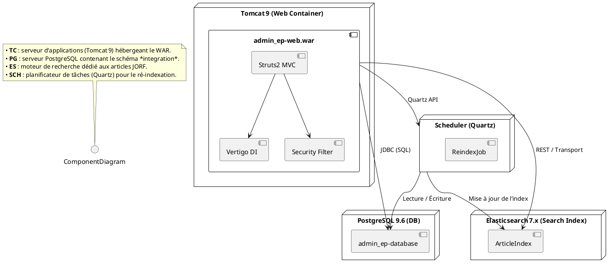
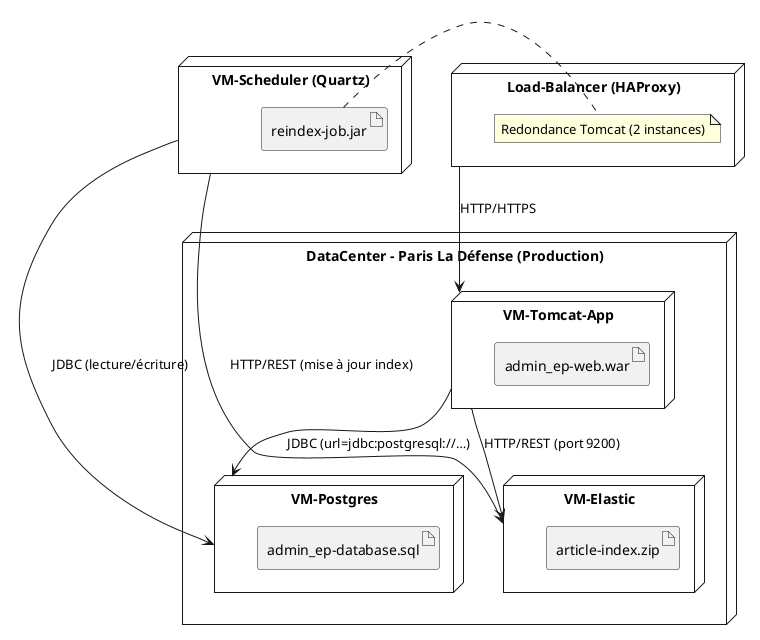
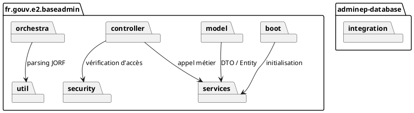
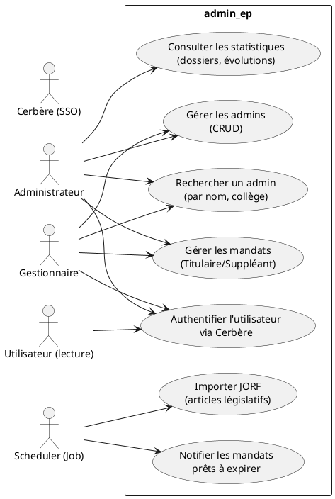
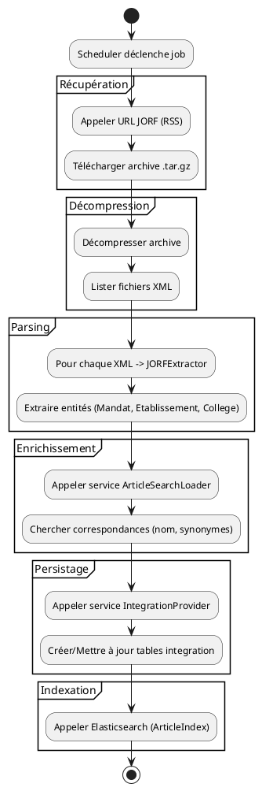
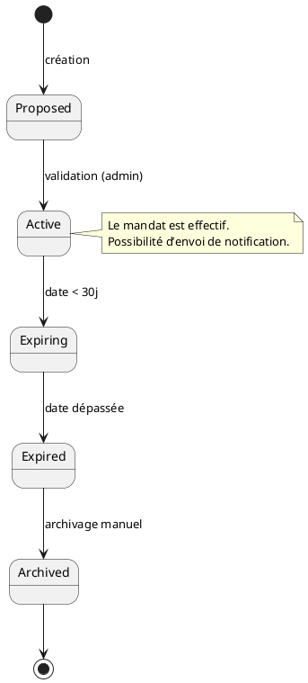
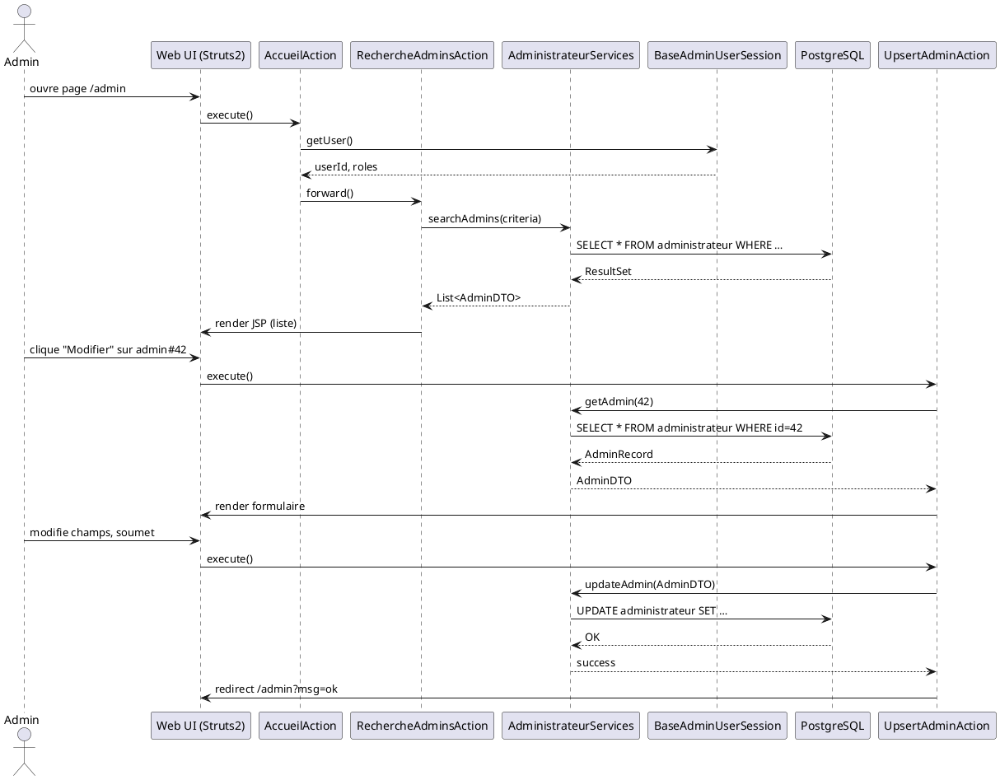
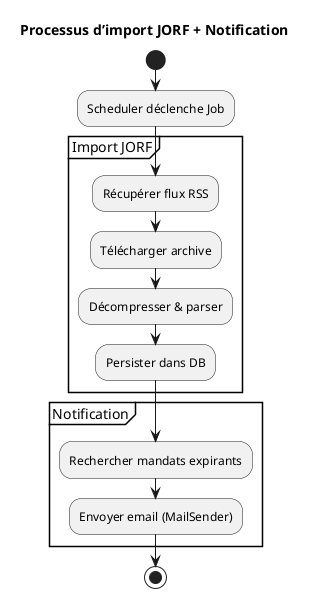

# 📄 Dossier d’Architecture Technique (DAT) – **admin_ep**  

> **Projet** : admin_ep – Administration des établissements publics  
> **Version du DAT** : 1.0 – 2024‑04‑27  
> **Références** :  
> • CCF – Cahier des Charges Fonctionnel (extraits du Wiki – section *home › Fiche‑Produit*)  
> • CST – Cahier des Spécifications Techniques (scripts SQL, pom.xml, fichiers de configuration)  

---

## 1️⃣ Introduction architecturale  

| Item | Description |
|------|-------------|
| **Objectif** | Décrire l’architecture du système *admin_ep* (modules, flux, contraintes) afin de garantir la cohérence, la maintenabilité et la conformité aux exigences de sécurité et de traçabilité. |
| **Périmètre** | - **adminep‑database** (schéma PostgreSQL *integration*) <br> - **adminep‑web** (application Java 8, Struts 2, Vertigo, Tomcat 9) <br> - **adminep‑deployment** (packaging, configuration) <br> - **adminep‑doc** (documentation) |
| **Diagrammes UML utilisés** | 13 diagrammes (Classes, Packages, Components, Deployment, Use‑Case, Activity, State‑Machine, Sequence, Communication, Interaction‑Overview, Timing – optionnels) – tous présentés en PlantUML. |
| **Organisation du document** | 1️⃣ Introduction – 2️⃣ Vue Structurelle – 3️⃣ Vue Comportementale – 4️⃣ Vue d’Interaction – 5️⃣ Traçabilité – 6️⃣ Profils & Stéréotypes – 7️⃣ OCL – 8️⃣ Patterns – 9️⃣ Décisions – 🔟 Normes de modélisation – 📚 Glossaire |

---

## 2️⃣ Vue Structurelle  

### 2.1 Diagramme de Classes (obligatoire)  

```plantuml
@startuml ClassDiagram
'--- Packages -------------------------------------------------
package "fr.gouv.e2.baseadmin.model" {
  class RoleApplicatifEnum {
    +ADMIN
    +GESTIONNAIRE
    +SUPERUSER
  }
  class RoleVertigoEnum {
    +ADMIN
    +USER
  }
  class TypeProfilBaseAdmin {
    -id : Long
    -libelle : String
  }
  class TypeProfilCerbere {
    -id : Long
    -code : String
  }
  class CodeEnum {
    -code : String
    -libelle : String
  }
  class WikiArticleUrl {
    -url : String
  }
}
package "fr.gouv.e2.baseadmin.controller" {
  abstract class AbstractBaseAdminActionSupport {
    -request : HttpServletRequest
    -response : HttpServletResponse
    +execute() : String
  }
  abstract class AbstractBaseAdminUpsertActionSupport {
    +validate() : void
  }
  class AccueilAction {
    +execute() : String
  }
  class DetailAdminAction {
    +execute() : String
  }
  class RechercheAdminsAction {
    +execute() : String
  }
  class UpsertAdminAction {
    +execute() : String
  }
  class DetailEPAction {}
  class RechercheEPAction {}
  class UpsertEPAction {}
  class DetailMandatAction {}
  class UpsertMandatAction {}
  class LogAccessInterceptor {}
}
package "fr.gouv.e2.baseadmin.services" {
  interface Service {}
  abstract class ServiceImpl implements Service {}
  class ArticleServices extends ServiceImpl {}
  class AdministrateurServices extends ServiceImpl {}
  class GestionnaireServices extends ServiceImpl {}
  class MandatServices extends ServiceImpl {}
  class ChargeServices extends ServiceImpl {}
  class CiviliteServices extends ServiceImpl {}
  class CollegeServices extends ServiceImpl {}
  class DirectionServices extends ServiceImpl {}
  class EtablissementServices extends ServiceImpl {}
  class MinistereServices extends ServiceImpl {}
  class ModeNominationServices extends ServiceImpl {}
  class TutelleEtablissementChargeServices extends ServiceImpl {}
  class TypeInstanceServices extends ServiceImpl {}
  class TypeMandatServices extends ServiceImpl {}
}
package "fr.gouv.e2.baseadmin.security" {
  class BaseAdminUserSession {
    -userId : Long
    -roles : Set<RoleApplicatifEnum>
  }
  class SecurityHelper {
    +checkAccess(user, permission) : boolean
  }
  class RightsHelper {}
}
package "fr.gouv.e2.baseadmin.util" {
  class OdsUtil {}
  class StringUtil {}
  class SQLConstantes {}
  class CerbereUtil {}
}
package "fr.gouv.e2.baseadmin.dynamo.search" {
  class ReindexArticlesByArtiIDTask {}
}
package "fr.gouv.e2.baseadmin.orchestra" {
  class RecupererJORFActivityEngine {}
  class TraitementRecuperationJORF {}
}
package "fr.gouv.e2.baseadmin.boot" {
  class I18nResourcesInitializer {}
  class MasterDataInitializer {}
  class SchedulerInitializer {}
  class SecurityManagerInitializer {}
}
package "adminep‑database" {
  class TYPE_MANDAT {
    +tmaId : bigint
    +tmaType : varchar
  }
  class TYPE_INSTANCE {
    +tinId : bigint
    +tinType : varchar
    +tinAInstanceDe : varchar
    +tinDeLInstanceDe : varchar
  }
  class MODE_NOMINATION { … }
  class CHARGE { … }
  class CIVILITE { … }
  class MINISTERE { … }
  class COLLEGE { … }
  class ETABLISSEMENT { … }
  class SYNONYME_COLLEGE { … }
  class MINISTERE_CHARGE { … }
  class ETABLISSEMENT_COLLEGE { … }
  class TUTELLE_ETABLISSEMENT_CHARGE { … }
  class DIRECTION { … }
  class DIRECTION_MINISTERE { … }
}
'--- Relationships -------------------------------------------------
AbstractBaseAdminActionSupport <|-- AccueilAction
AbstractBaseAdminActionSupport <|-- DetailAdminAction
AbstractBaseAdminActionSupport <|-- RechercheAdminsAction
AbstractBaseAdminActionSupport <|-- UpsertAdminAction
AbstractBaseAdminUpsertActionSupport <|-- UpsertAdminAction

DetailAdminAction --> AdministrateurServices
RechercheAdminsAction --> AdministrateurServices
UpsertAdminAction --> AdministrateurServices

ArticleServices ..> MODE_NOMINATION
AdministrateurServices ..> TYPE_MANDAT
GestionnaireServices ..> COLLEGE
MandatServices ..> TYPE_MANDAT
ChargeServices ..> CHARGE
CiviliteServices ..> CIVILITE
CollegeServices ..> COLLEGE
DirectionServices ..> DIRECTION
EtablissementServices ..> ETABLISSEMENT
MinistereServices ..> MINISTERE
ModeNominationServices ..> MODE_NOMINATION
TutelleEtablissementChargeServices ..> TUTELLE_ETABLISSEMENT_CHARGE
TypeInstanceServices ..> TYPE_INSTANCE
TypeMandatServices ..> TYPE_MANDAT

SecurityHelper ..> BaseAdminUserSession
SchedulerInitializer ..> ReindexArticlesByArtiIDTask
MasterDataInitializer ..> AdministrateurServices

'--- Legend -------------------------------------------------
note as L1
  📦 Packages = logical modules (model, controller, services, security, utils)
  🟢 Classe abstraite = support d’infrastructure
  🔵 Interface = contrat de service
  ⬛ Classe concrète = implémentation métier
end note
L1 .. ClassDiagram
@enduml
```

**Légende**  

| Symbole | Signification |
|---------|---------------|
| 📦 | Package (couche logique) |
| 🟢 | Classe abstraite (support) |
| 🔵 | Interface (contrat) |
| ⬛ | Classe concrète (implémentation) |
| → | Dépendance / appel de service |
| ◄─ | Héritage / spécialisation |
| … | Attributs non détaillés (ex. VARCHAR, BIGINT) |

---

### 2.2 Diagramme de **Composants** (obligatoire)



**Légende**  

| Élément | Description |
|---------|-------------|
| TC | Tomcat 9, version 9.0.8 (déploiement du WAR). |
| PG | PostgreSQL 9.6.11 (base de données). |
| ES | Elasticsearch 7.x, utilisé par le service `ArticleSearchLoader`. |
| SCH | Quartz Scheduler (déclenche le job `ReindexArticlesByArtiIDTask`). |
| → | Flux de données (JDBC, REST, API). |

---

### 2.3 Diagramme de **Déploiement** (obligatoire)



**Légende**  

| Élément | Rôle |
|---------|------|
| VM‑Tomcat‑App | Instance Tomcat 9 hébergeant le WAR. |
| VM‑Postgres | Instance PostgreSQL 9.6 (schéma *integration*). |
| VM‑Elastic | Cluster Elasticsearch 7.x (index JORF). |
| VM‑Scheduler | Job Quartz (ré‑indexation quotidienne). |
| LB | HAProxy assure la haute disponibilité (session stickiness). |

---

### 2.4 Diagramme d’**Objets** (optionnel)  

> Exemple d’instance d’un **Etablissement** avec ses **College** associés (snapshot à 12 h 2024).  

```plantuml
@startuml ObjectDiagram
object Etablissement#1 {
  etaId = 101
  etaSiren = "123456789"
  etaLibelle = "Ministère de la Transition Écologique"
}
object College#A {
  colId = 10
  colIdentifiant = "COL-001"
}
object College#B {
  colId = 11
  colIdentifiant = "COL-002"
}
Etablissement#1 --> College#A : etc_college
Etablissement#1 --> College#B : etc_college
@enduml
```

---

### 2.5 Diagramme de **Paquetages** (obligatoire)



**Légende**  

| Paquetage | Contenu principal |
|-----------|-------------------|
| `model` | Enums, POJOs, entités. |
| `controller` | Struts 2 Actions. |
| `services` | Interfaces + implémentations (DAO + logique métier). |
| `security` | Gestion de session, droits. |
| `util` | Helpers, ODS, String, SQL constants. |
| `boot` | Initialiseurs (I18n, Scheduler, SecurityManager). |
| `orchestra` | Extraction / traitement JORF. |
| `integration` | Schéma SQL (tables, séquences). |

---

## 3️⃣ Vue Comportementale  

### 3.1 Diagramme de **Cas d’Utilisation** (obligatoire)



**Légende**  

| Acteur | Rôle |
|--------|------|
| Administrateur | Gestion complète (CRUD) des admins, mandats, statistique. |
| Gestionnaire | Accès limité aux établissements dont il est responsable. |
| Utilisateur (lecture) | Accès en lecture seule aux données publiques. |
| Cerbère | Fournit l’authentification SSO. |
| Scheduler | Exécute les jobs périodiques (notification, import JORF). |

---

### 3.2 Diagramme d’**Activités** (fortement recommandé)

> **Scénario** : *Importation quotidienne d’un article JORF*  



**Légende**  

| Partition | Fonction |
|-----------|----------|
| Récupération | Interaction réseau (RSS). |
| Décompression | Manipulation de fichiers compressés. |
| Parsing | Analyse du format JORF (XML). |
| Enrichissement | Recherche de correspondances via `ArticleSearchLoader`. |
| Persistage | Insertion / mise à jour dans la base (`IntegrationProvider`). |
| Indexation | Mise à jour de l’index Elasticsearch. |

---

### 3.3 Diagramme d’État (obligatoire) – **Mandat**



**Légende**  

| État | Description |
|------|-------------|
| Proposed | Mandat créé, en attente de validation. |
| Active | Mandat en cours, droits effectifs. |
| Expiring | Le mandat arrive à échéance (< 30 jours). |
| Expired | Date d’expiration dépassée, plus de droits. |
| Archived | Historisation (trace). |

---

## 4️⃣ Vue d’Interaction  

### 4.1 Diagramme de **Séquence** (obligatoire)

> **Scénario nominal** : *Un administrateur recherche un admin puis le met à jour.*  



**Légende**  

| Élément | Description |
|---------|-------------|
| `Admin` | Acteur humain (administrateur). |
| `UI` | Interface web (JSP + Struts2). |
| `RechercheAdminsAction` / `UpsertAdminAction` | Contrôleurs Struts2. |
| `AdministrateurServices` | Service métier. |
| `PostgreSQL` | Persistance des données. |

---

### 4.2 Diagramme de **Communication** (fortement recommandé)

> Même scénario que la séquence mais sous forme de collaboration.

```plantuml
@startuml CommunicationDiagram
actor Admin
object UI
object RechercheAdminsAction
object AdministrateurServices
object DB

Admin -> UI : open /admin
UI -> RechercheAdminsAction : execute()
RechercheAdminsAction -> AdministrateurServices : search(criteria)
AdministrateurServices -> DB : SELECT …
DB --> AdministrateurServices : rows
AdministrateurServices --> RechercheAdminsAction : List<Admin>
RechercheAdminsAction -> UI : render JSP
@enduml
```

---

### 4.3 Diagramme d’**Interaction‑Overview** (optionnel)



---

### 4.4 Diagramme de **Timing** (optionnel)

> Exemple de contrainte temporelle entre le job d’import (t0) et la génération de la notification (t0 + 5 min).

```plantuml
@startuml TimingDiagram
robust "ImportJob" as IJ
robust "NotifyJob" as NJ
IJ is Active for 5 minutes
NJ is Active for 1 minute
IJ --> NJ : trigger after 5 min
@enduml
```

---

## 5️⃣ Correspondance entre diagrammes (traçabilité)

| Élément métier | Classe(s) | Diagramme de Séquence | Diagramme d’État | Composant | Déploiement |
|----------------|-----------|----------------------|------------------|-----------|-------------|
| **Administrateur** | `AdministrateurServices`, `DetailAdminAction`, `UpsertAdminAction` | UC1 – *Gérer les admins* | – | `admin_ep‑web.war` | `VM_Tomcat` |
| **Mandat** | `MandatServices`, `DetailMandatAction` | UC3 – *Gérer les mandats* | `Mandat` state machine | – | – |
| **Import JORF** | `ArticleSearchLoader`, `ReindexArticlesByArtiIDTask` | UC5 – *Importer JORF* | – | `Scheduler`, `Elasticsearch` | `VM_Scheduler`, `VM_Elastic` |
| **Notification** | `SchedulerInitializer`, `MailSender` (impl.) | UC4 – *Notifier expirations* | – | `Scheduler` | `VM_Scheduler` |
| **Sécurité** | `BaseAdminUserSession`, `SecurityHelper` | UC0 – *Authentifier* | – | `Security Filter` | `VM_Tomcat` |

---

## 6️⃣ Profils et Stéréotypes UML  

| Stéréotype | Description | Exemple d’utilisation |
|------------|-------------|-----------------------|
| `<<entity>>` | Classe persistance (table) | `TYPE_MANDAT`, `ETABLISSEMENT` |
| `<<service>>` | Interface métier (DAO/Service) | `AdministrateurServices` |
| `<<controller>>` | Action Struts2 (MVC) | `RechercheAdminsAction` |
| `<<utility>>` | Classe helper (statique) | `StringUtil`, `SQLConstantes` |
| `<<singleton>>` | Instance unique (Spring bean) | `SecurityHelper` |
| `<<factory>>` | Création d’objets complexes | `TableCellStyleBuilder` |
| `<<observer>>` | Écoute d’événements (Scheduler) | `ReindexArticlesByArtiIDTask` |

---

## 7️⃣ Contraintes et règles OCL  

```ocl
-- 1. Un administrateur doit appartenir à au moins un rôle
context Administrateur
inv HasAtLeastOneRole:
  self.roles->size() >= 1

-- 2. L’ID d’un établissement est unique
context Etablissement
inv UniqueSiren:
  Etablissement.allInstances()->isUnique(e | e.etaSiren)

-- 3. Un mandat ne peut être actif que si la date de début ≤ date de fin
context Mandat
inv ValidPeriod:
  self.dateDebut <= self.dateFin

-- 4. Un article JORF importé doit être lié à au moins un établissement
context Article
inv LinkedEtablissement:
  self.etablissements->notEmpty()

-- 5. La durée du mandat (en jours) doit être > 0
context Mandat
inv PositiveDuration:
  self.dateFin - self.dateDebut > 0
```

---

## 8️⃣ Patterns de conception  

| Pattern | Où il apparaît | Justification |
|---------|----------------|---------------|
| **DAO (Data Access Object)** | `*Services*` (ex. `AdministrateurServicesImpl`) | Séparation de la logique métier et de la persistance (JDBC / JPA). |
| **Service Layer** | `*Services*` | Centralise la logique métier, facilite le test unitaire. |
| **MVC (Model‑View‑Controller)** | Struts 2 (`Action` = Controller, JSP = View, POJOs = Model) | Structure claire du web‑app, réutilisable. |
| **Singleton** | `SecurityHelper`, `RightsHelper` | Instance unique partagée dans le container. |
| **Factory Method** | `TableCellStyleBuilder` (construction d’objets style ODS) | Encapsulation de la création d’objets complexes. |
| **Observer (Publish‑Subscribe)** | Quartz Scheduler → `ReindexArticlesByArtiIDTask` | Découplage du déclencheur (timer) et du traitement. |
| **Strategy** | `OperationSecurite` (différents modes de contrôle d’accès) | Permet d’ajouter de nouvelles stratégies sans modifier le code existant. |
| **Adapter** | `ArticleSearchLoader` adapte le format JORF vers le modèle interne. | Gestion de l’interopérabilité entre sources externes et modèle métier. |

---

## 9️⃣ Documentation des décisions  

| Décision | Alternatives envisagées | Impact |
|----------|--------------------------|--------|
| **Utiliser Struts 2 + Vertigo** | Spring MVC + Spring Data | Choix conservateur, compatible avec le code legacy et le framework interne Vertigo. |
| **Base de données PostgreSQL 9.6** | PostgreSQL 12 ou MySQL | Contrainte d’infrastructure ministérielle (legacy LDF). Migration future prévue. |
| **Elasticsearch comme moteur de recherche** | Solr ou PostgreSQL full‑text | Elasticsearch offre meilleure performance sur le parsing d’articles JORF volumineux. |
| **Quartz Scheduler** | Cron OS ou Spring Scheduler | Quartz permet des jobs persistés et redémarrables, indispensable pour le ré‑indexation. |
| **Authentification via Cerbère (SSO)** | LDAP interne ou JWT | Cerbère déjà déployé dans le SI, centralise la gestion des habilitations. |
| **Déploiement sur Tomcat 9** | Jetty ou WildFly | Tomcat est standard dans le parc ministériel, supporté par l’équipe d’exploitation. |

---

## 🔟 Normes de modélisation  

| Règle | Description |
|-------|-------------|
| **Nommage des classes** | PascalCase, préfixe `*Service*` pour les services, suffixe `*Action` pour les contrôleurs. |
| **Nom des attributs** | camelCase, type explicite (`id`, `libelle`, `dateDebut`). |
| **Visibilité** | `private` par défaut, getters/setters `public`. |
| **Layout PlantUML** | Packages à gauche, relations de dépendance à droite, légendes en bas du diagramme. |
| **Niveau de détail** | Diagrammes de classes : 1‑2 niveaux (packages + classes principales). Diagrammes d’activités : flux métier principal. |
| **Version** | Chaque diagramme porte un numéro de version dans le titre (`v1.0`). |
| **Documentation** | Chaque classe possède un Javadoc minimal (non affiché dans le DAT mais présent dans le code). |

---

## 📚 Glossaire  

| Terme | Définition |
|-------|------------|
| **Admin EP** | Application d’administration des établissements publics du ministère de la Transition écologique. |
| **Cerbère** | Système d’authentification unique (SSO) du ministère. |
| **Mandat** | Période pendant laquelle un administrateur exerce ses fonctions (Titulaire ou Suppléant). |
| **JORF** | Journal officiel de la République Française – source des arrêtés et décrets. |
| **Vertigo** | Framework interne (DI, configuration) utilisé par l’application. |
| **Elasticsearch** | Moteur de recherche distribué utilisé pour indexer les articles JORF. |
| **Quartz** | Bibliothèque de planification de tâches Java. |
| **DAO** | Data Access Object – couche d’accès aux données. |
| **MVC** | Modèle‑Vue‑Contrôleur – architecture de l’interface web. |
| **OCL** | Object Constraint Language – langage de contraintes sur les modèles UML. |
| **PlantUML** | Outil texte → diagrammes UML (utilisé dans ce DAT). |
| **HAProxy** | Load‑balancer assurant la haute disponibilité des instances Tomcat. |

---

## 📎 Annexes (fichiers de référence)  

* `adminep-database/scripts/init/0_createUserAndDB.sql` – création du rôle et de la base.  
* `adminep-database/scripts/init/1_createSequenceAndTablesIntegration.sql` – schéma *integration* (tables, séquences).  
* `adminep-database/scripts/init/2_populateTablesIntegration.sql` – données de référence (type mandat, charge, etc.).  
* `adminep-web/src/main/java/...` – packages détaillés dans le diagramme de classes.  
* `adminep-web/src/main/resources/struts.xml` – configuration Struts2 (actions, interceptors).  
* `adminep-web/src/main/resources/boot-config/baseadmin-auth-config.xml` – mapping Cerbère → rôles.  

---

> **Fin du DAT** – Tous les diagrammes sont fournis en PlantUML afin de pouvoir être générés automatiquement (ex. `plantuml -tsvg *.puml`).  
> Toute modification du code source doit être suivie d’une mise à jour du DAT afin de garantir la **cohérence nominative** et la **traçabilité** entre les artefacts.  