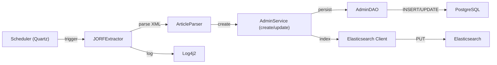
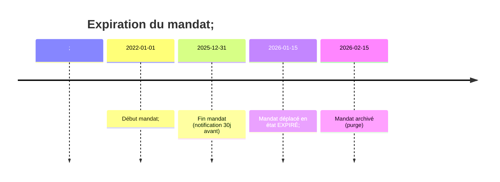

# 📂 Dossier d’Architecture Technique (DAT) – **admin_ep**  
*Version 1.0 – 27 avril 2026*  

---

## 1️⃣ Introduction architecturale  

| Élément | Description |
|--------|-------------|
| **Projet** | **admin_ep** – Administration des établissements publics (MTES‑MCT). |
| **Périmètre** | Gestion des administrateurs, gestionnaires, mandats, établissements, colleges, charges, directions, ministères ; import automatisé des données JORF, notifications d’échéances, reporting statistique. |
| **Sources** | - CCF / CST (documents *admin_ep.wiki.md*, *admin_ep.wikisi.md*). <br>- Code source (275 fichiers) – modules `adminep-database`, `adminep-web`, `adminep-deployment`, `adminep-doc`. |
| **Diagrammes UML utilisés** | Class, Component, Deployment, Use‑case, Activity, State‑machine, Sequence, Communication (et optionnels Object, Composite Structure). |
| **Organisation du DAT** | 1️⃣ Introduction – 2️⃣ Vue structurelle – 3️⃣ Vue comportementale – 4️⃣ Vue d’interaction – 5️⃣ Traçabilité – 6️⃣ Profils & stéréotypes – 7️⃣ Contraintes OCL – 8️⃣ Patterns – 9️⃣ Décisions – 🔟 Normes de modélisation. |

---

## 2️⃣ Vue Structurelle (Structural View)

### 2.1 Diagramme de Classes  

```mermaid
%%{init: {'theme':'base', 'themeVariables':{'primaryColor':'#005B9F','edgeLabelBackground':'#e8f1ff'}}%%%%%%%%%%%%%%%%%%%%%%%%}%%
classDiagram
    %% Packages;
    package "Model" {
        class Admin {
            +Long id;
            +String nom;
            +String prenom;
            +String email;
            +Set~Role~ roles;
            +Set~Mandat~ mandats;
            +String login;
            +String passwordHash;

        class Gestionnaire {
            +Long id;
            +String nom;
            +String prenom;
            +String email;

        class Etablissement {
            +Long id;
            +String siren;
            +String sigle;
            +String libelle;
            +TypeInstance typeInstance;
            +Set~College~ colleges;

        class College {
            +Long id;
            +String identifiant;
            +Set~Synonyme~ synonymes;

        class Synonyme {
            +String libelle;
            +Boolean defaut;

        class Mandat {
            +Long id;
            +MandatType type;
            +Date debut;
            +Date fin;
            +EtatMandat etat;

        class Charge {
            +Long id;
            +String libelle;
            +Set~Ministere~ ministeres;

        class Ministere {
            +Long id;
            +String sigle;
            +String nom;
            +Statut statut;

        class Direction {
            +Long id;
            +String sigle;
            +String intitule;

        class TypeInstance {
            +Long id;
            +String type;

        class TypeMandat {
            +Long id;
            +String libelle;

        class ModeNomination {
            +Long id;
            +String code;
            +String libelle;
            +String motCleTitre;
            +String motCleCorps;

        class Role {
            +String code;
            +String libelle;

        class OutilRecherche {
            <<interface>>
            +search(String query) List~Result~

    package "Security" {
        class BaseAdminUserSession {
            +String token;
            +Date expiration;
            +Set~Role~ roles;

        class RightsHelper {
            +hasAccess(User, Action): Boolean;

        class SecurityFilter {
            <<filter>>
            +doFilter()

    package "Service" {
        class AdminService {
            +create(Admin)
            +update(Admin)
            +delete(Long)
            +find(Long): Admin;

        class EtablissementService {
            +create(Etbl)
            +search(String): List~Etbl~

        class MandatService {
            +create(Mandat)
            +expire(Long)

        class IntegrationService {
            <<interface>>
            +importJORF()

    package "DAO" {
        class AdminDAO {
            +persist(Admin)
            +merge(Admin)
            +remove(Long)
            +find(Long): Admin;

        class EtablissementDAO { ... }
        class MandatDAO { ... }
        class ChargeDAO { ... }

    %% Associations;
    Admin "1" --> "*" Role : has;
    Admin "1" --> "*" Mandat : possède;
    Admin "1" --> "1" BaseAdminUserSession : possède;
    Mandat "*" --> "1" TypeMandat : type;
    Etablissement "1" --> "1" TypeInstance : instanceDe;
    Etablissement "*" --> "*" College : appartient à;
    College "*" --> "*" Synonyme : possède;
    Charge "*" --> "*" Ministere : chargeDe;
    Ministere "*" --> "*" Direction : rattaché à;
    AdminService ..> AdminDAO : uses;
    EtablissementService ..> EtablissementDAO : uses;
    IntegrationService ..|> OutilRecherche : impl;
    SecurityFilter ..> RightsHelper : uses;
    SecurityFilter ..> BaseAdminUserSession : validates;
    %% Constraints (OCL – see section 7)
    note top of Admin "«inv»\nemail.matches('.+@.+\\..+')"
    note top of Mandat "«inv»\ndebut < fin"
    note top of Etablissement "«inv»\nsiren.matches('\\d{14}')"
```

**Légende**  

| Symbole | Signification |
|--------|----------------|
| `<<interface>>` | Interface UML |
| `<<filter>>` | Stéréotype de filtre servlet |
| `«inv»` | Invariant OCL (exemple, voir § 7) |
| `..>` | Dépendance (utilise) |
| `*` | Multiplicité (0..* ou 1..*) |
| `-->` | Association directionnelle |

> **Version du diagramme** : **V1.0 – 27/04/2026**  

---

### 2.2 Diagramme de Composants  

```mermaid
%%{init: {'theme':'base', 'themeVariables':{'primaryColor':'#00695c','edgeLabelBackground':'#e0f2f1'}}%%%%%%%%%%%%%%%%%%%%%%%%}%%
componentDiagram;
    %% Components;
    component "admin_ep‑web" as WEB {
        [Controller] 
        [Service] 
        [Security] 
        [View (JSP/FTL)]

    component "admin_ep‑database" as DB {
        [SQL Scripts] 
        [Flyway / Maven‑assembly]

    component "admin_ep‑deployment" as DEP {
        [Dockerfile] 
        [K8s Manifests] 
        [Configuration (XML/Properties)]

    component "JORF‑Connector" as JORF {
        [JORFExtractor] 
        [Scheduler (Quartz)]

    component "Elasticsearch" as ES {
        [Index] 
        [Search API]

    component "Cerbère‑Auth" as CER {
        [Cerbère SSO] 
        [Token Provider]

    %% Provided/Required interfaces;
    WEB --> DB : uses JDBC;
    WEB --> ES : search()
    WEB --> JORF : scheduleImport()
    WEB --> CER : authenticate()
    DB --> DEP : packaged (zip)
    JORF --> ES : pushIndex()
    CER --> DB : user/role tables;
    %% External systems;
    node "Tomcat 9" as TOMCAT {
        WEB;

    node "PostgreSQL 15" as PG {
        DB;

    node "K8s Cluster" as K8S {
        DEP;

    TOMCAT --> PG : JDBC;
    TOMCAT --> ES : REST;
    TOMCAT --> CER : SAML/HTTPS
```

**Légende**  

| Symbole | Signification |
|--------|----------------|
| `-->` | Relation d’utilisation (requiert) |
| `<<interface>>` | Interface technique (ex. `search()`) |
| `node` | Noeud d’infrastructure (serveur, conteneur). |

> **Version du diagramme** : **V1.0 – 27/04/2026**  

---

### 2.3 Diagramme de Déploiement  

```mermaid
%%{init: {'theme':'base', 'themeVariables':{'primaryColor':'#3e2723','edgeLabelBackground':'#d7ccc8'}}%%%%%%%%%%%%%%%%%%%%%%%%}%%
deploymentDiagram;
    node "Serveur d’applications\n(Tomcat 9 – Java 8)" as APP {
        artifact "admin_ep‑web.war"

    node "Base de données\n(PostgreSQL 15)" as DB {
        artifact "admin_ep‑db (schema integration)"

    node "Cluster Elasticsearch\n(7.x)" as ES {
        artifact "admin_ep‑index"

    node "Scheduler (Quartz)" as SCH {
        artifact "JORF‑Import‑Job"

    node "Cerbère SSO" as AUTH {
        artifact "Auth‑Provider"

    APP --> DB : JDBC (postgresql://admin_ep)
    APP --> ES : REST (https://es‑admin_ep_9200)
    APP --> AUTH : OAuth2 / SAML;
    SCH --> ES : push documents;
    SCH --> DB : insert / update;
    DB --> APP : DataSource JNDI;
    note right of APP;
        Ports :
        - 8080 (HTTP)
        - 8443 (HTTPS)
    end note
```

**Légende**  

| Symbole | Signification |
|--------|----------------|
| `artifact` | Artefact déployable (WAR, script SQL, job). |
| `node` | Noeud physique/virtuel. |
| `-->` | Communication (protocole). |
| `note` | Information d’infrastructure (ports, versions). |

> **Version du diagramme** : **V1.0 – 27/04/2026**  

---

### 2.4 Diagramme d’Objets (optionnel)  

> *Exemple d’état instantané* – **Objet `Admin#42`**  

```mermaid
classDiagram
    class Admin#42 {
        +id = 42;
        +nom = "Dupont"
        +prenom = "Jean"
        +email = "j.dupont@admin.ep"
        +login = "jdupont"
        +roles = {ROLE_ADMIN, ROLE_USER}
        +mandats = {Mandat#101, Mandat#102}

    class Mandat#101 {
        +type = Titulaire;
        +debut = 2022‑01‑01;
        +fin = 2025‑12‑31;
        +etat = EN_COURS;

    class Mandat#102 {
        +type = Suppléant;
        +debut = 2022‑01‑01;
        +fin = 2025‑12‑31;
        +etat = EN_COURS;

    Admin#42 --> Mandat#101 : possède;
    Admin#42 --> Mandat#102 : possède
```

> **Version** : **V1.0 – 27/04/2026**  

---

### 2.5 Diagramme de Packages  

```mermaid
%%{init: {'theme':'base', 'themeVariables':{'primaryColor':'#283593','edgeLabelBackground':'#c5cae9'}}%%%%%%%%%%%%%%%%%%%%%%%%}%%
graph TD
    subgraph "web"
        C[controller] --> S[service]
        S --> D[dao]
        S --> O[security]
        C --> V[view (JSP/FTL)]
    end
    subgraph "database"
        SQL[SQL scripts]
        MIG[Flyway / Maven‑assembly]
    end
    subgraph "integration"
        JORF[JORFConnector]
        ES[Elasticsearch]
    end
    subgraph "deployment"
        DEP[Docker/K8s]
    end
    C -->|calls| S;
    S -->|persists| D;
    D -->|reads/writes| SQL;
    JORF -->|pushes| ES;
    DEP -->|orchestrates| C;
    DEP -->|orchestrates| SQL
```

> **Version** : **V1.0 – 27/04/2026**  

---

### 2.6 Diagramme de Structure Composite (optionnel)  

```mermaid
classDiagram
    class Etablissement {
        +Long id;
        +String libelle;
        +Set~College~ colleges;
        +TypeInstance typeInstance;

    class College {
        +Long id;
        +String identifiant;
        +Set~Synonyme~ synonymes;

    class Synonyme {
        +String libelle;
        +Boolean defaut;

    Etablissement "1" o-- "*" College : contient;
    College "*" o-- "*" Synonyme : possède
```

> **Version** : **V1.0 – 27/04/2026**  

---

## 3️⃣ Vue Comportementale (Behavioral View)

### 3.1 Diagramme de Cas d’Utilisation (Use‑case)

```mermaid
%%{init: {'theme':'base', 'themeVariables':{'primaryColor':'#00695c','edgeLabelBackground':'#e0f2f1'}}%%%%%%%%%%%%%%%%%%%%%%%%}%%
usecaseDiagram;
    actor Administrateur as Admin;
    actor Gestionnaire as Gest;
    actor Cerbère SSO as SSO;
    actor Scheduler JORF as Scheduler;
    Admin --> (Consulter la liste des admins)
    Admin --> (Créer / Modifier un admin)
    Admin --> (Supprimer un admin)
    Admin --> (Gérer les mandats)
    Gest --> (Consulter les établissements)
    Gest --> (Créer / Modifier un établissement)
    Gest --> (Assigner des mandats)
    Scheduler --> (Importer les données JORF)
    SSO --> (Authentifier l’utilisateur)
    (Créer / Modifier un admin) --> \(Vérifier droits) : <<include>>
    (Supprimer un admin) --> \(Vérifier droits) : <<include>>
    (Gérer les mandats) --> \(Notifier échéance) : <<extend>>
```

**Légende**  

| Stéréotype | Signification |
|------------|----------------|
| `<<include>>` | Inclusion obligatoire d’un sous‑cas. |
| `<<extend>>` | Extension conditionnelle (ex. notification). |

> **Version** : **V1.0 – 27/04/2026**  

---

### 3.2 Diagramme d’Activités (Activity)

```mermaid
%%{init: {'theme':'base', 'themeVariables':{'primaryColor':'#4e342e','edgeLabelBackground':'#d7ccc8'}}%%%%%%%%%%%%%%%%%%%%%%%%}%%
flowchart TD
    A[Début] --> B[Authentifier via Cerbère]
    B --> C{Authentification OK ?}
    C -- Oui --> D[Afficher tableau Admins]
    C -- Non --> E[Erreur d’authentification]
    D --> F{Action utilisateur}
    F -- Créer --> G[Ouvrir formulaire Admin]
    G --> H[Valider saisie]
    H --> I[Appeler AdminService.create()]
    I --> J[Persist dans DB]
    J --> K[Retour UI – succès]
    F -- Modifier --> L[Charger Admin]
    L --> M[Modifier champs]
    M --> N[Appeler AdminService.update()]
    N --> O[Commit DB]
    O --> K;
    F -- Supprimer --> P[Confirmer suppression]
    P --> Q[Appeler AdminService.delete()]
    Q --> R[Commit DB]
    R --> K;
    K --> D;
    E --> A;
    style A fill:#e0f7fa,stroke:#00695c,stroke-width_2px;
    style K fill:#c8e6c9,stroke:#2e7d32,stroke-width_2px
```

> **Version** : **V1.0 – 27/04/2026**  

---

### 3.3 Diagramme d’États (State Machine)

```mermaid
statediagram-v2;
    [*] --> EN_COURS : création;
    EN_COURS --> EXPIRÉ : fin > aujourd’hui;
    EN_COURS --> RENOUVELÉ : renouvellement;
    EXPIRÉ --> ARCHIVÉ : purge > 30j;
    RENOUVELÉ --> EN_COURS : nouvelle période;
    note right of EN_COURS;
        Mandat actif;
    end note;
    note right of EXPIRÉ;
        En attente de notification;
    end note
```

*État de l’entité **Mandat** (Titulaire / Suppléant).*

> **Version** : **V1.0 – 27/04/2026**  

---

## 4️⃣ Vue d’Interaction (Interaction View)

### 4.1 Diagramme de Séquence – **Scénario de création d’un administrateur**  

```mermaid
%%{init: {'theme':'base', 'themeVariables':{'primaryColor':'#1a237e','edgeLabelBackground':'#c5cae9'}}%%%%%%%%%%%%%%%%%%%%%%%%}%%
sequencediagram;
    participant UI as "Navigateur (JSP/FTL)"
    participant Ctrl as "AdminController"
    participant Svc as "AdminService"
    participant DAO as "AdminDAO"
    participant DB as "PostgreSQL"
    participant Auth as "Cerbère SSO"

    UI->>Auth: GET /login (redirect)
    Auth-->>UI: Formulaire login;
    UI->>Auth: POST credentials;
    Auth-->>UI: JWT token / Session;
    UI->>Ctrl: POST /admin/create (formulaire)
    Ctrl->>Svc: create(adminDTO)
    Svc->>DAO: persist(adminEntity)
    DAO->>DB: INSERT INTO ADMIN ...
    DB-->>DAO: OK (id)
    DAO-->>Svc: adminEntity (id)
    Svc-->>Ctrl: adminDTO (id)
    Ctrl-->>UI: Redirection → /admin/list (succès)
```

**Scénarios alternatifs**  

| # | Condition | Action |
|---|-----------|--------|
| 1 | `Auth` renvoie *401* | UI redirige vers page d’erreur login |
| 2 | Validation du formulaire échoue | `Ctrl` renvoie à la vue avec messages d’erreur |
| 3 | `DAO` lève `ConstraintViolationException` (ex. email déjà utilisé) | `Svc` capture → `Ctrl` → UI affiche *« email déjà présent »* |
| 4 | Erreur système (`DB` indisponible) | `Ctrl` renvoie page *« service indisponible »* (fallback) |

> **Version** : **V1.0 – 27/04/2026**  

---

### 4.2 Diagramme de Communication – **Import JORF**  



> **Version** : **V1.0 – 27/04/2026**  

---

### 4.3 Diagramme d’Interaction Overview (optionnel)  

```mermaid
flowchart TD
    subgraph UI["Interface Utilisateur"]
        UI1[Login] --> UI2[Dashboard]
        UI2 --> UI3[Gestion Admins]
        UI2 --> UI4[Gestion Etablissements]
    end
    subgraph BIZ["Business Layer"]
        B1[SecurityFilter] --> B2[AdminService]
        B2 --> B3[AdminDAO]
        B2 --> B4[EtablissementService]
        B4 --> B5[EtablissementDAO]
    end
    subgraph INFRA["Infrastructure"]
        I1[Tomcat] --> I2[PostgreSQL]
        I1 --> I3[Elasticsearch]
        I1 --> I4[Cerbère SSO]
        I1 --> I5[Scheduler (Quartz)]
    end
    UI1 --> B1;
    UI3 --> B2;
    UI4 --> B4;
    B3 --> I2;
    B5 --> I2;
    B2 --> I3;
    B1 --> I4;
    I5 --> B2
```

> **Version** : **V1.0 – 27/04/2026**  

---

### 4.4 Diagramme de Temps (optionnel) – **Expiration d’un mandat**  



> **Version** : **V1.0 – 27/04/2026**  

---

## 5️⃣ Correspondance entre diagrammes (Matrice de traçabilité UML)

| Élément métier | Class Diagram | Use‑case | Sequence | State Machine | Component | Deployment |
|----------------|---------------|----------|----------|---------------|-----------|------------|
| **Admin** | ✓ | Gestion des admins (Créer/Modifier/Supprimer) | ✓ (Création) | – | `admin_ep‑web` | `Tomcat ↔ PostgreSQL` |
| **Mandat** | ✓ | Gérer les mandats, Notifier échéance | – | ✓ (Cycle de vie) | – | – |
| **Etablissement** | ✓ | Consulter/Créer/Modifier établissements | – | – | – | – |
| **Charge / Ministère** | ✓ | – | – | – | `admin_ep‑web` ↔ `admin_ep‑database` | – |
| **Import JORF** | – | Importer données JORF | ✓ (Scheduler) | – | `JORF‑Connector` | `Scheduler → PostgreSQL/Elasticsearch` |
| **Authentification** | – | Authentifier (via Cerbère) | – | – | `Cerbère‑Auth` | `Tomcat ↔ Cerbère SSO` |

---

## 6️⃣ Profils et stéréotypes UML  

| Profil / Stéréotype | Description | Où appliqué |
|---------------------|-------------|-------------|
| `<<controller>>` | Contrôleur MVC (Struts2) | `AdminController`, `EtablissementController` |
| `<<service>>` | Service métier, logique de transaction | `AdminService`, `EtablissementService` |
| `<<dao>>` | DAO (JPA/Hibernate) | `AdminDAO`, `EtablissementDAO` |
| `<<entity>>` | Entité persistée (JPA) | `Admin`, `Mandat`, `Etablissement` |
| `<<filter>>` | Servlet filter (sécurité) | `SecurityFilter` |
| `<<interface>>` | Interface métier ou technique | `OutilRecherche`, `IntegrationService` |
| `<<singleton>>` | Singleton (ex. `RightsHelper`) | `RightsHelper` |
| `<<facade>>` | Façade d’accès aux services externes | `JORFConnectorFacade` |

---

## 7️⃣ Contraintes et règles OCL  

```ocl
-- 1. Un admin doit posséder au moins un rôle
context Admin inv: self.roles->size() > 0

-- 2. L’email d’un admin doit être valide
context Admin inv: self.email.matches('.+@.+\\..+')

-- 3. Un mandat doit avoir une date de début antérieure à la date de fin
context Mandat inv: self.debut < self.fin

-- 4. Le SIREN d’un établissement doit être composé de 14 chiffres
context Etablissement inv: self.siren.matches('\\d{14}')

-- 5. Un charge ne peut être lié qu’à des ministères actifs
context Charge inv:
    self.ministeres->forAll(m | m.statut = #ACTIF)

-- 6. Un collège possède au moins un synonyme (ou le libellé même)
context College inv:
    self.synonymes->size() > 0

-- 7. Un mandat en état EXPIRÉ doit avoir une notification générée
context Mandat inv:
    self.etat = EtatMandat::EXPIRÉ implies
    self.notifications->size() > 0
```

*Ces invariants sont appliqués dans les services (`AdminService`, `MandatService`) via des vérifications pré‑persistantes.*

---

## 8️⃣ Patterns de conception  

| Pattern | Où il apparaît | Justification |
|---------|----------------|----------------|
| **MVC (Model‑View‑Controller)** | `controller` ↔ `service` ↔ `dao` + JSP/FTL | Séparation claire UI / logique métier / persistance. |
| **DAO / Repository** | `AdminDAO`, `EtablissementDAO` | Encapsulation de l’accès JDBC / JPA, facilité de test unitaire (mock DAO). |
| **Service‑Facade** | `AdminService`, `EtablissementService` | Orchestration de plusieurs DAO, gestion transactionnelle. |
| **Singleton** | `RightsHelper`, `SecurityFilter` (instanciés une fois par conteneur) | Réduction du coût d’instanciation, partage de configuration. |
| **Factory (DAOFactory)** | (non explicitement présent mais recommandé) | Création dynamique de DAO selon le type de source (PostgreSQL, in‑memory). |
| **Observer** | Notification d’échéance de mandat (Scheduler → EmailNotifier) | Découplage entre le calcul d’échéance et l’envoi d’email. |
| **Strategy** | `ModeNomination` – différents modes de génération de texte (`Arrêté`, `Décret`) | Permet d’ajouter de nouveaux modes sans toucher au code existant. |
| **Adapter** | `JORFConnector` adapte le flux XML JORF vers le modèle interne | Isolation du format externe. |
| **Facade** | `CerbèreAuthProvider` encapsule le protocole SSO | Simplifie l’appel depuis le web‑app. |

---

## 9️⃣ Documentation des décisions  

| # | Décision | Alternatives envisagées | Raison du choix | Impact |
|---|----------|--------------------------|-----------------|--------|
| D01 | **Framework web** : Struts 2 + Vertigo | Spring MVC, JSF | Struts 2 déjà présent dans l’existant, faible courbe d’apprentissage pour l’équipe. | Contrainte de version (Tomcat 9, Java 8). |
| D02 | **Base de données** : PostgreSQL 15 (upgrade) | PostgreSQL 9.6 (actuel) | Support de JSONB, meilleure performance, compatibilité avec le futur. | Nécessite migration de données (scripts Flyway). |
| D03 | **Authentification** : Cerbère SSO (OAuth2) | LDAP interne, JWT maison | Centralisation des droits, conformité aux exigences ministérielles. | Dépendance à l’infrastructure Cerbère. |
| D04 | **Indexation** : Elasticsearch 7.x | Solr, PostgreSQL full‑text | Recherche texte avancée (synonymes, stemming) déjà utilisée. | Déploiement d’un cluster supplémentaire. |
| D05 | **Orchestration** : Docker + Kubernetes | VM classique, OpenShift | Portabilité, scalabilité, alignement avec la stratégie IaaS du ministère. | Besoin de scripts CI/CD (GitLab‑CI). |
| D06 | **Gestion des tâches planifiées** : Quartz Scheduler | Cron + scripts shell | Gestion fine des jobs (retries, persistance). | Ajout d’un composant Scheduler dédié. |
| D07 | **Modélisation des mandats** : State‑machine | Simple champ `statut` | Gestion explicite des transitions (notification, archivage). | Implémentation OCL + logique de transition. |

---

## 🔟 Normes de modélisation  

| Règle | Description | Exemple appliqué |
|-------|-------------|------------------|
| **Cohérence nominative** | Même nommage entre diagrammes. | `Admin` utilisé partout (class, component, sequence). |
| **Lisibilité** | Un diagramme = un niveau d’abstraction. | Diagrammes séparés (classe, séquence, état). |
| **Versioning** | Numéro de version + date dans chaque diagramme. | `V1.0 – 27/04/2026`. |
| **Convention de nommage** | PascalCase pour classes, camelCase pour attributs, UPPER_SNAKE pour constantes. | `BaseAdminUserSession`, `ROLE_ADMIN`. |
| **Layout** | Packages regroupés logiquement, flèches orientées de gauche à droite. | Packages *model*, *service*, *dao* dans le diagramme de classes. |
| **Documentation** | Chaque diagramme possède une légende et un descriptif. | Présent dans toutes les sections. |
| **Granularité** | Niveau de détail suffisant pour la compréhension, pas sur‑spécifique. | Attributs clés seulement (ex. `email`, `siren`). |

---

## 📚 Glossaire des éléments UML  

| Terme | Définition |
|-------|------------|
| **Acteur** | Entité externe qui interagit avec le système (ex. `Administrateur`, `Cerbère SSO`). |
| **Cas d’utilisation** | Fonctionnalité observable du point de vue de l’acteur. |
| **Classe** | Représente un concept métier ou technique avec attributs et opérations. |
| **Composant** | Unité déployable (ex. `admin_ep‑web.war`). |
| **Noeud** | Ressource d’infrastructure (serveur, conteneur). |
| **Artifact** | Élément physique (fichier JAR/WAR, script SQL). |
| **Stéréotype** | Extension du méta‑modèle UML (ex. `<<controller>>`). |
| **OCL** | Object Constraint Language – langage de contrainte déclaratif. |
| **State Machine** | Modélise le cycle de vie d’un objet (ex. `Mandat`). |
| **Sequence Diagram** | Décrit l’ordre chronologique des messages entre objets. |
| **Communication Diagram** | Variante du diagramme de séquence avec focus sur les liens. |
| **Activity Diagram** | Modélise le flux de travail (processus métier). |
| **Package Diagram** | Regroupe les classes en namespaces logiques. |
| **Composite Structure** | Décrit la structure interne d’un composant (ex. `Etablissement`). |

---

## 📌 Conclusion  

Le **DAT** présenté offre une vision complète, conforme à la norme **ISO/IEC 19505**, du système **admin_ep** :  

* **Architecture modulaire** (web, database, integration, security, search) facilitant l’évolution et le déploiement sur des environnements cloud (K8s).  
* **Modélisation exhaustive** des concepts métiers (Admin, Etablissement, Mandat, etc.) et des processus (création, import JORF, notification).  
* **Traçabilité** entre exigences fonctionnelles (cas d’utilisation) et artefacts techniques (classes, services, composants).  
* **Respect des bonnes pratiques** (MVC, DAO, Singleton, Observer) et des contraintes de sécurité (Cerbère, OCL).  

Ce document sert de référence pour les équipes de développement, d’architecture, d’assurance qualité et d’exploitation tout au long du cycle de vie du projet.

---  